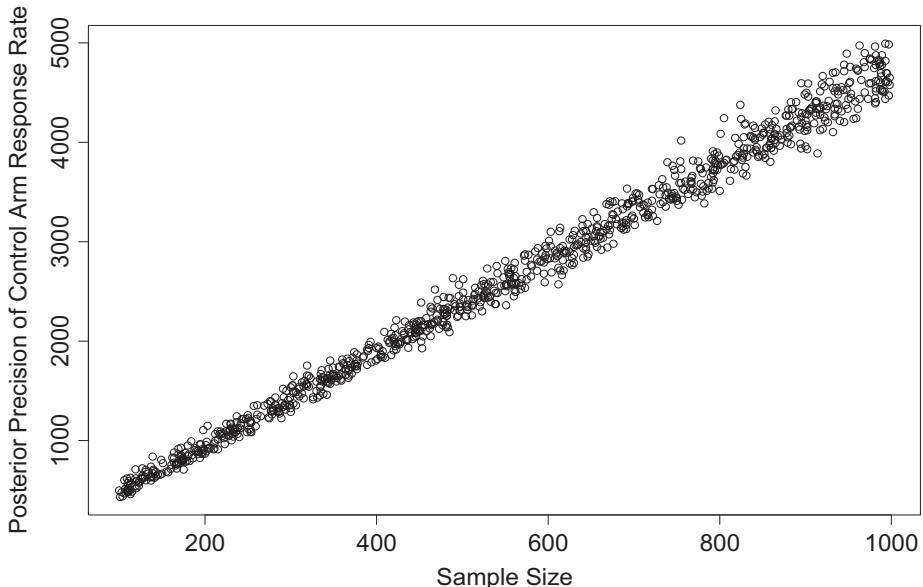
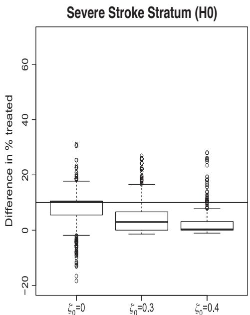
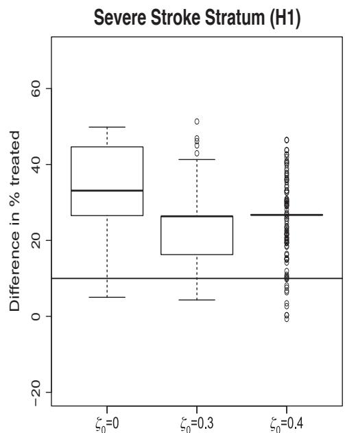
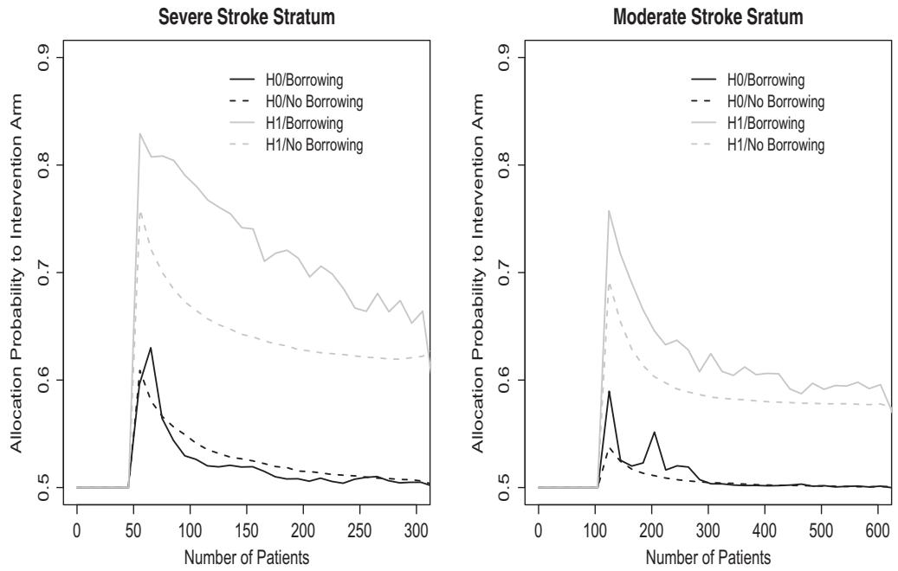
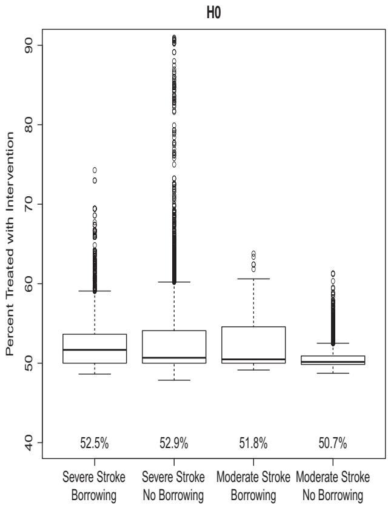
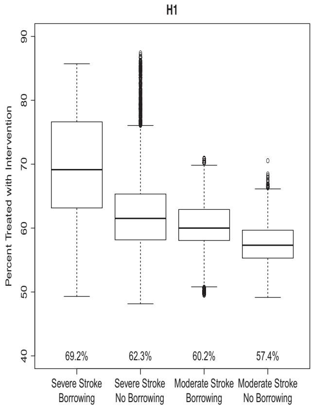
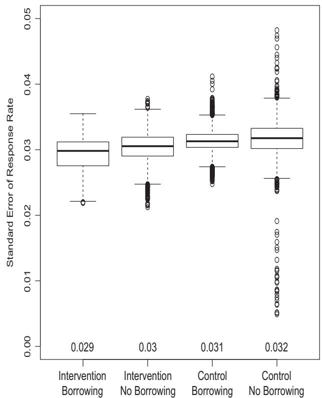
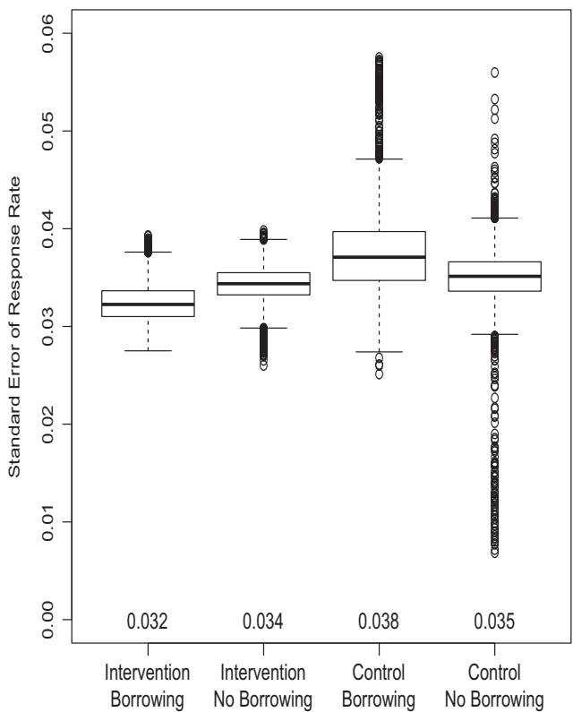

# Bayesian selective response-adaptive design using the historical control

Mi-Ok Kim1,4 Nusrat Harun1 Chunyan Liu2 Jane C. Khoury2 Joseph P. Broderick3

1UCSF Helen Diller Family Comprehensive Cancer Center, San Francisco, California, USA   
2Cincinnati Children's Hospital Medical Center, Cincinnati, Ohio, USA   
3Department of Neurology and Rehabilitation Medicine,University of Cincinnati College of Medicine, Cincinnati, Ohio, USA   
4Department of Epidemiology and Biostatistics, University of California San Francisco, San Francisco, California, USA

# Correspondence

Mi-Ok Kim, UCSF Helen Diller Family Comprehensive Cancer Center, San Francisco, CA 94143-0981, USA. Email: Miok.Kim@ucsf.edu

High quality historical control data, if incorporated, may reduce sample size, trial cost, and duration. A too optimistic use of the data, however, may result in bias under prior-data conflict. Motivated by well-publicized two-arm comparative trials in stroke, we propose a Bayesian design that both adaptively incorporates historical control data and selectively adapt the treatment allocation ratios within an ongoing trial responsively to the relative treatment effects. The proposed design differs from existing designs that borrow from historical controls. As opposed to reducing the number of subjects assigned to the control arm blindly, this design does so adaptively to the relative treatment effects only if evaluation of cumulated current trial data combined with the historical control suggests the superiority of the intervention arm. We used the effective historical sample size approach to quantify borrowed information on the control arm and modified the treatment allocation rules of the doubly adaptive biased coin design to incorporate the quantity. The modified allocation rules were then implemented under the Bayesian framework with commensurate priors addressing prior-data conflict. Trials were also more frequently concluded earlier in line with the underlying truth, reducing trial cost, and duration and yielded parameter estimates with smaller standard errors.

# KEYWORDS

Bayesian design with commensurate priors, borrowing on the historical control data, doubly adaptive biased coin design, response-adaptive design

# 1 INTRODUCTION

Historical data have conventionally been used for establishing parameters needed for designing a proposed clinical trial but have rarely been used for evaluating the scientific aims. High quality historical control data exist, for example, when the treatment of intervention arm of a successful historical trial serves as the treatment in the control arm of a proposed trial, as illustrated in a published stroke trial described later. Since a seminal article by Pocock,1 several researchers have proposed combining historical and concurrent controls in analysis2-4 by discounting historical data to account for between-trial heterogeneity. Despite careful selection of historical trials, study design, conduct, or subject population may differ so past information may not be relevant for the proposed trial. Bayesian designs were introduced to address such prior-data conflict by data adaptively determining the degree of borrowing on the control arm using power priors,5-7 commensurate priors,8-10 or meta-analytic-predictive priors.11 All this work, however, focused on reducing the number of study subjects assigned to the control group without taking into account the true relative treatment effects. This meant

This is an open access article under the terms of the Creative Commons Attribution-NonCommercial License, which permits use, distribution and reproduction in any medium, provided the original work is properly cited and is not used for commercial purposes.

© 2018 The Authors. Statistics in Medicine Published by John Wiley & Sons, Ltd.

assigning more trial participants to the intervention arm even if the intervention arm was inferior, which in many cases is not desirable, as the safety of the intervention arm has not been well established. In our work, we propose a Bayesian design that adaptively incorporates historical control data while selectively adapting the allocation ratios in response to the true response rates only when evaluation of the combined current trial and historical control data suggests superiority of the intervention arm. The proposed design, therefore, aims to reduce the number of subjects treated with the control arm only when the intervention arm is truly superior. In this sense, the proposed design is doubly adaptive, adaptive to both the prior-data conflict and to the true response rates.

The proposed design combines a response-adaptive randomization scheme selected from the literature with a Bayesian design that adaptively borrows on the historical control. We specifically combine the response-adaptive randomization scheme used in the doubly adaptive biased coin design (DBCD)12 and a Bayesian design using commensurate priors.10 These choices have some advantages; the DBCD randomization is known to perform less variably compared to sequential maximum likelihood estimate procedures.13 Nevertheless, the choices are largely arbitrary and other response-adaptive randomization schemes including Bayesian designs borrowing on the historical control can be considered.

From the response-adaptive randomization point of view, the proposed design may better realize the purported therapeutic advantages of adaptive randomization in a two-arm comparative trial. Compared with conventional fixed designs, response-adaptive randomization is believed to improve the trial participants' outcomes by skewing allocation probabilities in favor of better performing arms at the time of randomization and, hence, are ethically superior and desirable.14,15 Apart from controversies over the ethics of adaptive randomization,16 the purported therapeutic advantages have also been questioned: the advantages were reported to exist only when the true relative effects differ greatly, and consequently, the purported therapeutic advantages were rarely realized in practice.17-19 The advantages, if they exist, also disappeared when trials were allowed to stop early for efficacy or futility.17 We shall evaluate whether the proposed Bayesian design overcomes these shortcomings. Comparative two-arm trials typically include interim analyses for early stopping for efficacy or futility, and the primary endpoints are frequently observed after a defined time delay. The challenge of delayed responses has been addressed by utilizing correlated short-term endpoints, and varying degree of efficiency gains by the strength of the correlation was reported (see the work of Kim et al20 for example). Huang et al21 proposed a Bayesian joint modeling approach utilizing short-term outcomes, which we adapted here. We also accommodated interim analyses in the proposed two-arm trial design.

This paper is organized as follows. Section 2 describes a published stroke trial for a motivating study. The proposed new Bayesian design will be introduced in Section 3. Empirical study results will be presented in Section 4, and a summary and discussion will be presented in Section 5.

# 2 CASE STUDY

Two well-known stroke trials, the National Institute of Neurological Disorders and Stroke t-PA Stroke Study (NINDS) and the Interventional Management of Stroke (IMS) III trial, are used to illustrate the proposed design. The NINDS trial demonstrated the efficacy of recombinant tissue plasminogen activator (rt-PA) compared with a placebo control.22 Small randomized trial23 and two single-group trials24,25 reported improved efficacy of intravenous rt-PA (IV rt-PA) followed by endovascular therapy. Based on this preliminary work, the IMS III trial evaluated the efficacy of combining IV rt-PA with intra-arterial recanalization endovascular therapy against the IV rt-PA alone control in moderate/severe stroke patients. The NINDS trial included 126 subjects with moderate and 56 subjects with severe stroke (severity at baseline as measured by the NIH Stroke Scale [NIHSS]) treated with IV rt-PA alone who would have satisfied the eligibility criteria of the IMS III. Both trials were similar in the subject population and study conduct. We refer to the work of Khatri et al26 for details.

The primary outcome in the IMS III trial was a successful recovery assessed at 90 days post stroke defined by the modified Rankin Score (0-2 on a 6-point scale). The trial targeted to enroll a maximum of 900 participants with three interim analyses planned when respectively 25%, 50%, and 75% of the target sample had the primary outcome observed. The participants were randomized in a 2:1 ratio to favor the combined therapy. The O'Brien and Fleming spending rules27 were used to determine the efficacy boundaries of the interim analyses to ensure the overall type I error rate at 5%. The criterion for early stopping for futility was prespecified as having less than 20% conditional power under the alternative hypothesis. The IMS III trial was designed to have 80% power detecting overall 10% absolute difference in the primary outcome (assuming 40% for control and 50% for the intervention arm). The trial stopped for futility after enrolling 656 participants. A post hoc analysis by stroke severity observed that the intervention arm had a lower response rate in the moderate stroke stratum by 1.0% but a higher response by 6.8% in the severe stroke stratum.

The post hoc analysis and the preceding NINDS rt-PA trial motivated the proposed design. The proposed design is stratified by baseline stroke severity to allow independent adaptation of treatment allocation and evaluation of the relative effect of the combined approach within each stratum. The fixed 2:1 ratio in the original trial also suggests that the new design incorporating the NINDS trial data to reduce the numbers of subjects needed in the concurrent control arm if the intervention arm is truly superior represents a potentially superior approach.

The IMS III stroke trial exhibits common features of two-arm comparative trials, which can be challenging to accommodate for a response-adaptive trial. The primary outcome of a successful recovery assessed at 90 days post stroke was not completely observed in all previously enrolled study subjects when a new subject was available for randomization and allocation probabilities needed to be updated. Fifty percent of the time, 20 or more new subjects in the moderate stratum and 6 or more new subjects in the severe stroke stratum, had been enrolled before the primary outcome was completely observed in previously randomized subjects. Randomization can be adapted based on complete data only. The complete data only application, however, was shown reducing the efficiency of adaptive randomization.20,21 Clinical trials commonly collect many short-term outcomes, some of which are predictive of the long-term outcomes. Approaches that mitigate the impact of the delay by utilizing observed predictors of the delayed outcome20,21 have been proposed. In the IMS III stroke trial subjects were assessed at 24 hours post stroke for severity of their condition, an improvement (decrease) of 4 points or more from the baseline assessment measured on the NIHSS score was predictive of a successful recovery at 90 days post stroke. We utilized this short-term predictor information similarly as the joint likelihood approach proposed21 to mitigate the impact of the delayed primary outcome.

# 3 METHODS

The proposed design incorporates the DBCD response-adaptive randomization scheme12 in a Bayesian design using commensurate priors.10 It uses both the cumulating concurrent trial data and the historical control data to estimate the expected values of the primary outcome in each treatment group and updates allocation probabilities only if the primary outcome estimates suggest superiority of the intervention arm. We modify the treatment allocation probability computation to account for the additional information provided to the control group by the historical data. The effective historical sample size (EHSS) approach10 is used to quantify the borrowed historical data information in the control arm. For clarity of exposition, we first describe the likelihood for the delayed primary endpoint that incorporates the short-term predictor outcome. We then describe how the commensurate priors and the effective sample size computation are adapted for the proposed design. Lastly, we describe how to modify the allocation probability computation to selectively adapt to the response and to account for the additional historical control data.

# 3.1 The joint outcome model

We use the trial context of the motivating example. We let $T _ { i }$ be the treatment indicator with $T _ { i } = 1$ for the intervention arm, $X _ { i }$ denote the strata, $Z _ { i }$ denote the short-term predictor, and $Y _ { i }$ denote the primary endpoint. We assume $Y _ { i }$ may not be observable immediately, whereas $X _ { i }$ and $Z _ { i }$ are. In the motivating example, the primary endpoint of a successful recovery was determined at 90 days post stroke if a study subject survived beyond the assessment or was determined as a failure whenever subjects died within 90 days. In order to account for the delayed response, we let $U _ { i }$ denote times to death and are censored at some fixed time $u _ { 0 }$ (post 90 days assessment time) with $\delta _ { i } = 1$ denoting observed deaths within the time $u _ { 0 }$ . Given $( X _ { i } , T _ { i } , Z _ { i } ) \ : = \ : ( x , t , z )$ , we assume $U _ { i }$ are independent and identically distributed with the hazard and survival functions respectively denoted by $h ( u | x , t , z )$ and S(u x, t, z). We further assume the following models:

$$
\begin{array}{l} Z _ {i} \mid X _ {i} = x, T _ {i} = t \sim i. i. d. \text {Bernoulli} (\alpha (x, t)), \\ U W _ {i} = T _ {i} = T _ {i} = 2 \text {and} T _ {i} = 1 \text {and} T _ {i} = 0. \end{array} \tag {1}
$$

$$
Y _ {i} | X _ {i} = x, T _ {i} = t, Z _ {i} = z, \delta_ {i} = 0 \sim i. i. d. B e r n o u l l i (\beta (x, t, z)),
$$

where $\alpha ( x , t ) = P ( Z _ { i } = 1 | X _ { i } = x , T _ { i } = t ) { \mathrm { a n d } } \beta ( x , t , z ) = P ( Y _ { i } = 1 | X _ { i } = x , T _ { i } = t , Z _ { i } = z , \delta _ { i } = 0 )$ . Then, the probability of a successful recovery of the treatment arm t in the stroke stratum x is given by

$$
\begin{array}{l} \mu (x, t) = \sum_ {z} P (Z = z) P (Y = 1 \& U > u _ {0} | X = x, T = t, Z = z) \tag {2} \\ = \sum_ {z} P (Z = z) P (U > u _ {0} | X = x, T = t, Z = z) P (Y = 1 | X = x, T = t, Z = z, U > u _ {0}) \\ = \alpha (x, t) S (u _ {0} | x, t, z = 1) \beta (x, t, z = 1) + \{1 - \alpha (x, t) \} S (u _ {0} | x, t, z = 0) \beta (x, t, z = 0). \\ \end{array}
$$

When the mth subject is enrolled and ready for treatment assignment, observations would be incomplete in the previously enrolled subjects who are alive $( \delta _ { i } = 0 )$ but have not yet survived to the primary assessment time $u _ { 0 } .$ . We treat the unobserved $( U _ { i } , \delta _ { i } , Y _ { i } )$ as missing at random and do single imputation. We suppose that a maximum N number of subjects would enroll in the current trial sequentially with $d _ { 1 } , \dots , d _ { N }$ denoting the delayed entry times since the inception of the trial. When $d _ { m } - d _ { i }$ denote the observed survival time censored at the entry of the mth subject, we impute using the posterior distribution conditioning on $d _ { m } - d _ { i }$ . We let $( u _ { i } ( m ) , \delta _ { i } ( m ) , y _ { i } ( m ) )$ denote the imputed values for $U _ { i } > d _ { m } - d _ { i }$ or the observed values for $U _ { i } \ \leq \ d _ { m } \ - \ d _ { i }$ . When ?? denotes a vector of parameters involved with ??(x, t), ??(x, t, z), and h(u x, t, z) for the current trial, we have the following log-likelihood for ?? from the concurrent trial subject i:

$$
\begin{array}{l} l _ {i (m)} (\boldsymbol {\theta}) = z _ {i} \log \left\{\frac {\alpha (x _ {i} , t _ {i})}{1 - \alpha (x _ {i} , t _ {i})} \right\} + \log \{1 - \alpha (x _ {i}, t _ {i}) \} \tag {3} \\ + \delta_ {i} (m) \log h (u _ {i} (m) | x _ {i}, t _ {i}, z _ {i}) + \log S (u _ {i} (m) | x _ {i}, t _ {i}, z _ {i}) \\ + (1 - \delta_ {i} (m)) \left[ y _ {i} (m) \log \left\{\frac {\beta (x _ {i} , z _ {i} , t _ {i})}{1 - \beta (x _ {i} , z _ {i} , t _ {i})} \right\} + \log \{1 - \beta (x _ {i}, z _ {i}, t _ {i}) \} \right]. \\ \end{array}
$$

When $D _ { ( m ) }$ denotes the current trial data available at the time of treatment allocation of the mth subject, the likelihood for ?? is given by $\begin{array} { r } { L ( \pmb { \theta } | \mathcal { D } _ { ( m ) } ) = \exp \{ \sum _ { i = 1 } ^ { m - 1 } l _ { i ( m ) } ( \pmb { \theta } ) \} } \end{array}$ .

We assume the same modeling assumptions also hold for the historical control data $D _ { 0 }$ of sample size $N _ { 0 }$ . When $\theta _ { 0 }$ denotes the vector of the parameters involved with the historical control models, $l _ { j ( N _ { 0 } ) } ( \theta _ { 0 } )$ respectively denotes the control group log-likelihood from the historical trial subject j with $( u _ { j } ( N _ { 0 } ) , \delta _ { j } ( N _ { 0 } ) , y _ { i } ( N _ { 0 } ) )$ denoting the completely observed observation. Then, the likelihood for $\theta _ { 0 }$ is given by: $\begin{array} { r } { L _ { 0 } ( \theta _ { 0 } | D _ { 0 } ) = \exp \{ \sum _ { i = 1 } ^ { N _ { 0 } } l _ { i ( N _ { 0 } ) } ( \theta _ { 0 } ) \} } \end{array}$ . Then, the likelihood that combines both the current trial and the historical control data is given by

$$
L (\boldsymbol {\theta}, \boldsymbol {\theta} _ {0} | \mathcal {D} _ {(m)}, \mathcal {D} _ {0}) = L (\boldsymbol {\theta} | \mathcal {D} _ {(m)}) L _ {0} (\boldsymbol {\theta} _ {0} | \mathcal {D} _ {0}).
$$

We extend the commensurate priors10 to this multivariate setting. We assume ?? and $\theta _ { 0 }$ are ??−variate vectors with the elements denoted respectively by $\theta _ { ( l ) }$ and $\theta _ { 0 ( l ) }$ for $l = 1 , \ldots , \nu .$ . The priors of ?? given $\theta _ { 0 }$ is defined as follows:

$$
p (\boldsymbol {\theta} | \boldsymbol {\theta} _ {0}, \boldsymbol {\omega}) = \prod_ {l = 1} ^ {v} \phi (\boldsymbol {\theta} _ {l} | \boldsymbol {\theta} _ {0 (l)}, \tau_ {l}) \pi (\tau_ {l} | \boldsymbol {\omega}), \tag {4}
$$

where $\phi ( \cdot | \theta _ { 0 ( l ) } , \tau _ { l } )$ are the probability density functions of Gaussian random variables with the mean $\theta _ { 0 ( l ) }$ and the variance $1 / \tau _ { l } , l = 1 , \dots , \nu .$ . The amount of commensurability for cross-study borrowing is controlled by the hyperparameters $\tau _ { l } ,$ and the priors $\pi ( \tau _ { l } | \boldsymbol { \omega } )$ are given by “spike and slab” distributions28 that are mixture of uniform distributions and point probability distributions (see the Appendix for details). This prior has shown desirable bias-variance trade-offs for estimating concurrent effects in a univariate setting where a time-to-event outcome model was similarly assumed.10

# 3.2 Effective historical sample size

We compute EHSS following the work of Hobbs et al.10 Under the sequential enrollment considered here, when the mth study subject is ready for treatment assignment, the posterior distribution of ?? based only on the current trial data is

$$
q ^ {*} (\theta | \mathcal {D} _ {(m)}) \propto p (\theta) L (\theta | \mathcal {D} _ {(m)}), \tag {5}
$$

where $p ( \theta )$ is a noninformative prior distribution for ??. In contrast, the posterior distribution of ?? based on both the historical and current trial data is

$$
q (\boldsymbol {\theta} | \mathcal {D} _ {(m)}, \mathcal {D} _ {0}) \propto L (\boldsymbol {\theta} | \mathcal {D} _ {(m)}) \int_ {\boldsymbol {\theta} _ {0}} p (\boldsymbol {\theta} | \boldsymbol {\theta} _ {0}, \boldsymbol {\omega}) p _ {0} (\boldsymbol {\theta} _ {\boldsymbol {0}}) L _ {0} (\boldsymbol {\theta} _ {\boldsymbol {0}} | \mathcal {D} _ {0}) \mathrm{d} \boldsymbol {\theta} _ {\boldsymbol {0}}, \tag {6}
$$

where $p _ { 0 } ( \theta _ { \mathbf { 0 } } )$ similarly denotes a noninformative prior distribution for $\theta _ { 0 }$ . We let ${ \mathcal { P } } _ { x } ^ { * } ( D _ { ( m ) } )$ and $\mathcal { P } _ { x } ( D _ { 0 } , D _ { ( m ) } )$ be the posterior precisions of $\mu _ { x } ( t = 0 ) , x = 0 , 1$ , the control arm response rate estimates by strata, drawn from the posterior distributions (5) and (6), respectively. We also let $n _ { ( m ) } ( x ,$ t) denote the numbers of subjects previously assigned to the treatment arm t in the stratum x at the time when the mth subject is ready for treatment assignment. Given a linear relationship between the sample size and the posterior precisions, the EHSS in the stroke stratum x is approximated by

$$
E H S S _ {x (m)} \approx \left\{\sum_ {t} n _ {(m)} (x, t) \right\} \left\{\frac {\mathcal {P} _ {x} (\mathcal {D} _ {0} , \mathcal {D} _ {(m)})}{\mathcal {P} _ {x} ^ {*} (\mathcal {D} _ {(m)})} - 1 \right\}, x = 0, 1. \tag {7}
$$

If the historical data is highly commensurate with the current trial data, there will be large gain in precision and a large value for $E H S S _ { x ( m ) }$ will result.

# 3.3 Response-adaptive randomization

We adapt the DBCD response-adaptive randomization scheme12 to incorporate borrowing from the historical control via $E H S S _ { x ( m ) }$ and only to adapt if the superiority of the intervention arm is supported. DBCD is an adaptive randomization design constructed to target prespecified allocation proportions. With the probability of a successful recovery given by $\mu _ { x } ( t )$ in (2), we used the following allocation targets for the intervention group (t = 1) by the stroke strata:

$$
\rho_ {x} = \left\{ \begin{array}{l l} \frac {\{\mu_ {x} (t = 1) \} ^ {\gamma}}{\{\mu_ {x} (t = 1) \} ^ {\gamma} + \{\mu_ {x} (t = 0) \} ^ {\gamma}} & \quad \text { for } \gamma = 3 / 4, \quad \text { if } x = 0, \\ \frac {1 - \mu_ {x} (t = 0)}{1 - \mu_ {x} (t = 1) + 1 - \mu_ {x} (t = 0)}, & \quad \text { otherwise }. \end{array} \right.
$$

The targets were chosen based on the minimum effect size considered in the motivating example, that is, increasing the response rates per stratum by 10% or more. The most common choice for the allocation target in the severe stroke stratum $( x = 0 )$ is one with $\gamma = 1 / 2$ but was not expected to yield the intended 10% or more increase.

We suppose that the mth subject ready for randomization is enrolled in the stratum x. The DBCD randomization scheme12 assesses the proximity of the current sample proportion assigned to the intervention to the estimated target and determines the allocation probability of assigning the mth subject to the intervention arm using the following function:

$$
\nu \left\{\hat {\rho} _ {x (m)}, r _ {x} (m) \right\} = \frac {\hat {\rho} _ {x (m)} \left(\frac {\hat {\rho} _ {x (m)}}{r _ {x} (m)}\right) ^ {\xi}}{\hat {\rho} _ {x (m)} \left(\frac {\hat {\rho} _ {x (m)}}{r _ {x} (m)}\right) ^ {\xi} + (1 - \hat {\rho} _ {x (m)}) \left(\frac {(1 - \hat {\rho} _ {x (m)})}{(1 - r _ {x} (m))}\right) ^ {\xi}}, \tag {8}
$$

where $\hat { \rho } _ { x ( m ) }$ and $r _ { x } ( m )$ denote the estimated allocation target and the current sample proportion assigned to the intervention at the time, respectively. $\hat { \rho } _ { x ( m ) }$ was computed using the posterior means and $\xi = 2$ was recommended in the work of Rosenberger and Hu.29 We modified the computation of $r _ { x } ( m )$ to account for the additional information provided by the historical control

$$
r _ {x} (m) = \left\{n _ {(m)} (x, t = 1) \right\} / \left\{\sum_ {t} n _ {(m)} (x, t) + E H S S _ {x (m)} \right\}.
$$

Compared with no borrowing, the denominator increases by the borrowed historical control information, making $r _ { x } ( m )$ smaller. If adaptive randomization is invoked, then the allocation probability to the intervention arm $\nu \{ \hat { \rho } _ { x ( m ) } , r _ { x } ( m ) \}$ } will be more favorably skewed.

The proposed Bayesian design adapts the allocation probabilities selectively only if an evidence exists for the superiority of the intervention arm. It has the following adaptive randomization scheme.

1. Enroll a total $N ^ { * }$ number of subjects across the strata using equal randomization within each stratum.   
2. If $P \{ \mu _ { x } ( t = 1 ) - \mu _ { x } ( t = 0 ) ) > \eta _ { 0 } \} > \zeta _ { 0 }$ for some $0 < \eta _ { 0 } , \zeta _ { 0 } < 1$ , allocate each subject to the intervention arm adaptively by the allocation probabilities given in (8). Otherwise, allocate equally between the treatment arms.   
3. Conduct interim analyses when the total number of enrolled subjects across the strata reaches 50% or 75% of the maximum sample size N. In the interims,

(a) stop for efficacy if $P \{ \mu _ { x } ( t = 1 ) - \mu _ { x } ( t = 0 ) ) > \eta _ { e } \} > \zeta _ { e } ;$   
(b) stop for futility if $P \{ \mu _ { x } ( t = 1 ) - \mu _ { x } ( t = 0 ) ) > \eta _ { f } \} < \zeta _ { f } .$

4. When the total number of enrolled subjects across the strata reaches the maximum sample size N, conduct the final analysis. At the final analysis,

(a) conclude for efficacy if $P \{ \mu _ { x } ( t = 1 ) - \mu _ { x } ( t = 0 ) ) > \eta _ { e } \} > \rho _ { e } ;$   
(b) conclude for futility if $P \{ \mu _ { x } ( t = 1 ) - \mu _ { x } ( t = 0 ) ) > \eta _ { f } \} < \rho _ { f } .$

$\eta _ { 0 } , \eta _ { e } ,$ and $\eta _ { f }$ are predetermined by clinically meaningful differences as illustrated in the motivating example later. $\zeta _ { 0 } , \zeta _ { e } , \zeta _ { f } , \rho _ { e } ,$ , and ??f are tuning parameters. $\zeta _ { 0 }$ is set to reduce the probability of assigning sizably more subjects, for example, 10% of the enrolled subjects, to the inferior treatment arm. $\zeta _ { e }$ and $\zeta _ { f }$ can be set differently for each interim but to collectively control the overall type I error rate and the overall type II error along with $\rho _ { e }$ and $\rho _ { f }$ at certain rates. More details of determining the values of the tuning parameters are provided in the next section.

# 4 EMPIRICAL STUDIES

We used the motivating stroke trial data and designed simulation studies to evaluate the performance of the proposed design. We assumed perfect commensurability and generated both the historical control and the concurrent trial data in the same way: simulated data consist of observations $( d _ { i } , X _ { i } , Z _ { i } , U _ { i } , \delta _ { i } , Y _ { i } )$ , where $( d _ { i } , X _ { i } , U _ { i } )$ were resampled from the observed data and $( Z _ { i } , \delta _ { i } , Y _ { i } )$ were generated from common outcome models. A subset of 182 subjects in the NINDS trial met the eligibility criteria of the IMS III trial, and we simulated a sample of 182 for the historical control data. For the current trial data, we simulated a sample of N = 900 (600 for the moderate and 300 for the severe stratum, approximately). We used one historical control data for all simulations conducted under the same parameter settings, whereas samples for the current trial data were created each time.

# 4.1 Data generation and simulation setup

Each observation was generated sequentially by the following scheme, ie, for each $1 \leq i \leq N .$

1. Sample values of stroke severity $X _ { i }$ and enrollment time $d _ { i }$ from the observed data were used.   
2. For $i \leq 1 5 0$ , treatment assignments $T _ { i }$ were made at a 1:1 ratio within each stratum via block randomization. For $i > 1 5 0 , T _ { i }$ were determined by the proposed randomization scheme in Section 3.3.   
3. Simulate $Z _ { i } \colon Z _ { i } | X _ { i } = x , T _ { i } = t \sim B e r n o u l l i ( \alpha ( x , t ) )$ .   
4. Simulate $\delta _ { i } \colon \delta _ { i } | X _ { i } = x , T _ { i } = t , Z _ { i } = z \sim B e r n o u l l i ( 1 - S ( u _ { 0 } = 9 0 | x , t , z ) ) { \mathrm { ~ w i t h ~ } } 1 - S ( u _ { 0 } | x , t , z ) = P ( U _ { i } < 9 0 | x , t , z ) .$

(a) If $\delta _ { i } = 1$ , resample death time $U _ { i }$ .   
(b) Otherwise, $U _ { i } = 9 0$ , and simulate $Y _ { i } \colon Y _ { i } | X _ { i } = x , T _ { i } = t , Z _ { i } = z , \delta _ { i } = 0 \sim B e r n o u l l i ( \beta ( x , t , z ) )$

The survival times greater than 90 days are arbitrarily censored since evaluation time is at 90 days. The observed 90 days survival rates $( P ( \delta _ { i } = 0 ) )$ ) differed by the short-term predictor but were similar between the treatment arms and across the strata conditioning on the short-term predictor. We hence assumed $S ( u _ { 0 } = 9 0 | x , t , z ) = S ( u _ { 0 } = 9 0 | z )$ and resampled observed death time $U _ { i }$ stratified by strata. We used piecewise exponential distributions to model $S ( u _ { 0 } = 9 0 | z )$ and logistic regressions to model $\alpha ( \boldsymbol { x } , t )$ and $\beta ( x , z , t )$ . The related parameters were appropriately determined to equate $1 - S ( u _ { 0 } = 9 0 | z )$ with the observed rates and attain the response rates specified in Table 1. The response rates assumed under the null were based on the observed rates, whereas the ones assumed under the alternative were obtained by inflating the null rates to yield 80% power given the maximum concurrent trial sample size. We refer to the Appendix for detailed specifications of $S ( u _ { 0 } = 9 0 | x , t , z ) , \alpha ( x , t ) , \beta ( x , z , t )$ and other details including the full conditional posterior distributions.

We first investigated the linearity assumption required for the approximated calculation of EHSS in (7). We simulated 1000 control group datasets under the null setting by varying the sample size from 100 through 1000 and computed the posterior precision of $\mu _ { x } ( t \ = \ 0 )$ based on 5000 Markov chain Monte Carlo (MCMC) iterations from the posterior distribution in (5). The plot of the computed the posterior precision against the sample size shows that the purported linear relationship with the sample size holds reasonably in order to allow the approximation (Figure 1).

We set $\eta _ { 0 } ~ = ~ \eta _ { e } ~ = ~ 1 0 \%$ . The 10% increase in the successful recovery was clinically meaningful in the stroke example and was the minimum effect size sought after in the original trial. Similarly as the original trial, the futility of each simulation was assessed against no difference in the successful recovery and we set $\eta _ { f } = 0$ . We then determined values of the tuning parameters $\zeta _ { 0 } , \zeta _ { e } , \zeta _ { f } , \rho _ { e }$ , and ??f via simulation. $\zeta _ { 0 }$ is involved with selectively invoking the response-adaptive randomization scheme using the probability $P \{ \mu _ { x } ( t = 1 ) - \mu _ { x } ( t = 0 ) ) > 1 0 \% \}$ . A large value of $\zeta _ { 0 }$ will reduce the likelihood of assigning more subjects to the intervention arm even under the null, whereas it will reduce the number of subjects assigned to the intervention under the alternative. This trade-off is illustrated in Figure 2. Based on this consideration, we set $\zeta _ { 0 } = 0 . 4$ . We conducted 5000 simulations each under the null and the alternative to determine the values of $\zeta _ { e } , \zeta _ { f } , \rho _ { e } ,$ and $\rho _ { f }$ in order to control the overall type I error rate at 5% and the type II error at 10%. The Bonferroni method was used to control the overall error rates across the strata.

TABLE 1 Table of outcome model settings 

<table><tr><td rowspan="3"></td><td colspan="4">Moderate</td><td colspan="4">Severe</td></tr><tr><td colspan="2"> $H_0$ </td><td colspan="2"> $H_1$ </td><td colspan="2"> $H_0$ </td><td colspan="2"> $H_1$ </td></tr><tr><td>T=0</td><td>T=1</td><td>T=0</td><td>T=1</td><td>T=0</td><td>T=1</td><td>T=0</td><td>T=1</td></tr><tr><td>Per stratum response rate</td><td colspan="2">50%</td><td>50%</td><td>63%</td><td colspan="2">17%</td><td>17%</td><td>31%</td></tr></table>

scatter

| Sample Size | Posterior Precision of Control Arm Response Rate |
| ----------- | ----------------------------------------------- |
| 100         | 500                                             |
| 200         | 1000                                            |
| 300         | 1500                                            |
| 400         | 2000                                            |
| 500         | 2500                                            |
| 600         | 3000                                            |
| 700         | 3500                                            |
| 800         | 4000                                            |
| 900         | 4500                                            |
| 1000        | 5000                                            |

FIGURE 1 Posterior precision of the control arm response rate as a function of sample size to test the linearity assumption

boxplot

| ζ₀    | Difference in % treated |
| ------ | ------------------------ |
| 0      | -15 to 25                |
| 0.3    | -5 to 25                 |
| 0.4    | -5 to 25                 |

boxplot

| ζ₀   | Difference in % treated |
| ---- | ------------------------ |
| 0    | ~35                      |
| 0.3  | ~25                      |
| 0.4  | ~25                      |

FIGURE 2 Relationship between parameter values for triggering selective adaptive-randomization and difference in percent treated

We used DBCD for the adaptive randomization for both borrowing and no borrowing. For the no-borrowing case, we also considered equal randomization as a reference. The allocation probabilities were updated for a batch of every 10 and 20 new subjects in the severe and the moderate stratum, respectively, based on 500 MCMC iterations after 100 burn in. This decision was made out of concern on computation time and resources. In contrast, the interim and final analyses used 5000 MCMC iterations.

  
FIGURE 3 Allocation probability to the intervention arm with accrual of patients by stratum

# 4.2 Simulation study results

The results presented in this section are based on 5000 Monte Carlo simulations each under the null and the alternative. The allocation probabilities to the intervention arm averaged over the Monte Carlo simulation changed over the course of the current trial adaptively to the underlying response rates (Figure 3). The proposed design is to selectively invoke the response-adaptive randomization scheme only if the superiority of the intervention arm is supported. After a total of first 150 subjects equally allocated (∼ 50 in the severe and ∼100 in the moderate stratum), the allocation probabilities skewed to favor the intervention arm under the alternative as more subjects got enrolled. The probabilities were more heavily skewed with borrowing on the control from the historical data than without borrowing. The trend persisted throughout the trial. Under the null, the allocation probabilities initially skewed to favor the intervention arm but changed back to 0.5 as more subjects enrolled and the criterion invoking selective adaptive randomization got more reliably assessed. The allocation probabilities changed less stably with borrowing on the control arm. This is because the commensurability with the historical sample changed from simulation to simulation, although perfect commensurability was assumed.

Table 2 summarizes the operating characteristics of the proposed design with borrowing and no borrowing and those of equal randomization when each design was calibrated to have the same type I and type II errors. Borrowing on the control improved operating characteristics of the response-adaptive design. Under the alternative borrowing increased the power from 81.52% to 90.36% in the moderate stroke stratum and 61.62% to 77.16% in the severe stroke stratum. It also enabled the design to stop early correctly more frequently. The percentage that stopped early correctly under the alternative with and without borrowing is noticeably different in the severe stroke stratum specifically (69.52 versus 27.52). The information borrowed from the historical data consequently led to reduction in the sample size and trial duration. Under H1, on average 63 or 25% less subjects were enrolled in the severe stroke arm with borrowing, which is anticipated to reduce the trial duration by 637 days based on the real trial enrollment data. In the moderate stroke arm, 45 or 11% less were enrolled, which is anticipated to reduce the trial duration by 192 days. Under the alternative, more subjects were treated with the intervention and observed response rates were higher with borrowing. The benefits were more pronounced when compared with equal randomization fixed designs with no borrowing. Whether to borrow or not, with the response-adaptive design the observed response rates were higher (27.55% and 26.07% versus 24.41% in the severe stroke stratum, 58.52% and 58.35% versus 57.34% in the moderate stroke stratum). Without borrowing, it is known that the responsive adaptive randomization may have lower power than equal randomization, since the goal of treating more patients with better treatment may conflict with the goal of maximizing power. That was clearly the case in the severe stroke stratum. The percentage of correctly stopping early was also lower (27.52% vs 58.62%), and hence, the adaptive randomization required the larger sample on average (256.31 vs 210.80) under the alternative. Borrowing on the control, however, offsets such compromises, even increasing power and reducing the sample size compared with equal randomization.

TABLE 2 Table of operating characteristics 

<table><tr><td rowspan="2"></td><td colspan="6">Severe Stroke Stratum</td></tr><tr><td>BorrowingAR</td><td>H0No BorrowingAR</td><td>ER</td><td>BorrowingAR</td><td>H1No BorrowingAR</td><td>ER</td></tr><tr><td>Power</td><td>1.26</td><td>1.26</td><td>1.26</td><td>77.16</td><td>61.62</td><td>78.16</td></tr><tr><td>% Early stopped correctly</td><td>83.56</td><td>82.52</td><td>83.36</td><td>69.52</td><td>27.52</td><td>58.62</td></tr><tr><td>% Early stopped wrongfully</td><td>0.94</td><td>0.94</td><td>0.94</td><td>7.04</td><td>7.02</td><td>7.04</td></tr><tr><td>% Successful recovered (SD)</td><td>16.20 (3.51)</td><td>16.98 (2.87)</td><td>16.98 (2.94)</td><td>27.55 (3.66)</td><td>26.07 (2.91)</td><td>24.41 (3.07)</td></tr><tr><td>Average sample size</td><td>180.33</td><td>183.57</td><td>181.42</td><td>192.91</td><td>256.31</td><td>210.80</td></tr></table>

<table><tr><td rowspan="3"></td><td colspan="6">Moderate Stroke Stratum</td></tr><tr><td rowspan="2">BorrowingAR</td><td colspan="2">H0No Borrowing</td><td rowspan="2">BorrowingAR</td><td colspan="2">H1No Borrowing</td></tr><tr><td>AR</td><td>ER</td><td>AR</td><td>ER</td></tr><tr><td>Power</td><td>1.04</td><td>1.04</td><td>1.04</td><td>90.36</td><td>81.52</td><td>81.46</td></tr><tr><td>% Early stopped correctly</td><td>94.74</td><td>91.94</td><td>90.80</td><td>79.14</td><td>69.16</td><td>70.48</td></tr><tr><td>% Early stopped wrongfully</td><td>0.92</td><td>0.92</td><td>0.92</td><td>7.00</td><td>7.00</td><td>7.00</td></tr><tr><td>% Successful recovered (SD)</td><td>50.26 (2.41)</td><td>50.20 (2.75)</td><td>50.21 (2.75)</td><td>58.52 (2.83)</td><td>58.35 (2.56)</td><td>57.34 (2.49)</td></tr><tr><td>Average sample size</td><td>324.61</td><td>341.67</td><td>346.21</td><td>365.05</td><td>409.66</td><td>410.03</td></tr></table>

boxplot

| Group | Percent Treated with Intervention |
| --- | --- |
| Severe Stroke Borrowing | 52.5% |
| Severe Stroke No Borrowing | 52.9% |
| Moderate Stroke Borrowing | 51.8% |
| Moderate Stroke No Borrowing | 50.7% |

boxplot

| Group | Percent Treated with Intervention |
| --- | --- |
| Severe Stroke Borrowing | 69.2% |
| Severe Stroke No Borrowing | 62.3% |
| Moderate Stroke Borrowing | 60.2% |
| Moderate Stroke No Borrowing | 57.4% |

FIGURE 4 Percent treated with intervention by stratum with and without borrowing

We computed the observed treatment allocations by strata in each simulation in order to further examine whether the purported advantage of the response-adaptive design was better realized by the proposed design with borrowing on the control arm (Figure 4). Interim analyses concluded to stop early in some simulations and the observed treatment allocations were normalized as percentages over the per stratum enrolled sample sizes. Borrowing on the control led to assigning many more subjects to the intervention arm under the alternative. On average, 69.2% and 60.2% subjects were assigned to the intervention in the severe and the moderate stratum respectively with borrowing on the control. These were higher than the observed averages of 62.3% and 57.4% obtained via response-adaptive randomization alone without borrowing. In order for the response-adaptive design alone to target similarly higher proportions of intervention treated subjects without borrowing, the true response rates needed to be as high as 50.0% in the severe stratum and 66.9% in the moderate stratum as opposed to 31% and 63% assumed here. Under the null, the proposed design performed similarly whether to borrow or not. As the design adapted the allocation rates only selectively if the superiority of the intervention is supported at the time of assessment, on average more than 50% subjects were treated with the intervention but only to modest degree.

In the moderate stroke stratum, the expected response rate under equal randomization is 56.6%, whereas the average observed rates were 58.52% with borrowing and 58.35% without borrowing. In the severe stroke stratum, the expected response rate is 24.0% with equal randomization, whereas the average observed rates were 27.55% with borrowing and 26.07% without borrowing. The distributions of observed successful recovery rates are available in Figure S3 of the Supplemental Material. Compared with the expected response rate under equal randomization, in the moderate stroke stratum on average, ∼2 more subjects for every 100 subjects would recover from stroke with no or little disability. This amounts to ∼12 more subjects with desirable outcomes if the maximum target would be enrolled. In the severe stroke stratum on average, 3∼4 more subjects borrowing and 2 more without borrowing for every 100 subjects would have desirable outcomes. Since a nonsuccessful recovery is death or a significant disability throughout the rest of a patient's life, the observed increase in the percentage of a successful recovery is meaningful with or without borrowing. The additional increase with borrowing was modest in both strata since it corresponds to the difference in the response rate between the treatment arms realized in the subjects additionally treated with the intervention with borrowing. Suppose a case that 10% more patients were assigned to the intervention arm in the severe stratum. The increase in the number treated with the intervention leads to increase in the successful recovery rate only by 1.4%, as not all 10% but its fraction that would not have recovered successfully if had treated by the control arm only contributes to the increase in the successful recovery rate: $1 0 \% \times ( 0 . 3 1 - 0 . 1 7 ) = 1 . 4 \%$ .

Borrowing on the control also increased the total amount of information and led to better precision. With the selective randomization adaptation, we anticipate borrowing on the control would lead to a better precision only in the control arm under the null, whereas it would improve the precision in the intervention arm under the alternative. The posterior standard error of the successful recovery rate observed in the severe stratum by treatment arm with and without borrowing in Figure 5 supports this conjecture partially. Under the null the posterior standard error of the successful recovery rate was smaller with borrowing in both treatment arms. Under the alternative, the posterior standard error was smaller with borrowing in the intervention arm but not in the control arm. The slightly larger control group standard error may be due to varying commensurability from sample to sample. Although perfect commensurability was assumed, the commensurability with the historical sample changed from simulation to simulation. Similar results were observed in the moderate stratum (Figure S4 in the Supplemental Material).

Severe Stroke Stratum (H0)   

boxplot

| Group | Min | Q1 | Median | Q3 | Max | Outliers |
|-------|-----|----|--------|----|-----|----------|
| Intervention Borrowing | 0.029 | 0.030 | 0.030 | 0.030 | 0.035 | None |
| Intervention No Borrowing | 0.030 | 0.030 | 0.030 | 0.035 | 0.040 | None |
| Control Borrowing | 0.028 | 0.031 | 0.031 | 0.035 | 0.040 | None |
| Control No Borrowing | 0.025 | 0.032 | 0.031 | 0.035 | 0.045 | One outlier at ~0.048 |

Severe Stroke Stratum (H1)   

boxplot

| Group                  | Min  | Q1   | Median | Q3   | Max  |
| ---------------------- | ---- | ---- | ------ | ---- | ---- |
| Intervention Borrowing | 0.028 | 0.032 | 0.032  | 0.038 | 0.040 |
| Intervention No Borrowing | 0.029 | 0.034 | 0.034  | 0.039 | 0.040 |
| Control Borrowing       | 0.027 | 0.038 | 0.038  | 0.047 | 0.057 |
| Control No Borrowing    | 0.029 | 0.035 | 0.035  | 0.041 | 0.052 |

FIGURE 5 Standard error of successful recovery rate with and without borrowing by treatment arm

The EHSS has been summarized in Figure S2 of the Supplemental Material. The EHSS in the severe stroke stratum under H1 is much larger than that under H0. However, the EHSS in the moderate stroke stratum is similar under H1 and H0. This is because the EHSS quantifies relative gain in the posterior precision due to borrowing from the historical control and is related to the relative size of the historical control sample to the current trial control sample. The much smaller current trial control sample under H1 than H0 in the severe stroke arm (on average 30.8% vs 47.5% treated with the control) made the impact of the historical control much greater and consequently the EHSS larger under H1. In the moderate stroke arm, the difference was smaller (39.8% versus 48.2%) and the first ∼100 patients equally allocated made the impact of the historical control data similar under H1 and H0.

# 5 CONCLUSION

In this paper, we propose a Bayesian design that is adaptive both in incorporating historical control data and to the relative treatment effects. This proposal differs from the existing work on borrowing on the control group from historical data. As opposed to reducing the number of subjects assigned to the control group regardless of the true relative effects, we aim to reduce the current control group sample size adaptively to the true response rates and also only if the intervention arm is superior. This required modifying existing response-adaptive randomization schemes to selectively adapt the allocation ratios only when evaluation of cumulated current trial data combined with the historical control suggests the superiority of the intervention arm and to account for information borrowed from the historical control as well. We used the EHSS approach10 and modified the response-adaptive randomization scheme of the DBCD12 to incorporate EHSS in determining the allocation probabilities adaptively to the response. The modified response-adaptive randomization scheme was incorporated in a Bayesian design with commensurate priors.

The primary limitation of using historical controls is changes in standard of practice of care. Other priors that address the potential conflict such as meta-analytic-predictive priors11 exist and can be used instead. Similarly, other response-adaptive randomization schemes can be used if they can be appropriately modified. Only binary outcomes were considered here but the proposed design can be readily modified for other outcome types. Valid high quality historical control data need to exist for the proposed design. As shown in the motivating stroke example, data from a historical trial similarly conducted in the same subject population with similar study design is not uncommon. With such high quality historical data existing, as compared with no borrowing, the proposed response-adaptive design with borrowing on the control arm treated more subjects with the intervention arm and was more likely to early conclude in line with the underlying truth with better precision, even accommodating early stopping by interim analyses. The additional improvement in the subjects' outcomes brought by borrowing, however, was modest for treatment differences commonly observed in practice as shown in the motivating stroke example. As borrowing on the historical control does not add logistical burden in the implementation, the additional improvement, albeit modest, is worthy in clinical settings where a nonfavorable outcome is death or involves significant life-long burdens.

# ACKNOWLEDGEMENT

We thank Heidi J. Sucharew, PhD, of the Division and Biostatistics and Epidemiology, Cincinnati Children's Hospital Medical Center for providing information on the NINDS and IMS III studies.

# ORCID

Mi-Ok Kim http://orcid.org/0000-0002-7712-3653

Nusrat Harun http://orcid.org/0000-0002-0802-3413

# REFERENCES

1. Pocock SJ. The combination of randomized and historical controls in clinical trials. J Chronic Dis. 1976;29(3):175-188.   
2. Dempster AP, Selwyn MR, Weeks BJ. Combining historical and randomized controls for assessing trends in proportions. J Am Stat Assoc. 1983;78:221-227.

3. Ryan L. Using historical controls in the analysis of developmental toxicity data. Biometrics. 1993;49(4):1126-1135.   
4. Spiegelhalter DJ, Abrams KR, Myles JP. Bayesian Approaches to Clinical Trials and Health-Care Evaluation. Chichester, UK: Wiley; 2004. ISBN: 978-0-471-49975-6.   
5. Ibrahim JG, Chen M-H, Xia HA, Liu T. Bayesian meta-experimental design: evaluating cardiovascular risk in new antidiabetic therapies to treat type 2 diabetes. Biometrics. 2012;68(2):578-586. https://doi.org/10.1111/j.1541-0420.2011.01679.x   
6. Chen M-H, Ibrahim JG, Zeng D, Hu K, Jia C. Bayesian design of superiority clinical trials for recurrent events data with applications to bleeding and transfusion events in myelodyplastic syndrome. Biometrics. 2014;70(4):1003-1013. https://doi.org/10.1111/biom.12215   
7. Chen M-H, Ibrahim JG, Xia A, Liu T, Hennessey V. Bayesian sequential meta-analysis design in evaluating cardiovascular risk in a new antidiabetic drug development program. Statistics in Medicine. 2014;33(9):1600-1618. https://doi.org/10.1002/sim.6067   
8. Hobbs BP, Carlin BP, Mandrekar SJ, Sargent DJ. Hierarchical commensurate and power prior models for adaptive incorporation of historical information in clinical trials. Biometrics. 2011;67(3):1047-1056. https://doi.org/10.1111/j.1541-0420.2011.01564.x   
9. Hobbs BP, Sargent DJ, Carlin BP. Commensurate priors for incorporating historical information in clinical trials using general and generalized linear models. Bayesian Anal. 2012;7(3):639-674. https://doi.org/10.1214/12-BA722   
10. Hobbs BP, Carlin BP, Sargent DJ. Adaptive adjustment of the randomization ratio using historical control data. Clin Trials. 2013;10(3):430-440. https://doi.org/10.1177/1740774513483934   
11. Schmidli H, Gsteiger S, Roychoudhury S, O'Hagan A, Spiegelhalter D, Neuenschwander B. Robust meta-analytic-predictive priors in clinical trials with historical control information. Biometrics. 2014;70(4):1023-1032. https://doi.org/10.1111/biom.12242   
12. Hu F, Zhang L-X, Cheung SH, Chan WS. Doubly adaptive biased coin designs with delayed responses. Can J Stat. 2008;36(4):541-559.   
13. Hu F, Rosenberger WF. Optimality, variability, power: evaluating response-adaptive randomization procedures for treatment comparisons. J Am Stat Assoc. 2003;98(463):671-678. https://doi.org/10.1198/016214503000000576   
14. Hu F, Rosenberger WF. The Theory of Response-Adaptive Randomization in Clinical Trials. Hoboken, NJ: Wiley; 2006. ISBN: 978-0-471-65396-7.   
15. Berry DA, Eick SG. Adaptive assignment versus balanced randomization in clinical trials: a decision analysis. Statistics in Medicine. 1995;14(3):231-246.   
16. Peto R. Discussion of papers by J.A. Bather and P. Armitage. Int Stat Review. 1995;53:31-34.   
17. Lee JJ, Chen N, Yin G. Worth adapting? Revisiting the usefulness of outcome-adaptive randomization. Clin Cancer Res. 2012;18(17):4498-4507. https://10.1158/1078-0432.CCR-11-2555   
18. Korn EL, Freidlin B. Outcome-adaptive randomization: Is it useful? J Clin Oncol. 2011;29(6):771-776. https://doi.org/10.1200/JCO.2010. 31.1423   
19. Hey SP, Kimmelman J. Are outcome-adaptive allocation trials ethical? Clin Trials. 2015;12(2):102-106. https://doi.org/10.1177/ 1740774514563583   
20. Kim M-O, Liu C, Hu F, Lee JJ. Outcome-adaptive randomization for a delayed outcome with a short-term predictor: imputation-based designs. Stat Med. 2014;33(23):4029-4042. https://doi.org/10.1002/sim.6222   
21. Huang X, Ning J, Li Y, Estey E, Issa J-P, Berry D. Using short-term response information to facilitate adaptive randomization for survival clinical trials. Statistics in Medicine. 2009;28(12):1680-1689. https://doi.org/10.1002/sim.3578   
22. The National Institute of Neurological Disorders and Stroke rt-PA Stroke Study Group. Tissue plasminogen activator for acute ischemic stroke. N Engl J Med. 1995;333(24):1581-1587.   
23. Lewandowski CA, Frankel M, Tomsick TA, et al. Combined intravenous and intra-arterial r-TPA versus intra-arterial therapy of acute ischemic stroke: emergency management of stroke (EMS) bridging trial. Stroke. 1999;30:2598-2605.   
24. IMS Study Investigators. Combined intravenous and intra-arterial recanalization for acute ischemic stroke: the interventional management of stroke study. Stroke. 2004;35:904-911.   
25. The IMS II Trial Investigators. The interventional management of stroke (IMS) II study. Stroke. 2007;38:2127-2135.   
26. Khatri P, Hill MD, Palesch YY, et al. Methodology of the interventional management of stroke III trial. Int J Stroke. 2008;3(2):130-137.   
27. O'Brien PC, Fleming TR. A multiple testing procedure for clinical trials. Biometrics. 1979;35(3):549-556.   
28. Mitchell TJ, Beauchamp JJ. Bayesian variable selection in linear regression. J Am Stat Assoc. 1988;83(404):1023-1032.   
29. Rosenberger WF, Hu F. Maximizing power and minimizing treatment failures. Clin Trials. 2004;1(2):141-147.   
30. Yule GU. On the methods of measuring the association between two attributes. J R Stat Soc. 1912;75(6):579-652.

# SUPPORTING INFORMATION

Additional supporting information may be found online in the Supporting Information section at the end of the article.

How to cite this article: Kim M-O, Harun N, Liu C, Khoury JC, Broderick JP. Bayesian selective response-adaptive design using the historical control. Statistics in Medicine. 2018;37:3709–3722. https://doi.org/10.1002/sim.7836

# APPENDIX

# Data simulation and estimation

R script files containing codes can be downloaded as supplemental materials. For data simulation, we assume the following models:

$$
\log \left\{\frac {\alpha (x _ {i} , t _ {i})}{1 - \alpha^ {*} (x _ {i} , t _ {i})} \right\} = a _ {0} + a _ {1} x _ {i} + a _ {2} t _ {i} + a _ {3} x _ {i} t _ {i}
$$

$$
\log h (u | z) = \left\{ \begin{array}{l l} \log \lambda_ {1} + \gamma_ {2} z, & \text { for } u <   1 4 \\ \log \lambda_ {2} + \gamma_ {2} z, & \text { otherwise } \end{array} \right.
$$

$$
\log \left\{\frac {\beta (x _ {i} , z _ {i} , t _ {i})}{1 - \beta^ {*} (x _ {i} , z _ {i} , t _ {i})} \right\} = b _ {0} + b _ {1} x _ {i} + b _ {2} z _ {i} + b _ {3} t _ {i} + b _ {4} t _ {i} x _ {i}.
$$

The value of the coefficient $b _ { 2 }$ determines the association between the short-term outcome and the long-term outcome. We used $b _ { 2 } = 2 . 4 0 1 4$ , which introduced association measured by ?? coefficient30 ranging $0 . 2 6 \sim 0 . 6 1$ in the severe stratum and 0.42 ∼ 0.64 in the moderate stratum under different scenarios. The observed 90 days survival rates differed by the short-term predictor but were similar between the treatment arms and across the strata conditioning on the short-term predictor. The parameters were appropriately determined to equate $1 - S ( u _ { 0 } = 9 0 | z )$ with the observed rates and attain the response rates specified in Table 1.

# Priors

Let $\theta = ( a _ { 0 } , a _ { 1 } , a _ { 2 } , a _ { 3 }$ , log $\lambda _ { 1 }$ , log $\lambda _ { 2 } , \gamma _ { 2 } , b _ { 0 } , b _ { 1 } , b _ { 2 } , b _ { 3 } , b _ { 4 } )$ be the vector of current parameters and the corresponding vector of historical parameters be $\theta _ { 0 } = ( a _ { 0 0 } , a _ { 0 1 } , \log \lambda _ { 0 1 }$ , log ??02, $\gamma _ { 0 2 } , b _ { 0 0 } , b _ { 0 1 } , b _ { 0 2 } )$ . We assume a noninformative or vague prior, $N ( 0 , 1 / w )$ , for the parameters involved with treatment effects in the current data, that is, $( a _ { 2 } , a _ { 3 } , b _ { 3 } , b _ { 4 } )$ . Similarly, we assume a noninformative prior for all components in $\theta _ { 0 } .$ , that is, $\theta _ { 0 l } \sim N ( 0 , 1 / w )$ . We assume $w = 1 0 0$ for the noninformative priors. Given historical data $D _ { 0 }$ on the control group, we assume the following commensurate prior for all other parameters in ??:

$$
\theta_ {l} \sim N (\theta_ {0 l}, 1 / \tau_ {l}),
$$

where $\tau _ { l } , l = 1 , \dots , \nu$ has uniform distribution over the support $[ \omega _ { a } , \omega _ { b } ]$ and a point probability distribution at $\omega _ { c }$ for some $\omega _ { c } > \omega _ { b }$ such that

$$
\left\{ \begin{array}{l l} P (\tau_ {l} <   \kappa) = \frac {\kappa - \omega_ {a}}{\omega_ {b} - \omega_ {a}} & \text { for } \omega_ {a} <   \kappa <   \omega_ {b} \text { with   the   probability } \omega_ {d}, \\ P (\tau_ {l} = \omega_ {c}) = 1 - \omega_ {d} & \text { for } \omega_ {c} > \omega_ {b}. \end{array} \right.
$$

It has been shown that the marginalized likelihood of the data is flat over a vast portion of the parameter space but prefers a large value for $\tau _ { l }$ when there is little evidence for heterogeneity.9 Thus, smaller values of $\omega _ { b }$ and large values of $\omega _ { c }$ will impose more borrowing.9,10 Following this recommendation, we set $\omega _ { a } = { . 0 1 , \omega _ { b } = 1 0 }$ , and $\omega _ { c } ~ = ~ 5 0 0 0$ . An equal probability is assigned to the spike and the slab, that is, $\omega _ { d } = . 5$ .

# Posterior distributions

# Posterior distributions using the current trial data only

The full conditional log posterior distributions of the parameters are as follows.

$\begin{array} { r } { 1 . \ \log ( a _ { l } ) \propto \sum _ { i = 1 } ^ { n } z _ { i } ( a _ { 0 } + a _ { 1 } x _ { i } + a _ { 2 } t _ { i } + a _ { 3 } x _ { i } t _ { i } ) - \sum _ { i = 1 } ^ { n } \log [ 1 + \exp ( a _ { 0 } + a _ { 1 } x _ { i } + a _ { 2 } t _ { i } + a _ { 3 } x _ { i } t _ { i } ) ] - w a _ { l } ^ { 2 } / 2 . } \end{array}$   
$\begin{array} { r l } { 2 . } & { \mathrm { l o g } ( b _ { l } ) \propto \sum _ { i = 1 } ^ { n } ( 1 - \delta _ { i } ( m ) ) y _ { i } ( b _ { 0 } + b _ { 1 } x _ { i } + b _ { 2 } z _ { i } + b _ { 3 } t _ { i } + b _ { 4 } x _ { i } t _ { i } ) - \sum _ { i = 1 } ^ { n } ( 1 - \delta _ { i } ( m ) ) \mathrm { l o g } [ 1 + \exp ( b _ { 0 } + b _ { 1 } x _ { i } + b _ { 2 } z _ { i } + b _ { 3 } t _ { i } + b _ { 4 } x _ { i } t _ { i } ) ] - \mathrm { w b } _ { l } ^ { 2 } / 2 . } \end{array}$   
${ \begin{array} { r l } { { 3 } \cdot \ \log ( { \gamma _ { 2 } } ) \ \propto \ \sum _ { i = 1 } ^ { n } \delta _ { i } ( m ) ( \gamma _ { 2 } z _ { i } ) \ - \ \sum _ { i = 1 } ^ { n } ( \exp ( \log ( \lambda _ { 1 } ) ) I _ { [ u _ { i } ( m ) \setminus 1 \pm 1 } u _ { i } ( m ) \ + \ \exp ( \log ( \lambda _ { 2 } ) ) I _ { [ u _ { i } ( m ) \setminus 1 \pm 1 } ( u _ { i } ( m ) \ - \ 1 4 ) \ + \ 1 4 \exp ( \log ( \lambda _ { 1 } ) ) } \\ { I _ { [ u _ { i } ( m ) \setminus 1 4 ] } ) \exp ( \gamma _ { 2 } z _ { i } ) \ - w \gamma _ { 2 } ^ { 2 } / 2 . } \end{array} }$   
${ \begin{array} { r l } { 4 . } & { \log ( \log ( \lambda _ { l } ) ) \propto \sum _ { l = 1 } ^ { n } \delta _ { i } ( m ) ( \exp ( \log ( \lambda _ { l } ) ) { \cal I } _ { [ u _ { i } ( m ) \times 1 4 ] } + \exp ( \log ( \lambda _ { 2 } ) ) { \cal I } _ { [ u _ { i } ( m ) > 1 4 ] } ) - \sum _ { i = 1 } ^ { n } ( \exp ( \log ( \lambda _ { 1 } ) ) { \cal I } _ { [ u _ { i } ( m ) < 1 4 ] } u _ { i } ( m ) + \exp ( \log ( \lambda _ { 2 } ) ) } \\ & { { \cal I } _ { [ u _ { i } ( m ) > 1 4 ] } ( u _ { i } ( m ) - 1 4 ) + 1 4 \exp ( \log ( \lambda _ { 1 } ) ) { \cal I } _ { [ u _ { i } ( m ) > 1 4 ] } ) \exp ( \gamma _ { 2 } z _ { 4 } ) - w \log ( \lambda _ { 1 } ) ^ { 2 } / 2 . } \end{array} }$

# Posterior distributions using both the current trial data and historical control data

The full conditional log posterior distributions of the parameters are as follows.

$\begin{array} { r } { \mathrm { 1 . ~ } \log ( a _ { i } ) \propto \sum _ { i = 1 } ^ { n } z _ { i } ( a _ { 0 } + a _ { 1 } x _ { i } + a _ { 2 } t _ { i } + a _ { 3 } x _ { i } t _ { i } ) - \sum _ { i = 1 } ^ { n } \log [ 1 + \exp ( a _ { 0 } + a _ { 1 } x _ { i } + a _ { 2 } t _ { i } + a _ { 3 } x _ { i } t _ { i } ) ] - \tau _ { a _ { i } } ( a _ { i } - a _ { 0 } ) ^ { 2 } / 2 ; l = 0 , 1 . } \end{array}$   
$\begin{array} { r l } { { 2 } . } & { \mathrm { l o g } ( a _ { 0 l } ) \propto \sum _ { i = 1 } ^ { n _ { 0 } } z _ { 0 i } ( a _ { 0 0 } + a _ { 0 1 } x _ { 0 i } ) - \sum _ { i = 1 } ^ { n _ { 0 } } \log [ 1 + \exp ( a _ { 0 0 } + a _ { 0 1 } x _ { 0 i } ) ] - w a _ { 0 l } ^ { 2 } / 2 - \tau _ { a _ { l } } ( a _ { l } - a _ { 0 l } ) ^ { 2 } / 2 ; l = 0 , 1 . } \end{array}$   
$\begin{array} { r } { 3 . \ \log ( a _ { l } ) \propto \sum _ { i = 1 } ^ { n } z _ { i } ( a _ { 0 } + a _ { 1 } x _ { i } + a _ { 2 } t _ { i } + a _ { 3 } x _ { i } t _ { i } ) - \sum _ { i = 1 } ^ { n } \log [ 1 + \exp ( a _ { 0 } + a _ { 1 } x _ { i } + a _ { 2 } t _ { i } + a _ { 3 } x _ { i } t _ { i } ) ] - w a _ { l } ^ { 2 } / 2 ; l = 2 , 3 . } \end{array}$   
$\begin{array} { r l } { 4 . } & { \log ( b _ { i } ) \propto \sum _ { i = 1 } ^ { n } ( 1 - \delta _ { i } ( m ) ) y _ { i } ( b _ { 0 } + b _ { 1 } x _ { i } + b _ { 2 } z _ { i } + b _ { 3 } t _ { i } + b _ { 4 } x _ { i } t _ { i } ) - \sum _ { i = 1 } ^ { n } ( 1 - \delta _ { i } ( m ) ) \log [ 1 + \exp ( b _ { 0 } + b _ { 1 } x _ { i } + b _ { 2 } z _ { i } + b _ { 3 } t _ { i } + b _ { 4 } x _ { i } t _ { i } ) ] - } \\ & { w b _ { i } ^ { 2 } / 2 - z _ { b _ { i } } ( b _ { i } - b _ { 0 0 } ) ^ { 2 } / 2 ; l = 0 , 1 , 2 . } \end{array}$   
$\begin{array} { r l } { 5 . } & { \log ( b _ { 0 i } ) \propto \sum _ { i = 1 } ^ { n _ { 0 } } ( 1 - \delta _ { 0 i } ) y _ { 0 i } ( b _ { 0 0 } + b _ { 0 1 } x _ { 0 i } + b _ { 0 2 } z _ { 0 i } ) - \sum _ { i = 1 } ^ { n _ { 0 } } ( 1 - \delta _ { 0 i } ) \log [ 1 + \exp ( b _ { 0 0 } + b _ { 0 1 } z _ { 0 i } + b _ { 0 2 } z _ { 0 i } ) ] - w b _ { 0 i } ^ { 2 } / 2 - \tau _ { b _ { i } } ( b _ { i } - b _ { 0 i } ) ^ { 2 } / 2 ; } \\ { l = 0 , 1 , 2 . } \end{array}$ l = 0, 1, 2.   
$\begin{array} { r l } { 6 . } & { \log ( b _ { l } ) \propto \sum _ { i = 1 } ^ { n } ( 1 - \delta _ { i } ( m ) ) y _ { i } ( b _ { 0 } + b _ { 1 } x _ { i } + b _ { 2 } z _ { i } + b _ { 3 } t _ { i } + b _ { 4 } x _ { i } t _ { i } ) - \sum _ { i = 1 } ^ { n } ( 1 - \delta _ { i } ( m ) ) \log [ 1 + \exp ( b _ { 0 } + b _ { 1 } x _ { i } + b _ { 2 } z _ { i } + b _ { 3 } t _ { i } + b _ { 4 } x _ { i } t _ { i } ) ] - w b _ { l } ^ { 2 } / 2 ; } \\ { l = } & { 3 . 4 . } \end{array}$ l = 3, 4.   
$\begin{array} { r l } { 7 \cdot \ \log ( \gamma _ { 2 } ) \ \propto \ \sum _ { i = 1 } ^ { n } \delta _ { i } ( m ) ( \gamma _ { 2 } z _ { i } ) - \sum _ { i = 1 } ^ { n } ( \exp ( \log ( \lambda _ { 1 } ) ) I _ { [ u _ { i } ( m ) < 1 + 4 } \mu _ { i } ( m ) \ + \exp ( \log ( \lambda _ { 2 } ) ) I _ { [ u _ { i } ( m ) > 1 + 4 } ( u _ { i } ( m ) \ - 1 4 ) \ + \ 1 4 \exp ( \log ( \lambda _ { 1 } ) ) } \\ { I _ { [ u _ { i } ( m ) > 1 4 ] } ) \exp ( \gamma _ { 2 } z _ { i } ) - \tau _ { \gamma _ { 2 } } ( \gamma _ { 2 } - \gamma _ { 0 2 } ) ^ { 2 } / 2 . } \end{array}$   
$\begin{array} { r l } { 8 . } & { \log ( \gamma _ { 0 2 } ) \propto \sum _ { t = 1 } ^ { n _ { 0 } } \delta _ { 0 i } ( \gamma _ { 0 2 } z _ { 0 1 } ) - \sum _ { t = 1 } ^ { n _ { 1 } } ( \exp ( \log ( \lambda _ { 0 1 } ) ) I _ { [ u _ { \infty } < 1 4 ] } u _ { 0 i } + \exp ( \log ( \lambda _ { 0 2 } ) ) I _ { [ u _ { \infty } > 1 4 ] } ( u _ { 0 i } - 1 4 ) + 1 4 \exp ( \log ( \lambda _ { 0 1 } ) ) I _ { [ u _ { \infty } > 1 4 ] } ) } \\ & { \exp ( \gamma _ { 0 2 } z _ { 0 i } ) - \tau _ { \gamma _ { 0 } } ( \gamma _ { 0 2 } - \gamma _ { 0 2 } ) ^ { 2 } / 2 - w \gamma _ { 0 2 } ^ { 2 } / 2 . } \end{array}$   
9. log(log(??l)) ∝ ∑ni=1(1 − ??i(m))(log(??1))I[u (m)<14] + log(??2))I[u (m)>14]) − ∑ni=1(exp(log(??1))I[u (m)<14]ui(m) + exp(log(??2)) I[u (m)>14](ui(m) − 14) + 14 exp(log(??1))I[u (m)>14]) exp(??2zi) − ???? (log(??l) − log(??0l))2∕2; l = 1, 2.   
10. log(log(??0l)) ∝ ∑n0i=1(1 − ??0i)(log(??01))I[u0i<14] + log(??02))I[u0i>14]) − ∑n0i=1(exp(log(??01))I[u0i<14]u0i + exp(log(??02))I[u0i>14] (u0i − 14) + 14 exp(log(??01))I[u >14]) exp(??02z0i) − ???? (log(??l) − log(??0l))2∕2 − w log (??0l) 2∕2; l = 0, 1.   
11. log(??l) ∝ {log(??l)∕2 − ??l(??l − ??0l) 2∕2 + log(??l − ??a), for ??a ≤ ??l ≤ ??b, and log(??l)∕2 − ??l(??l − ??0l) 2∕2, for ??l = ??c.

Let, q(??l) be the posterior distribution of $\tau _ { l } .$ Then, $\begin{array} { r } { \omega _ { d } ^ { * } ~ = ~ \frac { \omega _ { a } ^ { * } } { \omega _ { a } ^ { * } + \omega _ { b } ^ { * } } } \end{array}$ is the posterior probability for $\omega _ { a } \leq \tau _ { l } \leq \omega _ { b }$ , where $\begin{array} { r } { \omega _ { a } ^ { * } = \omega _ { d } \int _ { \omega _ { a } } ^ { \omega _ { b } } q ( \tau _ { l } ) \mathrm { d } \tau _ { l } , \mathrm { a n d } \omega _ { b } ^ { * } = ( 1 - \omega _ { d } ) q ( \tau _ { l } ) . } \end{array}$ .