ORIGINAL RESEARCH ARTICLE

# Pharmacokinetics and Pharmacodynamics of Once-Weekly Somapacitan in Children and Adults: Supporting Dosing Rationales with a Model-Based Analysis of Three Phase I Trials

Rasmus Vestergaard Juul1 • Michael Højby Rasmussen1 • Henrik Agersø1 • Rune Viig Overgaard1

Published online: 18 April 2018

\- The Author(s) 2018

# Abstract

Background Somapacitan, a long-acting growth hormone (GH) derivative, has been well-tolerated in children with GH deficiency (GHD) and adults (healthy and adult GHD), in phase I, single- and multiple-dose trials, respectively, and has pharmacokinetic and pharmacodynamic properties supporting a once-weekly dosing regimen.

Objective In the absence of a multiple-dose phase I trial in children with GHD, the aim was to develop a pharmacokinetic/pharmacodynamic model to predict somapacitan exposure and insulin-like growth factor-I (IGF-I) response after once-weekly multiple doses in both children and adults with GHD.

Methods Pharmacokinetic/pharmacodynamic models were developed from pharmacokinetic and IGF-I profiles in three phase I trials of somapacitan (doses: healthy adults, 0.01–0.32 mg/kg; adult with GHD, 0.02-0.12 mg/kg; children with GHD, 0.02–0.16 mg/kg) using non-linear mixed-effects modeling. Pharmacokinetics were described using a non-linear one-compartment model with dual firstand zero-order absorption through a transit compartment, with saturable elimination. IGF-I profiles were described using an indirect response pharmacokinetic/pharmacodynamic model, with sigmoidal-effect relationship.

Results The non-linear pharmacokinetic and IGF-I data were well-described in order to confidently predict

Electronic supplementary material The online version of this article (https://doi.org/10.1007/s40262-018-0662-5) contains supplementary material, which is available to authorized users.

pharmacokinetic/pharmacodynamic profiles after multiple doses in adults and children with GHD. Body weight was found to be a significant covariate, predictive of the differences observed in the pharmacokinetics and pharmacodynamics between children and adults. Weekly dosing of somapacitan provided elevated IGF-I levels throughout the week, despite little or no accumulation of somapacitan, in both adults and children with GHD.

Conclusion This analysis of somapacitan pharmacokinetic/ pharmacodynamic data supports once-weekly dosing in adults and children with GHD.

Trial Registration ClinicalTrials.gov identifier numbers NCT01514500, NCT01706783, NCT01973244.

# Key Points

Somapacitan pharmacokinetic and insulin-like growth factor-I (IGF-I) profiles were wellcharacterized by pharmacokinetic/pharmacodynamic modeling in three phase I trials in adults (healthy and adult growth hormone deficiency [GHD]) and children with GHD.

The somapacitan pharmacokinetic/ pharmacodynamic model predicts elevated IGF-I profiles from baseline, despite little or no accumulation in pharmacokinetics following onceweekly dosing in adults and children with GHD.

Somapacitan pharmacokinetics/pharmacodynamics support once-weekly dosing in adults and children with GHD.

# 1 Introduction

Patients with growth hormone (GH) deficiency (GHD), whether developed in childhood or adulthood (AGHD), require GH replacement therapy to support attainment of normal adult height [1] or to prevent the long-term complications of AGHD, and consequently improve quality of life [2, 3]. Consensus guidelines for the treatment of children with GHD recommend that GH is administered by subcutaneous injection in the evening on a daily basis, adjusting the dosage (mg/kg/day) based on body weight or body surface area [1, 4]. In adults, daily dosing is also recommended; however, rather than weight-based dosing, guidelines advise individualized dose titration according to clinical response, adverse effects, and insulin-like growth factor-I (IGF-I) levels [2]. As an indicator for bioavailable GH and potential growth response (mediating most of the actions controlled by GH), IGF-I levels are monitored to ensure appropriate dose titration (along with clinical response and indicators of safety), and, following stabilization of GH dose, IGF-I is monitored to ensure adherence and long-term safety of GH treatment [1, 5].

A recognized barrier to obtaining treatment goals is poor adherence [6]. Given the requirement for daily injections, there is the potential for patients to develop injection fatigue, with a negative impact on GH treatment adherence [7] and outcomes [8]. Although GH is administered via thin needles, to minimize pain, some patients find elements of the regimen difficult, particularly because treatment may be lifelong [9]. Indeed, adherence has been reported to worsen over time, potentially affecting long-term outcomes during once-daily GH treatment [10].

Long-acting GH products are being developed with pharmacokinetic and pharmacodynamic properties that make longer dosing intervals possible. Somapacitan (Novo Nordisk A/S, Bagsværd, Denmark) is a novel reversible albumin-binding GH derivative in which a fatty acid with non-covalent albumin-binding properties has been conjugated by alkylation to GH. The resulting non-covalent binding to endogenous albumin slows elimination by means of reduced clearance via glomerular filtration, resulting in an extended half-life [11, 12], making onceweekly subcutaneous administration possible.

In short-term phase I trials, somapacitan has been shown to be well-tolerated in children with GHD (single doses) [13] as well as healthy adults [14] and AGHD (single and multiple doses) [15]. The IGF-I response in healthy adults (area under the concentration–time curve between 0 and 168 h) to somapacitan, at doses of 0.04, 0.08, and 0.16 mg/ kg, was comparable to the IGF-I response to Norditropin [15]. However, to ensure equality of somapacitan to oncedaily GH, as well as treatment safety, GH and IGF-I accumulation must be understood, as elevated serum levels of IGF-I have been associated with increased incidence of adverse events, particularly those related to fluid retention and deterioration of glucose metabolism.

The multiple-dose trial of somapacitan in subjects with AGHD found no significant accumulation of IGF-I [15]. As only single-dose data are available in children, accumulation has not been addressed in this population and further investigation of multiple doses by modeling in children with GHD is warranted. This pooled modeling analysis aimed to investigate the pharmacokinetics/pharmacodynamics of once-weekly somapacitan to predict whether the phase I trial doses (0.04–0.16 mg/kg) are appropriate for children with GHD, and whether any covariates need to be considered for optimal dosing. Specifically, we sought to determine the dose–exposure–response relationship for somapacitan to assess accumulation, impact of covariates on pharmacokinetics and pharmacodynamics, and whether IGF-I levels support once-weekly dosing.

# 2 Methods

A pooled modeling analysis of data was conducted from three placebo- or active-controlled (Norditropin NordiFlex [Novo Nordisk, Denmark]) phase I trials of somapacitan, including data from healthy adults (ClinicalTrials.gov identifier NCT01514500: first human dose trial) [14], and from two randomized studies of subjects; one concerning subjects with AGHD (NCT01706783) [15], the other children with GHD (NCT01973244) [13] (Table 1).

Pharmacokinetic/pharmacodynamic models were developed from full pharmacokinetic and IGF-I profiles following somapacitan dosing (Table 1). Inclusion criteria have been published for each of these trials [13–15]. Data from healthy adults assigned to the lowest dose cohort (0.01 mg/kg) were removed from model development, as a substantial proportion (34%) of these data were below the lower limit of quantification (LLOQ). In addition, data for one child were excluded from IGF-I analysis due to inconsistencies in the IGF-I profile [an increase in IGF-I during human (h)GH washout].

# 2.1 Ethical Approvals

Each trial met with approval from relevant local and national ethics committees, and was conducted in accordance with the International Conference on Harmonisation (ICH) guidelines for Good Clinical Practice [16] and the Declaration of Helsinki [17]. Before any study activity, parents or guardians provided written informed consent and subjects provided signed assent, where required.

Table 1 Summary of clinical trials for model analysis 

<table><tr><td rowspan="2">Trial number</td><td rowspan="2">Subjects treated with somapacitan and included in model analysis</td><td rowspan="2">Study design</td><td rowspan="2">Drug dose and administration</td><td colspan="2">Sampling design (rich sampling) $^a$ </td></tr><tr><td>PK samples per profile (15 min to 168 h)</td><td>IGF-I samples per profile (0–168 h)</td></tr><tr><td rowspan="2">Healthy adults (NCT01514500) [14]</td><td rowspan="2"> $73^b$ </td><td rowspan="2">Phase I, randomized, placebo-controlled, double-blind study of single and multiple doses of somapacitan</td><td>Single dose only: 5 cohorts treated with a single dose of somapacitan ( $0.01^c$ –0.32 mg/kg): 0.01 (n = 6), 0.04 (n = 6), 0.08 (n = 6), 0.16 (n = 6), 0.32 (n = 6) mg/kg (n = 30), or placebo (n = 10) for 4 weeks</td><td>27</td><td>11</td></tr><tr><td>Single and multiple dose: 4 cohorts treated with once-weekly doses of somapacitan: (0.02–0.24 mg/kg): 0.02 (n = 12), 0.08 (n = 12), 0.16 (n = 12), 0.24 (n = 13) mg/kg, or placebo (n = 4) for 4 weeks</td><td>27</td><td>11</td></tr><tr><td>Subjects with AGHD (NCT01706783) [15]</td><td>26</td><td>Phase I, randomized (3:1), open-label, active-controlled, dose-escalation trial of multiple, once-weekly doses of somapacitan, compared with daily GH</td><td>Single and multiple dose: 4 cohorts treated with once-weekly somapacitan (0.02–0.12 mg/kg): 0.02 (n = 7), 0.04 (n = 6), 0.08 (n = 6), and 0.12 (n = 7) mg/kg (n = 24), or daily injections of Norditropin® NordiFlex® (n = 8) for 4 weeks</td><td>24</td><td>9</td></tr><tr><td>Children with GHD (NCT01973244) [13]</td><td>24</td><td>Phase I, randomized (3:1), open-label, active-controlled, dose-escalation trial of single doses of once-weekly somapacitan vs. once-daily GH in children with GHD (0.03 mg/kg) (n = 8 each) for 7 days</td><td>Single dose only: 4 cohorts (n = 6) treated with a single dose of somapacitan (0.02–0.16 mg/kg): 0.02, 0.04, 0.08, and 0.16 mg/kg (n = 24) or once-daily Norditropin® SimpleXx® (0.03 mg/kg) (n = 8 each) for 7 days</td><td>12</td><td>8</td></tr></table>

AGHD adult growth hormone deficiency, GH growth hormone, GHD growth hormone deficiency, IGF-I insulin-like growth factor-I, PD pharmacodynamic, PK pharmacokinetic   
a Rich sampling provided complete PK/PD profiles for each patient’s profile according to the number of samples specified   
b In this trial the cohort randomized for treatment with single doses of somapacitan was limited to Caucasian subjects, while the multiple-dose cohort included both Japanese and Caucasian subjects   
c Subjects treated with somapacitan 0.01 mg/kg were not included in the present analysis

# 2.2 Dosing

Somapacitan was administered as once-weekly subcutaneous injections in each trial, either in single (subjects receiving just one dose) or multiple doses (four doses over 4 weeks; Table 1). In healthy adults, single (0.01–0.32 mg/ kg) and multiple doses (0.02–0.24 mg/kg) were investigated and compared with placebo [14]. In subjects with AGHD, multiple doses were investigated (0.02–0.12 mg/ kg) and compared with daily injections of hGH (Norditropin NordiFlex) [15]. In children with GHD, only single doses were investigated (0.02–0.16 mg/kg) and

compared with daily injections of GH (Norditropin SimpleXx [0.03 mg/kg]) [13]. Of note, in the trial investigating once-weekly somapacitan in healthy adults, the cohort randomized to single doses included only Caucasians, while those randomized to multiple doses included both Japanese and Caucasian subjects.

# 2.3 Analytical Methods

Serial blood sampling for pharmacokinetic/pharmacodynamic assessment was performed for up to 168 and 240 h post dosing. Additional information about the blood sampling and assays is provided in the Electronic Supplementary Material (ESM) Methods.

# 2.4 Pharmacometric Modeling Strategy

The following sections describe details on the model development strategy. Final pharmacokinetic and pharmacokinetic/pharmacodynamic models including covariates were identified by conducting a stepwise covariate analysis (ESM Results and ESM Tables 1 and 2).

# 2.4.1 Data Handling

Pharmacokinetic data were log-transformed and analyzed with additive error (i.e., pharmacokinetics were assumed to follow a log-normal distribution). Separate residual distributions were fitted to adults and children. Pharmacokinetic data below the LLOQ were excluded. The residual error of IGF-I (ng/mL) was assumed to follow a combined additive and proportional distribution.

# 2.4.2 Structural Pharmacokinetic Model

Several candidate pharmacokinetic models were tested to describe the observed non-linearity at high doses of somapacitan [13–15]. These included one- and two-compartment models, with combinations of linear and nonlinear absorption models (first order, zero order, and saturable with/without transit) and elimination models (linear, saturable, and dual elimination). Target-mediated drug disposition models were also tested.

# 2.4.3 Structural Pharmacokinetic/Pharmacodynamic Model

Indirect response models were tested to describe the dose– response and delay observed between peak pharmacokinetics and peak IGF-I [13–15]. Candidate pharmacokinetic/ pharmacodynamic models included models with additive and proportional effects of somapacitan on the input rate of IGF-I. The chosen model allowed the best fit to mean change from baseline IGF-I data across doses and trials.

# 2.4.4 Model Variability

Base pharmacokinetic and pharmacokinetic/pharmacodynamic models were constructed with inter-individual variability (IIV) and inter-occasion variability (IOV) without any covariates. IIV and IOV for pharmacokinetic and pharmacokinetic/pharmacodynamic parameters were assumed to follow log-normal distributions and to be mutually independent.

As a result of the non-linear structural pharmacokinetic model and the high number of potential parameters with variability, IIV and IOV were identified in a base model, including only body weight as a covariate (identified as a key covariate during exploratory analysis).

A systematic stepwise search for IIVs and IOVs on pharmacokinetic parameters was conducted using maximum likelihood of models with IIV and IOV. Parameter IIVs were included following a significant drop in objective function value (OFV) (–10.83, p\0.001), a reduction in residual unexplained variability (RUV) of greater than 10%, and an IIV shrinkage less than 25%. IOVs were included following a significant drop in OFV (–10.83, p\0.001) and a reduction in RUV of greater than 20%. IOV was only tested on parameters where IIVs were significant.

The same procedure was followed for the pharmacokinetic/pharmacodynamic model, except IOV was omitted, as it was not required to describe the day-to-day variation in pharmacodynamic profiles.

Following selection of candidate pharmacokinetic and pharmacokinetic/pharmacodynamic models, we tested for random effects using a stepwise approach (ESM Results and ESM Tables 1 and 2).

# 2.4.5 Covariate Analysis

A predefined set of covariates—body weight, age group (children/adults), GHD status (GHD/healthy subject), Japanese (yes/no), sex (male/female)—were tested in a stepwise manner to all parameters identified with IIV. Body weight was included as a continuous covariate and implemented as follows:

$$
P _ {i} = P _ {\text { typ }} \cdot \left(\frac {\mathrm{BW}}{8 5 \mathrm{kg}}\right) ^ {\theta_ {\mathrm{BW} _ {P}}} \cdot e ^ {\eta_ {P _ {i}}} \tag {1}
$$

where $P _ { i }$ is the individual parameter for subject i, $P _ { \mathrm { t y p } }$ is the typical (population) parameter, BW is body weight, hBW is the covariate relationship, and $\eta _ { P i }$ is a normal distributed value describing the unexplained IIV for subject i.

All other covariates were discrete and implemented as follows:

$$
P _ {i} = P _ {\text { t   y   p }} \cdot e ^ {\left(\theta_ {\text { C   o   v } _ {P}} \cdot \text { C   o   v }\right)} \cdot e ^ {\eta_ {P _ {i}}} \tag {2}
$$

where Cov is a discrete value taking 1 or 0 given the covariate (e.g., child or adult) and $\theta _ { \mathrm { C o v } _ { P } }$ is the covariate relationship.

# 2.4.6 Evaluation of Final Models

Standard goodness-of-fit plots were generated during development of both pharmacokinetic and pharmacodynamic models (ESM Figs. 1 and 2) to evaluate the fit of the base model to the data. These included plots of the observed concentrations versus population or individual predicted concentration, plots of conditional weighted residuals and plots of distributions of the conditional weighted residuals. Full model scripts for the final pharmacokinetic and pharmacokinetic/pharmacodynamic models are available in the ESM.

# 2.4.7 Simulations

Population model simulations were performed using the empirical Bayes estimates for each subject in the analyzed population. All subjects were simulated on all dose levels. Simulations of IGF-I were performed on a ng/mL scale and values were transformed into IGF-I standard deviation score (SDS; based on the subject age and sex using reference tables [18]).

The simulated IGF-I SDS levels in children on somapacitan were compared with the pre-trial IGF-I levels observed in the children, where they received daily hGH (0.03 mg/kg) [13].

# 2.4.8 Software Implementation

Pharmacokinetic/pharmacodynamic modeling was performed using non-linear mixed effects (population) modeling in NONMEM software (Icon Development Solutions, Hanover, MD, USA) [19]. Pharmacokinetic models (base and final) were developed prior to the pharmacokinetic/pharmacodynamic models (base and final) with pharmacokinetic and pharmacokinetic/pharmacodynamic covariates added to the base model for final model completion. Models were estimated using the first-order conditional estimation method implemented in NONMEM.

# 3 Results

The pharmacokinetics of somapacitan were characterized by a population pharmacokinetic model based on data from three phase I trials in healthy adults, subjects with AGHD, and children with GHD. The pharmacokinetics were characterized by non-linear profiles with increasing exposure at higher doses in both children and adults, while the pharmacodynamics of IGF-I were characterized by a delay in the peak response compared with the peak in pharmacokinetics.

# 3.1 Data and Demographics

A total of 123 subjects were eligible for the analysis, including 73 healthy adults, 26 subjects with AGHD, and 24 children with GHD. Baseline demographics and characteristics are shown in Table 2.

A total of 5171 pharmacokinetic datapoints, from 123 subjects, were above the LLOQ (0.5 ng/mL) and were included in the analysis. Conversely, 146 datapoints (2.7%) below the LLOQ were excluded. Lastly, three datapoints above the LLOQ were excluded, as these were recorded very late following the dose of somapacitan and may have had a negative impact on the model accuracy.

# 3.2 Pharmacokinetics of Somapacitan

# 3.2.1 Population Pharmacokinetic Model

A one-compartment model with dual first- and zero-order absorption through a transit compartment and with saturable elimination was used to describe somapacitan pharmacokinetics. Parameters of the structural pharmacokinetic model were $K _ { \mathrm { a } }$ (linear absorption rate constant), $\mathrm { K } _ { 0 } / F$ (apparent zero-order absorption rate), $K _ { \mathrm { t r } }$ (linear transit rate constant), V/F (apparent volume of distribution), $\mathrm { V } _ { \mathrm { m a x } } / F$ (apparent maximum rate of saturable elimination), and $K _ { \mathrm { m } }$ (Michaelis constant for saturable elimination) (Table 3 and ESM Results). The chosen model (Fig. 1) was the simplest that allowed a good fit to geometric mean pharmacokinetic data across doses and trials.

The final pharmacokinetic model including estimated treatment affects (ETAs) and covariates was identified as described in the ESM Results and ESM Table 1. Parameters for the final pharmacokinetic model are shown in Table 3.

# 3.2.2 Pharmacokinetic Evaluation

The accuracy of the model was illustrated by its close fit to the geometric mean data from the three trials, with the model closely replicating the changes in somapacitan concentration over time, across the range of doses investigated in healthy adults, children with GHD, and subjects with AGHD (Fig. 2). Standard goodness-of-fit analyses are available in ESM Fig. 1. The exposure increased with somapacitan dose in a greater than proportional rate (Fig. 3).

# 3.2.3 Effect of Body Weight on Pharmacokinetics

Body weight was identified with a clear and relevant influence on the exposure due to the significant change in OFV with shared ETA on $\mathrm { V } _ { \mathrm { m a x } } / F , ~ \mathrm { K } _ { 0 } / F$ , and V/F in addition to ETAs on $K _ { \mathrm { a } }$ and $K _ { \mathrm { t r } }$ (ESM Methods and ESM Table 1). When adjusting for the influence of body weight, no other covariate factors were identified to influence the

Table 2 Baseline demographics and characteristics of study population included in the model analysis from the three phase I trials of onceweekly somapacitan 

<table><tr><td>Category</td><td>Group</td><td>Healthy adults (NCT01514500) [14]</td><td>Subjects with AGHD (NCT01706783) [15]</td><td>Children with GHD (NCT01973244) [13]</td><td>Total</td></tr><tr><td colspan="6">Study population demographics</td></tr><tr><td>All</td><td>N</td><td>73</td><td>26</td><td>24</td><td>123</td></tr><tr><td rowspan="2">Age group</td><td>Children</td><td>0</td><td>0</td><td>24</td><td>24</td></tr><tr><td>Adult</td><td>73</td><td>26</td><td>0</td><td>99</td></tr><tr><td rowspan="2">GHD status</td><td>GHD</td><td>0</td><td>26</td><td>24</td><td>50</td></tr><tr><td>Healthy</td><td>73</td><td>0</td><td>0</td><td>73</td></tr><tr><td rowspan="2">Sex</td><td>Male</td><td>73</td><td>19</td><td>15</td><td>107</td></tr><tr><td>Female</td><td>0</td><td>7</td><td>9</td><td>16</td></tr><tr><td rowspan="2">Japanese</td><td>Japanese</td><td>24</td><td>0</td><td>0</td><td>24</td></tr><tr><td>Not Japanese</td><td>49</td><td>26</td><td>24</td><td>99</td></tr><tr><td colspan="6">Study population characteristics</td></tr><tr><td rowspan="2">Age (years)</td><td></td><td>33.9 (6.7)</td><td>51.4 (14.2)</td><td>8.3 (1.7)</td><td>32.6 (16.1)</td></tr><tr><td></td><td>[22.0–45.0]</td><td>[21.0–69.0]</td><td>[6.0–11.0]</td><td>[6.0–69.0]</td></tr><tr><td rowspan="2">Body weight (kg)</td><td></td><td>74.7 (12.0)</td><td>82.5 (17.0)</td><td>26.2 (7.1)</td><td>66.9 (23.8)</td></tr><tr><td></td><td>[54.6–99.8]</td><td>[54.1–120.5]</td><td>[18.5–41.2]</td><td>[18.5–120.5]</td></tr><tr><td rowspan="2">BMI (kg/m2)</td><td></td><td>23.6 (2.6)</td><td>27.2 (4.2)</td><td>16.3 (2.4)</td><td>22.9 (4.6)</td></tr><tr><td></td><td>[19.0–28.5]</td><td>[20.4–34.5]</td><td>[12.6–22.1]</td><td>[12.6–34.5]</td></tr><tr><td rowspan="2">Base IGF-I (ng/mL)</td><td></td><td>190.7 (43.2)</td><td>93.4 (40.7)</td><td>107.9 (90.1)</td><td>154.0 (70.6)</td></tr><tr><td></td><td>[101.0–322.5]</td><td>[32.5–186.5]</td><td>[10.0–403.0]</td><td>[10.0–403.0]</td></tr></table>

Data are given as n or mean (standard deviation) [range]   
AGHD adult growth hormone deficiency, BMI body mass index, GHD growth hormone deficiency, IGF-I insulin-like growth factor-I

Table 3 Estimates: final pharmacokinetic model 

<table><tr><td rowspan="2">Parameter</td><td colspan="7">Final PK model</td></tr><tr><td>Estimate for 85 kg subject with AGHD [95% CI]</td><td>pct. RSE</td><td>IIV. pct.CV</td><td>Shrinkage. pct</td><td>IOV. pct.CV</td><td>Shrinkage. pct.IOV</td><td>Estimate for 25 kg subject with GHD [95% CI]</td></tr><tr><td> $K_a$  (1/h)</td><td>0.0253 [0.0223–0.0284]</td><td>6.18</td><td>47.7</td><td>5.04</td><td></td><td></td><td>0.0468 [0.0413–0.0526]</td></tr><tr><td> $K_0/F$  (mg/h)</td><td>0.211 [0.189–0.233]</td><td>5.33</td><td> $31.8^a$ </td><td> $11.6^a$ </td><td> $21.6^a$ </td><td> $18.0^a$ </td><td>0.0441 [0.0395–0.0486]</td></tr><tr><td> $K_{\text{tr}}$  (1/h)</td><td>0.0102 [0.00932–0.0111]</td><td>4.42</td><td>32.8</td><td>7.75</td><td></td><td></td><td>0.0189 [0.0172–0.0205]</td></tr><tr><td> $V_1/F$  (L)</td><td>12.5 [11.0–13.9]</td><td>5.89</td><td> $31.8^a$ </td><td> $11.6^a$ </td><td> $21.6^a$ </td><td> $18.0^a$ </td><td>2.61 [2.30–2.90]</td></tr><tr><td> $V_{\text{max}}/F$  (mg/h)</td><td>0.268 [0.238–0.298]</td><td>5.70</td><td> $31.8^a$ </td><td> $11.6^a$ </td><td> $21.6^a$ </td><td> $18.0^a$ </td><td>0.0560 [0.0500–0.0620]</td></tr><tr><td> $K_m$  (ng/mL)</td><td>63.0 [59.2–66.9]</td><td>3.09</td><td></td><td></td><td></td><td></td><td>63.0 [59.2–66.9]</td></tr><tr><td> $\theta_{BW_{K0}}^{b}$ </td><td>1.28 [1.13–1.44]</td><td>6.28</td><td></td><td></td><td></td><td></td><td></td></tr><tr><td> $\theta_{BW_{V1}}$ </td><td></td><td></td><td></td><td></td><td></td><td></td><td></td></tr><tr><td> $\theta_{BW_{Vmax}}$ </td><td></td><td></td><td></td><td></td><td></td><td></td><td></td></tr><tr><td> $\theta_{BW_{Ka}}^{c}$ </td><td>-0.503 [-0.608 to -0.398]</td><td>10.7</td><td></td><td></td><td></td><td></td><td></td></tr><tr><td> $\theta_{BW_{Ktr}}$ </td><td></td><td></td><td></td><td></td><td></td><td></td><td></td></tr><tr><td>Experimental error adults</td><td>0.377</td><td></td><td></td><td>4.50</td><td></td><td></td><td></td></tr><tr><td>Experimental error children</td><td>0.425</td><td></td><td></td><td>10.6</td><td></td><td></td><td></td></tr></table>

AGHD adult growth hormone deficiency, BW body weight, CI confidence interval, CV coefficient of variation, F bioavailability, GHD growth hormone deficiency, IIV inter-individual variability, IOV inter-occasion variability, $K _ { O }$ zero-order rate constant, $K _ { a }$ linear absorption rate constant, $K _ { m }$ Michaelis constant for saturable elimination, $K _ { t r }$ linear transit rate constant, pct percentage, PK pharmacokinetic, RSE relative standard error, $V _ { I }$ volume of distribution, $V _ { m a x }$ maximum elimination rate   
a Same IIV and IOV implemented on all three parameters   
b Shared covariate between $K _ { 0 } , V _ { 1 }$ , and $V _ { \mathrm { m a x } }$ (i.e., proportional to F)   
c Shared covariate between $K _ { \mathrm { a } }$ and $K _ { \mathrm { t r } }$

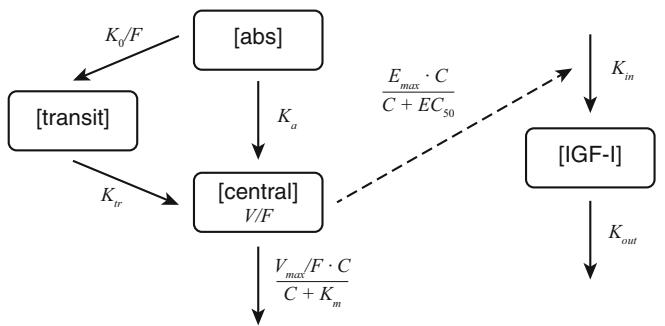

<details>
<summary>flowchart</summary>

```mermaid
graph TD
    A["[transit"]] -->|K₀/F| B["[abs"]]
    A -->|Kₜᵣ| C["[central"]]
    B -->|Kₐ| C
    C -->|Vₘₐ/F·C/(C+Kₘ)| D["[IGF-I"]]
    D -->|Kₒᵤₜ| E["Output"]
    D -.->|Eₘₐₓ·C/(C+E C₅₀)| F["Output"]
```
</details>

Fig. 1 Schematic diagram of the structural pharmacokinetic/pharmacodynamic model for somapacitan. The pharmacokinetic model included a dual pathway from absorption compartment [abs] to central compartment [central] through first-order absorption and zeroorder absorption through a transit compartment [transit]. The pharmacokinetic/pharmacodynamic model included an indirect response relationship (dashed line) between the central compartment and the insulin-like growth factor-I compartment [IGF-I]. C somapacitan concentration in the central compartment, $E C _ { 5 O }$ somapacitan concentration corresponding to half-maximum stimulation of IGF-I production rate, $E _ { \mathrm { m a x } }$ maximum increase in IGF-I production rate, $F$ bioavailability, $I G F { - } I$ insulin-like growth factor-I, $K _ { O }$ zero-order rate constant, $K _ { a }$ linear absorption rate constant, $K _ { i n }$ production rate of IGF-I, $K _ { m }$ Michaelis-Menten constant for saturable elimination, $K _ { \mathrm { o u t } }$ t first-order turnover of IGF-I, $K _ { t r }$ linear transit rate constant, V volume of distribution, $V _ { \mathrm { m a x } }$ maximum elimination rate

pharmacokinetic properties of somapacitan. Based on the final model, it is possible to predict the level and the variability in pharmacokinetics, both for fixed dosing (dosing in mg) and for dosing scaled to body weight (dosing in mg/kg). These data indicate higher variability in pharmacokinetics following fixed dosing, especially in children with GHD (ESM Table 3), indicating a larger impact on pharmacokinetics of scaling to body weight in children.

# 3.3 Pharmacodynamics of Somapacitan

# 3.3.1 Population Pharmacodynamic Model

Stimulation of the IGF-I production rate by somapacitan concentration was tested for additive and proportional effect.

An indirect response pharmacokinetic/pharmacodynamic model with saturable effect relationship between the somapacitan pharmacokinetics and IGF-I rate of production was used to describe the IGF-I time profile. The complete concentration–time course was used as input to the pharmacokinetic/pharmacodynamic model based on individual estimated pharmacokinetic parameters of the final pharmacokinetic model (sequential approach). Systemic parameters of the structural pharmacokinetic/pharmacodynamic model were $K _ { \mathrm { i n } }$ (production rate of IGF-I), $K _ { \mathrm { o u t } }$ (first-order turn-over of IGF-I), $E _ { \mathrm { m a x } }$ (maximum increase in IGF-I production rate), and EC (somapacitan concentration corresponding to half-maximum stimulation of IGF-I production rate).

The final pharmacokinetic/pharmacodynamic model parameters are found in Table 4 (see also details in ESM Results and ESM Table 2).

# 3.3.2 Pharmacodynamic Evaluation

The indirect response pharmacokinetic/pharmacodynamic model provided a good fit of the observed data. Parameters for the final pharmacokinetic/pharmacodynamic model are shown in Table 4. The good fit was illustrated by the population prediction’s close fit to the observed pharmacodynamic data (IGF-I change from baseline) (Fig. 4). In addition, as with the pharmacokinetic model, this is also illustrated in the assessment of model goodness-of-fit (ESM Fig. 2).

The dose–response relationship to change from baseline IGF-I data was similar in AGHD and healthy subjects, but markedly lower in children with GHD (Figs. 3 and 4).

# 3.3.3 Effect of Body Weight and Growth Hormone Deficiency (GHD) on Pharmacodynamics

The pharmacokinetic/pharmacodynamic characteristics were well-described by the IGF-I dose–response relationships to body weight and GHD status (Fig. 3). GHD status primarily affected baseline IGF-I, and the differences between healthy and AGHD subjects were marginal in terms of the change from baseline in the IGF-I profiles.

Body weight was found to affect IGF-I elimination and IGF-I response with an inverse relationship to the effect on pharmacokinetics. The body weight effects on IGF-I appeared to cancel out the effects on pharmacokinetics, so that in contrast to pharmacokinetics, fixed-, or weightbased dosing had little impact on the variability of the IGF-I response (ESM Table 3).

# 3.4 Simulation of Pharmacokinetics and Insulin-Like Growth Factor-I (IGF-I) for Phase II in Children with GHD

Once-weekly dosing of somapacitan resulted in little to no accumulation in the model when dosed at between 0.01 and 0.32 mg/kg in subjects with AGHD. Similarly, in children with GHD, the model predicted little to no accumulation when dosed once-weekly at between 0.04 and 0.16 mg/kg (Fig. 5).

The pharmacokinetic/pharmacodynamic model was used to support the phase II dose selection of somapacitan in children with GHD (0.04–0.16 mg/kg), targeting doses resulting in a range of IGF-I levels that were lower or higher than the IGF-I levels following clinical daily doses of hGH (Fig. 5). Based on the simulations, once-weekly dosing of 0.04 mg/kg/week is expected to provide peak IGF-I levels that match the average daily hGH treatment; 0.08 mg/kg/week is expected to provide average IGF-I levels that match the average daily hGH treatment; and 0.16 mg/kg/week is expected to provide higher IGF-I levels than with daily hGH, but with average concentrations not exceeding ?2 SDS.

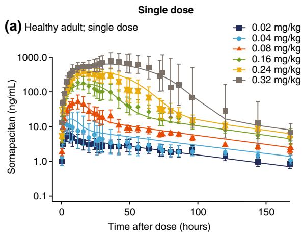

<details>
<summary>line</summary>

| Time after dose (hours) | 0.02 mg/kg | 0.04 mg/kg | 0.08 mg/kg | 0.16 mg/kg | 0.24 mg/kg | 0.32 mg/kg |
| ----------------------- | ---------- | ---------- | ---------- | ---------- | ---------- | ---------- |
| 0                       | ~1.0       | ~1.0       | ~1.0       | ~1.0       | ~1.0       | ~1.0       |
| 50                      | ~1.0       | ~1.0       | ~10.0      | ~100.0     | ~100.0     | ~100.0     |
| 100                     | ~1.0       | ~1.0       | ~10.0      | ~10.0      | ~10.0      | ~10.0      |
| 150                     | ~1.0       | ~1.0       | ~1.0       | ~1.0       | ~1.0       | ~1.0       |
</details>

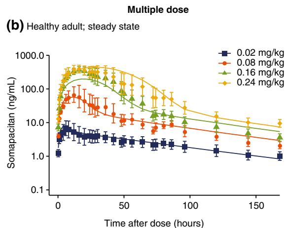

<details>
<summary>line</summary>

| Time after dose (hours) | 0.02 mg/kg | 0.08 mg/kg | 0.16 mg/kg | 0.24 mg/kg |
| ----------------------- | ---------- | ---------- | ---------- | ---------- |
| 0                       | ~1.0       | ~10.0      | ~100.0     | ~1000.0    |
| 50                      | ~3.0       | ~10.0      | ~100.0     | ~1000.0    |
| 100                     | ~2.0       | ~5.0       | ~50.0      | ~500.0     |
| 150                     | ~1.5       | ~3.0       | ~30.0      | ~300.0     |
</details>

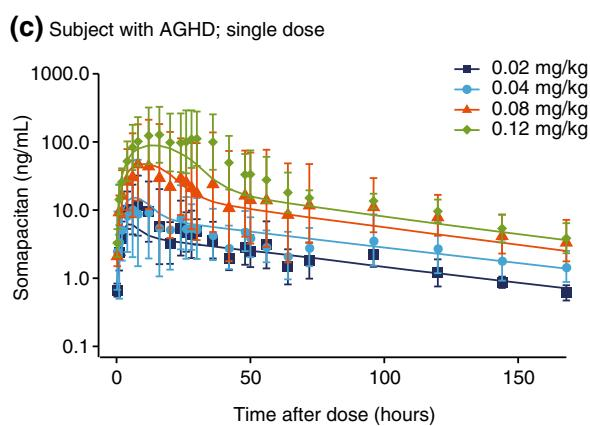

<details>
<summary>line</summary>

| Time after dose (hours) | 0.02 mg/kg | 0.04 mg/kg | 0.08 mg/kg | 0.12 mg/kg |
| ----------------------- | ---------- | ---------- | ---------- | ---------- |
| 0                       | ~1.0       | ~1.0       | ~1.0       | ~1.0       |
| 50                      | ~1.0       | ~1.0       | ~10.0      | ~10.0      |
| 100                     | ~1.0       | ~1.0       | ~10.0      | ~10.0      |
| 150                     | ~1.0       | ~1.0       | ~10.0      | ~10.0      |
| 200                     | ~1.0       | ~1.0       | ~10.0      | ~10.0      |
</details>

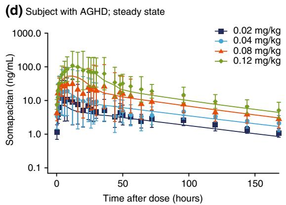

<details>
<summary>line</summary>

| Time after dose (hours) | 0.02 mg/kg | 0.04 mg/kg | 0.08 mg/kg | 0.12 mg/kg |
| ----------------------- | ---------- | ---------- | ---------- | ---------- |
| 0                       | ~1.0       | ~10.0      | ~10.0      | ~100.0     |
| 50                      | ~3.0       | ~5.0       | ~7.0       | ~10.0      |
| 100                     | ~2.0       | ~3.0       | ~5.0       | ~7.0       |
| 150                     | ~1.5       | ~2.5       | ~4.0       | ~5.0       |
</details>

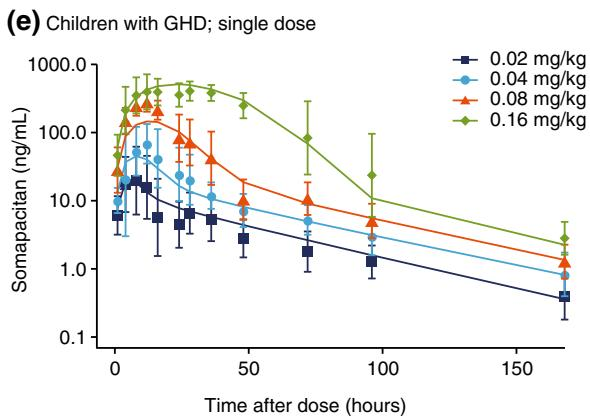

<details>
<summary>line</summary>

| Time after dose (hours) | 0.02 mg/kg | 0.04 mg/kg | 0.08 mg/kg | 0.16 mg/kg |
| ----------------------- | ---------- | ---------- | ---------- | ---------- |
| 0                       | ~10        | ~10        | ~10        | ~10        |
| 50                      | ~3         | ~5         | ~10        | ~50        |
| 100                     | ~1         | ~2         | ~5         | ~10        |
| 150                     | ~0.5       | ~1         | ~2         | ~3         |
</details>

Fig. 2 Pharmacokinetic profiles for somapacitan, with final model fit a for a single dose in healthy adults; b at steady state in healthy adults; c a single dose in subjects with AGHD; d at steady state in subjects with AGHD; and e for a single dose in children with GHD. Somapacitan concentration versus time profiles. Panels a, c, and e show single-dose and panels b and d show steady-state profiles for

each dose group in trials of healthy adults (NCT01514500), subjects with AGHD (NCT01706783), and children with GHD (NCT01973244). Points are geometric mean with 95% confidence intervals. Lines are population predictions. AGHD adult growth hormone deficiency, GHD growth hormone deficiency

# 4 Discussion

We have developed a pharmacokinetic/pharmacodynamic model that accurately describes the data obtained from three phase I trials of once-weekly somapacitan. A tight fit to the observed data with a plausible semi-mechanistic implementation indicate that the model is adequate to predict pharmacokinetic and IGF-I profiles resulting from

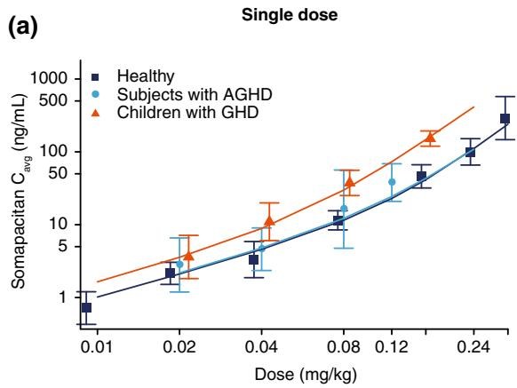

<details>
<summary>line</summary>

| Dose (mg/kg) | Healthy | Subjects with AGHD | Children with GHD |
| ------------ | ------- | ------------------ | ----------------- |
| 0.01         | 1       | -                  | -                 |
| 0.02         | 3       | 5                  | 4                 |
| 0.04         | 5       | 10                 | 12                |
| 0.08         | 10      | 20                 | 30                |
| 0.12         | 20      | 40                 | 60                |
| 0.24         | 30      | 80                 | 120               |
</details>

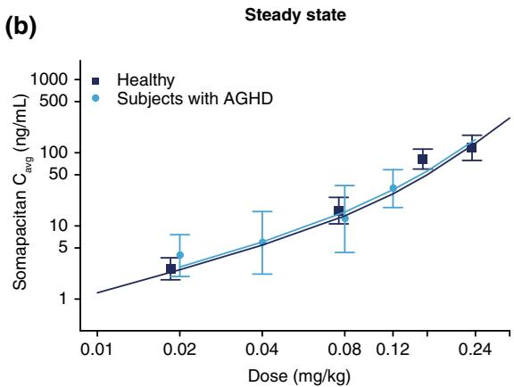

<details>
<summary>line</summary>

| Dose (mg/kg) | Healthy (Somapecitan C_avg ng/mL) | Subjects with AGHD (Somapecitan C_avg ng/mL) |
| ------------ | ---------------------------------- | -------------------------------------------- |
| 0.01         | ~1                                 | ~1                                           |
| 0.02         | ~3                                 | ~4                                           |
| 0.04         | ~5                                 | ~6                                           |
| 0.08         | ~15                                | ~12                                          |
| 0.12         | ~70                                | ~40                                          |
| 0.24         | ~120                               | ~100                                         |
</details>

(c)   
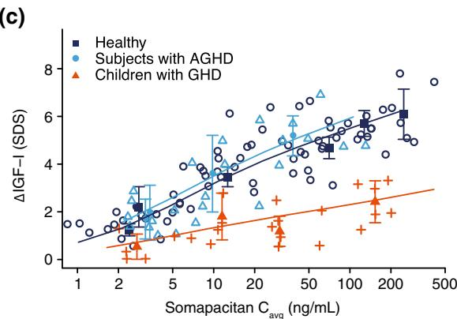

<details>
<summary>scatter</summary>

| Somapacitan C_avg (ng/mL) | ΔIGF-I (SDS) | Group              |
| ------------------------- | ------------ | ------------------ |
| 1                         | 1.5          | Healthy            |
| 2                         | 2.0          | Healthy            |
| 5                         | 3.0          | Healthy            |
| 10                        | 4.0          | Healthy            |
| 20                        | 5.0          | Healthy            |
| 50                        | 6.0          | Healthy            |
| 100                       | 7.0          | Healthy            |
| 200                       | 8.0          | Healthy            |
| 500                       | 9.0          | Healthy            |
| 1                         | 1.0          | Subjects with AGHD |
| 2                         | 1.5          | Subjects with AGHD |
| 5                         | 2.5          | Subjects with AGHD |
| 10                        | 3.5          | Subjects with AGHD |
| 20                        | 4.5          | Subjects with AGHD |
| 50                        | 5.5          | Subjects with AGHD |
| 100                       | 6.5          | Subjects with AGHD |
| 200                       | 7.5          | Subjects with AGHD |
| 500                       | 8.5          | Subjects with AGHD |
| 1                         | 0.5          | Children with GHD   |
| 2                         | 1.0          | Children with GHD   |
| 5                         | 1.5          | Children with GHD   |
| 10                        | 2.0          | Children with GHD   |
| 20                        | 2.5          | Children with GHD   |
| 50                        | 3.0          | Children with GHD   |
| 100                       | 3.5          | Children with GHD   |
| 200                       | 4.0          | Children with GHD   |
| 500                       | 4.5          | Children with GHD   |
</details>

(d)   
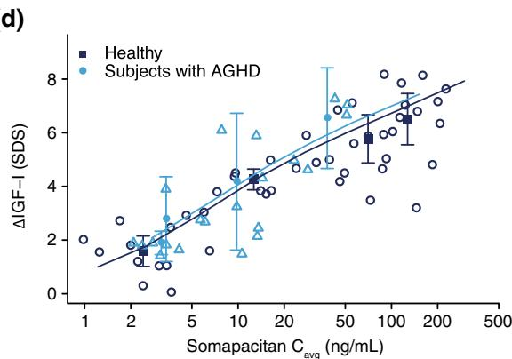

<details>
<summary>scatter</summary>

| Somapacitan C_avg (ng/mL) | ΔIGF-I (SDS) | Group             |
| ------------------------- | ------------ | ----------------- |
| 2                         | 1.5          | Healthy           |
| 3                         | 2.0          | Healthy           |
| 4                         | 2.5          | Healthy           |
| 5                         | 3.0          | Healthy           |
| 6                         | 3.5          | Healthy           |
| 7                         | 4.0          | Healthy           |
| 8                         | 4.5          | Healthy           |
| 9                         | 5.0          | Healthy           |
| 10                        | 5.5          | Healthy           |
| 11                        | 6.0          | Healthy           |
| 12                        | 6.5          | Healthy           |
| 13                        | 7.0          | Healthy           |
| 14                        | 7.5          | Healthy           |
| 15                        | 8.0          | Healthy           |
| 16                        | 8.5          | Healthy           |
| 17                        | 9.0          | Healthy           |
| 18                        | 9.5          | Healthy           |
| 19                        | 10.0         | Healthy           |
| 20                        | 10.5         | Healthy           |
| 21                        | 11.0         | Healthy           |
| 22                        | 11.5         | Healthy           |
| 23                        | 12.0         | Healthy           |
| 24                        | 12.5         | Healthy           |
| 25                        | 13.0         | Healthy           |
| 26                        | 13.5         | Healthy           |
| 27                        | 14.0         | Healthy           |
| 28                        | 14.5         | Healthy           |
| 29                        | 15.0         | Healthy           |
| 30                        | 15.5         | Healthy           |
| 31                        | 16.0         | Healthy           |
| 32                        | 16.5         | Healthy           |
| 33                        | 17.0         | Healthy           |
| 34                        | 17.5         | Healthy           |
| 35                        | 18.0         | Healthy           |
| 36                        | 18.5         | Healthy           |
| 37                        | 19.0         | Healthy           |
| 38                        | 19.5         | Healthy           |
| 39                        | 20.0         | Healthy           |
| 40                        | 20.5         | Healthy           |
| 41                        | 21.0         | Healthy           |
| 42                        | 21.5         | Healthy           |
| 43                        | 22.0         | Healthy           |
| 44                        | 22.5         | Healthy           |
| 45                        | 23.0         | Healthy           |
| 46                        | 23.5         | Healthy           |
| 47                        | 24.0         | Healthy           |
| 48                        | 24.5         | Healthy           |
| 49                        | 25.0         | Healthy           |
| 50                        | 25.5         | Healthy           |
| 51                        | 26.0         | Healthy           |
| 52                        | 26.5         | Healthy           |
| 53                        | 27.0         | Healthy           |
| 54                        | 27.5         | Healthy           |
| 55                        | 28.0         | Healthy           |
| 56                        | 28.5         | Healthy           |
| 57                        | 29.0         | Healthy           |
| 58                        | 29.5         | Healthy           |
| 59                        | 30.0         | Healthy           |
| 60                        | 30.5         | Healthy           |
| 61                        | 31.0         | Healthy           |
| 62                        | 31.5         | Healthy           |
| 63                        | 32.0         | Healthy           |
| 64                        | 32.5         | Healthy           |
| 65                        | 33.0         | Healthy           |
| 66                        | 33.5         | Healthy           |
| 67                        | 34.0         | Healthy           |
| 68                        | 34.5         | Healthy           |
| 69                        | 35.0         | Healthy           |
| 70                        | 35.5         | Healthy           |
| 71                        | 36.0         | Healthy           |
| 72                        | 36.5         | Healthy           |
| 73                        | 37.0         | Healthy           |
| 74                        | 37.5         | Healthy           |
| 75                        | 38.0         | Healthy           |
| 76                        | 38.5         | Healthy           |
| 77                        | 39.0         | Healthy           |
| 78                        | 39.5         | Healthy           |
| 79                        | 40.0         | Healthy           |
| 80                        | 40.5         | Healthy           |
| 81                        | 41.0         | Healthy           |
| 82                        | 41.5         | Healthy           |
| 83                        | 42.0         | Healthy           |
| 84                        | 42.5         | Healthy           |
| 85                        | 43.0         | Healthy           |
| 86                        | 43.5         | Healthy           |
| 87                        | 44.0         | Healthy           |
| 88                        | 44.5         | Healthy           |
| 89                        | 45.0         | Healthy           |
| 90                        | 45.5         | Healthy           |
| 91                        | 46.0         | Healthy           |
| 92                        | 46.5         | Healthy           |
| 93                        | 47.0         | Healthy           |
| 94                        | 47.5         | Healthy           |
| 95                        | 48.0         | Healthy           |
| 96                        | 48.5         | Healthy           |
| 97                        | 49.0         | Healthy           |
| 98                        | 49.5         | Healthy           |
| 99                        | 50.0         | Healthy           |
| Note: The actual values may vary due to the use of AGHD in the sample data (e.g., “ΔIGF-I (SDS)” is estimated based on the chart type). The data provided in the code is a simplified representation of the original table.
</details>

Fig. 3 Dose–exposure for a single dose and b multiple doses and exposure–response for c single dose and d multiple doses of somapacitan. Panels a and b show observed geometric mean for somapacitan $\mathrm { C _ { a v g } }$ with 95% confidence interval overlaid with individual simulations from all subjects on each dose level after a single dose and at steady state. Panels c and d show observed change from baseline (D) IGF-I levels (points) with mean (filled points) and   
95% confidence intervals for each dose group overlaid with individual simulations (lines) based on all subjects on each dose level after a single dose and at steady state. Each dose group is plotted at the median average concentration. AGHD adulthood GHD, $C _ { a \nu g }$ geometric mean, GHD growth hormone deficiency, IGF-I insulin-like growth factor-I, SDS standard deviation score

Table 4 Estimates: final pharmacokinetic/pharmacodynamic model 

<table><tr><td rowspan="2">Parameter</td><td colspan="5">Final PK/PD model</td></tr><tr><td>Estimate for 85 kg subject with AGHD [95% CI]</td><td>pct.RSE</td><td>IIV.pct.CV</td><td>Shrinkage.pct</td><td>Estimate for 25 kg subject with GHD [95% CI]</td></tr><tr><td> $K_{out}$  (1/h)</td><td>0.0252 [0.0214–0.0290]</td><td>7.73</td><td>22.1</td><td>17.6</td><td>0.0340 [0.0288–0.0391]</td></tr><tr><td> $K_{in}$  (ng/mL/h)</td><td>2.19 [1.79–2.59]</td><td>9.31</td><td>36.9</td><td>12.4</td><td>2.19 [1.79–2.59]</td></tr><tr><td> $EC_{50}$  (ng/mL)</td><td>16.8 [14.7–18.9]</td><td>6.48</td><td></td><td></td><td>16.8 [14.7–18.9]</td></tr><tr><td> $E_{max}$  (ng/mL/h)</td><td>15.1 [14.2–16.0]</td><td>3.09</td><td>20.7</td><td>22.0</td><td>8.60 [8.09–9.11]</td></tr><tr><td> $\theta_{BW_{Kout}}$ </td><td>-0.244 [-0.403 to -0.0861]</td><td>33.1</td><td></td><td></td><td></td></tr><tr><td> $\theta_{BW_{Emax}}$ </td><td>0.460 [0.332–0.587]</td><td>14.2</td><td></td><td></td><td></td></tr><tr><td> $\theta_{HV_{Kout}}$ </td><td>-0.241 [-0.377 to -0.106]</td><td>28.7</td><td></td><td></td><td></td></tr><tr><td> $\theta_{HV_{Kin}}$ </td><td>0.550 [0.363–0.737]</td><td>17.4</td><td></td><td></td><td></td></tr><tr><td>Additive error (ng/mL)</td><td>7.32</td><td></td><td></td><td>4.61</td><td></td></tr><tr><td>Proportional error (%)</td><td>14.3</td><td></td><td></td><td>4.61</td><td></td></tr></table>

AGHD adult growth hormone deficiency, BW body weight, CI confidence interval, CV coefficient of variation, $E C _ { 5 O }$ somapacitan concentration corresponding to half-maximum stimulation of IGF-I production rate, $E _ { m a x }$ maximum increase in IGF-I production rate, GHD growth hormone deficiency, HV healthy volunteer (vs. GHD), IGF-I insulin-like growth factor-I, IIV inter-individual variability, $K _ { i n }$ production rate of IGF-I, $K _ { o u t }$ first-order turnover of IGF-I, pct percentage, PD pharmacodynamic, PK pharmacokinetic, RSE relative standard error

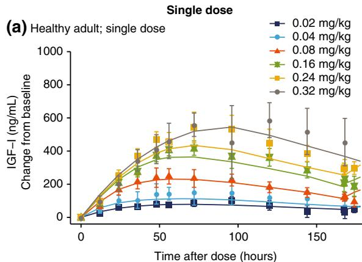

<details>
<summary>line</summary>

| Time after dose (hours) | 0.02 mg/kg | 0.04 mg/kg | 0.08 mg/kg | 0.16 mg/kg | 0.24 mg/kg | 0.32 mg/kg |
| ----------------------- | ---------- | ---------- | ---------- | ---------- | ---------- | ---------- |
| 0                       | 0          | 0          | 0          | 0          | 0          | 0          |
| 50                      | ~50        | ~100       | ~200       | ~300       | ~400       | ~500       |
| 100                     | ~75        | ~125       | ~225       | ~350       | ~450       | ~550       |
| 150                     | ~75        | ~125       | ~200       | ~300       | ~400       | ~500       |
| 200                     | ~75        | ~125       | ~175       | ~250       | ~350       | ~450       |
</details>

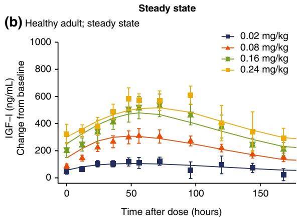

<details>
<summary>line</summary>

| Time after dose (hours) | 0.02 mg/kg | 0.08 mg/kg | 0.16 mg/kg | 0.24 mg/kg |
| ----------------------- | ---------- | ---------- | ---------- | ---------- |
| 0                       | ~50        | ~100       | ~200       | ~350       |
| 50                      | ~100       | ~300       | ~500       | ~600       |
| 100                     | ~75        | ~250       | ~450       | ~550       |
| 150                     | ~50        | ~150       | ~250       | ~350       |
| 200                     | ~25        | ~100       | ~200       | ~300       |
</details>

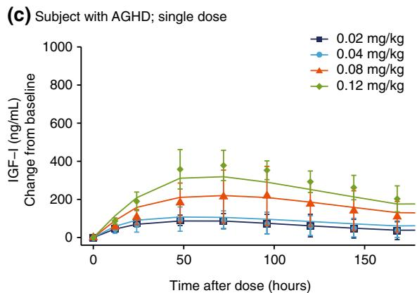

<details>
<summary>line</summary>

| Time after dose (hours) | 0.02 mg/kg | 0.04 mg/kg | 0.08 mg/kg | 0.12 mg/kg |
| ----------------------- | ---------- | ---------- | ---------- | ---------- |
| 0                       | 0          | 0          | 0          | 0          |
| 50                      | ~100       | ~150       | ~200       | ~350       |
| 100                     | ~100       | ~150       | ~200       | ~350       |
| 150                     | ~100       | ~150       | ~150       | ~250       |
| 200                     | ~100       | ~150       | ~150       | ~200       |
</details>

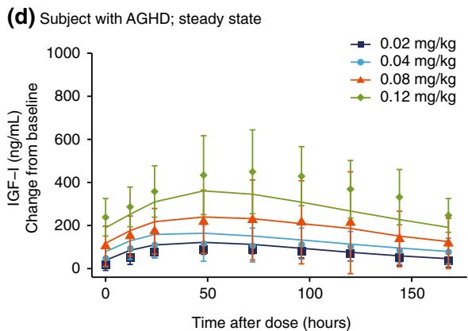

<details>
<summary>line</summary>

| Time after dose (hours) | 0.02 mg/kg | 0.04 mg/kg | 0.08 mg/kg | 0.12 mg/kg |
| ----------------------- | ---------- | ---------- | ---------- | ---------- |
| 0                       | ~50        | ~100       | ~150       | ~250       |
| 50                      | ~100       | ~150       | ~250       | ~450       |
| 100                     | ~100       | ~150       | ~250       | ~450       |
| 150                     | ~100       | ~150       | ~200       | ~350       |
| 200                     | ~100       | ~150       | ~150       | ~250       |
</details>

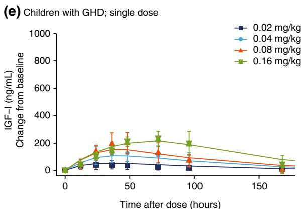

<details>
<summary>line</summary>

| Time after dose (hours) | 0.02 mg/kg | 0.04 mg/kg | 0.08 mg/kg | 0.16 mg/kg |
| ----------------------- | ---------- | ---------- | ---------- | ---------- |
| 0                       | 0          | 0          | 0          | 0          |
| 50                      | ~50        | ~100       | ~200       | ~250       |
| 100                     | ~50        | ~100       | ~150       | ~200       |
| 150                     | ~50        | ~50        | ~50        | ~100       |
| 200                     | ~50        | ~50        | ~50        | ~50        |
</details>

Fig. 4 Pharmacodynamic profiles with final model fit for somapacitan, with final model fit a for a single dose in healthy adults; b at steady state in healthy adults; c for a single dose in subjects with AGHD; d at steady state in subjects with AGHD; and e for a single dose in children with GHD. IGF-I change from baseline versus time profiles. Panels a, c, and e show the change from baseline profiles of IGF-I for single dose and steady state (panels b and d) for each

multiple dosing in children with GHD. This model provides reassurance, in the absence of a multiple-dosing trial of somapacitan in children, that once-weekly dosing will be unlikely to result in accumulation of somapacitan. Furthermore, IGF-I levels are expected to be elevated from baseline throughout the dosing interval, indicating efficacy, while also remaining within the normal range less than somapacitan dose group in trials of healthy adults (NCT01514500), subjects with AGHD (NCT01706783), and children with GHD (NCT01973244). Points are geometric mean with 95% confidence intervals. Lines are population predictions. AGHD adult growth hormone deficiency, GHD growth hormone deficiency, IGF-I insulinlike growth factor-I

?2 SDS, as is the case in multiple-dose trials in adults [15].

# 4.1 Mechanistic Description of the Pharmacokinetics

As previously illustrated in the phase I trials [13–15], somapacitan was found to follow non-linear pharmacokinetics with a relationship to body weight. The non-linear shoulder in pharmacokinetics observed at high concentrations of somapacitan was explained by saturable elimination in the pharmacokinetic model as well as the dual absorption. For low doses, almost the entire dose is absorbed via the zero-order pathway, which enters slowly into the central compartment so that plasma concentrations appear to follow standard linear kinetics. For larger doses, a large fraction is absorbed quickly, leading to a characteristic non-linear pharmacokinetic time course. The characteristic dose-dependent features of somapacitan pharmacokinetics have been characterized and connected to a semi-mechanistic model describing the pharmacokinetic properties adequately. We note that model estimation is based on subcutaneous data alone, making a robust differentiation between absorption and elimination difficult.

(a)   
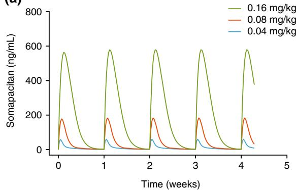

<details>
<summary>line</summary>

| Time (weeks) | 0.16 mg/kg | 0.08 mg/kg | 0.04 mg/kg |
| ------------ | ---------- | ---------- | ---------- |
| 0            | ~550       | ~180       | ~50        |
| 1            | ~550       | ~180       | ~50        |
| 2            | ~550       | ~180       | ~50        |
| 3            | ~550       | ~180       | ~50        |
| 4            | ~550       | ~180       | ~50        |
</details>

Fig. 5 Simulated a predicted pharmacokinetic and b IGF-I profiles for phase II trial doses in a mean population of children with growth hormone deficiency. Panel a shows mean population predicted pharmacokinetics and panel b shows IGF-I in children with growth hormone deficiency. The full horizontal line shows the mean observed pre-trial SDS (during hGH treatment) and the dotted horizontal line

# 4.2 Covariates (In Particular, Body Weight)

Body weight was a key driver of variability during the stepwise covariate model build [20] and a very strong predictor of pharmacokinetics, sufficient to explain the difference in pharmacokinetics between children and adults. Body weight was also identified as a covariate for IGF-I elimination and response (along with GHD status), with an inverse relationship to the effect on pharmacokinetics. This is also consistent with the observed exposure– response relationship in children and adults and explains why children need higher relative doses (in mg/kg) than adults to obtain comparable effects on IGF-I levels.

Regarding additional covariates, the results suggested no differences between males and females, healthy subjects and GHD subjects, Japanese and Caucasians, or children and adults following adjustment for body weight. However,

(b)   
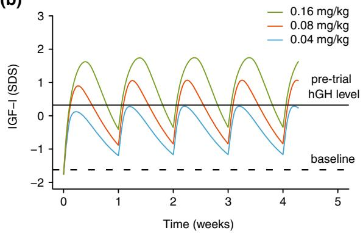

<details>
<summary>line</summary>

| Time (weeks) | 0.16 mg/kg | 0.08 mg/kg | 0.04 mg/kg |
| ------------ | ---------- | ---------- | ---------- |
| 0            | -2.0       | -2.0       | -2.0       |
| 1            | 1.5        | 1.0        | -1.0       |
| 2            | -1.0       | -0.5       | -1.5       |
| 3            | 1.5        | 1.0        | -1.0       |
| 4            | -1.0       | -0.5       | -1.5       |
| 5            | 1.5        | 1.0        | -1.0       |
</details>

shows the mean observed baseline (after washout of hGH) for the observed population. Parameter confidence intervals and variabilities are available in Table 4 and are not shown here for clarity. hGH human growth hormone, IGF-I insulin-like growth factor-I, SDS standard deviation score

the covariate analysis was limited by the low number of subjects, lower number of females than males, and by demographic correlations. As such, sex, a potential covariate for pharmacokinetics, was not identified as a covariate, which could reflect the low number of females in the dataset or correlation between sex and body weight. Similarly, demographic correlations could conceal covariate effects in the pharmacokinetic/pharmacodynamic parameters describing IGF-I. For example, age and sex may have been expected pharmacokinetic/pharmacodynamic covariates since IGF-I levels (ng/mL) vary with these in healthy subjects [18]. Body weight was strongly correlated with age in children and, for this reason, age group was subsequently included as a discrete covariate (adult/children).

# 4.3 Dosing (Titration Versus Per Kilo Versus Flat)

The predicted variability of somapacitan in our population models, which compared weight-scaled dosing (mg/kg) with flat dosing (mg), suggest that, as per current guidelines and clinical practice, hGH can be dosed effectively by adjusting for body weight (in children with GHD) and by using standard titration regimens (in subjects with AGHD) [1, 2, 4]. Variability in the predicted average somapacitan concentration (percentage coefficient of variation [CV%]) is lowest when utilizing a weight-scaled dosing (mg/kg) compared with a flat dosing (mg) regimen in children with GHD. Thus, ignoring the body weight effect would result in children being exposed to a higher range of GH levels. Lower variability for weight-based dosing was also observed in subjects with AGHD, albeit with a smaller reduction in variability and reduced benefit. The reduction in variability by weight-based dosing was not directly reflected in the IGF-I levels.

# 4.4 How Modeling Supported Phase II Doses

Dose selection of somapacitan has been guided by pharmacokinetic/pharmacodynamic modeling of IGF-I levels throughout the drug development process. This supported the dose-titration algorithm for somapacitan used in REAL (REversible ALbumin binding) 2, a phase III trial in patients with AGHD [21]. Mean IGF-I SDS values were maintained throughout the trial, remaining between 0 and 2 SDS; somapacitan was well-tolerated and no safety issues were identified. Pharmacokinetic/pharmacodynamic modeling was also used to supported the selection of doses to be used in phase II trials in children in order to match IGF-I levels achieved with somapacitan to those achieved with once-daily hGH. As illustrated by our model, a dynamic IGF-I profile over the week is seen with onceweekly somapacitan, whereas a more stable IGF-I response is expected during hGH treatment. Considering the variability with once-weekly somapacitan and the potential for differences in the action of somapacitan and once-daily hGH (i.e., direct vs. indirect [mediated via IGF-I] effects of GH) [22], it is important to assess somapacitan over a range of clinical doses in children with GHD. The results from our simulations support the dose selection (0.04–0.16 mg/ kg) for phase II trials of somapacitan in children with GHD. This dose range should allow an exploration of the effects of somapacitan with IGF-I levels being lower (0.04 mg/kg IGF-I peak matching hGH), similar (0.08 mg/ kg mean IGF-I matching hGH), and above (0.16 mg/kg) those observed with daily hGH, while not exceeding ? 2 SDS.

# 5 Conclusions

A population pharmacokinetic/pharmacodynamic model of once-weekly somapacitan provided an accurate description of phase I pharmacokinetic and IGF-I data in adults (healthy and AGHD) and children (GHD). Body weight was identified as a covariate and was predictive of the differences observed in the pharmacokinetics and pharmacodynamics between children and adults. Model predictions suggested elevated IGF-I profiles from baseline within the entire dosing interval, despite little or no accumulation of somapacitan when dosing once-weekly in adults and children with GHD. Based on the expected relationship between IGF-I and beneficial effects of GH treatment, it is concluded that somapacitan pharmacokinetics/pharmacodynamics support once-weekly dosing in adults and children with GHD. The safety and efficacy of somapacitan needs to be confirmed in phase II and III trials to provide clinical evidence that once-weekly dosing of somapacitan is appropriate in children with GHD and subjects with AGHD.

Acknowledgments The authors thank investigators, research coordinators and patients in the trial, as well as Bo Grønlund, Navid Nedjatian, Mette Suntum, and Nina Worm for their review and input to the manuscript. The authors also thank Sam Mason, PhD and Germanicus Hansa-Wilkinson, MSc, both of Watermeadow Medical, an Ashfield Company, UK for providing medical writing and editorial support, which was funded by Novo Nordisk A/S, Søborg, Denmark in accordance with Good Publication Practice (GPP3) guidelines (http://www.ismpp.org/gpp3).

# Compliance with Ethical Standards

Funding Funding for this study was supplied by Novo Nordisk A/S.

Conflict of interest RVJ, MHR, HA, and RVO are employees/ shareholders of Novo Nordisk A/S.

Open Access This article is distributed under the terms of the Creative Commons Attribution-NonCommercial 4.0 International License (http://creativecommons.org/licenses/by-nc/4.0/), which permits any noncommercial use, distribution, and reproduction in any medium, provided you give appropriate credit to the original author(s) and the source, provide a link to the Creative Commons license, and indicate if changes were made.

# References

1. Consensus guidelines for the diagnosis and treatment of growth hormone (GH) deficiency in childhood and adolescence: summary statement of the GH Research Society. GH Research Society. J Clin Endocrinol Metab. 2000;85(11):3990–3.   
2. Molitch ME, Clemmons DR, Malozowski S, Merriam GR, Vance ML. Evaluation and treatment of adult growth hormone deficiency: an Endocrine Society clinical practice guideline. J Clin Endocrinol Metab. 2011;96(6):1587–609.   
3. Reed ML, Merriam GR, Kargi AY. Adult growth hormone deficiency—benefits, side effects, and risks of growth hormone replacement. Front Endocrinol. 2013;4:64.   
4. Grimberg A, DiVall SA, Polychronakos C, Allen DB, Cohen LE, Quintos JB, et al. Guidelines for growth hormone and insulin-like growth factor-I treatment in children and adolescents: growth hormone deficiency, idiopathic short stature, and primary insulinlike growth factor-I deficiency. Horm Res Paediatr. 2016;86(6):361–97.   
5. Higham CE, Jostel A, Trainer PJ. IGF-I measurements in the monitoring of GH therapy. Pituitary. 2007;10(2):159–63.   
6. Osterberg L, Blaschke T. Adherence to medication. N Engl J Med. 2005;353(5):487–97.   
7. Acerini C, Albanese A, Casey A, Denvir L, Jones J, Mathew V, et al. Initiating growth hormone therapy for children and adolescents. Br J Nurs. 2012;21(18):1091–7.   
8. Cawley P, Wilkinson I, Ross RJ. Developing long-acting growth hormone formulations. Clin Endocrinol (Oxf). 2013;79(3):305–9.   
9. Bagnasco F, Di Iorgi N, Roveda A, Gallizia A, Haupt R, Maghnie M. Prevalence and correlates of adherence in children and

adolescents treated with growth hormone: a multicenter Italian study. Endocr Pract. 2017;23(8):929–41.   
10. Christiansen JS, Backeljauw PF, Bidlingmaier M, Biller BM, Boguszewski MC, Casanueva FF, et al. Growth Hormone Research Society perspective on the development of long-acting growth hormone preparations. Eur J Endocrinol. 2016;174(6):C1–8.   
11. Thygesen P, Andersen HS, Behrens C, Fels JJ, Norskov-Lauritsen L, Rischel C, et al. Nonclinical pharmacokinetic and pharmacodynamic characterisation of somapacitan: a reversible non-covalent albumin-binding growth hormone. Growth Horm IGF Res. 2017;35:8–16.   
12. Vestergaard B, Thygesen P, Kreilgaard M, Fels JJ, Lykkesfeldt J, Agerso H. The kidneys play a central role in the clearance of rhGH in rats. Eur J Pharm Sci. 2016;86:29–33.   
13. Battelino T, Rasmussen MH, De Schepper J, Zuckerman-Levin N, Gucev Z, Savendahl L. Somapacitan, a once-weekly reversible albumin-binding GH derivative, in children with GH deficiency: a randomized dose-escalation trial. Clin Endocrinol (Oxf). 2017;87(4):350–8.   
14. Rasmussen MH, Braendholt Olsen MW, Alifrangis L, Klim S, Suntum M. A reversible albumin-binding growth hormone derivative is well-tolerated and possesses a potential once-weekly treatment profile. J Clin Endocrinol Metab. 2014;99(11):E1819–29.   
15. Rasmussen MH, Janukonyte J, Klose M, Marina D, Tanvig M, Nielsen LF, et al. Reversible albumin-binding GH possesses a

potential once-weekly treatment profile in adult growth hormone deficiency. J Clin Endocrinol Metab. 2016;101(3):988–98.   
16. International Conference on Harmonisation. ICH harmonised tripartite guideline for good clinical practice. Geneva: ICH; 1996.   
17. World Medical Association. Declaration of Helsinki—ethical principles for medical research involving human subjects. Last amended by the 59th WMA General Assembly, Seoul, Republic of Korea. October 2008. https://www.wma.net/wp-content/ uploads/2016/11/DoH-Oct2008.pdf. Accessed 10 Apr 2018.   
18. Bidlingmaier M, Friedrich N, Emeny RT, Spranger J, Wolthers OD, Roswall J, et al. Reference intervals for insulin-like growth factor-1 (IGF-i) from birth to senescence: results from a multicenter study using a new automated chemiluminescence IGF-I immunoassay conforming to recent international recommendations. J Clin Endocrinol Metab. 2014;99(5):1712–21.   
19. Beal SL, Boeckmann AJ, Sheiner LB. NONMEM users guide. Parts I-VIII. Hanover: ICON Development Solutions; 2011.   
20. Wa¨hlby U, Jonsson EN, Karlsson MO. Comparison of stepwise covariate model building strategies in population pharmacokinetic-pharmacodynamic analysis. AAPS PharmSci. 2002;4(4):68–79.   
21. Johannsson G, Feldt-Rasmussen U, Holme Hakonsson I, Biering H, Rodien P, Tahara S, et al. Safety and convenience of onceweekly somapacitan in adult GH deficiency: a 26-week randomized, controlled trial. Eur J Endocrinol. Epub. 2018. https:// doi.org/10.1530/EJE-17-1073.   
22. Laron Z. Insulin-like growth factor 1 (IGF-1): a growth hormone. Mol Pathol. 2001;54(5):311–6.