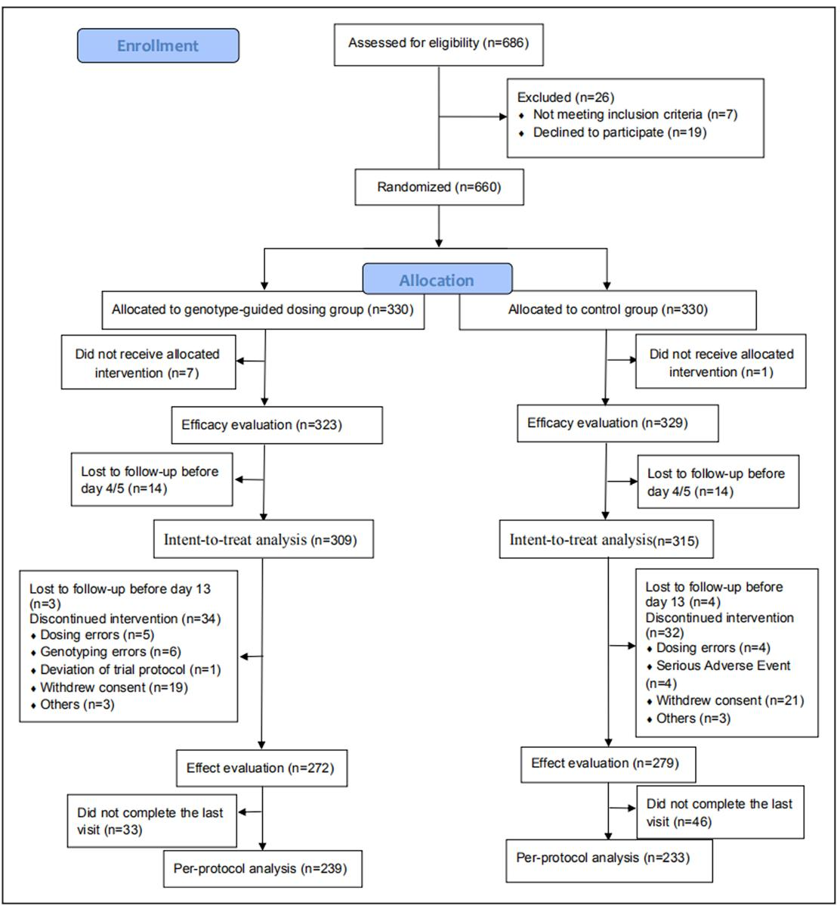
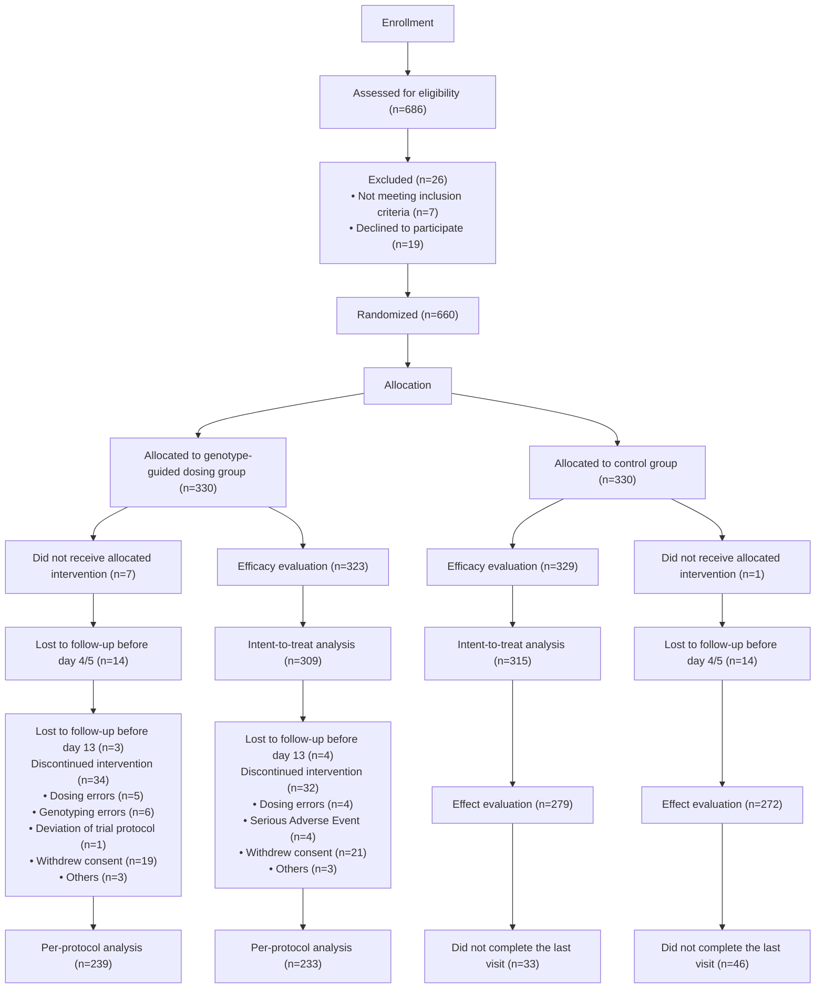
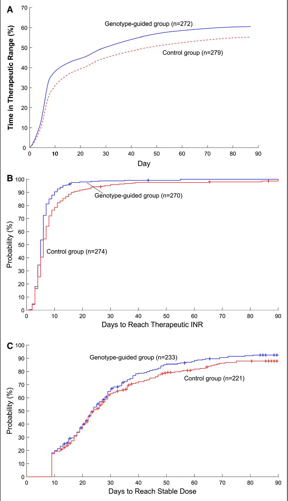

# Genotype-Guided Dosing of Warfarin in Chinese Adults

A Multicenter Randomized Clinical Trial

Chengxian Guo , PhD\*; Yun Kuang, M Med\*; Honghao Zhou, PhD; Hong Yuan, MD; Qi Pei, PhD; Jingle Li, MD; Weihong Jiang, MD; Chee M. Ng, PharmD, PhD; Xiaoping Chen , PhD; Yong Huo, MD, PhD; Yimin Cui, MD, PhD; Xiaobin Wang , MD, ScD; Jingjing Yu , BSc; Xue Sun, M Med; Wanying Yu, M Med; Peng Chen , M Med; Da Miao , M Med; Wenyu Liu, BSc; Zaixin Yu, MD; Zewei Ouyang, MD; Xiangjiang Shi, M Med; Chunmei Lv, MD; Zijing Peng, M Med; Guozuo Xiong, M Med; Gaofeng Zeng, MD; Jianping Zeng, MD; Haiying Dai, MD; Jianqiang Peng, MD; Yuming Zhang , M Med; Fanghua Xu, M Med; Jie Wu, MD; Xiaoliang Chen, M Med; Hao Gong, M Med; Zhiyuan Yang, M Med; Xianming Wu, M Med; Qiulian Fang, MD; Liu Yang, BSc; Haigang Li, PhD; Hongyi Tan, M Med; Zhijun Huang, PhD; Xiaohong Tang, MD; Qiong Yang, MD; Shan Tu, MD; Xiaoyan Wang, MD; Yuxia Xiang, M Med; Jie Huang, M Med; Xiaomin Wang, PhD; Jingjing Cai, MD; Shanjie Jiang, B Med; Lu Huang, M Med; Jinfu Peng , M Med; Liying Gong, M Med; Chan Zou, M Med; Guoping Yang, PhD

BACKGROUND: Warfarin is an effective treatment for thromboembolic disease but has a narrow therapeutic index; optimal anticoagulation dosage can differ tremendously among individuals. We aimed to evaluate whether genotype-guided warfarin dosing is superior to routine clinical dosing for the outcomes of interest in Chinese patients.

METHODS: We conducted a multicenter, randomized, single-blind, parallel-controlled trial from September 2014 to April 2017 in 15 hospitals in China. Eligible patients were ≥18 years of age, with atrial fibrillation or deep vein thrombosis without previous treatment of warfarin or a bleeding disorder. Nine follow-up visits were performed during the 12-week study period. The primary outcome measure was the percentage of time in the therapeutic range of the international normalized ratio during the first 12 weeks after starting warfarin therapy.

RESULTS: A total of 660 participants were enrolled and randomly assigned to a genotype-guided dosing group or a control group under standard dosing. The genotype-guided dosing group had a significantly higher percentage of time in the therapeutic range than the control group (58.8% versus 53.2% [95% CI of group difference, 1.1–10.2]; P=0.01). The genotype-guided dosing group also achieved the target international normalized ratio sooner than the control group. In subgroup analyses, warfarin normal sensitivity group had an even higher percentage of time in the therapeutic range during the first 12 weeks compared with the control group (60.8% versus 48.9% [95% CI, 1.1–24.4]). The incidence of adverse events was low in both groups.

CONCLUSIONS: The outcomes of genotype-guided warfarin dosing were superior to those of clinical standard dosing. These findings raise the prospect of precision warfarin treatment in China.

REGISTRATION: URL: https://www.clinicaltrials.gov; Unique identifier: NCT02211326.

Key Words atrial fibrillation ◼ control groups ◼ pharmacogenetics ◼ randomized controlled trial ◼ warfarin

Correspondence to: Guoping Yang, PhD, Center of Clinical Pharmacology, The Third Xiangya Hospital, Central South University, 138 TongZiPo Rd, Changsha, Hunan 410013, China. Email ygp9880@126.com or guoping.yang@csu.edu.cn

\*Dr Guo and Y. Kuang contributed equally to this work as first authors.

The Data Supplement is available at https://www.ahajournals.org/doi/suppl/10.1161/CIRCGEN.119.002602.

For Sources of Funding and Disclosures, see page 322.

© 2020 The Authors. Circulation: Genomic and Precision Medicine is published on behalf of the American Heart Association, Inc., by Wolters Kluwer Health, Inc. This is an open access article under the terms of the Creative Commons Attribution Non-Commercial-NoDerivs License, which permits use, distribution, and reproduction in any medium, provided that the original work is properly cited, the use is noncommercial, and no modifications or adaptations are made.

Circulation: Genomic and Precision Medicine is available at www.ahajournals.org/journal/circgen

Nonstandard Abbreviations and Acronyms 

<table><tr><td>%TTR</td><td>percentage of time in the therapeutic range</td></tr><tr><td>COAG</td><td>Clarification of Optimal Anticoagulation Through Genetics</td></tr><tr><td>EU-PACT</td><td>European Pharmacogenetics of Anticoagulant Therapy</td></tr><tr><td>GIFT</td><td>Genetic Informatics Trial</td></tr><tr><td>INR</td><td>international normalized ratio</td></tr><tr><td>XY3-WAR</td><td>Warfarin Trial of the Third Xiangya Hospital, Central South University</td></tr></table>

China has a huge and rapidly growing elderly popu-lation, contributing to a rising incidence of throm-1 boembolic disease. Warfarin is an effective and the most commonly used anticoagulant to prevent and treat thromboembolic disease worldwide. However, a particular challenge to the use of warfarin is its narrow therapeutic index with large individual variations in the daily dose requirement, often leading to either insufficient or excessive anticoagulation.2 These concerns, coupled with a lack of optimal warfarin dosing recommendations contribute to a low usage rate of anticoagulants (only 6.16% among the eligible patients) in China,3 compared with other countries. Low warfarin use may contribute to the high incidence of cardiovascular risk events in China.4,5

A potential strategy to improve warfarin efficacy and safety is to account for individual genetic variations. The International Warfarin Pharmacogenetic Consortium5 has developed a predictive formula for personalized warfarin dosing to improve anticoagulation control. However, there are serious gaps in the science. First, there has only been a limited number of large, multicenter, randomized trials on genotype-guided dosing of warfarin in Western populations, including the EU-PACT study (European Pharmacogenetics of Anticoagulant Therapy), the COAG study (Clarification of Optimal Anticoagulation Through Genetics), and the randomized clinical GIFT (Genetic Informatics Trial),6–8 which have yielded conflicting results. Second, previous studies9–11 have shown that individual differences in warfarin outcomes are closely related to genetic factors such as CYP2C9 and VKORC1 (vitamin K epoxide reductase complex, subunit 1), but the effects of these genetic factors vary by race.12,13 In white populations, CYP2C9\*2 (rs1799853), CYP2C9\*3 (rs1057910), and VKORC1-1639G>A (rs9923231) are used to predict an appropriate warfarin dose, but CYP2C9 rs1799853 is rare in Asian populations,14 while rs12777823 on chromosome 10 is a better predictor than CYP2C9\*2 and CYP2C9\*3 in selecting a warfarin dose in African populations.15 Observational studies16–18 suggest that CYP2C9 rs1057910 and

VKORC1 rs9923231 are related to warfarin dose and bleeding risk in Chinese populations. To date, there has also been a particular dearth of large, well-designed warfarin clinical trials in Chinese populations, such that the clinical utility of a genotype-guided dosing of warfarin in Chinese populations is unclear.

Therefore, we designed a multicenter, randomized, single-blind, parallel-controlled trial called XY3-WAR (Warfarin Trial of the Third Xiangya Hospital, Central South University) to evaluate whether genotype-guided warfarin dosing is superior in achieving the outcomes of interest as compared with routine clinical dosing in Chinese adult patients with atrial fibrillation or deep vein thrombosis.

# METHODS

The data that support the findings of this study are available from the corresponding author upon reasonable request. The study was approved by the Institutional Review Board of the Third Xiangya Hospital of Central South University and the institutional review board of each participating hospital. All subjects provided written informed consent. Full methods are available in the Data Supplement.

# RESULTS

# Participants

From September 2014 to January 2017, 686 eligible patients were invited to participate in the study; a total of 660 patients agreed to be enrolled and were randomly assigned to either a genotype-guided dosing group or a control group (n=330 each; Figure 1). The proportion of patients not genotyped on day 1 in the genotyping arm was 8.8% (29 of 330). These 29 patients were all genotyped on the second day of dosing. The participant enrollment summary at each study site is detailed in Table V in the Data Supplement. A large majority of the participants (87.1%) had atrial fibrillation while the remainder (12.9%) had deep vein thrombosis. A summary of concomitant diseases and drug combinations of participants in each group is listed in Tables VI and VII in the Data Supplement. Baseline data distribution was balanced between the 2 groups (Table 1). The genotypic distribution conformed with Hardy-Weinberg equilibrium, except for CYP2C9\*2, where no polymorphism was identified in this study population.

We included 551 participants who had at least 13 days of international normalized ratio (INR) data in the final analysis. Specific reasons for participant withdrawal from the study are illustrated in Figure 1.

# Primary Outcome Measure

The percentage of time in the therapeutic range (%TTR) in both groups increased with time; since the INR peaks at around day 13 and then plateaus, we included 551 participants who had at least 13 days of INR data in the %TTR analysis, %TTR was 58.8% in the genotypeguided dosing group as compared with 53.2% in the control group during the first 12 weeks. The difference was statistically significant (P=0.01), representing a difference of 5.6 percentage points (95% CI, 1.1–10.2) between the 2 groups. In the per-protocol analysis, %TTR in the genotype-guided group (239 participants) and the control group (233 participants) was 60.9% and 55.2%, respectively, which corresponds to a difference of 5.4 percentage points (P=0.02). In the intent-to-treat analysis, the corresponding value was 54.8% in the genotypeguided dosing group (309 participants) compared with 50.1% in the control group (316 participants; Table 2). The difference between the 2 groups in the mean %TTR became apparent between days 5 and 10 (Figure 2).

flowchart

Figure 1. Consort diagram detailing the total number of participants recruited, withdrawn, and analyzed.   
\*A list of the exclusion criteria appears in the Data Supplement. †Plans for surgery, discovery of cancer, or other health reasons.

# Secondary Outcome Measures

The trend of change in INR was similar between the 2 groups (Figure II in the Data Supplement). INR increased rapidly during the first 2 weeks, then declined slowly after 2 weeks where it stayed within the therapeutic range. The median time to reach the therapeutic INR was shorter in the genotype-guided group than in the control group (P<0.001; Table 2; Figure 2). In this study, 233 participants in the genotype-guided dosing group (85.7%) and 221 participants in the control group (79.2%) reached a stable dose by 12 weeks, which was 2.4±1.0 and 2.5±0.9 mg, respectively, showing no significant differences between the 2 groups (Figure 2) nor in other secondary outcomes including the number of warfarin dose adjustment units, the incidence of INR ≥4, or the number of additional visits (Table 2).

Table 1. Demographic and Baseline Clinical Characteristics of the Study Participants\* 

<table><tr><td rowspan="2">Index</td><td colspan="4">All Participants</td><td colspan="4">Participants Included for Primary Analysis</td></tr><tr><td>Total, % (Mean±SD)</td><td>Genotype-Guided Dosing Group, % (Mean±SD)</td><td>Control Group, % (Mean±SD)</td><td>P Value</td><td>Total, % (Mean±SD)</td><td>Genotype-Guided Dosing Group, % (Mean±SD)</td><td>Control Group, % (Mean±SD)</td><td>P Value</td></tr><tr><td>No. of participants†</td><td>660 (100.0)</td><td>330 (50.0)</td><td>330 (50.0)</td><td>1.00</td><td>551 (100.0)</td><td>272 (49.4)</td><td>279 (50.6)</td><td>0.77</td></tr><tr><td colspan="9">Type†</td></tr><tr><td>Inpatient</td><td>568 (86.1)</td><td>283 (85.8)</td><td>285 (86.4)</td><td>0.82</td><td>463 (84.0)</td><td>227 (83.5)</td><td>236 (84.6)</td><td>0.72</td></tr><tr><td>Outpatient</td><td>92 (13.9)</td><td>47 (14.2)</td><td>45 (13.6)</td><td></td><td>88 (16.0)</td><td>45 (16.5)</td><td>43 (15.4)</td><td></td></tr><tr><td colspan="9">Indicationst</td></tr><tr><td>Atrial fibrillation</td><td>575 (87.1)</td><td>296 (89.7)</td><td>279 (84.6)</td><td>0.048</td><td>477 (86.6)</td><td>241 (88.6)</td><td>236 (84.6)</td><td>0.17</td></tr><tr><td>Deep vein thrombosis</td><td>85 (12.9)</td><td>34 (10.3)</td><td>51 (15.5)</td><td></td><td>74 (13.4)</td><td>31 (11.4)</td><td>43 (15.4)</td><td></td></tr><tr><td colspan="9">Population data</td></tr><tr><td colspan="9">Sext</td></tr><tr><td>Male</td><td>338 (51.2)</td><td>165 (50.0)</td><td>173 (52.4)</td><td>0.53</td><td>274 (49.7)</td><td>130 (47.8)</td><td>144 (51.6)</td><td>0.37</td></tr><tr><td>Female</td><td>322 (48.8)</td><td>165 (50.0)</td><td>157 (47.6)</td><td></td><td>277 (50.3)</td><td>142 (52.2)</td><td>135 (48.4)</td><td></td></tr><tr><td>Age, y‡</td><td>67.4±10.1</td><td>66.9±10.5</td><td>67.9±9.7</td><td>0.53</td><td>67.4±10.0</td><td>67.2±10.3</td><td>67.7±9.7</td><td>0.90</td></tr><tr><td>Height, cm‡</td><td>161.9±8.0</td><td>162.0±8.3</td><td>161.7±7.8</td><td>0.80</td><td>161.4±8.1</td><td>161.4±8.4</td><td>161.4±7.8</td><td>0.83</td></tr><tr><td>Weight, kg‡</td><td>62.2±12.2</td><td>62.5±12.3</td><td>61.8±12.2</td><td>0.65</td><td>61.8±12.2</td><td>61.9±12.6</td><td>61.7±11.9</td><td>0.92</td></tr><tr><td colspan="9">Nationality§</td></tr><tr><td>Han</td><td>658 (99.7)</td><td>330 (100.0)</td><td>328 (99.4)</td><td>0.50</td><td>549 (99.6)</td><td>272 (100.0)</td><td>277 (99.3)</td><td>0.50</td></tr><tr><td>Minority</td><td>2 (0.3)</td><td>0 (0.0)</td><td>2 (0.6)</td><td></td><td>2 (0.4)</td><td>0 (0.0)</td><td>2 (0.7)</td><td></td></tr><tr><td colspan="9">Drinking†</td></tr><tr><td>Never</td><td>512 (77.6)</td><td>262 (79.4)</td><td>250 (75.8)</td><td>0.31</td><td>429 (77.9)</td><td>218 (80.1)</td><td>211 (75.6)</td><td>0.38</td></tr><tr><td>Former</td><td>83 (12.6)</td><td>35 (10.6)</td><td>48 (14.6)</td><td></td><td>69 (12.5)</td><td>29 (10.7)</td><td>40 (14.3)</td><td></td></tr><tr><td>Currently</td><td>65 (9.9)</td><td>33 (10.0)</td><td>32 (9.7)</td><td></td><td>53 (9.6)</td><td>25 (9.2)</td><td>28 (10.0)</td><td></td></tr><tr><td colspan="9">Smoking†</td></tr><tr><td>Never</td><td>461 (68.8)</td><td>235 (71.2)</td><td>226 (68.5)</td><td>0.74</td><td>384 (69.7)</td><td>194 (71.3)</td><td>190 (68.1)</td><td>0.71</td></tr><tr><td>Former</td><td>112 (17.0)</td><td>53 (16.1)</td><td>59 (17.9)</td><td></td><td>95 (17.2)</td><td>44 (16.2)</td><td>51 (18.3)</td><td></td></tr><tr><td>Currently</td><td>87 (13.2)</td><td>42 (12.7)</td><td>45 (13.6)</td><td></td><td>72 (13.1)</td><td>34 (12.5)</td><td>38 (13.6)</td><td></td></tr><tr><td>Baseline INR‡</td><td>1.0±0.1</td><td>1.0±0.1</td><td>1.0±0.1</td><td>0.43</td><td>1.0±0.1</td><td>1.0±0.1</td><td>1.0±0.1</td><td>0.41</td></tr><tr><td colspan="9">CYP2C9||</td></tr><tr><td>*1/*1</td><td>607 (92.0)</td><td>309 (93.6)</td><td>298 (90.3)</td><td>0.26§</td><td>513 (93.1)</td><td>259 (95.2)</td><td>254 (91.0)</td><td>0.14</td></tr><tr><td>*1/*3</td><td>50 (7.6)</td><td>20 (6.1)</td><td>30 (9.1)</td><td></td><td>36 (6.5)</td><td>12 (4.4)</td><td>24 (8.6)</td><td></td></tr><tr><td>*3/*3</td><td>2 (0.3)</td><td>1 (0.3)</td><td>1 (0.3)</td><td></td><td>2 (0.4)</td><td>1 (0.4)</td><td>1 (0.4)</td><td></td></tr><tr><td>Other¶</td><td>1 (0.2)</td><td>0 (0.00)</td><td>1 (0.3)</td><td></td><td>0 (0.0)</td><td>0 (0.0)</td><td>0 (0.0)</td><td></td></tr><tr><td colspan="9">VKORC1||</td></tr><tr><td>AA</td><td>529 (80.2)</td><td>271 (82.1)</td><td>258 (78.2)</td><td>0.42§</td><td>446 (80.9)</td><td>232 (85.3)</td><td>214 (76.7)</td><td>0.02</td></tr><tr><td>AG</td><td>119 (18.0)</td><td>55 (16.7)</td><td>64 (19.4)</td><td></td><td>96 (17.4)</td><td>38 (14.0)</td><td>58 (20.8)</td><td></td></tr><tr><td>GG</td><td>11 (1.7)</td><td>4 (1.2)</td><td>7 (2.1)</td><td></td><td>9 (1.6)</td><td>2 (0.7)</td><td>7 (2.5)</td><td></td></tr><tr><td>Other¶</td><td>1 (0.2)</td><td>0 (0.0)</td><td>1 (0.3)</td><td></td><td>0 (0.0)</td><td>0 (0.0)</td><td>0 (0.0)</td><td></td></tr></table>

INR indicates international normalized ratio; and VKORC1, vitamin K epoxide reductase complex, subunit 1.   
\*Plus-minus are means±SD. Participants included in the primary analysis were those who remained in the study on day 13 or later.   
†χ2 test.   
‡Kruskal-Wallis test.   
§Fisher exact test.   
∥Continuity correction χ2 test.   
¶No genetic test results.

Within 1 to 4 weeks, %TTR was higher in the genotype-guided dosing group than in the control group (49.3% and 44.1%, respectively [95% CI, 0.6–9.3]; P=0.02). Within 1 to 8 weeks, %TTR was higher in the genotype-guided dosing group than in the control group

(58.2% and 52.0%, respectively [95% CI, 1.5–10.7]; P=0.009). Within 1 to 12 weeks, %TTR was also higher in the genotype-guided dosing group than in the control group (60.5% and 55.2%, respectively [95% CI, 0.3– 9.7]; P=0.04; Table 2). The results of line regression, cox regression, and logistic regression are presented in the Data Supplement. The results of intent-to-treat analysis are presented in Table VIII in the Data Supplement.

Table 2. Primary and Secondary Outcomes During the First 12 wk Between the 2 Groups\* 

<table><tr><td>Analysis</td><td>n</td><td>Genotype-Guided Dosing Group</td><td>n</td><td>Control Group</td><td>Comparison (95% CI)</td><td>P Value</td></tr><tr><td colspan="7">Primary outcomes</td></tr><tr><td colspan="7">%TTR for INR</td></tr><tr><td>Participants with ≥13 d of INR data†</td><td>272</td><td>58.8±24.3</td><td>279</td><td>53.2±26.3</td><td>5.6 (1.1 to 10.2)‡</td><td>0.01</td></tr><tr><td>Per-protocol analysis†§</td><td>239</td><td>60.9±24.1</td><td>233</td><td>55.2±26.1</td><td>5.4 (0.8 to 10.3)‡</td><td>0.02</td></tr><tr><td>Intent-to-treat analysis†||</td><td>309</td><td>54.9±26.6</td><td>315</td><td>50.1±27.7</td><td>4.8 (0.2 to 9.5)‡</td><td>0.03</td></tr><tr><td colspan="7">Secondary outcomes</td></tr><tr><td>Time to reach therapeutic INR, d†</td><td>270</td><td></td><td>274</td><td></td><td>0.7 (0.6 to 0.8)¶</td><td>&lt;0.001</td></tr><tr><td>Median</td><td></td><td>5</td><td></td><td>6</td><td></td><td></td></tr><tr><td>Interquartile range</td><td></td><td>4–7</td><td></td><td>4–9</td><td></td><td></td></tr><tr><td>Time to reach stable dose, d†</td><td>233</td><td></td><td>221</td><td></td><td>1.2 (0.7 to 1.0)¶</td><td>0.69</td></tr><tr><td>Median</td><td></td><td>22</td><td></td><td>21</td><td></td><td></td></tr><tr><td>Interquartile range</td><td></td><td>12–30</td><td></td><td>12–29</td><td></td><td></td></tr><tr><td>Stable dose, mg†</td><td>233</td><td>2.4±1.0</td><td>221</td><td>2.5±0.9</td><td>0 (−0.4 to 0.0)‡</td><td>0.045</td></tr><tr><td>Adjustment units of warfarin dose, n†</td><td>272</td><td>6.9±6.2</td><td>279</td><td>7.3±6.9</td><td>1.1 (1.0 to 1.1)#</td><td>0.32</td></tr><tr><td>Incidence of INR ≥4, No. of participants, %**</td><td>272</td><td>56 (20.6)</td><td>279</td><td>54 (19.4)</td><td>1.1 (0.7 to 1.7)††</td><td>0.72</td></tr><tr><td>Additional visits, n†</td><td>272</td><td></td><td>279</td><td></td><td>0.9 (0.8 to 1.0)#</td><td>0.14</td></tr><tr><td>Median</td><td></td><td>1</td><td></td><td>1</td><td></td><td></td></tr><tr><td>Interquartile range</td><td></td><td>0–2</td><td></td><td>0–2</td><td></td><td></td></tr><tr><td colspan="7">Percentage of time in therapeutic INR range†</td></tr><tr><td>1–4 wk</td><td>260</td><td>49.3±23.4</td><td>268</td><td>44.1±24.4</td><td>5.1 (0.6 to 9.3)‡‡</td><td>0.02</td></tr><tr><td>1–8 wk</td><td>254</td><td>58.2±24.2</td><td>259</td><td>52.0±25.8</td><td>6.0 (1.5 to 10.7)‡‡</td><td>0.009</td></tr><tr><td>1–12 wk</td><td>245</td><td>60.5±24.1</td><td>241</td><td>55.2±26.3</td><td>4.9 (0.3 to 9.7)‡‡</td><td>0.04</td></tr><tr><td>Adverse events related to warfarin, No. of participants, %**</td><td>323</td><td>20 (6.2)</td><td>329</td><td>19 (5.8)</td><td>0.9 (0.5 to 1.8)††</td><td>0.90</td></tr><tr><td>Bleeding events</td><td></td><td>20 (6.2)</td><td></td><td>18 (5.5)</td><td>0.9 (0.5 to 1.7)††</td><td>0.83</td></tr><tr><td>Mild</td><td></td><td>14 (4.3)</td><td></td><td>11 (3.3)</td><td>0.8 (0.3 to 1.7)††</td><td>0.72</td></tr><tr><td>Moderate</td><td></td><td>4 (1.2)</td><td></td><td>3 (0.9)</td><td>0.7 (0.1 to 3.4)††</td><td>0.82</td></tr><tr><td>Severe</td><td></td><td>2 (0.6)</td><td></td><td>4 (1.2)</td><td>2.0 (0.4 to 14.3)††</td><td>0.66</td></tr><tr><td>Deaths (included in severe bleeding events)</td><td></td><td>1 (0.3)</td><td></td><td>1 (0.3)</td><td>1.0 (0.04 to 24.9)††</td><td>0.99</td></tr><tr><td>Thromboembolism events</td><td></td><td>0 (0.0)</td><td></td><td>1 (0.3)</td><td>0.00 (0 to +∞)††</td><td>0.58</td></tr></table>

INR indicates international normalized ratio.   
\*Values are presented as means±SD. The percentage of time in the therapeutic INR range of 2.0 to 3.0 (1.5–2.5) was calculated using a standard linear interpolation method between successive INR values.   
†Kruskal-Wallis test.   
‡The comparison is the mean of the genotype-guided group minus that of the control group.   
§The per-protocol analysis included all participants without a major protocol deviation who completed the last visit.   
∥The intent-to-treat analysis included all participants with at least 1 INR after warfarin.   
¶The value is the Cox proportional hazards ratio for the genotype-guided group.   
#The value is the incidence rate ratio for the genotype-guided group.   
††The value is the odds ratio for the genotype-guided group.   
‡‡The value is for the genotype-guided group minus the control group.

# Adverse Event Analysis

Adverse events were recorded throughout the study. A total of 652 participants were enrolled in safety outcome measures: 323 participants from the genotype-guided group and 329 participants from the control group. There was no significant difference in overall adverse events between the 2 groups (Table 2). In all, 38 bleeding events (20 in the genotype-guided group and 18 in the control group), 25 mild bleeding events (14 in the genotypeguided group and 11 in the control group), 7 moderate bleeding events (4 in the genotype-guided group and 3 in the control group), and 6 severe bleeding events (2 in the genotype-guided group and 4 in the control group) were reported. One mortality was reported in each group. There was only 1 thromboembolic event recorded in the control group. There were no significant differences across the various safety parameters between the 2

  
groups (Table 2). The results of logistic regression are presented in the Data Supplement.

# Subgroup Analysis Based on Genotyping and Age

In the warfarin normal responder group, %TTR was significantly higher in the genotype-guided warfarin dosing

Figure 2. Percentage of time in the therapeutic international normalized ratio (INR) range, Kaplan-Meier plots of time to reach therapeutic INR, and Kaplan-Meier plots of time to reach a stable warfarin dose.

A, Percentage of time in the therapeutic INR range during the first 12 wk by treatment groups (genotype-guided dosing group vs standard dosing group). B, Within 1 to 12 wk, percentages of patients with INR reaching therapeutic range in control and genotype-guided dosing groups. C, Within 1 to 12 wk, percentages of patients reaching a stable warfarin dose in control and genotypeguided dosing groups. group than in the control group (60.8% versus 48.9% [95% CI of the group difference, 1.1–24.4]; P=0.03; Table 3; Figure III in the Data Supplement). However, there were no significant differences between the 2 groups among the warfarin highly sensitive and warfarin sensitive (Table 3). The INR of participants in the genotype-guided group reached the therapeutic range faster than that of the control group among the sensitive and sensitive responders (P=0.02, P<0.001; Table 3). The results of intent-to-treat analysis are presented in Table IX in the Data Supplement.

Table 3. Subgroup Analysis Based on Genotype\* 

<table><tr><td>Analysis</td><td>n</td><td>Genotype-Guided Dosing Group</td><td>n</td><td>Control Group</td><td>Comparison (95% CI)</td><td>P Value</td></tr><tr><td colspan="7">Percentage of time in therapeutic INR range</td></tr><tr><td>Highly sensitive responder†</td><td>12</td><td>53.4±19.2</td><td>16</td><td>49.7±25.2</td><td>5.7 (-16.8 to 20.5)‡</td><td>0.68</td></tr><tr><td>Sensitive responder§</td><td>221</td><td>58.8±24.6</td><td>207</td><td>54.6±26.3</td><td>4.1 (-1.0 to 9.2)‡</td><td>0.12</td></tr><tr><td>Normal responder†</td><td>39</td><td>60.8±24.2</td><td>56</td><td>48.9±26.6</td><td>12.2 (1.1 to 24.4)‡</td><td>0.03</td></tr><tr><td colspan="7">Time to reach therapeutic INR, d§</td></tr><tr><td>Highly sensitive responder</td><td>12</td><td>5.5 (4.8 to 6.3)</td><td>16</td><td>5 (4.75 to 6.5)</td><td>1.3 (0.6 to 2.9)||</td><td>0.74</td></tr><tr><td>Sensitive responder</td><td>219</td><td>5 (4 to 7)</td><td>205</td><td>6 (4 to 8)</td><td>0.7 (0.6 to 0.9)||</td><td>0.02</td></tr><tr><td>Normal responder</td><td>39</td><td>6 (4 to 8)</td><td>53</td><td>8 (6 to 15)</td><td>0.5 (0.3 to 0.7)||</td><td>&lt;0.001</td></tr><tr><td colspan="7">Time to reach stable dose, d</td></tr><tr><td>Highly sensitive responder†</td><td>10</td><td>27 (21.8 to 46.5)</td><td>15</td><td>22 (19.0 to 33.5)</td><td>1.56 (0.7 to 3.6)||</td><td>0.31</td></tr><tr><td>Sensitive responder§</td><td>189</td><td>22 (12 to 31)</td><td>164</td><td>21 (11.5 to 29)</td><td>1.04 (0.8 to 1.3)||</td><td>0.54</td></tr><tr><td>Normal responder§</td><td>34</td><td>16.5 (9 to 24)</td><td>42</td><td>20 (10.5 to 27.5)</td><td>0.86 (0.5 to 1.4)||</td><td>0.37</td></tr><tr><td colspan="7">Stable dose, mg</td></tr><tr><td>Highly sensitive responder§</td><td>10</td><td>1.3±0.5</td><td>15</td><td>1.8±0.8</td><td>-0.4 (-0.8 to 0.0)‡</td><td>0.08</td></tr><tr><td>Sensitive responder§</td><td>189</td><td>2.2±0.7</td><td>164</td><td>2.4±0.8</td><td>0.0 (-0.4 to 0.0)‡</td><td>0.02</td></tr><tr><td>Normal responder†</td><td>34</td><td>3.6±1.1</td><td>42</td><td>3.2±1.1</td><td>0.4 (0.0 to 0.8)‡</td><td>0.18</td></tr><tr><td colspan="7">Adjustment units of warfarin dose, n§</td></tr><tr><td>Highly sensitive responder</td><td>12</td><td>9.3±8.5</td><td>16</td><td>7.4±6.7</td><td>0.8 (0.6 to 1.0)¶</td><td>0.42</td></tr><tr><td>Sensitive responder</td><td>221</td><td>6.9±6.2</td><td>207</td><td>7.3±7.2</td><td>1.1 (1.0 to 1.1)¶</td><td>0.70</td></tr><tr><td>Normal responder</td><td>39</td><td>5.7±5.3</td><td>56</td><td>7.4±5.8</td><td>1.3 (1.1 to 1.5)¶</td><td>0.05</td></tr><tr><td colspan="7">Incidence of INR ≥4, No. of participants, %</td></tr><tr><td>Highly sensitive responder#</td><td>...</td><td>5/12 (41.7)</td><td>...</td><td>7/16 (43.8)</td><td>0.6 (0.1 to 3.1)**</td><td>0.91</td></tr><tr><td>Sensitive responder#</td><td>...</td><td>46/221 (20.8)</td><td>...</td><td>44/207 (21.3)</td><td>0.9 (0.6 to 1.5)**</td><td>0.91</td></tr><tr><td>Normal responder††</td><td>...</td><td>5/39 (12.8)</td><td>...</td><td>3/56 (5.4)</td><td>3.0 (0.6 to 13.7)**</td><td>0.36</td></tr><tr><td colspan="7">Additional visits, n§</td></tr><tr><td>Highly sensitive responder</td><td>12</td><td>2 (1 to 3)</td><td>16</td><td>1.5 (0 to 2)</td><td>0.8 (0.4 to 1.4)¶</td><td>0.29</td></tr><tr><td>Sensitive responder</td><td>221</td><td>1 (0 to 2)</td><td>207</td><td>1 (0 to 2)</td><td>0.9 (0.8 to 1.1)¶</td><td>0.14</td></tr><tr><td>Normal responder</td><td>39</td><td>0 (0 to 2)</td><td>56</td><td>0 (0 to 2)</td><td>0.9 (0.6 to 1.3)¶</td><td>0.62</td></tr></table>

INR indicates international normalized ratio.   
\*Highly sensitive responder: CYP2C9\*1/\*3 and VKORC1 (vitamin K epoxide reductase complex, subunit 1) AA; CYP2C9\*3/\*3 and VKORC1 AA or GG or GA. Sensitive responder: CYP2C9\*1/\*1 and VKORC1 AA, CYP2C9\*1/\*3 and VKORC1 GG or GA. Normal responder: CYP2C9\*1/\*1 and VKORC1 GG or GA.   
†ANOVA.   
‡The value is for the genotype-guided group minus the control group.   
§Kruskal-Wallis test.   
∥The value is the Cox proportional hazards ratio for the genotype-guided group.   
¶The value is the incidence rate ratio for the genotype-guided group.   
#χ2 test.   
\*\*The value is the odds ratio for the genotype-guided group.   
††Continuity correction χ2 test.

In further subgroup analyses of related outcomes based on age, only the time to reach the therapeutic INR showed significant differences in the genotype-guided group in comparison with the control group both in patients <60 years of age (P=0.01) or ≥60 years of age (P<0.001). Other outcomes were not statistically significant between the genotype-guided group and the control group in both age groups (Table X in the Data Supplement). The results

of intent-to-treat analysis are presented in the Data Supplement (Table XI in the Data Supplement).

All the results are similar between base model and the model adjusting for covariates in the Data Supplement.

# DISCUSSION

To our knowledge, our study is by far the largest randomized trial on genotype-guided dosing of warfarin in a Chinese population. Our results showed that genotypeguided dosing of warfarin increased the percentage of time in the therapeutic INR range (%TTR, the primary outcome) by 5.6% and reduced the time to reach a therapeutic INR. However, the time to reach a stable dose, the number of adjustment units in the dose of warfarin, incidence of INR ≥4, the number of additional clinic visits, and incidence of adverse events did not differ between the 2 groups.

Different from the COAG and GIFT studies, the control group in our trial was administrated according to the clinical routine. Our results are similar to those of the EU-PACT study, which suggested that genotype-based dosing can improve anticoagulant control during the initiation of warfarin therapy.6 However, the average %TTR of 55.9% in our study was lower than the reported 63.8% observed in the EU-PACT study. The risk of hemorrhage in our study was also significantly lower than that of the EU-PACT study (Table LVI in the Data Supplement). This may be due to the fact that a loading dose was used in the EU-PACT study to reduce the time to reach a therapeutic INR but at the expense of an increased risk of excessive anticoagulation.19 Our study did not use a loading dose because clinicians in China are reluctant to use accelerated warfarin dosing regimens due to concerns about bleeding risk and the lack of evidence-based guidance for optimal warfarin dosing in Chinese populations. However, in contrast to the EU-PACT study, all of the secondary outcomes were not improved. One possible explanation for this difference in findings is that the frequency of actionable variants is much lower in a predominantly Chinese population. For example, the CYP2C9\*2 haplotype was not detected, and <20% of participants had an alternate allele in VKORC1. Therefore, because of the lower frequency of alternate alleles in these 2 genes, there may have been less opportunity to improve dosing. Similar to the influence of genetic polymorphisms with warfarin dose in blacks,15 additional alleles in CYP2C9/ VKORC1 that are more prevalent in a Chinese population may have affected trial outcomes, similarly CYP4F2,20 rs2108622, shows a mutant frequency of 32.9% to 48% in the Chinese population. It has been associated with influencing warfarin therapy. The CYP4F2\*3 variant is associated with a modest increase in warfarin dose requirements, thereby the dosage for patients carried CYP4F2 need to be adjusted accordingly. The number of dose titrations was used as the primary outcome in a noninferiority study by Syn et al21 in Singaporeans. Despite the primary outcome of our study was different from theirs, our results were consistent with them that pharmacogenomics-guided warfarin administration was superior to traditional administration.

To our knowledge, before our study, only 1 genotypeguided trial had been performed in a Chinese population in Taiwan.22 The results of the trial were inconclusive due to a small sample size (n=318) and problems in study design.

Distinct from previous studies,6,7 our study further performed subgroup analyses by genotype. Our results revealed that only participants with genotypes CYP2C9\*1/\*1 and VKORC1 GG or GA benefited from the genotype-guided dosing of warfarin. This observation suggests that the current International Warfarin Pharmacogenetic Consortium formula derived from clinical studies in North America and Europe produced positive but inconsistent clinical results, and more studies are needed to refine the genotype-guided dosing of warfarin for the Chinese population. In particular, it is necessary to add more valuable genetic polymorphisms to guide the dosing of warfarin, such as CYP4F2. In an age subgroup analysis, only the time to reach therapeutic INR between the genotype-guided group and the control group was significantly different, and this difference existed in both age groups.

No significant differences existed in adverse events between the 2 treatment groups. Although 1 death occurred in each of the 2 groups, both participants had been diagnosed with hypertension. Analysis of cause of death showed that these 2 participants had uncontrolled hypertension, which might have caused intracerebral hemorrhage (the cause of death) while taking warfarin. Under the monitoring of the Independent ethics committee, in view of the 2 cases of death, our study modified the protocol. The reported rate of hemorrhagic complications observed in our study (5.8%) was much lower than the combined major/minor bleeding events (18%) reported for warfarin-treated Chinese patients in a community-based hospital.23 Our study findings provide assurance that with standard clinical monitoring of INR, warfarin can be safely used in Chinese populations.

# Limitations

Our study had several limitations. First, although our study is by far the largest trial in a Chinese population and the second largest of all the published trials of this kind, future studies with even larger sample sizes are needed. The sample size is so small that more samples are needed to confirm the results of subgroup analysis. Additionally, we fell short of our originally targeted sample size, and the risk of an inflated type I error cannot be completely ruled out. The overall withdrawal rate within 13 days was 16.5%; however, this was consistent with the reported discontinuation rate of warfarin therapy observed in a large Chinese atrial fibrillation registry cohort study.24 The observed high discontinuation rate of warfarin therapy in China may be related to a lack of knowledge and overestimation of bleeding risk associated with warfarin therapy.25 Second, our study only included participants from Hunan province, China. However, the ethnic distribution of the population in Hunan province is similar to that of the nationwide ethnic distribution in China,26 and, therefore, the participants included in our study were likely to be a good representation of the Chinese population. Third, our study was not designed to generalize the study findings to ethnic minorities in China as only 0.3% of the study participants identified as ethnic minorities and there are 56 officially recognized ethnic groups in China.27 Although the same genes could be used to determine dose requirements in different ethnic groups,15,28 the nongenetic-related ethnic factors also played an independent and important role in predicting warfarin dose.12,29 Therefore, more work remains to be done to develop a robust ethnic and genotype-guided algorithm for improving warfarin dosing in all ethnic groups in China. Finally, it remains a possibility that additional unknown candidate genes affecting warfarin treatment response may exist. Their discovery awaits for future studies.

# Conclusions

In conclusion, the results of this multicenter, randomized, single-blind, parallel-controlled trial demonstrate the utility of genotype-guided dosing of warfarin to optimize individual warfarin dose in Chinese populations. These findings, if further confirmed by future trials, can serve as a foundation for developing a robust, evidence-based, personalized dosing and monitoring strategy to maximize efficacy and minimize adverse events of warfarin therapy in Chinese populations.

# ARTICLE INFORMATION

Received May 12, 2019; accepted March 12, 2020.

# Affiliations

Center of Clinical Pharmacology, the Third Xiangya Hospital (C.G., Y.K., H.Y., J.Y., X. Sun, W.Y., P.C., D.M., W.L., H.T., Z.H., Y.X., J.H., Xiaomin Wang, L.G., C.Z., G.Y.), Department of Pharmacy (C.G., Q.P., L.H., Jinfu Peng, G.Y.), Department of Cardiology, The Third Xiangya Hospital (J.L., W.J., X.T., Q.Y., S.T., Xiaoyan Wang, J.C., S.J.), Research Center of Drug Clinical Evaluation (C.G., Y.K., G.Y.), Department of Clinical Pharmacology, Xiangya Hospital (H.Z., Xiaoping Chen), Institute of Clinical Pharmacology, Hunan Key Laboratory of Pharmacogenetics (Xiaoping Chen), Department of Cardiology, Xiangya Hospital (Z. Yu), and School of Mathematics and Statistics (Q.F., L.Y.), Central South University, Changsha, China. College of Pharmacy, University of Kentucky, Lexington (C.M.N.). Department of Cardiology (Y.H.), Department of Pharmacy, Peking University First Hospital (Y.C.), and Department of Pharmacy Administration and Clinical Pharmacy, School of Pharmaceutical Sciences (Y.C.), Peking University Health Science Center, Beijing, China. Department of Population, Family and Reproductive Health, Center on the Early Life Origins of Disease, Johns Hopkins University Bloomberg School of Public Health, Baltimore, MD (Xiaobin Wang). Division of General Pediatrics and Adolescent Medicine, Department of Pediatrics, Johns Hopkins University School of Medicine, Baltimore, MD (Xiaobin Wang). Department of Cardiology, Shaoyang Central Hospital, China (Z.O., X. Shi). Department of Cardiology, The First People’s Hospital of Shaoyang, China (C.L., Z.P.). Department of Vascular Surgery (G.X.) and Department of Cardiology (G.Z.), The Second Affiliated Hospital, University of South China, Hengyang. Department of Cardiology, Xiangtan Central Hospital, China (J.Z.). Department of Cardiology, Changsha Central Hospital, China (H.D.). Department of Cardiology, Hunan Provincial People’s Hospital, China (Jianqiang Peng). Department of Cardiology, Third Hospital of Changsha, China (Y.Z.). Department of Cardiology, First People’s Hospital of Xiangtan City, China (F.X.). Department of Cardiology, First Affiliated Hospital of University of South China, Hengyang (J.W.). Department of Cardiology, Chenzhou First People’s Hospital,China (Xiaoliang Chen). Department of Cardiology, The Fourth Hospital of Changsha, China (H.G.). Department of Cardiology, Loudi Central Hospital, China (Z. Yang). Department of Cardiology, Yiyang Central Hospital, China (X. Wu). Department of Pharmacy, Changsha Medical University, China (H.L.).

# Acknowledgments

We would like to thank all trial participants including patients, investigators, technicians, clinicians, and nurses.

# Sources of Funding

This research was supported by the International Science and Technology Cooperation Program of China (No. 2014DFA30900) and the Third Xiangya Hospital of the Central South University Leading Program (20150311).

# Disclosures

None.

# REFERENCES

1. Chang SS, Dong JZ, Ma CS, Du X, Wu JH, Tang RB, Xia SJ, Guo XY, Yu RH, Long DY, et al. Current status and time trends of oral anticoagulation use among chinese patients with nonvalvular atrial fibrillation: the Chinese Atrial Fibrillation Registry Study. Stroke. 2016;47:1803–1810. doi: 10.1161/STROKEAHA.116.012988   
2. Wadelius M, Pirmohamed M. Pharmacogenetics of warfarin: current status and future challenges. Pharmacogenomics J. 2007;7:99–111. doi: 10.1038/sj.tpj.6500417   
3. Sun Y, Hu D; Chinese Investigators of GARFIELD; Chinese Investigators of GARFIELD. [Chinese subgroup analysis of the global anticoagulant registry in the FIELD (GARFIELD) registry in the patients with non-valvular atrial fibrillation]. Zhonghua Xin Xue Guan Bing Za Zhi. 2014;42:846–850.   
4. Healey JS, Oldgren J, Ezekowitz M, Zhu J, Pais P, Wang J, Commerford P, Jansky P, Avezum A, Sigamani A, et al; RE-LY Atrial Fibrillation Registry and Cohort Study Investigators. Occurrence of death and stroke in patients in 47 countries 1 year after presenting with atrial fibrillation: a cohort study. Lancet. 2016;388:1161–1169. doi: 10.1016/S0140-6736(16)30968-0   
5. Klein TE, Altman RB, Eriksson N, Gage BF, Kimmel SE, Lee MT, Limdi NA, Page D, Roden DM, Wagner MJ, et al. Estimation of the warfarin dose with clinical and pharmacogenetic data. N Engl J Med. 2009;360:753–764.   
6. Pirmohamed M, Burnside G, Eriksson N, Jorgensen AL, Toh CH, Nicholson T, Kesteven P, Christersson C, Wahlström B, Stafberg C, et al; EU-PACT Group. A randomized trial of genotype-guided dosing of warfarin. N Engl J Med. 2013;369:2294–2303. doi: 10.1056/NEJMoa1311386   
7. Kimmel SE, French B, Kasner SE, Johnson JA, Anderson JL, Gage BF, Rosenberg YD, Eby CS, Madigan RA, McBane RB, et al; COAG Investigators. A pharmacogenetic versus a clinical algorithm for warfarin dosing. N Engl J Med. 2013;369:2283–2293. doi: 10.1056/NEJMoa1310669   
8. Gage BF, Bass AR, Lin H, Woller SC, Stevens SM, Al-Hammadi N, Li J, Rodríguez T Jr, Miller JP, McMillin GA, et al. Effect of genotype-guided warfarin dosing on clinical events and anticoagulation control among patients undergoing hip or knee arthroplasty: the GIFT randomized clinical trial. JAMA. 2017;318:1115–1124. doi: 10.1001/jama.2017.11469   
9. Johnson JA, Caudle KE, Gong L, Whirl-Carrillo M, Stein CM, Scott SA, Lee MT, Gage BF, Kimmel SE, Perera MA, et al. Clinical Pharmacogenetics Implementation Consortium (CPIC) guideline for pharmacogenetics-guided warfarin dosing: 2017 update. Clin Pharmacol Ther. 2017;102:397–404. doi: 10.1002/cpt.668   
10. Wadelius M, Chen LY, Lindh JD, Eriksson N, Ghori MJ, Bumpstead S, Holm L, McGinnis R, Rane A, Deloukas P. The largest prospective warfarintreated cohort supports genetic forecasting. Blood. 2009;113:784–792. doi: 10.1182/blood-2008-04-149070   
11. Anderson JL, Horne BD, Stevens SM, Grove AS, Barton S, Nicholas ZP, Kahn SF, May HT, Samuelson KM, Muhlestein JB, et al; Couma-Gen Investigators. Randomized trial of genotype-guided versus standard warfarin dosing in patients initiating oral anticoagulation. Circulation. 2007;116:2563–2570. doi: 10.1161/CIRCULATIONAHA.107.737312   
12. Limdi NA, Brown TM, Yan Q, Thigpen JL, Shendre A, Liu N, Hill CE, Arnett DK, Beasley TM. Race influences warfarin dose changes associated with genetic factors. Blood. 2015;126:539–545. doi: 10.1182/blood-2015-02-627042   
13. Limdi NA, Wadelius M, Cavallari L, Eriksson N, Crawford DC, Lee MT, Chen CH, Motsinger-Reif A, Sagreiya H, Liu N, et al; International Warfarin Pharmacogenetics Consortium. Warfarin pharmacogenetics: a single VKORC1 polymorphism is predictive of dose across 3 racial groups. Blood. 2010;115:3827–3834. doi: 10.1182/blood-2009-12-255992

14. Lee MT, Klein TE. Pharmacogenetics of warfarin: challenges and opportunities. J Hum Genet. 2013;58:334–338. doi: 10.1038/jhg.2013.40   
15. Perera MA, Cavallari LH, Limdi NA, Gamazon ER, Konkashbaev A, Daneshjou R, Pluzhnikov A, Crawford DC, Wang J, Liu N, et al. Genetic variants associated with warfarin dose in African-American individuals: a genome-wide association study. Lancet. 2013;382:790–796. doi: 10.1016/S0140-6736(13)60681-9   
16. Zhong SL, Yu XY, Liu Y, Xu D, Mai LP, Tan HH, Lin QX, Yang M, Lin SG. Integrating interacting drugs and genetic variations to improve the predictability of warfarin maintenance dose in Chinese patients. Pharmacogenet Genomics. 2012;22:176–182. doi: 10.1097/FPC.0b013e32834f45f9   
17. Yan X, Yang F, Zhou H, Zhang H, Liu J, Ma K, Li Y, Zhu J, Ding J. Effects of VKORC1 genetic polymorphisms on warfarin maintenance dose requirement in a Chinese Han population. Med Sci Monit. 2015;21:3577–3584. doi: 10.12659/msm.894414   
18. You JHS, Wong RSM, Waye MMY, Mu Y, Lim CK, Choi K, Cheng G. Warfarin dosing algorithm using clinical, demographic and pharmacogenetic data from Chinese patients. J Thromb Thrombolys. 2011;31:113–118.   
19. Kovacs MJ, Rodger M, Anderson DR, Morrow B, Kells G, Kovacs J, Boyle E, Wells PS. Comparison of 10-mg and 5-mg warfarin initiation nomograms together with low-molecular-weight heparin for outpatient treatment of acute venous thromboembolism. A randomized, double-blind, controlled trial. Ann Intern Med. 2003;138:714–719. doi: 10.7326/0003- 4819-138-9-200305060-00007   
20. Wei M, Ye F, Xie D, Zhu Y, Zhu J, Tao Y, Yu F. A new algorithm to predict warfarin dose from polymorphisms of CYP4F2, CYP2C9 and VKORC1 and clinical variables: derivation in Han Chinese patients with non valvular atrial fibrillation. Thromb Haemost. 2012;107:1083–1091. doi: 10.1160/TH11-12-0848

21. Syn NL, Wong AL, Lee SC, Teoh HL, Yip JWL, Seet RC, Yeo WT, Kristanto W, Bee PC, Poon LM, et al. Genotype-guided versus traditional clinical dosing of warfarin in patients of Asian ancestry: a randomized controlled trial. BMC Med. 2018;16:104. doi: 10.1186/s12916-018-1093-8   
22. Wen MS, Chang KC, Lee TH, Chen YF, Hung KC, Chang YJ, Liou CW, Chen JJ, Chang CH, Wang CY, et al. Pharmacogenetic dosing of warfarin in the Han-Chinese population: a randomized trial. Pharmacogenomics. 2017;18:245–253. doi: 10.2217/pgs-2016-0154   
23. Chan TY, Miu KY. Hemorrhagic complications of anticoagulant therapy in Chinese patients. J Chin Med Assoc. 2004;67:55–62.   
24. Wang ZZ, Du X, Wang W, Tang RB, Luo JG, Li C, Chang SS, Liu XH, Sang CH, Yu RH, et al. Long-term persistence of newly initiated warfarin therapy in chinese patients with nonvalvular atrial fibrillation. Circ Cardiovasc Qual Outcomes. 2016;9:380–387. doi: 10.1161/ CIRCOUTCOMES.115.002337   
25. Lee VW, Tam CS, Yan BP, Man Yu C, Yin Lam Y. Barriers to warfarin use for stroke prevention in patients with atrial fibrillation in Hong Kong. Clin Cardiol. 2013;36:166–171. doi: 10.1002/clc.22077   
26. Guyatt G, Oxman AD, Akl EA, Kunz R, Vist G, Brozek J, Norris S, Falck-Ytter Y, Glasziou P, DeBeer H, et al. GRADE guidelines: 1. introduction-GRADE evidence profiles and summary of findings tables. J Clin Epidemiol. 2011;64:383–394. doi: 10.1016/j.jclinepi.2010.04.026   
27. Dincer OC, Wang F. Ethnic diversity and economic growth in China. J Econ Policy Reform. 2011;14:1–10.   
28. Chan SL, Suo C, Lee SC, Goh BC, Chia KS, Teo YY. Translational aspects of genetic factors in the prediction of drug response variability: a case study of warfarin pharmacogenomics in a multi-ethnic cohort from Asia. Pharmacogenomics J. 2012;12:312–318. doi: 10.1038/tpj.2011.7   
29. Tatsuno SY, Tatsuno EM. Does ethnicity play a role in the dosing of warfarin in Hawai’i? Hawaii J Med Public Health. 2014;73:76–79.