111111111 updates

# OPEN ACCESS

Citation: Pascucci D, Rubega M, Plomp G (2020) Modeling time-varying brain networks with a selftuning optimized Kalman filter. PLoS Comput Biol 16(8): e1007566. https://doi.org/10.1371/journal. pcbi.1007566

Editor: Francesco P. Battaglia, Radboud Universiteit Nijmegen, NETHERLANDS

Received: November 20, 2019

Accepted: July 3, 2020

Published: August 17, 2020

Peer Review History: PLOS recognizes the benefits of transparency in the peer review process; therefore, we enable the publication of all of the content of peer review and author responses alongside final, published articles. The editorial history of this article is available here: https://doi.org/10.1371/journal.pcbi.1007566

Copyright: © 2020 Pascucci et al. This is an open access article distributed under the terms of the Creative Commons Attribution License, which permits unrestricted use, distribution, and reproduction in any medium, provided the original author and source are credited.

Data Availability Statement: Matlab and Python code for STOK, KF and the simulation framework are available on GitHub (https://github.com/ PscDavid/dynet\_toolbox; https://github.com/ joanrue/pydynet).

RESEARCH ARTICLE

# Modeling time-varying brain networks with a self-tuning optimized Kalman filter

D. PascucciID1,2\*, M. Rubega3,4, G. PlompID

1 Perceptual Networks Group, University of Fribourg, Fribourg, Switzerland, 2 Laboratory of Psychophysics, Brain Mind Institute, E´ cole Polytechnique Fe´de´rale de Lausanne (EPFL), Lausanne, Switzerland, 3 Functional Brain Mapping Lab, Department of Fundamental Neurosciences, University of Geneva, Geneva, Switzerland, 4 Department of Neurosciences, University of Padova, Padova, Italy

\* david.pascucci@epfl.ch

# Abstract

Brain networks are complex dynamical systems in which directed interactions between different areas evolve at the sub-second scale of sensory, cognitive and motor processes. Due to the highly non-stationary nature of neural signals and their unknown noise components, however, modeling dynamic brain networks has remained one of the major challenges in contemporary neuroscience. Here, we present a new algorithm based on an innovative formulation of the Kalman filter that is optimized for tracking rapidly evolving patterns of directed functional connectivity under unknown noise conditions. The Self-Tuning Optimized Kalman filter (STOK) is a novel adaptive filter that embeds a self-tuning memory decay and a recursive regularization to guarantee high network tracking accuracy, temporal precision and robustness to noise. To validate the proposed algorithm, we performed an extensive comparison against the classical Kalman filter, in both realistic surrogate networks and real electroencephalography (EEG) data. In both simulations and real data, we show that the STOK filter estimates time-frequency patterns of directed connectivity with significantly superior performance. The advantages of the STOK filter were even clearer in real EEG data, where the algorithm recovered latent structures of dynamic connectivity from epicranial EEG recordings in rats and human visual evoked potentials, in excellent agreement with known physiology. These results establish the STOK filter as a powerful tool for modeling dynamic network structures in biological systems, with the potential to yield new insights into the rapid evolution of network states from which brain functions emerge.

# Author summary

During normal behavior, brains transition between functional network states several times per second. This allows humans to quickly read a sentence, and a frog to catch a fly. Understanding these fast network dynamics is fundamental to understanding how brains work, but up to now it has proven very difficult to model fast brain dynamics for various methodological reasons. To overcome these difficulties, we designed a new Kalman filter (STOK) by innovating on previous solutions from control theory and state-space modelling. We show that STOK accurately models fast network changes in simulations and real

Funding: This study was supported by the Swiss National Science Foundation grants to GP (PZ00P3\_131731, PP00P1\_157420 and CRSII5- 170873), and to MR (CRSII5-170873). The funders had no role in study design, data collection and analysis, decision to publish, or preparation of the manuscript.

Competing interests: The authors have declared that no competing interests exist.

neural data, making it an essential new tool for modelling fast brain networks in the time and frequency domain.

This is a PLOS Computational Biology Methods paper.

# Introduction

Neural systems like the human brain exhibit highly dynamical patterns of neuronal interactions that evolve very quickly, at timescales of tens to hundreds of milliseconds. These temporal dynamics are fundamental for the coordination of large-scale functional networks at various oscillatory frequencies [1–4], both during rest [5–7] and in response to environmental events [8–11]. It is from such rapid and continuous reorganization of distributed neuronal interactions that sensory, motor and cognitive functions most likely arise [1–3]. To understand the workings of complex neural systems, it is therefore important to develop adequate models of their intrinsic dynamics that rely on the accurate estimation of time-varying functional connectivity patterns [12–16].

In the last decades, analysis of large-scale brain networks has successfully characterized the spatial layout and topology of functional connections [16–20], but their temporal dynamics have remained largely unexplored. The focus on network topologies instead of dynamics persists even though neural recordings with high temporal resolution are now readily available from advanced electrophysiology and neuroimaging techniques [21–25]. A major issue in modeling dynamic networks, particularly in the context of event-related responses, originates from the highly non-stationary nature of neural activity. Non-stationary signals pose severe modeling problems because of their unstable statistical properties, their time-varying spectral components and the multiple unknown sources of noise they contain [22,24,26]. To circumvent some of these problems, dynamic functional connectivity has been mostly estimated in a static or quasi-static sense, using for instance stationary measures applied to relatively long sliding windows [27–29]. Alternatively, model-based [30] and Markov Chain Monte Carlo methods [31,32] have been proposed for estimating dynamic connectivity under detailed a priori assumptions about the candidate generative processes and number of functional states [4,31,33,34]. Given the fast and flexible nature of brain activity, however, it is essential to move beyond static approximations of dynamical systems. This requires new algorithms that allow data-driven and large-scale exploration of functional brain networks at the sub-second scale of sensory, cognitive and motor processes.

Here, we present a new algorithm derived from control theory that is specifically designed to model dynamic changes in large-scale functional networks: the Self-Tuning Optimized Kalman filter (STOK). STOK belongs to the family of linear adaptive filters for estimating the temporal evolution of states in dynamical systems [35] and inherits the fundamental concepts of Kalman filtering [36]. The STOK filter combines three innovative solutions that set it apart from existing algorithms: 1) a simple least-squares minimization to recover latent and dynamic functional connectivity states through the adaptive estimation of time-varying multivariate autoregressive processes (tvMVAR), without any explicit approximation of unknown noise components; 2) a recursive regularization that guarantees robustness against noise while preventing overfitting; 3) a self-tuning memory decay that adapts tracking speed to time-varying properties of the data, increasing the sensitivity to rapid transitions in connectivity states. Together, these three innovations define a new adaptive filter for modeling latent connectivity structures from fast-changing neural signals with unknown noise components.

We present an extensive validation of the proposed algorithm using a new simulation framework that mimics the realistic behavior of large-scale biological networks, and two datasets of event-related potentials recorded in rodents and humans. In all quantitative tests and comparisons against the general linear Kalman filter (KF; [37,38]), we found that STOK shows unprecedented ability and precision in tracking the temporal dynamics of directed functional connectivity. The results establish the STOK filter as an effective tool for modeling large-scale dynamic functional networks from non-stationary time-series.

In the Methods section, we provide a detailed technical description of the STOK filter and of the limitations of the KF that it overcomes. Matlab and Python code for STOK, KF and the simulation framework are available on GitHub (https://github.com/PscDavid/dynet\_toolbox; https://github.com/joanrue/pydynet).

# Results

# Simulations

A critical first step in the validation of the STOK filter was to evaluate whether the new filter successfully overcomes a well-known limitation of KF: the dependency of the filter’s performance on a free parameter—the adaptation constant c (see Methods), that determines the trade-off between tracking speed and smoothness of the estimates. As a proof of concept, we first compared a non-regularized version of the STOK filter against the KF in a simple twonodes simulation. We used a bivariate AR(1) process (samples = 1000, Fs = 200 Hz, trials = 200) to generate signals with fixed univariate coefficients (A[1,1] = A[2,2] = 0.9) and a short sequence of causal influences from one node to the other (A[1,2] = 0.5). The results illustrate how KF performance depends critically on the fixed adaptation constant c. KF showed poor tracking ability at the lower bound (c = 0.0001) and large noisy fluctuations at the higher bound (c = 1) (Fig 1A). In contrast, the STOK filter thanks to its self-tuning c automatically maintained a good level of performance by increasing its tracking speed at the on- and offsets of time-varying connections (Fig 1B). Computing the root-mean squared error against the imposed connection indicated that the optimal c for KF lies at a point, within the two extremes, where the estimated coefficients from both filters are maximally correlated (Fig 1A, bottom plot). Note that, however, the determination of the optimal c in real data is not straightforward and no objective or universal criteria are available [39]. This simulation shows that STOK can reach the peak performance of KF without prior selection of an optimal adaptation constant.

To statistically compare KF and STOK, we used a realistic framework with complex patterns of connectivity in the time and frequency domain. Our simulation framework allows for parametric variations of various signal aspects that can be critical in real neural data (see Methods; Simulation framework). As a first test, we evaluated the effect of regularization and the robustness of each filter against noise, comparing the performance of KF, STOK without regularization and STOK under different levels of SNR (0.1, 1, 3, 5, 10 dB). We used detection theory to compare simulated functional connectivity and estimated connectivity from KF and STOK, with area under the curve (AUC) as the performance metric (see Fig 2A and Methods). AUC values from 0.7 to 0.8 indicate fair performance, AUC from 0.8 to 0.9 indicate good performance [40]. A repeated measures ANOVA with factors Filter Type (KF, STOK without regularization, STOK) and signal-to-noise ratio (SNR), revealed a statistically significant interaction $( \mathrm { F } ( 8 , 2 3 2 ) = 6 8 . 5 4 , \boldsymbol { p } < 0 . 0 5 , \boldsymbol { \eta } _ { \mathrm { p } } ^ { 2 } = 0 . 7 0 ; \mathrm { F i g } 2 \mathrm { B } )$ . This effect demonstrated the

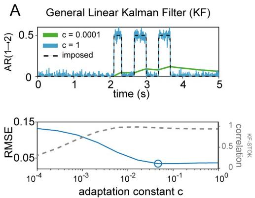

B   
Self-tuning Optimized Kalman (STOK)   
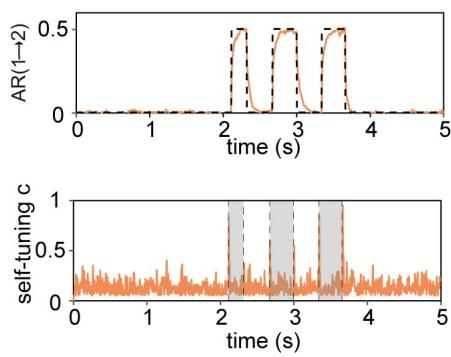

line

| time (s) | AR(1→2) | self-tuning c |
| -------- | ------- | ------------- |
| 0        | 0       | 0             |
| 1        | 0       | 0             |
| 2        | 0.5     | 0             |
| 3        | 0.5     | 0             |
| 4        | 0       | 0             |
| 5        | 0       | 0             |

Fig 1. Performance of KF and STOK on a simple simulated bivariate AR(1) process. (A) Performance of the KF filter at recovering the imposed structure of AR coefficients (top panel; black dashed lines) under two extreme values of the adaptation constant $( c = 0 . 0 0 0 1 , c = 1 )$ , highlighting the drastic variability of the estimates as a function of c: poor tracking performance is observed at the lowest (green line) and spurious noisy fluctuations at the highest c (blue line). The optimal c that minimizes the root-mean squared error (RMSE, blue line), lies at a point where KF and STOK performance are highly correlated (bottom panel; correlation shown by the grey dashed line). (B) Performance of the STOK filter, showing the high tracking ability and robustness to noise due to the self-tuning memory decay (top panel; orange line) which automatically increases tracking speed at relevant transition points between AR coefficient states (bottom panel; grey rectangles).

https://doi.org/10.1371/journal.pcbi.1007566.g001

advantages of regularization: STOK showed better performance than KF across all noise levels (paired t-test, all $\textstyle P < 0 . 0 5 )$ , but the non-regularized STOK outperformed KF only for SNR larger than 0.1 (paired t-test, $p \left( \mathrm { S N R } = 0 . 1 \right) > 0 . 0 5 ;$ all other $\textstyle P < 0 . 0 5 )$ . Therefore, we kept regularization as a default component of STOK.

As a second test, we evaluated the robustness of KF and STOK against instantaneous linear mixing. Linear mixing, or spatial leakage [42,43], is an important issue when estimating functional connectivity from magneto- and electro-encephalographic data (M/EEG) because the multicollinearity and non-independence of multiple time-series can lead to spurious connectivity estimates [44,45]. Spatial leakage usually contaminates signals in nearby sources with a mixing profile that is maximal at around 10–20 mm of distance and fades out exponentially at around 40–60 mm [42–44]. To simulate linear mixing, we randomly assigned locations in a two-dimensional grid (150x150 mm) to each node of the surrogate networks (n = 10) and we convolved the signals, at each time point, with a spatial Gaussian point spread function (mixing kernel) of different standard deviations (10, 15, 20, 25, 30 mm). We then evaluated performance of the KF and STOK filters as a function of the mixing kernel width (Fig 2C). The results of a repeated measures ANOVA revealed an interaction between Filter Type and Mixing Kernel $( \mathrm { F } ( 4 , 1 1 6 ) = 2 3 . 9 9 , \mathit { p } < 0 . 0 5 , { \eta _ { \mathrm { p } } } ^ { 2 } = 0 . 4 5 )$ , with STOK outperforming KF for mixing functions up to 20 mm of width (paired t-test, $\textstyle P < 0 . 0 5 )$ . These results suggest that the STOK filter is preferred for small and intermediate mixing profiles that are observed in source imaging data [42,43] and in connectivity results [44]. For higher mixing levels, the filters showed indistinguishable but still fair performance.

Two additional tests compared the sensitivity of the STOK and KF to changes in autoregressive coefficients of various durations and sizes. In a first simulation, we imposed a single state of functional connectivity with variable duration (from 25 to 500 ms in ten linearly spaced steps). In the second test, we varied the maximal size of autoregressive coefficients, allowing their variation within different ranges (from 0.05 to 0.5, ten linearly spaced steps). These additional tests showed how STOK outperforms KF even for very transient and fast

A   
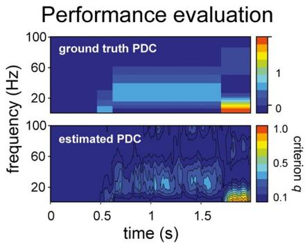

heatmap

| time (s) | frequency (Hz) | criterion g |
| -------- | -------------- | ----------- |
| 0.5      | 20             | 0.1         |
| 1.0      | 60             | 0.5         |
| 1.5      | 100            | 1.0         |

B   
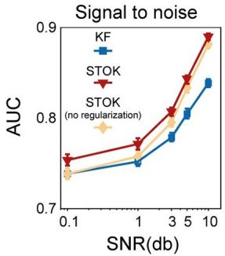

line

| SNR(db) | KF    | STOK  | STOK (no regularization) |
| ------- | ----- | ----- | ------------------------ |
| 0.1     | 0.73  | 0.75  | 0.74                     |
| 1       | 0.76  | 0.78  | 0.77                     |
| 3       | 0.80  | 0.82  | 0.81                     |
| 5       | 0.84  | 0.86  | 0.85                     |
| 10      | 0.86  | 0.89  | 0.88                     |

C   
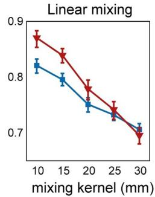

line

| mixing kernel (mm) | Red Line Value | Blue Line Value |
| ------------------ | -------------- | --------------- |
| 10                 | 0.88           | 0.82            |
| 15                 | 0.84           | 0.80            |
| 20                 | 0.78           | 0.76            |
| 25                 | 0.74           | 0.73            |
| 30                 | 0.70           | 0.71            |

D   
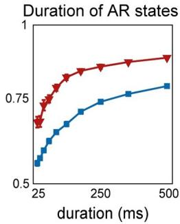

line

| duration (ms) | Duration of AR states |
| ------------- | --------------------- |
| 25            | 0.6                   |
| 275           | 0.7                   |
| 300           | 0.75                  |
| 325           | 0.8                   |
| 350           | 0.85                  |
| 375           | 0.9                   |
| 400           | 0.92                  |
| 425           | 0.94                  |
| 450           | 0.95                  |
| 475           | 0.96                  |
| 500           | 0.97                  |

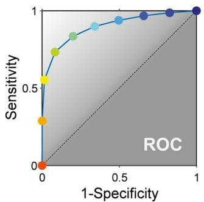

line

| 1-Specificity | Sensitivity |
| ------------- | ----------- |
| 0.0           | 0.0         |
| 0.1           | 0.3         |
| 0.2           | 0.5         |
| 0.3           | 0.6         |
| 0.4           | 0.7         |
| 0.5           | 0.8         |
| 0.6           | 0.9         |
| 0.7           | 0.95        |
| 0.8           | 0.98        |
| 0.9           | 0.99        |
| 1.0           | 1.0         |

E   
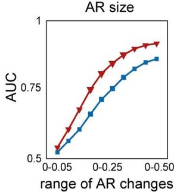

line

| range of AR changes | AUC (red line) | AUC (blue line) |
| ------------------- | -------------- | --------------- |
| 0-0.05              | 0.5            | 0.5             |
| 0-0.25              | 0.75           | 0.6             |
| 0-0.50              | 0.9            | 0.8             |

F   
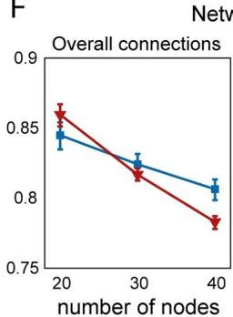

line

| number of nodes | Overall connections (red line) | Overall connections (blue line) |
| --------------- | ------------------------------- | -------------------------------- |
| 20              | 0.86                            | 0.84                             |
| 30              | 0.82                            | 0.83                             |
| 40              | 0.78                            | 0.81                             |

Network size

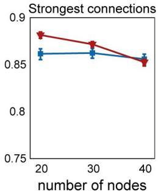

line

| number of nodes | Strongest connections (red line) | Strongest connections (blue line) |
| --------------- | ---------------------------------- | ----------------------------------- |
| 20              | 0.88                               | 0.86                                |
| 30              | 0.87                               | 0.86                                |
| 40              | 0.85                               | 0.86                                |

G   
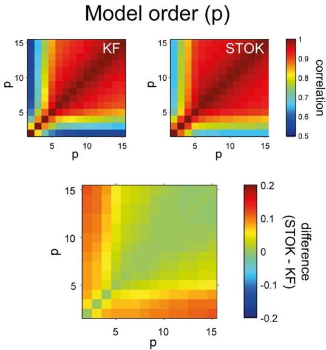

heatmap

| p \ d | 5    | 10   | 15   |
|-------|------|------|------|
| 5     | -0.2 | 0.0  | 0.1  |
| 10    | -0.1 | 0.1  | 0.2  |
| 15    | 0.0  | 0.2  | 0.3  |

H   
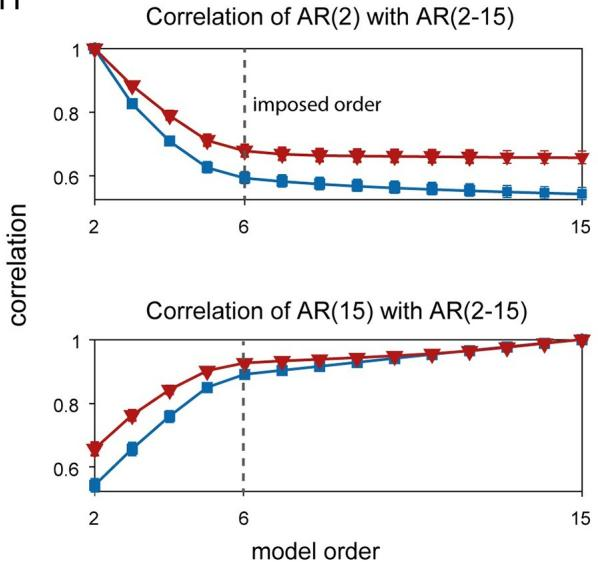

line

| model order | Correlation (AR(2) with AR(2-15)) | Correlation (AR(15) with AR(2-15)) |
| ----------- | ---------------------------------- | ---------------------------------- |
| 2           | 1.0                                | 0.6                                |
| 3           | 0.8                                | 0.7                                |
| 4           | 0.7                                | 0.8                                |
| 5           | 0.6                                | 0.85                               |
| 6           | 0.6                                | 0.9                                |
| 7           | 0.6                                | 0.9                                |
| 8           | 0.6                                | 0.9                                |
| 9           | 0.6                                | 0.9                                |
| 10          | 0.6                                | 0.9                                |
| 11          | 0.6                                | 0.9                                |
| 12          | 0.6                                | 0.9                                |
| 13          | 0.6                                | 0.9                                |
| 14          | 0.6                                | 0.9                                |
| 15          | 0.6                                | 1.0                                |

Fig 2. Comparison of the KF and STOK filters under the realistic simulation framework. (A) Method for evaluating the performance of KF and STOK against simulated data (ground truth). Ground truth PDC was binarized setting to 1 all connections larger than 0. Estimated Partial Directed Coherence (PDC) [41] was binarized using different criteria, based on the quantile discretization of the estimates (criterion q; top panel). Signal detection indexes were calculated for each criterion and the area under the curve (AUC) was used as performance measure. The color code of the dots in the ROC plot (bottom panel) reflects the different criteria and correspond to the colorbar for estimated PDC strength (top panel). (B) Comparison of KF, STOK without regularization and STOK as a function of different SNR, showing the overall larger AUC using STOK. Error bars reflect 95% confidence intervals. (C) AUC curves for KF and STOK as a function of linear mixing. (D-E) Performance of the two filters as a function of the duration (D) and size (E) of AR coefficients. (F) Performance of the two filters with increasing sample size: regularization favors strongest connections and sparse networks as the network size increases (right panel), reducing overall weakest connections (left panel). (G) Correlation matrices at varying model orders for KF and STOK (top two panels) and their difference (bottom panel, STOK minus KF). (H) Correlations extracted at specific orders (p 2 [2,15], with ground-truth model order = 6) showing the higher consistency of models estimated as p changes with STOK compared with KF.

https://doi.org/10.1371/journal.pcbi.1007566.g002

connectivity patterns (e.g., 25 ms of duration, Fig 2D; main effect of Filter Type: F(1, 29) = 4645.61, $\textstyle p < 0 . 0 5 , \eta _ { \mathrm { p } } ^ { \ 2 } = 0 . 9 9 )$ while preserving higher tracking accuracy also when the change in the autoregressive coefficients was small (Fig 2E, main effect of Filter Type: F(1, 29) = 9631.31, $\textstyle p < 0 . 0 5 , \eta _ { \mathrm { p } } ^ { \ 2 } = 0 . 9 9 )$ .

Another critical aspect that determines the quality of the estimated parameters in the context of both multi-trial Kalman filtering [46,47] and ordinary least-squares solutions [48,49] is the number of parameters (e.g., nodes in the network). In general, to obtain robust parameter estimates and to avoid overfitting, a small ratio between parameters and number of trials is recommended (the one-in-ten rule of thumb) [50–52]. When this ratio is large (many parameters, few trials), the model is underdetermined and in this case regularization may help to prevent overfitting and to ensure that a unique solution is found [53]. Thus, increasing the number of nodes in our simulation allowed to test the behavior of the KF and STOK filters, as well as the effect of regularization, as the number of parameters in the model increased. We ran a set of simulations with fixed numbers of trials (n = 200) and increasing number of nodes (20, 30, 40). As expected, a repeated measures ANOVA with factors Filter Type and Number of Nodes revealed a significant interaction $( \mathrm { F } ( 2 , 5 8 ) = 1 1 2 . 2 8 , \mathit { p } < 0 . 0 5 , { \eta _ { \mathrm { p } } } ^ { 2 } = 0 . 7 9 ;$ Fig 2F) showing a decrease in performance with increasing number of nodes (main effect of the Number of Nodes, $\mathrm { F } ( 2 , 5 8 ) = 6 3 . 6 8 , { p < 0 . 0 5 , { \eta _ { \mathrm { p } } } ^ { 2 } = 0 . 6 8 ) }$ . The interaction was due to a faster performance decrease for the STOK filter, which performed below KF levels for 30 and 40 nodes (paired t-test, both $\textstyle P < 0 . 0 5 )$ .

Regularization is designed to shrink weak coefficients toward zero and retain the strongest connections. We therefore examined whether the greater sensitivity to the number of nodes for the STOK filter was due to the diminishing of existing weak connections, by quantifying performance for the strongest connections only (magnitude above the 50% quantile). This reanalysis revealed an interaction between Filter Type and Number of Nodes $( \mathrm { F } ( 2 , 5 8 ) = 4 5 . 7 3 ,$ ${ p < 0 . 0 5 , \eta _ { \mathrm { p } } } ^ { 2 } = 0 . 6 1 ; \mathrm { F i g } 2 \mathrm { F } )$ in which the STOK outperformed KF for networks with 20 and 30 nodes (paired t-test, $\textstyle P < 0 . 0 5 )$ , while there was no significant difference for 40 nodes. Thus, for large-scale networks with a suboptimal ratio between the number of nodes and the number of trials, the regularized STOK filter provides a reliable sparse solution that accurately tracks the strongest dominant connections, while potentially preventing overfitting. Note that overall, however, performance was relatively good for both filters $( \mathrm { A U C } > 0 . 7 5 )$ .

As a final test in simulations, we investigated the robustness against variations in model order. The model order p (Eq (2)) is a key free parameter in tvMVAR modelling that determines the amount of past information used to predict the present state influencing the quality and frequency resolution of the estimated auto-regressive coefficients [54]. Whereas previous work has shown that the multi-trial KF is relatively robust to variations in model order [46,55], we asked whether the innovations in STOK also make it more robust against changes in model order. We simulated data with an imposed order of $\dot { P } ^ { = 6 }$ samples, and estimated PDC for both the STOK and the KF using a range of model orders from $p = 2 \tan p = 1 5$ . As shown in Fig 2G and 2H, the correlation between PDC values obtained with different p was overall higher for the STOK filter than for the KF. Particularly, the correlation was higher not only for $P \geq 6 ,$ but also for smaller model orders, that usually lead to biased PDC estimates and poor frequency resolution.

In sum, the four tests in a realistic simulation framework showed that the STOK filter has superior performance, higher tracking accuracy and greater robustness to noise than the KF. STOK achieves these results without the need to set an adaptation constant, and with greater robustness to selecting a sub-optimal model order, two properties that are highly desirable when modeling real neural time-series. We next tested STOK performance in event-related EEG data recorded during whisker stimulation in rats, and during visual stimulation in humans.

# Somatosensory evoked potentials in rat

To compare STOK and KF along two objective performance criteria we used epicranial EEG recordings in rats from a unilateral whisker stimulation protocol [55–58]. Criterion I tests the ability to detect contralateral somatosensory cortex (cS1, electrode e4) as the main driver of evoked activity at short latencies after whisker stimulation (8–14 ms) in the gamma frequency band (40–90 Hz). Criterion II tests the identification of parietal and frontal areas (e2 and e6, respectively) as the main targets of cS1 (e4) in the gamma band, at early latencies [55,57]. To evaluate criterion I, we compared the summed outflow from cS1 with the largest summed outflow observed from the other nodes. To evaluate criterion II, we compared functional connectivity strengths from cS1 to e2 and e6 to that of the strongest connection directed to any of the other nodes. To determine the latencies at which KF and STOK are able to reliably identify cS1 as the main driver, and parietal-frontal cortex as their main targets, both criteria were evaluated at each timepoint around whisker stimulation (from -10 to +60 ms).

We evaluated performance on the two criteria using different sampling rates (1000 Hz, 500 Hz). The sampling rate determines the number of lags required to use a given model order in milliseconds, thus, it also determines the number of parameters in the model and the risk of overfitting [59]. Previous work has demonstrated that high sampling rates can have adverse effects on connectivity estimates [55,60] and that for these data the best connectivity performance for multi-trial KF is with downsampled data (500 Hz, [55]). For comparison, the model order for both methods and the adaptation constant for the KF were set to their previously reported optimal values (p = 4 ms; c = 0.02) [55].

At a sampling rate of 500 Hz, both the KF and the STOK filter revealed a peak in the summed gamma outflow from cS1 at early latencies from whisker simulation, Fig 3C. Both filters identified cS1 as the main driver (criterion I), by showing a significant increase of summed gamma outflow from cS1 at the expected latencies (bootstrap distribution of differences against the $2 ^ { \mathrm { n d } }$ largest driver at each time point, n[bootstrap] = 10000, p < 0.05; Fig 3D). Similarly, for criterion II both methods identified e2 and e6 as the main targets of cS1 gamma influences, but the pattern was more restricted to the temporal window of interest in the STOK results (bootstrap distribution against the $2 ^ { \mathrm { n d } }$ largest receiver at each time point; Fig 3E).

At the higher sampling rate of 1000 Hz, the STOK filter returned an almost identical pattern of outflow and good performance on both criteria (Fig 3F–3H). The KF, however, presented inconsistent outflows and poor performance on criterion I, failing to identify cS1 (e4) as the main driver of gamma activity. On criterion II, KF still performed well at high sampling rate (Fig 3H).

Overall, these benchmark results in real data show that STOK performs well on both performance criteria. In addition, it suggests that STOK has better specificity in the temporal domain, as compared to the KF results that presented interactions persisting at longer latencies without returning to baseline. Importantly, STOK performance was unaffected by the sampling rate used.

# Visual evoked potentials in human

As a final step, we compared the STOK and KF filters in real human EEG data from a motion discrimination task. The processing of coherent visual motion is known to induce characteristics time-frequency patterns of activity in cortical networks, with early selective responses occurring from 150 ms after stimulus onset [60–62] that likely originate in temporo-occipital regions (e.g., MT+/V5, V3a), and more pronounced responses from 250 ms on [63,64]. A hallmark of coherent motion processing is the induced broadband gamma activity from about 200

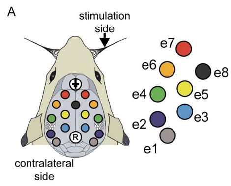

text_image

A
stimulation
side
e7
e6
e8
e4
e5
e3
e2
e1
contralateral
side

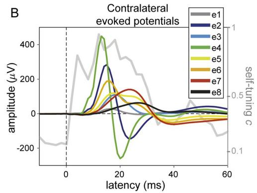

line

| latency (ms) | e1    | e2    | e3    | e4    | e5    | e6    | e7    | e8    |
| ------------ | ----- | ----- | ----- | ----- | ----- | ----- | ----- | ----- |
| 0            | -150  | 0     | 0     | 0     | 0     | 0     | 0     | 0     |
| 10           | 300   | 250   | 100   | 450   | 150   | 100   | 50    | 0     |
| 20           | 450   | 300   | 200   | 250   | 200   | 150   | 100   | 50    |
| 30           | 300   | 150   | 100   | 100   | 150   | 100   | 50    | 25    |
| 40           | 150   | 50    | 25    | 25    | 100   | 50    | 25    | 10    |
| 50           | 50    | 25    | 10    | 10    | 50    | 25    | 10    | 5     |
| 60           | -50   | 10    | 5     | 5     | 25    | 10    | 5     | 2     |

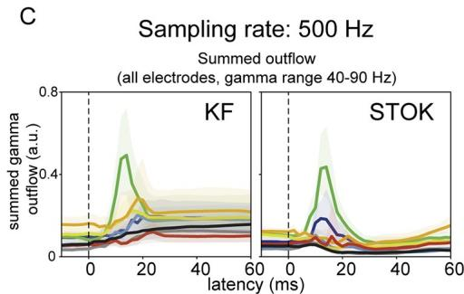

line

| Latency (ms) | Summed gamma outflow (a.u.) - KF | Summed gamma outflow (a.u.) - STOK |
| ------------ | ------------------------------- | --------------------------------- |
| 0            | ~0.1                            | ~0.1                              |
| 10           | ~0.4                            | ~0.3                              |
| 20           | ~0.7                            | ~0.4                              |
| 30           | ~0.3                            | ~0.2                              |
| 40           | ~0.2                            | ~0.1                              |
| 50           | ~0.1                            | ~0.1                              |
| 60           | ~0.1                            | ~0.1                              |

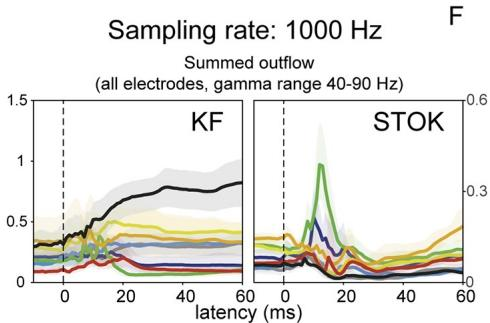

line

| latency (ms) | KF (summed outflow) | STOK (summed outflow) |
| ------------ | ------------------- | --------------------- |
| 0            | ~0.3                | ~0.3                  |
| 20           | ~0.7                | ~0.5                  |
| 40           | ~0.8                | ~0.2                  |
| 60           | ~0.9                | ~0.1                  |

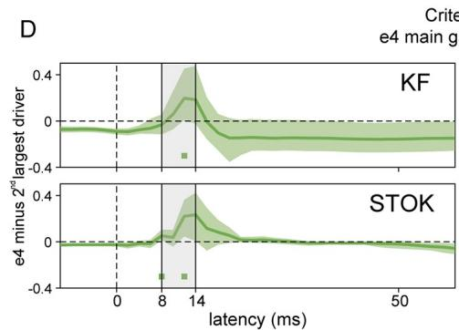

line

| latency (ms) | KF     | STOK   |
| ------------ | ------ | ------ |
| 0            | 0.0    | 0.0    |
| 8            | -0.3   | -0.4   |
| 14           | 0.4    | 0.3    |
| 50           | 0.0    | 0.0    |

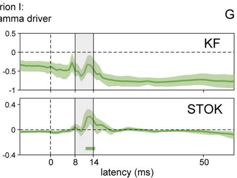

line

| latency (ms) | KF    | STOK  |
| ------------ | ----- | ----- |
| 0            | -0.5  | 0.0   |
| 8            | -0.3  | 0.1   |
| 14           | -0.2  | -0.4  |
| 50           | -0.1  | -0.1  |

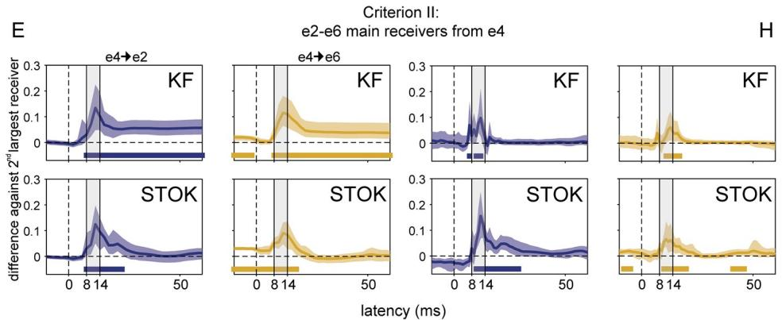

line

| Group | Time (ms) | KF Difference | STOK Difference |
|-------|-----------|---------------|-----------------|
| e4→e2 | 0         | ~0.1          | ~0.0            |
| e4→e2 | 8         | ~0.25         | ~0.15           |
| e4→e2 | 14        | ~0.1          | ~0.05           |
| e4→e2 | 50        | ~0.05         | ~0.0            |
| e4→e6 | 0         | ~0.1          | ~0.0            |
| e4→e6 | 8         | ~0.15         | ~0.1            |
| e4→e6 | 14        | ~0.05         | ~0.0            |
| e4→e6 | 50        | ~0.0          | ~0.0            |
| KF    | 0         | ~0.1          | ~0.0            |
| KF    | 8         | ~0.2          | ~0.1            |
| KF    | 14        | ~0.1          | ~0.05           |
| KF    | 50        | ~0.0          | ~0.0            |
| KF    | 8         | ~0.3          | ~0.2            |
| KF    | 14        | ~0.1          | ~0.05           |
| KF    | 50        | ~0.0          | ~0.0            |
| STOK  | 0         | ~0.1          | ~0.0            |
| STOK  | 8         | ~0.2          | ~0.1            |
| STOK  | 14        | ~0.1          | ~0.05           |
| STOK  | 50        | ~0.0          | ~0.0            |
| STOK  | 8         | ~0.3          | ~0.2            |
| STOK  | 14        | ~0.1          | ~0.05           |
| STOK  | 50        | ~0.0          | ~0.0            |

Fig 3. Results in benchmark rat EEG. (A) Layout of the multi-electrode grid used for recordings with the electrode and label codes used for all the plots. (B) Grand-average somatosensory evoked potentials at electrodes contralateral to stimulation (n = 10) showing the sequence of maximum voltage peaks, starting at e4 and propagating to e2-6. The gray line shows the evolution of the self-tuning memory parameter of the STOK filter. (C) Summed outflow in the gamma range (40–90 Hz) from all electrodes at the sampling rate of 500 Hz, revealing higher temporal precision with STOK filtering. (D-E) Criterion I and II: STOK and KF similarly identified e4 as the main driver at expected latencies (top panel), however, STOK recovered more temporally localized dynamics and evoked patterns in the total inflow of gamma activity from e4 to the two main targets e2-e6 (bottom panel). Colored squares at the bottom of each plot

indicate time points of significance after bootstrap statistics (n = 10000, p < 0.05; see Results). (F-H) Same set of results using a sampling rate of 1000 Hz, revealing the compromised estimates of KF and the consistent and almost invariant results obtained with STOK.

https://doi.org/10.1371/journal.pcbi.1007566.g003

ms onward [65–67], which is usually accompanied by event-related desynchronization in the alpha band [68].

To evaluate the performance of the STOK and KF filters at recovering known dynamics of coherent motion processing, we first compared the parametric power spectral density (PSD) obtained with each filter against the non-parametric PSD computed using Morlet wavelet convolution with linearly increasing number of wavelet cycles (from 3 to 15 cycles over the 1–100 Hz frequency range of interest; see Methods). As shown in Fig 4C, KF and STOK recovered the main expected dynamics in a qualitatively similar way as the non-parametric estimate. However, the STOK PSD showed significantly higher correlation with the non-parametric PSD as compared to the one obtained with the KF (Fig 4D, $r _ { \mathrm { K F } } = 0 . 5 3 \pm 0 . 1 8 ; r _ { \mathrm { S T O K } } =$ $0 . 8 5 \pm 0 . 0 5 ; p < 0 . 0 5 ;$ pairwise linear correlation between vectorized PSD). This shows that STOK produces more consistent PSD estimates across participants than KF. We note that both parametric methods appear to have higher temporal resolution than the non-parametric one, where temporal smoothing results from the trade-off between temporal and spectral resolution [69].

We next evaluated the overall time-frequency pattern of evoked functional connections obtained with STOK and KF. To this aim, we calculated PDC values from the tvMVAR coefficients estimated with the two filters and we averaged the results across nodes and hemifields. In this way, we obtained a global connectivity matrix of 16 cortical regions of interest (ROIs; see Methods, Human EEG) that summarized the evoked network dynamics in the time and frequency domain for each participant [70]. These matrices were then z-scored against a baseline period (from -100 to 0 ms with respect to stimulus onset) [71] and averaged across participants.

The resulting matrices of global event-related PDC changes revealed two critical differences between the STOK and the KF estimates. Firstly, STOK showed increased specificity in the temporal domain, as observed after collapsing across frequencies. While both filters showed an initial increase in global connectivity at early latencies (\~110–120 ms post-stimulus), only the STOK filter, after a significantly faster recovery from the first peak (STOK vs. KF at 144–160 ms, $\begin{array} { r } { p < 0 . 0 5 ) _ { : } } \end{array}$ , identified a second peak at critical latencies for motion processing (STOK vs. KF at 188–204 ms, $\textstyle P < 0 . 0 5 )$ and a more pronounced decrease of global connectivity at a later stage (STOK vs. KF at 328–340 ms, $\begin{array} { r } { p < 0 . 0 5 ; } \end{array}$ see Fig 4E). Interestingly, the second peak that STOK identified consisted of increased network activity in the high gamma band (70–90 Hz), and was due to due to increased outflow from motion- and vision-related ROIs that included areas MT+, V1 and FEF (see Fig 4E, bottom right). Secondly, the STOK filter showed increased specificity in the frequency domain. After collapsing the time dimension, STOK clearly identified decreased network activity at lower frequencies with a distinct peak in the higher alpha band (15 Hz), in agreement with the typical event-related alpha desynchronization, Fig 4C and 4E [68]. Contrarily, the network desynchronization profile estimated by the KF was less specific to the alpha range and more spread at lower and middle frequency bands (Fig 4E).

# Discussion

The non-stationarity nature of neuronal signals and their unknown noise components pose a severe challenge for tracking dynamic functional networks during active tasks and behavior.

A   
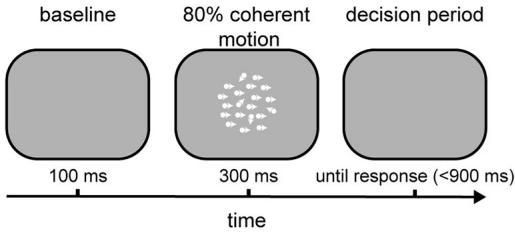

flowchart

B   
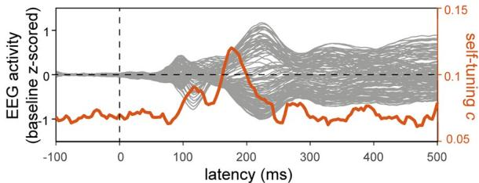

line

| latency (ms) | EEG activity (baseline z-scored) | self-tuning c |
| ------------ | -------------------------------- | ------------- |
| -100         | ~0.05                            | ~0.1          |
| 0            | ~0.05                            | ~0.1          |
| 100          | ~0.05                            | ~0.1          |
| 200          | ~0.1                             | ~0.15         |
| 300          | ~0.05                            | ~0.1          |
| 400          | ~0.05                            | ~0.1          |
| 500          | ~0.05                            | ~0.1          |

C   
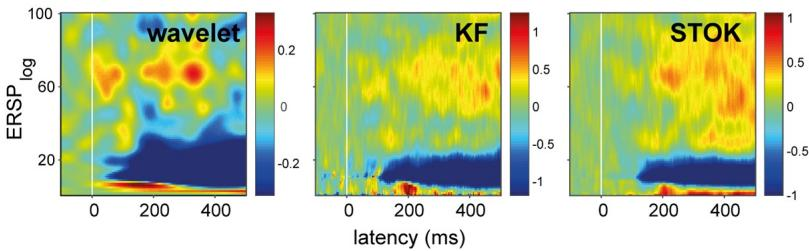

heatmap

| Method   | Latency (ms) | ERSP log |
| -------- | ------------ | -------- |
| wavelet  | 0            | ~0.2     |
| wavelet  | 200          | ~-0.2    |
| wavelet  | 400          | ~0       |
| KF       | 0            | ~-0.5    |
| KF       | 200          | ~-1      |
| KF       | 400          | ~-1      |
| STOK     | 0            | ~-0.5    |
| STOK     | 200          | ~-1      |
| STOK     | 400          | ~-1      |

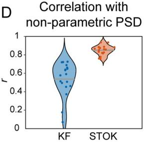

violin

| Group | Correlation |
|-------|-------------|
| KF    | 0.6         |
| STOK  | 0.8         |

E   
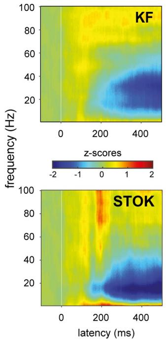

heatmap

| latency (ms) | KF frequency (Hz) | STOK frequency (Hz) | z-scores |
| ------------ | ----------------- | ------------------- | -------- |
| 0            | 100               | 100                 | -2       |
| 200          | 40                | 80                  | -1       |
| 400          | 20                | 60                  | 0        |
| 600          | 10                | 40                  | 1        |
| 800          | 5                 | 20                  | 2        |
| 1000         | 2                 | 10                  | 1        |

Connectivity results overall PDC (baseline z-scored)   
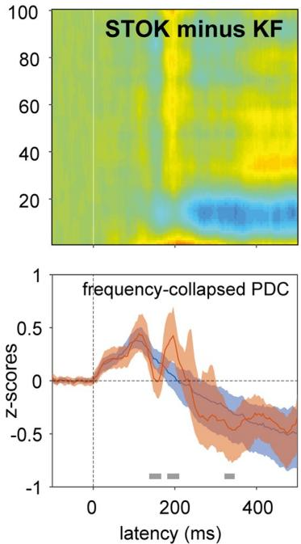

heatmap

| latency (ms) | STOK minus KF | frequency-collapsed PDC |
| ------------ | ------------- | ------------------------ |
| 0            | 0             | 0                        |
| 100          | 80            | 0.5                      |
| 200          | 60            | 0.3                      |
| 300          | 40            | -0.2                     |
| 400          | 20            | -0.5                     |

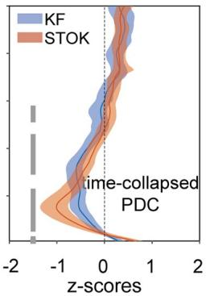

line

| z-scores | KF    | STOK  |
| -------- | ----- | ----- |
| -2       | 0     | 0     |
| -1       | 0     | 0     |
| 0        | 0     | 0     |
| 1        | 0     | 0     |
| 2        | 0     | 0     |

STOK minus KF sum evoked high-gamma flow (70-90 Hz,180-200 ms)   
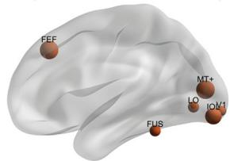

text_image

FEF
MT+
LO
IO/1
FUS

Fig 4. Results in real human evoked potentials during visual motion discrimination. (A) The visual motion discrimination paradigm presented during EEG recordings. Participants (n = 19) reported the presence of coherent motion in a briefly presented dot kinematogram (300 ms). (B) Shows grand-average event-related responses recorded at the scalp, with typical early (\~100 ms) and late (\~200 ms) components of visual processing. The orange line indicates the temporal dynamics detected by the self-tuning memory parameter c, that increases in anticipation of evident changes in the scalp signals. (C-D) Comparison of the non-parametric (wavelet) and parametric power spectrum densities (PSD) obtained with KF and STOK for one representative regions (MT+), with the violin plot showing the overall higher (and less variable) correlation between wavelet and STOK PSDs. (E) Global connectivity results from KF and STOK. Time-frequency plots show the results obtained with the two filters and their difference (STOK minus KF), graphically showing more evident dynamics obtained using the STOK filter. Line plots collapsing frequency and time highlight the statistical difference between STOK and KF results: STOK recovered multiple dynamic changes in overall connectivity patterns at physiologically plausible latencies (bottom plot) and characterized network desynchronization in the alpha range with higher precision (right-side plot). At frequencies (70–90 Hz) and latencies (180–200 ms) of interest for motion discrimination, the STOK revealed increased contribution to network activity (e.g., increased outflow) from visual regions, including MT+, and the frontal eye field (FEF; right-bottom plot).

https://doi.org/10.1371/journal.pcbi.1007566.g004

In the present work, we have introduced and validated a new type of adaptive filter named the Self-Tuning Optimized Kalman filter (STOK). The STOK is optimized for tracking rapidly evolving patterns of directed connectivity in multivariate time-series of non-stationary signals, a challenge that makes most traditional algorithms inefficient. We designed the new adaptive filter with the goal to provide a tool for dynamic, frequency-resolved network analysis of multivariate neural recordings that is computationally efficient.

We validated the STOK filter using signal detection theory and an exhaustive battery of tests in simulated and real data. In a newly developed realistic simulation framework we showed that STOK outperforms the classical Kalman filter with better estimation accuracy in the time-frequency domain, higher tracking ability for varying SNR, and greater robustness to noise under signal mixing and simulated volume conduction effects [42,43]. In real data, STOK showed an unprecedented ability to recover physiologically plausible patterns of timevarying, frequency-resolved functional connectivity during whisker-evoked responses in rats and during visually evoked EEG responses in humans. It achieved such performance without any explicit approximation of unknown noise components and requiring only a single free parameter (the autoregressive model order p). Additional tests demonstrated that STOK performance was robust against variations of the model order and of the sampling rate, two aspects that are known to be critical for other algorithms [54–56]. These results validate STOK as a powerful new adaptive filter, optimized for uncovering network dynamics in multivariate sets of simultaneously recorded signals. This can have potentially broad applications in the field of systems and cognitive neuroscience, for the investigation of time-varying networks using evoked M/EEG response potentials, multi-unit activity, local field potentials (LFPs) and calcium imaging, or event-locked analyses like spike-triggered averages and traveling waves [21,23,24,72].

The accurate and robust performance of the STOK filter results from innovations based on existing engineering solutions. These innovations equip the filter with three important strengths: 1) it overcomes the problem of unknown design components in adaptive filtering [73], 2) it prevents overfitting and 3) it can track dynamical systems at variable speed [74,75]. Below, we discuss each of these three important properties.

To overcome the problem of unknown design components, the STOK filter extends an elegant least-squares simplification of the Kalman filter [73] to the case of multi-trial neuronal and physiological recordings. The advantages of this formulation, in which no explicit definition of the measurement and model uncertainty is required, are greatest when sources of uncertainty cannot be determined in advance, as is the case for recordings of neural activity. Recorded neural signals are usually contaminated by mixtures of noise that are hardly separable, including measurement noise, noise from the recording environment, biological artefacts and intrinsic fluctuations that are not pertinent to the process under investigation [22,24,26]. Approaches based on Kalman filtering can be drastically affected by suboptimal strategies for modelling noise components [35,73,76]. Various existing methods try to approximate unknown noise components directly from the data, based on innovations and residuals [77– 79], covariance matching techniques [80], Bayesian, maximum-likelihood and correlationbased approaches [73,81], and other strategies adopted for neuroimaging [37,47,82]. However, in many cases the noise matrices estimated with such approximation methods may act as containers for unknown modelling errors [73], which leads to erroneous models and inadequate solutions [76,78]. To mitigate these risks, we adapted Nilsson’s approach, which retains a simple and flexible formulation of the filter that is applicable to the case of multi-trial recordings and is agnostic to the measurement and process noise. An important caveat for a filter of this form, however, is that it is suboptimal: while avoiding potentially inaccurate approximations of filter’s components, overfitting and the inclusion of noise in the estimates becomes very likely.

In order to prevent overfitting, we introduced a regularization based on singular value smoothing [83]. Singular value smoothing, or damped SVD [84] retains information up to a given proportion of explained variance, reducing the effect of singular values below a given threshold (the filtering factor, Eq 20). Theoretically, how much to retain depends on the SNR and on the partitioning of variance among the main components of the data under investigation. For instance, lowering the amount of explained variance may result in connectivity estimates that are driven by only a few components. Whether this is desirable or problematic depends upon the hypothesis under consideration, and on the component structure in the data. At the other extreme, regularization can be avoided for very low-dimensional problems (e.g., bivariate analysis) or very high signal-to-noise ratio datasets. Following previous work, we set the filtering factor to retain 99% of the explained variance [85–88], and found that this threshold yields high and reliable performance for surrogate data of variable SNR, and for two sets of real EEG recordings.

As a least-squares regularization, the SVD smoothing also promotes sparse solutions by shrinking tvMVAR coefficients of irrelevant and redundant components toward zero. This feature helps to overcome the curse of dimensionality by favoring sparser connectivity patterns, a feature that is also expected in real functional brain networks, because of the sparse topology of the underlying structural links [89,90]. Promoting a certain degree of sparseness in functional connectivity has been also the objective of several recent works combining Granger causality and MVAR modelling with regularization procedures (e.g., ℓ1 or $\ell _ { 2 }$ norm) [51,90– 92]. Adding group-LASSO penalties, for instance, has been shown to improve the Kalman filter’s sensitivity and the robustness of the estimates [93]. In its current form, STOK encourages sparse solutions by using a well-established technique for regularizing least-squares problems (SVD smoothing). The simplicity and flexibility of the least-squares reconstruction has the additional advantage that it becomes straightforward to implement other families of sparsity constraints, and to combine multiple constraints for the same estimate [90].

The third methodological innovation of the STOK filter is a self-tuning memory decay that automatically calibrates adaptation speed at each timepoint. The adaptation parameter is a critical factor in adaptive filtering that determines the trade-off between the filter’s speed and the smoothness of the estimates [38,47]. Methods that use a fixed adaptation constant assume that the system under investigation has a constant memory decay. But this assumption is unlikely to hold for neural systems that show non-stationary dynamics and sequential states of variable duration [6,34,74,94]. To allow flexible tracking speed, adaptive filters with variable forgetting factors have been previously introduced, but these always require additional parameters that need to be chosen a priori, for instance to regulate the window length in which the forgetting factor is updated [75,95,96]. Here we developed a new solution to determine the memory of the system in a completely data-driven fashion, by updating the filter’s speed using a window length of the model order p. At each time step, the residuals from independent past models of length p are used to derive a recursive update of the filter, through the automatic regulation of an exponential running average factor c. By combining the self-tuning memory decay with SVD regularization, the filter can run at maximum speed without the risk of introducing noisy fluctuations in the estimates, a problem that we observed for the classical Kalman filter in both surrogate and real data (Figs 1 and 4). Unlike other algorithms, therefore, the STOK filter can accurately track phasic and rapid changes in connectivity patterns, such as those that may underlie sequential evoked components during tasks and event-related designs.

The temporal evolution of the memory parameter c can potentially be used to indicate the presence of state transitions and stable states. When the model used to predict past segments of data is no longer a good model for incoming data, the memory of the filter decreases and the algorithm learns more from new data than from previous predictions, indicating a potential state transition. Conversely, when past models keep predicting new data with comparable residuals, the filter presents longer memory and slower updates, suggesting a stable state. In this way, the temporal evolution of the memory decay provides information about time constants and transition points in the multivariate process under investigation, an additional indicator that can be used to quantify the temporal evolution of neural systems [4,16,94]. Measures of state stability and changes, for instance, have been previously used in topographic EEG analysis [25,97], and we expect these be related to temporal variations in system memory.

In its current form, the STOK filter is a multi-trial algorithm, leveraging regularities and correlations across trials under the assumption that multiple trials are coherent, temporally aligned realizations of the same process [38,98]. Because of this assumption, a proper realignment and time-locking of the events of interest is recommended before STOK filtering, particularly when differences in the duration and onset of the process under investigation are to be expected [99,100]. In principle, the algorithm can also be adapted for real-time tracking, continuous recordings and single-trial modelling, provided that the least-squares reconstruction at its core is not ill-conditioned. This can be achieved, for instance, by adding more of the past measurements to the observation equation (e.g., Eq (20) in Nilsson, 2006). In addition to proper time-locking of the events of interest, we also recommend the use of relatively long baseline segments to prevent artifacts due to the initial adaptation stage of the filter. Future work will address the suitability of the STOK for single-trial and real-time tracking with dedicated tests.

As a note of caution, STOK can be used to derive directed functional connectivity measures within the Granger causality framework which has well-known strengths and limitations [101–103]. As such, it estimates linear temporal dependencies and statistical relationships among multiple signals in a data-driven way, without a guaranteed mapping onto the underlying neuronal circuitry [26,104–106]. However, STOK provides a novel formulation that is well-suited for incorporating model-based or physiologically-derived information that could favor more biophysically plausible interpretations. Structural connectivity matrices, for instance, or models of cortical layers’ communication, can be easily incorporated as priors for constraining the least-squares solution [107,108], thus allowing the estimation of dynamic functional connectivity on the backbone of a detailed biophysical model.

As evident from our tests on real stimulus-evoked EEG data, the STOK filter can recover key patterns of dynamic functional connectivity with high temporal and frequency resolution. This positions STOK to provide new insights into the fast dynamics of neural interactions that were previously unattainable due to methodological limitations. In the rat EEG data, for instance, STOK results indicated that gamma-band activity flows mainly from contralateral somatosensory cortex to neighboring regions in a restricted temporal window around the peak of evoked activity, followed by a global decrease of interactions that may underlie local post-excitatory inhibition and global desynchronization in the gamma range [109,110]. Before whisker stimulation, gamma-band influences from somatosensory cortex already showed increased functional connectivity with anterior, but not posterior, regions. Such detailed and temporally well-defined patterns of functional connections provide new valuable information for models of somatosensory processing in rats. Likewise, our results with human EEG recordings clearly indicated two critical windows of network interactions in the gamma range that emerged at plausible latencies of motion processing [65–67]. These interactions involved increased outflow from temporal-occipital regions, including MT+, and from the human homologue of the frontal eye field, providing a clear view on the network organization of motion processing.

As our results in human EEG suggest, STOK is also a promising tool for parametric timevarying power spectrum density estimation [111], as it is less affected by the choice of the model order compared to other parametric approaches [98]. Therefore, because of its ability to track fast temporal dynamics while maintaining high frequency specificity, STOK may be preferred for PSD analysis over non-parametric methods affected by the trade-off between temporal and frequency resolution [69].

To conclude, the STOK filter is a new tool for tvMVAR modeling non-stationary data with unknown noise components. It accurately characterizes event-related states, rapid network reconfigurations and frequency-specific dynamics at the sub-second timescale. STOK provides a powerful new tool in the quest of understanding fast functional network dynamics during sensory, motor and cognitive tasks [13,112,113], and can be widely applied in a variety of fields, such as systems-, network- and cognitive neuroscience.

# Methods

# Time-varying multivariate autoregressive modelling under the general linear Kalman Filter

Physiological time-series with multiple trials can be considered as a collection of realizations of the same multivariate stochastic process $Y _ { t } \mathrm { : }$

$$
Y _ {t} = \left[ \begin{array}{c c c} y _ {1, t} ^ {(1)} & \dots & y _ {d, t} ^ {(1)} \\ \vdots & \ddots & \vdots \\ y _ {1, t} ^ {(N)} & \dots & y _ {d, t} ^ {(N)} \end{array} \right] \quad t = t _ {1},.., t _ {T} \tag {1}
$$

where t refers to time, T is the length of the time-series, N the total number of trials and d the dimension of the process $( \mathrm { e . g . }$ , number of channels/electrodes). The dynamic behavior of Y over time can be adequately described by a tvMVAR model of the general form:

$$
Y _ {t} = \sum_ {k = 1} ^ {p} A _ {k, t} Y _ {t - k} + \varepsilon_ {t} \tag {2}
$$

where $A _ { k , t }$ are $[ d x d ]$ matrices containing the model coefficients (AR matrices), $\scriptstyle \varepsilon _ { t }$ is the zeromean white noise with covariance matrix $\Sigma _ { \varepsilon }$ (also called the innovation process), and $\boldsymbol { p }$ is the model order.

An efficient approach to derive the AR coefficients and the innovation covariance $\Sigma _ { \varepsilon }$ in Eq 2 is the use of state-space models [35,37,38]. State-space models apply to problems with multivariate dynamic linear systems of both stationary and non-stationary stochastic variables [114] and can be used to reconstruct the set of linearly independent hidden variables that regulate the evolution of the system over time [26]. The general linear Kalman filter (KF) [36,38] is an estimator of a system state and covariance that has the following state-space representation:

$$
x _ {t} = \Phi_ {t - 1} x _ {t - 1} + \omega_ {t - 1} \tag {3}
$$

$$
z _ {t} = H _ {t} x _ {t} + v _ {t} \tag {4}
$$

Eqs (3) and (4) are called the state or system equation and the observation or measurement equation, respectively. In Eq 3, the hidden state x at time t has a deterministic component given by the propagation of the previous state $x _ { t - 1 }$ through a transition matrix F, and a stochastic component given by the zero-mean white noise sequence ω of covariance $Q _ { t } .$ . In Eq 4, the observed data z at time t are expressed as a linear combination of the state variable x with projection measurement matrix H, in the absence of noise. The term $\nu _ { t }$ is a random white noise perturbation (zero mean, covariance $R _ { t } )$ corrupting the measurements.

To recursively estimate the hidden state x at each time $( t = t _ { 1 } , . . . , t _ { T } )$ , the Kalman filter alternates between two steps, the prediction and the update step. In the prediction step, the state and the error covariance are extrapolated as:

$$
\hat {x} _ {t} ^ {(-)} = \Phi_ {t - 1} \hat {x} _ {t - 1} ^ {(+)} \tag {5}
$$

$$
P _ {t} ^ {(-)} = \Phi_ {t - 1} P _ {t - 1} ^ {(+)} \Phi_ {t - 1} ^ {T} + Q _ {t - 1} \tag {6}
$$

where $\hat { x } _ { t } ^ { ( - ) }$ and $P _ { t } ^ { ( - ) }$ are the a priori or predicted state and the error covariance at time t, based on the propagation of the previous estimated state and covariance $\hat { x } _ { t - 1 } ^ { ( + ) }$ and $P _ { t - 1 } ^ { ( + ) }$ through the transition matrix F. The superscript T denotes matrix transposition. Note that Eq (6) contains an explicit term for the process noise covariance matrix $Q .$ .

In the update step, a posteriori estimates of the state and error covariance are refined according to:

$$
K _ {t} = P _ {t} ^ {(-)} H _ {t} ^ {T} (H _ {t} P _ {t} ^ {(-)} H _ {t} ^ {T} + R _ {t}) ^ {- 1} \tag {7}
$$

$$
\hat {x} _ {t} ^ {(+)} = \hat {x} _ {t} ^ {(-)} + K _ {t} (z _ {t} - H _ {t} \hat {x} _ {t} ^ {(-)}) \tag {8}
$$

$$
P _ {t} ^ {(+)} = (I - K _ {t} H _ {t}) P _ {t} ^ {(-)} \tag {9}
$$

where I is the identity matrix, and $K _ { t }$ is the Kalman Gain matrix reflecting the relationship between uncertainty in the prior estimate and uncertainty in the measurements (in more simple form, k ¼ s estimates2 estimateþs2 measurement $\begin{array} { r } { k = \frac { \sigma ^ { 2 } { } _ { e s t i m a t e } } { \sigma ^ { 2 } { } _ { e s t i m a t e } + \sigma ^ { 2 } { } _ { m e a s u r e m e n t } } ; } \end{array}$ , with $\sigma ^ { 2 } = \mathrm { v a r i a n c e } )$ . The Kalman Gain thus quantifies the relative reliability of measurements and predictions and determines which one should be given more weight during the update step: if measurements are reliable, the measurement noise covariance $R _ { t }$ is smaller and $K _ { t }$ from $\operatorname { E q } 7$ will be larger; if measurements are noisy (larger $R _ { t } )$ , $K _ { t }$ will be smaller. The effect of $K _ { t }$ on the updated a posteriori state estimate $\hat { x } _ { t } ^ { ( + ) }$ is evident from Eq 8, where the updated state at time t is a linear combination of the a priori state $\hat { x } _ { t } ^ { ( - ) }$ and a weighted difference between the current measurements $z _ { t }$ and the predicted measurement based on $\hat { x } _ { t } ^ { ( - ) }$ (e.g., the residuals or measurement innovation term $( z _ { t } - H _ { t } \hat { x } _ { t } ^ { ( - ) } )$ on the right-hand side of Eq (8)). Thus, when the Kalman Gain increases following reliable measurements, the contribution of the measurement innovation will increase as well, and the a posteriori estimate $\hat { x } _ { t } ^ { ( + ) }$ will contain more from actual measurements and less from previous predictions. Conversely, when the Kalman Gain decreases following noisy measurements, the a posteriori estimate $\hat { x } _ { t } ^ { ( + ) }$ will be closer to the a priori predicted state $\hat { x } _ { t } ^ { ( - ) }$ . It is important to note that the Kalman Gain minimizes the trace of the prediction error covariance $P _ { t } ^ { ( + ) } \left[ 3 5 \right]$ and depends on the innovation covariance term $( H _ { t } P _ { t } ^ { ( - ) } H _ { t } ^ { T } + R _ { t } ) ^ { - 1 }$ in Eq 7, which includes explicitly the measurement noise R and the process noise covariance Q from Eq 6. When both w and ν are Gaussian with $w \sim N ( 0 , R ) , \nu \sim N ( 0 , Q )$ and $E [ w _ { t } \nu _ { t } ^ { T } ] = 0$ , and the design and noise matrices $H , \Phi , R ,$ and Q are known, the state-space Kalman filter is the optimal linear adaptive filter [35].

In the context of physiological time-series, however, the optimal behavior of the Kalman filter is not assured and the algorithm requires some specific accommodations to account for: 1) the lack of known transition matrix F and measurement matrix H, and 2) the unknown covariance matrices R, and Q. To accommodate 1), the transition matrix F is usually replaced by an identity matrix I [37,38], which propagates the state x from time t − 1 to $t ,$ such that the state in Eq (3) follows a first order random walk model [115]:

$$
x _ {t} = x _ {t - 1} + \omega_ {t - 1}. \tag {10}
$$

The objective of the filter is to reconstruct the hidden tvMVAR process generating the observed physiological signals for each time t, which implies the following links between the state-space representation in Eqs (3) and (4) and the tvMVAR model in Eqs (1) and (2):

$$
x _ {t} = \left[ \begin{array}{c} A _ {1, t} ^ {(1)} \\ \vdots \\ A _ {p, t} ^ {(N)} \end{array} \right], \quad z _ {t} = Y _ {t} \tag {11}
$$

where $x _ { t }$ has dimensions $[ d ^ { * } p \mathbf { x } p ]$ and $z \left[ N \mathbf { x } d \right]$ contains the measured signals at the current time t.

To establish the connection with the tvMVAR model, the measurement projection matrix H is redefined as:

$$
H _ {t} = (Y _ {t - 1}, \dots , Y _ {t - p}) \tag {12}
$$

such that measurement Eq (4) now expresses the observed data as a linear combination of the state $x _ { t }$ and past measurements $H _ { t }$ with additional perturbation $\nu _ { t } .$ This formulation suggests that the hidden state $x _ { t }$ can be represented as a noise-contaminated least-squares reconstruction from present and past measurements:

$$
x _ {t} = H _ {t} ^ {- 1} z _ {t} - v _ {t}. \tag {13}
$$

The second critical step in applying Kalman filtering to physiological data is the determination of the filter covariance matrices R, and Q. A widely used approach is to derive R recursively from measurement innovations and to approximate Q as a diagonal weight matrix that determines the rate of change of $P _ { t } ^ { ( - ) } ( [ 3 7 , 3 8 , 4 7 ]$ , see also [116] for a list of alternative methods). With this approach, R^ is initialized as $I \left[ d \mathbf { x } d \right]$ and adaptively updated from the measurement innovations (the pre-update residuals) as:

$$
\Sigma_ {r} = \frac {\left(z _ {t} - H _ {t} \hat {x} _ {t} ^ {(-)}\right) ^ {T} (z _ {t} - H _ {t} \hat {x} _ {t} ^ {(-)})}{N - 1}, \qquad \hat {R} _ {t} = \hat {R} _ {t - 1} + c (\Sigma_ {r} - \hat {R} _ {t - 1}) \tag {14}
$$

where $\Sigma _ { r }$ is the covariance of measurement innovations, N is the total number of trials and c $( 0 \leq c \leq 1 )$ is a constant across time that regulates the adaptation speed for $\hat { R } _ { t }$ [38]. $\hat { R } _ { t }$ is computed before the Kalman update to replace the unknown $R _ { t }$ in the Kalman Gain with

$$
K _ {t} = P _ {t} ^ {(-)} H _ {t} ^ {T} \left(H _ {t} P _ {t} ^ {(-)} H _ {t} ^ {T} + t r \left(\hat {R} _ {t}\right) I _ {N}\right) ^ {- 1} \tag {15}
$$

where tr denotes the trace of a matrix and $I _ { N }$ is the identity matrix $\left[ N \mathbf { x } N \right]$ . The other unknown process noise covariance $Q ,$ is replaced by a rate of change matrix $C ^ { 2 } I _ { [ d x p ] }$ added to the diagonal of $P _ { t } ^ { ( - ) }$ in Eq (6) [117]. The two constants c and C are usually selected as identical and determined a priori [38,118–120] or through cost functions that minimize residual errors [37,121,70]. In what follows we assume c and C to be identical and denote them as adaptation constant c.

The lack of a known transition matrix $\mathrm { ( E q } ( 5 ) )$ and the way that R and Q are approximated makes the adaptation constant c the critical free parameter that determines the trade-off between fast adaptation and smoothness: a small c value adds inertia to the system, reducing the ability to track and to recover from dynamic changes in the true state while a large c value increases the contribution of measurements to each update in Eq (7) and the uncertainty associated with $P _ { t } ^ { ( - ) }$ . Thus, setting c too large yields highly variable estimates that fluctuate around the true state introducing disturbances to the estimated state, rather than filtering them out [122]. Although there exists no objective criterion to determine the optimal c in real data [39], several optimization approaches are available [70,116,121], but they are not universal to all types of data [39]. Choosing c a priori or based on previous findings is complicated by a further non-trivial aspect of the filter: the trace approximation of R in Eq (15) $\left( t r ( \hat { R } _ { t } ) \right)$ implies that the system’s dimensionality co-determines the uncertainty in measurements, the Kalman gain and the relative weight assigned to measurements. Thus, the effect of c on the update depends on the number of signals considered. Moreover, c is assumed stationary and constant for every time step t, but this assumption may not be warranted in the context of non-stationary neuronal time-series [74].

These critical aspects, along with the lack of an objective criterion for selecting c, increases the risk of erroneous models and suboptimal filtering of physiological data which complicates the validity of inferences and the generalization of findings.

# The STOK: Self-Tuning Optimized Kalman filter

The critical role of the adaptation constant c when both R and Q are unknown motivated us to develop a new adaptive filter that presents the following properties: 1) It does not require any explicit knowledge of R and Q [73,123]; 2) It embeds a self-tuning factor that auto-calibrates the adaptation speed at each time step. Property 1) is achieved by extending the solution for Kalman filtering with unknown noise covariances proposed in Nilsson (2006, [73]) to the case of multi-trial time-series. According to Nilsson (2006, [73]), a reasonable tracking speed avoiding noise fluctuations can be achieved assuming the following relationship:

$$
H P H ^ {T} \approx c R \tag {16}
$$

that is, the error covariance matrix $P ,$ projected onto the measurement space, is a scaled version of the measurement noise covariance matrix R, with c a scalar positive tuning factor (see [73] for a complete derivation). Assumption [16] allows a new formulation of the Kalman gain in Eq (7) as:

$$
\begin{array}{l} {K _ {t}} {= P _ {t} ^ {(-)} H _ {t} ^ {T} \big (H _ {t} P _ {t} ^ {(-)} H _ {t} ^ {T} + R _ {t} \big) ^ {- 1}} \\ = H _ {t} ^ {+} c R _ {t} \left(c R _ {t} + R _ {t}\right) ^ {- 1} \tag {17} \\ = c H _ {t} ^ {+} (c + 1) ^ {- 1} = \frac {c}{1 + c} H _ {t} ^ {+} \\ \end{array}
$$

where the apex + stands for the Moore-Penrose pseudoinverse. By substituting $K _ { t }$ from Eq (17) in Eq (8), the new state update becomes:

$$
\begin{array}{l} \hat {x} _ {t} ^ {(+)} = \hat {x} _ {t} ^ {(-)} + K _ {t} (z _ {t} - H _ {t} \hat {x} _ {t} ^ {(-)}) \\ = \hat {x} _ {t} ^ {(-)} + \frac {c}{1 + c} H _ {t} ^ {+} \left(z _ {t} - H _ {t} \hat {x} _ {t} ^ {(-)}\right) \tag {18} \\ = \frac {\hat {x} _ {t} ^ {(-)} + c H _ {t} ^ {+} z _ {t}}{1 + c} \\ \end{array}
$$

in which the update of $\hat { x } _ { t } ^ { ( + ) }$ is a weighted average of past predictions $\hat { x } _ { t } ^ { ( - ) }$ and a least-squares reconstruction from recent measurements $H _ { t } ^ { + } z _ { t } .$ . When $H _ { t }$ is defined as in Eq (12), $H _ { t } ^ { + } z _ { t }$ is equivalent to finding the set of MVAR coefficients at each time t, by least-squares regression of the present signals $z _ { t }$ on the past signals $H _ { t }$ with multiple trials as observations.

The link with a least-squares problem was already suggested in Eq (13), however, by comparing Eq (13) with Eq (18), it is evident that the new state update does not incorporate any component of measurement noise $\nu _ { t } .$ This implies that in the presence of noisy measurements, the new filter might be susceptible to overfitting and sensitive to noise. To overcome this issue, we introduced regularization, a widely-used strategy to reduce model complexity and to prevent overfitting in the domain of least-squares problems [90,91,124]. More precisely, we employed a singular value decomposition (SVD)-based noise filtering with a standard form regularization [124,125] and a data-driven determination of the tuning parameter. Consider $\tilde { H }$ , the SVD of the N x dp matrix H:

$$
\tilde {H} = U S V ^ {T} \tag {19}
$$

where U and V are orthonormal matrices and S is a N x N diagonal matrix of singular values in decreasing order. A regularized solution for the pseudoinverse $H ^ { + }$ used in Eq (18) can be derived from Eq (19) as

$$
\tilde {H} ^ {+} = V \Gamma_ {r} ^ {+} U ^ {T}, \quad \Gamma_ {r} ^ {+} = \left[ \begin{array}{c c c} s _ {1, 1} / s _ {1, 1} ^ {2} + \lambda & \dots & 0 \\ \vdots & \ddots & \vdots \\ 0 & \dots & s _ {N, N} / s _ {N, N} ^ {2} + \lambda \end{array} \right] \tag {20}
$$

in which the diagonal elements of $\Gamma _ { r } ^ { + }$ correspond to the diagonal of the inverse of S, subject to a smoothing filter that dampens the components lower than a tuning factor λ [125]. To determine λ in a completely data-driven fashion and to avoid excessive regularization, we use a variance-based criterion: At each time step, λ takes on the value that allows to retain components that together explain at least 99% of the total variance in $H _ { t } .$ The 99% criterion is a canonical conservative threshold recommended in dimensionality reduction and noise filtering of physiological time-series [85–88], but the value of this threshold can in principle be tuned to the signal-to-noise ratio.

The second property that we introduced in the STOK filter is a self-tuning memory based on the adaptive calibration of the tuning factor c in Eq (18). The single constant c is a smoothing parameter in the exponential smoothing of the state $\hat { x } _ { t } ^ { ( + ) }$ and determines the exponential decay of weights assigned to past predicted states, as they get older—the fading memory of the system. Whereas a fixed adaptation constant assumes a steady memory decay of the system, which could not be appropriate in modelling neuronal processes and dynamics [74], solutions for variable fading factors have been widely explored (see [126] for a comprehensive list), also in relation to intrinsic dynamics of physiological signals [127]. Here we propose a new method based on monitoring the proportional change in innovation residuals from consecutive segments of time, according to:

$$
c _ {t} = \min \left(b + \left[ \frac {\left| t r (\hat {\Sigma} _ {\varepsilon} ^ {n e w}) - t r (\hat {\Sigma} _ {\varepsilon} ^ {o l d}) \right|}{t r (\hat {\Sigma} _ {\varepsilon} ^ {o l d})} \right], 1 - b\right) \tag {21}
$$

where b is a baseline constant (b = 0.05) that prevents the filter to perform at excessively slow tracking speed, such that $c \in ( 0 . 0 5 , 0 . 9 5 )$ , and $t r ( \hat { \Sigma } _ { \varepsilon } ^ { n e w / o l d } )$ is the trace of the estimated measurements innovation covariance for consecutive segments of data: new is a segment comprising samples from t to $t - p ,$ and old is a segment from t − (p + 1) to t − 2p. The use of successive residuals to adjust variable fading factors, as well as the choice of segments or averaging windows to prevent spurious effects of instantaneous residuals, is common practice in adaptive filtering [75,128] but requires the selection of an additional parameter that specify the windows length. Here we set p—the model order—as the segments’ length and compare residuals from two consecutive non-overlapping segments in order to adjust c at each time t. The rationale behind this strategy is to avoid any additional parameter, considering the morel order (i.e., the amount of past information chosen to best predict the signals) as the optimal segment for extrapolating residuals. In addition, non-overlapping segments are used to monitor changes in residuals from independent sets of data. In other words, Eq (21) allows c to increase as the residuals generated by the model in predicting new data increase with respect to an independent model from the immediate past: when the model is no longer capable of explaining incoming data, tracking speed increases and the memory of the system shortens.

# Partial Directed Coherence (PDC)

To compare STOK and KF using a time-frequency representation of directed connectivity, we computed the squared row-normalized Partial Directed Coherence ([41], PDC; [129]). PDC quantifies the direct influence from time-series j to time-series l, after discounting the effect of all the other time-series. In its squared and row-normalized definition, PDC from j to l is a function of $\mathrm { A } _ { l j } ,$ obtained as:

$$
\bar {\pi} _ {l j} (f, t) = \frac {| \bar {A} _ {l j} (f , t) | ^ {2}}{\sum_ {m = 1} ^ {d} | \bar {A} _ {l m} (f , t) | ^ {2}} \tag {22}
$$

where $\bar { A } ( f , t )$ is the frequency representation of the A coefficients at time t, after the Z-transform:

$$
\bar {A} (f, t) = \sum_ {k = 1} ^ {p} A _ {k, t} z ^ {- k}, \quad z = e ^ {- i 2 \pi f} \tag {23}
$$

with i as the imaginary unit. The square exponents in Eq (22) enhance the accuracy and stability of the estimates [129] while the denominator allows the normalization of outgoing connections by the inflows [57].

The parametric time-varying power spectral density of each time-series (PSD) can be estimated using the prediction error covariance matrix $\hat { \Sigma } _ { \varepsilon }$ and the complex matrix in Eq (23), as:

$$
P S D = B (f, t) \hat {\Sigma} _ {\varepsilon} B (f, t) ^ {*} \tag {24}
$$

where $B ( f , t )$ is the transfer function equal to the inverse of $\bar { \boldsymbol { A } } ( \boldsymbol { f } , t )$ , and � is the complex conjugate transpose. Since $\Sigma _ { \varepsilon }$ is time invariant by definition, $\hat { \Sigma } _ { \varepsilon }$ was estimated in both the KF and the STOK as the median measurements’ innovation covariance $( \mathrm { e . g . } , \hat { R } _ { t }$ in KF) across the last half of samples, in order to remove the effect of the initial filters’ adaptation stage.

# Simulation framework

To systematically compare the STOK and KF performance against known ground truth, we developed a new Monte Carlo simulation framework that approximates properties of realistic brain networks, extending beyond classical approaches with restricted number of nodes and fixed connectivity patterns [28]. Signals were simulated according to a reduced AR(6) process in which coefficients of a AR(2) model were placed in the first two lags for diagonal elements, and at variable delays (up to 5 samples) for off-diagonal elements [130]. Surrogate networks were created assuming existing physical links among 60–80% of all possible connections [131] and directed functional interactions were placed in a subset of existing links (50%) with variable time-frequency dynamics. Dominant oscillatory components in the low frequency range (e.g., 1–25 Hz) were generated by imposing positives values in the diagonal AR(2) coefficients of the simulated tvMVAR matrix [132]. Interactions at multiple frequencies were generated by randomly assigning both positive and negative values to the AR(2) coefficients outside the diagonal. The magnitude of AR coefficients was randomly determined (range: 0.1–0.5, in steps of 0.01) and off-diagonal coefficients were scaled by half magnitude. This range and scaling were chosen to match patterns observed in human EEG data.

To mimic dynamic changes in connectivity patterns, the structure and magnitude of offdiagonal AR coefficients varied across time, visiting three different regimes of randomly determined onset and transition times and with the only constrain to remain constant for at least 150 ms, approximating the duration of quasi-stationary and metastable functional brain states [6,133]. For each simulated regimen, the stochastic generation of AR coefficients was reiterated until the system reached asymptotic stability, i.e., satisfying the condition of real eigenvalues lower than zero.

Time-series for multiple trials (Fs = 200 Hz; duration = 2 s) were obtained by feeding the same tvMVAR process with generative zero-mean white noise of variance 1, and imposing a small degree of correlation $( r = 0 . 1 \pm 0 . 0 7 )$ in the generative noise across trials, reflecting the assumption that trials are realizations of the same process [38] and in line with the correlation among trials observed in the human EEG dataset. Except when specific parameters were varied, all simulations were done with 10 nodes, 200 trials and no additive noise. When additive noise was included in the simulation, the signal-to-noise ratio (SNR) was determined as the ratio between the squared amplitude of the signal and the squared amplitude of the additive noise.

To compare STOK and KF performance, we used the Receiving Operating Characteristic method (ROC) [40]. For each simulated network, we first obtained a target ground truth by calculating PDC values directly from the simulated tvMVAR matrices, for frequencies between 1 and 100 Hz. Separate PDC matrices were then computed from the AR coefficients estimated with the STOK and KF filters. The ground truth PDC values were binarized using a range of thresholds criteria (e.g., PDC > 0; or $\mathrm { P D C } > 0 . 5$ quantile, see Fig 2A), defining zeros as signal absent and ones as signal present. Similarly, the estimated PDC values were binarized using a range of criteria at which connections were considered present or absent. The range of criteria consisted of twenty equally-spaced quantiles (from the $1 ^ { \mathrm { s t } }$ to the $9 9 ^ { \mathrm { t h } }$ quantile) from the distribution of each estimated PDC. Sensitivity and specificity indexes were then computed for each criterion against the ground truth PDC and used to derive the ROC curve. Finally, overall performance was quantified by the area under the ROC curve (AUC, see Fig 2A). This method has the advantage of being independent of the range of values in each estimated PDC and does not require any parametric or bootstrap procedure to determine statistically significant connections.

For each condition tested (see Results), we ran 30 realizations with different combination of parameters and the resulting AUC values were used in Analysis of Variance (ANOVA) and ttest statistical analysis using an alpha criterion of 0.05 for rejecting the null hypothesis.

# Benchmark rat EEG

These EEG data were previously recorded from a grid of 16 stainless steel electrodes placed directly on the skull bone of 10 young Wistar rats (P21; half males) during unilateral whisker stimulations under light isoflurane anesthesia (Fig 3A and 3B). All animal handling procedures were approved by the Office Ve´te´rinaire Cantonal (Geneva, Switzerland) in accordance with

Swiss Federal Laws. Data were originally acquired at 2000 Hz and bandpass filtered online between 1 and 500 Hz. Additional details about the recording can be found elsewhere [57,58]. Data are freely available from https://osf.io/fd5ru.

The STOK filter and KF were applied to the entire network of 16 channels and used to derive PDC estimates. PDC results from the left and right stimulation were then combined within animals and only contralateral electrodes were further analyzed [57].

# Human EEG

These human EEG data were taken from an ongoing project aimed at investigating the connectivity patterns of functionally specialized areas during perceptual processing. Data were recorded at 2048 Hz with a 128-channel Biosemi Active Two EEG system (Biosemi, Amsterdam, The Netherlands) while nineteen participants (3 males, mean age = 23 ± 3.5) performed a coherent motion detection task in a dimly lit and electrically shielded room. Each trial started with a blank interval of 500 ms followed by a central dot kinematogram lasting 300 ms (dot field size = 8˚; mean dot luminance = 50%). In half of the trials, 80% of the dots were moving toward either the left or right, with the remaining 20% moving randomly. In the other half of trials, all dots were moving randomly. Participants had to report the presence of coherent motion by pressing one of two buttons of a response box (Fig 4A). After the participant’s response, there was a random interval (from 600 to 900 ms) before the beginning of a new trial. There were four blocks of 150 trials each, for a total of 600 trials, (300 with coherent motion). Trials with coherent and random motion were interleaved randomly. Stimuli were generated using Psychopy [134] and presented on a VIEWPixx/3D display system (1920 ×1080 pixels, refresh rate of 100 Hz). All participants provided written informed consent before the experiment and had normal or corrected-to-normal vision. The experiment was approved by the local ethical committee.

EEG data were downsampled to 250 Hz (anti-aliasing filter: cut-off frequency = 112.5 Hz; transition bandwidth = 50 Hz) and detrended to remove slow fluctuations (<1 Hz) and linear trends [135]. The power line noise (50 Hz) was removed using the method of spectrum interpolation [136]. EEG epochs were then extracted from the continuous dataset and time-locked from -1500 to 1000 ms relative to stimulus onset. Noisy channels were identified before preprocessing and removed from the dataset (average proportion of channels removed across participants: 0.14 ± 0.06). Individual epochs containing non-stereotyped artifacts, peristimulus eye blinks and eye movements (occurring within ±500 ms from stimulus onset) were also identified by visual inspection and removed from further analysis (mean proportion of epochs removed across participants: 0.03 ± 0.03). Data were cleaned from remaining physiological artifacts (eye blinks, horizontal and vertical eye movements, muscle potentials) using a ICA decomposition (FastIca, eeglab; [137]). Bad ICA components were labelled by crossing the results of a machine-learning algorithm (MARA, Multiple Artifact Rejection Algorithm in eeglab) with the criterion of >90% of total variance explained. ICA selection and removal of the labelled components was performed manually (mean proportion of components removed: 0.07 ± 0.03). As a final pre-processing step, the excluded bad channels were interpolated using the nearest-neighbor spline method, data were re-referenced to the average reference and a global z-score transformation was applied to the entire dataset of each participant.

The LAURA algorithm implemented in Cartool [138] was used to compute the source reconstruction from available individual magnetic resonance imaging (MRI) data, applying the local spherical model with anatomical constraints (LSMAC) that constrains the solution space to the gray matter [138]. A parcellation of the cortex into 83 sub-regions was then obtained using the Connectome Mapper open-source pipeline [139] and the Desikan-Killiany anatomical atlas [140]. Source activity was then extracted from 16 bilateral motion-related regions of interest (ROI) defined from the literature [141,142]. The ROIs were the pericalcarine cortex (V1), superior frontal sulcus (FEF), inferior parietal sulcus (IPS), cuneus (V3a), lateral occipital cortex (LOC), inferior medial occipital lobe (IOL), fusiform gyrus (FUS) and middle-temporal gyrus (MT+). Representative time-series for each ROI were obtained with the method of singular values decomposition [143]. Time-series were then orthogonalized to reduce spatial leakage effects using the innovation orthogonalization method [144] and estimating the mixing matrix from the residuals of a stationary MVAR model applied to a baseline pre-stimulus interval (from -200 to 0 ms). The optimal model order for each participant was also estimated from the stationary pre-stimulus MVAR model using the Akaike final prediction error criterion [145] (optimal p = 11.9 ± 1.2). The optimal c for KF was estimated using the Relative Error Variance criterion [70,121] (optimal c = 0.0127).

For the present work, we focused on EEG data in response to coherent motion only and we averaged the connectivity results from the left and right hemifield.

# Acknowledgments

We thank Mattia F. Pagnotta for helpful discussions, Joan Rue´ Queralt for translating the code to Python and Sebastien Tourbier for providing the brain parcellations based on the Connectome Mapper.

# Author Contributions

Conceptualization: D. Pascucci, M. Rubega, G. Plomp.

Data curation: D. Pascucci.

Formal analysis: D. Pascucci, M. Rubega.

Funding acquisition: G. Plomp.

Investigation: D. Pascucci, M. Rubega, G. Plomp.

Methodology: D. Pascucci, M. Rubega.

Project administration: G. Plomp.

Resources: G. Plomp.

Software: D. Pascucci, M. Rubega.

Supervision: G. Plomp.

Validation: D. Pascucci, M. Rubega.

Visualization: D. Pascucci.

Writing – original draft: D. Pascucci, G. Plomp.

Writing – review & editing: D. Pascucci, M. Rubega, G. Plomp.

# References

1. Bressler SL. Large-scale cortical networks and cognition. Brain Res Rev. 1995; 20(3):288–304. https://doi.org/10.1016/0165-0173(94)00016-i PMID: 7550362

2. Fries P. Rhythms for cognition: communication through coherence. Neuron. 2015; 88(1):220–235. https://doi.org/10.1016/j.neuron.2015.09.034 PMID: 26447583

3. Varela F, Lachaux JP, Rodriguez E, Martinerie J. The brainweb: phase synchronization and largescale integration. Nat Rev Neurosci. aprile 2001; 2(4):229–39.

4. Vidaurre D, Quinn AJ, Baker AP, Dupret D, Tejero-Cantero A, Woolrich MW. Spectrally resolved fast transient brain states in electrophysiological data. Neuroimage. 2016; 126:81–95. https://doi.org/10. 1016/j.neuroimage.2015.11.047 PMID: 26631815   
5. Britz J, Van De Ville D, Michel CM. BOLD correlates of EEG topography reveal rapid resting-state network dynamics. NeuroImage. 1 ottobre 2010; 52(4):1162–70.   
6. Koenig T, Prichep L, Lehmann D, Sosa PV, Braeker E, Kleinlogel H, et al. Millisecond by millisecond, year by year: normative EEG microstates and developmental stages. Neuroimage. 2002; 16(1):41– 48. https://doi.org/10.1006/nimg.2002.1070 PMID: 11969316   
7. Lehmann D. Brain electric microstates and cognition: the atoms of thought. In: Machinery of the Mind. Springer; 1990. pag. 209–224.   
8. Bressler SL, Coppola R, Nakamura R. Episodic multiregional cortical coherence at multiple frequencies during visual task performance. Nature. 11 novembre 1993; 366(6451):153–6.   
9. Ledberg A, Bressler SL, Ding M, Coppola R, Nakamura R. Large-Scale Visuomotor Integration in the Cerebral Cortex. Cereb Cortex. 1 gennaio 2007; 17(1):44–62.   
10. Martin AB, Yang X, Saalmann YB, Wang L, Shestyuk A, Lin JJ, et al. Temporal Dynamics and Response Modulation across the Human Visual System in a Spatial Attention Task: An ECoG Study. J Neurosci. 9 gennaio 2019; 39(2):333–52.   
11. Michalareas G, Vezoli J, van Pelt S, Schoffelen J-M, Kennedy H, Fries P. Alpha-Beta and Gamma Rhythms Subserve Feedback and Feedforward Influences among Human Visual Cortical Areas. Neuron. 20 gennaio 2016; 89(2):384–97.   
12. Breakspear M. Dynamic models of large-scale brain activity. Nat Neurosci. marzo 2017; 20(3):340– 52.   
13. Bressler SL, Menon V. Large-scale brain networks in cognition: emerging methods and principles. Trends Cogn Sci. giugno 2010; 14(6):277–90.   
14. Hastie T, Tibshirani R, Friedman J. The Elements of Statistical Learning: Data Mining, Inference, and Prediction. Biometrics [Internet]. 2002; http://web.stanford.edu/\~hastie/pub.htm   
15. Khambhati AN, Sizemore AE, Betzel RF, Bassett DS. Modeling and interpreting mesoscale network dynamics. NeuroImage. 15 ottobre 2018; 180:337–49.   
16. O’Neill GC, Tewarie P, Vidaurre D, Liuzzi L, Woolrich MW, Brookes MJ. Dynamics of large-scale electrophysiological networks: A technical review. NeuroImage. 15 2018; 180(Pt B):559–76.   
17. Bastos AM, Schoffelen J-M. A tutorial review of functional connectivity analysis methods and their interpretational pitfalls. Front Syst Neurosci. 2016; 9:175. https://doi.org/10.3389/fnsys.2015.00175 PMID: 26778976   
18. Dosenbach NU, Fair DA, Miezin FM, Cohen AL, Wenger KK, Dosenbach RA, et al. Distinct brain networks for adaptive and stable task control in humans. Proc Natl Acad Sci. 2007; 104(26):11073– 11078. https://doi.org/10.1073/pnas.0704320104 PMID: 17576922   
19. Friston KJ. Functional and effective connectivity: a review. Brain Connect. 2011; 1(1):13–36. https:// doi.org/10.1089/brain.2011.0008 PMID: 22432952   
20. Michalareas G, Vezoli J, Van Pelt S, Schoffelen J-M, Kennedy H, Fries P. Alpha-beta and gamma rhythms subserve feedback and feedforward influences among human visual cortical areas. Neuron. 2016; 89(2):384–397. https://doi.org/10.1016/j.neuron.2015.12.018 PMID: 26777277   
21. Buzsa´ki G, Anastassiou CA, Koch C. The origin of extracellular fields and currents—EEG, ECoG, LFP and spikes. Nat Rev Neurosci. 1 giugno 2012; 13(6):407–20.   
22. Einevoll GT, Kayser C, Logothetis NK, Panzeri S. Modelling and analysis of local field potentials for studying the function of cortical circuits. Nat Rev Neurosci. novembre 2013; 14(11):770–85.   
23. Go¨bel W, Helmchen F. In Vivo Calcium Imaging of Neural Network Function. Physiology. 1 dicembre 2007; 22(6):358–65.   
24. Lopes da Silva F. EEG and MEG: Relevance to Neuroscience. Neuron. 4 dicembre 2013; 80(5):1112– 28.   
25. Michel CM, Murray MM. Towards the utilization of EEG as a brain imaging tool. NeuroImage. 1 giugno 2012; 61(2):371–85.   
26. He B, Astolfi L, Valdes-Sosa PA, Marinazzo D, Palva S, Benar CG, et al. Electrophysiological Brain Connectivity: Theory and Implementation. IEEE Trans Biomed Eng. 2019;   
27. Ding M, Bressler SL, Yang W, Liang H. Short-window spectral analysis of cortical event-related potentials by adaptive multivariate autoregressive modeling: data preprocessing, model validation, and variability assessment. Biol Cybern. 2000; 83(1):35–45. https://doi.org/10.1007/s004229900137 PMID: 10933236

28. Kaminski M, Szerling P, Blinowska K. Comparison of methods for estimation of time-varying transmission in multichannel data. In: Information Technology and Applications in Biomedicine (ITAB), 2010 10th IEEE International Conference on. IEEE; 2010. pag. 1–4.   
29. Liang H, Ding M, Nakamura R, Bressler SL. Causal influences in primate cerebral cortex during visual pattern discrimination. Neuroreport. 11 settembre 2000; 11(13):2875–80.   
30. Kiebel SJ, Garrido MI, Moran RJ, Friston KJ. Dynamic causal modelling for EEG and MEG. Cogn Neurodyn. giugno 2008; 2(2):121–36.   
31. Quinn AJ, Vidaurre D, Abeysuriya R, Becker R, Nobre AC, Woolrich MW. Task-Evoked Dynamic Network Analysis Through Hidden Markov Modeling. Front Neurosci [Internet]. 28 agosto 2018 [citato 3 febbraio 2019]; 12. https://www.frontiersin.org/article/10.3389/fnins.2018.00603/full   
32. Williams NJ, Daly I, Nasuto S. Markov Model-based method to analyse time-varying networks in EEG task-related data. Front Comput Neurosci. 2018; 12:76. https://doi.org/10.3389/fncom.2018.00076 PMID: 30297993   
33. Hutchison RM, Womelsdorf T, Allen EA, Bandettini PA, Calhoun VD, Corbetta M, et al. Dynamic functional connectivity: Promise, issues, and interpretations. NeuroImage [Internet]. 15 ottobre 2013 [citato 13 settembre 2019]; 80. https://www.ncbi.nlm.nih.gov/pmc/articles/PMC3807588/   
34. Vidaurre D, Abeysuriya R, Becker R, Quinn AJ, Alfaro-Almagro F, Smith SM, et al. Discovering dynamic brain networks from big data in rest and task. Neuroimage. 2018; 180:646–656. https://doi. org/10.1016/j.neuroimage.2017.06.077 PMID: 28669905   
35. Gelb A. Applied optimal estimation. MIT press; 1974.   
36. Kalman RE. A new approach to linear filtering and prediction problems. J Basic Eng. 1960; 82(1):35– 45.   
37. Arnold M, Milner XHR, Witte H, Bauer R, Braun C. Adaptive AR modeling of nonstationary time series by means of Kalman filtering. IEEE Trans Biomed Eng. 1998; 45(5):553–562. https://doi.org/10.1109/ 10.668741 PMID: 9581053   
38. Milde T, Leistritz L, Astolfi L, Miltner WH, Weiss T, Babiloni F, et al. A new Kalman filter approach for the estimation of high-dimensional time-variant multivariate AR models and its application in analysis of laser-evoked brain potentials. Neuroimage. 2010; 50(3):960–969. https://doi.org/10.1016/j. neuroimage.2009.12.110 PMID: 20060483   
39. Rubega M, Pascucci D, Queralt JR, Mierlo PV, Hagmann P, Plomp G, et al. Time-varying effective EEG source connectivity: the optimization of model parameters\*. In: 2019 41st Annual International Conference of the IEEE Engineering in Medicine and Biology Society (EMBC). 2019. pag. 6438–41.   
40. Green DM, Swets JA. Signal detection theory and psychophysics. Vol. 1. Wiley New York; 1966.   
41. Baccala´ LA, Sameshima K. Partial directed coherence: a new concept in neural structure determination. Biol Cybern. 2001; 84(6):463–474. https://doi.org/10.1007/PL00007990 PMID: 11417058   
42. Gohel B, Lee P, Kim M-Y, Kim K, Jeong Y. MEG Based Functional Connectivity: Application of ICA to Alleviate Signal Leakage. IRBM. giugno 2017; 38(3):127–37.   
43. Wens V, Marty B, Mary A, Bourguignon M, Op De Beeck M, Goldman S, et al. A geometric correction scheme for spatial leakage effects in MEG/EEG seed-based functional connectivity mapping. Hum Brain Mapp. 2015; 36(11):4604–4621. https://doi.org/10.1002/hbm.22943 PMID: 26331630   
44. Anzolin A, Presti P, Van De Steen F, Astolfi L, Haufe S, Marinazzo D. Quantifying the Effect of Demixing Approaches on Directed Connectivity Estimated Between Reconstructed EEG Sources. Brain Topogr. 1 luglio 2019; 32(4):655–74.   
45. Haufe S, Nikulin VV, Mu¨ller K-R, Nolte G. A critical assessment of connectivity measures for EEG data: A simulation study. NeuroImage. 1 gennaio 2013; 64:120–33.   
46. Leistritz L, Pester B, Doering A, Schiecke K, Babiloni F, Astolfi L, et al. Time-variant partial directed coherence for analysing connectivity: a methodological study. Philos Trans R Soc Lond Math Phys Eng Sci. 28 agosto 2013; 371(1997):20110616.   
47. Toppi J, Babiloni F, Vecchiato G, Fallani FDV, Mattia D, Salinari S, et al. Towards the time varying estimation of complex brain connectivity networks by means of a General Linear Kalman Filter approach. In: 2012 Annual International Conference of the IEEE Engineering in Medicine and Biology Society. IEEE; 2012. pag. 6192–6195.   
48. Harrell FE, Lee KL, Mark DB. Multivariable prognostic models: issues in developing models, evaluating assumptions and adequacy, and measuring and reducing errors. Stat Med. 1996; 15(4):361–387. https://doi.org/10.1002/(SICI)1097-0258(19960229)15:4<361::AID-SIM168>3.0.CO;2-4 PMID: 8668867   
49. Harrell Jr FE. Regression modeling strategies: with applications to linear models, logistic and ordinal regression, and survival analysis. Springer; 2015.

50. Antonacci Y, Toppi J, Caschera S, Anzolin A, Mattia D, Astolfi L. Estimating brain connectivity when few data points are Perspectives and limitations. In: 2017 39th Annual International Conference of the IEEE Engineering in Medicine and Biology Society (EMBC). 2017. pag. 4351–4.   
51. Antonacci Y, Toppi J, Mattia D, Pietrabissa A, Astolfi L. Single-trial Connectivity Estimation through the Least Absolute Shrinkage and Selection Operator. In: 2019 41st Annual International Conference of the IEEE Engineering in Medicine and Biology Society (EMBC). 2019. pag. 6422–5.   
52. Blinowska KJ. Review of the methods of determination of directed connectivity from multichannel data. Med Biol Eng Comput. 2011; 49(5):521–529. https://doi.org/10.1007/s11517-011-0739-x PMID: 21298355   
53. Bu¨hlmann P, Van De Geer S. Statistics for high-dimensional data: methods, theory and applications. Springer Science & Business Media; 2011.   
54. Porcaro C, Zappasodi F, Rossini PM, Tecchio F. Choice of multivariate autoregressive model order affecting real network functional connectivity estimate. Clin Neurophysiol. 1 febbraio 2009; 120 (2):436–48.   
55. Pagnotta MF, Plomp G. Time-varying MVAR algorithms for directed connectivity analysis: Critical comparison in simulations and benchmark EEG data. PloS One. 2018; 13(6):e0198846. https://doi. org/10.1371/journal.pone.0198846 PMID: 29889883   
56. Pagnotta MF, Dhamala M, Plomp G. Benchmarking nonparametric Granger causality: Robustness against downsampling and influence of spectral decomposition parameters. NeuroImage. 2018; 183:478–494. https://doi.org/10.1016/j.neuroimage.2018.07.046 PMID: 30036586   
57. Plomp G, Quairiaux C, Michel CM, Astolfi L. The physiological plausibility of time-varying Grangercausal modeling: normalization and weighting by spectral power. NeuroImage. 2014; 97:206–216. https://doi.org/10.1016/j.neuroimage.2014.04.016 PMID: 24736179   
58. Quairiaux C, Me´gevand P, Kiss JZ, Michel CM. Functional development of large-scale sensorimotor cortical networks in the brain. J Neurosci. 2011; 31(26):9574–9584. https://doi.org/10.1523/ JNEUROSCI.5995-10.2011 PMID: 21715622   
59. Seth AK. A MATLAB toolbox for Granger causal connectivity analysis. J Neurosci Methods. 2010; 186 (2):262–273. https://doi.org/10.1016/j.jneumeth.2009.11.020 PMID: 19961876   
60. Seth AK, Chorley P, Barnett LC. Granger causality analysis of fMRI BOLD signals is invariant to hemodynamic convolution but not downsampling. NeuroImage. 15 gennaio 2013; 65:540–55.   
61. Ahlfors SP, Simpson GV, Dale AM, Belliveau JW, Liu AK, Korvenoja A, et al. Spatiotemporal activity of a cortical network for processing visual motion revealed by MEG and fMRI. J Neurophysiol. 1999; 82 (5):2545–2555. https://doi.org/10.1152/jn.1999.82.5.2545 PMID: 10561425   
62. Bundo M, Kaneoke Y, Inao S, Yoshida J, Nakamura A, Kakigi R. Human visual motion areas determined individually by magnetoencephalography and 3D magnetic resonance imaging. Hum Brain Mapp. 2000; 11(1):33–45. https://doi.org/10.1002/1097-0193(200009)11:1&#x0003c;33::AID-HBM30&#x0003e;3.0.CO;2-C PMID: 10997851   
63. Aspell JE, Tanskanen T, Hurlbert AC. Neuromagnetic correlates of visual motion coherence. Eur J Neurosci. 2005; 22(11):2937–2945. https://doi.org/10.1111/j.1460-9568.2005.04473.x PMID: 16324128   
64. Bekhti Y, Gramfort A, Zilber N, Van Wassenhove V. Decoding the categorization of visual motion with magnetoencephalography. BioRxiv. 2017;103044.   
65. Mu¨ller MM, Jungho¨fer M, Elbert T, Rochstroh B. Visually induced gamma-band responses to coherent and incoherent motion: a replication study. NeuroReport. 1997; 8(11):2575–2579. https://doi.org/10. 1097/00001756-199707280-00031 PMID: 9261830   
66. Siegel M, Donner TH, Oostenveld R, Fries P, Engel AK. High-frequency activity in human visual cortex is modulated by visual motion strength. Cereb Cortex. 2006; 17(3):732–741. https://doi.org/10.1093/ cercor/bhk025 PMID: 16648451   
67. Swettenham JB, Muthukumaraswamy SD, Singh KD. Spectral properties of induced and evoked gamma oscillations in human early visual cortex to moving and stationary stimuli. J Neurophysiol. 2009; 102(2):1241–1253. https://doi.org/10.1152/jn.91044.2008 PMID: 19515947   
68. Pfurtscheller G, Neuper C, Mohl W. Event-related desynchronization (ERD) during visual processing. Int J Psychophysiol. 1994; 16(2–3):147–153. https://doi.org/10.1016/0167-8760(89)90041-x PMID: 8089033   
69. Morlet J, Arens G, Fourgeau E, Giard D. Wave propagation and sampling theory—Part II: Sampling theory and complex waves. Geophysics. 1982; 47(2):222–36.   
70. Pascucci D, Hervais-Adelman A, Plomp G. Gating by induced A–Γ asynchrony in selective attention. Hum Brain Mapp. 2018; 39(10):3854–3870. https://doi.org/10.1002/hbm.24216 PMID: 29797747

71. Grandchamp R, Delorme A. Single-trial normalization for event-related spectral decomposition reduces sensitivity to noisy trials. Front Psychol. 2011; 2:236. https://doi.org/10.3389/fpsyg.2011. 00236 PMID: 21994498   
72. Lozano-Soldevilla D, VanRullen R. The hidden spatial dimension of alpha: 10-Hz perceptual echoes propagate as periodic traveling waves in the human brain. Cell Rep. 2019; 26(2):374–380. https://doi. org/10.1016/j.celrep.2018.12.058 PMID: 30625320   
73. Nilsson M. Kalman filtering with unknown noise covariances. In: Reglermo¨te 2006. 2006.   
74. Ahmadipour P, Yang Y, Shanechi MM. Investigating the effect of forgetting factor on tracking non-stationary neural dynamics. In: 2019 9th International IEEE/EMBS Conference on Neural Engineering (NER). 2019. pag. 291–4.   
75. Cho YS, Kim SB, Powers EJ. Time-varying spectral estimation using AR models with variable forgetting factors. IEEE Trans Signal Process. 1991; 39(6):1422–1426.   
76. Heffes H. The effect of erroneous models on the Kalman filter response. IEEE Trans Autom Control. luglio 1966; 11(3):541–3.   
77. Akhlaghi S, Zhou N, Huang Z. Adaptive adjustment of noise covariance in Kalman filter for dynamic state estimation. In: 2017 IEEE Power & Energy Society General Meeting. IEEE; 2017. pag. 1–5.   
78. Poddar S, Kottath R, Kumar V, Kumar A. Adaptive sliding Kalman filter using nonparametric change point detection. Measurement. 2016; 82:410–420.   
79. Wang J. Stochastic Modeling for Real-Time Kinematic GPS/GLONASS Positioning. Navigation. 1999; 46(4):297–305.   
80. Almagbile A, Wang J, Ding W. Evaluating the performances of adaptive Kalman filter methods in GPS/ INS integration. J Glob Position Syst. 2010; 9(1):33–40.   
81. Mehra R. Approaches to adaptive filtering. IEEE Trans Autom Control. 1972; 17(5):693–698.   
82. Havlicek M, Jan J, Brazdil M, Calhoun VD. Dynamic Granger causality based on Kalman filter for evaluation of functional network connectivity in fMRI data. Neuroimage. 2010; 53(1):65–77. https://doi.org/ 10.1016/j.neuroimage.2010.05.063 PMID: 20561919   
83. Zheng S, Ding C, Nie F. Regularized Singular Value Decomposition and Application to Recommender System. ArXiv180405090 Cs Stat [Internet]. 13 aprile 2018 [citato 8 luglio 2019]; http://arxiv.org/abs/ 1804.05090   
84. Ziaei-Rad S, Imregun M. On the use of regularisation techniques for finite element model updating. Inverse Probl Eng. 1999; 7(5):471–503.   
85. Haufe S, Da¨hne S, Nikulin VV. Dimensionality reduction for the analysis of brain oscillations. Neuro-Image. novembre 2014; 101:583–97.   
86. Latchoumane C-FV, Jeong J. Quantification of brain macrostates using dynamical nonstationarity of physiological time series. IEEE Trans Biomed Eng. 2009; 58(4):1084–1093. https://doi.org/10.1109/ TBME.2009.2034840 PMID: 19884077   
87. Safi SMM, Pooyan M, Motie Nasrabadi A. SSVEP recognition by modeling brain activity using system identification based on Box-Jenkins model. Comput Biol Med. 1 ottobre 2018; 101:82–9.   
88. Winkler I, Brandl S, Horn F, Waldburger E, Allefeld C, Tangermann M. Robust artifactual independent component classification for BCI practitioners. J Neural Eng. 2014; 11(3):035013. https://doi.org/10. 1088/1741-2560/11/3/035013 PMID: 24836294   
89. Markov NT, Ercsey-Ravasz MM, Gomes ARR, Lamy C, Magrou L, Vezoli J, et al. A Weighted and Directed Interareal Connectivity Matrix for Macaque. Cereb Cortex. 1 gennaio 2014; 24(1):17–36.   
90. Valde´s-Sosa PA, Sa´nchez-Bornot JM, Lage-Castellanos A, Vega-Herna´ndez M, Bosch-Bayard J, Melie-Garcı´a L, et al. Estimating brain functional connectivity with sparse multivariate autoregression. Philos Trans R Soc Lond B Biol Sci. 2005; 360(1457):969–981. https://doi.org/10.1098/rstb.2005. 1654 PMID: 16087441   
91. Haufe S, Mu¨ller K-R, Nolte G, Kra¨mer N. Sparse Causal Discovery in Multivariate Time Series. In: Proceedings of the 2008th International Conference on Causality: Objectives and Assessment—Volume 6 [Internet]. Whistler, Canada: JMLR.org; 2008 [citato 3 febbraio 2019]. pag. 97–106. (COA’08). http:// dl.acm.org/citation.cfm?id=2996801.2996808   
92. Li P, Huang X, Zhu X, Liu H, Zhou W, Yao D, et al. Lp (p� 1) Norm Partial Directed Coherence for Directed Network Analysis of Scalp EEGs. Brain Topogr. 2018;1–15.   
93. Pagnotta MF, Plomp G, Pascucci D. A regularized and smoothed General Linear Kalman Filter for more accurate estimation of time-varying directed connectivity\*. In: 2019 41st Annual International Conference of the IEEE Engineering in Medicine and Biology Society (EMBC). 2019. pag. 611–5.

94. Wackermann J, Lehmann D, Michel CM, Strik WK. Adaptive segmentation of spontaneous EEG map series into spatially defined microstates. Int J Psychophysiol. 1993; 14(3):269–283. https://doi.org/10. 1016/0167-8760(93)90041-m PMID: 8340245   
95. Fraccaroli F, Peruffo A, Zorzi M. A new recursive least squares method with multiple forgetting schemes. In: 2015 54th IEEE conference on decision and control (CDC). IEEE; 2015. pag. 3367– 3372.   
96. Zhang L, Cai Y, Li C, de Lamare RC. Variable forgetting factor mechanisms for diffusion recursive least squares algorithm in sensor networks. EURASIP J Adv Signal Process. 15 agosto 2017; 2017 (1):57.   
97. Skrandies W. Visual information processing: topography of brain electrical activity. Biol Psychol. 1995; 40(1–2):1–15. https://doi.org/10.1016/0301-0511(95)05111-2 PMID: 7647172   
98. Florian G, Pfurtscheller G. Dynamic spectral analysis of event-related EEG data. Electroencephalogr Clin Neurophysiol. 1995; 95(5):393–396. https://doi.org/10.1016/0013-4694(95)00198-8 PMID: 7489668   
99. Vidaurre D, Myers NE, Stokes M, Nobre AC, Woolrich MW. Temporally Unconstrained Decoding Reveals Consistent but Time-Varying Stages of Stimulus Processing. Cereb Cortex N Y N 1991. 1 2019; 29(2):863–74.   
100. Stokes M, Spaak E. The importance of single-trial analyses in cognitive neuroscience. Trends Cogn Sci. 2016; 20(7):483–486. https://doi.org/10.1016/j.tics.2016.05.008 PMID: 27237797   
101. Bastos AM, Schoffelen J-M. A Tutorial Review of Functional Connectivity Analysis Methods and Their Interpretational Pitfalls. Front Syst Neurosci. 2016; 175.   
102. Bressler SL, Seth AK. Wiener–Granger causality: a well established methodology. Neuroimage. 2011; 58(2):323–329. https://doi.org/10.1016/j.neuroimage.2010.02.059 PMID: 20202481   
103. Reid AT, Headley DB, Mill RD, Sanchez-Romero R, Uddin LQ, Marinazzo D, et al. Advancing functional connectivity research from association to causation. Nat Neurosci. 2019;   
104. Chen R, Wang F, Liang H, Li W. Synergistic Processing of Visual Contours across Cortical Layers in V1 and V2. Neuron. 20 dicembre 2017; 96(6):1388–1402.e4.   
105. Plomp G, Larderet I, Fiorini M, Busse L. Layer 3 Dynamically Coordinates Columnar Activity According to Spatial Context. J Neurosci. 9 gennaio 2019; 39(2):281–94.   
106. Seth AK, Barrett AB, Barnett L. Granger Causality Analysis in Neuroscience and Neuroimaging. J Neurosci. 25 febbraio 2015; 35(8):3293–7.   
107. Crimi A, Dodero L, Murino V, Sona D. Effective brain connectivity through a constrained autoregressive model. In: International Conference on Medical Image Computing and Computer-Assisted Intervention. Springer; 2016. pag. 140–147.   
108. Finger H, Bo¨nstrup M, Cheng B, Messe´ A, Hilgetag C, Thomalla G, et al. Modeling of large-scale functional brain networks based on structural connectivity from DTI: comparison with EEG derived phase coupling networks and evaluation of alternative methods along the modeling path. PLoS Comput Biol. 2016; 12(8):e1005025. https://doi.org/10.1371/journal.pcbi.1005025 PMID: 27504629   
109. Sachdev RN, Sellien H, Ebner FF. Direct inhibition evoked by whisker stimulation in somatic sensory (SI) barrel field cortex of the awake rat. J Neurophysiol. 2000; 84(3):1497–1504. https://doi.org/10. 1152/jn.2000.84.3.1497 PMID: 10980022   
110. Wilent WB, Contreras D. Dynamics of excitation and inhibition underlying stimulus selectivity in rat somatosensory cortex. Nat Neurosci. 2005; 8(10):1364. https://doi.org/10.1038/nn1545 PMID: 16158064   
111. Nalatore H, Rangarajan G. Short-window spectral analysis using AMVAR and multitaper methods: a comparison. Biol Cybern. 1 luglio 2009; 101(1):71–80.   
112. Bassett DS, Sporns O. Network neuroscience. Nat Neurosci. 23 febbraio 2017; 20(3):353–64.   
113. Petersen SE, Sporns O. Brain Networks and Cognitive Architectures. Neuron. 7 ottobre 2015; 88 (1):207–19. https://doi.org/10.1016/j.neuron.2015.09.027 PMID: 26447582   
114. Harvey AC. A unified view of statistical forecasting procedures. J Forecast. 1984; 3(3):245–275.   
115. Georgiadis SD, Ranta-aho PO, Tarvainen MP, Karjalainen PA. Single-trial dynamical estimation of event-related potentials: a Kalman filter-based approach. IEEE Trans Biomed Eng. 2005; 52(8):1397– 1406. https://doi.org/10.1109/TBME.2005.851506 PMID: 16119235   
116. Schlo¨gl A. The electroencephalogram and the adaptive autoregressive model: theory and applications. Shaker Aachen; 2000.   
117. Isaksson A, Wennberg A, Zetterberg LH. Computer analysis of EEG signals with parametric models. Proc IEEE. 1981; 69(4):451–461.

118. Ghumare E, Schrooten M, Vandenberghe R, Dupont P. A Time-Varying Connectivity Analysis from Distributed EEG Sources: A Simulation Study. Brain Topogr. 2018;1–17.   
119. Ghumare E, Schrooten M, Vandenberghe R, Dupont P. Comparison of different Kalman filter approaches in deriving time varying connectivity from EEG data. In: 2015 37th Annual International Conference of the IEEE Engineering in Medicine and Biology Society (EMBC). IEEE; 2015. pag. 2199–2202.   
120. Leistritz L, Pester B, Doering A, Schiecke K, Babiloni F, Astolfi L, et al. Time-variant partial directed coherence for analysing connectivity: a methodological study. Phil Trans R Soc A. 2013; 371 (1997):20110616. https://doi.org/10.1098/rsta.2011.0616 PMID: 23858483   
121. Schlogl A, Roberts SJ, Pfurtscheller G. A criterion for adaptive autoregressive models. In: Engineering in Medicine and Biology Society, 2000 Proceedings of the 22nd Annual International Conference of the IEEE [Internet]. IEEE; 2000. pag. 1581–1582. http://ieeexplore.ieee.org/abstract/document/ 898046/   
122. Karasalo M, Hu X. An optimization approach to adaptive Kalman filtering. Automatica. 2011; 47 (8):1785–1793.   
123. Tsai Y-C, Lyuu Y-D. A new robust Kalman filter for filtering the microstructure noise. Commun Stat-Theory Methods. 2017; 46(10):4961–4976.   
124. Engl HW, Hanke M, Neubauer A. Regularization of inverse problems. Vol. 375. Springer Science & Business Media; 1996.   
125. Hansen PC. The truncatedsvd as a method for regularization. BIT Numer Math. 1987; 27(4):534–553.   
126. Navra´til P, Ivanka J. Recursive estimation algorithms in Matlab & Simulink development environment. WSEAS Trans Comput. 2014;   
127. Enshaeifar S, Spyrou L, Sanei S, Took CC. A regularised EEG informed Kalman filtering algorithm. Biomed Signal Process Control. 2016; 25:196–200.   
128. Xia Q, Rao M, Ying Y, Shen SX, Sun Y. A new state estimation algorithm-adaptive fading Kalman filter. In: [1992] Proceedings of the 31st IEEE Conference on Decision and Control. IEEE; 1992. pag. 1216– 1221.   
129. Astolfi L, Cincotti F, Mattia D, Marciani MG, Baccala LA, Fallani FDV, et al. Assessing cortical functional connectivity by partial directed coherence: simulations and application to real data. IEEE Trans Biomed Eng. 2006; 53(9):1802–1812. https://doi.org/10.1109/TBME.2006.873692 PMID: 16941836   
130. Rodrigues J, Andrade A. Synthetic neuronal datasets for benchmarking directed functional connectivity metrics. PeerJ. 2015; 3:e923. https://doi.org/10.7717/peerj.923 PMID: 26019993   
131. Markov N, Ercsey-Ravasz MM, Ribeiro Gomes AR, Lamy C, Magrou L, Vezoli J, et al. A weighted and directed interareal connectivity matrix for macaque cerebral cortex. Cereb Cortex. 2012; 24(1):17–36. https://doi.org/10.1093/cercor/bhs270 PMID: 23010748   
132. Stokes PA, Purdon PL. A study of problems encountered in Granger causality analysis from a neuroscience perspective. Proc Natl Acad Sci. 2017; 114(34):E7063–E7072. https://doi.org/10.1073/pnas. 1704663114 PMID: 28778996   
133. Kaplan AY, Fingelkurts AA, Fingelkurts AA, Borisov SV, Darkhovsky BS. Nonstationary nature of the brain activity as revealed by EEG/MEG: methodological, practical and conceptual challenges. Signal Process. 2005; 85(11):2190–2212.   
134. Peirce JW. Generating stimuli for neuroscience using PsychoPy. Front Neuroinformatics [Internet]. 2008; 2. https://www.ncbi.nlm.nih.gov/pmc/articles/PMC2636899/   
135. Bigdely-Shamlo N, Mullen T, Kothe C, Su K-M, Robbins KA. The PREP pipeline: standardized preprocessing for large-scale EEG analysis. Front Neuroinformatics. 2015; 9:16.   
136. Leske S, Dalal SS. Reducing power line noise in EEG and MEG data via spectrum interpolation. NeuroImage. 2019; 189:763–776. https://doi.org/10.1016/j.neuroimage.2019.01.026 PMID: 30639330   
137. Delorme A, Makeig S. EEGLAB: an open source toolbox for analysis of single-trial EEG dynamics including independent component analysis. J Neurosci Methods. 2004; 134(1):9–21. https://doi.org/ 10.1016/j.jneumeth.2003.10.009 PMID: 15102499   
138. Brunet D, Murray MM, Michel CM. Spatiotemporal analysis of multichannel EEG: CARTOOL. Comput Intell Neurosci. 2011; 2011:2.   
139. Daducci A, Gerhard S, Griffa A, Lemkaddem A, Cammoun L, Gigandet X, et al. The connectome mapper: an open-source processing pipeline to map connectomes with MRI. PloS One. 2012; 7(12): e48121. https://doi.org/10.1371/journal.pone.0048121 PMID: 23272041   
140. Desikan RS, Se´gonne F, Fischl B, Quinn BT, Dickerson BC, Blacker D, et al. An automated labeling system for subdividing the human cerebral cortex on MRI scans into gyral based regions of interest. Neuroimage. 2006; 31(3):968–980. https://doi.org/10.1016/j.neuroimage.2006.01.021 PMID: 16530430

141. Braddick OJ, O’Brien JM, Wattam-Bell J, Atkinson J, Hartley T, Turner R. Brain areas sensitive to coherent visual motion. Perception. 2001; 30(1):61–72. https://doi.org/10.1068/p3048 PMID: 11257978   
142. Culham J, He S, Dukelow S, Verstraten FA. Visual motion and the human brain: what has neuroimaging told us? Acta Psychol (Amst). 2001; 107(1–3):69–94. https://doi.org/10.1016/s0001-6918(01) 00022-1 PMID: 11388143   
143. Rubega M, Carboni M, Seeber M, Pascucci D, Tourbier S, Toscano G, et al. Estimating EEG source dipole orientation based on singular-value decomposition for connectivity analysis. Brain Topogr. 2018;1–16.   
144. Pascual-Marqui RD, Biscay RJ, Bosch-Bayard J, Faber P, Kinoshita T, Kochi K, et al. Innovations orthogonalization: a solution to the major pitfalls of EEG/MEG" leakage correction". ArXiv Prepr ArXiv170805931. 2017;   
145. Schneider T, Neumaier A. Algorithm 808: ARfit—A Matlab package for the estimation of parameters and eigenmodes of multivariate autoregressive models. ACM Trans Math Softw TOMS. 2001; 27 (1):58–65.