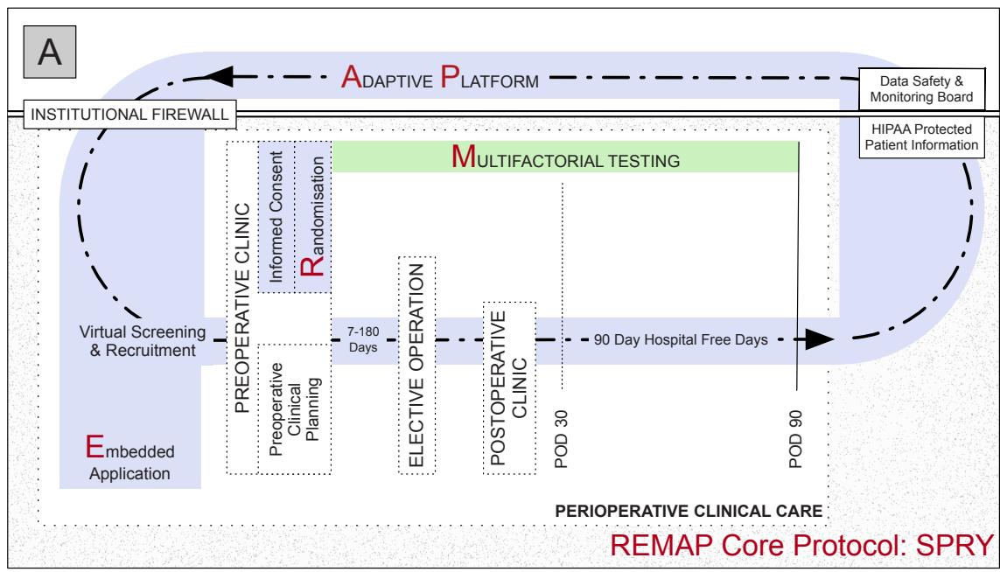
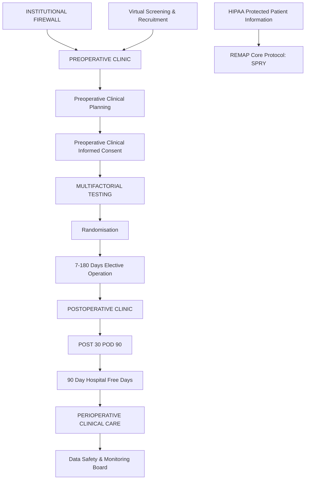
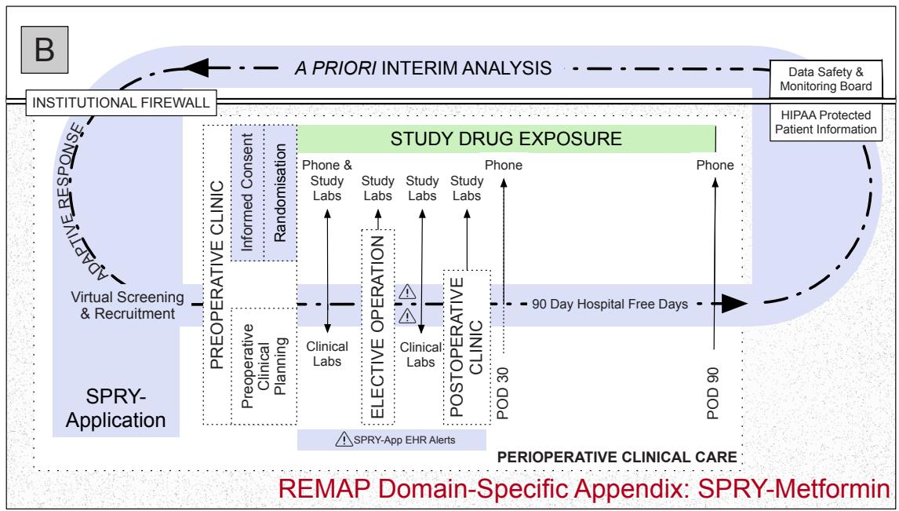
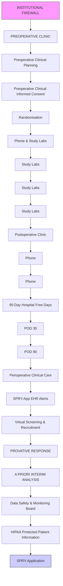
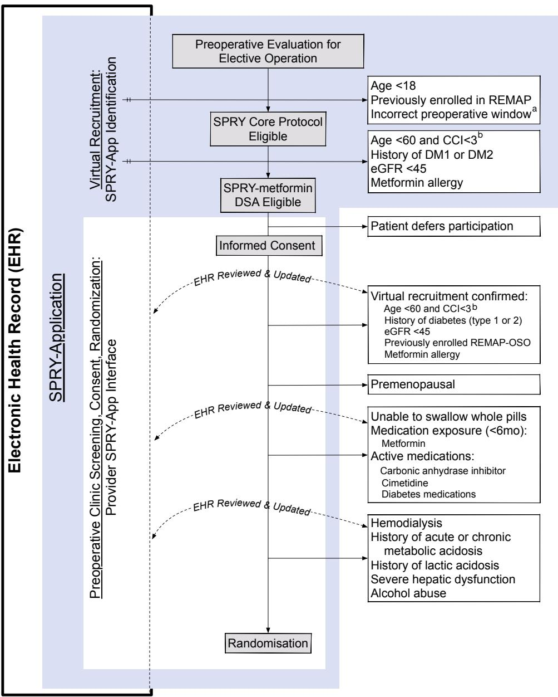
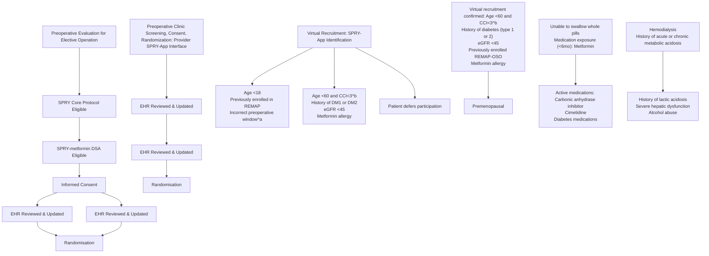
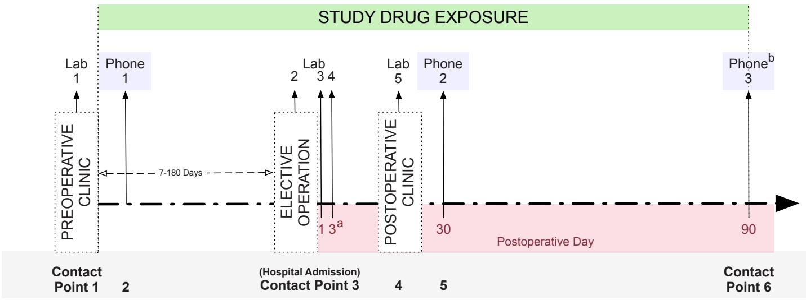
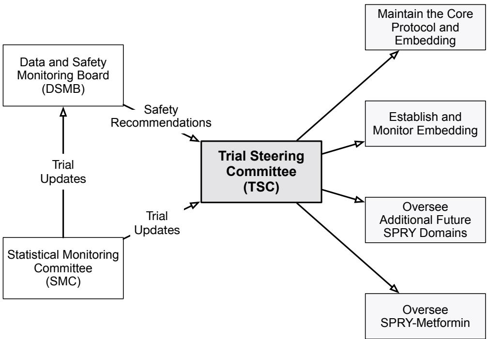
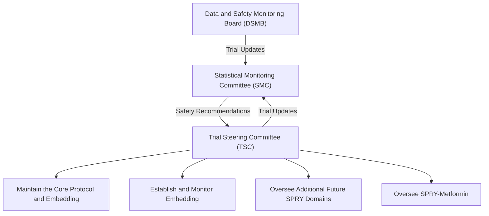

# BMJ Open

# Strategies to Promote ResiliencY (SPRY): a randomised embedded multifactorial adaptative platform (REMAP) clinical trial protocol to study interventions to improve recovery after surgery in high-risk patients

Katherine Moll Reitz ,1 Christopher W Seymour,2 Jennifer Vates,2 Melanie Quintana,3 Kert Viele,3 Michelle Detry,3 Michael Morowitz,4 Alison Morris,5 Barbara Methe,5 Jason Kennedy,2 Brian Zuckerbraun,1 Timothy D Girard,2 Oscar C Marroquin,6 Stephen Esper,7 Jennifer Holder-Murray,1 Anne B Newman,8 Scott Berry,3 Derek C Angus,2 Matthew Neal1

To cite: Reitz KM, Seymour CW, Vates J, et al. Strategies to Promote ResiliencY (SPRY): a randomised embedded multifactorial adaptative platform (REMAP) clinical trial protocol to study interventions to improve recovery after surgery in high-risk patients. BMJ Open 2020;10:e037690. doi:10.1136/ bmjopen-2020-037690

Prepublication history for this paper is available online. To view these files, please visit the journal online (http://dx.doi. org/10.1136/bmjopen-2020- 037690).

Received 17 February 2020 Revised 04 August 2020 Accepted 11 August 2020

# Check for updates

© Author(s) (or their employer(s)) 2020. Re-use permitted under CC BY-NC. No commercial re-use. See rights and permissions. Published by BMJ.

For numbered affiliations see end of article.

Correspondence to Dr Katherine Moll Reitz; reitzkm2@upmc.edu

# ABSTRACT

Introduction As the population ages, there is interest in strategies to promote resiliency, especially for frail patients at risk of its complications. The physiological stress of surgery in high-risk individuals has been proposed both as an important cause of accelerated age-related decline in health and as a model testing the effectiveness of strategies to improve resiliency to age-related health decline. We describe a randomised, embedded, multifactorial, adaptative platform (REMAP) trial to investigate multiple perioperative interventions, the first of which is metformin and selected for its anti-inflammatory and anti-ageing properties beyond its traditional blood glucose control features.

Methods and analysis Within a multihospital, single healthcare system, the Core Protocol for Strategies to Promote ResiliencY (SPRY) will be embedded within both the electronic health record (EHR) and the healthcare culture generating a continuously self-learning healthcare system. Embedding reduces the administrative burden of a traditional trial while accessing and rapidly analysing routine patient care EHR data. SPRY-Metformin is a placebo-controlled trial and is the first SPRY domain evaluating the effectiveness of three metformin dosages across three preoperative durations within a heterogeneous set of major surgical procedures. The primary outcome is 90-day hospital-free days. Bayesian posterior probabilities guide interim decision-making with predefined rules to determine stopping for futility or superior dosing selection. Using response adaptative randomisation, a maximum of 2500 patients allows 77%–92% power, detecting >15% primary outcome improvement. Secondary outcomes include mortality, readmission and postoperative complications. A subset of patients will be selected for substudies evaluating the microbiome, cognition, postoperative delirium and strength.

# Strengths and limitations of this study

The Strategies to Promote ResiliencY (SPRY) Core Protocol creates standardised trial elements shared multiple concurrent and sequential perioperative investigations, including SPRY-Metformin, preventing the continuous development and then dismantling of the expensive and complex clinical trial infrastructure.   
Digital trial embedding minimises the work required by research staff to screen, randomise and safely monitor patients within the perioperative period.   
The Bayesian analysis plan allows for borrowing of information on the treatment effect across multiple doses and durations of metformin to efficiency inform the research questions.   
Outcome data are automatically abstracted and supplemented by in-person inquiry, but may be limited or incomplete in patients who receive postoperative care within the multihospital healthcare system.

Ethics and dissemination The Core Protocol of SPRY REMAP and associated SPRY-Metformin Domain-Specific Appendix have been ethically approved by the Institutional Review Board and are publicly registered. Results will be publicly available to healthcare providers, patients and trial participants following achieving predetermined platform conclusions.

Trial registration number NCT03861767.

# INTRODUCTION

By 2020, over 55 million Americans will be greater than 65 years of age.1 The lifelong accumulation of stressors progressively leads to chronic disease and disability compromising homeostatic reserve. The complex interplay of cumulative medical, social and functional generating these deficits, defined as frailty, is associated with, but independent of, age and leave individuals vulnerable to a physiological insult further reducing resiliency.2 3 In response, a broad range of multimodal therapies (eg, smoking cessation, nutritional optimisation, physical activity programmes) are currently under investigation to both prevent and reduce the effects of ageing on physiological reserve.4 However, as frailty is typically developed longitudinally, establishing treatment efficacy in clinical trials requires years to decades of outcome monitoring.5

A lifetime of exposure to multiple, small stressors may cumulatively reduce reserve equal to that of few, severe stressors.6 Elderly patients, at risk of frailty, undergo over one-third of all surgical interventions and have an increased rate of postoperative morbidity and mortality for all levels of physiological surgical stress.6–11 According to the National Institute for Aging, the stress of a surgery is an ‘age-accelerating’ cause of frailty,6 rapidly depleting resilience to secondary insults.12 13 Therefore, a major surgical intervention is an efficient experimental model for evaluating novel strategies aimed at stabilising, preventing or reversing frailty.6

Perioperative investigations strive to improve outcomes in an aged and at-risk population and also model loss of reserve or accelerated ageing. We have therefore designed a randomised, embedded, multifactorial, adaptative platform (REMAP)14 trial to evaluate the effectiveness of perioperative therapies within a multihospital single healthcare system: Strategies to Promote ResiliencY (SPRY). Metformin, the most commonly prescribed noninsulin medication for those with diabetes ,15–17 has pleiotropic anti-inflammatory properties and potentially slows the process of ageing.18 19 Therefore, we report the first of many trial protocols evaluating perioperative therapies both concurrently and sequentially on this adaptive platform, SPRY-Metformin, randomising patients to three dosages of metformin or placebo in parallel.

# METHODS AND ANALYSIS

Our protocol follows the Standard Protocol Items: Recommendations for Interventional Trials (SPIRIT) guidelines which are individually addressed in online supplemental appendix 1.20 The below content focuses on novel aspects of the SPRY Core Protocol and associated SPRY-Metformin Domain-Specific Appendix.

# Aims

The primary aim of SPRY is to establish the Core Protocol infrastructure for continuous and simultaneous adaptive analysis of multifactorial perioperative therapies (ie, domains) evaluating their effect on resiliency to ageaccelerating surgical stress in patients at risk for postoperative morbidity and mortality.

The primary aim of the SPRY-Metformin domain is to simultaneously establish the ideal duration and dose of perioperative metformin to determine its effectiveness as pharmacological optimisation across multiple surgical specialties.

Unified, the aims of the Core Protocol and all associated multifactorial Domain-Specific Appendixes are to embed the study protocols both digitally within the electronic health record (EHR) and culturally among clinicians generating an efficient, cost-effective, patient centred and continuously self-learning healthcare system.

# Trial design

The design of the SPRY Core Protocol and associated Domain-specific Appendices aligns with the recommendations of the Adaptive Platform Trials Coalition21 and SPIRIT guidelines.20 Specifically, SPRY will recurrently assess multiple, Trial Steering Committee (TSC) approved, domains in multiple surgical strata and disease subtypes using response adaptive randomisation and a comprehensive statistical analysis plan to create a selflearning health system.

# SPRY Core Protocol

SPRY is the first Core Protocol outlining the embedding of a trial within the EHR and routine perioperative healthcare delivery for at-risk aged adults. The Core Protocol creates standardised trial elements shared by all applied domains, preventing the continuous developclinical trial infrastructure.22 As with other adaptive plat- ment and then dismantling of the expensive and complex form trials, SPRY will assess multiple domains simultaneously using Bayesian statistical analysis and response adaptive randomisation evaluating the treatment effect in predefined strata (eg, vascular, orthopaedic, hepatobiliary surgical interventions ).23 24 In the REMAP design, patients can be randomised to one of many treatments within one of many simultaneously deployed domains resulting in multiple possible experimental treatment combinations. The Core Protocol allows for aggregation of the treatment response across different simultaneously investigated domains and the multifactorial evaluation of synergistic or antagonistic combinations within each of the strata.

SPRY trial flow per the Consolidation Standard of Reporting Trials (CONSORT) guidelines are adapted from the traditional linear format into a concentric diagram, demonstrating the perpetual nature of the Core Protocol (figure 1A).

We provided details herein on the first SPRY Core Protocol Domain (SPRY-Metformin) (see online supplemental appendix 2). Other new domains will be added to the Core Protocol as emerging therapies become available. The TSC will consider the scientific validity of each domain, safety of concurrent therapies and current enrolment rates when deciding to introduce a new domain concurrently or following existing domains. A new domain is introduced as a Domain-Specific Appendix to the SPRY Core Protocol. This

flowchart

flowchart

Figure 1 Concentric consort diagram: SPRY Core Protocol (A) and Domain-Specific Appendix SPRY-Metformin overlying the Core Protocol (B). (A) The Core Protocol creates a research platform or infrastructure within clinical care for all enrolled into any SPRY Domain-Specific Appendix. This infrastructure includes virtual screening, informed consent and randomisation at preoperative clinic, automated perioperative electronic health record (EHR) monitoring, and a primary outcome of 90-day hospital-free days. Patient privacy is maintained and protected by the embedded application functioning behind the institutional firewall. (B) The SPRY-Metformin Domain-Specific Appendix functions within the infrastructure of the SPRY Core Protocol. Prior to preoperative clinic, the SPRY-Application screens the scheduled preoperative clinic appointments and generates a list of potential patients for enrolling clinicians. In preoperative clinic recruitment, informed consent and randomisation are completed. Patients undergo baseline testing. Study drug exposure begins and continues through postoperative day 90 (green). The SPRY-Application (light blue) supports patient safety monitoring by generating EHR and email alerts, as needed. As possible, all trial aspects are embedded within the standard of care perioperative course. When 500 patients surpass postoperative day 90, a priori interim analysis is completed. Future enrolment is then guided by the predetermined response adaptive randomisation schemes and predetermined stopping rules. HIPAA, Health Insurance Portability and Accountability Act; POD, postoperative day; REMAP, randomised embedded multifactorial adaptive platform; SPRY, Strategies to Promote ResiliencY.

Domain-Specific Appendix will be generated outlining potential interactions between multiple domains within the primary statistical analysis of efficacy, if deemed clinically appropriate. If multiple domains have been introduced, response adaptive randomisation will be based on best-performing combinations of therapies within the multiple domains and incorporate potential interactions.

flowchart

Figure 2 Virtual and in-person screening and randomisation. a <7 or >180 preoperative days. b Charlson Comorbidity Index (CCI) required within the 365 days prior to screening. Virtual recruitment is completed by Strategies to Promote ResiliencY (SPRY)-Application (light blue) reviewing a subset of SPRY and SPRY-Metformin enrolment criteria. The SPRY-Application then guides the clinical provider to complete the in-person screening and informed consent. Any discrepancies found between the clinical parameters within SPRY-Application and the patient’s reported health state are manually updated within the electronic health record (EHR) and patients are randomised. eGFR, estimated glomerular filtration rate.

# SPRY-Metformin Domain-Specific Appendix

SPRY-Metformin is a multihospital, single healthcare system, placebo-controlled, adaptive, phase III clinical trial that is blinded at the level of the patient, clinician, research team and data analyst. SPRY-Metformin is the first domain to be launched on the SPRY Core Protocol testing the effectiveness of metformin in improving perioperative outcomes (figure 1B). Patients are screened and recruited from preoperative clinic through a custom application communicating with EHR data (figure 2). Study drug is started following randomisation and continued throughout the perioperative period through postoperative day (POD) 90 (figure 3). All patients are prospectively monitored through POD 365 with both automated EHR data collection and longitudinal patient follow-up (see online supplemental appendix 3).

# Patient and public involvement

Patients were not invited to comment on the study design or result interpretation for the SPRY Core Protocol or SPRY-Metformin.

# Trial embedding

The integration of this trial into the EHR and clinical workflow requires two distinct forms of embedding: digital and cultural.

bar

| Phase | Label | Value |
|-------|-------|-------|
| Preoperative Clinic | Lab 1 | 1 |
| Preoperative Clinic | Phone 1 | 1 |
| Elective Operation | Elective Operation | 2 |
| Elective Operation | Lab 2 | 3 |
| Elective Operation | Lab 3 | 4 |
| Elective Operation | Elective Operation | 1 |
| Elective Operation | Elective Operation | 3a |
| Postoperative Clinic | Postoperative Clinic | 4 |
| Postoperative Clinic | Lab 5 | 5 |
| Postoperative Clinic | Lab 2 | 2 |
| Postoperative Clinic | Postoperative Clinic | 30 |
| Postoperative Day | Postoperative Day | 90 |
| Postoperative Day | Phoneb | 3 |
| Postoperative Day | Phoneb | 3 |
| Postoperative Day | Contact Point 6 | 90 |
The chart includes a dashed line indicating the duration from preoperative to postoperative clinic. The x-axis labels are 'Contact Point 1' through 'Contact Point 6'.

Figure 3 SPRY-Metformin timeline. a If patients are discharged on the day of the surgical intervention, laboratory sample 4 will be omitted. If hospital discharge occurs prior to postoperative day 3, laboratory sample 4 occur immediately prior to discharge. b Longitudinal testing at contact point 6 testing is dependent on participation in the motor subgroup (table 1). Patients are recruited, consented by providers, randomised, undergo baseline venous blood sampling and are provided study drug at preoperative clinic (contact point 1). In the 7–180 preoperative days, patients undergo baseline testing (table 1), and both patient safety and study drug compliance are monitored via phone interview (contact point 2). Three venous blood samples are coupled with clinical blood draws throughout the operative hospital admission (contact point 3). A final venous sample is collected in standard of care postoperative clinic (contact point 4). At postoperative days 30 and 90, patients are contacted to monitor both patient safety and study drug compliance, collect postoperative outcomes (box 2) and complete additional outcome testing (table 1).

# Digital embedding

We developed Java-based (Oracle Corporation, Redwood Shores, California, USA) custom software, the SPRY-Application, which interfaces with the research team and EHR data. The digital embedding of the SPRY-Application serves multiple purposes. First, protecting the privacy of trial patients. Second, automating patient screening, enrolment and randomisation while synchronising research activities within perioperative standard of care clinical encounters. Third, accessing the robust EHR data generated as a part of routine patient care.

At UPMC, a two-factor authentication system safeguards all private patient information accessed through a single Citrix Workspace (Fort Lauderdale, Florida, USA) in accordance with Health Insurance Portability and Accountability Act. Like all protected data and programmes within the healthcare system, the SPRY-Application resides behind this institutional firewall. Here, the SPRY-Application is distinct from, but communicates with, EHR data. The SPRY-Application accesses the clinical research data repository within UPMC Clinical Analytics and is managed by Biostatistical and Data Management Core in the Department of Critical Care Medicine at UPMC. The data repository abstracts structured, raw data from the inpatient (CERNER, Kansas City, Missouri, USA) and outpatient (Epic Systems, Madison, Wisconsin, USA) EHR and generates accessible data tables. The data extraction process parallels the methodology used traditionally for retrospective EHR data collection and research25–27; however, these data are updated in real time.

Potential trial participant identification begins with the SPRY-Application screening. The SPRY-Application reviews SPRY-specific, EHR data tables for each patient with a scheduled appointment at enrolling preoperative SPRY-Metformin clinics (figure 3). The EHR of each scheduled patient is reviewed, generating a list of patients meeting a subset of inclusion and exclusion criteria. This list of potential SPRY-Metformin candidates is then automatically distributed to the study team and clinicians via institutional email for review.

In preoperative clinics, patients are offered the opportunity to participate in SPRY-Metformin. The SPRY-Application guides the clinician through the stepwise informed consent process (see online supplemental appendix 4). Then, pertinent clinical biorepository EHR data auto-populates screening information within the SPRY-Application for review and confirmation with the patient (figure 4). Any identified discrepancies between patient report and the EHR auto-populated SPRY-Application data prompt the clinician to update the EHR (figure 1A). This both minimises trial data entry and maintains the accuracy of the EHR.

Patients meeting all inclusion and no exclusion criteria are allocated to a treatment regimen based on the established randomisation tables uploaded to the SPRY-Application. Automatically, the SPRY-Application then generates the study drug and laboratory prescription and synchronises all research activities (eg, blood and stool samples) within pertinent, scheduled perioperative standard of care clinical encounters. Throughout patient enrolment, the SPRY-Application monitors for biorepository updates to the Cerner Admission-Discharge-Transfer tables and informs the research team of hospital admissions and discharges for enrolled patients. Inevitable in-trial schedule changes can be manually updated within the SPRY-Application user interface and therefore adjusts the research activity timeline, updating research personnel and distributing additional study drug, as needed, via the mail.

flowchart

Figure 4 Randomised, embedded, multifactorial, adaptative platform (REMAP) Strategies to Promote ResiliencY (SPRY) administrative organisation. The Trial Steering Committee receives trial updates from the Statistical Monitoring Committee as well as recommendations from the Data and Safety Monitoring Board to oversee all trial conduct.

# Cultural embedding

SPRY-Metformin is designed with the intent to rely heavily on bedside clinicians for many aspects of trial execution. Healthcare system staff within high volume surgical clinics are busy with existing patient care responsibilities. We have attempted to minimise the burden of research in two ways. First, whenever possible, the protocol is fused within existing care activities. Second, we focus on engaging, educating and motivating the entire clinical team.

For example, as each new site is identified, prior to site initiation, the research team informs the clinical team about the potential benefits of a REMAP trial design and a self-learning healthcare system. Simultaneously, the clinical team educates the research team on their patients’ experiences and the clinic or unit-specific workflow. Both teams generate clinic or unit-specific protocols and SPRY-Application user manuals.

# Study population

The evaluation of enrolment criteria for the study population occurs across two formats and at two levels. Initially, a subset of criteria is screened in a digital format by the SPRY-Application. Subsequently, in face-to-face clinic format the consenting clinician confirms all inclusion and exclusion criteria. As prompted by the SPRY-Application, any discrepancies found between the data within the SPRY-Application and the patients’ reported health state are manually updated within the SPRY-Application and EHR (figure 4).

At the first level, patients exposed to the stress of an elective surgical intervention are identified. At the second level, participants are evaluated against the inclusion and exclusion criteria of the SPRY-Metformin domain identifying patients who (1) can be safely exposed to metformin and (2) are at risk of decreased physiological reserve (ie, older age and/or medical comorbidity) conferring postoperative morbidity and mortality at all levels of surgical stress (box 1).3 10 Patients randomised in SPRY-Metformin can also participate in either or both substudies (microbiome or motor) as well as additional future domains on the SPRY Core Protocol.

# SPRY-Metformin intervention

# Metformin rationale

We hypothesise that pharmacological perioperative optimisation will improve surgical outcomes for an aged, frail patient population. Metformin, the most commonly prescribed non-insulin medication for type 2 diabetics, is one such therapy.15–17 In multiple studies, metformin has an excellent safety profile, is well tolerated and consistently delays the ageing process and minimises deleterious cellular inflammation5 through effects on cellular respiration,2 8 muscle function29 and the microbiome.30 Metformin advantageously modulates the body’s response

# Box 1 Core Protocol and SPRY-Metformin Domain-Specific Appendix inclusion and exclusion criteria

# SPRY

Inclusion criteria

Adult (≥18 years of age)

Evaluation at any preoperative elective clinic within the healthcare system

Planned surgical intervention ≥7 and <180 days following the preoperative encounter

Exclusion criteria

Clinician deems inclusion may be potentially harmful

Emergent surgical procedure

Patient has participated in SPRY within the proceeding 90 days

# SPRY-Metformin\*

Inclusion criteria

Men and post-menopausal women who are ≥60 years of age or are

<60 years of age with a Charlson Comorbidity Index >2

Ability to swallow non-crushed pills

Exclusion criteria

Pre-existing type I or II diabetes mellitus

Metformin use in the prior 6 months

Known allergy to metformin

Acute or chronic metabolic acidosis with or without coma

History of lactic acidosis

History of excessive alcohol intake

Severe hepatic dysfunction

Acute or chronic metabolic acidosis

Haemodialysis, end-stage renal disease or estimated glomerular filtration rate <45 in the 30 days prior to or on the day of in-person screening

\*Those in the motor study must be >65 years of age with their home address

<20 miles of the central healthcare system academic hospital.

SPRY, Strategies to Promote ResiliencY.

to physical stress through its systemic anti-inflammatory properties31 32 and appear to be independent of blood glucose control.32

# Study drug

Both the duration and the dose of study drug exposure will be evaluated. Patients are stratified based on the anticipated perioperative duration: short (7–28 days), intermediate (29–90 days) or long (91–180 days). Within each duration window, patients are randomised to one of three doses of metformin extended release 500, 1000 or 1500 mg, or placebo. Study drug is initiated the day following randomisation and continued through postoperative day 90 without planned interruption perioperatively (figure 2).

# EHR embedded safety alerts

Surgical stress can cause fluctuation in organ function perioperatively. As a part of routine clinical care, patients at the greatest risk of physiological derailment and significant postoperative complications are admitted for postoperative monitoring. In real time, the SPRY-Application generates ‘pop-up’ style inpatient EHR alerts prompting the bedside nurse to hold study drug administration in the setting of current (ie, estimated glomerular filtration rate <45 or serum lactate ≥4) or potential future (ie, ordered contrasted imaging studies) organ dysfunction (figure 2). Simultaneously, the SPRY-Application generates an institutional email notifying the research team.

# Endpoints

The primary endpoint of SPRY Core Protocol hospitalfree days (HFD) is up to 90 days.33–36 This composite endpoint is an ordered categorical variable defined as the number of days from the day of surgery to the 90 thereafter, during which the patient is alive and free of hospitalisation and was chosen for three reasons. First, this composite variable quantifies the care required for patients with reduced physiological reserve with an increased risk of both specific postoperative complications (ie, wound infections) and overall progression of frailty (ie, progressive sarcopenia resulting in a fall and hip fracture) resulting in fewer HFD.10 37–41 Second, HFD is weighed (ie, −1) to address potential effects on mortality, independent of the cause and time of mortality within 90 days, throughout the 90-day postoperative period.33 Third, time out of the hospital quantifies clinical outcomes and the cost of resource utilisation, but reflects postoperative events important to patients and their families.42 Therefore, HFD captures any treatment associated enhancements in resiliency across surgical strata and is applicable to SPRY-Metformin and any domain on the SPRY Core Protocol. The predefined and validated secondary clinical endpoints are listed in table 1 and box 2.42–45

# Patient sample biorepository

An additional long-term goal of SPRY-Metformin is to understand the molecular mechanisms by which metformin might attenuate the inflammatory response and improve outcomes after surgical stress.

# Statistical analysis

The primary analysis plan for SPRY-Metformin includes a Bayesian ordinal logistic regression analysis of 90-day HFD to allow for borrowing of information on the treatment effect across different doses and durations of metformin to maximally inform the research questions while minimising the required patient sample size.46 47 Complete documentation of the statistical analysis plan is included in the Statistical Analysis Appendix (online supplemental appendix 4).

# Simulations and sample size generation

Clinical trial simulations are used to optimise clinical trial design (best thresholds for early success, dose dropping and futility stopping) to determine the sample size needed within this trial to obtain at least 80% power for a clinically meaningful treatment effect and a one-sided 2.5% type I error under the null distributions, and to quantify additional operating characteristics of the SPRY-Metformin trial. Using pertinent retrospective UPMC EHR data, virtual patient datasets were created based \*Baseline occurs within 7 days of randomisation and prior to the surgical intervention. †Omit the phone evaluation and undergo an in-person evaluation on postoperative day 90. FAQ, Functional Activities Questionnaire; (MoCA)-BLIND, Montreal Cognitive Assessment.

Table 1 Longitudinal quality of life and frailty timeline 

<table><tr><td>Baseline*</td><td>Postoperative day 30</td><td>Postoperative day 90</td><td></td></tr><tr><td>Phone</td><td></td><td></td><td>In-person (motor subgroup†)</td></tr><tr><td>EQ-5D</td><td>EQ-5D</td><td>EQ-5D</td><td>EQ-5D</td></tr><tr><td>MoCA-BLIND</td><td></td><td>FAQ</td><td>FAQ</td></tr><tr><td></td><td></td><td>MoCA-BLIND</td><td>NIH toolbox cognitive</td></tr><tr><td></td><td></td><td>Haying sentence completion test</td><td>2 min walk test</td></tr><tr><td></td><td></td><td>Confusion assessment method</td><td>Grip strength</td></tr></table>

on the observed distributions of the primary endpoint, 90-day HFD, within each stratum. Clinical trial simulations randomised patients to study drug and numerous trials were virtually executed, including all interim analysis and randomisation adaptations. For simulated patients randomised to placebo, we assumed the primary outcome to be distributed similar to the observed 90-day HFD distribution per surgical strata within the UPMC EHR data. For simulated patients randomised to metformin, the distributions of 90-day HFD within UPMC HER data per surgical strata were shifted toward higher values of 90-day HFD being more likely based on a common percent reduction in 90-day hospital days (90 (90-day HFD)). For examples of how the distributions were shifted, see online supplemental appendix 2, figure 4.1 and table 4.2. The minimum clinically meaningful effect size was assumed to be a common percent decrease of 15% in 90-day mean hospital days for the highest treatment dose. This was chosen because it is sensitive to absolute differences in

# Box 2 Secondary endpoints

# Postoperative index hospital course

Incidence and total duration of postoperative intensive care unit admission

Index hospital length of stay

Hospital discharge location

Index hospitalisation mortality rate

# Within 30 days of the index operation

Surgical site infection\*

Surgical site occurrence†

Organ failure free days‡

# Within 365 days of study drug exposure

Incidence of reoperation

Number of participants with deep vein thrombosis

Number of participants with pulmonary embolus

Mortality

Hospital readmission rates

\*Surgical site infection defined by the National Surgical Quality Improvement Program 43

†Surgical site occurrence defined by the Ventral Hernia Working Group.44

‡Organ failure defined as mechanical ventilation, haemodialysis or vasopressor exposure.

hospital days and treatments may have a larger absolute benefit for those procedures that are expected to result in more hospital days (see online supplemental appendix 2, table 4.2).34

Trial behaviours, such as power and type I error, were summarised as the proportion of simulated trials that were successful under the alternative and null scenarios, respectively. Patients will therefore be adaptively randomised to placebo or three doses of metformin, for a maximum sample size of 2500 patients enrolled. The trial has at least 84% power to detect a treatment effect of at least a 15% reduction in mean hospital days for a minimum of one of the doses under the assumption that the dose has an equally effective percent reduction in mean hospital days across all three preoperative metformin durations. If a dose is not effective for the short preoperative duration, the trial has at least 77% power to detect a treatment effect of at least a 15% reduction in mean hospital days for at least one of the doses. Under the assumption that no doses are effective, there is an overall one-sided type I error of 2.5%.

The motor subgroup will enrol up to one-third of SPRY-Metformin trial patients. The microbiome and muscle biopsy subgroups are exploratory pilot substudies with 1000 and 200 patients to be enrolled.

# Response adaptative randomisation and interim analysis

Initially, SPRY-Metformin will randomise a maximum of 2000 patients. Within each of the three preoperative durations, patients will initially be randomised √ 3 : 1 : 1 : 1 to placebo and the three doses of metformin. Interim analysis is completed each time 500 patients have been randomised across all preoperative durations and followed up for 90 POD. At each interim analysis, the trial can be stopped early for demonstrating efficacy, response adaptive randomisation will be adjusted to preferentially randomise patients to the best-performing treatment group or dose(s) can be dropped for futility.

# Analysis plan

The primary analysis method of 90-day HFD within SPRY-Metformin is a Bayesian ordinal logistic regression model that accounts for differences in the expected

90-day HFD distribution depending on surgical strata and allows for borrowing of information across pre-op durations and doses of metformin.4 47 7 Within this model, the effect of each dose of metformin for each preoperative duration relative to placebo is characterised as a constant log-OR shift in the 90-day HFD distribution. The primary intention-to-treat analysis will include those who have been randomised. All missing data will be imputed based on the median observed 90-day HFD value for each treatment arm and preoperative duration. Sensitivity analysis will explore a per protocol analysis and alternative imputation strategies that do not make missing at random assumptions. Exploratory analyses will investigate the heterogeneity of treatment effects across key patient subgroups including patient age and frailty as well as operative stress and surgical strata.

Superiority of a metformin dose to placebo within SPRY-Metformin is determined based on the posterior probability that the pooled log-OR effect of that dose across all enrolling preoperative durations relative to placebo is less than 0, indicating a shift in the 90-day HFD distribution toward more HFD under treatment compared with placebo. Success is declared at an interim or at the final analysis if the posterior probability of superiority for any dose of metformin is greater than the predefined interimspecific success threshold. The thresholds are based on an O’Brien Fleming spending function assuming a maximum sample size of 2500.48

SPRY-Metformin secondary outcomes will be analysed using regression models that account for expected differences in surgical strata of the patient.

Additional domains and additional interventions within domains will be added to the SPRY Core Protocol. Treatment effects and treatment-by-treatment interactions can be added for each additional perioperative therapy.

# ETHICS AND DISSEMINATION

Both the Core Protocol and the SPRY-Metformin Domain-Specific Appendix were independently approved at the University of Pittsburgh Institutional Review Board (IRB Nos. 18060039, 18060038) without a required Investigational New Drug exemption from the Food and Drug Administration. Three independent groups were established to provide oversight for SPRY-Metformin: TSC, Statistical Monitoring Committee (SMC) and Data and Safety Monitoring Board (DSMB). The details of the relationship between and responsibilities of these committees are discussed in detail in the online supplemental appendix 1 and summarised in figure 4.

# Platform conclusion

In SPRY, a platform conclusion describes when a statistical trigger has been reached and, following evaluation by the DSMB and in conjunction with the TSC, a decision is made to conclude a domain or intervention within a domain for superiority, equivalence or futility. Under all circumstances, a platform conclusion leads to implementation of the result within the REMAP and under almost all circumstances, a platform conclusion leads immediately to public disclosure of the result by presentation and publication by the SPRY research team.

# Author affiliations

1 Department of Surgery, University of Pittsburgh, Pittsburgh, Pennsylvania, USA   
2 Department of Critical Care Medicine, UPMC, Pittsburgh, Pennsylvania, USA   
3 Berry Consultants Statistical Innovation, Austin, Texas, USA   
4 Department of Surgery, Children’s Hospital of Pittsburgh of UPMC, Pittsburgh, Pennsylvania, USA   
5 Department of Medicine, UPMC, Pittsburgh, Pennsylvania, USA   
6 Clinical Analytics, UPMC Health System, Pittsburgh, Pennsylvania, USA   
7 Anesthesiology, University of Pittsburgh, Pittsburgh, Pennsylvania, USA   
8 Department of Epidemiology, University of Pittsburgh, Pittsburgh, Pennsylvania, USA

# Twitter Katherine Moll Reitz @MollReitz

Acknowledgements We would like to acknowledge the significant contribution of the patients, families, researchers, data management teams, clinical staff and sponsors for their support in the development and implementation of this study. We acknowledge the UPMC Department of Surgery and their patients for participating in Strategies to Promote ResiliencY (SPRY)-Metformin and all future aspects of SPRY. We acknowledge the Clinical Analytics in the Health Services Division at UPMC for preparing this dataset with the support of Biostatistics and Data Management Core at the CRISMA Center in the Department of Critical Care Medicine at the University of Pittsburgh. We acknowledge the entire SPRY team for their contributions to this work.

Contributors KMR, CWS, JV, OCM, SE, JH-M, SB, DCA, BZ, ABN, OCM and MN participated in the creation of the study concept, protocol implementation and outcome selection. JV, CWS, MQ, KV, OCM, SB, DCA and MN developed the data for the power analysis, completed the simulations and/or associated statistical analysis plan. CWS, JV, MM, AM, BZ, TDG, MD, BM, DCA and MN contributed to the development of the substudies and data repository. CWS, JV, OS, DCA, JK, OCM and MN oversaw the digital embedding of the SPRY-Application. KMR, MQ and JV were the major contributors in writing of the manuscript. All authors read and approved the final manuscript.

Funding This work was supported by the UPMC Immune Transplant and Therapy Center, grant number IPA2019#8. Phone: 1-888-4UPMC-ITTC. website: https://ittc. upmc.com/

# Competing interests None declared.

Patient and public involvement Patients and/or the public were not involved in the design, or conduct, or reporting or dissemination plans of this research.

# Patient consent for publication Not required.

Provenance and peer review Not commissioned; externally peer reviewed.

Open access This is an open access article distributed in accordance with the Creative Commons Attribution Non Commercial (CC BY-NC 4.0) license, which permits others to distribute, remix, adapt, build upon this work non-commercially, and license their derivative works on different terms, provided the original work is properly cited, appropriate credit is given, any changes made indicated, and the use is non-commercial. See: http://creativecommons.org/licenses/by-nc/4.0/.

# ORCID iD

Katherine Moll Reitz http://orcid.org/0000-0002-9397-321X

# REFERENCES

1 2017 National Population Projections Table. United States census Bur, 2017.   
2 Walston J, Hadley EC, Ferrucci L, et al. Research agenda for frailty in older adults: toward a better understanding of physiology and etiology: summary from the American geriatrics Society/National Institute on aging research conference on frailty in older adults. J Am Geriatr Soc 2006;54:991–1001.   
3 Joseph B, Pandit V, Zangbar B, et al. Superiority of frailty over age in predicting outcomes among geriatric trauma patients: a prospective analysis. JAMA Surg 2014;149:766–72.

4 Fairhall N, Langron C, Sherrington C, et al. Treating frailty-a practical guide. BMC Med 2011;9:83.   
5 Barzilai N, Crandall JP, Kritchevsky SB, et al. Metformin as a tool to target aging. Cell Metab 2016;23:1060–5.   
6 Robinson TN, Walston JD, Brummel NE, et al. Frailty for surgeons: review of a national Institute on aging conference on frailty for specialists. J Am Coll Surg 2015;221:1083–92.   
7 The Department of Health and Human Services. Profile of older Americans: 2015 profile. Administration on aging (AoA), Washington, DC, 2016. https://www.giaging.org/documents/A\_Profile\_of\_Older\_ Americans\_\_2016.pdf   
8 Eaton MP, Osler TM, Li Y, et al. Hospital readmission after noncardiac surgery. JAMA Surg 2014;149:439.   
9 Hall DE, Arya S, Schmid KK, et al. Association of a frailty screening initiative with postoperative survival at 30, 180, and 365 days. JAMA Surg 2017;152:233–40.   
10 Shinall MC, Arya S, Youk A, et al. Association of preoperative patient frailty and operative stress with postoperative mortality. JAMA Surg 2019;15213:1–9.   
11 Shinall MC, Youk A, Massarweh NN, et al. Association of preoperative frailty and operative stress with mortality after elective vs emergency surgery. JAMA Netw Open 2020;3:e2010358.   
12 Neupane I, Arora RC, Rudolph JL. Cardiac surgery as a stressor and the response of the vulnerable older adult. Exp Gerontol 2017;87:168–74.   
13 Joseph B, Zangbar B, Pandit V, et al. Emergency general surgery in the elderly: too old or too frail? J Am Coll Surg 2016;222:805–13.   
14 Angus DC. Fusing randomized trials with big data the key to Selflearning health care systems? JAMA 2019;314.   
15 Flory J, Lipska K. Metformin in 2019. JAMA 2019;321:1926–7.   
16 Madsen KS, Kähler P, Kähler LKA, et al. Metformin and second- or third-generation sulphonylurea combination therapy for adults with type 2 diabetes mellitus. Cochrane Database Syst Rev 2019;4:CD012368.   
17 American Diabetes Association. Standard of medical care in diabetes - 2019. Diabetes Care 2019;42:S1–2.   
18 Konopka AR, Miller BF. Taming expectations of metformin as a treatment to extend healthspan. Geroscience 2019;41:101–8.   
19 Hadley EC, Kuchel GA, Newman AB, et al. Report: NIa workshop on measures of physiologic Resiliencies in human aging. J Gerontol A Biol Sci Med Sci 2017;72:980–90.   
20 Chan A, Tetzlaff JM, Altman DG. Statement: defining standard protocol items for clinical trials. Ann Intern Med 2013;2016:200–7.   
21 The Adaptive Platform Trials Coalition. Adaptive platform trials: definition, design, conduct and reporting considerations. Nat Rev Drug Discov 2019;18:797–807.   
22 Schultz A, Marsh JA, Saville BR, et al. Trial refresh: a case for an adaptive platform trial for pulmonary exacerbations of cystic fibrosis. Front Pharmacol 2019;10:1–8.   
23 Woodcock J, LaVange LM. Master protocols to study multiple therapies, multiple diseases, or both. N Engl J Med 2017;377:62–70.   
24 Berry SM, Berry DA. Accounting for multiplicities in assessing drug safety: a three-level hierarchical mixture model. Biometrics 2004;60:418–26.   
25 Milinovich A, Kattan MW. Extracting and utilizing electronic health data from EPIC for research. Ann Transl Med 2018;6:42.   
26 Reitz KM, Marroquin OC, Zenati MS, et al. Association between metformin exposure and postoperative outcomes in diabetic adults. JAMA Surg 2020;155:e200416.   
27 Singer M, Deutschman CS, Seymour CW, et al. The third International consensus definitions for sepsis and septic shock (Sepsis-3). JAMA 2016;315:801–10.   
28 Hou X, Song J, Li X-N, et al. Metformin reduces intracellular reactive oxygen species levels by upregulating expression of the antioxidant thioredoxin via the AMPK-FOXO3 pathway. Biochem Biophys Res Commun 2010;396:199–205.

29 Turban S, Stretton C, Drouin O, et al. Defining the contribution of AMP-activated protein kinase (AMPK) and protein kinase C (PKC) in regulation of glucose uptake by metformin in skeletal muscle cells. J Biol Chem 2012;287:20088–99.   
30 Wu H, Esteve E, Tremaroli V, et al. Metformin alters the gut microbiome of individuals with treatment-naive type 2 diabetes, contributing to the therapeutic effects of the drug. Nat Med 2017;23:850–8.   
31 Campbell JM, Bellman SM, Stephenson MD, et al. Metformin reduces all-cause mortality and diseases of ageing independent of its effect on diabetes control: a systematic review and meta-analysis. Ageing Res Rev 2017;40:31–44.   
32 Cameron AR, Morrison VL, Levin D, et al. Anti-inflammatory effects of metformin irrespective of diabetes status. Circ Res 2016;119:652–65.   
33 Lewis RJ, Angus DC, Laterre P-F, et al. Rationale and design of an adaptive phase 2B/3 clinical trial of Selepressin for adults in septic shock. Selepressin evaluation programme for sepsis-induced shockadaptive clinical trial. Ann Am Thorac Soc 2018;15:250–7.   
34 Ritch CR, Cookson MS, Chang SS, et al. Impact of complications and hospital-free days on health related quality of life 1 year after radical cystectomy. J Urol 2014;192:1360–4.   
35 Bateni SB, Gingrich AA, Stewart SL, et al. Hospital utilization and disposition among patients with malignant bowel obstruction: a population-based comparison of surgical to medical management 11 medical and health sciences 1117 public health and health services. BMC Cancer 2018;18:1–10.   
36 Young P, Hodgson C, Dulhunty J, et al. End points for phase II trials in intensive care: recommendations from the Australian and New Zealand clinical Trials Group consensus panel meeting. Crit Care Resusc 2012;14:211–5.   
37 Wahl TS, Graham LA, Hawn MT, et al. Association of the modified frailty index with 30-day surgical readmission. JAMA Surg 2017;152:749–57.   
38 Rothenberg KA, Stern JR, George EL, et al. Association of frailty and postoperative complications with unplanned readmissions after elective outpatient surgery. JAMA Netw Open 2019;2:e194330.   
39 Davenport DL, Henderson WG, Khuri SF, et al. Preoperative risk factors and surgical complexity are more predictive of costs than postoperative complications: a case study using the National surgical quality improvement program (NSQIP) database. Ann Surg 2005;242:463–71.   
40 Shah R, Attwood K, Arya S, et al. Association of frailty with failure to rescue after low-risk and high-risk inpatient surgery. JAMA Surg 2018;153:e180214.   
41 Fagenson AM, Powers BD, Zorbas KA, et al. Frailty predicts morbidity and mortality after laparoscopic cholecystectomy for acute cholecystitis: an ACS-NSQIP cohort analysis. J Gastrointest Surg 2020:1–9.   
42 Jammer I, Wickboldt N, Sander M, et al. Standards for definitions and use of outcome measures for clinical effectiveness research in perioperative medicine: European perioperative clinical outcome (EPCO) definitions: a statement from the ESA-ESICM joint Taskforce on perioperative outcome measures. Eur J Anaesthesiol 2015;32:88–105.   
43 Nsqip ACS. ACS NSQIP variables & definitions - chapter 4. ACS NSQIP Oper Man 2018:1–167.   
44 DeBord J, Novitsky Y, Fitzgibbons R, et al. Ssi, Sso, SSE, SSOPI: the elusive language of complications in hernia surgery. Hernia 2018;22:737–8.   
45 Schneider EB, Gani F, Pawlik TM, et al. Understanding variation in 30-day surgical readmission in the era of accountable care. JAMA Surg 2015;150:1042.   
46 Gelman A, Shalizi CR. Philosophy and the practice of Bayesian statistics. Br J Math Stat Psychol 2013;66:8–38.   
47 Agresti A. Categorical data analysis. 3rd edn. Wiley, 2012.   
48 O’Brien PC, Fleming TR. A multiple testing procedure for clinical trials. Biometrics 1979;35:549–56.