# Predicting the Effects of CYP2C19 and Carboxylesterases on Vicagrel, a Novel P2Y12 Antagonist, by Physiologically Based Pharmacokinetic/Pharmacodynamic Modeling Approach

OPENACCESS

Edited by:

Yurong Lai,

Gilead, United States

Reviewed by:

Xinwen Wang,

Northeast Ohio Medical University,

United States

Xiaoyan Chen,

China Academy of Chinese Medical

Sciences, China

\*Correspondence:

Xin Tian

tianx@zzu.edu.cn

Weimin Cai

weimincai@fudan.edu.cn

† These authors have contributed

equally to this work

Specialty section:

This article was submitted to

Drug Metabolism and Transport,

a section of the journal

Frontiers in Pharmacology

Received: 05 August 2020

Accepted: 22 October 2020

Published: 08 December 2020

Citation:

Liu S, Wang Z, Tian X and Cai W (2020)

Predicting the Effects of CYP2C19 and

Carboxylesterases on Vicagrel, a Novel

P2Y12 Antagonist, by Physiologically

Based Pharmacokinetic/

Pharmacodynamic

Modeling Approach.

Front. Pharmacol. 11:591854.

doi: 10.3389/fphar.2020.591854

Shuaibing Liu1† , Ziteng Wang2† , Xin Tian1 \* and Weimin Cai2 \*

1 Department of Pharmacy, The First Affiliated Hospital of Zhengzhou University, Zhengzhou, China, 2 Department of Clinical Pharmacy, School of Pharmacy, Fudan University, Shanghai, China

Vicagrel, a novel acetate derivative of clopidogrel, exhibits a favorable safety profile and excellent antiplatelet activity. Studies aim at identifying genetic and non-genetic factors affecting vicagrel metabolic enzymes Cytochrome P450 2C19 (CYP2C19), Carboxylesterase (CES) 1 and 2 (CES1 and CES2), which may potentially lead to altered pharmacokinetics and pharmacodynamics, are warranted. A physiologically based pharmacokinetic/pharmacodynamic (PBPK/PD) model incorporating vicagrel and its metabolites was constructed, verified and validated in our study, which could simultaneously characterize its sequential two step metabolism and clinical response. Simulations were then performed to evaluate the effects of CYP2C19, CES1 and CES2 genetic polymorphisms as well as inhibitors of these enzymes on vicagrel pharmacokinetics and antiplatelet effects. Results suggested vicagrel was less influenced by CYP2C19 metabolic phenotypes and CES1 428 G > A variation, in comparison to clopidogrel. No pharmacokinetic difference in the active metabolite was also noted for volunteers carrying different CES2 genotypes. Omeprazole, a CYP2C19 inhibitor, and simvastatin, a CES1 and CES2 inhibitor, showed weak impact on the pharmacokinetics and pharmacodynamics of vicagrel. This is the first study proposing a dynamic PBPK/PD model of vicagrel able to capture its pharmacokinetic and pharmacodynamic profiles simultaneously. Simulations indicated that genetic polymorphisms and drug-drug interactions showed no clinical relevance for vicagrel, suggesting its potential advantages over clopidogrel for treatment of cardiovascular diseases. Our model can be utilized to support further clinical trial design aiming at exploring the effects of genetic polymorphisms and drug-drug interactions on PK and PD of this novel antiplatelet agent.

Keywords: vicagrel, clopidogrel, CYP2C19, carboxylesterase, physiologically based pharmacokinetic/ pharmacodynamic model

# INTRODUCTION

Platelet $\mathrm { P } 2 \mathrm { Y } _ { 1 2 }$ receptor plays a crucial role in platelet activation. Physiologically, vessel damage stimulates the release of adenosine diphosphate (ADP) that binds to the $\mathrm { P } 2 \mathrm { Y } _ { 1 2 }$ receptor, which in turn leads to platelet activation and aggregation (Dorsam and Kunapuli, 2004; Cattaneo, 2015). $\mathrm { P } 2 \mathrm { Y } _ { 1 2 }$ receptor antagonists, e.g., thienopyridines bind to the $\mathrm { P } 2 \mathrm { Y } _ { 1 2 }$ receptor to block ADPmediated platelet activation and aggregation.

Clopidogrel, a thienopyridine derivative, which targets $\mathrm { P } 2 \mathrm { Y } _ { 1 2 }$ receptor irreversibly, is widely used either alone or in combination with aspirin, remains a cornerstone of modern antiplatelet strategies (Hulot and Fuster, 2009). Clopidogrel is an inactive prodrug, requiring biotransformation to exhibit its antiplatelet effect. Only 15% of clopidogrel undergoes a two-step cytochrome P450 oxidation process including Cytochrome P450 2C19 (CYP2C19) to the pharmacologically active thiol metabolite H4 (AM-H4) via inactive intermediate metabolite 2-oxo-clopidogrel. While the majority is hydrolyzed by carboxylesterase 1 (CES1) to an inactive carboxylic acid derivative, which accounts for 85% of the clopidogrel-related compounds circulating in plasma (Sangkuhl et al., 2010). Furthermore, 2-oxo-clopidogrel and AM-H4 are also hydrolyzed by CES1 forming their respective inactive metabolites (Zhu et al., 2013).

Growing evidence suggests that about 5–40% of patients receiving conventional clopidogrel do not achieve adequate antiplatelet response (Matetzky et al., 2004). This well-known “clopidogrel resistance” phenomenon are attributed to CYP2C19 null alleles \*2 and/or \*3, which are related with impaired enzymatic capacity of the two-step metabolism to AM-H4 and therefore declined clinical response (Kim et al., 2008).

Vicagrel, an acetate derivative of clopidogrel, was designed to overcome clopidogrel resistance (Shan et al., 2012). Like clopidogrel, it also undergoes a two-step metabolism process to form AM-H4 via 2-oxo-clopidogrel (Qiu et al., 2014). The difference is the enzymes that contribute to the first step of formation of 2-oxo-clopidogrel. Intestinal CES2 and arylacetamide deacetylase (AADAC) are the major enzymes responsible for the formation of 2-oxo-clopidogrel for vicagrel (Qiu et al., 2014; Jiang et al., 2017). Whereas, CYPs including CYP1A2, CYP2B6 and CYP2C19 expressed in the liver play dominant roles in metabolizing clopidogrel to 2-oxoclopidogrel (Kazui et al., 2010). 2-oxo-clopidogrel is further metabolized by CYPs, i.e. CYP3A4, CYP2B6, CYP2C9 and CYP2C19 to form AM-H4, which is the same for both clopidogrel and vicagrel (Kazui et al., 2010; Zhang et al., 2020) ( ). Due to the much faster and more Supplementary Figure 1efficient formation of 2-oxo-clopidogrel in the gut than clopidogrel in the liver, it is anticipated to produce AM-H4 more efficiently and consistently than clopidogrel (Shan et al., 2012).

Vicagrel is now in Phase III development in China, suggesting the potential as a novel antiplatelet drug for cardiovascular diseases. Several clinical studies have demonstrated a favorable safety profile and excellent antiplatelet activity of vicagrel (Li et al., 2018; Liu et al., 2019; Zhang et al., 2020). Considering the involvement of carboxylesterases and CYP2C19 in vicagrel metabolism and the contribution of genetic variants and inhibitors of CYP2C19 and CES1 to the interindividual variability in clopidogrel pharmacokinetics and pharmacodynamics, further studies are still warranted to clarify such effects on vicagrel.

Physiologically based pharmacokinetic models (PBPK) have been widely used to predict the impact of pharmacogenetic factors and concomitant medication on drug exposure to support drug development and regulatory submissions. A further linkage to pharmacodynamic models (PBPK/PD) may allow better understanding and more realistic simulation regarding rational use in clinic (Rose et al., 2014). Therefore, the aim of the present study was to develop a mechanistic PBPK/ PD model of the novel antiplatelet agent, vicagrel, to predict its inhibition on platelet aggregation (IPA) over time. The developed model was then used to evaluate the impacts of CYP2C19, CES1 and CES2 genetic variants and their respective inhibitors on the PK and PD of vicagrel, and to compare the predictions with clopidogrel.

# METHODS

# Clinical Data Collection

A total of six available clinical studies of vicagrel and clopidogrel which determined AM-H4 plasma concentrations and/or IPA were included in this study [Trial 1 (Liu et al., 2015), Trial 2 (Angiolillo et al., 2011), Trial 3 (Simon et al., 2011), Trial 4 (Li et al., 2018), Trial 5 (Zhang et al., 2020) and Trial 6 (Tarkiainen et al., 2015)]. Detailed clinical trial information was described in . Different dosing regimens, ethnicities Supplementary Table 1and genetic polymorphisms were obtained from these studies. Plasma concentration-time and IPA-time profiles were digitized from figures in the publications using GetData Graph Digitizer 2.25 software (San Francisco, CA).

# Model Development

PBPK/PD models of clopidogrel and vicagrel were developed utilizing Simcyp Simulator V19 software (a Certara company, United Kingdom, Sheffield). The overall scheme is presented in . In brief, PBPK models for clopidogrel, 2-oxo-Figure 1clopidogrel and AM-H4 were first built based on the work of Djebli et al. (Djebli et al., 2015). A mechanistic PD model of AM-H4 was then developed within Simcyp PD Custom module using Lua language and linked to PBPK model. PBPK model of vicagrel was constructed using a bottom-up approach. Key parameters for the PBPK models of the compounds are presented in . The selection of parameters was Supplementary Table 2based on available studies. Parameters for the PBPK model of clopidogrel and the two metabolites, 2-oxo-clopidogrel and AM-H4 were mainly obtained from Djebli et al.’s work (Djebli et al., 2015), and the enzymatic clearance of CES1 was incorporated based on Zhu et al.’s work. As a new drug, data for vicagrel were limited and those in our PBPK model were from manufacturer data and Jiang et al.’s work (Jiang et al., 2017). Parameters for the PD model of AM-H4 were from a population based study to describe the irreversible binding on P2Y12 receptors (Jiang et al.,

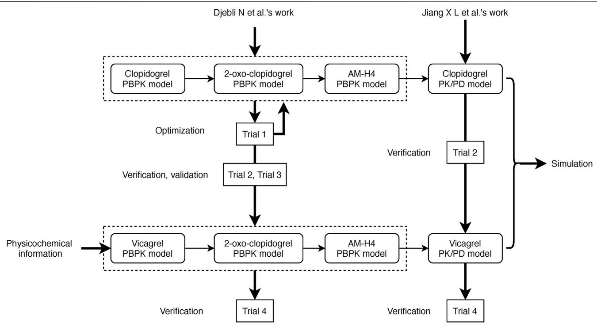

flowchart

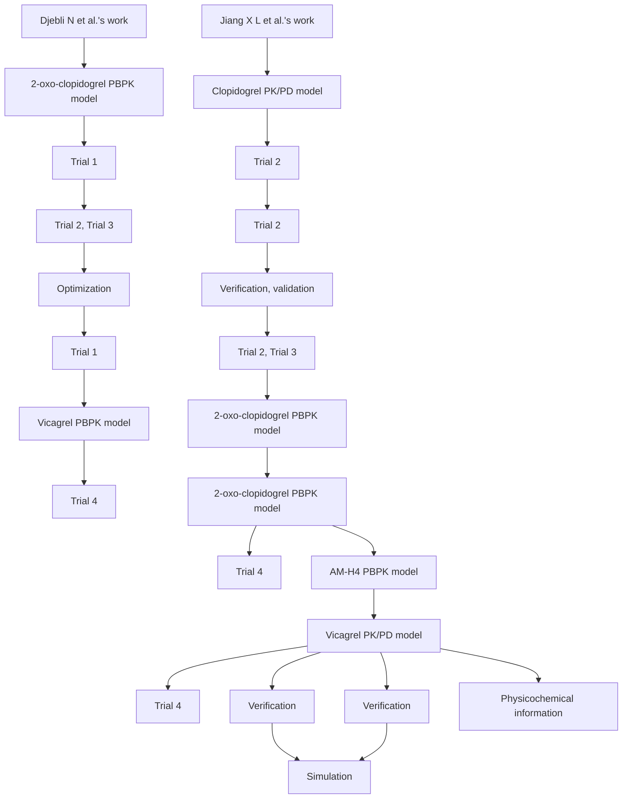

FIGURE 1 | Scheme of development, verification, and validation of PBPK/PD models for vicagrel and clopidogrel.

2016). Models of omeprazole and simvastatin available in Simcyp compound library were directly used in the simulations.

PD model was based on the physiological process of active metabolite AM-H4, which irreversibly binds to the $\mathrm { P } 2 \mathrm { Y } _ { 1 2 }$ receptor on platelets and decreases platelet reactivity. The model was built to describe the time course between plasma concentration and $2 0 \mu \mathrm { M }$ ADP-induced maximal platelet aggregation (MPA). A modified indirect response model was conducted to characterize the turnover of platelets and the irreversible inhibition.

$$
\frac {d P}{d t} = k _ {i n} - P \times k _ {o u t} - P \times C \times k _ {i r r e} \tag {1}
$$

where the rate of platelet formation $( \mathrm { k _ { i n } } )$ and platelet degradation $( \mathrm { k _ { o u t } } )$ are assumed to be zero-order and first-order, respectively. $\mathrm { k } _ { \mathrm { i r r e } }$ is the second-order rate constant characterizing the AM-H4 mediated inactivation of platelets. P represents the turnover of platelets and C represents the molar concentration of AM-H4. Value for each parameter is presented in .

Supplementary Table 2Results were expressed as IPA, which was calculated by the following formula: IPA $( \% ) = ( \mathrm { M P A } _ { 0 } – \mathrm { M P A } _ { \mathrm { t } } ) / \mathrm { M P A } _ { 0 } { \times } 1 0 0$ , where $\mathrm { { M P A } } _ { 0 }$ is baseline MPA and $\mathrm { { M P A } _ { \mathrm { { t } } } }$ is MPA at time t.

# Simulations Using Pharmacokinetic/ Pharmacodynamic Model

Simulations of clopidogrel and vicagrel were conducted in virtual healthy volunteers. A total of 100 individuals $( 1 0 ~ \times ~ 1 0 )$ were simulated during each trial. Healthy volunteers included in Simcyp were chosen for clinical studies including Caucasian volunteers and Chinese volunteers. For trials of CYP2C19 extensive metabolizers (EM), intermediate metabolizers (IM) or poor metabolizers (PM), frequency of the corresponding phenotype was modified to one in Simcyp Population tab. Dosage regimen used in the simulations were matched to each trial. Pharmacokinetic parameters were directly generated by Simcyp.

# Predicting the Effects of CYP2C19 and Carboxylesterases on Vicagrel Pharmacokinetics and Pharmacodynamics

The following scenarios were simulated to study the effects of genetic polymorphisms and inhibition regarding CYP2C19 or CESs enzyme on vicagrel. Pharmacokinetic and pharmacodynamic results were evaluated and compared with available data of vicagrel.

# Effect of CYP2C19 Genetic Polymorphism

Healthy Chinese volunteers with phenotypes of EM, IM or PM received a loading dose (LD) of 24 mg of vicagrel or 300 mg of clopidogrel on day 1 and daily maintenance dose (MD) of 6 mg of vicagrel or 75 mg of clopidogrel from day 2 to day 7.

# Effect of CYP2C19 Inhibitor Omeprazole

CYP2C19 mechanism-based inhibitor omeprazole was used as the perpetrator drug. Simulation scenario was designed as Healthy Chinese volunteers administered 80 mg of omeprazole for 5 days and following with vicagrel of 24 mg LD and 6 mg/day MD for 4 days.

# Effect of Carboxylesterase 1 Genetic Polymorphism

A well-studied CES1 single nucleotide polymorphism (SNP), $g . 4 2 8 G \ > \ A$ (rs71647871), which markedly decreased the catalytic efficiency of CES1 in vitro (Hulot and Fuster, 2009), was investigated. The mutation lead to about 20% decrease in CES1 activity based on a pop-PK analysis of clopidogrel (Angiolillo et al., 2011). Thus, enzymatic clearances of CES1 428 GA genotype for clopidogrel and 2- oxo-clopidogrel were then set to 80% of CES1 428 GG genotype, i.e., 240 μL/min/mg protein and 16 μL/min/mg protein, respectively, to reflect the impaired function. Vicagrel of 24 mg LD and 6 mg/day MD for 4 days was simulated in healthy Caucasian volunteers carrying different CES1 $g . 4 2 8 G > A$ genotype considering the ethnic differences in mutant allele frequency, i.e., about 2–4% in white and 0% in Asian population (Simon et al., 2011).

# Effect of Carboxylesterase 1 Genetic Polymorphism

Two nonsynonymous SNPs of CES2 reported in Japanese population, $g . l O O C \ > \ T$ (rs72547531) and $g . 4 2 4 G \ > \ A$ (rs72547532), which may cause functional alterations (Tarkiainen et al., 2015), were assessed in healthy Chinese volunteers. Enzymatic clearances of the CES2 functionally deficient alleles for vicagrel was reduced by 20-fold based on an in vitro study of irinotecan (Tarkiainen et al., 2015). Therefore, the impaired enzymatic clearance were set to 2,305 μL/min/mg protein. Dosage regimen of 24 mg LD and 6 mg/day MD for 4 days of vicagrel were simulated.

# Effect of Carboxylesterases Inhibitor Simvastatin

CES1 and CES2 enzyme co-inhibitor simvastatin was utilized to study its inhibitory effect on pharmacokinetics and pharmacodynamics of vicagrel. Reversible inhibition constants (K ) of simvastatin on CES1 and CES2 were 0.11 and 0.67 µM, respectively (Fukami et al., 2010). Dosage regimen are designed as follows: simvastatin 80 mg/day was given for five consecutive days, on day 6 vicagrel were co-administered with simvastatin. Sensitivity analysis function within Simcyp was then performed to investigate the contributions of inhibitory potential of CES1 and CES2 to vicagrel pharmacokinetic profiles.

# RESULTS

# Physiologically Based Pharmacokinetic Model Development, Verification, and Validation

PBPK models for clopidogrel and its two metabolites were constructed based on the work of Djebli N et al. (Djebli et al., 2015) and optimized using our previous data obtained from healthy Chinese volunteers (Trial 1). Minimal PBPK model was applied for clopidogrel to reduce model complexity (Tornio et al., 2014) and fit the data better. Additional clearances of clopidogrel and 2-oxo-clopidogrel attributed to CES1 mediated enzymatic clearances were set based on Zhu et al.’s work (Zhu et al., 2013). User-defined esterase enzyme in Simcyp was selected to represent AADAC-mediated metabolism. Relative enzyme abundance and kinetic parameters information of CES2 and AADAC were obtained from Jiang et al. and Vrana, M. ’s work (Jiang et al., 2017; Vrana and Prasad, 2019).

Trial 2 was used for clopidogrel model verification and validation. Trial 3 and Trial 5 including CYP2C19 phenotyped healthy volunteers were used to verify the effects of CYP2C19 genetic polymorphisms on AM-H4. Models of two metabolites were then utilized for vicagrel, which was also verified by Trial 4 and Trial 5. All the 74 available fold-errors of $\mathrm { C } _ { \mathrm { m a x } }$ and $\mathrm { \sf A U C _ { 0 - t } }$ met a criteria of less than 2, while 67 of which were less than 1.5 ( Supplementary). Simulated concentrations of AM-H4 metabolized Table 3from clopidogrel based on Trial 2 are illustrated in . Figure 2ASimulated and observed concentrations of AM-H4 metabolized from vicagrel based on Trial 4 are presented in left row . Results suggested good predictivity of AM-Figure 3H4 under different dose regimens, genetic polymorphisms and ethnics. Models of omeprazole and simvastatin were also verified by published data (Backman et al., 2000; Baldwin et al., 2008). Simulated and observed pharmacokinetic parameters are provided in .

# Pharmacokinetic/Pharmacodynamic Model Development and Verification

Simulated IPA profiles of clopidogrel based on Trial 2 are shown in . Simulated and observed IPA profiles of vicagrel Figure 2Bbased on Trial 4 are presented in right row of . Recovery Figure 3time of platelet function after vicagrel discontinuation was around 7 days, suggesting a comparable irreversible inhibition behavior to clopidogrel. Entire time course of IPA was fully captured by our PD model, which was consistent with the pharmacological mechanism of the thienopyridine antiplatelet agents (Sangkuhl et al., 2011).

# Effects of Genetic Polymorphisms and Inhibitor of CYP2C19 on Vicagrel Pharmacokinetics and Pharmacodynamics

Results in term of CYP2C19 phenotypes on vicagrel and clopidogrel according to Trial 5 are shown in Supplementaryand . Comparable in vivo exposure of AM-H4 Table 3 Figure 4and IPA between vicagrel and clopidogrel were observed in EM subjects, especially during MD phase. Remarkable decrease was noted for clopidogrel in PM subjects, while those for vicagrel were less influenced by CYP2C19 polymorphisms.

As illustrated in , vicagrel was also less affected by Figure 2CYP2C19 inhibitor omeprazole compared to clopidogrel. A longterm treatment of omeprazole resulted in only slightly decrease in AM-H4 concentration and IPA, when a dosage regimen of 24 mg LD and 6 mg MD was given.

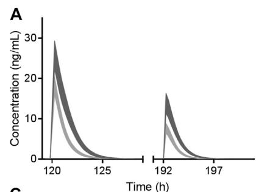

line

| Time (h) | Concentration (ng/mL) - Curve A | Concentration (ng/mL) - Curve B |
| -------- | ------------------------------- | ------------------------------- |
| 120      | ~30                             | ~25                             |
| 192      | ~15                             | ~10                             |
| 197      | ~0                              | ~0                              |

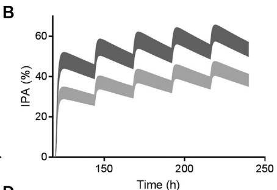

area

| Time (h) | IPA (%) - Series 1 | IPA (%) - Series 2 | IPA (%) - Series 3 |
|---|---|---|---|
| 0 | 0 | 0 | 0 |
| 50 | 50 | 40 | 30 |
| 100 | 55 | 45 | 35 |
| 150 | 60 | 50 | 40 |
| 200 | 65 | 55 | 45 |
| 250 | 60 | 50 | 40 |

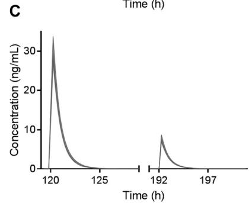

line

| Time (h) | Concentration (ng/mL) |
| -------- | --------------------- |
| 120      | 30                    |
| 192      | 8                     |

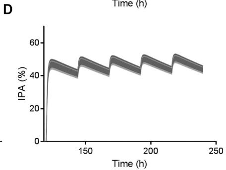

line

| Time (h) | IPA (%) |
| -------- | ------- |
| 0        | 0       |
| 100      | 45      |
| 150      | 48      |
| 200      | 47      |
| 250      | 46      |

FIGURE 2 | Simulated AM-H4 concentration (left row) and IPA (right row) vs. time of clopidogrel (A and B) and vicagrel (C and D) co-administrated with omeprazole. Dosage regimens were 300 mg LD and 75 mg/day MD for 4 days of clopidogrel and 24 mg LD and 6 mg/day MD for 4 days of vicagrel, respectively. Bands represent simulated 95% confidence interval in the presence (light gray)/absence (dark gray) of 80 mg omeprazole treatment. X axis was set according to the first dose of omeprazole.

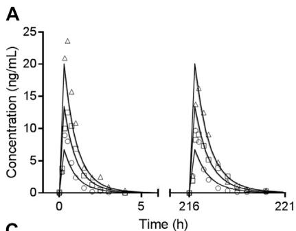

line

| Time (h) | Concentration (ng/mL) - Series 1 | Concentration (ng/mL) - Series 2 | Concentration (ng/mL) - Series 3 | Concentration (ng/mL) - Series 4 |
| -------- | --------------------------------- | --------------------------------- | --------------------------------- | --------------------------------- |
| 0        | 20                                | 15                                | 10                                | 5                                 |
| 216      | 20                                | 15                                | 10                                | 5                                 |
| 221      | 0                                 | 0                                 | 0                                 | 0                                 |

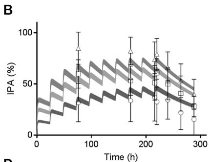

line

| Time (h) | IPA (%) |
| -------- | ------- |
| 0        | 0       |
| 50       | 30      |
| 100      | 60      |
| 150      | 70      |
| 200      | 80      |
| 250      | 75      |
| 300      | 60      |

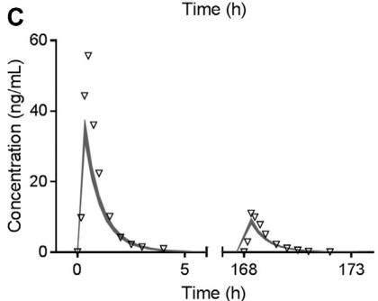

line

| Time (h) | Concentration (ng/mL) |
| -------- | --------------------- |
| 0        | 35                    |
| 168      | 10                    |
| 173      | 0                     |

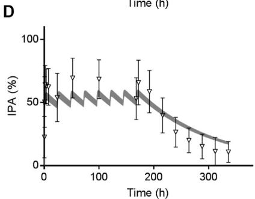

line

| Time (h) | IPA (%) |
| -------- | ------- |
| 0        | 70      |
| 50       | 60      |
| 100      | 55      |
| 150      | 50      |
| 200      | 45      |
| 250      | 35      |
| 300      | 25      |
| 350      | 15      |

FIGURE 3 | Observed mean value (symbols) and simulated 95% confidence interval (bands) of AM-H4 concentration (left row) and IPA (right row) vs. time following different doses of vicagrel according to Trial 4. Different shades of gray bands refer to corresponding observed values of different doses. Observed IPAs are presented as mean ± SD.

A   
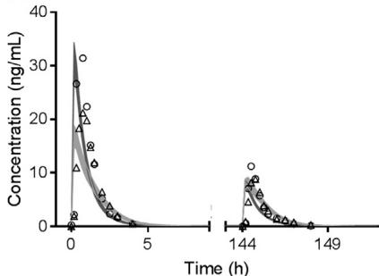

line

| Time (h) | Concentration (ng/mL) - Series 1 | Concentration (ng/mL) - Series 2 | Concentration (ng/mL) - Series 3 |
| -------- | -------------------------------- | -------------------------------- | -------------------------------- |
| 0        | ~35                              | ~28                              | ~20                              |
| 5        | ~5                               | ~5                               | ~5                               |
| 144      | ~10                              | ~10                              | ~10                              |
| 149      | ~0                               | ~0                               | ~0                               |

B   
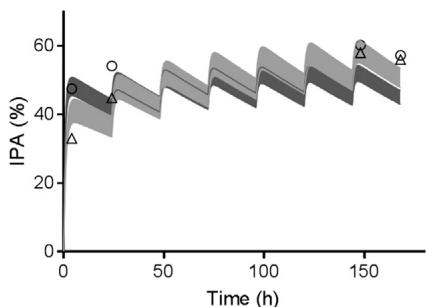

line

| Time (h) | IPA (%) |
| -------- | ------- |
| 0        | 45      |
| 25       | 35      |
| 50       | 45      |
| 75       | 55      |
| 100      | 60      |
| 125      | 65      |
| 150      | 60      |
| 175      | 55      |

C   
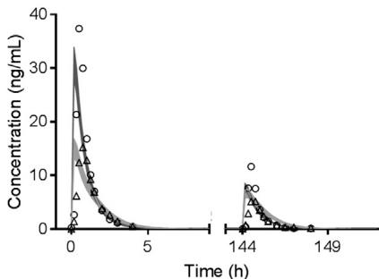

line

| Time (h) | Concentration (ng/mL) |
| -------- | --------------------- |
| 0        | 38                    |
| 144      | 12                    |
| 149      | 0                     |

D

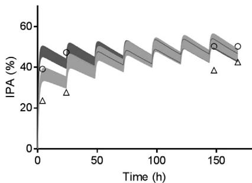

line

| Time (h) | IPA (%) - Series 1 | IPA (%) - Series 2 |
| -------- | ------------------ | ------------------ |
| 0        | 40                 | 30                 |
| 25       | 50                 | 40                 |
| 50       | 45                 | 35                 |
| 75       | 55                 | 45                 |
| 100      | 50                 | 40                 |
| 125      | 55                 | 45                 |
| 150      | 50                 | 40                 |
| 175      | 45                 | 35                 |

E   
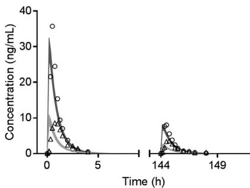

line

| Time (h) | Concentration (ng/mL) |
| -------- | --------------------- |
| 0        | 35                    |
| 144      | 8                     |
| 149      | 2                     |

F

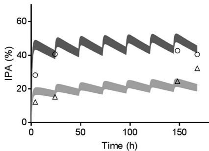

line

| Time (h) | IPA (%) - Series 1 | IPA (%) - Series 2 | IPA (%) - Series 3 |
| -------- | ------------------ | ------------------ | ------------------ |
| 0        | 48                 | 28                 | 12                 |
| 50       | 48                 | 28                 | 12                 |
| 100      | 48                 | 28                 | 12                 |
| 150      | 48                 | 28                 | 12                 |
| 170      | 48                 | 28                 | 12                 |

FIGURE 4 | Observed mean value (symbols) and simulated 95% confidence interval (bands) of AM-H4 concentration (left row) and IPA (right row) vs. time among CYP2C19 EM (A and B), IM (C and D) and PM (E and F) population receiving clopidogrel or vicagrel.

# Effects of Genetic Polymorphisms and Inhibitor of Carboxylesterases on Vicagrel Pharmacokinetics and Pharmacodynamics

summarized the effects of genetic polymorphisms and Table 1inhibitors of CESs on pharmacokinetic parameters of vicagrel and AM-H4. A slightly increase in AM-H4 exposure and subsequently elevated IPA response were observed for CES1 428 G/A carriers ( ,   ). Table 1 Supplementary Figure 2Although proportion of change up to more than 300-fold was observed for parameters of vicagrel among volunteers carrying CES2 defect alleles, ratios of pharmacokinetic parameters for AM-H4 were approximately 1. Similarly, no difference of AM-H4 parameters was observed when volunteers were co-administrated with simvastatin. Overall, genetic polymorphisms and inhibitor of CESs may not result in clinically relevant difference of pharmacodynamic profiles of vicagrel. Further analysis of $\mathrm { K _ { i } }$ of simvastatin on CES1 and CES2 in terms of AM-H4 pharmacokinetics was performed using sensitivity analysis in a range of 0.001–0.11 and 0.001–0.67, respectively. As illustrated in Figure 5, $\mathrm { \sf A U C } _ { 0 - 1 }$ ratio of AM-H4 increased as the $\mathrm { K _ { i } }$ values Figure 5decreased, and sensitivity to $\mathrm { K _ { i } }$ on CES1 is greater when the value is low.

# DISCUSSION

Our work is the first accurately and simultaneously describing the pharmacokinetics of two parent drugs of antiplatelet agents, their primary and secondary metabolites and pharmacodynamics via a full dynamic PBPK/PD modeling approach. A combined PBPK/ PD model was firstly built for clopidogrel based on a published PBPK model describing clopidogrel sequential metabolism (Djebli et al., 2015) and a pop-PD model (Jiang et al., 2016). Vicagrel PBPK/PD model was then constructed by linking the parent drug to the metabolites.

TABLE 1 |
Comparison of pharmacokinetic parameters of vicagrel and AM-H4 in the presence/absence of various factors regarding genetic polymorphisms and inhibitor of CESs. 

<table><tr><td rowspan="2">Populations</td><td rowspan="2">Simulated analytes</td><td rowspan="2">Route</td><td rowspan="2">Groups</td><td colspan="4">Parameters for the first dose</td><td colspan="4">Parameters for the last dose</td></tr><tr><td> $AUC_{0-24}$ (ng·h/mL)</td><td>Ratio of mean  $AUC_{0-24}$ </td><td> $C_{max}$ (ng/ml)</td><td>Ratio of mean  $C_{max}$ </td><td> $AUC_{0-24}$ (ng·h/mL)</td><td>Ratio of mean  $AUC_{0-24}$ </td><td> $C_{max}$ (ng/ml)</td><td>Ratio of mean  $C_{max}$ </td></tr><tr><td rowspan="4">Caucasian</td><td rowspan="2">Vicagrel</td><td rowspan="2">Oral</td><td>CES1 G/G</td><td>0.09 ± 0.07</td><td>1.00</td><td>0.09 ± 0.07</td><td>1.00</td><td>0.02 ± 0.02</td><td>1.00</td><td>0.02 ± 0.02</td><td>1.00</td></tr><tr><td>CES1 G/A</td><td>0.09 ± 0.07</td><td></td><td>0.09 ± 0.07</td><td></td><td>0.02 ± 0.02</td><td></td><td>0.02 ± 0.02</td><td></td></tr><tr><td rowspan="2">AM-H4</td><td rowspan="2"></td><td>CES1 G/G</td><td>36.10 ± 14.00</td><td>0.89</td><td>36.10 ± 15.94</td><td>0.89</td><td>9.10 ± 3.52</td><td>0.89</td><td>9.17 ± 4.05</td><td>0.90</td></tr><tr><td>CES1 G/A</td><td>40.48 ± 14.96</td><td></td><td>40.42 ± 17.12</td><td></td><td>10.20 ± 3.76</td><td></td><td>10.24 ± 4.34</td><td></td></tr><tr><td rowspan="4">Chinese</td><td rowspan="2">Vicagrel</td><td rowspan="2">Oral</td><td>CES2 wild type</td><td>0.12 ± 0.08</td><td>0.003</td><td>0.10 ± 0.07</td><td>0.003</td><td>0.03 ± 0.02</td><td>0.003</td><td>0.03 ± 0.02</td><td>0.004</td></tr><tr><td>CES2 defect allele</td><td>40.46 ± 27.27</td><td></td><td>29.29 ± 16.61</td><td></td><td>10.11 ± 6.82</td><td></td><td>7.32 ± 4.15</td><td></td></tr><tr><td rowspan="2">AM-H4</td><td rowspan="2"></td><td>CES2 wild type</td><td>31.35 ± 13.07</td><td>1.00</td><td>31.54 ± 15.19</td><td>1.03</td><td>7.94 ± 3.31</td><td>1.00</td><td>8.05 ± 3.86</td><td>1.03</td></tr><tr><td>CES2 defect allele</td><td>31.41 ± 13.09</td><td></td><td>30.57 ± 14.84</td><td></td><td>7.95 ± 3.31</td><td></td><td>7.80 ± 3.77</td><td></td></tr><tr><td rowspan="4">Chinese</td><td rowspan="2">Vicagrel</td><td rowspan="2">Oral</td><td>w/o simvastatin</td><td>0.12 ± 0.08</td><td>0.80</td><td>0.10 ± 0.07</td><td>0.71</td><td>0.03 ± 0.02</td><td>0.75</td><td>0.03 ± 0.02</td><td>0.75</td></tr><tr><td>w/simvastatin</td><td>0.15 ± 0.10</td><td></td><td>0.14 ± 0.09</td><td></td><td>0.04 ± 0.03</td><td></td><td>0.04 ± 0.02</td><td></td></tr><tr><td rowspan="2">AM-H4</td><td rowspan="2"></td><td>w/o simvastatin</td><td>28.57 ± 11.55</td><td>0.99</td><td>29.17 ± 14.95</td><td>1.00</td><td>7.23 ± 2.93</td><td>1.00</td><td>7.45 ± 3.80</td><td>1.00</td></tr><tr><td>w/simvastatin</td><td>28.84 ± 11.63</td><td></td><td>29.22 ± 14.94</td><td></td><td>7.30 ± 2.95</td><td></td><td>7.46 ± 3.80</td><td></td></tr></table>

Parameters are presented as mean ± SD.   
Each ratio of mean value was calculated from the upper mean value divided by lower mean value of each parameter.

The PK profiles of vicagrel, clopidogrel, their common metabolites 2-oxo-clopidogrel and AM-H4 were characterized via a bottom-up approach integrating available physicochemical and in vitro absorption, distribution, metabolism and excretion information. The models were successfully verified and validated for clopidogrel and AM-H4 but not vicagrel and 2-oxoclopidogrel because of the difficulty of determination in plasma and limited clinical data (Hua et al., 2015; Liu et al., 2019). The irreversible inhibition of platelet aggregation of thienopyridines was characterized by an indirect response model and linked to plasma concentrations of AM-H4. Interindividual variability was considered in $\mathrm { k _ { i n } , \ k _ { o u t } , \ k _ { i r r } }$ and $\mathrm { { M P A } } _ { 0 }$ based on estimated results (Jiang et al., 2016). Similar to clopidogrel, slow loss of inhibition could be observed after vicagrel discontinuation because of the irreversible binding of AM-H4 to $\mathrm { P } 2 \mathrm { Y } _ { 1 2 }$ receptor.

For clopidogrel, simulation results of the effects of omeprazole and CYP2C19 phenotypes on its pharmacokinetics and pharmacodynamics based on Trial 2, Trial 3 and Trial 5 verified the important role of CYP2C19 play in clopidogrel metabolic processes. Regarding vicagrel, less impacts of both CYP2C19 inhibitor and phenotypes were observed on pharmacokinetics and subsequent pharmacodynamics. Since CYP2C19 still participated in the second step of vicagrel metabolism (Qiu et al., 2014; Jiang et al., 2017), AM-H4 exposure and IPA slightly declined in PM volunteers comparing with those in EM and IM volunteers ( and ), which might not be Supplementary Table 3 Figure 4clinically relevant. The results confirmed the assumption in previous studies that dosage adjustment or alternative therapy was unnecessary for patients identified as CYP2C19 PM phenotype receiving vicagrel treatment (Zhang et al., 2020).

Most of clopidogrel was hydrolyzed by CES1 to the inactive carboxylic acid metabolite. CES1 was also involved in the metabolism of 2-oxo-clopidogrel and AM-H4. An in vitro study reported that enzymatic activity of the CES1 variant c.428 G > A was completely abolished in terms of catalyzing the hydrolysis of clopidogrel and 2-oxoclopidogrel (Zhu et al., 2013). An in vivo study confirmed increased AM-H4 concentration and antiplatelet effect in 428 G/A heterozygotes, resulting from impaired hydrolysis of clopidogrel (Trial 6) (Tarkiainen et al., 2015). A pop-PK analysis suggested around 80% of remained CES1 activity for heterozygotes (Jiang et al., 2016). It was then incorporated into our model. Our simulated results showed less impact of CES1 genetic polymorphisms on vicagrel with respect to both PK and PD, when compared to clopidogrel of Trial 6 (Supplementary Figure 1).

upplementary Figure 1CES1A2 -816A > C is another genetic polymorphism of CES1, which is common in Chinese population with allele frequency of around 25%. But conflicting results remain as to the effect on clopidogrel antiplatelet response. Zou et al. reported this mutant was associated with greater platelet response to clopidogrel (Zou et al., 2014), while Xie et al. observed attenuated platelet reactivity to clopidogrel (Xie et al., 2014). Therefore, the impact of this SNP on vicagrel pharmacokinetics and pharmacodynamics was not explored in the current study.

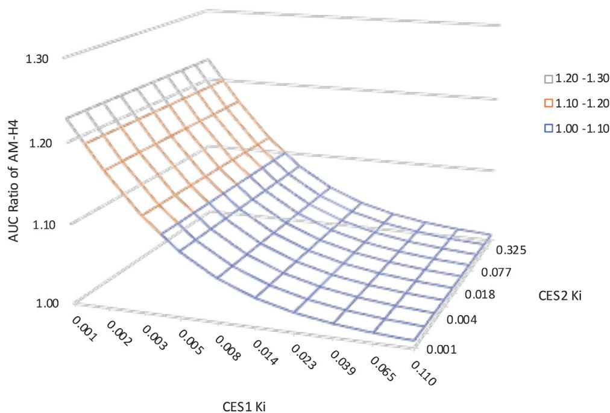

surface_3d

| CES1 Ki | CES2 Ki | AUC Ratio of AM-H4 |
| ------- | ------- | ------------------ |
| 0.001   | 0.001   | 1.30               |
| 0.002   | 0.004   | 1.25               |
| 0.003   | 0.008   | 1.20               |
| 0.005   | 0.014   | 1.15               |
| 0.008   | 0.023   | 1.10               |
| 0.014   | 0.039   | 1.05               |
| 0.023   | 0.065   | 1.00               |
| 0.039   | 0.110   | 1.05               |
| 0.065   | 0.130   | 1.15               |
| 0.110   | 0.135   | 1.25               |
| 0.135   | 0.135   | 1.30               |

FIGURE 5 | Sensitivity analysis suggesting the impact of carboxylesterases Ki of simvastatin on vicagrel predicted AUC0-t ratios. Ki on CES1 ranged from 0.001–0.11. K on CES2 ranged from 0.001–0.67.

Another major isoform of human carboxylesterase, CES2, was reported to catalyze vicagrel to form its intermediate metabolite, 2-oxo-clopidogrel (Qiu et al., 2016). Subsequent study found AADAC in the human intestine was also involved in the hydrolytic metabolism of vicagrel with a contribution of approximately 53% (Jiang et al., 2017). AADAC, also known as CES5A1, is responsible for the hydrolysis of flutamide, phenacetin and rifampicin (Shimizu et al., 2014). Comparable intestinal protein expressions and enzyme affinities for vicagrel between AADAC and CES2 were determined (Jiang et al., 2017; Vrana and Prasad, 2019). Since AADAC was not considered in the current version of Simcyp software, a user-defined esterase enzyme was selected to represent the contribution of AADAC to the hydrolysis of vicagrel in our PBPK model. The AADAC\*2 allele (g.13651 G > A, rs1803155) and AADAC\*3 allele (g.13651 > A/g.14008T>C) are two most common SNPs which are reported to be associated with reduced enzyme activity in vitro and in vivo (Shimizu et al., 2012; Sloan et al., 2017; Francis et al., 2019). It would be interesting to explore the effect of AADAC genetic polymorphisms on vicagrel activation and subsequent antiplatelet response. However, due to the lack of absolute protein quantitation data for different genotypes, enzymatic alteration resulting from genetic polymorphisms was not further explored in our study. Further studies toward determining the absolute protein levels should be underway.

Large ethnic differences in CES2 alleles frequencies have been documented across populations (Marsh et al., 2004). The two nonsynonymous SNPs, CES2 g. 100C > T and CES2 g.424 G > A found in Japanese population were investigated in our study (Kim et al., 2003). Although elevated protein expression levels were observed for both variants in vitro, further studies indicated almost complete loss of carboxylesterase activity toward irinotecan and declined in vivo exposure of its metabolites SN-38 and SN-38G (Kubo et al., 2005). Our simulation also found increased vicagrel concentrations due to the decreased catalytic efficiency of CES2, but the variations resulted in almost no change of AM-H4 concentration. It is not surprising since CES2 contributed to only one step of the sequential metabolism of vicagrel, the decreased enzyme activity caused by CES2 variants may be partly compensated by AADAC.

Simvastatin, an oral cholesterol-lowering medication, showed strong inhibitory effects on imidapril hydrolase activity by CES1 and irinotecan hydrolase activity by CES2 in vitro (Fukami et al., 2010). Another study demonstrated that simvastatin could significantly inhibit CES1-mediated hydrolysis of clopidogrel, 2-oxo-clopidogrel and AM-H4, while the production of AM-H4 was not affected (Wang et al., 2015). Unlike clopidogrel, an in vitro study has identified declined AM-H4 production from vicagrel when co-incubated with simvastatin (Jiang et al., 2017), but no difference of AM-H4 concentrations was observed in our simulations. It could be partly explained as the rapid elimination property of both perpetrator drug and victim drug that the effective inhibitory potential could not be reached.

Study of sensitivity analysis to K values suggested a more pivotal role of CES1 in the alteration of esterase enzymatic function regarding AM-H4 pharmacokinetics, because CES1 was directly related to the formation of AM-H4. The result was consistent with the above study of the effect of carboxylesterases genetic polymorphisms that CES1 defect allele could result in more obviously decreased AM-H4 exposure. Since parameter sensitivity to K on CES1 is greater when the value is low, drug-drug interaction studies could be utilized between vicagrel and several clinical medications which were reported to be more potent CES1 inhibitors, e.g., telmisartan, nitrendipine (Wang et al., 2018), to support drug development and treatment optimization for this novel antiplatelet agent.

Due to the low plasma concentrations of vicagrel parent drug (Liu et al., 2019), the PBPK model was unable to be verified, which may result in bias when evaluating the intestinal first-pass metabolism of vicagrel. Additionally, although all the simulated pharmacokinetic parameters for vicagrel-mediated AM-H4 fell within the acceptance criteria based on two published studies of long-term treatment (Trial 4 and Trial 5), our results were much lower than those of a single-ascending-dose study of vicagrel (Liu et al., 2019) (  ). A better optimization of vicagrel Supplementary Table 5model and more clinical data are necessary to help characterize the biotransformation of vicagrel.

In conclusion, a PBPK/PD model for a novel antiplatelet agent, vicagrel, was presented in our study, which could capture the PK and PD profiles simultaneously. The impacts of genetic polymorphisms and inhibitors of CYP2C19 and carboxylesterases were then evaluated from both pharmacokinetic and pharmacodynamic viewpoints. Vicagrel was less influenced by these factors when compared to clopidogrel, suggesting the potential as a novel antiplatelet agent. Our model can be successfully used to facilitate optimal treatment plan of vicagrel for cardiovascular diseases.

# REFERENCES

Angiolillo, D. J., Gibson, C. M., Cheng, S., Ollier, C., Nicolas, O., Bergougnan, L., et al. (2011). Differential effects of omeprazole and pantoprazole on the pharmacodynamics and pharmacokinetics of clopidogrel in healthy subjects: randomized, placebo-controlled, crossover comparison studies. Clin. Pharmacol. Ther. 89 (1), 65–74. doi:10.1038/clpt.2010.219   
Backman, J., Kyrklund, C., Kivisto, K. T., Wang, J. S., and Neuvonen, P. J. (2000). Plasma concentrations of active simvastatin acid are increased by gemfibrozil. Clin. Pharmacol. Therapeut. 68 (2), 122–129. doi:10.1067/mcp.2000.108507   
Baldwin, R. M., Ohlsson, S., Pedersen, R. S., Mwinyi, J., Ingelman-Sundberg, M., Eliasson, E., et al. (2008). Increased omeprazole metabolism in carriers of the CYP2C19\*17 allele; a pharmacokinetic study in healthy volunteers. Br. J. Clin. Pharmacol. 65 (5), 767–774. doi:10.1111/j.1365-2125.2008.03104.x   
Cattaneo, M. (2015). P2Y12receptors: structure and function. J. Thromb. Haemost. 13 (Suppl. 1), S10–S16. doi:10.1111/jth.12952   
Djebli, N., Fabre, D., Boulenc, X., Fabre, G., Sultan, E., and Hurbin, F. (2015). Physiologically based pharmacokinetic modeling for sequential metabolism: effect of CYP2C19 genetic polymorphism on clopidogrel and clopidogrel active metabolite pharmacokinetics. Drug Metab. Dispos. 43 (4), 510–522. doi:10. 1124/dmd.114.062596   
Dorsam, R. T. and Kunapuli, S. P. (2004). Central role of the P2Y12 receptor in platelet activation. J. Clin. Invest. 113 (3), 340–345. doi:10.1172/JCI20986

# DATA AVAILABILITY STATEMENT

The original contributions presented in the study are included in the article/ , further inquiries can be Supplementary Materialdirected to the corresponding authors.

# AUTHOR CONTRIBUTIONS

SL: data acquisition, investigation; ZW: investigation, writing draft; XT: supervision, review; WC: supervision, review and editing.

# FUNDING

This work was supported by the National Natural Science Foundation of China (Grant No. 81603204) and National Science and Technology Major Project of China (Grant No.2020ZX09201-009).

# ACKNOWLEDGMENTS

We would like to thank Oliver Hatley and Rachel Rose from Certara United Kingdom Limited for their valuable help on modeling. Certara UK (Simcyp Division) granted free access to the Simcyp Simulators through an academic licence (subject to conditions).

# SUPPLEMENTARY MATERIAL

The Supplementary Material for this article can be found online at: https://www.frontiersin.org/articles/10.3389/fphar.2020.591854/ full#supplementary-material.

Francis, J., Zvada, S. P., Denti, P., Hatherill, M., Charalambous, S., Mungofa, S., et al. (2019). A population pharmacokinetic analysis shows that arylacetamide deacetylase (AADAC) gene polymorphism and HIV infection affect the exposure of rifapentine. Antimicrob. Agents Chemother. 63 (4), 8. doi:10. 1128/AAC.01964-18   
Fukami, T., Takahashi, S., Nakagawa, N., Maruichi, T., Nakajima, M., and Yokoi, T. (2010). In vitro evaluation of inhibitory effects of antidiabetic and antihyperlipidemic drugs on human carboxylesterase activities. Drug Metab. Dispos. 38 (12), 2173–2178. doi:10.1124/dmd.110.034454   
Hua, W., Lesslie, M., Hoffman, B. T., Binns, C., and Mulvana, D. (2015). Development of a sensitive and fast UHPLC-MS/MS method for determination of clopidogrel, clopidogrel acid and clopidogrel active metabolite H4 in human plasma. Bioanalysis 7 (12), 1471–1482. doi:10.4155/bio.15.82   
Hulot, J.-S. and Fuster, V. (2009). Personalized medicine for clopidogrel resistance? Nat. Rev. Cardiol. 6 (5), 334–336. doi:10.1038/nrcardio.2009.28   
Jiang, J., Chen, X., and Zhong, D. (2017). Arylacetamide deacetylase is involved in vicagrel bioactivation in humans. Front. Pharmacol. 8, 846. doi:10.3389/fphar. 2017.00846   
Jiang, X.-L., Samant, S., Lewis, J. P., Horenstein, R. B., Shuldiner, A. R., Yerges-Armstrong, L. M., et al. (2016). Development of a physiology-directed population pharmacokinetic and pharmacodynamic model for characterizing the impact of genetic and demographic factors on clopidogrel response in healthy adults. Eur. J. Pharmaceut. Sci. 82, 64–78. doi:10.1016/j.ejps. 2015.10.024

Kazui, M., Nishiya, Y., Ishizuka, T., Hagihara, K., Farid, N. A., Okazaki, O., et al. (2010). Identification of the human cytochrome P450 enzymes involved in the two oxidative steps in the bioactivation of clopidogrel to its pharmacologically active metabolite. Drug Metab. Dispos. 38 (1), 92–99. doi:10.1124/dmd.109. 029132   
Kim, K., Park, P., Hong, S., and Park, J.-Y. (2008). The effect of CYP2C19 polymorphism on the pharmacokinetics and pharmacodynamics of clopidogrel: a possible mechanism for clopidogrel resistance. Clin. Pharmacol. Ther. 84 (2), 236–242. doi:10.1038/clpt.2008.20   
Kim, S. R., Nakamura, T., Saito, Y., Sai, K., Nakajima, T., Saito, H., et al. (2003). Twelve novel single nucleotide polymorphisms in the CES2 gene encoding human carboxylesterase 2 (hCE-2). Drug Metabol. Pharmacokinet. 18 (5), 327–332. doi:10.2133/dmpk.18.327   
Kubo, T., Kim, S.-R., Sai, K., Saito, Y., Nakajima, T., Matsumoto, K., et al. (2005). Functional characterization of three naturally occurring single nucleotide polymorphisms in the CES2 gene encoding carboxylesterase 2 (HCE-2). Drug Metab. Dispos. 33 (10), 1482–1487. doi:10.1124/dmd.105.005587   
Li, X., Liu, C., Zhu, X., Wei, H., Zhang, H., Chen, H., et al. (2018). Evaluation of tolerability, pharmacokinetics and pharmacodynamics of vicagrel, a novel P2Y12 antagonist, in healthy Chinese volunteers. Front. Pharmacol. 9, 643. doi:10.3389/fphar.2018.00643   
Liu, C., Zhang, Y., Chen, W., Lu, Y., Li, W., Liu, Y., et al. (2019). Pharmacokinetics and pharmacokinetic/pharmacodynamic relationship of vicagrel, a novel thienopyridine P2Y12 inhibitor, compared with clopidogrel in healthy Chinese subjects following single oral dosing. Eur. J. Pharmaceut. Sci. 127, 151–160. doi:10.1016/j.ejps.2018.10.011   
Liu, S., Wang, Z., Ding, X., Xu, Q., Guo, Z., and Miao, L. (2015). Determination of clopidogrel and its metabolites in plasma by UPLC-MS/MS and the application in pharmacokinetic study. Chin. J. Pharm. Anal. 35 (1), 56–63.   
Marsh, S., Xiao, M., Yu, J., Ahluwalia, R., Minton, M., Freimuth, R. R., et al. (2004). Pharmacogenomic assessment of carboxylesterases 1 and 2. Genomics 84 (4), 661–668. doi:10.1016/j.ygeno.2004.07.008   
Matetzky, S., Shenkman, B., Guetta, V., Shechter, M., Beinart, R., Goldenberg, I., et al. (2004). Clopidogrel resistance is associated with increased risk of recurrent atherothrombotic events in patients with acute myocardial infarction. Circulation 109 (25), 3171–3175. doi:10.1161/01.CIR.0000130846.46168.03   
Qiu, Z.-x., Gao, W.-c., Dai, Y., Zhou, S.-f., Zhao, J., Lu, Y., et al. (2016). Species comparison of pre-systemic bioactivation of vicagrel, a new acetate derivative of clopidogrel. Front. Pharmacol. 7, 366. doi:10.3389/fphar.2016.00366   
Qiu, Z., Li, N., Song, L., Lu, Y., Jing, J., Parekha, H. S., et al. (2014). Contributions of intestine and plasma to the presystemic bioconversion of vicagrel, an acetate of clopidogrel. Pharm. Res. 31 (1), 238–251. doi:10. 1007/s11095-013-1158-5   
Rose, R., Neuhoff, S., Abduljalil, K., Chetty, M., Rostami-Hodjegan, A., and Jamei, M. (2014). Application of a physiologically based pharmacokinetic model to predict OATP1B1 -related variability in pharmacodynamics of rosuvastatin. CPT Pharmacometrics Syst. Pharmacol. 3, 124. doi:10.1038/psp.2014.24   
Sangkuhl, K., Klein, T. E., and Altman, R. B. (2010). Clopidogrel pathway. Pharmacogenetics Genom. 20 (7), 1–5. doi:10.1097/FPC.0b013e3283385420   
Sangkuhl, K., Shuldiner, A. R., Klein, T. E., and Altman, R. B. (2011). Platelet aggregation pathway. Pharmacogenetics Genom. 21 (8), 516–521. doi:10.1097/ FPC.0b013e3283406323   
Shan, J., Zhang, B., Zhu, Y., Jiao, B., Zheng, W., Qi, X., et al. (2012). Overcoming clopidogrel resistance: discovery of vicagrel as a highly potent and orally bioavailable antiplatelet agent. J. Med. Chem. 55 (7), 3342–3352. doi:10.1021/jm300038c   
Shimizu, M., Fukami, T., Kobayashi, Y., Takamiya, M., Aoki, Y., Nakajima, M., et al. (2012). A novel polymorphic allele of human arylacetamide deacetylase leads to decreased enzyme activity. Drug Metab. Dispos. 40 (6), 1183–1190. doi:10.1124/dmd.112.044883

Shimizu, M., Fukami, T., Nakajima, M., and Yokoi, T. (2014). Screening of specific inhibitors for human carboxylesterases or arylacetamide deacetylase. Drug Metab. Dispos. 42 (7), 1103–1109. doi:10.1124/dmd.114.056994   
Simon, T., Bhatt, D. L., Bergougnan, L., Farenc, C., Pearson, K., Perrin, L., et al. (2011). Genetic polymorphisms and the impact of a higher clopidogrel dose regimen on active metabolite exposure and antiplatelet response in healthy subjects. Clin. Pharmacol. Ther. 90 (2), 287–295. doi:10.1038/clpt. 2011.127   
Sloan, D. J., McCallum, A. D., Schipani, A., Egan, D., Mwandumba, H. C., Ward, S. A., et al. (2017). Genetic determinants of the pharmacokinetic variability of rifampin in Malawian adults with pulmonary tuberculosis. Antimicrob. Agents Chemother. 61 (7). doi:10.1128/AAC.00210-17   
Tarkiainen, E., Holmberg, M., Tornio, A., Neuvonen, M., Neuvonen, P., Backman, J., et al. (2015). Carboxylesterase 1 c.428G>A single nucleotide variation increases the antiplatelet effects of clopidogrel by reducing its hydrolysis in humans. Clin. Pharmacol. Ther. 97 (6), 650–658. doi:10. 1002/cpt.101   
Tornio, A., Filppula, A. M., Kailari, O., Neuvonen, M., Nyrönen, T. H., Tapaninen, T., et al. (2014). Glucuronidation converts clopidogrel to a strong timedependent inhibitor of CYP2C8: a phase II metabolite as a perpetrator of drug-drug interactions. Clin. Pharmacol. Ther. 96 (4), 498–507. doi:10.1038/ clpt.2014.141   
Vrana, M. and Prasad, B. (2019). Tissue-specific mechanisms of irinotecan metabolism. Drug Metabolism and Pharmacokinetics 34 (1), S47. doi:10. 1016/j.dmpk.2018.09.168   
Wang, D., Zou, L., Jin, Q., Hou, J., Ge, G., and Yang, L. (2018). Human carboxylesterases: a comprehensive review. Acta Pharm. Sin. B 8 (5), 699–712. doi:10.1016/j.apsb.2018.05.005   
Wang, X., Zhu, H.-J., and Markowitz, J. S. (2015). Carboxylesterase 1-mediated drug-drug interactions between clopidogrel and simvastatin. Biol. Pharm. Bull. 38 (2), 292–297. doi:10.1248/bpb.b14-00679   
Xie, C., Ding, X., Gao, J., Wang, H., Hang, Y., Zhang, H., et al. (2014). The effects of CES1A2 A(−816)C and CYP2C19 loss-of-function polymorphisms on clopidogrel response variability among Chinese patients with coronary heart disease. Pharmacogenetics Genom. 24 (4), 204–210. doi:10.1097/FPC. 0000000000000035   
Zhang, Y., Zhu, X., Zhan, Y., Li, X., Liu, C., Zhu, Y., et al. (2020). Impacts of CYP2C19 genetic polymorphisms on bioavailability and effect on platelet adhesion of vicagrel, a novel thienopyridine P2Y 12 inhibitor. Br. J. Clin. Pharmacol. 86, 1860. doi:10.1111/bcp.14296   
Zhu, H.-J., Wang, X., Gawronski, B. E., Brinda, B. J., Angiolillo, D. J., and Markowitz, J. S. (2013). Carboxylesterase 1 as a determinant of clopidogrel metabolism and activation. J. Pharmacol. Exp. Therapeut. 344 (3), 665–672. doi:10.1124/jpet.112.201640   
Zou, J.-J., Chen, S.-L., Fan, H.-W., Tan, J., He, B.-S., and Xie, H.-G. (2014). CES1A 816C as a genetic marker to predict greater platelet clopidogrel response in patients with percutaneous coronary intervention. J. Cardiovasc. Pharmacol. 63 (2), 178–183. doi:10.1097/FJC.0000000000000037

fl The authors declare that the research was conducted in the Con ict of Interest:absence of any commercial or financial relationships that could be construed as a potential conflict of interest.

Copyright © 2020 Liu, Wang, Tian and Cai. This is an open-access article distributed under the terms of the Creative Commons Attribution License (CC BY). The use, distribution or reproduction in other forums is permitted, provided the original author(s) and the copyright owner(s) are credited and that the original publication in this journal is cited, in accordance with accepted academic practice. No use, distribution or reproduction is permitted which does not comply with these terms.