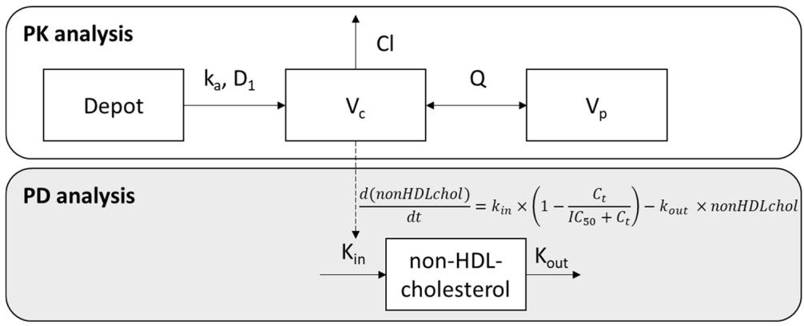
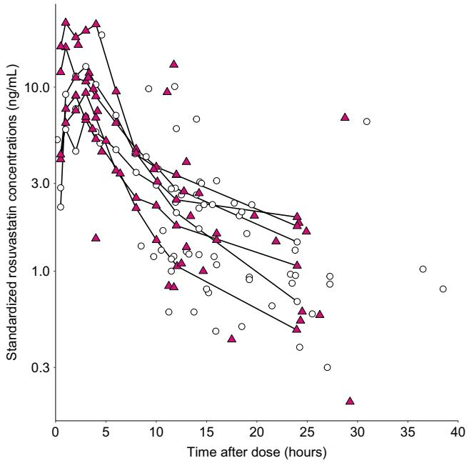
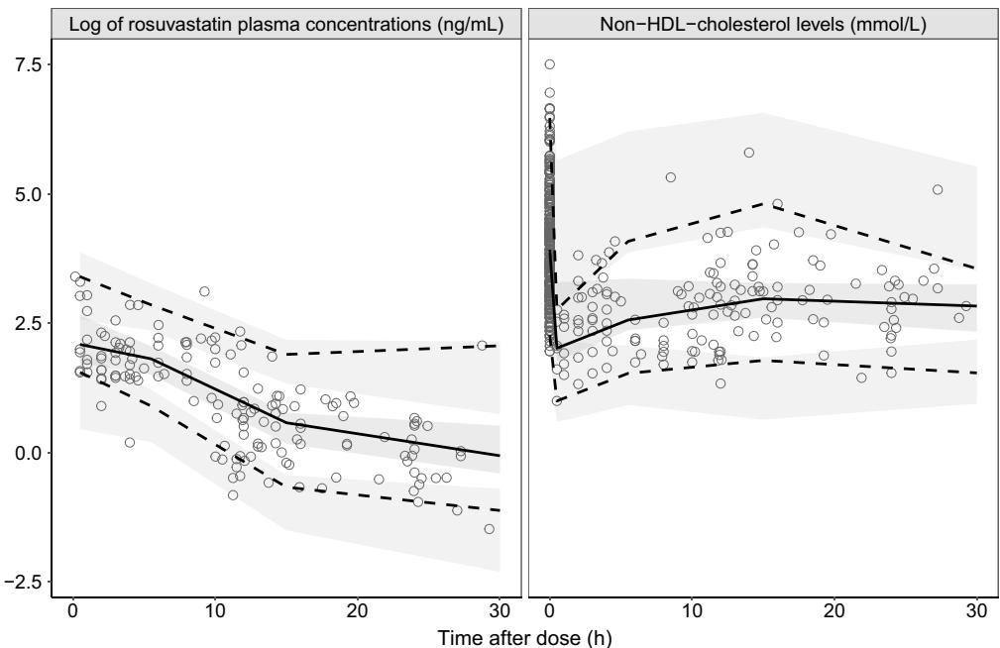
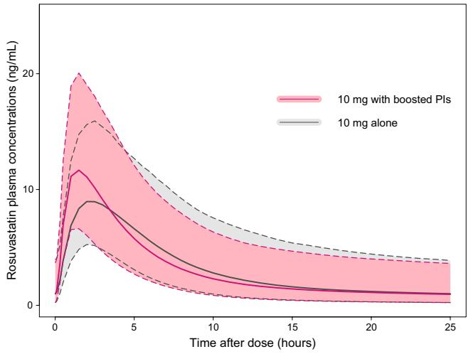
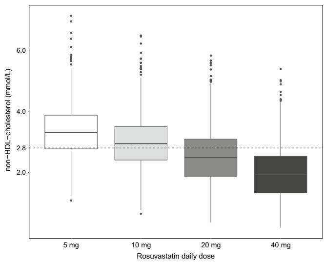

# Pharmacokinetic/Pharmacodynamic Modelling to Describe the Cholesterol Lowering Efect of Rosuvastatin in People Living with HIV

Perrine Courlet1  · Monia Guidi1,2,3  · Susana Alves Saldanha1  · Felix Stader4,5  · Anna Traytel6  · Matthias Cavassini7  · Marcel Stoeckle4  · Thierry Buclin1  · Catia Marzolini4,5  · Laurent A. Decosterd1 Chantal Csajka2,3,8  · and the Swiss HIV Cohort Study

Accepted: 23 September 2020 / Published online: 29 October 2020 © The Author(s) 2020

# Abstract

Background Rosuvastatin is a lipid-lowering agent widely prescribed in people living with HIV, which is actively transported into the liver, making it a potential victim of drug–drug interactions with antiretroviral agents.

Objectives The aims of this study were to characterise the pharmacokinetic profle of rosuvastatin and to describe the relationship between rosuvastatin concentrations and non-high-density lipoprotein (HDL)-cholesterol levels in people living with HIV.

Methods A population pharmacokinetic model (NONMEM) was developed to quantify the infuence of demographics, clinical characteristics and comedications on rosuvastatin pharmacokinetics. This model was combined with an indirect efect model to describe non-HDL-cholesterol measurements.

Results A two-compartment model with sequential zero- and frst-order absorption best ftted the 154 rosuvastatin concentrations provided by 65 people living with HIV. None of the tested covariates signifcantly infuenced rosuvastatin pharmacokinetics. A total of 403 non-HDL cholesterol values were available for pharmacokinetic-pharmacodynamic modelling. Baseline non-HDL cholesterol decreased by 14% and increased by 12% with etravirine and antiretroviral drugs with a known impact on the lipid profle (i.e. protease inhibitors, efavirenz, cobicistat), respectively. The baseline value was surprisingly 43% lower in people living with HIV aged 80 years compared with those aged 40 years. Simulations based on the covariatefree model predicted that, under standard rosuvastatin dosages of 5 mg and 20 mg once daily, 31% and 64% of people living with HIV would achieve non-HDL-cholesterol targets, respectively.

Conclusions The high between-subject variability that characterises both rosuvastatin pharmacokinetic and pharmacodynamic profles remained unexplained after the inclusion of usual covariates. Considering its limited potential for drug–drug interactions with antiretroviral agents and its potent lipid-lowering efect, rosuvastatin prescription appears safe and efective in people living with HIV with hypercholesterolaemia.

Clinical Trial Registration No. NCT03515772.

Perrine Courlet and Monia Guidi have equal contribution to the work.

Electronic supplementary material The online version of this article (https://doi.org/10.1007/s40262-020-00946-3) contains supplementary material, which is available to authorized users.

\* Chantal Csajka chantal.csajka@chuv.ch

Extended author information available on the last page of the article

# 1 Introduction

The aging of people living with HIV (PLWH) and their higher risk for cardiovascular disease results in an increased use of 3-hydroxy-3-methylglutaryl coenzyme A reductase inhibitors (i.e. statins) [1, 2]. The management of dyslipidaemia in PLWH is complicated by the high potential of antiretroviral drugs (ARVs) for drug–drug interactions (DDIs), which may increase statin plasma concentrations, thus potentially leading to clinically signifcant adverse events such as rhabdomyolysis [3, 4]. In addition, the decline

# Key Points

Rosuvastatin demonstrated a high between-subject variability in its pharmacokinetic and pharmacodynamic profles

Drug–drug interactions with boosted protease inhibitors increased rosuvastatin maximum concentrations by 29%, which is of limited clinical relevance

Model-based simulations revealed that 64% of patients should achieve non-high-density lipoprotein-cholesterol targets when rosuvastatin is administered at the standard dose of 20 mg once daily

In line with its limited potential for interactions with antiretroviral agents and its potent lipid-lowering efect, our results support the convenient prescription of rosuvastatin in people living with HIV with hypercholesterolaemia

in organ functions with age may afect statin pharmacokinetics and thereby the magnitude of DDIs.

Rosuvastatin is a widely prescribed lipid-lowering agent, which undergoes minor metabolism. Nevertheless, it is transported into the liver by the organic-anion-transporting polypeptide OATP1B1/3. It is also a substrate of the breast cancer resistance protein (BCRP), a transporter present in the intestine and in the liver where it limits the absorption and mediates the biliary elimination of substrate drugs [5]. Protease inhibitors (PIs) inhibit OATP1B1/3 and BCRP and therefore are expected to increase plasma (inhibition of OATP1B1/3 and intestinal BCRP) and hepatic (inhibition of hepatic BCRP) rosuvastatin concentrations [6]. Protease inhibitors have varying inhibitory efects resulting in diferent DDI magnitudes. Current recommendations indicate initiating rosuvastatin at the lowest possible dose in the presence of boosted darunavir and without exceeding 20 mg once daily. Studies have been conducted mainly in young HIV-negative individuals (median age of about 25–30 years), and no guidance is available on how to adjust rosuvastatin dosage in elderly PLWH.

In addition to their potential for DDIs, ARV treatments and notably PIs may cause metabolic complications such as lipid disorders, thus complicating the management of dyslipidaemia in PLWH [7, 8]. A study reported a 10% increase in total cholesterol and a 56% increase in triglycerides in individuals receiving rosuvastatin with ritonavir-boosted darunavir vs rosuvastatin alone, while high-density lipoprotein (HDL)-cholesterol levels decreased by 13%, highlighting the potential of PIs to trigger or worsen lipid disorders [9].

The purposes of the present study were to characterise the pharmacokinetic (PK) profle of rosuvastatin in PLWH in real-life settings, and to quantify the efect of demographic and clinical covariates including comedications on its disposition. Second, this work aimed at describing the relationship between rosuvastatin plasma concentrations and non-HDL-cholesterol levels.

# 2 Methods

# 2.1 Study Population and Design

Rosuvastatin PK data were collected in PLWH from the Swiss HIV Cohort Study, enrolled in two studies conducted in Lausanne and Basel. First, PK investigations with rich sampling were conducted in aging PLWH, as described elsewhere [10] [ClinicalTrials.gov, NCT03515772]. People living with HIV were excluded if they had severe comorbidities, such as advanced renal impairment (Kidney Disease Outcomes Quality Initiative 4–5), heart failure (New York Heart Association 3–4) or cirrhosis (Child–Pugh score C). The second study involved the collection of sparse plasma samples during the patients’ biannual cohort visits at unselected times after the last drug intake [11]. Each consenting patient with at least one available rosuvastatin plasma concentration was included in the analysis. Exclusion criteria from the analysis included undetectable rosuvastatin plasma concentrations (interpreted as absolute non-adherence) and non-reliable time information (i.e. date and hour about last drug intake or blood sampling).

The following data were concurrently collected at the time of blood drawing for PK measurements: age, sex, body weight, total cholesterol, HDL-cholesterol, triglycerides, aspartate aminotransferase (AST), alanine aminotransferase (ALT), serum creatinine concentration, presence of diabetes mellitus and concomitant medications. Recorded comedications included ARV treatment as well as medications for comorbidities. Although rosuvastatin is primarily excreted in the faeces, severe renal insufciency has been reported to impact rosuvastatin disposition, while mild-tomoderate renal impairment did not afect its elimination [12]. Therefore, creatinine clearance was estimated by the Cockcroft–Gault formula and was tested as a covariate [13].

Total and HDL-cholesterol levels before the initiation of rosuvastatin treatment were retrieved from the Swiss HIV Cohort Study database. As the time of blood drawing was not recorded, it was arbitrarily fxed at 8 am, considering the low circadian variation of cholesterol [14]. At the same date, the following data were also collected for the pharmacodynamic (PD) analysis: body weight, AST, ALT, presence of diabetes, ARV treatment and comedications.

# 2.2 Rosuvastatin and Non‑High‑Density Lipoprotein‑Cholesterol Quantifcations

Blood samples for determination of rosuvastatin plasma concentrations were collected on EDTA-containing tubes. Plasma were aliquoted, shipped frozen (Basel samples) and stored $\mathrm { a t } - 8 0 { } ^ { \circ } \mathrm { C }$ until analysis. All rosuvastatin plasma concentration measurements were performed at the Laboratory of Clinical Pharmacology at Lausanne University Hospital by ultra-high performance liquid chromatography coupled with tandem mass spectrometry [15].

For the PK study with rich sampling, total cholesterol and HDL-cholesterol levels were analysed using enzymatic reactions catalysed by cholesterol oxidase as routinely performed at the Laboratory of Clinical Chemistry of the Lausanne University Hospital. For plasma samples collected during the sparse sampling study and plasma samples collected before rosuvastatin initiation, cholesterol levels were measured enzymatically by each centre.

As PLWH have often elevated triglyceride values, lowdensity lipoprotein values cannot be reliably derived using the Friedewald formula [16]. Non-HDL-cholesterol levels were thus simply calculated by subtracting HDL-cholesterol from total cholesterol levels.

# 2.3 Pharmacokinetic/Pharmacodynamic Analysis

Population PK/PD analyses were conducted using non-linear mixed-efect modelling (NONMEM) [version 7.4.2; ICON Development Solutions, Ellicott City, MD, USA], supplemented by the PsN-Toolkit (version 4.2.0) and Pirana version 2.9.2 [17, 18]. Data management, statistical and graphical analyses were performed using R (version 3.6.1) [https ://www.r-project.org].

# 2.3.1 Pharmacokinetic Structural Model

Log-transformed rosuvastatin plasma concentrations were fitted using the first-order conditional estimation with interaction (FOCEI), with the subroutines ADVAN4 and TRANS4. Analyses were first performed using the full PK profles, and subsequently adding the sparse data. The model that best ftted the data was identifed using a stepwise procedure, comparing one- and two-compartment models, with frst-, zero-order or mixed (sequential or simultaneous) absorption processes, potentially including a lag time. When analysing the entire dataset, parameters describing the absorption phase were fxed to the values estimated during the analysis of rich pharmacokinetics to allow precise and plausible estimation of the other PK parameters. Betweensubject variability was assumed to follow a log-normal distribution described by exponential errors. An additive error model on the log scale was used to describe the residual variability.

# 2.3.2 Pharmacokinetic/Pharmacodynamic Model

The fnal PK model was combined with an indirect efect model to describe non-HDL-cholesterol data (Fig. 1). Considering that the decrease in non-HDL-cholesterol plasma levels following rosuvastatin treatment is mediated via trough 3-hydroxy-3-methylglutaryl coenzyme A reductase inhibition, the variation of non-HDL-cholesterol over time was described as follows:

$$
\frac {d (\text { nonHDLchol })}{d t} = k _ {i n} \times \left(1 - \frac {C _ {t}}{I C _ {5 0} + C _ {t}}\right) - k _ {\text { out }} \times \text { nonHDLchol },
$$

where $k _ { i n }$ and $k _ { \mathrm { o u t } }$ denote the production and elimination rates of non-HDL-cholesterol, respectively, $C _ { \mathrm { t } }$ is the PK model-predicted rosuvastatin plasma concentration at time $t ,$ and $\mathrm { I C } _ { 5 0 }$ is the rosuvastatin concentration that leads to a 50% inhibition of non-HDL-cholesterol production.

The non-HDL-cholesterol compartment was initialised with a baseline level, and $\mathrm { K _ { o u t } }$ was defned as $K _ { \mathrm { i n } } / { \mathrm { b a s e l i n e } } .$ . Exponential errors following log-normal distributions were assumed for the description of between-subject variability of PD parameters. Additive, proportional and mixed-error models were compared to capture the residual unexplained variability.

# 2.3.3 Covariate Analysis

All potential and physiologically plausible associations were frst graphically explored and then tested in univariate analyses in both PK and PD models. Patients’ characteristics investigated for their impact on the PK parameters were: sex, age, body weight, creatinine clearance, ALT, AST and presence of boosted PIs. The efect of boosted PIs was tested on the absorption phase, as studies reported a more pronounced efect of boosted PIs on rosuvastatin maximum concentration $( C _ { \mathrm { m a x } } )$ than area under the concentration–time profle (AUC) [9, 19, 20]. However, as the absorption rate constant and duration of zero-order absorption were fxed in the model, the efect of boosted PIs was tested on the central volume of distribution $( V _ { \mathrm { c } } )$ , which also refects the absorption phase. In the PD model, covariates have been tested only on the baseline value, which was the unique parameter with quantifable between-subject variability explicable by covariates [21]. The association between individual baseline levels and age, sex, body weight, AST, ALT, diabetes, ARV treatment and the presence of additional lipid-lowering agents was explored. The infuence of the HIV viral load on baseline non-HDL-cholesterol values was not considered because of a high proportion of virologically suppressed patients in this population.



<details>
<summary>flowchart</summary>

```mermaid
graph TD
    A["Depot"] -->|k_a, D_1| B["V_c"]
    B -->|Q| C["V_p"]
    B -->|Cl| A
    D["non-HDL-cholesterol"] -->|K_in| E["K_out"]
    E --> F["d(nonHDLchol)/dt"] = k_in * (1 - (C_t / IC_{50} + C_t)) - k_out * nonHDLchol
```
</details>

Fig. 1 Compartmental model used to describe rosuvastatin pharmacokinetic (PK) and pharmacodynamic (PD) data. Cl apparent rosuvastatin clearance, $C _ { t }$ rosuvastatin plasma concentration predicted by the model, $D _ { I }$ duration of zero-order absorption, HDL high-density lipoprotein, $I C _ { 5 0 }$ rosuvastatin concentration that produced a 50% inhi-

For both PK and PD models, statistically significant covariates were then selected in a stepwise forward inclusion and backward deletion approach. Continuous variables were centred on their median value and tested using linear and allometric relationships, as appropriate. For the PD part of the model, age was also tested as a time-varying covariate to account for potential diferences in the within- and betweensubject variation, as previously detailed [22]. Further exploration of the efect of age on the baseline was carried out by testing the efect of age at rosuvastatin treatment start, and of the follow-up period (i.e. time between the frst and the last non-HDL-cholesterol value). Categorical covariates were coded as indicator variables, as 0 or 1. Missing values for weight, AST, ALT and creatinine clearance were imputed to the median value in the study population (Table 1 and Electronic Supplementary Material [ESM]). The efect of ARVs on PK/PD parameters was evaluated either by independently testing each ARV or grouping them considering their potential for DDIs with rosuvastatin (PK part of the model) or their impact on lipids according to the European AIDS Clinical Society (PD part of the model) [23].

# 2.3.4 Parameter Estimation and Model Selection

Hierarchical models were discriminated using the log-likelihood ratio test, based on changes in the objective function value (∆OFV). Goodness-of-ft plots, precision and plausibility of model parameters were also considered to evaluate the reliability of the model. In univariate analyses and forward inclusion of covariates, a decrease in OFV greater than 3.84 $( p < 0 . 0 5 )$ was considered statistically signifcant. During the backward deletion step, a covariate was retained bition of non-HDL-cholesterol production, $k _ { a }$ absorption rate constant, $k _ { \mathrm { i n } }$ production rate of non-HDL-cholesterol, $k _ { \mathrm { o u t } }$ elimination rate of non-HDL-cholesterol, Q apparent inter-compartmental clearance, $V _ { c }$ apparent central volume of distribution, $V _ { p }$ apparent peripheral volume of distribution

Table 1 Demographic and clinical characteristics of the study population 

<table><tr><td>Patient&#x27;s characteristics at baseline (n=65)</td><td>Median [IQR] or n (%)</td></tr><tr><td>Age, years</td><td>55 [49–64]</td></tr><tr><td>Women</td><td>8 (12)</td></tr><tr><td>Body weight, kg</td><td>75 [66–85]</td></tr><tr><td>Missing data</td><td>2 (3)</td></tr><tr><td>ALT (UI/L)</td><td>29 [23–45]</td></tr><tr><td>Missing data</td><td>4 (6)</td></tr><tr><td>AST (UI/L)</td><td>28 [23–36]</td></tr><tr><td>Missing data</td><td>4 (6)</td></tr><tr><td>Creatinine clearance (mL.min $^{-1}$ .1.73 m $^{-2}$ )</td><td>87 [79–119]</td></tr><tr><td>Missing data</td><td>4 (6)</td></tr><tr><td>Comedications (n = 154) $^a$ </td><td>n (%)</td></tr><tr><td>Ritonavir-boosted darunavir $^b$ </td><td>70 (46)</td></tr><tr><td>Cobicistat-boosted darunavir $^b$ </td><td>4 (3)</td></tr><tr><td>Ritonavir-boosted atazanavir $^b$ </td><td>1 (1)</td></tr><tr><td>Cobicistat-boosted atazanavir $^b$ </td><td>2 (1)</td></tr><tr><td>Cobicistat-boosted elvitegravir</td><td>14 (9)</td></tr><tr><td>Etravirine</td><td>38 (25)</td></tr><tr><td>Efavirenz</td><td>21 (14)</td></tr><tr><td>Nevirapine</td><td>9 (6)</td></tr><tr><td>Rilpivirine</td><td>2 (1)</td></tr><tr><td>Dolutegravir</td><td>47 (31)</td></tr><tr><td>Raltegravir</td><td>38 (25)</td></tr></table>

ALT alanine aminotransferase, AST aspartate transaminase, IQR interquartile range

a Values are reported according to the number of rosuvastatin plasma concentrations

b Considered as boosted protease inhibitors

in the fnal model if its deletion from the full model led to a 7.88-point increase in the OFV (p < 0.005).

# 2.3.5 Model Evaluation

A sensitivity analysis was performed to evaluate the potential leverage efect of outliers’ concentration data (high rosuvastatin plasma concentrations) on signifcant covariates. The comparison between parameter estimates obtained with the complete vs reduced (i.e. after exclusion of these concentrations) dataset allowed a decision on the inclusion/ exclusion of the data into/from the dataset.

The stability of the fnal PK and PK/PD models was assessed by the non-parametric bootstrap method using 2500 samplings with replacement to generate median parameters along with their 95% confdence intervals (95% CIs), and to compare them with the fnal model estimates. In addition, prediction-corrected visual predictive checks of fnal PK and PK/PD models were built using 1000 simulations [24].

# 2.3.6 Model‑Based Simulations

Model-based simulations were performed to compare rosuvastatin $C _ { \mathrm { m a x } } ,$ minimum concentrations, and AUC from 0 to 24 h $( \mathrm { A U C } _ { 0 - 2 4 } )$ under diferent ARV regimens. Non-HDLcholesterol levels were also simulated and compared to a target value of 2.8 mmol/L, calculated by adding 0.8 mmol/L to the low-density lipoprotein target recommended by the European AIDS Clinical Society (2.0 mmol/L) [16, 23].

# 3 Results

# 3.1 Study Population and Data

The six PLWH enrolled in the PK study with rich sampling provided 65 rosuvastatin plasma concentrations. Additionally, 89 rosuvastatin plasma concentrations were collected in 62 PLWH in a sparse sampling design (Fig. 2). A median of 11 samples (range 10–11) and 1 sample (range 1–3) per patient was collected during the rich and sparse sampling studies, respectively, from 0.2 to 38.5 h after the last drug intake. Rosuvastatin daily dose varied between 5 and 20 mg, with a median of 10 mg.

Characteristics of the study population are presented in Table 1. The median age of participants at the time of blood sampling for the PK analysis was 55 years (inter-quartile range [IQR] 49–64) and ritonavir-boosted darunavir was the most frequent coadministered ARV treatment.

A total of 403 non-HDL cholesterol values were available for the PK/PD modelling (253 and 150 values before and after the start of rosuvastatin treatment, respectively). Fifty-fve PLWH had at least one baseline non-HDL-cholesterol level, collected in a median time of 1.1 years (range 0–3.7) before starting rosuvastatin treatment. The number of baseline non-HDL-cholesterol values per individual varied between 0 and 5, with a median of 5. After rosuvastatin initiation, data were collected over a median duration of 3.7 years (range 0–20.4). Median age of participants was 55 years [50–64] before rosuvastatin treatment and 64 years [60–70] after rosuvastatin initiation. Characteristics of the study population before and after rosuvastatin initiation are presented in the ESM.



<details>
<summary>line</summary>

| Time after dose (hours) | Standardized rosuvastatin concentrations (ng/mL) |
| ------------------------ | ----------------------------------------------- |
| 0                        | 15.0                                            |
| 2                        | 12.0                                            |
| 4                        | 10.0                                            |
| 6                        | 8.0                                             |
| 8                        | 6.0                                             |
| 10                       | 4.0                                             |
| 12                       | 3.0                                             |
| 14                       | 2.5                                             |
| 16                       | 2.0                                             |
| 18                       | 1.5                                             |
| 20                       | 1.0                                             |
| 22                       | 0.8                                             |
| 24                       | 0.6                                             |
| 26                       | 0.5                                             |
| 28                       | 0.4                                             |
| 30                       | 0.3                                             |
| 32                       | 0.2                                             |
| 34                       | 0.1                                             |
| 36                       | 0.05                                            |
| 38                       | 0.03                                            |
| 40                       | 0.02                                            |
</details>

Fig. 2 Standardized observed rosuvastatin plasma concentration– time profles. Rosuvastatin plasma concentrations were standardized for a daily dose of 10 mg once daily and are presented in log-scale. Concentrations in people living with HIV receiving boosted protease inhibitors are presented in pink triangles while concentrations observed in people living with HIV receiving antiretroviral drugs devoid of interaction potential are shown in white circles. Rosuvastatin plasma concentrations observed in people living with HIV enrolled in the pharmacokinetic study with rich sampling are joined with black lines

# 3.2 Pharmacokinetic/Pharmacodynamic Analysis

# 3.2.1 Pharmacokinetic Analysis

A two-compartment model with sequential zero- and frstorder absorption adequately described the rosuvastatin full PK profles (Fig.  1). The addition of a lag time did not improve the ft $( \Delta \mathrm { O F V } = - 0 . 2 , p > 0 . 0 5 )$ , as well as the modelling of a simultaneous mixed absorption process $( \Delta \mathrm { O F V } = 2 3 . 9 , p > 0 . 0 5 )$ . The absorption rate constant and duration of zero-order absorption were respectively estimated at $0 . 3 0 6 \mathrm { h } ^ { - 1 }$ and 0.461 h, without variability. Fixing these parameters to these values during subsequent model development allowed a precise and plausible estimation of the other PK parameters when analysing the full dataset.

Between-subject variability was estimated on clearance (Cl) and $V _ { \mathrm { { c } } } .$ An additive error model in the log-scale adequately described the residual variability.

In univariate analyses, no covariate showed any infuence on Cl $( \Delta \mathrm { O F V } \ge - 2 . 8 9 ; p > 0 . 0 5 )$ . The standard error of estimate around the efect of boosted PIs on rosuvastatin disposition indicated that our study was sufciently powered to rule out a Cl decrease of more than 22%. During univariate testing, rosuvastatin $V _ { \mathrm { c } }$ decreased by 65% when coadministered with boosted PIs $( \Delta \mathrm { O F V } = - 3 . 8 8 , p = 0 . 0 5 )$ , and increased by three-fold in women $( \Delta \mathrm { O F V } = - 6 . 1 2 $ , $p { = } 0 . 0 1 )$ . However, none of these covariates reached the statistical signifcance during the multivariate analysis. In addition, the multivariate combination did not improve the description of the data as among the 22 PLWH who received boosted PIs, 20 were male.

Of note, the sensitivity analysis performed excluding one individual (11 plasma samples) with high rosuvastatin plasma concentrations justifed the maintenance of this individual in the dataset, as it produced no clinically signifcant changes in parameter estimates or in covariate impact.

Parameter estimates of the fnal rosuvastatin PK-only model along with bootstrap results are presented in the ESM. Model reliability was supported by the bootstrap results showing that median values difered less than 15% compared with the population estimates. In addition, predictioncorrected visual predictive checks (ESM) demonstrated an adequate description of the data by the model.

# 3.2.2 Pharmacokinetic/Pharmacodynamic Analysis

In the PD part of the model, between-subject variability was estimated with good precision on baseline and $\mathrm { I C } _ { 5 0 }$ parameters. A proportional error model adequately captured the residual variability. Univariate analyses revealed that etravirine, ARVs with a known negative impact on lipids (i.e. PIs, efavirenz and cobicistat) and age had signifcant efects on baseline non-HDL-cholesterol levels $( \Delta \mathrm { O F V } < - 1 1 . 9 ;$ ; $p < 5 . 1 0 ^ { - 4 } )$ . The efect of age was modelled using a linear function and the addition of a time-varying covariate efect did not improve the ft $( \Delta \mathrm { O F V } = - 2 . 6 9 ; p > 0 . 0 5 )$ . The decrease in the OFV was more pronounced when including the efect of age compared to the inclusion of both the age at the start of rosuvastatin treatment and of the follow-up period $( \Delta \mathrm { O F V } = 3 . 4 ; p > 0 . 0 5 )$ .

All the covariates were retained after multivariate analyses. Coadministration of etravirine was associated with a 14% decrease in the baseline non-HDL-cholesterol value. Conversely, coadministration of PIs, efavirenz or cobicistat increased the baseline level by 12%. Finally, the baseline value was surprisingly 43% lower between PLWH aged 80 years compared with those aged 40 years. Inclusion of covariates decreased residual variability by 7% compared with the base model.

Parameter estimates from the fnal full PK/PD model are presented in Table 2. All parameters were estimated with good precision (relative standard $\mathrm { e r r o r } \leq 3 9 \% )$ , except for the efect of ARVs with negative impact on lipid baseline values (relative standard error = 65%). The latter was however retained in the fnal model because of its known impact on non-HDL-cholesterol values. The model was judged reliable as all bootstrap median parameter estimate values are contained within the bootstrap 95% confdence interval (95% CI). Concerning the PK part of the model, 95% CI of the between-subject variability on $\mathrm { v _ { c } }$ was very large, despite a good precision of its estimate (relative standard error = 30%). This parameter captured the high variability in rosuvastatin absorption that could not be estimated in the absorption parameters. Bootstrap results of the PD part of the model revealed the lack of a signifcant efect of boosted PIs, cobicistat and efavirenz on the baseline parameter, as the 95% CI included the null value, which was not surprising owing to the poor precision of this parameter estimate.

Goodness-of-fit plots for the final PK/PD model are shown in the ESM. Finally, the prediction-corrected visual predictive check indicated an adequate description of the observed data by the fnal model (Fig. 3).

# 3.2.3 Model‑Based Simulations

The simulations performed to compare rosuvastatin exposure when coadministered with boosted PIs or ARVs devoid of any interaction potential showed no diference in rosuvastatin $\mathrm { A U C } _ { 0 - 2 4 }$ and a modest increase in rosuvastatin $\mathrm { { C } _ { \mathrm { { m a x } } } }$ by 29% and decrease in minimum concentration by 6% when coadministered with boosted PIs (Fig. 4, ESM).

Simulations based on the covariate-free PK/PD model showed that non-HDL-cholesterol targets were achieved in 31% and 44% of PLWH receiving a rosuvastatin dosage of 5 mg $( \mathrm { A U C } _ { 0 - 2 4 } ;$ median 41 ng.h/mL, IQR 30–56) and 10 mg once daily $( \mathrm { A U C } _ { 0 - 2 4 } ;$ median 82 ng.h/mL, IQR 59–112), respectively. This proportion reached 64% and 84% after the administration of a rosuvastatin daily dose of 20 mg $( \mathrm { A U C } _ { 0 - 2 4 } ;$ median 164 ng.h/mL, IQR 118–225) and 40 mg $( \mathrm { A U C } _ { 0 - 2 4 } ;$ median 328 ng.h/mL, IQR 236–450), respectively (Fig. 5).

# 4 Discussion

Our study presents rosuvastatin exposure in a real-life setting of PLWH. To date, rosuvastatin population PK studies have been performed either in healthy volunteers or in paediatric patients [12, 25], but not in an HIV-infected population. Pharmacokinetic parameters are in good accordance with

Table 2 Parameter estimates of the fnal pharmacokinetic/ pharmacodynamic model with bootstrap results 

<table><tr><td rowspan="2">Parameter</td><td colspan="2">Final model</td><td colspan="2">Bootstrap (n=2500 samples)</td></tr><tr><td>Estimate</td><td>RSE (%)</td><td>Median</td><td>95% CI</td></tr><tr><td colspan="5">Pharmacokinetics</td></tr><tr><td> $k_a(h^{-1})$ </td><td>0.306 FIX</td><td></td><td></td><td></td></tr><tr><td> $D_1(h)$ </td><td>0.461 FIX</td><td></td><td></td><td></td></tr><tr><td>Cl ( $L·h^{-1}$ )</td><td>122</td><td>9</td><td>123</td><td>105–144</td></tr><tr><td> $\omega_{Cl}$ (CV%)</td><td>51</td><td>13</td><td>49</td><td>35–64</td></tr><tr><td> $V_c(L)$ </td><td>144</td><td>47</td><td>147</td><td>45–267</td></tr><tr><td> $\omega_{Vc}$ (CV%)</td><td>94</td><td>30</td><td>88</td><td>2–451</td></tr><tr><td> $V_p(L)$ </td><td>1610</td><td>33</td><td>1572</td><td>950–3703</td></tr><tr><td>Q ( $L·h^{-1}$ )</td><td>69</td><td>19</td><td>71</td><td>48–99</td></tr><tr><td>Additive residual  $error^a$ </td><td>0.30</td><td>14</td><td>0.29</td><td>0.21–0.37</td></tr><tr><td colspan="5">Pharmacodynamics</td></tr><tr><td> $k_{in}$ (mmol· $L^{-1}·h^{-1}$ )</td><td>0.02</td><td>20</td><td>0.02</td><td> $1.9×10^{-3}$  to 0.34</td></tr><tr><td>Baseline (mmol· $L^{-1}$ )</td><td>3.6</td><td>7</td><td>3.6</td><td>3.2–4.2</td></tr><tr><td> $\omega_{baseline}$ (CV%)</td><td>20</td><td>9</td><td>20</td><td>16–24</td></tr><tr><td> $\theta_{ARV}$ </td><td>0.12</td><td>65</td><td>0.11</td><td>-0.04 to 0.28</td></tr><tr><td> $\theta_{ETV}$ </td><td>-0.14</td><td>39</td><td>-0.14</td><td>-0.24 to -0.03</td></tr><tr><td> $\theta_{age}$ </td><td>-0.81</td><td>24</td><td>-0.81</td><td>-1.18 to -0.43</td></tr><tr><td> $IC_{50}$ (ng/mL)</td><td>15.8</td><td>30</td><td>15.3</td><td>9.2–31.4</td></tr><tr><td> $\omega_{IC50}$ (CV%)</td><td>101</td><td>17</td><td>99</td><td>37–163</td></tr><tr><td>Proportional residual error (%)</td><td>42</td><td>5</td><td>42</td><td>39–44</td></tr></table>

CI confdence interval, Cl rosuvastatin clearance, $C V$ coefcient of variation, $D _ { I }$ duration of zero-order absorption, $I C _ { 5 0 }$ rosuvastatin concentration that led to a 50% inhibition of non-high-density lipoproteincholesterol production, $k _ { a }$ absorption rate constant, $k _ { i n }$ production rate of non-high-density lipoprotein-cholesterol, $\boldsymbol { Q }$ inter-compartmental clearance, RSE relative standard error, defned as standard error/estimate, $V _ { c }$ rosuvastatin central volume of distribution, $V _ { p }$ rosuvastatin peripheral volume of distribution, $\theta _ { A R V }$ efect of ARV with negative impact on lipids (i.e. boosted protease inhibitors, cobicistat and efavirenz) on baseline, $\theta _ { E T V }$ efect of etravirine on baseline, $\theta _ { a g e }$ efect of age on baseline, ω between-subject variability

a Additive residual error in log scale, reported as standard deviation

Final model: baselin $\begin{array} { r } { : = 3 . 6 \times ( 1 + 0 . 1 2 \times A R V ) \times ( 1 - 0 . 1 4 \times E T V ) \times ( 1 - 0 . 8 1 \times \frac { a g e - 6 0 } { 6 0 } ) } \end{array}$

Fig. 3 Prediction-corrected visual predictive check of the fnal pharmacokinetic/pharmacodynamic model. Open circles represent log transformed rosuvastatin plasma concentrations (left) and non-high-density lipoprotein (HDL) cholesterol values (right). The continuous line represents the median observed concentration and the dashed lines represent the observed 2.5% and 97.5% percentiles. Shaded areas represent the model-based 95% confdence interval for the median and the 2.5% and 97.5% percentiles   


<details>
<summary>scatter</summary>

| Time after dose (h) | Log of rosuvastatin plasma concentrations (ng/mL) | Non-HDL-cholesterol levels (mmol/L) |
| ------------------- | ----------------------------------------------- | ---------------------------------- |
| 0                   | ~2.5                                            | ~7.5                               |
| 10                  | ~1.5                                            | ~4.5                               |
| 20                  | ~0.5                                            | ~3.0                               |
| 30                  | ~0.0                                            | ~2.5                               |
</details>



<details>
<summary>line</summary>

| Time after dose (hours) | 10 mg with boosted PIs | 10 mg alone |
| ----------------------- | ------------------------ | ----------- |
| 0                       | ~0                       | ~0          |
| 2.5                     | ~12                      | ~8          |
| 5                       | ~8                       | ~6          |
| 10                      | ~4                       | ~3          |
| 15                      | ~2                       | ~1.5        |
| 20                      | ~1.5                     | ~1          |
| 25                      | ~1                       | ~0.5        |
</details>

Fig. 4 Rosuvastatin simulated plasma concentrations $( n = 1 0 0 0 )$ after administration of a standard dose of 10 mg once daily, alone (grey) or with boosted protease inhibitors [PIs] (pink). Continuous lines represent the population median prediction and shaded areas represent the 95% prediction interval for rosuvastatin alone (grey) or with boosted PIs (pink)



<details>
<summary>boxplot</summary>

| Rosuvastatin daily dose | non-HDL-cholesterol (mmol/L) |
| ------------------------ | --------------------------- |
| 5 mg                     | 3.8                         |
| 10 mg                    | 3.2                         |
| 20 mg                    | 2.6                         |
| 40 mg                    | 2.0                         |
</details>

Fig. 5 Distribution of non-high-density lipoprotein (non-HDL)- cholesterol values, 24  h after administration of rosuvastatin dose at steady state, simulated in 1000 individuals using the base pharmacokinetic/pharmacodynamic model. The dashed line represents the non-HDL-cholesterol target according to European AIDS Clinical Society guidelines [23]

previously published studies, while large fuctuations have been observed in the literature for values of volume of distributions (1255–4870 L) [12, 26, 27]. Our study reports a high between-subject variability on rosuvastatin Cl and ${ \mathrm { v } } _ { \mathrm { c } } .$ This can be attributed in part to OATP1B1 and BCRP genetic polymorphisms, which have been shown to strongly afect rosuvastatin pharmacokinetics, mainly during the absorption phase [28, 29]. Despite this high variability, none of the tested covariates was retained in the fnal PK model. Although creatinine clearance and ethnicity have been shown to signifcantly infuence rosuvastatin disposition in a previously published paper [12], the low heterogeneity of creatinine clearance and the low percentage of non-white PLWH in our population prevented us to replicate these results.

The efect of ARVs on rosuvastatin pharmacokinetics has already been described. Pharmacokinetic studies reported a 143% and 48% increase in rosuvastatin $\mathrm { { C } _ { \mathrm { { m a x } } } }$ and $\mathrm { A U C } _ { 0 - 2 4 }$ when coadministered with ritonavir-boosted darunavir [9] and a 277% and 93% increase in rosuvastatin $C _ { \mathrm { m a x } }$ and AUC $_ { 0 - 2 4 }$ when coadministered with cobicistat-boosted darunavir [20]. In addition, coadministration of ritonavir-boosted atazanavir and ritonavir-boosted lopinavir has been shown to increase rosuvastatin $C _ { \mathrm { m a x } }$ by 600% and 370% respectively, while $\mathrm { A U C } _ { 0 - 2 4 }$ was increased by 213% and 110%, respectively [19, 30]. The reported diferences in the magnitude of DDIs between rosuvastatin and several boosted PIs have been attributed to their diferent potency to inhibit OATP1B1 [31]. In our study, the small sample size when individually considering each boosted PI prevented us differentiating each of their efects on rosuvastatin pharmacokinetics. Our results demonstrated that coadministration of boosted PIs increased rosuvastatin $C _ { \mathrm { m a x } }$ by 29%, but failed to identify any infuence on rosuvastatin exposure. The diference regarding the identifcation and the magnitude of DDIs compared with the above results may be related to the paucity of our data and to the high overall between-subject variability, notably during the absorption phase. Indeed, previously published studies were essentially conducted in healthy volunteers [9, 19, 20, 30], which do not refect the complex situation in a real-life clinical setting where multiple factors may impact drug pharmacokinetics. In our non-selected population of PLWH, the 29% increase in rosuvastatin $C _ { \mathrm { m a x } }$ when coadministered with boosted PIs was considered non-clinically signifcant. Our results are in line with the European AIDS Clinical Society guidelines, in which the maximum recommended daily dose of rosuvastatin when coadministered with boosted PIs does not difer from the maximal recommended dose in the general population. Comparatively, atorvastatin exposure could increase by 200–300% in the presence of ritonavir-boosted darunavir, justifying an atorvastatin dosage adjustment, and coadministration of simvastatin with PIs is contraindicated as it is expected to markedly increase simvastatin concentrations [32]. However, as some cases of rhabdomyolysis have been reported in PLWH with organ dysfunctions receiving concomitantly rosuvastatin and boosted PIs, clinical signs of adverse reactions should be cautiously monitored [3, 4].

The PD analysis revealed a large between-subject variability on the $\mathrm { I C } _ { 5 0 }$ parameter, which could be related among others to the genetic polymorphism in transporters involved in the entry of rosuvastatin in the liver, thus regulating its concentration in the hepatocyte, its site of action. Betweensubject variability on the baseline was smaller and was partly explained by the inclusion of covariates. The absence of a signifcant efect of sex and body weight on the PD parameters is in good agreement with a population PK/PD model developed for atorvastatin, simvastatin and fuvastatin [33]. Our study showed a negative impact of PIs, efavirenz and cobicistat on the lipid profle, increasing the baseline value by 12%. Although estimated with poor precision, this parameter was maintained in the model because this adverse event is largely described in the literature for each of these drugs [7]. The magnitude of this efect was similar to the improvement of non-HDL-cholesterol when switching from a PI-containing to a dolutegravir-based regimen (neutral efect on lipids) [34]. Although relatively weak, this efect might justify a switch to ARVs with neutral efects on lipids in PLWH with a high cardiovascular risk, in addition to lifestyle interventions and prescription of lipid-lowering agents [35].

On the other hand, coadministration of etravirine was signifcantly associated with a decrease in non-HDL-cholesterol baseline values. This efect may result either from a positive impact of etravirine per se on the lipid profle, or from an improvement of lipid parameters after switching from ARVs with a negative impact on blood lipids to etravirine treatment. Indeed, a previous study demonstrated that switching to an etravirine-containing regimen in PLWH on stable ARV treatment (mainly efavirenz and PIs) was associated with a signifcant improvement on lipid parameters [36]. Although etravirine treatment was not necessarily preceded by an efavirenz- or PI-containing ARV regimen in the present study, this may have occurred before the inclusion of some patients. Nevertheless, the clinical relevance of the efect of etravirine on the lipid profle remains to be explored and a switch to etravirine is not recommended in current guidelines for patients with dyslipidaemia [23].

Finally, our study showed a signifcant decrease in non-HDL-cholesterol levels with aging with the baseline value 43% lower in PLWH aged 80 years compared with those aged 40 years. However, older age was usually associated with higher total cholesterol levels in previously published studies [37, 38]. This efect could result from a close and frequent monitoring of PLWH included in the Swiss HIV Cohort Study, and therefore from a better management of cardiovascular risk factors throughout their follow-up. HIV clinicians insist on lifestyle and dietary measures by promoting physical activity and a balanced diet that could improve the lipid profle of PLWH. Similar conclusions were drawn when observing a higher life expectancy of PLWH compared with the general population. Such results were attributed to the better management of chronic disease risk factors and earlier diagnosis of other diseases compared with the general population [39]. In addition, lifestyle and dietary measures to reduce cholesterol could be followed more closely by PLWH accessing to an advanced age, who have already experienced a cardiovascular event and in whom a statin is introduced as a secondary prevention, compared with the youngest population who receive a statin as primary prevention. Finally, we cannot exclude a selective attrition bias favouring the access of the PLWH with milder hypercholesterolaemia to an advanced age.

Given the PK/PD model parameters, non-HDL-cholesterol values after diferent doses of rosuvastatin could be simulated. Simulations based on the base PK/PD model revealed that the majority (64%) of PLWH receiving a rosuvastatin dose of 20 mg once daily would achieve non-HDLcholesterol targets [23]. This result highlights the efective lipid-lowering efect of rosuvastatin in PLWH and is in line with previously published studies reporting a better efcacy of rosuvastatin in lowering low-density lipoprotein-cholesterol and raising HDL-cholesterol levels in PLWH compared with other statins [40, 41].

Some limitations may reduce the impact of the outcomes presented here. First, the paucity of data precluded the estimation of separate efects for each ARV on rosuvastatin exposure and on non-HDL-cholesterol levels. In addition, the absence of genotyping data from the transporters involved in both rosuvastatin PK and PD profles prevented us explaining some part of the variability.

Nevertheless, this model is the frst to describe the relationship between rosuvastatin pharmacokinetics and its lipid-lowering efect in PLWH. It could serve as a rational tool to support clinical decisions concerning the choice of initial rosuvastatin dosage and its potential efect on lipid profle.

# 5 Conclusions

The limited potential of rosuvastatin for DDIs with ARV agents and its potent lipid-lowering efect make it a convenient agent for the safe and efective management of hypercholesterolaemia in PLWH.

Acknowledgements We thank the patients who have agreed to participate in the studies, and the following persons for their invaluable help and involvement in the blood sample collection, as study physicians, study coordinators and study nurses: Anne-Sophie Brunel, Benjamin Viala, Chiara Saracci, Dan Lebowitz, Katharine Darling, Deolinda Alves, Vreneli Waelti Da Costa, Alexandra Mitouassiwou-Samba, Valérie Sormani (Lausanne) and Manuel Battegay, Marcel Stoeckle, Irena Ferati, Kerstin Asal, Rebekka Plattner, Reinhild Harant, Silke Purschke, Vanessa Grassedonio and Vreni Werder (Basel).

# Declarations

Conflict of interest Perrine Courlet, Laurent A. Decosterd, Susana Alves Saldanha, Felix Stader, Anna Traytel, Matthias Cavassini, Thierry Buclin, Chantal Csajka and Monia Guidi have no confict of interest to declare. Marcel Stoeckle got fee’s for advisory boards from Gilead, MSD, ViiV, Janssen-Cilag, Sandoz and Mepha, as well as grants for conferences from Gilead and MSD, yet unrelated to the present study. Catia Marzolini received a research grant from Gilead and speaker honoraria for her institution from MSD.

Funding Open access funding provided by University of Geneva. This work was supported by two Swiss national grants (grant number 324730–165956 to Laurent A. Decosterd [Lausanne] and 324730– 166204 to Catia Marzolini [Basel]) as well as the OPO and the Isaac Dreyfus Foundations to Catia Marzolini (Basel). The Swiss HIV Cohort Study #815 has received the 2017 Swiss HIV Cohort Study Abbvie Award (given to Laurent A. Decosterd and Catia Marzolini).

Ethical approval The study protocol was reviewed and approved by the Ethics Committee of Vaud and northwest/central Switzerland (CER VD 2018-00369), and registered in clinicaltrials.gov (NCT03515772).

Consent to participate Participants included in the study with rich sampling gave written informed consent before entering the study.

Consent for publication Not applicable.

Availability of data and material The data that support the fndings of this study are available on request from the corresponding author. The data are not publicly available due to privacy or ethical restrictions.

Code availability Not applicable.

Authors’ contributions PC wrote the manuscript and analyzed the data. MG and CC supervised the data analysis. SAS recorded data in a database. AT extracted data from the SHCS database. MC and MS recruited participants. CM and LAD designed the study and obtained fundings. All authors contributed towards the critical revision and approval of the manuscript.

Open Access This article is licensed under a Creative Commons Attribution-NonCommercial 4.0 International License, which permits any non-commercial use, sharing, adaptation, distribution and reproduction in any medium or format, as long as you give appropriate credit to the original author(s) and the source, provide a link to the Creative Commons licence, and indicate if changes were made. The images or other third party material in this article are included in the article’s Creative Commons licence, unless indicated otherwise in a credit line to the material. If material is not included in the article’s Creative Commons licence and your intended use is not permitted by statutory regulation or exceeds the permitted use, you will need to obtain permission directly from the copyright holder. To view a copy of this licence, visit http://creativecommons.org/licenses/by-nc/4.0/.

# References

1. de Gaetano DK, Cauda R, Iacoviello L. HIV infection, antiretroviral therapy and cardiovascular risk. Mediterr J Hematol Infect Dis. 2010;2(3):e2010034.   
2. Uthman OA, Nduka C, Watson SI, Mills EJ, Kengne AP, Jafar SS, et al. Statin use and all-cause mortality in people living with

HIV: a systematic review and meta-analysis. BMC Infect Dis. 2018;18(1):258.   
3. Moreno A, Fortun J, Graus J, Rodriguez-Gandia MA, Quereda C, Perez-Elias MJ, et al. Severe rhabdomyolysis due to rosuvastatin in a liver transplant subject with human immunodefciency virus and immunosuppressive therapy-related dyslipidemia. Liver Transpl. 2011;17(3):331–3.   
4. de Kanter CT, Keuter M, van der Lee MJ, Koopmans PP, Burger DM. Rhabdomyolysis in an HIV-infected patient with impaired renal function concomitantly treated with rosuvastatin and lopinavir/ritonavir. Antiviral Ther. 2011;16(3):435–7.   
5. Kitamura S, Maeda K, Wang Y, Sugiyama Y. Involvement of multiple transporters in the hepatobiliary transport of rosuvastatin. Drug Metab Dispos. 2008;36(10):2014–23.   
6. Patilea-Vrana G, Unadkat JD. Transport vs. metabolism: what determines the pharmacokinetics and pharmacodynamics of drugs? Insights from the extended clearance model. Clin Pharmacol Ther. 2016;100(5):413–8.   
7. da Cunha J, Maselli LM, Stern AC, Spada C, Bydlowski SP. Impact of antiretroviral therapy on lipid metabolism of human immunodefciency virus-infected patients: old and new drugs. World J Virol. 2015;4(2):56–77.   
8. Courlet P, Livio F, Alves Saldanha S, Scherrer A, Battegay M, Cavassini M, et al. Real-life management of drug-drug interactions between antiretrovirals and statins. J Antimicrob Chemother. 2020.   
9. Samineni D, Desai PB, Sallans L, Fichtenbaum CJ. Steadystate pharmacokinetic interactions of darunavir/ritonavir with lipid-lowering agent rosuvastatin. J Clin Pharmacol. 2012;52(6):922–31.   
10. Courlet P, Stader F, Guidi M, Alves Saldanha S, Stoeckle M, Cavassini M, et al. Pharmacokinetic profles of boosted darunavir, dolutegravir and lamivudine in aging people living with HIV. AIDS. 2020;34(1):103–8.   
11. Courlet P, Livio F, Guidi M, Cavassini M, Battegay M, Stoeckle M, et al. Polypharmacy, drug-drug interactions, and inappropriate drugs: new challenges in the aging population with HIV. Open Forum Infect Dis. 2019;6(12):ofz531.   
12. Tzeng TB, Schneck DW, Birmingham BK, Mitchell PD, Zhang H, Martin PD, et al. Population pharmacokinetics of rosuvastatin: implications of renal impairment, race, and dyslipidaemia. Curr Med Res Opin. 2008;24(9):2575–85.   
13. Cockcroft DW, Gault MH. Prediction of creatinine clearance from serum creatinine. Nephron. 1976;16(1):31–41.   
14. van den Berg R, Noordam R, Kooijman S, Jansen SWM, Akintola AA, Slagboom PE, et al. Familial longevity is characterized by high circadian rhythmicity of serum cholesterol in healthy elderly individuals. Aging Cell. 2017;16(2):237–43.   
15. Courlet P, Spaggiari D, Desfontaine V, Cavassini M, Alves Saldanha S, Buclin T, et al. UHPLC-MS/MS assay for simultaneous determination of amlodipine, metoprolol, pravastatin, rosuvastatin, atorvastatin with its active metabolites in human plasma, for population-scale drug-drug interactions studies in people living with HIV. J Chromatogr B Analyt Technol Biomed Life Sci. 2019;1125:121733.   
16. Mach F, Baigent C, Catapano AL, Koskinas KC, Casula M, Badimon L, et al. 2019 ESC/EAS guidelines for the management of dyslipidaemias: lipid modifcation to reduce cardiovascular risk. Eur Heart J. 2019;.   
17. Keizer RJ, van Benten M, Beijnen JH, Schellens JH, Huitema AD. Pirana and PCluster: a modeling environment and cluster infrastructure for NONMEM. Comput Methods Programs Biomed. 2011;101(1):72–9.   
18. Lindbom L, Pihlgren P, Jonsson EN. PsN-Toolkit: a collection of computer intensive statistical methods for non-linear mixed efect

modeling using NONMEM. Comput Methods Programs Biomed. 2005;79(3):241–57.   
19. Busti AJ, Bain AM, Hall RG 2nd, Bedimo RG, Lef RD, Meek C, et al. Efects of atazanavir/ritonavir or fosamprenavir/ritonavir on the pharmacokinetics of rosuvastatin. J Cardiovasc Pharmacol. 2008;51(6):605–10.   
20. Custodio JM, West S, SenGupta D, Zari A, Humeniuk R, Ling KH, et al. Evaluation of the drug-drug interaction potential between cobicistat-boosted protease inhibitors and statins. [abstract O\_04]. 18th International Workshop on Clinical Pharmacology of Antiviral Therapy; 14–16 June 2017; Chicago (IL).   
21. Overgaard RV, Ingwersen SH, Tornoe CW. Establishing good practices for exposure-response analysis of clinical endpoints in drug development. CPT Pharmacometrics Syst Pharmacol. 2015;4(10):565–75.   
22. Wahlby U, Thomson AH, Milligan PA, Karlsson MO. Models for time-varying covariates in population pharmacokinetic-pharmacodynamic analysis. Br J Clin Pharmacol. 2004;58(4):367–77.   
23. European AIDS Clinical Society. Guidelines version 10.0. 2019. Available from: https://www.eacsociety.org/fles/2019\_guidelines -10.0\_fnal.pdf. [Accessed 1 Oct 2020].   
24. Bergstrand M, Hooker AC, Wallin JE, Karlsson MO. Prediction-corrected visual predictive checks for diagnosing nonlinear mixed-efects models. AAPS J. 2011;13(2):143–51.   
25. Macpherson M, Hamren B, Braamskamp MJ, Kastelein JJ, Lundstrom T, Martin PD. Population pharmacokinetics of rosuvastatin in pediatric patients with heterozygous familial hypercholesterolemia. Eur J Clin Pharmacol. 2016;72(1):19–27.   
26. Park W, Jang D, Han S, Yim D. Mixed-effects analysis of increased rosuvastatin absorption by coadministrered telmisartan. Transl Clin Pharmacol. 2016;24(1):55–62.   
27. Aoyama T, Omori T, Watabe S, Shioya A, Ueno T, Fukuda N, et al. Pharmacokinetic/pharmacodynamic modeling and simulation of rosuvastatin using an extension of the indirect response model by incorporating a circadian rhythm. Biol Pharm Bull. 2010;33(6):1082–7.   
28. Pasanen MK, Fredrikson H, Neuvonen PJ, Niemi M. Diferent effects of SLCO1B1 polymorphism on the pharmacokinetics of atorvastatin and rosuvastatin. Clin Pharmacol Ther. 2007;82(6):726–33.   
29. Keskitalo JE, Zolk O, Fromm MF, Kurkinen KJ, Neuvonen PJ, Niemi M. ABCG2 polymorphism markedly afects the pharmacokinetics of atorvastatin and rosuvastatin. Clin Pharmacol Ther. 2009;86(2):197–203.   
30. Kiser JJ, Gerber JG, Predhomme JA, Wolfe P, Flynn DM, Hoody DW. Drug/drug interaction between lopinavir/ritonavir and

rosuvastatin in healthy volunteers. J Acquir Immune Defc Syndr. 2008;47(5):570–8.   
31. Annaert P, Ye ZW, Stieger B, Augustijns P. Interaction of HIV protease inhibitors with OATP1B1, 1B3, and 2B1. Xenobiotica. 2010;40(3):163–76.   
32. Janssen-Cilag. Prezista summary of product characteristics. June 2012.   
33. Faltaos DW, Urien S, Carreau V, Chauvenet M, Hulot JS, Giral P, et al. Use of an indirect efect model to describe the LDL cholesterol-lowering efect by statins in hypercholesterolaemic patients. Fundam Clin Pharmacol. 2006;20(3):321–30.   
34. Gatell JM, Assoumou L, Moyle G, Waters L, Johnson M, Domingo P, et al. Switching from a ritonavir-boosted protease inhibitor to a dolutegravir-based regimen for maintenance of HIV viral suppression in patients with high cardiovascular risk. AIDS. 2017;31(18):2503–14.   
35. Taramasso L, Tatarelli P, Ricci E, Madeddu G, Menzaghi B, Squillace N, et al. Improvement of lipid profle after switching from efavirenz or ritonavir-boosted protease inhibitors to rilpivirine or once-daily integrase inhibitors: results from a large observational cohort study (SCOLTA). BMC Infect Dis. 2018;18(1):357.   
36. Casado JL, de Los SI, Del Palacio M, Garcia-Fraile L, Perez-Elias MJ, Sanz J, et al. Lipid-lowering efect and efcacy after switching to etravirine in HIV-infected patients with intolerance to suppressive HAART. HIV Clin Trials. 2013;14(1):1–9.   
37. Glass TR, Weber R, Vernazza PL, Rickenbach M, Furrer H, Bernasconi E, et al. Ecological study of the predictors of successful management of dyslipidemia in HIV-infected patients on ART: the Swiss HIV Cohort Study. HIV Clin Trials. 2007;8(2):77–85.   
38. El-Sadr WM, Mullin CM, Carr A, Gibert C, Rappoport C, Visnegarwala F, et al. Efects of HIV disease on lipid, glucose and insulin levels: results from a large antiretroviral-naive cohort. HIV Med. 2005;6(2):114–21.   
39. May MT, Gompels M, Delpech V, Porter K, Orkin C, Kegg S, et al. Impact on life expectancy of HIV-1 positive individuals of CD4+ cell count and viral load response to antiretroviral therapy. AIDS. 2014;28(8):1193–202.   
40. Aslangul E, Assoumou L, Bittar R, Valantin MA, Kalmykova O, Peytavin G, et al. Rosuvastatin versus pravastatin in dyslipidemic HIV-1-infected patients receiving protease inhibitors: a randomized trial. AIDS. 2010;24(1):77–83.   
41. Calza L, Manfredi R, Colangeli V, Pocaterra D, Pavoni M, Chiodo F. Rosuvastatin, pravastatin, and atorvastatin for the treatment of hypercholesterolaemia in HIV-infected patients receiving protease inhibitors. Curr HIV Res. 2008;6(6):572–8.

# Afliations

Perrine Courlet1  · Monia Guidi1,2,3  · Susana Alves Saldanha1  · Felix Stader4,5  · Anna Traytel6  · Matthias Cavassini7  · Marcel Stoeckle4  · Thierry Buclin1  · Catia Marzolini4,5  · Laurent A. Decosterd1 Chantal Csajka2,3,8  · and the Swiss HIV Cohort Study

Service of Clinical Pharmacology, Lausanne University Hospital and University of Lausanne, Lausanne, Switzerland   
2 Centre for Research and Innovation in Clinical Pharmaceutical Sciences, Lausanne University Hospital and University of Lausanne, Rue du Bugnon 17, 1005, 1011 Lausanne, Switzerland   
3 Institute of Pharmaceutical Sciences of Western Switzerland, University of Geneva, University of Lausanne, Geneva, Switzerland   
4 Division of Infectious Diseases and Hospital Epidemiology, University Hospital of Basel, Basel, Switzerland   
5 University of Basel, Basel, Switzerland

6 Division of Infectious Diseases and Hospital Epidemiology, University Hospital of Zurich, University of Zurich, Zurich, Switzerland   
Service of Infectious Diseases, Lausanne University Hospital and University of Lausanne, Lausanne, Switzerland   
8 School of Pharmaceutical Sciences, University of Geneva, Geneva, Switzerland