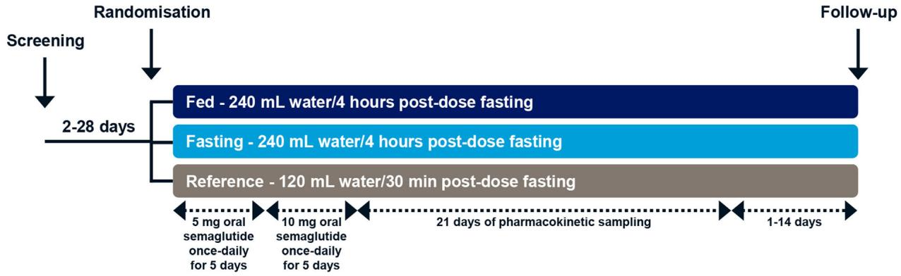
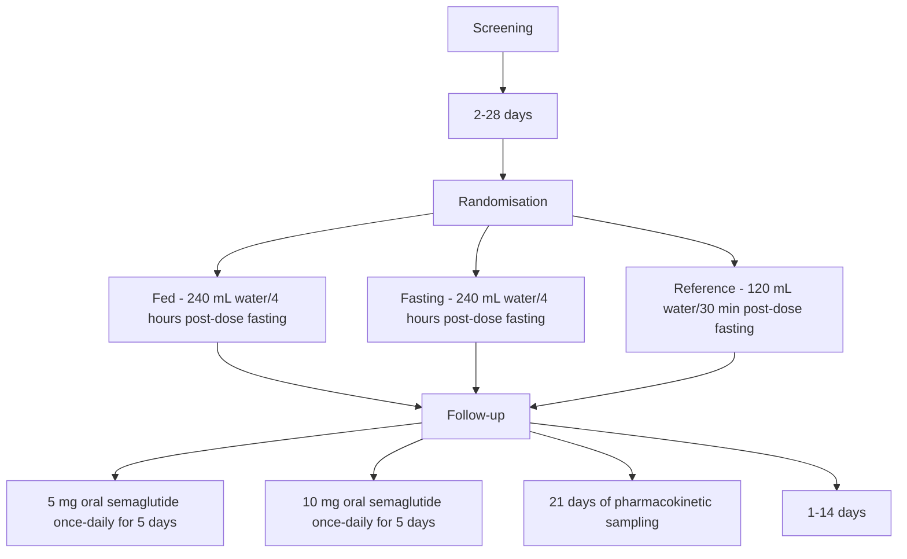
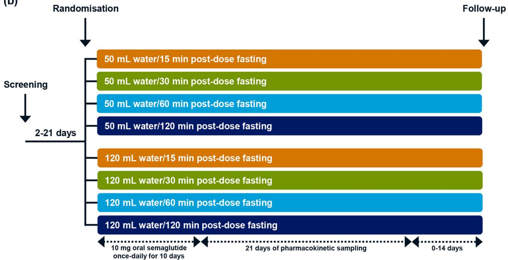
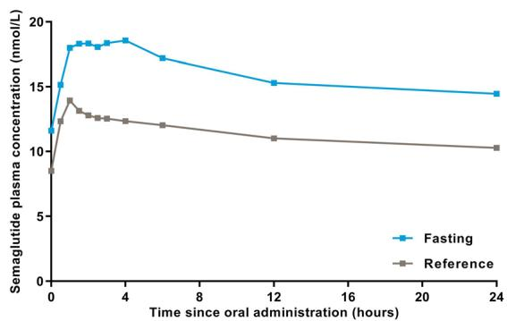
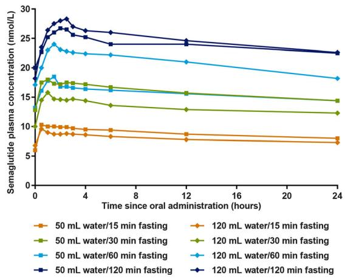
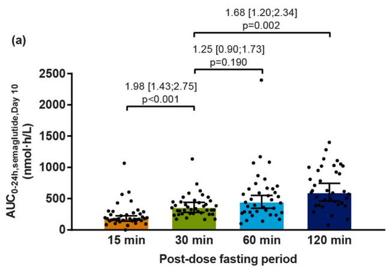
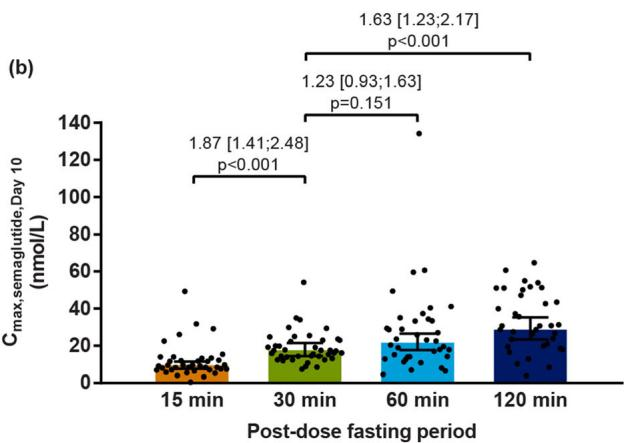
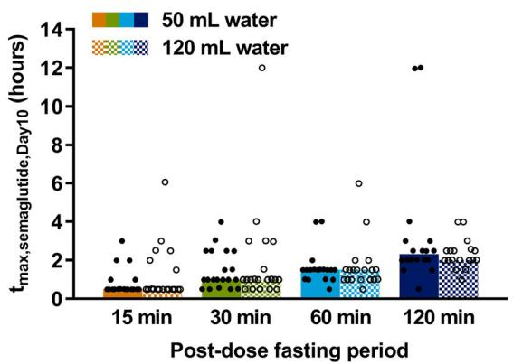

ORIGINAL RESEARCH

# Effect of Various Dosing Conditions on the Pharmacokinetics of Oral Semaglutide, a Human Glucagon-Like Peptide-1 Analogue in a Tablet Formulation

Tine A. Bækdal . Astrid Breitschaft . Morten Donsmark .

Stine J. Maarbjerg . Flemming L. Søndergaard . Jeanett Borregaard

Received: March 26, 2021 / Accepted: May 10, 2021 / Published online: June 2, 2021 - The Author(s) 2021

# ABSTRACT

Introduction: Oral semaglutide is a novel tablet formulation of the human glucagon-like peptide-1 analogue semaglutide. In two trials, the effects of prior food ingestion (food effect), post-dose fasting period and water volume with dosing (dosing conditions) on oral semaglutide pharmacokinetics were investigated.

Methods: Subjects received once-daily oral semaglutide for 10 days. In the food-effect trial, 78 healthy subjects were randomised 1:1:1 to fed (meal 30 min pre-dose; 240 mL water with dosing), fasting (overnight until 4 h post-dose; 240 mL) or reference (fasting overnight until 30 min post-dose; 120 mL) arms. In the dosing conditions trial, 161 healthy men were

Supplementary Information The online version contains supplementary material available at https:// doi.org/10.1007/s13300-021-01078-y.

T. A. Bækdal (&) - M. Donsmark - S. J. Maarbjerg -

J. Borregaard

Novo Nordisk A/S, Vandta˚rnsvej 114, 2860 Søborg, Denmark

e-mail: tabq@novonordisk.com

A. Breitschaft

Early Phase Clinical Unit - Berlin, Parexel

International GmbH, Klinikum Westend - Haus 18,

Spandauer Damm 130, 14050 Berlin, Germany

F. L. Søndergaard

Novo Nordisk A/S, Alfred Nobels Vej 27, 9220

Aalborg Ø, Denmark

randomised into eight dosing groups (overnight fasted with 50/120 mL water and 15/30/60/ 120 min post-dose fasting). Semaglutide plasma concentrations were measured frequently until 504 h after the 10th dose.

Results: In the food-effect trial, limited or no measurable semaglutide exposure was observed in the fed arm, while all subjects in the fasting arm had measurable semaglutide exposure. Area under the semaglutide concentration–time curve $( \mathrm { A U C _ { 0 - 2 4 h , s e m a g l u t i d e , d a y 1 0 } } )$ and maximum semaglutide concentration (Cmax,semaglutide,day10) were numerically greater by approximately 40% for the fasting versus reference arm $( p = 0 . 0 8 2$ and $p = 0 . 0 8 0$ , respectively). In the dosing conditions trial, $\mathrm { A U C } _ { 0 - 2 4 \mathrm { h } }$ ,semaglutide,day10 and Cmax,semaglutide,day10 were not different between water volumes $( p = 0 . 5 4 1$ and $p = 0 . 6 7 6 )$ , but increased with longer post-dose fasting $( p < 0 . 0 0 1 )$ ).

Conclusion: Administration of oral semaglutide in the fasting state with up to 120 mL water and at least 30 min post-dose fasting results in clinically relevant semaglutide exposure. These dosing conditions have been used in the oral semaglutide phase 3 trials and are part of the approved label.

Trial Registration: ClinicalTrials.gov identifiers NCT02172313, NCT01572753.

Keywords: Dosing conditions; Food effect; Glucagon-like peptide-1; Oral semaglutide;

Pharmacokinetics; Sodium N-(8-[2-hydroxybenzoyl] amino) caprylate

# Key Summary Points

# Why carry out this study?

Oral semaglutide is a novel tablet formulation of the human glucagon-like peptide-1 analogue semaglutide, coformulated with the absorption enhancer sodium N-(8-[2-hydroxybenzoyl] amino) caprylate (SNAC).

The effects of prior food ingestion, water volume with dosing and post-dose fasting period on oral semaglutide pharmacokinetics were investigated in two trials.

# What was learned from the study?

Semaglutide exposure is limited when oral semaglutide administration occurs in the fed state, semaglutide exposure increases with longer post-dose fasting periods up to 120 min, particularly so from 15 to 30 min, and administration of the oral semaglutide tablet with 50 and 120 mL water provides comparable semaglutide exposure.

On the basis of these results, patients should administer oral semaglutide in the fasting state with up to 120 mL water and wait at least 30 min post-dose before eating.

# DIGITAL FEATURES

This article is published with digital features, including a summary slide, to facilitate understanding of the article. To view digital features for this article go to https://doi.org/10.6084/ m9.figshare.14561904.

# INTRODUCTION

Glucagon-like peptide-1 receptor agonists (GLP-1 RAs) are successfully used in the treatment of type 2 diabetes mellitus, improving glycaemic control with low risk of hypoglycaemia and inducing weight loss [1, 2]. While currently available GLP-1 RAs must be injected subcutaneously, oral administration may lead to earlier GLP-1 RA treatment initiation, and may improve acceptance and adherence for some patients [3, 4]. However, oral administration of peptide-based drugs is challenged by their degradation in the stomach due to low pH and proteolytic enzymes, and by their limited permeability across the gastrointestinal epithelium [4, 5].

Oral semaglutide is a novel tablet formulation of the human GLP-1 analogue semaglutide, co-formulated with the absorption enhancer sodium N-(8-[2-hydroxybenzoyl] amino) caprylate (SNAC). This provides the first GLP-1 RA for oral administration. Semaglutide is 94% structurally homologous to human GLP-1, but has important modifications to achieve a longer half-life of approximately 1 week [6, 7]. SNAC protects against proteolytic degradation of semaglutide molecules in the gastrointestinal tract through a localised increase in pH, and facilitates semaglutide absorption across the gastric epithelium primarily via the transcellular route [8].

Food can influence the absorption of orally administered drugs [9]. Accordingly, it is important to investigate the effect of food on absorption of new drugs intended for oral administration [10, 11]. Food ingestion up to 4 h prior to oral dosing substantially reduced the oral bioavailability of salmon calcitonin coformulated with another absorption enhancer, 8-(N-2-hydroxy-5-chlorobenzoyl)aminocaprylic acid (5-CNAC) [12]. Furthermore, extending the post-dose fasting period from 10 or 15 min up to 30 min increased the absorption of both oral salmon calcitonin (by approximately 30%) and ibandronate co-formulated with SNAC (by approximately twofold) [13, 14]. Another related aspect is whether drug absorption is influenced by the water volume taken with the tablet. Absorption of oral salmon calcitonin was reduced by approximately 50% when administered with 200 versus 50 mL of water [13].

The overall purpose of the current investigation was to establish dosing recommendations for oral semaglutide to ensure clinically relevant semaglutide exposure with an acceptable safety profile without compromising compliance in patients’ daily life. Results from two consecutive trials are presented demonstrating how the pharmacokinetics of oral semaglutide are affected (1) by different combinations of water volume with dosing and duration of postdose fasting (the dosing conditions trial) and (2) by dosing in the fed state (the food-effect trial). In the food-effect trial, two of the investigated dosing conditions (fed and fasting) were according to guidelines on the investigation of food effect [10, 11], while a third arm (reference) was included in which dosing conditions reflected those used in the oral semaglutide phase 2 and 3 clinical trials [15–19].

# METHODS

# Trial Design

Both trials were randomised, open-label, parallel-group, single-centre (Parexel, Berlin, Germany) trials (Fig. 1). The protocols and the subject information/informed consent forms were reviewed and approved by an independent ethics committee (Ethik-Kommission des Landes Berlin) and by appropriate health authorities according to local regulations. The trials were conducted in accordance with the Declaration of Helsinki and its later amendments and the International Conference on Harmonisation Good Clinical Practice. All subjects provided written informed consent prior to any trial-related activities. The trials were registered at ClinicalTrials.gov (trial identifiers NCT02172313 and NCT01572753). A minor part of the current results has been published previously [8].

# Participants

In the food-effect trial, eligible subjects were healthy men and women, aged 18–75 years with a BMI of 18.5–29.9 kg/m2 . In the dosing conditions trial, eligible subjects were healthy men, aged 18–55 years with a BMI of 18.5–30.0 kg/m2 .

Subjects were excluded if they had clinically significant concomitant diseases or disorders, clinically significant abnormal values in clinical laboratory screening tests, any history of gastrointestinal surgery, had used any prescription or non-prescription drugs within 3 weeks prior to dosing of trial product (except hormone replacement therapy, contraceptives and occasional use of paracetamol in the food-effect trial), were smokers (dosing conditions trial) or were not able or willing to refrain from smoking while staying at the clinic (food-effect trial), or if they were pregnant or breastfeeding women (food-effect trial).

# Procedures

Both trials included a screening visit, a treatment period with 10 days of once-daily dosing of oral semaglutide tablets (co-formulated with 300 mg SNAC), a 21-day pharmacokinetic blood sampling period, and a follow-up visit (Fig. 1). Trial product administration occurred each morning at the clinic to ensure that dosing conditions were followed on all 10 dosing days.

In the food-effect trial, subjects were randomised into three groups: fed, fasting or reference. The oral semaglutide dose was escalated from 5 mg during the first 5 days to 10 mg during the last 5 days in order to mitigate the risk of gastrointestinal adverse events (AEs). In both the fed and fasting groups, subjects initiated an overnight fast at least 10 h before oral semaglutide dosing with 240 mL water. In the fed group, after the overnight fast, subjects consumed a high-caloric, high-fat breakfast (4058 kJ, 27 energy percent [E%] carbohydrate, 60 E% fat and 13 E% protein) within the last 30 min before dosing. In the fasting group, no pre-dose meal was served. In both the fed and fasting groups, dosing was followed by 4-h postfasting arm were fasting overnight for at least 10 h before each dosing, and subjects in the reference arm were fasting overnight for at least 6 h before each dosing. In the dosing conditions trial, subjects were fasting overnight for at least 8 h before each dosing

(a)   

flowchart

(b)   

bar

| Time Period | Post-Dose Fasting (mL) |
| :--- | :--- |
| 50 mL water/15 min post-dose fasting | 50 |
| 50 mL water/30 min post-dose fasting | 50 |
| 50 mL water/60 min post-dose fasting | 50 |
| 50 mL water/120 min post-dose fasting | 50 |
| 120 mL water/15 min post-dose fasting | 120 |
| 120 mL water/30 min post-dose fasting | 120 |
| 120 mL water/60 min post-dose fasting | 120 |
| 120 mL water/120 min post-dose fasting | 120 |

Fig. 1 Trial design of a the food-effect trial (effect of prior food ingestion) and b the dosing conditions trial (effect of water volume and post-dose fasting). In the food-effect trial, subjects in the fed arm were fasting overnight for at least 10 h before ingesting a high-fat, high-caloric breakfast during the last 30 min prior to each dosing. Subjects in the

dose fasting after which a standardised postdose meal (2335 kJ, 49 E% carbohydrate, 34 E% fat and 17 E% protein) was served. In the reference group, subjects fasted overnight for at least 6 h before oral semaglutide dosing with 120 mL water. This was followed by 30-min post-dose fasting after which a standardised breakfast (2335 kJ, 49 E% carbohydrate, 34 E% fat and 17 E% protein) was served. In all three groups,

subjects were in an upright position during the first 30 min after dosing, and no further liquid was allowed from 2 h before dosing until 30 min (reference) or 4 h (fed and fasting) after dosing, with no subsequent restrictions on liquid or food ingestion until the next pre-dose fasting period.

In the dosing conditions trial, subjects were randomised into eight treatment groups, in which 10 mg oral semaglutide was administered once-daily for 10 days with either 50 or 120 mL water, and the duration of post-dose fasting was either 15, 30, 60 or 120 min. On each dosing day, subjects fasted overnight for at least 8 h before oral semaglutide dosing followed by either 15, 30, 60 or 120 min post-dose fasting until ingestion of a standardised breakfast (2335 kJ, 49 E% carbohydrate, 34 E% fat and 17 E% protein) including 250 mL liquid. Subjects were in a seated position during the first 2 h after dosing. No further liquid was allowed from 2 h before until 2 h after dosing, with no subsequent restrictions on liquid or food ingestion until the next pre-dose fasting period.

In both trials, during the 10-day treatment period, subjects should not have consumed alcohol, liquids or food containing poppy seeds, grapefruit (dosing conditions trial), caffeine or other xanthines, changed their exercise pattern or daily routines (dosing conditions trial) or performed strenuous physical exercise (food-effect trial).

Blood samples for determination of semaglutide and SNAC concentrations in plasma were drawn before and frequently after the 10th dose (Supplementary Table S1).

Subjects were always assigned the lowest available randomisation number. Allocation to a dosing condition was done by qualified staff at the clinical site and was not revealed before a subject was randomised. In the food-effect trial, stratification ensured that approximately equal numbers of men and women were randomised to each of the three groups.

# Assessments

Semaglutide and SNAC were measured by means of validated assays using plasma protein precipitation followed by liquid chromatography with tandem mass spectrometry detection as described previously [20]. The lower limit of quantification (LLOQ) was 0.73 nmol/L for semaglutide and 5.0 ng/mL for SNAC.

Safety assessments included AEs, hypoglycaemic episodes, laboratory safety parameters, physical examination, vital signs and ECG. Hypoglycaemic episodes were defined as ‘confirmed’ when they were either ‘severe’ according to the American Diabetes Association definition, i.e. requiring third party assistance [21], or verified by a plasma glucose level of less than 3.1 mmol/L.

# Endpoints

All pharmacokinetic endpoints were derived after the 10th oral semaglutide dose. Area under the semaglutide plasma concentration–time curve from 0 to 24 h (AUC0–24h,semaglutide,day10; primary endpoint in both trials) was determined using a non-compartmental method and applying the trapezoidal rule on observed concentrations and actual sampling time points. Maximum semaglutide plasma concentration (Cmax,semaglutide,day10) and time to maximum semaglutide plasma concentration (tmax,semaglu-) were derived from the observed pharmacokinetic profiles. The terminal half-life of semaglutide (t1/2,semaglutide,day10) was calculated as ln $( 2 ) / \lambda _ { z } ,$ where the terminal elimination rate constant, $\lambda _ { z } ,$ was estimated by log-linear regression on the terminal part of the pharmacokinetic profiles. The pharmacokinetic endpoints for SNAC, AUC0–6h,SNAC,day10 (dosing conditions trial), $\mathrm { A U C _ { 0 - 2 4 h , S N A C , d a y 1 0 } }$ (food-effect trial), $C _ { \mathrm { m a x , S N A C , d a y 1 0 } }$ and tmax,SNAC,day10 were derived as described above for semaglutide endpoints.

# Statistical Analyses

All statistical analyses were performed using SAS versions 9.3 or 9.4 (SAS Institute, Cary, NC, USA). Statistical tests were two-sided with 5% significance level and based on the full analysis set consisting of all randomised subjects receiving at least one dose of trial product. The planned analysis of the primary endpoint in the food-effect trial comparing fed and fasting groups was controlled for type 1 error. Other analyses were not controlled for multiplicity.

In the food-effect trial, the sample size was determined on the basis of the precision of the ratio of $\mathrm { A U C _ { 0 } }$ –24h,semaglutide,day10 between fed and fasting groups. On the basis of the dosing conditions trial, which was completed at the time of planning the food-effect trial, it was assumed that the standard deviation for the logtransformed AUC0–24h,semaglutide,day10 was 0.60. A total of 24 subjects with evaluable pharmacokinetic profiles would then result in a probability of at least 80% to obtain a 95% CI for the ratio of fed/fasting groups lying within the range of 0.68–1.46 times the estimated mean ratio. This range was assessed to be sufficiently narrow. In order to account for withdrawn subjects, it was planned to randomise 26 subjects per group (i.e. 78 subjects in total).

In the dosing conditions trial, the sample size determination was based on the precision of the ratio of AUC0–24h,semaglutide,day10 between any two of the eight groups. It was assumed that the standard deviation of the log-transformed AUC0–24h,semaglutide,day10 was 0.72 (based on a previous trial with oral semaglutide). With 18 evaluable pharmacokinetic profiles per group, it was possible to detect a twofold difference between two groups with 80% power. In order to account for withdrawn subjects, it was planned to randomise 20 subjects per group (i.e. 160 subjects in total).

In the food-effect trial, AUC0–24h,semaglutide,day10 (primary endpoint), Cmax,semaglutide,day10, AUC0–24h,SNAC,day10 and Cmax,SNAC,day10 were log-transformed and compared between fed (only SNAC endpoints), fasting and reference groups in linear normal models with group and sex as fixed factors. Before database lock, it was decided to exclude the fed group from the semaglutide statistical analyses, since all plasma semaglutide concentrations were below the LLOQ in a substantial number of subjects in this group.

In the dosing conditions trial, AUC0–24h,semaglutide,day10 (primary endpoint), Cmax,semaglutide,day10, AUC0–6h,SNAC,day10 and Cmax,SNAC,day10 were log-transformed and analysed in linear normal models with post-dose fasting period, water volume and an interaction between post-dose fasting period and water volume as fixed factors. There were no statistically significant interactions between the effects of post-dose fasting period and water volume, and there were no effects of water volume (see ‘‘Results’’). Therefore, the effect of post-dose fasting period was further investigated in post hoc statistical analyses with post-dose fasting period as the only fixed effect and combining the data on the two different water volumes. In one subject in the 50 mL/15 min group, all semaglutide plasma concentrations were below LLOQ after the 10th oral semaglutide dose. Therefore, a value of 0.5 9 LLOQ multiplied with the arithmetic mean of tmax,semaglutide,day10 for all other subjects was imputed for AUC0–24h,semaglutide,day10, while 0.5 9 LLOQ was imputed for Cmax,semaglutide,day10 before statistical analysis.

In both trials, tmax,semaglutide,day10, t1/2,semaglutide,day10 and tmax,SNAC,day10 were described by summary statistics.

Safety endpoints were summarised by descriptive statistics including all subjects receiving at least one dose of trial product (the safety analysis set).

# RESULTS

# Subject Disposition and Characteristics

In the food-effect trial, 116 subjects were screened, 78 were enrolled, randomised and exposed, and 77 completed the trial (Supplementary Fig. S1). All 78 exposed subjects were included in the safety analysis set and the full analysis set. In the dosing conditions trial, 306 subjects were screened, 161 were enrolled and randomised, 158 exposed and 151 completed the trial (Supplementary Fig. S2). All 158 exposed subjects were included in the safety analysis set and the full analysis set. Details on withdrawn subjects are provided in Supplementary Figs. S1 and S2.

Subject characteristics overall for each of the two trials are shown in Table 1. Subject characteristics per treatment group in the two trials are shown in Supplementary Tables S2 and S3, respectively.

# Semaglutide Pharmacokinetics

In the fed group in the food-effect trial, no measurable semaglutide exposure was observed in 14 of 25 subjects and only limited semaglutide exposure was observed in the remaining 11 subjects. Therefore, semaglutide pharmacokinetic results in the fed group were excluded from further statistical analysis. In the fasting group, all subjects had measurable semaglutide exposure.

Table 1 Subject characteristics 

<table><tr><td></td><td>Food-effect trialEffect of prior food ingestionN = 78</td><td>Dosing conditions trialEffect of water volume and post-dose fastingN = 158</td></tr><tr><td>Age, years</td><td>55.1 (13.9)</td><td>40.5 (9.7)</td></tr><tr><td>Sex</td><td></td><td></td></tr><tr><td>Female, N (%)</td><td>39 (50.0)</td><td>0 (0.0)</td></tr><tr><td>Male, N (%)</td><td>39 (50.0)</td><td>158 (100.0)</td></tr><tr><td>Race</td><td></td><td></td></tr><tr><td>White, N (%)</td><td>74 (94.9)</td><td>156 (98.7)</td></tr><tr><td>Black or African American, N (%)</td><td>3 (3.8)</td><td>1 (0.6)</td></tr><tr><td>Asian, N (%)</td><td>1 (1.3)</td><td>0 (0.0)</td></tr><tr><td>Other, N (%)</td><td>0 (0.0)</td><td> $1^a$ (0.6)</td></tr><tr><td>Body weight, kg</td><td>73.5 (12.2)</td><td>82.1 (9.9)</td></tr><tr><td>Height, m</td><td>1.72 (0.09)</td><td>1.80 (0.07)</td></tr><tr><td>BMI,  $kg/m^2$ </td><td>24.8 (2.6)</td><td>25.2 (2.4)</td></tr></table>

Data are mean (standard deviation) unless otherwise stated BMI body mass index; N number of subjects   
a Mixed race (Caucasian and African)

The reference group in the food-effect trial was compared to the guideline defined dosing conditions of the fasting group (Fig. 2 and Supplementary Fig. S3). Both AUC0–24h,semaglutide,day10 and Cmax,semaglutide,day10 appeared approximately 40% greater for the fasting group versus reference, although not statistically significant. Median tmax,semaglutide,day10 appeared longer for the fasting group (1.75 h) versus reference (1.00 h), while no apparent difference between fasting and reference groups was seen for $t _ { 1 / 2 }$ ,semaglutide,day10 (160 and 152 h, respectively) (Supplementary Table S4).

The effects of water volume with dosing and duration of post-dose fasting on semaglutide exposure were investigated in the dosing conditions trial (Fig. 3). There was no statistically significant interaction between the effects of water volume and post-dose fasting period for AUC0–24h,semaglutide,day10 and Cmax,semaglutide,day10 $( p = 0 . 5 3 0$ and $p = 0 . 3 9 4 ,$ , respectively). Furthermore, $\mathrm { A U C _ { 0 } }$ –24h,semaglutide,day10 and Cmax,semaglutide,day10 did not differ statistically significantly between the two water volumes $( p = 0 . 5 4 1$ and $p = 0 . 6 7 6$ , respectively). Therefore, the effect of post-dose fasting period was further investigated in post hoc statistical analyses with post-dose fasting period as the only fixed effect and combining the data on the two different water volumes (Fig. 4). It was shown that $\mathrm { A U C _ { 0 } }$ –24h,semaglutide,day10 and Cmax,semaglutide,day10 increased statistically significantly with longer post-dose fasting $( p < 0 . 0 0 1$ for both). Figure 4 shows the pairwise comparisons of 30 min postdose fasting with the shorter and longer postdose fasting periods. As shown in Fig. 5, tmax,semaglutide,day10 did not change with water volume, but increased with longer post-dose fasting. Water volume and post-dose fasting period had no apparent effect on $t _ { 1 / 2 }$ ,semaglutide,- day10 (geometric means ranged from 150 to 159 h).

line

| Time since oral administration (hours) | Fasting (nmol/L) | Reference (nmol/L) |
| -------------------------------------- | ---------------- | ------------------ |
| 0                                      | 12               | 9                  |
| 2                                      | 18               | 13                 |
| 4                                      | 18               | 12                 |
| 6                                      | 17               | 12                 |
| 12                                     | 15               | 11                 |
| 24                                     | 14               | 10                 |

Fig. 2 Geometric mean semaglutide plasma concentration–time profiles for fasting and reference treatment arms on day 10 of once-daily dosing of oral semaglutide in healthy subjects (food-effect trial). n = 26 per treatment arm

line

| Time since oral administration (hours) | 50 mL water/15 min fasting | 120 mL water/15 min fasting | 50 mL water/30 min fasting | 120 mL water/30 min fasting | 50 mL water/60 min fasting | 120 mL water/60 min fasting | 50 mL water/120 min fasting | 120 mL water/120 min fasting |
|---|---|---|---|---|---|---|---|---|
| 0 | 6 | 18 | 13 | 14 | 19 | 20 | 18 | 27 |
| 2 | 9 | 10 | 17 | 15 | 24 | 23 | 26 | 28 |
| 4 | 9 | 9 | 17 | 14 | 23 | 22 | 25 | 26 |
| 8 | 9 | 8 | 16 | 13 | 22 | 21 | 24 | 25 |
| 12 | 8 | 8 | 15 | 13 | 21 | 20 | 24 | 24 |
| 24 | 8 | 8 | 14 | 13 | 18 | 19 | 23 | 23 |

Fig. 3 Geometric mean semaglutide plasma concentration–time profiles on day 10 of once-daily dosing of oral semaglutide in healthy male subjects (dosing conditions trial). n = 18 (50 mL; 15 min), n = 20 (50 mL; 30 min), n = 18 (50 mL; 60 min), n = 18 (50 mL; 120 min), n = 19 (120 mL; 15 min), n = 20 (120 mL; 30 min), n = 19 (120 mL; 60 min) or n = 18 (120 mL; 120 min)

# SNAC Pharmacokinetics

SNAC exposure in the fed, fasting and reference groups in the food-effect trial is shown in Supplementary Figs. S4 and S5. SNAC was generally rapidly absorbed and eliminated, with no measurable exposure after approximately 4–6 h. AUC0–24h,SNAC,day10 was 16–17% greater in the fasting versus the fed and reference groups. $C _ { \mathrm { m a x , S N A C , d a y 1 0 } }$ appeared to increase from fed to fasting to reference groups; however, the only statistically significant treatment difference was an approximately 80% greater $C _ { \mathrm { m a x , S N A C , d a y 1 0 } }$ in the reference versus the fed group. The median $t _ { \mathrm { m a x , S N A C , d a y 1 0 } }$ was longer in the fed versus the fasting and reference groups (2.0 versus 0.5 and 0.7 h, respectively).

The effects of water volume and post-dose fasting on SNAC exposure in the dosing conditions trial are shown in Supplementary Figs. S6 and S7. For $\mathrm { A U C _ { 0 } }$ –6h,SNAC,day10 and $C _ { \mathrm { m a x , S N A C , d a y 1 0 } } ,$ there was no statistically significant interaction between the effects of water volume and post-dose fasting $( p = 0 . 6 0 9$ and $p = 0 . 7 3 2$ , respectively) and no statistically significant change with water volume $( p = 0 . 3 9 6$ and $\begin{array} { r } { p = 0 . 8 4 8 } \end{array}$ , respectively). In post hoc statistical analyses with duration of post-dose fasting as the only fixed factor, the overall effect of post-dose fasting period was statistically significant for both $\mathrm { A U C _ { 0 } }$ –6h,SNAC,day10 and $C _ { \mathrm { m a x , S N A C , d a y 1 0 } }$ $( p < 0 . 0 0 1$ for both). A post-dose fasting period of 120 min versus 30 min led to lower SNAC exposure (Supplementary Fig. S7). Median tmax,SNAC,day10 ranged from 0.4 to 0.7 h for the eight dosing conditions and appeared to be independent of water volume and post-dose fasting period.

# Safety

In the food-effect trial, 167 AEs were reported in 50 subjects (64%). The most frequently reported AEs were gastrointestinal disorders (19%, 50% and 27% of subjects in the fed, fasting and reference groups, respectively) and headache (15%, 38% and 35%). Almost all AEs were mild (135 events) or moderate (31 events), while one AE in the fasting group was severe (headache on day 6; assessed as possibly related to trial product by the investigator; the subject recovered after 2 days). No serious AEs were reported in the food-effect trial. One subject in the fed group was withdrawn because of an AE (bacterial infection of the lower left arm on day 3; the subject recovered after 3 days).

bar

| Post-dose fasting period | AUC0-24h,semaglutide,Day 10 (nmol·h/L) |
| ------------------------ | -------------------------------------- |
| 15 min                   | ~200                                   |
| 30 min                   | ~400                                   |
| 60 min                   | ~600                                   |
| 120 min                  | ~800                                   |

Fig. 4 Effect of post-dose fasting period on a AUC0–24h,semaglutide,day10 and b $C _ { \mathrm { m a x , s e m a g l u t i d e , d a y 1 0 } }$ following 10 days of once-daily dosing of oral semaglutide in healthy male subjects (dosing conditions trial). Data are from post hoc statistical analyses with post-dose fasting period as the only fixed effect (i.e. data on the two groups with different water volumes were combined). The overall effect of post-dose fasting period was statistically significant for both AUC0–24h,semaglutide,day10 $\left( \phi < 0 . 0 0 1 \right)$ and Cmax,semaglutide,day10 $\left( \phi < 0 . 0 0 1 \right)$ ). Bars are estimated means and 95% CIs. Black dots show individual values.

scatter

| Post-dose fasting period | Cmax, semaglutide, Day 10 (nmol/L) |
| ------------------------ | ---------------------------------- |
| 15 min                   | ~10                                |
| 30 min                   | ~20                                |
| 60 min                   | ~25                                |
| 120 min                  | ~30                                |

Treatment comparisons show estimated treatment ratios [95% CI] and $\boldsymbol { \mathscr { P } }$ value for the pairwise comparisons of 30 min post-dose fasting with the shorter and longer postdose fasting periods. Endpoints were analysed on logarithmic scale but are presented on linear scale. $\varkappa = 3 8$ (15 min), $\varkappa = 4 0$ (30 min), $n = 3 7$ (60 min) or $\varkappa = 3 6$ (120 min). AUC area under the curve, CI confidence interval, $C _ { \mathrm { m a x } }$ maximum concentration

bar

| Post-dose fasting period | 50 mL water | 120 mL water |
| ------------------------ | ----------- | ------------ |
| 15 min                   | ~0.5        | ~0.5         |
| 30 min                   | ~1.0        | ~1.0         |
| 60 min                   | ~1.5        | ~1.5         |
| 120 min                  | ~2.0        | ~2.0         |

Fig. 5 Effect of water volume with dosing and post-dose fasting period on $t _ { \mathrm { m a x , s e m a g l u t i d e , d a y 1 0 } }$ following 10 days of once-daily dosing of oral semaglutide in healthy male subjects (dosing conditions trial). Bars are median values. Black dots/circles show individual values. $\varkappa = 1 8$ (50 mL; 15 min), $\varkappa = 2 0$ (50 mL; 30 min), n = 18 (50 mL; 60 min), n = 18 (50 mL; 120 min), n = 19 (120 mL; 15 min), $n = 2 0$ (120 mL; 30 min), $\varkappa = 1 9$ (120 mL; 60 min) or n = 18 (120 mL; 120 min). $t _ { \mathrm { m a x } }$ time to maximum concentration

In the dosing conditions trial, 599 AEs were reported in 134 subjects (85%). The most frequently reported AEs were gastrointestinal disorders (61% of subjects), which increased in frequency with longer post-dose fasting periods and thus with higher semaglutide exposure. The majority of AEs were mild (470 events) or moderate (128 events). One AE in the 50 mL/ 60 min group was severe and also serious (acute gastritis on day 16, i.e. 6 days after end of treatment; unlikely related to trial product; the subject recovered after 2 days). A total of four subjects were withdrawn because of AEs occurring after being exposed to trial product (two subjects in the 120 mL/120 min group; one subject in each of the 50 mL/15 min and 50 mL/ 60 min groups). All were due to gastrointestinal disorders occurring within the first 3 days of dosing.

No severe or confirmed hypoglycaemic episodes were reported in the two trials and there were no clinically relevant observations related to vital signs, physical examination, electrocardiogram or laboratory safety parameters, except temporary asymptomatic increases in lipase levels in two subjects at follow-up in the dosing conditions trial (from 46 U/L at screening to 231 U/L at follow-up and from 59 U/L at screening to 378 U/L at follow-up [normal range 13–60 U/L]). After 7 days, lipase levels had decreased to 59 and 109 U/L, respectively.

# DISCUSSION

The key findings from the two reported trials were that administration of oral semaglutide in the fed state resulted in limited semaglutide exposure, that semaglutide exposure increased with longer post-dose fasting periods, particularly from 15 to 30 min, and that semaglutide exposure was comparable when the oral semaglutide tablet was administered with 50 or 120 mL water.

The current findings that dosing of oral semaglutide in the fed state limited the absorption of semaglutide [8] and that a short post-dose fasting period reduced the absorption of semaglutide are in alignment with previous results for salmon calcitonin co-formulated with 5-CNAC and ibandronate co-formulated with SNAC [13, 14]. Furthermore, we found that an earlier post-dose meal was associated with shorter tmax,semaglutide,day10, indicating that the semaglutide absorption phase was disrupted by the post-dose meal. Thus, the present results suggest that food ingestion prior to as well as shortly after oral semaglutide administration should be avoided in order to achieve sufficient semaglutide plasma exposure. On the basis of the results from the dosing conditions trial, semaglutide plasma exposure is similar when oral semaglutide is administered with 120 versus 50 mL water. Still, another study found that semaglutide exposure was reduced by approximately 40% when administered with 240 versus 50 mL water [22], suggesting that greater than 120 mL water with dosing may negatively influence the absorption of oral semaglutide. Interestingly, t1/2,semaglutide,day10 was approximately 1 week in all treatment arms of the two current trials, showing that in contrast to absorption, the metabolism and elimination of semaglutide are not affected by food ingestion or water volume with dosing as expected.

The present pharmacokinetic results need to be weighed against patient convenience and adherence, especially as oral semaglutide is indicated for long-term once-daily dosing. Consequently, in phase 2 and 3 trials with oral semaglutide, the recommendation was to administer oral semaglutide in the fasting state with up to 120 mL water and wait at least 30 min post-dose before eating or taking any other oral medications. Using these recommendations, oral semaglutide treatment in subjects with type 2 diabetes resulted in improved glycaemic control and weight loss compared with placebo, empagliflozin and sitagliptin [15–19]. As a note, the well-established drug levothyroxine for treatment of hypothyroidism is also conventionally taken in the fasting condition at least 30 min before breakfast to prevent that food intake negatively impairs the absorption [23]. Thus, the recommended dosing conditions for oral semaglutide are not considered to pose an undue burden to the patients.

In the current trials, SNAC pharmacokinetic endpoints after administration of oral semaglutide in the fasted state were generally in accordance with a previous study investigating the pharmacokinetics after oral administration of ibandronate co-formulated with SNAC [24]. While no effect of water volume with dosing on SNAC pharmacokinetics was observed, interestingly, SNAC exposure increased when shortening the post-dose fasting period from 120 to 30 min in the dosing conditions trial (Supplementary Fig. S7). This indicates that food can increase the absorption of SNAC, thereby potentially resulting in less SNAC being available to facilitate absorption of semaglutide at the site of absorption. The same clear pattern was, however, not observed in the food-effect trial, as SNAC exposure was not increased in the fed arm. In the food-effect trial, SNAC absorption also appeared to increase following the post-dose meal, particularly at the 4-h meal in the fed and fasting arms (Supplementary Fig. S4). This observation was less obvious in the dosing conditions trial probably because of less frequent pharmacokinetic sampling around the time of the post-dose meal (Supplementary Table 1).

There were no unexpected safety findings in the two trials, and the safety profile of oral semaglutide was consistent with the GLP-1 RA drug class. The slightly higher number of AEs in the dosing conditions trial compared with the food-effect trial, particularly gastrointestinal AEs, may be explained by the difference in dosing regimen between the two trials. In the dosing conditions trial, subjects received 10 mg oral semaglutide on all 10 days of treatment. On the basis of learnings from that trial, the oral semaglutide dose in the subsequent food-effect trial was gradually increased from 5 mg during the first 5 days to 10 mg during the last 5 days to mitigate the risk of gastrointestinal AEs. Stepwise dose escalation was also applied in the phase 2 and 3 trials with oral semaglutide, leading to fewer events of nausea [15–19].

A strength of the two trial designs was that several different dosing conditions were tested in a controlled setting, thereby gaining a better understanding of potential food–drug interactions for oral semaglutide in order to establish acceptable dosing instructions for oral semaglutide. Another strength was that all doses of oral semaglutide were administered at the clinic, thereby optimising compliance to the specified dosing conditions.

A limitation of the current trials is that translation to clinical practice should be made with caution, as is always the case for results obtained in an experimental setting. Another limitation is that the pharmacokinetic assessments on the 10th day of dosing in the current trials do not fully reflect the steady-state situation achieved with continuous once-daily dosing in the clinical setting because of the long half-life of approximately 1 week for oral semaglutide. On the other hand, regulatory guidelines recommend that the effect of food is investigated in a single-dose trial [10, 11]. This option, however, would not be feasible for oral semaglutide because of the degree of withinsubject day-to-day variability in absorption. During once-daily dosing of oral semaglutide, the within-subject day-to-day variability in exposure is reduced owing to overlapping exposure from sequential daily administrations as a result of the long half-life of oral semaglutide. Thus, 10 days of dosing in a parallel-group design as done in the two current trials was assessed to be the best possible compromise considering both clinical feasibility and regulatory guideline recommendations.

# CONCLUSIONS

On the basis of the combined results of the current food-effect and dosing conditions trials with oral semaglutide, it is concluded that administration of oral semaglutide in the fasting state with up to 120 mL water and at least 30 min post-dose fasting results in clinically relevant semaglutide plasma exposure. These dosing recommendations were implemented in the phase 3 clinical development programme for oral semaglutide and are part of the approved label [25, 26].

# ACKNOWLEDGEMENTS

Funding. This study and the Journal’s Rapid Service Fee were funded by Novo Nordisk.

Medical Writing and Editorial Assistance. The authors would like to thank Carsten Roepstorff, PhD, CR Pharma Consult, Copenhagen, Denmark for providing medical writing support, which was funded by Novo Nordisk.

Authorship. All named authors meet the International Committee of Medical Journal Editors (ICMJE) criteria for authorship for this article, take responsibility for the integrity of the work as a whole, and have given their approval for this version to be published.

Authorship Contributions. SJM, JB and TAB contributed with study conception, study design, data interpretation, critical manuscript revision and final manuscript approval. MD contributed with data interpretation, critical manuscript revision and final manuscript approval. FLS contributed with study conception, study design, data analysis, data interpretation, critical manuscript revision and final manuscript approval. AB contributed with data acquisition, critical manuscript revision and final manuscript approval.

Disclosures. Tine A. Bækdal, Morten Donsmark and Flemming L. Søndergaard, are employees and shareholders of Novo Nordisk A/S. Stine J. Maarbjerg and Jeanett Borregaard were employees of Novo Nordisk A/S at the time of conduct of the trial and preparation of this manuscript and are shareholders of Novo Nordisk A/S (current affiliation of SJM: Zealand Pharma A/S, Søborg, Denmark; current affiliation of JB: Genmab A/S, Copenhagen, Denmark). Astrid Breitschaft did not receive direct payments or support for participating in the manuscript but is an employee of Parexel International, which received funding from Novo Nordisk to conduct the trial.

Compliance with Ethics Guidelines. The protocols and the subject information/informed consent forms were reviewed and approved by an independent ethics committee (Ethik-Kommission des Landes Berlin). The trials were conducted in accordance with the Declaration of Helsinki and its later amendments. All subjects provided written informed consent prior to any trial-related activities.

Data Availability. The datasets generated for the current trials will be shared on a specialised SAS data platform in a de-identified/ anonymised format with bona fide researchers submitting a research proposal requesting access to data for use as approved by the Independent Review Board (IRB) according to the IRB Charter (see novonordisk-trials.com). Access request proposal form and the access criteria can be found at novonordisk-trials.com.

Prior Presentation. The work presented in this article has been published previously in abstract form: Bækdal TA, Borregaard J, Donsmark M, Breitschaft A, Søndergaard FL. Evaluation of the effects of water volume with dosing and post-dose fasting period on pharmacokinetics of oral semaglutide. Diabetes. 2017;66 [Suppl 1]:A315 and Maarbjerg SJ, Borregaard J, Breitschaft A, Donsmark M, Søndergaard FL. Evaluation of the effect of food on the pharmacokinetics of oral semaglutide. Diabetes. 2017;66 [Suppl 1]:A321. A minor part of the results has been published previously in article form [8].

Open Access. This article is licensed under a Creative Commons Attribution-NonCommercial 4.0 International License, which permits any non-commercial use, sharing, adaptation, distribution and reproduction in any medium or format, as long as you give appropriate credit to the original author(s) and the source, provide a link to the Creative Commons licence, and indicate if changes were made. The images or other third party material in this article are included in the article’s Creative Commons licence, unless indicated otherwise in a credit line to the material. If material is not included in the article’s Creative Commons licence and your intended use is not permitted by statutory regulation or exceeds the permitted use, you will need to obtain permission directly from the copyright holder. To view a copy of this licence, visit http://creativecommons.org/licenses/bync/4.0/.

# REFERENCES

1. Meier JJ. GLP-1 receptor agonists for individualized treatment of type 2 diabetes mellitus. Nat Rev Endocrinol. 2012;8:728–42.   
2. Kalra S, Baruah MP, Sahay RK, Unnikrishnan AG, Uppal S, Adetunji O. Glucagon-like peptide-1 receptor agonists in the treatment of type 2 diabetes: past, present, and future. Indian J Endocrinol Metab. 2016;20:254–67.   
3. Cooke CE, Lee HY, Tong YP, Haines ST. Persistence with injectable antidiabetic agents in members with type 2 diabetes in a commercial managed care organization. Curr Med Res Opin. 2010;26:231–8.   
4. Ismail R, Cso´ ka I. Novel strategies in the oral delivery of antidiabetic peptide drugs—insulin, GLP 1 and its analogs. Eur J Pharm Biopharm. 2017;115: 257–67.

5. Morishita M, Peppas NA. Is the oral route possible for peptide and protein drug delivery? Drug Discov Today. 2006;11:905–10.   
6. Lau J, Bloch P, Scha¨ffer L, et al. Discovery of the once-weekly glucagon-like peptide-1 (GLP-1) analogue semaglutide. J Med Chem. 2015;58:7370–80.   
7. Jensen L, Helleberg H, Roffel A, et al. Absorption, metabolism and excretion of the GLP-1 analogue semaglutide in humans and nonclinical species. Eur J Pharm Sci. 2017;104:31–41.   
8. Buckley ST, Bækdal TA, Vegge A, et al. Transcellular stomach absorption of a derivatized glucagon-like peptide-1 receptor agonist. Sci Transl Med. 2018;10: eaar7047.   
9. Schmidt LE, Dalhoff K. Food–drug interactions. Drugs. 2002;62:1481–502.   
10. European Medicines Agency. Committee for Human Medicinal Products. Guideline on the investigation of drug interactions. 2012. http:// www.ema.europa.eu/docs/en\_GB/document\_ library/Scientific\_guideline/2012/07/ WC500129606.pdf. Accessed 26 Apr 2021.   
11. US Food and Drug Administration. Guidance for industry. Food-effect bioavailability and fed bioequivalence studies. 2002. https://www.fda.gov/ media/70945/download. Accessed 26 Apr 2021.   
12. Karsdal MA, Byrjalsen I, Azria M, et al. Influence of food intake on the bioavailability and efficacy of oral calcitonin. Br J Clin Pharmacol. 2009;67: 413–20.   
13. Karsdal MA, Byrjalsen I, Riis BJ, Christiansen C. Optimizing bioavailability of oral administration of small peptides through pharmacokinetic and pharmacodynamic parameters: the effect of water and timing of meal intake on oral delivery of salmon calcitonin. BMC Clin Pharmacol. 2008;8:5.   
14. Bittner B, McIntyre C, Tian H, et al. Phase I clinical study to select a novel oral formulation for ibandronate containing the excipient sodium N-[8-(2- hydroxybenzoyl) amino] caprylate (SNAC). Pharmazie. 2012;67:233–41.   
15. Davies M, Pieber TR, Hartoft-Nielsen M-L, Hansen OKH, Jabbour S, Rosenstock J. Effect of oral semaglutide compared with placebo and subcutaneous semaglutide on glycemic control in patients with type 2 diabetes. A randomized clinical trial. JAMA. 2017;318:1460–70.

16. Aroda VR, Rosenstock J, Terauchi Y, et al. PIONEER 1: randomized clinical trial of the efficacy and safety of oral semaglutide monotherapy in comparison with placebo in patients with type 2 diabetes. Diabetes Care. 2019;42:1724–32.   
17. Rodbard HW, Rosenstock J, Canani LH, et al. Oral semaglutide versus empagliflozin in patients with type 2 diabetes uncontrolled on metformin: the PIONEER 2 trial. Diabetes Care. 2019;42:2272–81.   
18. Rosenstock J, Allison D, Birkenfeld AL, et al. Effect of additional oral semaglutide vs sitagliptin on glycated hemoglobin in adults with type 2 diabetes uncontrolled with metformin alone or with sulfonylurea: the PIONEER 3 randomized clinical trial. JAMA. 2019;321:1466–80.   
19. Pratley R, Amod A, Hoff ST, et al. Oral semaglutide versus subcutaneous liraglutide and placebo in type 2 diabetes (PIONEER 4): a randomised, doubleblind, phase 3a trial. Lancet. 2019;394:39–50.   
20. Baekdal TA, Thomsen M, Kupcˇova´ V, Hansen CW, Anderson TW. Pharmacokinetics, safety, and tolerability of oral semaglutide in subjects with hepatic impairment. J Clin Pharmacol. 2018;58:1314–23.   
21. American Diabetes Association. Defining and reporting hypoglycaemia in diabetes: a report from the American Diabetes Association Workgroup on Hypoglycaemia. Diabetes Care. 2005;28:1245–9.   
22. Bækdal TA, Donsmark M, Hartoft-Nielsen ML, Søndergaard FL, Connor A. Relationship between oral semaglutide tablet erosion and pharmacokinetics: a pharmacoscintigraphic study. Clin Pharmacol Drug Dev. 2021;10:453–62.   
23. Chakera AJ, Pearce SH, Vaidya B. Treatment for primary hypothyroidism: current approaches and future possibilities. Drug Des Dev Ther. 2012;6: 1–11.   
24. Bittner B, McIntyre C, Jordan P, Schmidt J. Drug–- drug interaction study between a novel oral ibandronate formulation and metformin. Arzneimittelforschung. 2011;61:707–13.   
25. FDA. Rybelsus: prescribing information. 2020. https://www.accessdata.fda.gov/drugsatfda\_docs/ label/2020/213182s000,213051s001lbl.pdf. Accessed 26 Apr 2021.   
26. EMA. Rybelsus: summary of product characteristics. 2020. https://www.ema.europa.eu/en/documents/ product-information/rybelsus-epar-productinformation\_en.pdf. Accessed 26 Apr 2021.