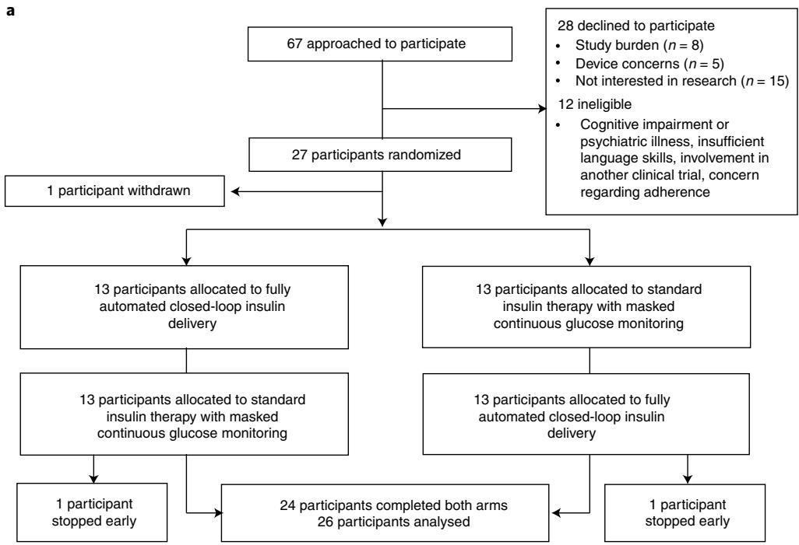
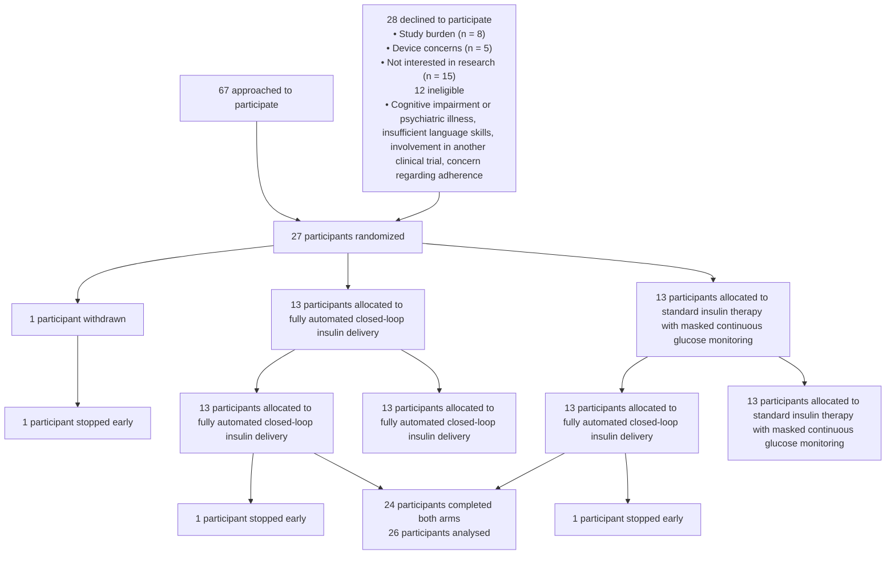
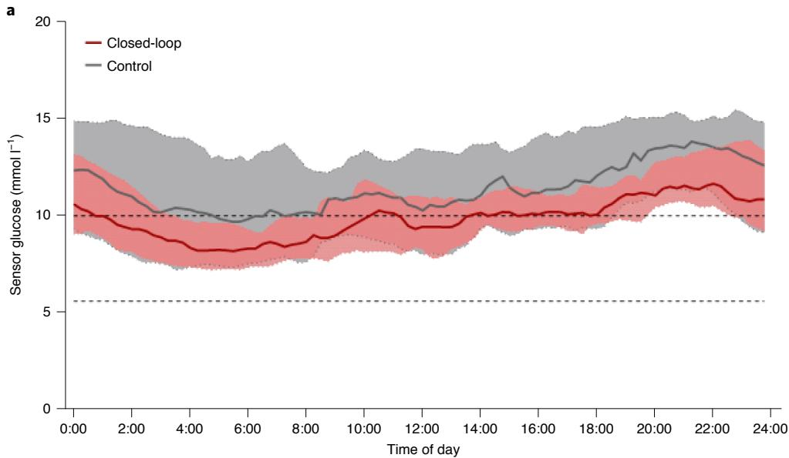
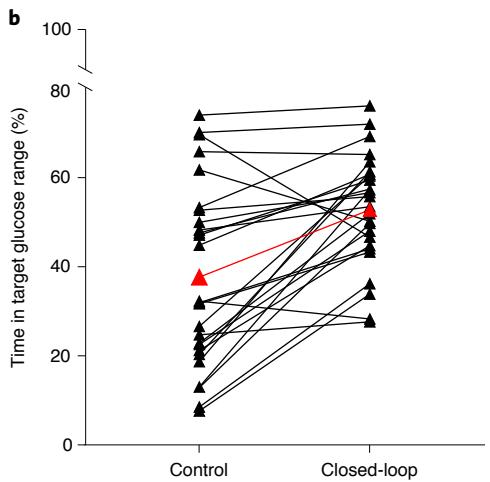
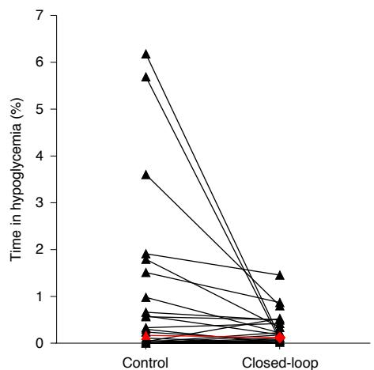
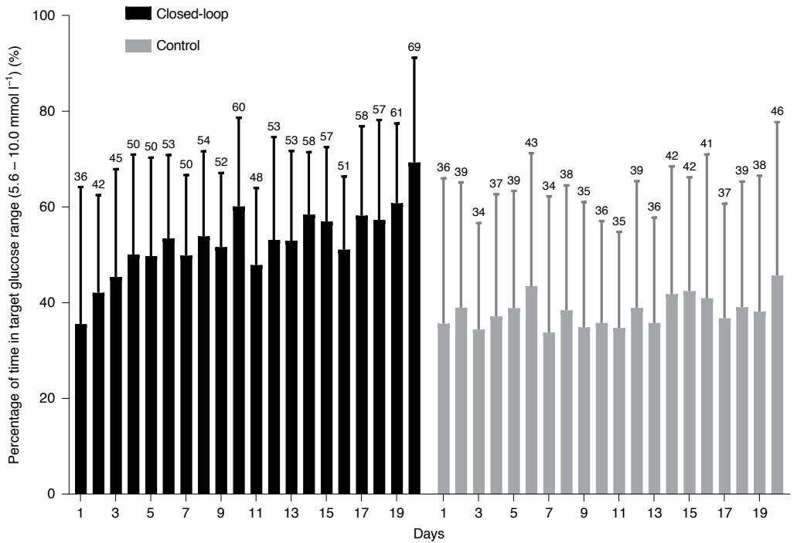
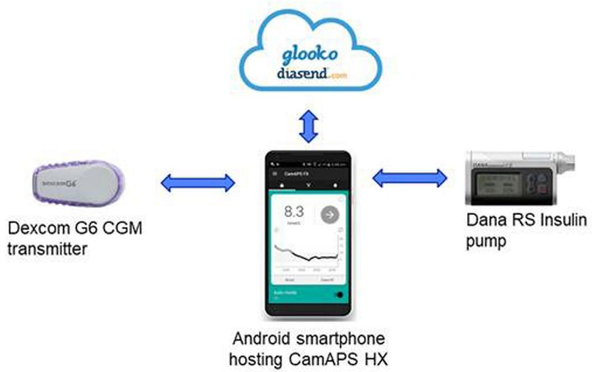
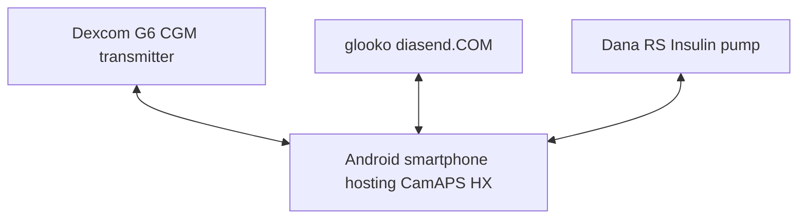
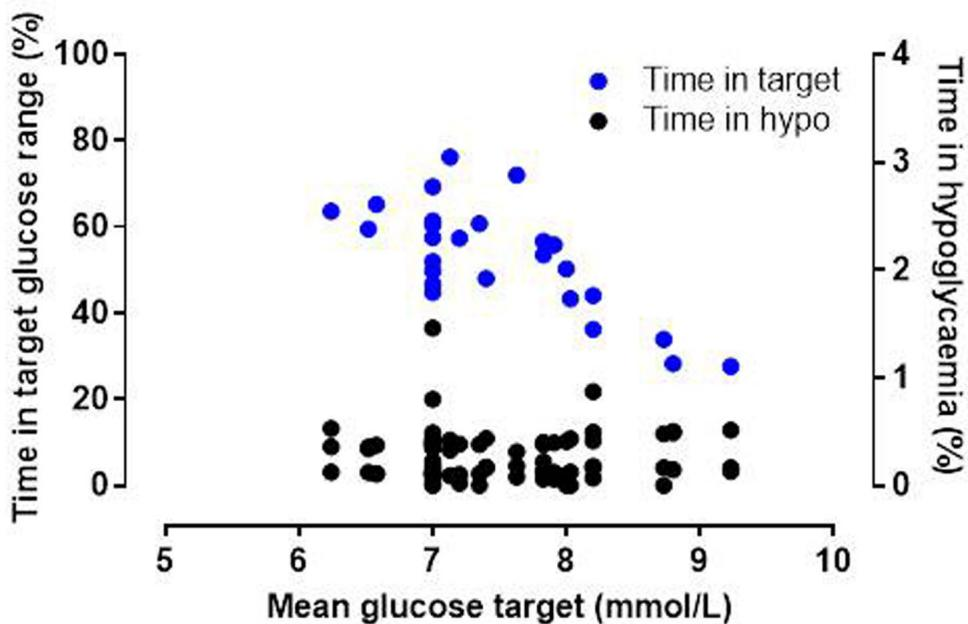

Check for updates

# OPEN

# Fully automated closed-loop glucose control compared with standard insulin therapy in adults with type 2 diabetes requiring dialysis: an open-label, randomized crossover trial

Charlotte K. Boughton  1,2 ✉, Afroditi Tripyla3 , Sara Hartnell2 , Aideen Daly1 , David Herzig3 , Malgorzata E. Wilinska1 , Cecilia Czerlau  4, Andrew Fry5 , Lia Bally  3,6 and Roman Hovorka  1,6

We evaluated the safety and efficacy of fully closed-loop insulin therapy compared with standard insulin therapy in adults with type 2 diabetes requiring dialysis. In an open-label, multinational, two-center, randomized crossover trial, 26 adults with type 2 diabetes requiring dialysis (17 men, 9 women, average age 68 ± 11 years (mean ± s.d.), diabetes duration of 20 ± 10 years) underwent two 20-day periods of unrestricted living, comparing the Cambridge fully closed-loop system using faster insulin aspart (‘closed-loop’) with standard insulin therapy and a masked continuous glucose monitor (‘control’) in random order. The primary endpoint was time in target glucose range (5.6–10.0 mmol l−1 ). Thirteen participants received closed-loop first and thirteen received control therapy first. The proportion of time in target glucose range (5.6–10.0 mmol l−1 ; primary endpoint) was 52.8 ± 12.5% with closed-loop versus 37.7 ± 20.5% with control; mean difference, 15.1 percentage points (95% CI 8.0–22.2; P < 0.001). Mean glucose was lower with closed-loop than control (10.1 ± 1.3 versus 11.6 ± 2.8 mmol l−1 ; P = 0.003). Time in hypoglycemia (<3.9 mmol l−1 ) was reduced with closed-loop versus control (median (IQR) 0.1 (0.0–0.4%) versus 0.2 (0.0–0.9%); P = 0.040). No severe hypoglycemia events occurred during the control period, whereas one severe hypoglycemic event occurred during the closed-loop period, but not during closed-loop operation. Fully closed-loop improved glucose control and reduced hypoglycemia compared with standard insulin therapy in adult outpatients with type 2 diabetes requiring dialysis. The trial registration number is NCT04025775.

iabetic nephropathy is the most common cause of end-stage renal disease (ESRD), accounting for 30% of incident cases in the UK and 29% in Europe in 20181,2 . As the prevalence of type 2 diabetes increases, the number of people with diabetes and ESRD requiring renal replacement therapy is also rising1 . A scarcity of organs for transplantation as well as cardiovascular comorbidities associated with diabetes that preclude transplantation mean that hemodialysis or peritoneal dialysis are the only available treatment options for many.

ESRD and dialysis itself increase the risk of hypoglycemia and hyperglycemia, which are associated with adverse outcomes3–5 . Management of diabetes in this population is challenging for both patients and healthcare professionals. Many aspects of diabetes care of patients on dialysis are poorly understood, including targets for glycemic control and treatment algorithms6,7 . Most oral diabetes medications are contraindicated in people with ESRD, so insulin is the most commonly used diabetes therapy. Optimal insulin dosing regimens are difficult to establish with the altered glucose and insulin metabolism associated with ESRD and dialysis5 , and concerns regarding hypoglycemia often result in sub-optimal glycemic control. There is an unmet need for novel approaches to the safe and effective management of diabetes for people requiring dialysis.

Closed-loop insulin delivery systems comprise a continuous glucose monitor, an insulin pump and a control algorithm that continuously and automatically modulates subcutaneous insulin delivery in response to real-time interstitial glucose concentrations8 . Closed-loop systems are increasingly being applied to the management of type 1 diabetes. However, use of this technology in people with type 2 diabetes has been limited to the inpatient setting including those on hemodialysis9–12. Safety and efficacy in outpatient settings, a precursor for wider clinical acceptance, is to be determined. In the present study, we address this issue and hypothesize that fully closed-loop insulin delivery may improve glycemic control compared to standard insulin therapy without increasing the risk of hypoglycemia in people with type 2 diabetes and ESRD undergoing maintenance dialysis in the outpatient setting.

# Results

Study participants. From 21 October 2019 to 3 November 2020, 27 participants were enrolled and randomized (17 men, 9 women, average age 68 ± 11 years (mean ± s.d.) and average diabetes duration 20 ± 10 years; one participant died prior to starting the first treatment arm; Fig. 1b). Baseline diabetes regimen details are shown in Supplementary Table 1. Thirteen participants were randomized to receive closed-loop first (Extended Data Fig. 1) and thirteen were

flowchart

b 

<table><tr><td></td><td>Overall (n = 27)</td><td>Closed-loop first (n = 13)</td><td>Control first (n = 14)</td></tr><tr><td>Male sex, n/total n (%)</td><td>17/27 (63)</td><td>9/13 (69)</td><td>8/14 (57)</td></tr><tr><td>Age (years)</td><td>68.3 (11.2)</td><td>65.1 (14.8)</td><td>71.2 (5.4)</td></tr><tr><td>BMI (kg m-2)</td><td>30.4 (6.5)</td><td>29.6 (7.1)</td><td>31.2 (6.1)</td></tr><tr><td>HbA1c (%)</td><td>7.2 (1.3)</td><td>7.4 (1.5)</td><td>7.0 (1.2)</td></tr><tr><td>HbA1c (mmol mol-1)</td><td>55 (14)</td><td>57 (16)</td><td>53 (13)</td></tr><tr><td>Duration of diabetes (years)</td><td>20.0 (10.0)</td><td>19.4 (7.3)</td><td>20.7 (12.3)</td></tr><tr><td>Duration on insulin therapy (years)</td><td>12.2 (6.4)</td><td>12.3 (6.3)</td><td>12.1 (6.7)</td></tr><tr><td>Total daily insulin dose (U kg-1)</td><td>0.39 (0.25, 0.59)</td><td>0.38 (0.20, 0.83)</td><td>0.42 (0.28, 0.56)</td></tr><tr><td>Duration on dialysis (years)</td><td>1.5 (0.4, 3.7)</td><td>1.7 (0.5, 4.3)</td><td>1.1 (0.4, 3.3)</td></tr><tr><td>Charlson comorbidity index</td><td>8.7 (2.2)</td><td>8.6 (2.3)</td><td>8.9 (2.2)</td></tr></table>

Data presented as mean (s.d.) or median (interquartile range) unless stated otherwise.   
No significant differences between the groups were observed at baseline.   
Charlson comorbidity index – the higher the comorbidity index the greater the burden of   
comorbidities.

Fig. 1 | Overview of the trial and participants. a, Overview of the participant flow. b, Baseline characteristics of the study participants.

randomized to standard insulin therapy first. Recruitment stopped early due to Brexit-related sponsorship issues and delays and constraints caused by COVID-19 (Methods). The flow of participants through the trial is shown in Fig. 1a. Of 27 randomized participants, one participant was withdrawn from the study post-randomization as they required hospital admission and died before the start of the first intervention period (control). Two participants stopped a study period early, one during the second period (control) due to bereavement and one during the first period (closed-loop) due to local COVID-19 restrictions. These participants both completed a minimum of 48 h in both study periods and were included in the analysis. The average washout period was 17 ± 5 days, overall. The washout period in those receiving closed-loop first was 16 ± 4 days, and was 17 ± 5 days in those receiving usual care first.

Efficacy. Primary and secondary endpoints calculated using data from all randomized subjects with at least 48 h of available data in both study periods (n = 26) are presented in Table 1. The primary endpoint, the proportion of time sensor glucose was in the target glucose range between 5.6 and 10.0 mmol l−1 , was greater during closed-loop use than with standard insulin therapy (52.8 ± 12.5% versus 37.7 ± 20.5% for closed-loop versus control, respectively;

Table 1 | Comparison of primary and secondary outcomes between closed-loop and control periods 

<table><tr><td></td><td>Closed-loop (n = 26)</td><td>Control (n = 26)</td><td>P value</td></tr><tr><td colspan="4">Proportion of time spent at glucose level (%)</td></tr><tr><td>5.6-10.0 mmol l $^{-1}$ a</td><td>52.8 (12.5)</td><td>37.7 (20.5)</td><td>&lt;0.001</td></tr><tr><td>3.9-10.0 mmol l $^{-1}$ </td><td>57.1 (14.3)</td><td>42.5 (24.7)</td><td>0.002</td></tr><tr><td>&gt;10.0 mmol l $^{-1}$ </td><td>42.6 (14.3)</td><td>56.6 (25.1)</td><td>0.003</td></tr><tr><td>&gt;20.0 mmol l $^{-1}$ </td><td>1.8 (2.4)</td><td>6.7 (10.7)</td><td>0.012</td></tr><tr><td>&lt;5.6 mmol l $^{-1}$ </td><td>3.2 (2.0, 7.0)</td><td>4.0 (0.9, 9.5)</td><td>0.87</td></tr><tr><td>&lt;3.9 mmol l $^{-1}$ </td><td>0.12 (0.02, 0.44)</td><td>0.17 (0.00, 1.11)</td><td>0.040</td></tr><tr><td>&lt;3.0 mmol l $^{-1}$ </td><td>0.00 (0.00, 0.03)</td><td>0.00 (0.00, 0.22)</td><td>0.047</td></tr><tr><td>Mean glucose (mmol l $^{-1}$ )</td><td>10.1 (1.3)</td><td>11.6 (2.8)</td><td>0.003</td></tr><tr><td>Standard deviation of glucose (mmol l $^{-1}$ )</td><td>3.2 (0.7)</td><td>3.6 (0.9)</td><td>0.021</td></tr><tr><td>CV of glucose (%)</td><td>31.7 (4.8)</td><td>31.5 (5.4)</td><td>0.87</td></tr><tr><td>Between days CV of glucose (%)</td><td>30.8 (3.4)</td><td>31.2 (5.8)</td><td>0.72</td></tr><tr><td>Total daily insulin dose (U kg $^{-1}$ )</td><td>0.34 (0.15, 0.54)</td><td>0.36 (0.19, 0.58)</td><td>0.37</td></tr><tr><td>Total daily insulin dose (U)</td><td>20.4 (9.2, 50.3)</td><td>32.2 (12.1, 54.4)</td><td>0.38</td></tr><tr><td>Sensor glucose data (h)</td><td>454 (450, 460)</td><td>452 (425, 454)</td><td>0.062</td></tr><tr><td>Time using sensor glucose (%)</td><td>95 (94, 96)</td><td>94 (90, 95)</td><td>0.062</td></tr><tr><td>Time using closed-loop (%)</td><td>93 (89, 94)</td><td>-</td><td>-</td></tr></table>

a Primary endpoint. Data presented as mean (s.d.) or median (interquartile range). CV, coefficient of variation. A two-sample t-test on paired differences was used to compare normally distributed variables and the Mann–Whitney–Wilcoxon rank-sum test was used for data that are not normally distributed. No allowance was made for multiplicity.

P < 0.001), with a mean difference of 15.1 percentage points in favor of closed-loop (95% CI 8.0–22.2). The time in range with closed-loop in period 1 was 54.4 ± 12.1% and in period 2 was 51.2 ± 13.3%. The time in range with standard insulin therapy in period 1 was 37.1 ± 22.9% and was 38.3 ± 18.6% in period 2. No period effect was observed (P = 0.86).

Mean glucose was lower with closed-loop than control (10.1 ± 1.3 versus 11.6 ± 2.8 mmol l −1 respectively; mean difference of 1.5 mmol l−1 (95% CI 0.6–2.5); P = 0.003). Figure 2 shows the 24-h sensor glucose profiles. The time spent in hypoglycemia (sensor glucose <3.9 mmol l −1 ) was reduced with closed-loop versus control (median (IQR) 0.12 (0.02–0.44%) versus 0.17 (0.00–1.11%); P = 0.040; Fig. 2b).

The standard deviation of glucose was lower during closed-loop than during the control period (3.2 ± 0.7 versus 3.6 ± 0.9 mmol l−1 ; P = 0.021) but there was no significant difference in the within-day or between-day coefficient of variation of glucose between interventions (Table 1). Total daily insulin doses were similar between interventions.

Closed-loop performance improved from days 1–7 to days 8–20, as shown by an increase in the time spent in the target glucose range by 8.1 percentage points (47.6 ± 16.1 versus 55.8 ± 12.6 mmol l−1 ; Fig. 3). Mean glucose and time in hyperglycemia (sensor glucose >10 mmol l−1 ) both decreased during days 8–20 without any difference in time spent in hypoglycemia or total daily insulin dose

(Supplementary Table 2). There was no difference in key glycemic outcomes between days 1–7 and days 8–20 during the control period, but measures of glycemic variability increased during days 8–20 compared with days 1–7 inclusive (Supplementary Table 2).

There were no differences in any glycemic outcomes, including measures of variability between dialysis days and non-dialysis days during either intervention period (Table 2). Closed-loop driven insulin delivery was lower on dialysis days than on non-dialysis days (0.29 (0.13, 0.51) versus 0.31 (0.16, 0.53) U kg−1 , respectively; Table 2). There was no difference in the mean inter-dialytic weight gain between interventions (closed-loop 1.8 ± 1.2 versus control 1.7 ± 1.1 kg; P = 0.55).

The closed-loop algorithm glucose target was set at 7.3 (7.0, 8.0) mmol l−1 . The proportion of time spent in the target glucose range decreased as the glucose target setting increased (Extended Data Fig. 2).

Safety. One episode of severe hypoglycemia occurred during the closed-loop period, but closed-loop had not been in operation at the time of the event or for 24 h previously. Six other serious adverse events were reported (Table 3). Two of these occurred during the closed-loop period (reduced responsiveness on dialysis requiring hospital admission and COVID-19 infection requiring hospital admission), two events occurred during washout or pre-study start (one hospital admission for bowel obstruction resulting in death and one hospital admission for diabetic foot-related cellulitis requiring intravenous antibiotics), and two events occurred during the control period (one below-knee amputation due to diabetic foot ulceration, and one hospital admission with an ischemic stroke). None of the serious adverse events were deemed related to study devices or study procedures.

Nine other adverse events were reported (Table 3), five of which occurred during closed-loop, two during the control period and two during washout or pre-study arm start. Three of these events were deemed related to study devices or study procedures (two skin reactions from the infusion sets and one infusion set failure causing hyperglycemia). Six device deficiencies occurred during the entire study (three sensor-related, one phone/receiver-related and two closed-loop initiation errors), none of which led to an adverse event.

Utility evaluation and diabetes burden. Glucose sensor and closed-loop usage were high in the study, at 95% (94, 96) and 93% (89, 94), respectively. The hypoglycemia confidence score was higher with the closed-loop system than with standard insulin therapy (3.8 versus 3.5, P = 0.013), but there was no difference between interventions in the hypoglycemia worry score or diabetes burden measured by the ‘problem areas in diabetes’ (PAID) survey (Supplementary Table 3). The PAID score in both periods of the study was low (7.5 for control, 10.0 for closed-loop; highest score of 100.0).

All responders (n = 24) reported that they were happy to have their glucose levels controlled automatically by the closed-loop system and would recommend the closed-loop system to others. Ninety-two percent (n = 22) reported that they spent less time managing their diabetes with the closed-loop system than in the control period, and 87% (n = 21) were less worried about their glucose levels with the closed-loop system than with standard insulin therapy (Supplementary Table 4). Fifty percent (n = 12) of responders reported improved sleep and 8% (n = 2) reported worse sleep while using closed-loop.

Benefits of the closed-loop system reported by study participants included a reduced need for finger-prick glucose checks, less time required to manage diabetes, resulting in more personal time and freedom, and improved peace of mind and reassurance. Device burden and discomfort wearing the insulin pump and carrying the smartphone were the most common limitations reported by participants (Supplementary Table 4).

line

| Time of day | Closed-loop (mmol l⁻¹) | Control (mmol l⁻¹) |
| ----------- | ---------------------- | ------------------ |
| 0:00        | ~10.5                  | ~12.5              |
| 2:00        | ~9.5                   | ~11.5              |
| 4:00        | ~8.5                   | ~10.5              |
| 6:00        | ~8.0                   | ~10.0              |
| 8:00        | ~8.5                   | ~10.5              |
| 10:00       | ~9.5                   | ~11.5              |
| 12:00       | ~9.0                   | ~11.0              |
| 14:00       | ~9.5                   | ~11.5              |
| 16:00       | ~10.0                  | ~12.0              |
| 18:00       | ~10.5                  | ~13.0              |
| 20:00       | ~11.0                  | ~14.0              |
| 22:00       | ~11.5                  | ~14.5              |
| 24:00       | ~11.0                  | ~13.5              |

line

| Group      | Time in target glucose range (%) |
| ---------- | -------------------------------- |
| Control    | 38                               |
| Closed-loop| 52                               |

line

| Group      | Time in hypoglycemia (%) |
| ---------- | ------------------------ |
| Control    | 6.0                      |
| Closed-loop| 1.5                      |

Fig. 2 | Glycemic outcomes during closed-loop and control periods. a, Median and IQR of sensor glucose during the closed-loop period (solid red line and pink shaded area) and control period (solid gray line and gray shaded area) from midnight to midnight. n = 26 biologically independent samples. The lower and upper limits of the glucose target range, 5.6–10.0 mmol l−1 , are denoted by the horizontal dashed lines. b, Individual participants’ time spent with glucose in the target glucose range of 5.6–10.0 mmol l−1 (left; overall mean shown in red) and with glucose in hypoglycemia <3.9 mmol l−1 (right; overall median shown in red) during control and closed-loop therapy.

# Discussion

This study provides evidence that fully closed-loop insulin delivery can improve glucose control and reduce hypoglycemia compared to standard insulin therapy in adults with type 2 diabetes and ESRD requiring dialysis, in an unrestricted home setting. We have shown that the fully closed-loop system has the potential to safely and effectively manage glucose levels in one of the most vulnerable subpopulations with type 2 diabetes where the risk of glycemic complications and diabetes-related adverse events is greatest.

Compared with control therapy, fully closed-loop insulin delivery was associated with over 3.5 additional hours every day spent in the target glucose range. The efficacy of closed-loop directed insulin delivery improved considerably over the study period with algorithm adaptation, and time in the target glucose range increased from 36% on day 1 to over 60% by the end of the 20-day intervention period (Fig. 3). This finding highlights the importance of an adaptive algorithm that can adjust in response to individuals’ changing insulin requirements over time, independent of its initialization. This pattern of incremental improvements in time in range with increasing duration of wear time has been reported previously with this fully closed-loop system in the inpatient setting10. It is reasonable to postulate that time in target range could improve further with a longer duration of use. It has previously been reported that 26 days of closed-loop use are required for the proportion of time in target glucose range to plateau, although this is likely to be population-dependent13,14.

In this study, the proportion of time in target range with closed-loop was lower than observed in a retrospective analysis of inpatients requiring hemodialysis using the same algorithm in a hospital setting (53% versus 69%, respectively)12. A higher glucose target was applied in the present study (median 7.3 mmol l −1 versus 5.8 mmol l−1 ), given the vulnerable population, which probably contributed to the reduced time in target glucose range observed. Higher glucose target settings were associated with less time in target glucose range (Extended Data Fig. 2). However, time spent in hypoglycemia did not increase with lower personal glucose targets, suggesting that the glucose target does not need to be unnecessarily elevated.

The reduction in time in hypoglycemia observed with closed-loop is clinically important in this highly vulnerable population with a high burden of comorbidities. Closed-loop was associated with very low time in hypoglycemia (0.12% time spent with glucose <3.9 mmol l −1 ), despite accommodating the glycemic excursions associated with end-stage renal failure and dialysis. Hypoglycemia exposure during the control period was also low, in contrast with the high frequency of hypoglycemia reported in other studies15,16.

bar

| Days | Closed-loop (%) | Control (%) |
| :--- | :--- | :--- |
| 1 | 36 | 36 |
| 2 | 42 | 39 |
| 3 | 45 | 34 |
| 4 | 50 | 37 |
| 5 | 50 | 39 |
| 6 | 53 | 39 |
| 7 | 50 | 35 |
| 8 | 54 | 36 |
| 9 | 52 | 35 |
| 10 | 60 | 43 |
| 11 | 48 | 34 |
| 12 | 53 | 38 |
| 13 | 53 | 35 |
| 14 | 58 | 36 |
| 15 | 57 | 35 |
| 16 | 51 | 39 |
| 17 | 58 | 36 |
| 18 | 57 | 42 |
| 19 | 61 | 42 |
| 20 | 69 | 41 |
| 21 | | 37 |
| 22 | | 39 |
| 23 | | 38 |
| 24 | | 46 |

Fig. 3 | Daily trend of the proportion of time when sensor glucose was in the target range for the two treatments. Daily trend of the proportion of time when sensor glucose was in the target range between 5.6 and 10.0 mmol l−1 during the closed-loop period (black bars) and the control period (gray shaded bars). n = 26 biologically independent samples. Mean and s.d. are shown.

Table 2 | Dialysis day and non-dialysis day outcomes during closed-loop and control periods 

<table><tr><td></td><td colspan="2">Dialysis days</td><td colspan="2">Non-dialysis days</td></tr><tr><td></td><td>Closed-loop (n = 25a)</td><td>Control (n = 25a)</td><td>Closed-loop (n = 25a)</td><td>Control (n = 25a)</td></tr><tr><td>Time spent at glucose levels (%)</td><td></td><td></td><td></td><td></td></tr><tr><td>5.6-10.0 mmol l-1</td><td>53.9 (14.7)</td><td>37.2 (20.3)</td><td>51.9 (12.5)</td><td>36.3 (22.2)</td></tr><tr><td>&gt;10.0 mmol l-1</td><td>41.0 (16.2)</td><td>56.2 (24.9)</td><td>43.5 (14.4)</td><td>58.8 (26.5)</td></tr><tr><td>&lt;3.9 mmol l-1</td><td>0.1 (0.0, 0.3)</td><td>0.1 (0.0, 0.9)</td><td>0.0 (0.0, 0.3)</td><td>0.1 (0.0, 1.1)</td></tr><tr><td>Mean glucose (mmol l-1)</td><td>10.1 (1.5)</td><td>11.5 (2.6)</td><td>10.1 (1.3)</td><td>11.9 (3.2)</td></tr><tr><td>Standard deviation of glucose (mmol l-1)</td><td>2.8 (0.7)</td><td>3.2 (0.9)</td><td>2.8 (0.6)</td><td>3.0 (0.8)</td></tr><tr><td>CV of glucose (%)</td><td>27.4 (4.7)</td><td>27.8 (5.6)</td><td>28.0 (3.1)</td><td>26.1 (6.9)</td></tr><tr><td>Total daily insulin dose (U kg-1)</td><td>0.29 (0.13, 0.51)</td><td>0.36 (0.18, 0.57)</td><td>0.31 (0.16, 0.53)</td><td>0.37 (0.19, 0.59)</td></tr></table>

a n = 25, as one participant receiving peritoneal dialysis was excluded from this analysis. Data presented as mean (s.d.) or median (interquartile range). CV, coefficient of variation.

The greatest reductions in hypoglycemia with closed-loop were observed in participants with the highest levels of hypoglycemia during the standard insulin therapy period (Fig. 2b). Hypoglycemia is a considerable barrier to optimization of insulin therapy. The risk of hypoglycemia is high in this population, and people on dialysis often have impaired awareness of hypoglycemia17. Hypoglycemia has been associated with an increased risk of all-cause mortality in those with diabetes on dialysis, but causation has not been established17.

The improved time in target glucose range observed with closed-loop was predominantly due to the reduced time spent in hyperglycemia. Time spent with glucose levels in severe hyperglycemia (>20.0 mmol l −1 ) was also reduced with closed-loop therapy. This degree of hyperglycemia is associated with both acute and chronic complications.

The closed-loop algorithm was able to manage fluctuations in glucose and insulin kinetics between dialysis and non-dialysis days effectively. There was no difference in glucose outcomes between dialysis and non-dialysis days, but closed-loop insulin delivery was lower on dialysis days than non-dialysis days, an effect that is probably related to the impact of the dialysate glucose concentration on blood glucose concentrations.

Closed-loop insulin delivery was safe in this vulnerable population. Although there was one severe hypoglycemia episode during the closed-loop arm, this occurred when closed-loop had not been in operation for over 24 h. No study-related serious adverse events occurred during the closed-loop intervention period, and the commonest study-related adverse events were self-limiting skin reactions.

Closed-loop and sensor glucose usage were high in the study, supporting acceptability of this approach in this population. All study participants were happy to have glucose levels managed with an automated insulin delivery system and would recommend its use to others. Participants felt more confident in managing hypoglycemia with the closed-loop system, although this could be due to the availability of real-time glucose levels and alarms for hypoglycemia.

Table 3 | Adverse events and safety analyses 

<table><tr><td></td><td>Overall (n = 27)</td><td>Closed-loop (n = 26)</td><td>Control (n = 26)</td></tr><tr><td>Number of severe hypoglycemia events</td><td>1</td><td>1</td><td>0</td></tr><tr><td>Number (%) of participants with severe hypoglycemic events</td><td>1 (4)</td><td>1 (4)</td><td>0 (0)</td></tr><tr><td>Number of serious adverse events (not study-related)</td><td>7</td><td>3</td><td>2</td></tr><tr><td>Number (%) of participants with serious adverse events</td><td>6 (22)</td><td>3 (12)</td><td>2 (8)</td></tr><tr><td>Number of other adverse events</td><td>9</td><td>5</td><td>2</td></tr><tr><td>Number (%) of participants with adverse events</td><td>7 (26)</td><td>4 (15)</td><td>2 (8)</td></tr><tr><td>Number of device deficiencies</td><td>6</td><td>5</td><td>1</td></tr><tr><td>Number (%) of participants with device deficiencies</td><td>6 (22)</td><td>5 (19)</td><td>1 (4)</td></tr></table>

Severe hypoglycemia is defined as capillary glucose < 2.2 mmol l−1 or requiring assistance of another person.

Device burden was reported as the main perceived drawback to this approach.

The strengths of this study include the multinational randomized crossover design, the fully closed-loop approach adopted and the unrestricted and unsupervised home setting, including dialysis sessions.

Limitations include the smaller sample size than planned due to Brexit-related study sponsorship issues and the COVID-19 pandemic. Device management was performed by the study team to minimize training burden and therefore we cannot comment on the competency of this population to self-manage this treatment modality. Diabetes therapies during the control period were not standardized or optimized during the trial. We did not evaluate the accuracy of the glucose sensor in the present study; however, because the same sensor was used during both study arms, we believe this is unlikely to have impacted the results. As this was an exploratory study, no adjustment was made for multiple comparisons in the statistical analysis. We included only one participant receiving peritoneal dialysis, thus limiting interpretation of efficacy and safety in this specific cohort.

Our study evaluated the performance of a fully closed-loop system in an unrestricted outpatient setting in a highly vulnerable population with type 2 diabetes and end-stage renal failure requiring dialysis. Having demonstrated safety and efficacy in this at-risk population in this exploratory study, larger studies are now required to confirm these findings and to determine if the glycemic improvements observed with closed-loop are associated with a reduction in complications and improved quality of life, as well as whether closed-loop should be targeted towards specific subpopulations (for example, those with high hypoglycemic burden or peri-transplant). We suggest that the fully closed-loop approach may also be beneficial in the wider population of people with type 2 diabetes, and further studies are warranted.

# Online content

Any methods, additional references, Nature Research reporting summaries, source data, extended data, supplementary information, acknowledgements, peer review information; details of author contributions and competing interests; and statements of data and code availability are available at https://doi.org/10.1038/ s41591-021-01453-z.

Received: 1 March 2021; Accepted: 28 June 2021;

Published online: 4 August 2021

# References

1. UK Renal Registry 22nd Annual Report (The Renal Association, 2020); http://renal.org/audit-research/annual-report   
2. ERA-EDTA Registry Annual Report 2018 (European Renal Association– European Dialysis and Transplant Association, 2020); https://www.era-edta. org/en/registry/publications/annual-reports   
3. Abe, M. & Kalantar-Zadeh, K. Haemodialysis-induced hypoglycaemia and glycaemic disarrays. Nat. Rev. Nephrol. 11, 302–313 (2015).   
4. Copur, S. et al. Serum glycated albumin predicts all-cause mortality in dialysis patients with diabetes mellitus: meta-analysis and systematic review of a predictive biomarker. Acta Diabetol. 58, 81–91 (2021).   
5. Hill, C. J. et al. Glycated hemoglobin and risk of death in diabetic patients treated with hemodialysis: a meta-analysis. Am. J. Kidney Dis. 63, 84–94 (2014).   
6. Management of Adults with Diabetes on the Haemodialysis Unit (Joint British Diabetes Societies (JBDS) for Inpatient Care Group, 2016); https://abcd.care/ resource/management-adults-diabetes-haemodialysis-unit   
7. Galindo, R. J., Beck, R. W., Scioscia, M. F., Umpierrez, G. E. & Tuttle, K. R. Glycemic monitoring and management in advanced chronic kidney disease. Endocr. Rev. 41, 756–774 (2020).   
8. Hovorka, R. Closed-loop insulin delivery: from bench to clinical practice. Nat. Rev. Endocrinol. 7, 385–395 (2011).   
9. Thabit, H. et al. Closed-loop insulin delivery in inpatients with type 2 diabetes: a randomised, parallel-group trial. Lancet Diabetes Endocrinol. 5, 117–124 (2017).   
10. Bally, L. et al. Closed-loop insulin delivery for glycemic control in noncritical care. N. Engl. J. Med. 379, 547–556 (2018).   
11. Boughton, C. K. et al. Fully closed-loop insulin delivery in inpatients receiving nutritional support: a two-centre, open-label, randomised controlled trial. Lancet Diabetes Endocrinol. 7, 368–377 (2019).   
12. Bally, L. et al. Fully closed-loop insulin delivery improves glucose control of inpatients with type 2 diabetes receiving hemodialysis. Kidney Int. 96, 593–596 (2019).   
13. Leelarathna, L. et al. Duration of hybrid closed-loop insulin therapy to achieve representative glycemic outcomes in adults with type 1 diabetes. Diabetes Care 43, e38–e39 (2020).   
14. Herrero, P., Alalitei, A., Reddy, M., Georgiou, P. & Oliver, N. Robust determination of the optimal continuous glucose monitoring length of intervention to evaluate long-term glycaemic control. Diabetes Technol. Ther. 23, 314–319 (2021).   
15. Kazempour-Ardebili, S. et al. Assessing glycemic control in maintenance hemodialysis patients with type 2 diabetes. Diabetes Care 32, 1137–1142 (2009).   
16. Jung, H. S. et al. Analysis of hemodialysis-associated hypoglycemia in patients with type 2 diabetes using a continuous glucose monitoring system. Diabetes Technol. Ther. 12, 801–807 (2010).   
17. Chu, Y. W. et al. Epidemiology and outcomes of hypoglycemia in patients with advanced diabetic kidney disease on dialysis: a national cohort study. PLoS ONE 12, e0174601 (2017).

Publisher’s note Springer Nature remains neutral with regard to jurisdictional claims in published maps and institutional affiliations.

Open Access This article is licensed under a Creative Commons Attribution 4.0 International License, which permits use, sharing, adaptation, distribution and reproduction in any medium or format, as long as you give appropriate credit to the original author(s) and the source, provide a link to the Creative Commons license, and indicate if changes were made. The images or other third party material in this article are included in the article’s Creative Commons license, unless indicated otherwise in a credit line to the material. If material is not included in the article’s Creative Commons license and your intended use is not permitted by statutory regulation or exceeds the permitted use, you will need to obtain permission directly from the copyright holder. To view a copy of this license, visit http://creativecommons. org/licenses/by/4.0/.

© The Author(s) 2021, corrected publication 2021

# Methods

Trial design and participants. The trial adopted an open-label, two-center, multinational, randomized, two-period crossover design contrasting fully closed-loop glucose control using faster-acting insulin aspart (Fiasp, Novo Nordisk) (‘closed-loop’) and standard multiple daily insulin injection therapy (‘control’) during unrestricted living. Each intervention period lasted 20 days, separated by two to four weeks of washout using pre-study treatment. The order of the two interventions was random.

Participants were recruited from dialysis centers and nephrology and diabetes outpatient clinics at Addenbrooke’s Hospital in Cambridge, United Kingdom, and Inselspital, University Hospital of Bern, Switzerland. Inclusion criteria included age 18 years and older, type 2 diabetes requiring subcutaneous insulin therapy and end-stage renal failure requiring maintenance dialysis (hemodialysis or peritoneal dialysis). Exclusion criteria included type 1 diabetes, pregnancy or breast-feeding, severe visual or hearing impairment and any physical or psychological disease, or the use of medication(s) likely to interfere with the conduct of the trial or interpretation of the results.

Written informed consent was obtained from all participants prior to the start of study-related procedures. The study protocol was approved by the local research ethics committees (London–Stanmore Ethics Committee, UK; Ethics Committee Bern, Switzerland) and regulatory authorities (MHRA and Swissmedic). The full trial protocol is available in the Supplementary Note. The safety aspects of the trial were overseen by an independent Data and Safety Monitoring Board. The study was registered 19 July 2019 with ClinicalTrials.gov NCT04025775.

Protocol adherence. There were 25 protocol deviations during the study period, including seven COVID-19-related deviations (delay to starting or premature finishing of a study period), seven home visits to replenish insulin supplies and 11 visits to replace infusion sets, sensors or batteries.

Recruitment was stopped early due to Brexit-related sponsorship issues that prevented the Switzerland site from recruiting any further participants after 31 December 2020, and UK study personnel were working clinically in high-risk COVID-19 environments that could have put study participants at increased risk.

Randomization and masking. Eligible participants were randomly assigned to either initial use of fully closed-loop glucose control with faster-acting insulin aspart for 20 days followed by standard multiple daily insulin injection therapy for 20 days, or vice versa. Randomization was done using a computer-generated sequence with a permuted block design (block size 4) and stratified by center. Participants and investigators were not masked to the intervention being used during each period due to the nature of the interventions precluding the ability to mask.

Procedures. Participant demographics and medical history, body weight and height, glycated hemoglobin (HbA1c) and total daily insulin dose were recorded at enrollment.

Body weight pre- and post-dialysis was recorded at each dialysis session (or daily if on peritoneal dialysis) as per usual clinical practice. All participants dialyzed with 5.5 mmol l −1 glucose-containing dialysate. Fingerstick capillary glucose measurements were performed by dialysis staff according to usual clinical practice.

Closed-loop insulin delivery system. The CamAPS HX closed-loop app (CamDiab) resides on an unlocked Android phone, receives sensor glucose data from a Dexcom G6 transmitter (Dexcom) and uses the Cambridge adaptive model predictive control algorithm (version 0.3.71) to direct insulin delivery on a Dana Diabecare RS pump (Diabecare; Extended Data Fig. 1). Every 8 to 12 min, and based on sensor glucose data, the Cambridge adaptive control algorithm calculates an insulin infusion rate that is communicated wirelessly to the insulin pump. Sensor glucose and insulin data are automatically uploaded to the Diasend/Glooko (https://diasend.com//en) data management platform.

The control algorithm is initialized using the participant’s weight and total daily insulin dose and gradually adapts its insulin dosing based on observed glucose patterns. The nominal glucose target is 5.8 mmol l−1 and can be adjusted as required between 4.4 and 11.0 mmol l −1 . In the present study, given the vulnerable population, the glucose target was set at 7.0 mmol l−1 and above, based on individual circumstances. Low glucose alarms were customized at a threshold to suit the participant.

Closed-loop period. Participants’ usual insulin therapy was discontinued on the day of closed-loop initialization. All other medications were continued.

Closed-loop insulin delivery was continued for 20 days, including during dialysis sessions. Faster-acting insulin aspart (Fiasp) was delivered via the insulin pump throughout the closed-loop study period. Fiasp was used for its properties of faster onset and offset of action, and its potential to enhance closed-loop performance. No prandial insulin boluses were delivered and the control algorithm was not aware of timing or carbohydrate content of meals. Infusion sets were changed at each dialysis session by the study team.

Participants were unrestricted in relation to their usual activity and dietary intake. The study did not interfere with or specify the medications prescribed

by the local clinical team. All participants were provided with a 24-h telephone helpline to contact the local study team in the event of study-related issues. At the end of the closed-loop period, devices were removed and participants’ usual insulin therapy re-started.

Standard insulin therapy period. During the control period, participants’ received their usual insulin therapy and other diabetes medications. Fingerstick capillary glucose measurements were performed by participants as per usual clinical practice. Glycemic management was performed by the clinical team according to local practice. A continuous glucose sensor, Dexcom G6 (Dexcom), was inserted by the study team on the first day of the study arm. The continuous glucose monitor receiver was modified to mask the sensor glucose concentration to the participant and investigators.

Participants were unrestricted in relation to their usual activity and dietary intake. The study did not interfere with or specify the medications prescribed by the local clinical team. All participants were provided with a 24-h telephone helpline to contact the local study team in the event of study-related issues. At the end of the standard insulin therapy period, the glucose sensor was removed.

Questionnaires. Participants were invited to complete the validated questionnaires at the end of each study period: the PAID questionnaire to assess diabetes distress, the Hypoglycaemia Confidence Survey to evaluate perceptions of ability to self-manage hypoglycemia and the Hypoglycaemia Fear Survey-II Worry Scale HFS-W to estimate hypoglycemia-related fear and anxiety (Cambridge only)18–20. Additionally, participants filled in a closed-loop experience questionnaire collecting feedback on satisfaction with closed-loop therapy, acceptance of wearing study devices and recommending closed-loop to others.

Sample size. This was an exploratory study aiming for 32 subjects with at least 48 h of data. Because previous studies using closed-loop in an inpatient setting may not provide reliable information about the standard deviation of the primary endpoint in this particular population (outpatients receiving maintenance dialysis), no formal power calculation was applied. The sample size corresponds to the sample size of previous feasibility closed-loop randomized trials9,11.

Study endpoints. The primary endpoint was the percentage of time the sensor glucose measurement was in the target glucose range of 5.6–10.0 mmol l −1 during the 20-day study period. This target glucose range was selected in line with recommendations for less stringent glucose control in this population due to their high risk for hypoglycemia and related adverse events5,6,21–23.

Other key endpoints are the percentage of time spent with sensor glucose above 10.0 mmol l −1 , mean sensor glucose and the percentage of time spent with sensor glucose below 3.9 mmol l−1 . Secondary efficacy endpoints included time spent with sensor glucose below 5.6 mmol l −1 and below 3.0 mmol l −1 , time spent with sensor glucose levels in severe hyperglycemia (>20 mmol l−1 ) and the total daily insulin dose. Glucose variability was evaluated by the standard deviation and the coefficient of variation of sensor glucose utilizing data collected from the whole study period. The between-day coefficient of variation of sensor glucose was calculated from daily mean glucose values (0:00–23:59).

Safety endpoints included severe hypoglycemia (capillary glucose <2.2 mmol l−1 or requiring assistance of another person), along with other adverse events and serious adverse events and device deficiencies.

Exploratory analyses included a subset of glucose and insulin metrics during the first seven days and during the subsequent period of day 8 to day 20 (time in target, time above target, time in hypoglycemia (<3.9 mmol l−1 ), mean sensor glucose, standard deviation and the coefficient of variation of sensor glucose, and total daily insulin dose) to limit the number of comparisons. Variability of glucose and insulin requirements between dialysis and non-dialysis days was assessed using the coefficient of variation of sensor glucose and insulin requirements between dialysis days (0:00–23:59) and non-dialysis days (0:00–23:59). Mean inter-dialytic weight gain was calculated for each study period.

Psychosocial assessments were measured using questionnaires collected at the end of each study period and closed-loop participants’ experience at the end of the closed-loop period.

Statistical analysis. The statistical analysis plan was agreed by the investigators in advance. All analyses were carried out on an intention-to-treat basis. We analyzed endpoints from participants with at least 48 h of sensor glucose data in both study periods. The respective values obtained during the 20-day randomized interyentions were compared.

Values are reported as mean ± s.d. for normally distributed values or median (interquartile range) for non-normally distributed values. A two-sample t-test on paired differences was used to compare normally distributed variables24 and the Mann–Whitney–Wilcoxon rank-sum test for data that are not normally distributed. No allowance was made for multiplicity. Outcomes were calculated using GStat software, version 2.3 (University of Cambridge), and statistical analyses were performed using SPSS, version 27 (IBM Software). All P values are two-tailed, and P values of less than 0.05 were considered to indicate statistical significance.

Reporting Summary. Further information on research design is available in the Nature Research Reporting Summary linked to this Article.

# Data availability

The data that support the findings of this study are available from the corresponding author for the purposes of advancing the management and treatment of diabetes. All data shared will be de-identified. The study protocol is available with this paper.

# Code availability

The control algorithm cannot be made publicly available because it is proprietary intellectual property. The control algorithm cannot be used in routine practice in the outpatient setting as regulatory approval has not yet been granted.

# References

18. Polonsky, W. H., Fisher, L., Hessler, D. & Edelman, S. V. Investigating hypoglycemic confidence in type 1 and type 2 diabetes. Diabetes Technol. Ther. 19, 131–136 (2017).   
19. Cox, D. J., Irvine, A., Gonder-Frederick, L., Nowacek, G. & Butterfield, J. Fear of hypoglycemia: quantification, validation and utilization. Diabetes Care 10, 617–621 (1987).   
20. Polonsky, W. H. et al. Assessment of diabetes-related distress. Diabetes Care 18, 754–760 (1995).   
21. Battelino, T. et al. Clinical targets for continuous glucose monitoring data interpretation: recommendations from the international consensus on time in range. Diabetes Care 42, 1593–1603 (2019).   
22. American Diabetes Association. 6. Glycemic targets. Standards of medical care in diabetes—2021. Diabetes Care 44, S73–S84 (2021).   
23. Frankel, A. H. et al. Management of adults with diabetes on the haemodialysis unit: summary of guidance from the Joint British Diabetes Societies and the Renal Association. Diabet. Med. 35, 1018–1026 (2018).   
24. Jones, B. & Kenwood, M. G. Design and Analysis of Cross-Over Trials 3rd edn. (CRC Press, 2014).

# Acknowledgements

Dexcom supplied discounted continuous glucose monitoring devices and sensors for the study. Company representatives had no role in the study conduct. The study was supported by the National Institute for Health Research Cambridge Biomedical Research Centre. C.B. was supported by a grant from The Novo Nordisk UK Research Foundation and L.B. was supported by a grant from the Swiss Society for Endocrinology and Diabetes (SGED/SSED) and a grant from the Swiss Diabetes Foundation and

Swiss Kidney Foundation. We are grateful to all study participants for their contribution, time and support. We acknowledge administrative support from N. Ashcroft at the University of Cambridge. We thank D. Studer, C. Piazza and N. Truffer, who contributed to patient care and study logistics in Bern, and the Diabetes Center Bern for providing infrastructure for the study team in Bern. The views expressed are those of the author(s) and not necessarily those of the NIHR, the Department of Health and Social Care or other funders.

# Author contributions

C.K.B., L.B. and R.H. co-designed the study. C.K.B., L.B., S.H., A.T., A.D., D.H., C.C. and A.F. were responsible for screening and enrollment of participants, arranged informed consent from the participants and provided patient care. R.H. designed and implemented the glucose controller. C.K.B., L.B., M.E.W., A.D. and R.H. undertook data analysis. C.K.B., L.B., S.H., A.T., A.D., D.H., C.C. and A.F. contributed to interpretation of the results. C.K.B. and R.H. wrote the report. All authors critically reviewed the manuscript. C.K.B., L.B. and R.H. had full access to all of the data in the study and take responsibility for the integrity of the data and the accuracy of the data and analyses and for the adherence of the trial to the protocol.

# Competing interests

S.H. serves as a member of the Sigma (Dexcom) and Medtronic advisory boards, is a director of Ask Diabetes Ltd, providing training and research support in healthcare settings, and reports having received training honoraria from Medtronic and Sanofi. M.E.W. reports receiving license fees from B. Braun, patents related to closed-loop and being a consultant at CamDiab. R.H. reports having received speaker honoraria from Eli Lilly, Dexcom and Novo Nordisk, receiving license fees from B. Braun and Medtronic, patents related to closed-loop and being director at CamDiab. C.K.B., L.B., A.T., A.D., D.H., C.C. and A.F. declare no competing interests associated with this manuscript.

# Additional information

Extended data is available for this paper at https://doi.org/10.1038/s41591-021-01453-z.

Supplementary information The online version contains supplementary material available at https://doi.org/10.1038/s41591-021-01453-z.

Correspondence and requests for materials should be addressed to C.K.B.

Peer review information Nature Medicine thanks Luke Ouma, Richard Oram and the other, anonymous, reviewer(s) for their contribution to the peer review of this work. Jennifer Sargent was the primary editor on this article and managed its editorial process and peer review in collaboration with the rest of the editorial team.

Reprints and permissions information is available at www.nature.com/reprints.

CamAPSHXfullyautomatedclosed-loopinsulindeliverysystem

flowchart

Extended Data Fig. 1 | CamAPS HX fully automated closed-loop insulin delivery system. CamAPS HX fully automated closed-loop insulin delivery system.

Therelationship betweenclosed-looptarget glucose settingsand(i)timeintarget glucose range5.6to10.0mmol/L(thebluefullcircle)and(i)timeinhypoglycaemiabelow3.9 mmol/L(theblack fullcircle).

scatter

| Mean glucose target (mmol/L) | Time in target glucose range (%) | Time in hypoglycaemia (%) |
| ---------------------------- | --------------------------------- | ------------------------- |
| 6.0                          | 65                                | 0.5                       |
| 6.2                          | 68                                | 0.7                       |
| 6.5                          | 62                                | 0.3                       |
| 6.8                          | 70                                | 0.9                       |
| 7.0                          | 75                                | 1.2                       |
| 7.2                          | 60                                | 0.4                       |
| 7.5                          | 55                                | 0.6                       |
| 7.8                          | 50                                | 0.2                       |
| 8.0                          | 45                                | 0.1                       |
| 8.2                          | 40                                | 0.3                       |
| 8.5                          | 35                                | 0.5                       |
| 8.8                          | 30                                | 0.7                       |
| 9.0                          | 25                                | 0.9                       |
| 9.2                          | 20                                | 1.1                       |
| 9.5                          | 15                                | 1.3                       |
| 9.8                          | 10                                | 1.5                       |

Extended Data Fig. 2 | The relationship between closed-loop target glucose settings and glucose outcomes. The relationship between closed-loop target glucose settings and (i) time in target glucose range 5.6 to 10.0 mmol/L (the blue full circle) and (ii) time in hypoglycaemia below 3.9 mmol/L (the black full circle).

# Reporting Summary

Nature Research wishes to improve the reproducibility of the work that we publish. This form provides structure for consistency and transparency in reporting. For further information on Nature Research policies, see our Editorial Policies and the Editorial Policy Checklist.

# Statistics

For all statistical analyses, confirm that the following items are present in the figure legend, table legend, main text, or Methods section.

n/a Confirmed

The exact sample size (n) for each experimental group/condition, given as a discrete number and unit of measurement   
A statement on whether measurements were taken from distinct samples or whether the same sample was measured repeatedly   
The statistical test(s) used AND whether they are one- or two-sided Only common tests should be described solely by name; describe more complex techniques in the Methods section.

A description of all covariates tested

A description of any assumptions or corrections, such as tests of normality and adjustment for multiple comparisons

A full description of the statistical parameters including central tendency (e.g. means) or other basic estimates (e.g. regression coefficient)AND variation (e.g. standard deviation) or associated estimates of uncertainty (e.g. confidence intervals)

For null hypothesis testing, the test statistic (e.g. F, t, r) with confidence intervals, effect sizes, degrees of freedom and P value noted Give P values as exact values whenever suitable.

For Bayesian analysis, information on the choice of priors and Markov chain Monte Carlo settings

For hierarchical and complex designs, identification of the appropriate level for tests and full reporting of outcomes

Estimates of effect sizes (e.g. Cohen's d, Pearson's r), indicating how they were calculated

Our web collection on statistics for biologists contains articles on many of the points above.

# Software and code

Policy information about availability of computer code

<table><tr><td>Data collection</td><td>The CamAPS HX closed-loop app (CamDiab, Cambridge, UK) resides on an unlocked Android phone, receives sensor glucose data from a Dexcom G6 transmitter (Dexcom, San Diego, CA, USA), and uses Cambridge adaptive model predictive control algorithm (version 0.3.71) to direct insulin delivery on a Dana Diabecare RS pump (Diabecare, Sooil, South Korea). Sensor glucose and insulin data were obtained from the Diasend/Glooko (https://diasend.com//en) data management platform.</td></tr></table>

<table><tr><td>Data analysis</td><td>Outcomes were calculated using GStat software, version 2.3 (University of Cambridge), and statistical analyses were performed using SPSS, version 27 (IBM Software, Hampshire, UK).</td></tr></table>

For manuscripts utilizing custom algorithms or software that are central to the research but not yet described in published literature, software must be made available to editors and reviewers. We strongly encourage code deposition in a community repository (e.g. GitHub). See the Nature Research guidelines for submitting code & software for further information.

# Data

Policy information about availability of data

All manuscripts must include a data availability statement. This statement should provide the following information, where applicable:

- Accession codes, unique identifiers, or web links for publicly available datasets   
- A list of figures that have associated raw data   
- A description of any restrictions on data availability

The data that support the findings of this study are available from the corresponding author for the purposes of advancing management and treatment of diabetes. All data shared will be de-identified. Study protocol is available with publication.

# Field-specific reporting

Please select the one below that is the best fit for your research. If you are not sure, read the appropriate sections before making your selection.

Life sciences

Behavioural & social sciences

Ecological, evolutionary & environmental sciences

For a reference copy of the document with all sections, see nature.com/documents/nr-reporting-summary-flat.pdf

# Life sciences study design

All studies must disclose on these points even when the disclosure is negative.

<table><tr><td>Sample size</td><td>This was an exploratory study aiming for 32 subjects with at least 48 hours of data. Since previous studies using closed-loop in an inpatient setting may not provide reliable information about the standard deviation of the primary endpoint in this particular population (outpatients receiving maintenance dialysis), no formal power calculation was applied. The sample size corresponds to the sample size of previous feasibility closed-loop randomised trials (9,11).</td></tr><tr><td>Data exclusions</td><td>All analyses were carried out on an intention-to-treat basis. We analysed end points from participants with at least 48 h of sensor glucose data in both study periods. Of 27 randomized participants, one participant was withdrawn from the study post-randomisation as they required hospital admission and died before the start of the first intervention period (control). Two participants stopped a study period early; one during the second period (control) due to bereavement and one during the first period (closed-loop) due to local covid-19 restrictions. These participants both completed a minimum of 48 hours in both study periods and were included in the analysis.</td></tr><tr><td>Replication</td><td>The current manuscript reports the results of a clinical trial. The methods have been described in detail s in the text and study protocol to allow replication</td></tr><tr><td>Randomization</td><td>Eligible participants were randomly assigned to either initial use of fully closed-loop glucose control with faster acting insulin aspart for 20 days followed by standard multiple daily insulin injection therapy for 20 days or vice versa. Randomisation was done using a computer-generated sequence with a permuted block design (block size 4) and stratified by centre.</td></tr><tr><td>Blinding</td><td>Participants and investigators were not masked to the intervention being used during each period due to the nature of the interventions precluding the ability to mask.</td></tr></table>

# Reporting for specific materials, systems and methods

We require information from authors about some types of materials, experimental systems and methods used in many studies. Here, indicate whether each material, system or method listed is relevant to your study. If you are not sure if a list item applies to your research, read the appropriate section before selecting a response.

Materials & experimental systems 

<table><tr><td>n/a</td><td>Involved in the study</td><td>n/a</td><td>Involved in the study</td></tr><tr><td>☒</td><td>Antibodies</td><td>☒</td><td>ChIP-seq</td></tr><tr><td>☒</td><td>Eukaryotic cell lines</td><td>☒</td><td>Flow cytometry</td></tr><tr><td>☒</td><td>Palaeontology and archaeology</td><td>☒</td><td>MRI-based neuroimaging</td></tr><tr><td>☒</td><td>Animals and other organisms</td><td></td><td></td></tr><tr><td>☐</td><td>Human research participants</td><td></td><td></td></tr><tr><td>☐</td><td>Clinical data</td><td></td><td></td></tr><tr><td>☒</td><td>Dual use research of concern</td><td></td><td></td></tr></table>

Methods

# Human research participants

Policy information about studies involving human research participants

<table><tr><td>Population characteristics</td><td>From 21 October 2019 to 3 November 2020, 27 participants were enrolled and randomised (17 men, 9 women, average age  $68 \pm 11$  years [mean  $\pm$ SD] and average diabetes duration  $20 \pm 10$  years).</td></tr><tr><td>Recruitment</td><td>Participants were recruited from dialysis centres and nephrology and diabetes outpatient clinics at Addenbrooke’s Hospital in Cambridge, United Kingdom, and Inselspital, University Hospital of Bern, Switzerland. Inclusion criteria included age 18 years and older, type 2 diabetes requiring subcutaneous insulin therapy and end stage renal failure requiring maintenance dialysis (haemodialysis or peritoneal dialysis). Exclusion criteria included type 1 diabetes, pregnancy or breast-feeding, severe visual or hearing impairment and any physical or psychological disease or the use of medication(s) likely to interfere with the conduct of the trial or interpretation of the results.Recruitment rate was approximately 50% of those who were approached and eligible to participate in the study and included only one participant using peritoneal dialysis, which may limit generalisability of the findings.</td></tr><tr><td>Ethics oversight</td><td>The study protocol was approved by the local Research Ethics Committees (London – Stanmore Ethics Committee, UK, and</td></tr></table>

# Clinical data

Policy information about clinical studies

All manuscripts should comply with the ICMJE guidelines for publication of clinical research and a completed CONSORT checklist must be included with all submissions.

Clinical trial registration

The study was registered with ClinicalTrials.gov NCT04025775.

Study protocol

Study protocol is available with publication

Data collection

Participants were enrolled and randomised from 21 October 2019 to 3 November 2020 at Addenbrooke’s Hospital in Cambridge, United Kingdom, and Inselspital, University Hospital of Bern, Switzerland. Participant demographics and medical history, body weight and height, glycated haemoglobin (HbA1c) and total daily insulin dose were recorded at enrolment. Study visits were undertaken at the hospital or local dialysis centre.

Participants were randomly assigned to either initial use of fully closed-loop glucose control with faster acting insulin aspart for 20 days followed by standard multiple daily insulin injection therapy for 20 days or vice versa. Glycaemic and insulin endpoints were collected from each 20-day study period. Sensor glucose and insulin data are automatically uploaded to the Diasend/Glooko data management platform. Body weight pre- and post-dialysis was recorded at each dialysis session (or daily if on peritoneal dialysis) during each 20-day study period. Psychosocial assessments were measured using questionnaires collected at the end of each study period.

Outcomes

The primary endpoint was the percentage of time the sensor glucose measurement was in the target glucose range of 5.6 to 10.0 mmol/L during the 20-day study period. This target glucose range was selected in line with recommendations for less stringent glucose control in this population due to their high risk for hypoglycaemia and related adverse events (5, 6, 16-18).

Other key endpoints are the percentage of time spent with sensor glucose above 10.0 mmol/L, mean sensor glucose, and the percentage of time spent with sensor glucose below 3.9 mmol/L. Secondary efficacy endpoints included time spent with sensor glucose below 5.6 mmol/L and below 3.0 mmol/L, time spent with sensor glucose levels in significant hyperglycaemia (>20mmol/L) and the total daily insulin dose. Glucose variability was evaluated by the standard deviation and the coefficient of variation of sensor glucose utilising data collected from the whole study period. The between-day coefficient of variation of sensor glucose was calculated from daily mean glucose values (0000-2359).

Safety end-points included severe hypoglycaemia (capillary glucose <2.2 mmol/L, or requiring assistance of another person), along with other adverse events and serious adverse events and device deficiencies.

Exploratory analyses included a subset of glucose and insulin metrics during the first 7 days and during the subsequent period of day 8 to day 20 (time in target, time above target, time in hypoglycaemia (<3.9 mmol/L), mean sensor glucose, standard deviation and the coefficient of variation of sensor glucose, and total daily insulin dose) to limit the number of comparisons. Variability of glucose and insulin requirements between dialysis and non-dialysis days was assessed using coefficient of variation of sensor glucose and insulin requirements between dialysis days (0000-2359) and non-dialysis days (0000-2359). Mean inter-dialytic weight gain was calculated for each study period.

Psychosocial assessments were measured using questionnaires collected at the end of each study period and closed-loop participants’ experience at the end of the closed-loop period.