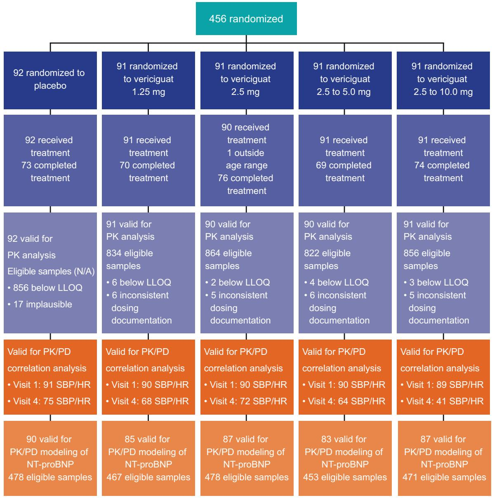
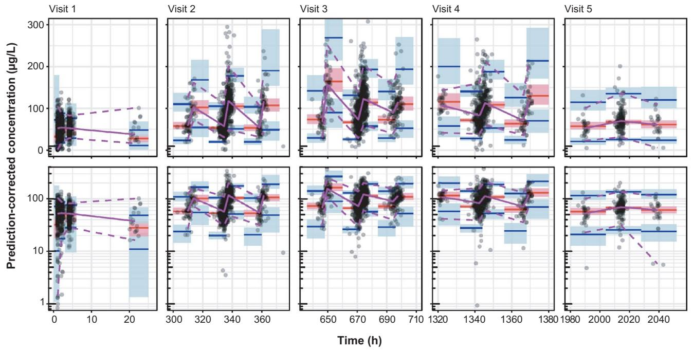
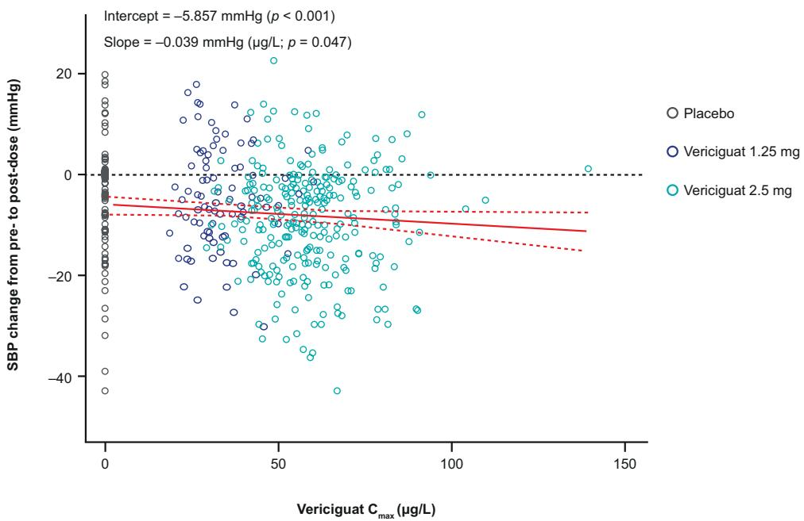
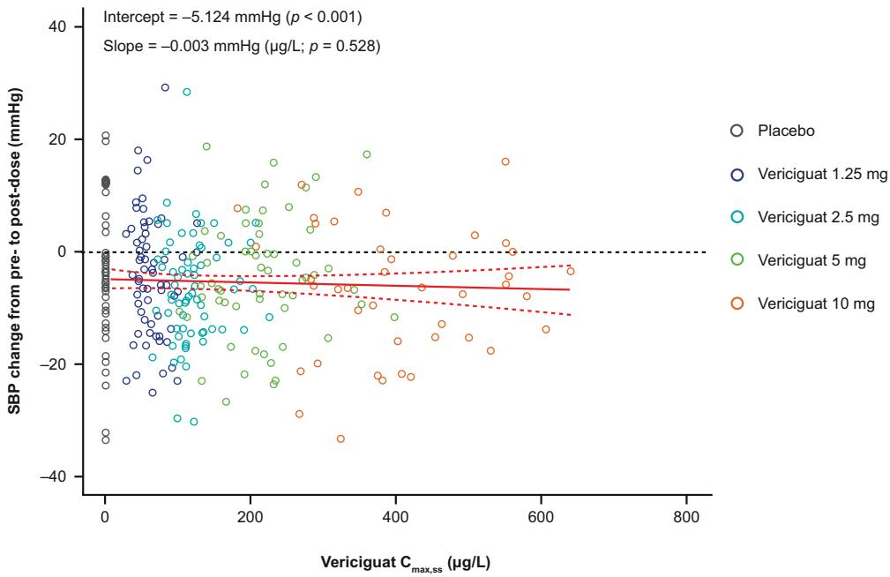
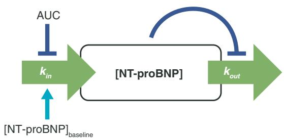
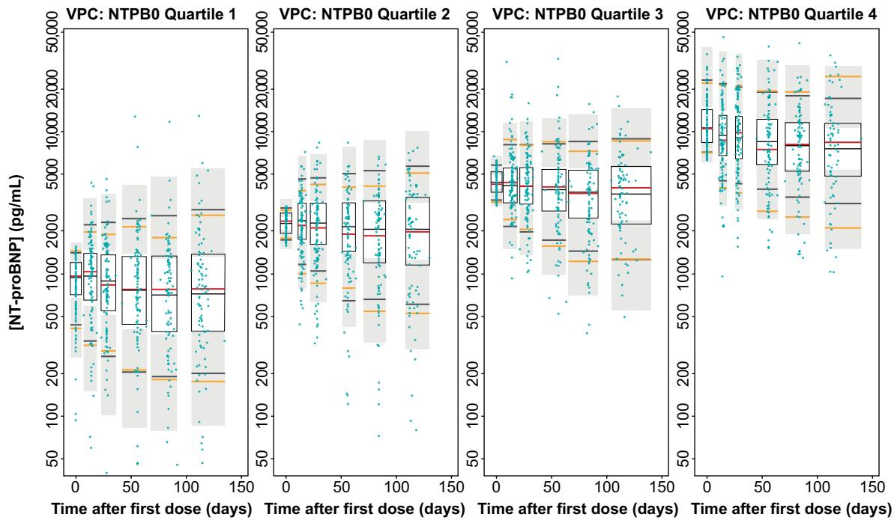
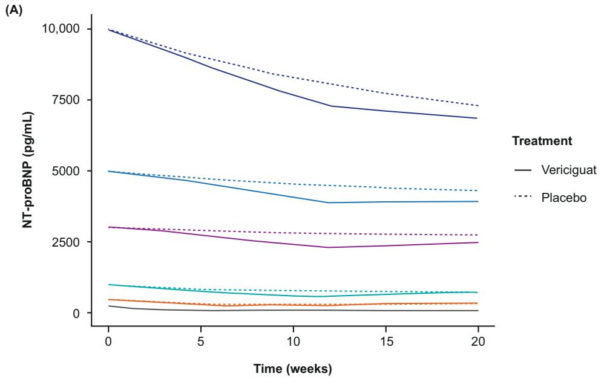
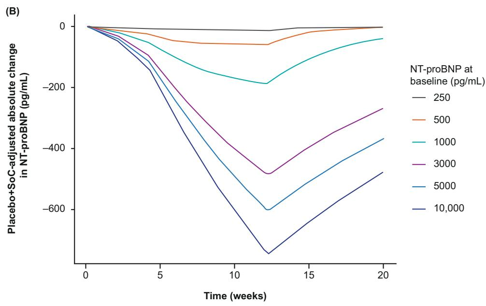
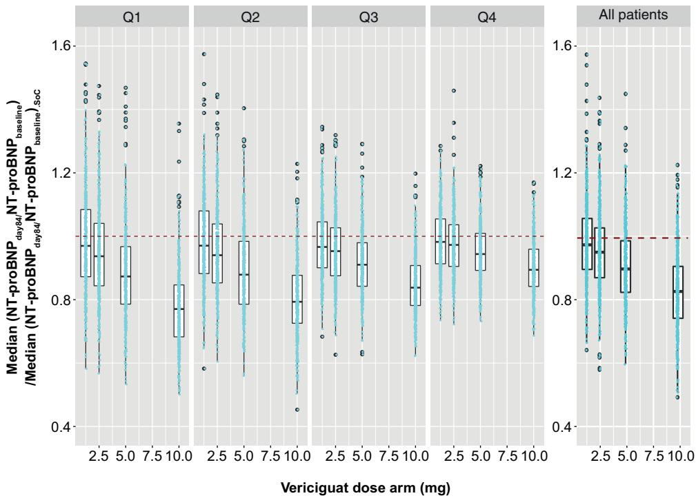

ORIGINAL RESEARCH ARTICLE


# Population Pharmacokinetics and Pharmacodynamics of Vericiguat in Patients with Heart Failure and Reduced Ejection Fraction

Hauke Ruehs1  · Dagmar Klein1  · Matthias Frei1  · Joachim Grevel2  · Rupert Austin2  · Corina Becker3  ·

Lothar Roessig4  · Burkert Pieske5,6,7 · Dirk Garmann1  · Michaela Meyer1

Accepted: 8 April 2021 / Published online: 4 June 2021

© The Author(s) 2021

# Abstract

Background Vericiguat, a stimulator of soluble guanylate cyclase, has been developed as a frst-in-class therapy for worsening chronic heart failure in adults with left ventricular ejection fraction < 45%.

Objective The objective of this article was to characterize the pharmacokinetics and pharmacokinetic variability of vericiguat combined with guideline-directed medical therapy (standard of care), and identify exposure–response relationships for safety (hemodynamics) and pharmacodynamic markers of efcacy (N-terminal pro-B-type natriuretic peptide concentration [NT-proBNP]) in patients with heart failure and left ventricular ejection fraction < 45% in the SOCRATES-REDUCED study (NCT01951625).

Methods Vericiguat and NT-proBNP plasma concentrations in 454 and 432 patients in SOCRATES-REDUCED, respectively, were analyzed using nonlinear mixed-efects modeling.

Results Vericiguat pharmacokinetics were well described by a one-compartment model with apparent clearance, apparent volume of distribution, and absorption rate constant. Age, bodyweight, plasma bilirubin, and creatinine clearance were identifed as signifcant covariates on apparent clearance; sex and bodyweight on apparent volume of distribution; and bodyweight and plasma albumin level on absorption rate constant. Pharmacokinetic/pharmacodynamic analysis showed initial minor and transient efects of vericiguat on blood pressure with low clinical impact. There were no changes in heart rate following initial or repeated vericiguat administration. An exposure-dependent and time-dependent turnover pharmacokinetic/pharmacodynamic model for NT-proBNP described production and elimination rates and an demonstrated exposure-dependent reduction in [NT-proBNP] by vericiguat plus standard of care compared with placebo plus standard of care. This efect was dependent on baseline [NT-proBNP].

Conclusions Vericiguat has predictable pharmacokinetics, with no long-term efects on blood pressure in patients with heart failure and left ventricular ejection fraction < 45%. A pharmacokinetic/pharmacodynamic model described a vericiguat exposure-dependent reduction of NT-proBNP.

Clinical Trial Identifer NCT01951625.

\* Michaela Meyer

michaela.meyer@bayer.com

Pharmacometrics, Bayer AG, Aprather Weg 18a, 42113 Wuppertal, Germany   
2 BAST Inc. Limited, Loughborough, UK   
3 Clinical Pharmacology, Bayer AG, Wuppertal, Germany   
4 Clinical Development, Bayer AG, Wuppertal, Germany   
5 Department of Internal Medicine and Cardiology, Charité University Medicine, Campus Virchow-Klinikum, and German Heart Center, Berlin, Germany   
6 German Center for Cardiovascular Research (DZHK), Partner Site Berlin, Berlin, Germany   
7 Berlin Institute of Health (BIH), Berlin, Germany

# 1 Introduction

Heart failure (HF) with reduced ejection fraction is a major healthcare burden [1–3]. Patients with chronic HF who experience a worsening HF event despite receiving guidelinedirected medical therapy (standard of care [SoC]) represent a large proportion of patients who remain at high risk of morbidity and mortality [4, 5]. N-terminal pro-B-type natriuretic peptide (NT-proBNP) is released in response to ventricular wall stress [6] and is a hallmark biomarker of the presence and severity of HF [7, 8]. Cyclic guanosine monophosphate (cGMP) production via soluble guanylate cyclase (sGC) in the nitric oxide–sGC–cGMP pathway is essential for normal cardiac and vascular function [9–12]. However, the nitric

# Key Points

Vericiguat pharmacokinetics as well as exposure– response relationships for pharmacodynamic markers of safety (hemodynamics) and efcacy (N-terminal pro-Btype natriuretic peptide plasma concentration [NT-proBNP]) were investigated in patients with heart failure and left ventricular ejection fraction < 45%

Vericiguat combined with guideline-directed medical therapy (standard of care) had no long-term efects on blood pressure in patients with heart failure and left ventricular ejection fraction < 45%

Reductions in [NT-proBNP] with vericiguat treatment combined with standard of care were dependent on vericiguat exposure as well as baseline [NT-proBNP] and led to a stronger NT-proBNP decrease with vericiguat than with standard of care alone

oxide–sGC–cGMP pathway is impaired in HF, which leads to a defciency in cGMP [13]. Stimulating sGC to produce cGMP represents a pathway not currently addressed by SoC.

Vericiguat is a frst-in-class direct sGC stimulator for the treatment of adult patients with chronic HF (and left ventricular ejection fraction [LVEF] < 45%) that reduces the risk for the composite endpoint of death from cardiovascular causes or hospitalization [14–16]. Vericiguat (oral tablet formulation, < 15 mg) is rapidly absorbed and demonstrates linear pharmacokinetics in healthy volunteers [17]. The main metabolic pathway of vericiguat is glucuronidation via uridine diphosphate-glucuronosyltransferase (UGT) isoforms UGT1A1 and UGT1A9 [18], expressed in the liver and both liver and kidneys, respectively [19, 20]. The pharmacodynamic (PD) efects on the safety and efcacy of vericiguat treatment were evaluated in the phase II study SOluble guanylate Cyclase stimulatoR in heArT failurE patientS (SOCRATES)-REDUCED (NCT01951625 [21]) and in the phase III VICTORIA study [15] in patients with HF and a reduced LVEF (< 45%).

Evaluation of SOCRATES-REDUCED data showed vericiguat ≤ 10 mg was well tolerated, with no signifcant efect on change in NT-proBNP at 12 weeks (pooled vericiguat 2.5, 5, and 10 mg on top of SoC compared with placebo on top of SoC) [21]. However, exploratory secondary analyses of change in log-transformed NT-proBNP level from baseline to 12 weeks, using linear regression modeling, suggested a dose–response relationship (p < 0.02).

In this article, SOCRATES-REDUCED data are used to describe the population pharmacokinetics of vericiguat and pharmacokinetic (PK) variability and to investigate the exposure–response relationships for PD markers of safety (hemodynamics) and efcacy (NT-proBNP). A semi-mechanistic PK/PD model was also developed to characterize the exposure–NT-proBNP relationship corresponding to the previously suggested dose–response relationship.

# 2 Methods

# 2.1 Study Design

The design of SOCRATES-REDUCED, a multicenter, randomized, double-blind, placebo-controlled, dose-fnding, phase II study, has been described previously [21, 22]. In brief, 456 patients with HF and LVEF < 45% were randomized to fve equally sized treatment groups (one placebo group and four vericiguat treatment groups). Active treatment groups had a target maximal daily dose of 1.25, 2.5, 5, and 10 mg of vericiguat. All active treatment groups, except the 1.25 mg group, started at vericiguat 2.5 mg once daily (visit 1). Up-titration to target dose was based on blood pressure (BP) values and tolerability at week 2 (visit 2) and week 4 (visit 3) [21]. Treatment duration was 12 weeks.

# 2.2 PK Data Sampling

Blood samples were taken at baseline/trough at visits 2–4 (prior to study drug) and at Visit 5; at Visits 1 and 3, 1–3 and 4–6 h post-study drug dosing; and at Visits 2 and 4, 1–3 h post-study drug dosing. This sparse PK sampling was demonstrated to be suitable for developing robust population PK models prior to implementing into the SOCRATES-REDUCED phase II study. Following a simulation re-estimation approach, structural population PK models were developed on virtual sparse PK samples derived from physiologically based PK predictions for virtual patients with HF. The individual post-hoc estimates for area under the plasma concentration–time curve (AUC) and maximum plasma drug concentration $( C _ { \mathrm { m a x } } )$ from the patient population PK model were compared with those derived from the patient physiologically based PK model. As all model parameters were estimated with acceptable uncertainty, we concluded that the population PK model for vericiguat would be sufciently informed with this sparse sampling design (data not shown). A summary of the PK sampling is provided in Table 1 of the Electronic Supplementary Material (ESM). The methodologies regarding the PK assessments of vericiguat have been previously described [23, 24]. Method validation and analysis of the study samples were performed in accordance with the bioanalytical method validation guidance for industry of the US Food and Drug Administration [25].

# 2.3 PD Data Sampling

Pharmacodynamic data were obtained after patients had rested for at least 10 minutes in a sitting position. Vital signs (i.e., systolic BP [SBP] and heart rate [HR]) were measured at 2-minute intervals prior to and at 2 h ± 15 minutes poststudy drug dosing at screening and visits 1–5. Plasma concentrations of NT-proBNP ([NT-proBNP]) were measured at screening and at visits 1–5 and were analyzed with the Elecsys proBNP II Kit (Roche Diagnostics, Indianapolis, IN, USA).

# 2.4 Population PK Modeling

Data were analyzed via nonlinear mixed-efects modeling using NONMEM (Icon Development Solutions, Ellicott City, Maryland, USA, Version 7.2) with the Navigator workbench (Mango Solutions, Chippenham, UK, Version 9.1.5146) in a Red Hat Enterprise Linux 6.3 environment. Models were evaluated with R scripts (The R Foundation for Statistical Computing, Vienna, Austria, Version 3.2.5 [26]) and PsN (Version 3.4.1 with Perl, Version 5.10.1).

First, a PK base model was developed that provided the compartmental structure of the model and defined the parameters in which inter-individual variability (IIV) was quantified. A PK covariate model was then developed in which covariates, such as demographics and measurable physiological information, were tested for between-subject variability. As the metabolic pathway of vericiguat involves glucuronidation via UGTs in the liver and kidneys, bilirubin, serum creatinine, creatinine clearance $\operatorname { \left( C L _ { C R } \right) }$ [27], and $\operatorname { C L } _ { \operatorname { C R } }$ standardized to a body weight of 70 kg (standardized $\operatorname { C L } _ { \operatorname { C R } } )$ [28] were investigated as covariates. Following graphical analysis, an exponential function was used to implement continuous covariates (i.e., division of the individual value by the population median and the result being raised to an estimated power). Covariates were manually included stepwise into the model $\operatorname { i f } \chi ^ { 2 }$ testing showed significance $( p < 0 . 0 1 )$ [29]. Subsequently, covariates were stepwise removed if they did not show a significant worsening $( p < 0 . 0 0 1 )$ , yielding the final covariate model.

Deterministic simulations were carried out to assess the quantitative translation of the 5th and 95th percentiles of a covariate from the fnal model into relative change in PK exposure parameters (AUC and $C _ { \mathrm { m a x } }$ at steady state) compared with a typical patient. To illustrate the robustness and the predictive performance of the fnal covariate model, prediction-corrected visual predictive checks (VPCs) were conducted for vericiguat treatment arms [30, 31]. Visual predictive checks (on visits 1–5) showed individual vericiguat concentration–time data, 90% prediction intervals, and the median with the corresponding 95% confdence intervals (CIs) of 1000 stochastic simulations based on the original dataset using the fnal vericiguat population PK model.

Individual estimates of PK parameters were used in the simulation of the AUC variable for each patient. The variable for vericiguat exposure used in the PK/PD modeling was the 24-h AUC updated at 24-h intervals from the frst vericiguat dose. The PK base model was used to generate PK/PD simulations.

# 2.5 PK/PD Correlation Analysis

Individual parameter estimates were used to calculate individual exposures on day 1 and at steady state; patient dropouts were not included. On day 1, $C _ { \mathrm { m a x } }$ and area under the plasma concentration–time curve from time 0 to $2 4 \mathrm { h } \left( \mathrm { A U C } _ { 2 4 } \right)$ were determined from the frst intake of the study drug to the subsequent intake of the study drug or at maximum 24 h. On the last treatment day, the maximum observed plasma drug concentration and area under the plasma concentration–time curve from the last intake of study drug until 24 h after $( C _ { \mathrm { m a x , s s } }$ and $\mathrm { A U C } _ { \tau , \mathrm { s s } } ,$ respectively) were determined. Linear regression was performed with the “lm” function in R, Version 3.2.5 [26]. Regression lines and corresponding 95% CIs were plotted. Signifcance was determined if p values were <0.05.

To investigate hemodynamic efects of vericiguat at the start and end of treatment, $C _ { \mathrm { m a x } }$ was correlated with the change in SBP and HR from pre-dose to post-dose (both visit 1), and the $C _ { \mathrm { m a x , s s } }$ was correlated with the change of SBP and of HR from pre- to post-dose at week 8 (visit 4), assuming steady state of vericiguat was reached. Week 12 (visit 5) values were excluded from correlation analyses because the last drug intake occurred 1 day before visit 5 and, therefore, vericiguat plasma concentrations would be expected to be below steady-state trough concentrations.

# 2.6 PK/PD Modeling of NT‑proBNP

A PK/PD turnover model was developed to describe the relationship between vericiguat exposure and the time course of NT-proBNP. The aim was to use simulations from the model to visualize the NT-proBNP time profle from when vericiguat was administered on top of SoC during the frst 12 weeks and over the 8 weeks following cessation of study drug, and to compare this with the net simulated efect of SoC. Overall, 20 weeks were simulated.

To illustrate the robustness and the predictive performance of the PK/NT-proBNP model, VPCs were conducted for absolute [NT-proBNP] over time for all patients and for $\mathrm { N T - p r o B N P } _ { \mathrm { b a s e l i n e } }$ quartiles of the population:

• Lowest quartile: $[ \mathrm { N T - p r o B N P } ] _ { \mathrm { b a s e l i n e } } \leq 1 5 5 9$ pg/mL (lowest $\mathrm { \Delta [ N T - p r o B N P ] _ { b a s e l i n e } }$ value was 94.1 pg/mL).   
• Second quartile: 1559 $\mathrm { p g / m L } < \mathrm { [ N T - p r o B N P ] _ { b a s e l i n e } }$ ≤ 3000 pg/mL.   
• Third quartile: 3000 pg/mL < [NT-proBNP]baseline $\mathrm { p g / m L } < \mathrm { [ N T \mathrm { - } p r o B N P ] _ { b a s e l i n e } }$ ≤ 6246 pg/mL.   
• Fourth quartile: [NT-proBNP]baseline > 6246 pg/mL (highest $\mathrm { \Delta [ N T - p r o B N P ] _ { b a s e l i n e } }$ value was 69,720 pg/mL).

$\mathrm { \Delta [ N T - p r o B N P ] _ { b a s e l i n e } }$ ranged from 94.1 pg/mL to 69,720 pg/mL. To illustrate the behavior of the model, time profles for typical individuals with six $\mathrm { \Delta [ N T - p r o B N P ] _ { b a s e l i n e } }$ values were simulated (250, 500, 1000, 3000, 5000, and 10,000 pg/mL). In addition, the absolute change in [NT-proBNP] from baseline corrected by placebo (SoC arm) over time was visualized.

Finally, simulations were carried out according to the design of the study for scenarios of the fve cohorts (one placebo and four treatment arms), each with 500 patients, and were used to visualize the placebo-corrected, dose-dependent efect of vericiguat on changes in [NT-proBNP] from baseline. Simulation results were summarized by boxplots of the ratio below (Eq. 1), calculated from each simulation repeat relative to SoC. Box-Cox transformation was applied, followed by retransformation back to the original scale.

$$
\frac {\text { Median } \left(\frac {[ \mathrm{NT} - \text { proBNP } ] _ {\text { day84 }}}{[ \mathrm{NT} - \text { proBNP } ] _ {\text { baseline }}}\right)}{\text { Median } \left(\frac {[ \mathrm{NT} - \text { proBNP } ] _ {\text { day84 }}}{[ \mathrm{NT} - \text { proBNP } ] _ {\text { baseline }}}\right) _ {\text { SoC }}} \tag {1}
$$

# 3 Results

# 3.1 Data

For the PK analysis, data from 454 patients with PK samples from 456 randomized patients [21] were available. A total of 363 patients received vericiguat treatment during the study, from which 3376 plasma samples were eligible for exposure analysis. Twenty-two plasma concentrations were excluded, as the dosing records of the respective patients were not explicit for the last dosing event; 17 plasma concentrations of patients within the placebo arm were excluded because of levels above the lower limit of quantifcation. For the PK/PD correlation analysis of SBP and HR, paired $C _ { \mathrm { m a x } }$ and PD values available from visits 1 and 2 were used. For the PK/PD analysis of NT-proBNP, 2347 eligible samples were collected from 432 patients (Fig. 1). At baseline, the measured [NT-proBNP] ranged from 94.1 pg/mL to 69,724  pg/mL. Although the inclusion criterion of the study was ≥ 1000 pg/mL for screening at local laboratories, the cut-of for central laboratory NT-proBNP measurement may have been lower during randomization.

# 3.2 Base Model

The patients’ PK data were sufciently described by a onecompartment model parameterized by apparent clearance (CL/F) and apparent volume of distribution (V/F), as only PK data after oral absorption were available. The absorption process was described by an absorption rate constant $( k _ { \mathrm { a } } )$ . Including a lag time did not improve the ft of the model. The parameters CL/F and V/F showed a high degree of correlation that was eventually included in the model. Population mean estimates (inter-individual variability [%]) for CL/F, V/F, and $k _ { \mathrm { a } }$ were 1.3 L/h (38.5), 38.9 L (28.2), and 1.5 1/h (103.0), respectively. Relative standard error and shrinkage were acceptable for all parameters, IIV was in an acceptable range, although rather high for $k _ { \mathrm { a } } .$ . The high IIV for $k _ { \mathrm { a } }$ was not unexpected in this population with such severe disease and within which food intake is less standardized than in a phase I trial (especially with respect to composition and timing relative to drug administration), thus refecting a more “real-world” setting. Model parameters of the PK base model are given in Table 1. An overview of the model development is shown in Table 2 of the ESM.

# 3.3 Covariate Model

Prior to the covariate analysis, the parameter describing the correlation between CL/F and V/F was removed from the PK base model, as it seemed likely that the correlation arose from a common covariate. By visual inspection, the correlation between covariates ranged from low (e.g., standardized $\mathrm { C L } _ { \mathrm { C R } }$ vs age) to strongly correlated (e.g., lean body mass vs body mass; data not shown).

Visual inspection of the parameter vs covariate plots from the PK base model indicated that body size afected systemic clearance and V/F. Thus, the model parameters CL/F and V/F were allometrically scaled by bodyweight [32] (Eqs. 2 and 3), which resulted in a signifcant decrease of the objective function value.

$$
\mathrm{CL} / F _ {i} = \mathrm{CL} / F \times \left(\frac {\text { body   weight } _ {i}}{\text { median   body   weight }}\right) ^ {3 / 4} \tag {2}
$$

$$
V / F _ {i} = V / F \times \left(\frac {\text { body   weight } _ {i}}{\text { median   body   weight }}\right) ^ {1} \tag {3}
$$

Other relationships examined were age, bilirubin level, and standardized $\mathrm { C L } _ { \mathrm { C R } }$ on CL/F, sex on V/F, and albumin, bodyweight, and race on $k _ { \mathrm { a } } ~ ( p < 0 . 0 1 )$ , with bodyweight, $\mathrm { C L } _ { \mathrm { C R } } ,$ albumin, and bilirubin being time-varying covariates. Race on $k _ { \mathrm { a } }$ was subsequently eliminated $( p < 0 . 0 0 1 )$ ). Allometric scaling of CL/F and V/F resulted in a reduction exceeding 30% of the corresponding IIV and a large decrease of the objective function value. Inclusion of age as a covariate on CL/F reduced IIV by 14.7%, whereas the other covariate relationships (sex, ${ \mathrm { C L } } _ { \mathrm { C R } } ,$ bilirubin, and albumin) had efects of < 10% (Table 3 of the ESM). Correlation between age, bodyweight, and standardized $\operatorname { C L } _ { \operatorname { C R } }$ was low to moderate, enabling the diferentiation between their efect on CL/F.



<details>
<summary>other</summary>

456 randomized
| Category | Sub-category | Value |
| :--- | :--- | :--- |
| 456 randomized | 92 randomized to placebo | 92 |
| 456 randomized | 91 randomized to vericiguat | 91 |
| 456 randomized | 91 randomized to vericiguat | 91 |
| 456 randomized | 91 randomized to vericiguat | 91 |
| 456 randomized | 91 randomized to vericiguat | 91 |
| 456 randomized | 91 randomized to vericiguat | 91 |
| 456 randomized | 91 randomized to vericiguat | 91 |
| 456 randomized | 91 randomized to vericiguat | 91 |
| 456 randomized | 91 randomized to vericiguat | 91 |
| 456 randomized | 91 randomized to vericiguat | 91 |
| 456 randomized | 91 randomized to vericiguat | 91 |
| 456 randomized | 91 randomly to placebo | 92 |
| 456 randomized to placebo | 91 randomly to vericiguat | 91 |
| 456 randomized to placebo | 91 randomly to vericiguat | 91 |
| 456 randomized to placebo | 91 randomly to vericiguat | 91 |
| 456 randomized to placebo | 91 randomly to vericiguat | 91 |
| 456 randomized to placebo | 91 randomly to vericiguat | 91 |
| 456 randomized (N/A) | 73 completed treatment | 72 |
| 456 randomized (N/A) | 70 completed treatment | 70 |
| 456 randomized (N/A) | 76 completed treatment | 76 |
| 456 randomized (N/A) | 69 completed treatment | 69 |
| 456 randomized (N/A) | 74 completed treatment | 74 |
| 456 randomized (N/A) - Validation for PK analysis (Eligible samples N/A) | 856 below LLOQ | 856 |
| 456 randomized (N/A) - Validation for PK analysis (Eligible samples N/A) - Implantsable | 17 implausible | - |
| 456 randomized (N/A) - Validation for PK analysis (Eligible samples N/A) - Inclusion of PK/PD correlation analysis | - | - |
| 456 randomized (N/A) - Validation for PK/PD correlation analysis - Visit 1: SBP/HR | - | - |
| 456 randomized (N/A) - Validation for PK/PD correlation analysis - Visit 4: SBP/HR | - | - |
| 456 randomized (N/A) - Validation for PK/PD correlation analysis - Visit 1: SBP/HR | - | - |
| 456 randomized (N/A) - Validation for PK/PD correlation analysis - Visit 4: SBP/HR | - | - |
| 456 randomized (N/A) - Validation for PK/PD correlation analysis - Visit 1: SBP/HR | - | 3 below LLOQ |
</details>

Fig. 1 Flow of patients through the SOCRATES-REDUCED study and eligible samples for vericiguat pharmacokinetic (PK) and PK/pharmacodynamic (PD) analyses. HR heart rate, LLOQ lower limit of quantifcation, N/A not applicable, SBP systolic blood pressure

None of the additional covariates, including baseline NT-proBNP, atrial fibrillation, New York Heart Association class, or time-varying covariates examined, such

as concomitant medication (i.e., cytochrome P450 3A4, P-glycoprotein, UGT1A9, breast cancer resistant protein, and UGT1A1 inhibitors), were signifcant. A subsequent test of the impact of dose on the bioavailability parameter F revealed that F decreased with increasing dose (100% at 1.25 mg to 89% at 2.5 mg, 79% at 5 mg, and 71% at 10 mg). This corresponds to a decreased dose-normalized geometric mean of the apparent $\mathrm { A U C } _ { \tau ,  { \mathrm { s s } } }$ from 100% at 1.25 mg to 82% at 10 mg. The fxed-efects and random-efects parameters and the associated precisions (relative standard error expressed as percent; % relative standard error) for the fnal vericiguat model are shown in Table 2. Descriptive statistics of PK estimates of the fnal covariate PK model with dose are summarized in Table 4 of the ESM.

Table 1 Model parameters of the pharmacokinetic base model 

<table><tr><td>Parameter</td><td>Value</td><td>RSE (%)</td><td>Inter-individual variability CV (\%)a</td><td>RSE (%)</td><td>Shrinkage (%)</td></tr><tr><td>CL/F (L/h)</td><td>1.3</td><td>2.09</td><td>38.47</td><td>8.33</td><td>6.18d</td></tr><tr><td>Correlation (CL/F~V/F)</td><td>0.70</td><td>11.9</td><td></td><td></td><td></td></tr><tr><td>V/F (L)</td><td>38.9</td><td>2.18</td><td>28.23</td><td>12.5</td><td>19.5d</td></tr><tr><td>ka(1/h)</td><td>1.5</td><td>9.53</td><td>102.99</td><td>18.5</td><td>37.2d</td></tr><tr><td>Proportional error (%)</td><td>26.02b</td><td>4.37</td><td></td><td></td><td>8.91e</td></tr><tr><td>Additive error (μg/L)</td><td>7.81c</td><td>14.6</td><td></td><td></td><td>8.91e</td></tr></table>

CL/F apparent clearance, CV coefcient of variation, $k _ { a }$ absorption rate constant, PK pharmacokinetic, RSE relative standard error, V/F apparent volume of distribution

a The CV% is calculated by SQRT[EXP(OMEGA2 )−1] × 100 [40]

b The CV is calculated by SQRT(SIGMA2 ) × 100

c The standard deviation is calculated by SQRT(SIGMA2 )

d The shrinkage is calculated by 100% × [1 − SD(ETA)/SQRT(OMEGA2 )]

e The Epsilon shrinkage is calculated by 100% × [1 − SD(IWRES)]

Prediction-corrected VPCs confrmed the qualifcation of the fnal covariate model for vericiguat (Fig. 2). The VPCs revealed that PK model simulations concur with the data and support the robustness of the population model. Goodnessof-ft plots for the fnal population PK model are depicted in Fig. 1 of the ESM. The infuence of signifcant covariates on relative PK exposure change is visualized as forest plots in Fig. 2 of the ESM.

# 3.4 PK/PD Correlation Analysis

Linear regression analysis showed a short-term hemodynamic response of an exposure-dependent decrease of SBP on day 1 after vericiguat intake (Fig. 3). Linear regression of SBP change vs $C _ { \mathrm { m a x } }$ difered from 0 $( p = 0 . 0 4 7 )$ . However, at visit 4, there was no longer a signifcant dependency of SBP on vericiguat exposure $( p = 0 . 5 2 8 ;$ ; Fig. 4; Table 5 of the ESM). For HR, no changes from pre-dose to post-dose were observed for visit 1 or visit 4 (data not shown).

# 3.5 Turnover PK/PD Model for NT‑proBNP

The established semi-mechanistic exposure–response model for NT-proBNP was a turnover model describing the dynamics of plasma NT-proBNP concentrations (Fig. 5 and Eq. 4), where [NT-proBNP] is the plasma concentration of NT-proBNP, $k _ { i n }$ is a zero-order rate constant describing the production of NT-proBNP, $k _ { \mathrm { o u t } }$ is a frst-order rate constant describing the elimination of NT-proBNP, and $\mathrm { \Delta [ N T - p r o B N P ] _ { b a s e l i n e } }$ is the plasma NT-proBNP concentration at baseline. $k _ { \mathrm { i n } }$ and $k _ { \mathrm { o u t } }$ were not infuenced by covariates, and IIV was included in $k _ { \mathrm { i n } }$ and $[ \mathrm { N T - p r o B N P } ] _ { \mathrm { b a s e l i n e } }$ . Based on previously reported data [33], a dependence of $k _ { \mathrm { o u t } }$ on the model-predicted [NT-proBNP] was considered, which improved the model.

In the resultant model, k $k _ { \mathrm { o u t \_ m a x } }$ denotes the maximum value of $k _ { \mathrm { o u t } } ,$ which could be reduced by increasing [NT-proBNP] by a proportion given by the maximal efect $( E _ { \mathrm { m a x } } ) _ { \mathrm { . } }$ The concentration of a drug that gives half-maximal response $\mathrm { ( E C _ { 5 0 } ) }$ refects [NT-proBNP], whereby the inhibition of $k _ { \mathrm { o u t \_ m a x } }$ is half its maximum extent (Eq. 5).

The time-varying 24-h AUC of vericiguat inhibits $k _ { i n }$ through a linear drug efect model with parameter active treatment efect (ATRT; Eq. 6). The resulting Δ objective function value of −5.00 was signifcant at $p = 0 . 0 5$ but not at $p = 0 . 0 1$ according to the $\chi ^ { 2 }$ distribution. The 95% CIs around all parameter estimates from the NT-proBNP model, derived from a bootstrap run that utilized 500 resamplings of the original dataset, exclude the null value of zero (Table 3). Of the 500 bootstrap runs, 488 completed with successful minimization and only six were <0, indicating that the observation of a statistically signifcant positive estimate of ATRT was unlikely to have been infuenced by a small number of patients who responded particularly strongly to vericiguat treatment.

$$
\frac {\mathrm{d} \left[ \mathrm{NT-proBNP} \right]}{\mathrm{d} t} = k _ {\text {in}} - k _ {\text {out}} \times \left[ \mathrm{NT-proBNP} \right] \tag {4}
$$

$$
k _ {\text { out }} = k _ {\text { out\_max }} \times \left(1 - \frac {E _ {\max} \times [ \mathrm{NT-proBNP} ]}{E C _ {5 0} + [ \mathrm{NT-proBNP} ]}\right) \tag {5}
$$

$$
\begin{array}{l} k _ {\text { in }} = T V k _ {\text { in }} \times \left(1 + \theta_ {k _ {\text { in }}, \mathrm{NT-proBNP}} \times \left(\ln \left(\left[ \mathrm{NT-proBNP} \right] _ {\text { baseline }}\right) - 8. 0 3\right)\right) \\ \times (1 - \mathrm{ATRT} \times \mathrm{AUC}) \tag {6} \\ \end{array}
$$

Table 2 Model parameters of the fnal pharmacokinetic covariate model with dose 

<table><tr><td>Parameter</td><td>Value</td><td>RSE (%)</td><td>Inter-individual variability CV (\%)a</td><td>RSE (%)</td><td>Shrinkage (%)</td></tr><tr><td>CL/F (L/h)</td><td>1.24</td><td>3.19</td><td>25.1</td><td>9.23</td><td> $10.2^e$ </td></tr><tr><td>V/F (L)</td><td>34.3</td><td>2.12</td><td>21.0</td><td>16.5</td><td> $34.7^e$ </td></tr><tr><td> $k_a$ (1/h)</td><td>1.29</td><td>9.54</td><td>117</td><td>16.7</td><td> $35.2^e$ </td></tr><tr><td> $\theta_{\text{CL,age}}$ </td><td>-0.418</td><td>20.5</td><td></td><td></td><td></td></tr><tr><td> $\theta_{\text{CL,bodyweight}}$ </td><td> $0.75^b$ </td><td>n.a.</td><td></td><td></td><td></td></tr><tr><td> $\theta_{\text{CL,standardized creatinine clearance}}$ </td><td>0.164</td><td>26.1</td><td></td><td></td><td></td></tr><tr><td> $\theta_{\text{CL,bilirubin}}$ </td><td>-0.072</td><td>26.1</td><td></td><td></td><td></td></tr><tr><td> $\theta_{\text{V,bodyweight}}$ </td><td> $1.00^b$ </td><td>n.a.</td><td></td><td></td><td></td></tr><tr><td> $\theta_{\text{V,sex}}$ </td><td>0.850</td><td>4.09</td><td></td><td></td><td></td></tr><tr><td> $\theta_{\text{ka,bodyweight}}$ </td><td>1.28</td><td>25.2</td><td></td><td></td><td></td></tr><tr><td> $\theta_{\text{ka,albumin}}$ </td><td>2.37</td><td>26.1</td><td></td><td></td><td></td></tr><tr><td> $\theta_{\text{F,dose≤1.25 mg}}$ </td><td>1.08</td><td>2.62</td><td></td><td></td><td></td></tr><tr><td> $\theta_{\text{F,dose=5 mg}}$ </td><td>0.867</td><td>1.94</td><td></td><td></td><td></td></tr><tr><td> $\theta_{\text{F,dose=10 mg}}$ </td><td>0.793</td><td>2.60</td><td></td><td></td><td></td></tr><tr><td>Proportional error (%)</td><td> $25.7^c$ </td><td>4.21</td><td></td><td></td><td> $8.4^f$ </td></tr><tr><td>Additive error ( $\mu g/L$ )</td><td> $7.27^d$ </td><td>14.9</td><td></td><td></td><td> $8.4^f$ </td></tr></table>

CL/F apparent clearance, CV coefcient of variation, F estimate of absolute bioavailability dependent on dose size, $k _ { a }$ absorption rate constant, RSE relative standard error, V/F apparent volume of distribution   
a The CV% is calculated by SQRT[EXP(OMEGA2 )−1] × 100   
b Fixed value   
c The CV is calculated by SQRT(SIGMA2 ) × 100   
d The standard deviation is calculated by SQRT(SIGMA2 )   
e ETA shrinkage is calculated by 100% × [1 − SD(ETA)/SQRT(OMEGA2 )]   
f Epsilon shrinkage is calculated by 100% × [1−SD(IWRES)]   
Parameter covariate relations were described as:

$$
F = \left\{ \begin{array}{l} 1. 0 8, \text {Dose} \leq 1. 2 5 \mathrm{mg} \\ 1, \text {Dose} = 2. 5 \mathrm{mg} \\ 0. 8 6 7, \text {Dose} \leq 5 \mathrm{mg} \\ 0. 7 9 3, \text {Dose} \leq 1 0 \mathrm{mg} \end{array} \right.
$$

$$
\frac {\mathrm{CL}}{F} = 1. 2 4 \times \left(\frac {\text {Age}}{6 8}\right) ^ {- 0. 4 1 8} \times \left(\frac {\text {Bilirubin}}{0 . 6}\right) ^ {- 0. 0 7 5} \times \left(\frac {\mathrm{CL} _ {\mathrm{Cr,st}}}{1 0 0}\right) ^ {0. 1 6 4} \times \left(\frac {\text {Weight}}{7 0}\right) ^ {3 / 4}
$$

$$
\frac {V}{F} = 3. 4 3 \times \mathrm{SEX} \times \left(\frac {\text { Weight }}{7 0}\right), \text {   with   } \mathrm{SEX} = \left\{ \begin{array}{l l} 1, & \text { male } \\ 0. 8 5 0, & \text { female } \end{array} \right.
$$

$$
k _ {\mathrm{a}} = 1. 2 9 \times \left(\frac {\text { Albumin }}{4 . 0}\right) ^ {2. 3 7} \times \left(\frac {\text { Weight }}{7 0}\right) ^ {1. 2 8}
$$

# 3.5.1 Qualifcation of the NT‑proBNP Model

The NT-proBNP model was qualifed by a VPC using 2000 repeat simulations of the data set. The respective VPC, stratifed by quartiles of $[ \mathrm { N T - p r o B N P } ] _ { \mathrm { b a s e l i n e } } ,$ is given in Fig. 6. For each quartile, the model adequately described the central tendency and the data variability.

# 3.5.2 Application of the NT‑proBNP Model

The PK/PD model for NT-proBNP was used to simulate time profles for 20 weeks with vericiguat 10 mg on top of SoC vs SoC alone (placebo group) for $\mathrm { \Delta [ N T - p r o B N P ] _ { b a s e l i n e } }$ values from 250 to 10,000 pg/mL (Fig. 7). Overall, vericiguat, on top of SoC, led to a stronger NT-proBNP decrease than SoC alone for all simulated $\mathrm { \Delta [ N T - p r o B N P ] _ { b a s e l i n e } }$ categories. Furthermore, simulations using patient data assigned to quartiles of $\mathrm { \Delta [ N T - p r o B N P ] _ { b a s e l i n e } }$ and box plots of NT-proBNP

  
Fig. 2 Prediction-corrected visual predictive checks of the fnal covariate model at visits 1–5. The upper row shows the normal scale and the lower row shows the log scale of the prediction-corrected concentrations. In Visits 2–5, time is shown ± 24 h around the planned time. Solid purple line: median prediction-corrected data.   
Dashed purple lines: 90% prediction interval of prediction-corrected data. Solid red line: median model predictions. Solid blue lines: 90% interval. Boxes indicate the 95% confdence intervals around the corresponding model predictions. Circles: prediction-corrected observed vericiguat plasma concentration–time data

Fig. 3 Systolic blood pressure (SBP) change vs vericiguat maximum observed concentration $( C _ { \mathrm { m a x } } ) .$ Correlation of $C _ { \mathrm { m a x } }$ with change in SBP from pre-dose to post-dose (frst dose of study medication) at visit 1. Open symbols represent data from individual patients belonging to diferent treatment arms (black: placebo, dark blue: 1.25 mg, teal: 2.5 mg). The red solid line depicts the linear regression model. The 95% confdence interval (CI) of the regression model is represented by red dashed lines   


PK/PD showing a simulation of vericiguat on top of SoC, expressed as a ratio of SoC alone, were generated (Fig. 8). Simulation results from each actively treated cohort are shown relative to SoC. The relative efectiveness of vericiguat treatment in lowering [NT-proBNP] decreases with

increasing quartile of $[ \mathrm { N T - p r o B N P } ] _ { \mathrm { b a s e l i n e } } .$ Each category within each of the fve boxplot panels in Fig. 8 contains the results from 500 repeated simulations, each involving approximately 125 patients.

Fig. 4 Systolic blood pressure (SBP) change vs vericiguat maximum observed concentration at steady state $( C _ { \mathrm { m a x , s s } } ) .$ Correlation of $C _ { \mathrm { m a x , s s } }$ with pre-dose to post-dose change of SBP at week 8 (visit 4). Open symbols represent data from individual patients belonging to diferent treatment arms (black: placebo, dark blue: 1.25 mg, teal: 2.5 mg, green: 5 mg, orange: 10 mg). The red solid line depicts the linear regression model. The 95% confdence interval (CI) of the regression model is represented by dashed lines   


<details>
<summary>scatter</summary>

| Vericiguat C_max,ss (μg/L) | SBP change from pre- to post-dose (mmHg) |
| -------------------------- | ---------------------------------------- |
| Placebo                   | -5.124                                   |
| Vericiguat 1.25 mg         | -0.003                                   |
| Vericiguat 2.5 mg          | -0.003                                   |
| Vericiguat 5 mg            | -0.003                                   |
| Vericiguat 10 mg           | -0.003                                   |
</details>



<details>
<summary>flowchart</summary>

```mermaid
graph LR
    A["AUC"] --> B["ktin"]
    B --> C["[NT-proBNP"]]
    C --> D["kout"]
    D --> E["ktin"]
    E --> F["[NT-proBNP"]baseline]
    F --> G["↑"]
```
</details>

Fig. 5 Scheme visualizing the structure of the pharmacokinetic/ pharmacodynamic (PK/PD) turnover model for N-terminal pro-Btype natriuretic peptide (NT-proBNP). [NT-proBNP] is the plasma concentration of NT-proBNP, $\mathbf { k } _ { \mathrm { i n } }$ is a zero-order rate describing the production of NT-proBNP, and $\mathbf { k _ { \mathrm { o u t } } }$ is a frst-order rate constant describing the elimination of NT-proBNP. Area under the plasma concentration–time curve (AUC) is the exposure of vericiguat and $\mathrm { \Delta [ N T - p r o B N P ] _ { b a s e l i n e } }$ is the NT-proBNP concentration at baseline

# 4 Discussion

# 4.1 PK Model

In this paper, we describe the development of the first population PK model for vericiguat in adult patients with chronic HF and LVEF < 45%. The results demonstrate that vericiguat has a predictable PK profle and confrmed the results from early clinical studies in healthy volunteers [17], with the exception of a dose-linear bioavailability. A slight decrease in bioavailability with increasing dose was observed in the dose range tested here (multiple doses of ≤ 10 mg). This observation had not been distinct in exploratory dose proportionality analyses in single-dose studies (vericiguat ≤ 15 mg) [17], likely due to variability covering the efect at small sample sizes. Single-dose studies demonstrated close to linear pharmacokinetics of vericiguat for AUC and a slight trend in decreasing $C _ { \mathrm { m a x } }$ with increasing doses.

The covariate analysis showed age had the most pronounced efect on the pharmacokinetics of all tested parameters, with increased age correlating with reduced CL/F. In this patient population, higher age was associated with more severe disease phenotypes, indicated by baseline NTproBNP and reduced renal function. As bodyweight also correlated with CL/F and V/F, the model parameters CL/F and V/F were allometrically scaled by bodyweight, improving the model ft. Creatinine clearance was also a signifcant covariate, with <10% efect on clearance. In line with this, urinary excretion of vericiguat in healthy volunteers was < 10% [17].

Bilirubin level was negatively correlated with CL/F, which may be due to the glucuronidation and excretion of bilirubin via bile, similar to vericiguat [34]. Reduced biliary secretion (and thus vericiguat clearance) will likely be associated with higher levels of bilirubin (and vericiguat) in plasma. Finally, sex was identifed as a covariate for V/F, which can be explained by the diferences in body composition of male and female individuals. No infuence of race or concomitant medication on the pharmacokinetics of vericiguat was observed.

Visual predictive checks showed agreement between the fnal model and the observed data and, overall, the general trend was well described. Importantly, qualifcation of the model demonstrated its suitability in predicting vericiguat exposure in patient subgroups of special interest, and it will

Table 3 Parameter estimates for the NT-proBNP model 

<table><tr><td>Parameter</td><td>Units</td><td>Estimate</td><td>95% CI from bootstrap</td><td>Shrinkage (%)</td></tr><tr><td> $TVk_{in}$ </td><td>pg/mL/day</td><td>77.4</td><td>46.4–126.9</td><td></td></tr><tr><td>[NT-proBNP]baseline</td><td>pg/mL</td><td>3140</td><td>2857–3482</td><td></td></tr><tr><td> $\theta_{k_{in},NT-proBNP}$ </td><td></td><td>0.347</td><td>0.304–0.405</td><td></td></tr><tr><td> $k_{out\_max}$ </td><td>day $^{-1}$ </td><td>0.157</td><td>0.086–0.330</td><td></td></tr><tr><td> $E_{max}$ </td><td></td><td>0.95 FIX</td><td></td><td></td></tr><tr><td>EC $_{50}$ </td><td>pg/mL</td><td>439</td><td>233–792</td><td></td></tr><tr><td>ATRT</td><td>L/h/mg</td><td>0.0176</td><td>0.024–0.360</td><td></td></tr><tr><td> $\omega^{2}$  (IIV  $k_{in}$ )</td><td></td><td>0.163</td><td>0.104–0.240</td><td>22.2</td></tr><tr><td> $\omega^{2}$  (IIV [NT-proBNP]baseline)</td><td></td><td>0.953</td><td>0.814–1.089</td><td>3.0</td></tr><tr><td> $\sigma^{2}$  (additive residual error)</td><td></td><td>0.145</td><td>0.129–0.161</td><td>15.4</td></tr></table>

ATRT parameter describing the inhibition of $k _ { \mathrm { i n } }$ by the 24-h area under the plasma concentration– time curve of vericiguat through a linear model, $I N T - p r o B N P ] _ { b a s e l i n e }$ baseline plasma concentration of NT-proBNP, CI confdence interval, $E C _ { 5 0 }$ concentration at which the inhibition of $k _ { \mathrm { o u t \_ m a x } }$ is half of its maximum extent, $E _ { m a x }$ parameter describing the maximum extent that $k _ { \mathrm { o u t } }$ can be reduced through an increase in concentration of NT-proBNP, $T V k _ { \mathrm { i n } }$ zero-order rate constant describing the production of NT-proBNP in a subject with a median baseline concentration of NT-proBNP in the absence of treatment with vericiguat, $k _ { \mathrm { o u t \_ m a x } }$ parameter describing the maximum value of the frst-order rate constant for elimination of NT-proBNP, NT-proBNP N-terminal pro-B-type natriuretic peptide, $\sigma ^ { 2 }$ variance of additive residual error in concentration of NT-proBNP when modeled after logarithmic transformation, ω2 (IIV $[ \mathrm { N T - p r o B N P } ] _ { \mathrm { b a s e l i n e } } )$ variance of exponential inter-individual variability in $\mathrm { [ N T - p r o B N P ] } _ { \mathrm { b a s e l i n e } } , \omega ^ { 2 } \mathrm { ( I I V } k _ { \mathrm { i n } } \mathrm { ) }$ variance of exponential inter-individual variability in kin, $\theta _ { k _ { \mathrm { i n , N T - p r o B N P } } }$ parameter describing the infuence of $[ \mathrm { N T - p r o B N P } ] _ { \mathrm { b a s e l i n e } } \ : \mathrm { o n } \ : k _ { \mathrm { i n } }$

  
Fig. 6 Visual predictive check (VPC) of absolute [NT-proBNP] simulations from pharmacokinetic/pharmacodynamic (PK/PD) model with study data from SOCRATES-REDUCED stratifed by the four quartiles of $\mathrm { \Delta [ N T - p r o B N P ] _ { b a s e l i n e } }$ plasma concentration. Red lines: medians of observed data. Yellow lines: 10th and 90th percentiles of observed data. Unshaded boxes: 95% confdence intervals (CIs) around the median of simulated data. Gray shaded boxes: 95% CIs around 10th   
and 90th percentiles of simulated data. Blue points: observed data. NTPB0 quartile 1/2/3/4: patients assigned to frst/second/third/fourth quartiles of $\mathrm { \Delta [ N T - p r o B N P ] _ { b a s e l i n e } }$ according to fxed boundaries (94.1– 1559 pg/mL, 1559–3000 pg/mL, 3000–6246 pg/mL, 6246–69,720 pg/mL). NT-proBNP N-terminal pro-B-type natriuretic peptide, $I N T - p r o B N P ] _ { b a s e l i n e }$ concentration of NT-proBNP at baseline

Fig. 7 Simulated N-terminal pro-B-type natriuretic peptide (NT-proBNP) concentration– time profles under vericiguat 10 mg on top of standard of care (SoC) or for SoC alone (a) and simulated absolute NT-proBNP change compared with SoC (b). Solid lines: simulated NT-proBNP time courses for vericiguat 10 mg. Dashed lines: simulations for the corresponding SoC arm. [NT-proBNP]baseline considered for simulation: 250 pg/mL (gray), 500 pg/mL (orange), 1000 pg/mL (green), 3000 pg/mL (purple), 5000 pg/mL (light blue), and 10,000 pg/mL (dark blue)   


<details>
<summary>line</summary>

| Time (weeks) | Vericiguat (NT-proBNP pg/mL) | Placebo (NT-proBNP pg/mL) |
| ------------ | ---------------------------- | ------------------------- |
| 0            | ~10,000                      | ~5,000                    |
| 5            | ~8,500                       | ~4,500                    |
| 10           | ~7,500                       | ~4,000                    |
| 15           | ~7,000                       | ~3,500                    |
| 20           | ~6,500                       | ~3,000                    |
</details>



<details>
<summary>line</summary>

| Time (weeks) | NT-proBNP at baseline (pg/mL) = 250 | NT-proBNP at baseline (pg/mL) = 500 | NT-proBNP at baseline (pg/mL) = 1000 | NT-proBNP at baseline (pg/mL) = 3000 | NT-proBNP at baseline (pg/mL) = 5000 | NT-proBNP at baseline (pg/mL) = 10,000 |
| ------------ | ----------------------------------- | ----------------------------------- | ------------------------------------- | ------------------------------------- | ------------------------------------- | --------------------------------------- |
| 0            | 0                                   | 0                                   | 0                                     | 0                                     | 0                                     | 0                                       |
| 5            | ~-5                                 | ~-10                                | ~-15                                  | ~-20                                  | ~-25                                  | ~-30                                    |
| 10           | ~-10                                | ~-15                                | ~-20                                  | ~-30                                  | ~-40                                  | ~-50                                    |
| 15           | ~-5                                 | ~-10                                | ~-15                                  | ~-35                                  | ~-45                                  | ~-60                                    |
| 20           | ~-5                                 | ~-5                                 | ~-10                                  | ~-30                                  | ~-40                                  | ~-55                                    |
</details>

provide reliable exposure estimates for exposure–response analyses.

# 4.2 PK/PD Correlation Analysis

Correlation of individual vericiguat maximum concentration values with corresponding short-term SBP changes after dosing demonstrated minor efects of vericiguat on BP, with a low clinical impact at initial co-administration with SoC, and no long-term efects on BP, supportive of up-titration in patients with HF and LVEF < 45%, if tolerated. This might be due to the infuence of cardiac efects, such as increasing stroke volume in response to afterload reduction, which contribute to the long-term maintenance of BP after the transient short-term decrease. For HR, no changes from predose to post-dose at visit 1 or visit 4 were distinguishable.

# 4.3 PK/PD Modeling of NT‑proBNP

This analysis provides the frst published PK/PD modeling approach for NT-proBNP in patients with HF. Few exposure–response models for NT-proBNP in other indications are available in the literature. For example, an indirect PD model with transit compartments was developed that best described the relationship of doxorubicin exposure and acute NT-proBNP response in patients with breast cancer [35]. For the oral, selective, prostacyclin receptor agonist selexipag, approved for the treatment of pulmonary arterial hypertension, a log-linear regression model was established linking model-predicted steady-state exposure to PD, and exposure to selexipag and NT-proBNP response at steady state [36]. Similar to the analysis presented here, Krause et al. reported a PK/PD model in a SoC situation whereby patients were receiving concomitant medications, which did not afect exposure to the study drug.

Fig. 8 Results of N-terminal pro-B-type natriuretic peptide (NT-proBNP) pharmacokinetic/ pharmacodynamic (PK/PD) simulation (expressed as ratio to standard of care [SoC]) displayed as stratifed boxplots. Data were assigned to frst/second/third/fourth quartiles (Q1/Q2/Q3/Q4) of [NT-proBNP]baseline according to fxed boundaries (94.1–1559 pg/mL, 1559–3000 pg/mL, 3000–6246 pg/mL, and 6246– 69,720 pg/mL). Blue points: median of $\mathrm { [ N T - p r o B N P ] _ { d a y 8 4 } / }$ [NT- $\mathbf { \cdot p r o B N P } \mathbf { \ ] _ { b a s e l i n e } }$ divided by the corresponding SoC median of [NT-proBNP]day84/[NTproBNP]baseline across patients from each simulation repeat   


<details>
<summary>boxplot</summary>

| Group      | Median (NT-proBNP_day84/NT-proBNP_baseline)_SoC |
|------------|-----------------------------------------------|
| Q1         | 1.0                                           |
| Q2         | 1.0                                           |
| Q3         | 1.0                                           |
| All patients | 1.0                                           |
</details>

In this study, a semi-mechanistic turnover model was developed to relate vericiguat exposure to changes in [NT-proBNP], which considers a production rate as a surrogate for the physiological release of natriuretic peptide levels in HF in response to increased myocardial stress and an elimination rate as a surrogate for urinary excretion [33]. Visual predictive checks of the PK/PD model for NT-proBNP showed good overall agreement between model predictions and the observed data.

The main observations from PK/PD simulations of NT-proBNP were that vericiguat, on top of SoC, led to a stronger NT-proBNP decrease than SoC alone for all simulated $\mathrm { \Delta [ N T - p r o B N P ] _ { b a s e l i n e } }$ categories, including the two categories of 250 pg/mL and 500 pg/mL, which are below the minimal entry criterion in SOCRATES (1000 pg/mL). Although the relative diference of mean change with vericiguat from placebo at 12 weeks in the lowest baseline NT-proBNP category (250 pg/mL) was not as high as that in the 1000-pg/mL baseline category, the pronounced simulated treatment efect in the 500-pg/mL baseline NT-proBNP category suggests the potential for NT-proBNP-lowering capacity of vericiguat in patients with NT-proBNP levels below the studied cut-of point of 1000 pg/mL. The upper limit of the interquartile range for [NT-proBNP] at baseline was 6246 pg/mL, larger than the upper limit of the interquartile range reported in other trials in patients with HF with reduced ejection fraction. For example, the upper limit of the interquartile range was 2655 pg/mL in the DAPA-HF study [37] and 3305 pg/mL in the PARADIGM-HF study (both sacubitril/valsartan and enalapril treatment arms) [38].

Simulations demonstrated that during the course of 12 weeks of treatment, steeper NT-proBNP declines were discernible for high baseline NT-proBNP levels compared with low baseline levels. Maximum response in the high-dose vericiguat groups was not reached during the 12 weeks of the study, suggesting that treatment longer than 12 weeks may induce even larger NT-proBNP decreases.

The diferences between placebo and vericiguat, in terms of a NT-proBNP decrease from baseline, continued to separate at 12 weeks when study drug treatment was complete (especially for high NT-proBNP baseline levels). Extrapolation suggests the potential for even larger vericiguat-induced NT-proBNP decreases following long-term treatment, which requires further exploration with the longitudinal data from the VICTORIA study (NCT0286534) [14].

After cessation of treatment at 12 weeks, the simulations indicated a sustained diference between vericiguat on top of SoC and SoC alone, which was longer for higher NT-proBNP baseline levels. From week 12 (treatment completion) to week 20 (end of simulation period), simulated NT-proBNP levels only slowly converged in the vericiguat and placebo arms.

While drug-induced efects on natriuretic peptides may not always refect efects on clinical endpoints, we have demonstrated that, after short treatment durations of less than 10 weeks, NT-proBNP levels predict hazard ratios with confdence levels comparable to the fnal trial readout [39].

Interestingly, the efect of vericiguat on top of SoC was not linear, but dependent on $\mathrm { \Delta [ N T - p r o B N P ] _ { b a s e l i n e } }$ as an indicator of disease severity and cardiac wall stress (Fig. 7b). For patients with $\mathrm { \Delta [ N T - p r o B N P ] _ { b a s e l i n e } }$ of 250, 500, 1000, 3000, 5000, or 10,000 pg/mL, the absolute [NT-proBNP] changes were 11 pg/mL (5%), 58 pg/mL (12%), 183 pg/mL (18%), 478 pg/mL (16%), 593 pg/mL (12%), and 734 pg/mL (7%), respectively. This non-linear trend was also observed in the VICTORIA study, in which the efect of vericiguat on the primary outcome was diferent in the subgroups defned according to the NT-proBNP level [14], and is hypothesized here to be due to the implemented inhibitory efect of [NT-proBNP] on $k _ { \mathrm { o u t } } ,$ refecting the physiologically observed reduction of NT-proBNP clearance via the kidneys, as observed in 94 patients with chronic HF and increasing [NT-proBNP] [33]. Further model-based evaluations of the VICTORIA study data are warranted to further investigate the clinical relevance of the predicted and observed efect of $\mathrm { \Delta [ N T - p r o B N P ] _ { b a s e l i n e } }$ on [NT-proBNP] changes. Nevertheless, in patients with high baseline NT-proBNP, the simulations supported up-titration to vericiguat 10 mg, if tolerated.

# 5 Conclusions

Vericiguat has predictable pharmacokinetics in patients with HF and LVEF < 45%, with a slight decrease of bioavailability with increasing dose. Vericiguat had minor efects on BP, with low clinical impact at initial coadministration with SoC, and no long-term efects on BP in patients with HF and LVEF < 45%. There were no changes in HR from pre-dose to post-dose at visit 1 or visit 4. Pharmacokinetic/ pharmacodynamic modeling of change in [NT-proBNP] from baseline showed an exposure-dependent reduction of [NT-proBNP] with vericiguat, which was dependent on baseline [NT-proBNP], an indicator of disease severity. The NT-proBNP-lowering efect of vericiguat added to SoC was more pronounced than that for placebo with SoC for all simulated baseline [NT-proBNP] categories, including < 1000 pg/mL (minimal entry criterion of SOCRATES-REDUCED $\geq 1 0 0 0 \ : \mathrm { p g / m L ) }$ , suggesting a potential NT-proBNP-lowering capacity of vericiguat in patients with NT-proBNP < 1000 pg/mL. Pharmacokinetic/pharmacodynamic modeling of NT-proBNP suggests that vericiguat treatment longer than 12 weeks could induce even larger NT-proBNP decreases and requires further investigation. This analysis supported further evaluation of vericiguat 10 mg once daily in the phase III VICTORIA study.

Supplementary Information The online version contains supplementary material available at https://doi.org/10.1007/s40262-021-01024-y.

Acknowledgements The authors dedicate the article to the late Mihai Gheorghiade, who served as the co-chair of the SOCRATES steering committee. We gratefully acknowledge Maria Trujillo, Marissa Dockendorf, and Anne Chain from Merck Sharp & Dohme Corp., a subsidiary of Merck & Co., Inc., Kenilworth, NJ, USA for their contributions to the study. Part of this analysis was presented at the European Society of Cardiology Heart Failure Congress 2019. Medical writing support was provided by Maximilian Becker and Simone Steinbach of Bayer AG. Editorial support, including fact checking, referencing, fgure preparation, formatting, proofreading, and submission, was provided by Laila Guzadhur and Annabel Ola of Scion, London, UK supported by Bayer AG, Berlin and Merck Sharp & Dohme Corp., a subsidiary of Merck & Co., Inc., Kenilworth, NJ, USA according to Good Publication Practice guidelines. The sponsors were involved in the study design, collection, analysis, and interpretation of data, as well as data checking of information provided in the article. However, ultimate responsibility for opinions, conclusions, and data interpretation lies with the authors.

# Declarations

Funding This work was supported by Bayer AG, Berlin, Germany and Merck Sharp & Dohme Corp., a subsidiary of Merck & Co., Inc., Kenilworth, NJ, USA.

Conflicts of Interest/Competing Interests Hauke Ruehs, Dagmar Klein, Matthias Frei, Corina Becker, Lothar Roessig, Dirk Garmann, and Michaela Meyer are employees and potential stockholders of Bayer AG and may own stock in the company. Joachim Grevel and Rupert Austin are employees of BAST Inc. Limited and paid consultants for Bayer Healthcare Pharmaceuticals. Burkert Pieske served as the Study Chair on the Executive Committee of SOCRATES and received advisory honoraria and speakers’ fees from Bayer Healthcare and Merck Sharp & Dohme Corp., a subsidiary of Merck & Co., Inc., Kenilworth, NJ, USA.

Ethics approval The SOCRATES-REDUCED protocol was approved by the ethics committee or institutional review board of each study site. The study was conducted in accordance with the Declaration of Helsinki and adhered to the International Conference of Harmonization good clinical practice guidelines.

Consent to Participate Informed consent was obtained from all individual participants included in the study.

Consent for Publication Not applicable.

Availability of Data and Material Availability of the data underlying this publication will be determined according to Bayer’s commitment to the EFPIA/PhRMA “Principles for responsible clinical trial data sharing”. This pertains to scope, timepoint, and process of data access. As such, Bayer commits to sharing upon request from qualifed scientifc and medical researchers patient-level clinical trial data, studylevel clinical trial data, and protocols from clinical trials in patients for medicines and indications approved in the USA and European Union as necessary for conducting legitimate research. This applies to data on new medicines and indications that have been approved by the European Union and US regulatory agencies on or after 1 January, 2014. Interested researchers can use http://www.clinicalstudydatarequest. com to request access to anonymized patient-level data and supporting documents from clinical studies to conduct further research that can help advance medical science or improve patient care. Information on the Bayer criteria for listing studies and other relevant information is provided in the study sponsors section of the portal. Data access will be granted to anonymized patient-level data, protocols, and clinical study reports after approval by an independent scientifc review panel. Bayer is not involved in the decisions made by the independent review panel. Bayer will take all necessary measures to ensure that patient privacy is safeguarded.

# Code availability Not applicable.

Authors’ contributions All authors were involved in at least one of the following: conception, design of work or acquisition, analysis, interpretation of data, and drafting the manuscript and/or revising/reviewing the manuscript for important intellectual content.

Open Access This article is licensed under a Creative Commons Attribution-NonCommercial 4.0 International License, which permits any non-commercial use, sharing, adaptation, distribution and reproduction in any medium or format, as long as you give appropriate credit to the original author(s) and the source, provide a link to the Creative Commons licence, and indicate if changes were made. The images or other third party material in this article are included in the article’s Creative Commons licence, unless indicated otherwise in a credit line to the material. If material is not included in the article’s Creative Commons licence and your intended use is not permitted by statutory regulation or exceeds the permitted use, you will need to obtain permission directly from the copyright holder. To view a copy of this licence, visit http://creativecommons.org/licenses/by-nc/4.0/.

# References

1. Benjamin EJ, Virani SS, Callaway CW, Chamberlain AM, Chang AR, Cheng S, et al. Heart disease and stroke statistics: 2018 update A report from the American Heart Association. Circulation. 2018;137(12):e67-492.   
2. Cook C, Cole G, Asaria P, Jabbour R, Francis DP. The annual global economic burden of heart failure. Int J Cardiol. 2014;171(3):368–76.   
3. Vos T, Abajobir AA, Abate KH, Abbafati C, Abbas KM, Abd-Allah F, et al. Global, regional, and national incidence, prevalence, and years lived with disability for 328 diseases and injuries for 195 countries, 1990–2016: a systematic analysis for the Global Burden of Disease Study 2016. Lancet. 2017;390(10100):1211–59.   
4. Ponikowski P, Voors AA, Anker SD, Bueno H, Cleland JG, Coats AJ, et al. Eur J Heart Fail. 2016;18(8):891–975.   
5. Butler J, Yang M, Manzi MA, Hess GP, Patel MJ, Rhodes T, et al. Clinical course of patients with worsening heart failure with reduced ejection fraction. J Am Coll Cardiol. 2019;73(8):935–44.   
6. Weber M, Hamm C. Role of B-type natriuretic peptide (BNP) and NT-proBNP in clinical routine. Heart. 2006;92(6):843–9.   
7. Yancy CW, Jessup M, Bozkurt B, Butler J, Casey DE Jr, Colvin MM, et  al. 2017 ACC/AHA/HFSA focused update of the 2013 ACCF/AHA guideline for the management of heart failure: a report of the American College of Cardiology/American Heart Association Task Force on Clinical Practice Guidelines and the Heart Failure Society of America. Circulation. 2017;136(6):e137–61.   
8. McKie PM, Burnett JC Jr. NT-proBNP: the gold standard biomarker in heart failure. J Am Coll Cardiol. 2016;68(22):2437–9.   
9. Boerrigter G, Lapp H, Burnett JC. Modulation of cGMP in heart failure: a new therapeutic paradigm. Handb Exp Pharmacol. 2009;191:485–506.

10. Brutsaert DL. Cardiac endothelial-myocardial signaling: its role in cardiac growth, contractile performance, and rhythmicity. Physiol Rev. 2003;83(1):59–115.   
11. Sandner P. From molecules to patients: exploring the therapeutic role of soluble guanylate cyclase stimulators. Biol Chem. 2018;399(7):679–90.   
12. Gheorghiade M, Marti CN, Sabbah HN, Roessig L, Greene SJ, Bohm M, et al. Soluble guanylate cyclase: a potential therapeutic target for heart failure. Heart Fail Rev. 2013;18(2):123–34.   
13. Sandner P, Zimmer DP, Milne GT, Follmann M, Hobbs A, Stasch JP. Soluble guanylate cyclase stimulators and activators. Handb Exp Pharmacol. 2021;264:355–94.   
14. Armstrong PW, Roessig L, Patel MJ, Anstrom KJ, Butler J, Voors AA, et al. A multicenter, randomized, double-blind, placebocontrolled trial of the efcacy and safety of the oral soluble guanylate cyclase stimulator: the VICTORIA trial. JACC Heart Fail. 2018;6(2):96–104.   
15. Armstrong PW, Pieske B, Anstrom KJ, Ezekowitz J, Hernandez AF, Butler J, et al. Vericiguat in patients with heart failure and reduced ejection fraction. N Engl J Med. 2020;382(20):1883–93.   
16. US Food and Drug Administration. VerquvoTM prescribing information. 2021. https://www.accessdata.fda.gov/drugsatfda\_docs/ label/2021/214377s000lbl.pdf. Accessed 8 Feb 2021.   
17. Boettcher M-F, Thomas D, Mueck W, Loewen S, Arens E, Yoshikawa K, et al. Safety, pharmacodynamic and pharmacokinetic characterisation of vericiguat: key results from six phase I studies in healthy subjects. Eur J Heart Fail. 2019;21(Suppl S1):293.   
18. Lobmeyer M, Gerisch M, Boettcher M-F, Thomas D, Gerrits M, Mueck W, et al. Metabolism and pharmacokinetic drug interaction profle of vericiguat, a soluble guanylate cyclase stimulator. Eur J Heart Fail; 2019. p. 425. https://esc365.escardio.org/Congress/ Heart-Failure-2019-6th-World-Congress-on-Acute-Heart-Failure/ Poster-Session-3-Chronic-Heart-Failure-Treatment/194204-metab olism-and-pharmacokinetic-drug-interaction-profile-of-veric iguat-a-soluble-guanylate-cyclase-stimulator#abstract.   
19. Bhatt DK, Mehrotra A, Gaedigk A, Chapa R, Basit A, Zhang H, et al. Age- and genotype-dependent variability in the protein abundance and activity of six major uridine diphosphateglucuronosyltransferases in human liver. Clin Pharmacol Ther. 2019;105(1):131–41.   
20. Margaillan G, Rouleau M, Fallon JK, Caron P, Villeneuve L, Turcotte V, et al. Quantitative profling of human renal UDPglucuronosyltransferases and glucuronidation activity: a comparison of normal and tumoral kidney tissues. Drug Metab Dispos. 2015;43(4):611–9.   
21. Gheorghiade M, Greene SJ, Butler J, et al. Efect of vericiguat, a soluble guanylate cyclase stimulator, on natriuretic peptide levels in patients with worsening chronic heart failure and reduced ejection fraction: the SOCRATES-REDUCED randomized trial. J Am Med Assoc. 2015;314:2251–62.   
22. Pieske B, Butler J, Filippatos G, Lam C, Maggioni PA, Ponikowski P, et al. Rationale and design of the SOluble guanylate Cyclase stimulatoR in heArT failurE Studies (SOCRATES). Eur J Heart Fail. 2014;16:1026–38.   
23. Boettcher M, Gerisch M, Lobmeyer M, Besche N, Thomas D, Gerrits M, et al. Metabolism and pharmacokinetic drug-drug interaction profile of vericiguat, a soluble guanylate cyclase stimulator: results from preclinical and phase I healthy volunteer studies.Clin Pharmacokinet.2020:11:1407-18.   
24. Boettcher M, Thomas D, Mueck W, Loewen S, Arens E, Yoshikawa K, et al. Safety, pharmacodynamic, and pharmacokinetic characterization of vericiguat: results from six phase I studies in healthy subjects. Eur J Clin Pharmacol. 2021;77:527–37.   
25. US Food and Drug Administration. Bioanalytical method validation: guidance for industry. 2018. https://www.fda.goV/Files/

drugs/published/Bioanalytical-Method-Validation-Guidance-for-Industry.pdf. Accessed 22 Mar 2019.   
26. R Core Team (2014) R: a language and environment for statistical computing. Vienna: R Foundation for Statistical Computing; 2014.   
27. Cockcroft DW, Gault MH. Prediction of creatinine clearance from serum creatinine. Nephron. 1976;16(1):31–41.   
28. Mould DR, Holford NH, Schellens JH, Beijnen JH, Hutson PR, Rosing H, et al. Population pharmacokinetic and adverse event analysis of topotecan in patients with solid tumors. Clin Pharmacol Ther. 2002;71(5):334–48.   
29. Mandema JW, Verotta D, Sheiner LB. Building population pharmacokinetic-pharmacodynamic models. Models for covariate efects. J Pharmacokinet Biopharm. 1992;20(5):511–28.   
30. Karlsson MO, Holford N. A tutorial on visual predictive checks. In: Annual Meeting of the Population Approach Group in Europe, 18–20th June 2008; Marseille.   
31. Bergstrand M, Hooker AC, Wallin JE, Karlsson MO. Prediction-corrected visual predictive checks for diagnosing nonlinear mixed-efects models. AAPS J. 2011;13(2):143–51.   
32. Holford NH. A size standard for pharmacokinetics. Clin Pharmacokinet. 1996;30(5):329–32.   
33. Linssen GC, Damman K, Hillege HL, Navis G, van Veldhuisen DJ, Voors AA. Urinary N-terminal prohormone brain natriuretic peptide excretion in patients with chronic heart failure. Circulation. 2009;120(1):35–41.

34. Follmann M, Ackerstaf J, Redlich G, Wunder F, Lang D, Kern A, et al. Discovery of the soluble guanylate cyclase stimulator vericiguat (BAY 1021189) for the treatment of chronic heart failure. J Med Chem. 2017;60(12):5146–61.   
35. Liang S, Brundage RC, Jacobson PA, Blaes A, Kirstein MN. Pharmacokinetic-pharmacodynamic modelling of acute N-terminal pro B-type natriuretic peptide after doxorubicin infusion in breast cancer. Br J Clin Pharmacol. 2016;82(3):773–83.   
36. Krause A, Machacek M, Lott D, Hurst N, Bruderer S, Dingemanse J. Population modeling of selexipag pharmacokinetics and clinical response parameters in patients with pulmonary arterial hypertension. CPT Pharmacometr Syst Pharmacol. 2017;6(7):477–85.   
37. McMurray JJV, Solomon SD, Inzucchi SE, Kober L, Kosiborod MN, Martinez FA, et al. Dapaglifozin in patients with heart failure and reduced ejection fraction. N Engl J Med. 2019;381(21):1995–2008.   
38. McMurray JJ, Packer M, Desai AS, Gong J, Lefkowitz MP, Rizkala AR, et al. Angiotensin-neprilysin inhibition versus enalapril in heart failure. N Engl J Med. 2014;371(11):993–1004.   
39. Schmitt W, Rühs H, Burghaus R, Diedrich C, Duwal S, Eissing T, et al. NT-proBNP qualifes as a surrogate for clinical endpoints in heart failure. Clin Pharmacol Ther. 2021. https://doi.org/10.1002/ cpt.2222.   
40. Bonate PL. Pharmacokinetic-pharmacodynamic modeling and simulation. 2nd ed. Boston, MA: Springer; 2011.