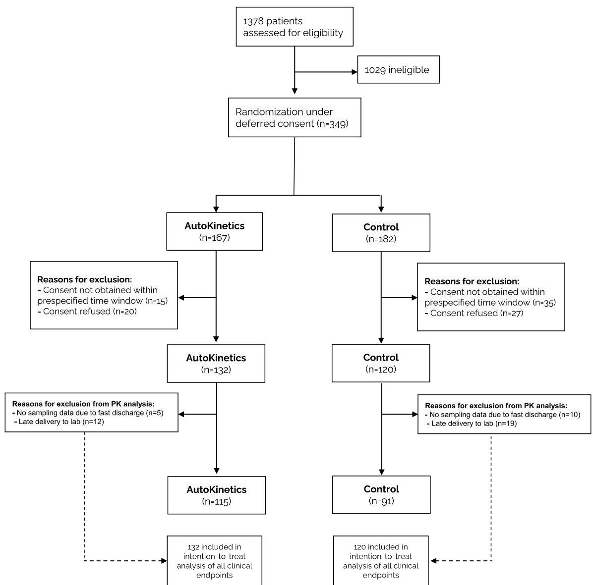
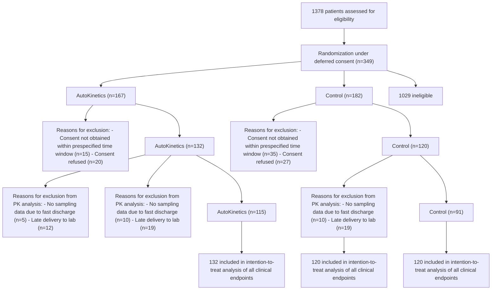
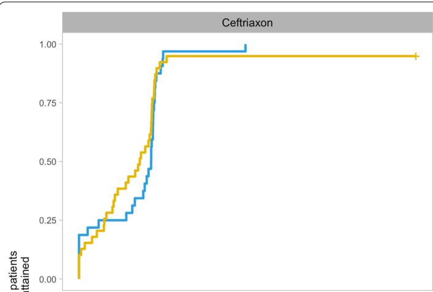
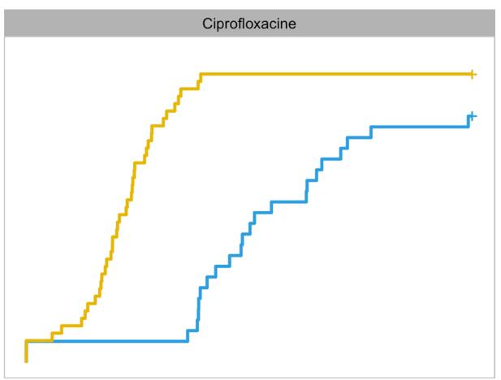
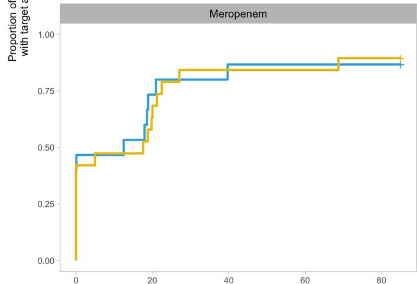
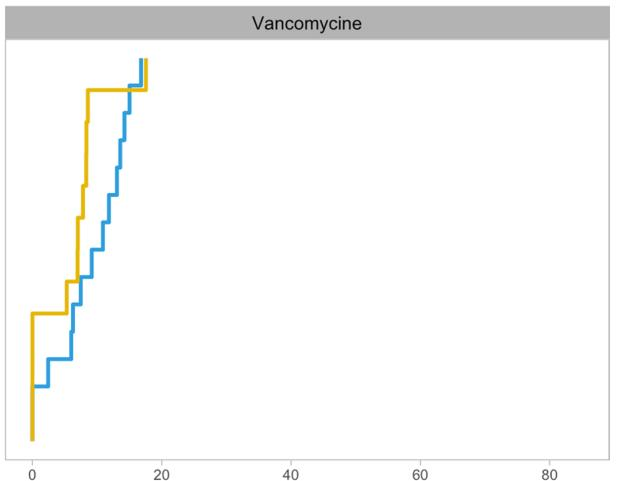

# RESEARCH

# Open Access

# Right dose, right now: bedside, real-time, data-driven, and personalised antibiotic dosing in critically ill patients with sepsis or septic shock—a two-centre randomised clinical trial

Luca F. Roggeveen1\*†, Tingjie Guo1,2,3†, Lucas M. Fleuren1†, Ronald Driessen1 , Patrick Thoral1 , Reinier M. van Hest2 , Ron A. A. Mathot2 , Eleonora L. Swart2 , Harm‑Jan de Grooth1 , Bas van den Bogaard4 , Armand R. J. Girbes1 , Rob J. Bosman4 and Paul W. G. Elbers1

# Abstract

Background: Adequate antibiotic dosing may improve outcomes in critically ill patients but is challenging due to altered and variable pharmacokinetics. To address this challenge, AutoKinetics was developed, a decision support system for bedside, real-time, data-driven and personalised antibiotic dosing. This study evaluates the feasibility, safety and efcacy of its clinical implementation.

Methods: In this two-centre randomised clinical trial, critically ill patients with sepsis or septic shock were randomised to AutoKinetics dosing or standard dosing for four antibiotics: vancomycin, ciprofoxacin, meropenem, and ceftriaxone. Adult patients with a confrmed or suspected infection and either lactate > 2 mmol/L or vasopressor requirement were eligible for inclusion. The primary outcome was pharmacokinetic target attainment in the frst 24 h after randomisation. Clinical endpoints included mortality, ICU length of stay and incidence of acute kidney injury.

Results: After inclusion of 252 patients, the study was stopped early due to the COVID-19 pandemic. In the ciprofoxacin intervention group, the primary outcome was obtained in 69% compared to 3% in the control group (OR 62.5, CI 11.4–1173.78, p < 0.001). Furthermore, target attainment was faster (26 h, CI 18–42 h, p < 0.001) and better (65% increase, CI 49–84%, p < 0.001). For the other antibiotics, AutoKinetics dosing did not improve target attainment. Clinical endpoints were not signifcantly diferent. Importantly, higher dosing did not lead to increased mortality or renal failure.

Conclusions: In critically ill patients, personalised dosing was feasible, safe and signifcantly improved target attainment for ciprofoxacin.

† Luca F. Roggeveen, Tingjie Guo and Lucas M. Fleuren contributed equally to this work.

\*Correspondence: l.roggeveen@amsterdamumc.nl

1 Department of Intensive Care Medicine, Laboratory for Critical Care Computational Intelligence (LCCCI), Amsterdam Medical Data Science (AMDS), Amsterdam Cardiovascular Science (ACS), Amsterdam Institute for Infection and Immunity (AI&II), Amsterdam UMC, Vrije Universiteit, Amsterdam, The Netherlands Full list of author information is available at the end of the article

BMC

© The Author(s) 2022. Open Access This article is licensed under a Creative Commons Attribution 4.0 International License, which permits use, sharing, adaptation, distribution and reproduction in any medium or format, as long as you give appropriate credit to the original author(s) and the source, provide a link to the Creative Commons licence, and indicate if changes were made. The images or other third party material in this article are included in the article’s Creative Commons licence, unless indicated otherwise in a credit line to the material. If material is not included in the article’s Creative Commons licence and your intended use is not permitted by statutory regulation or exceeds the permitted use, you will need to obtain permission directly from the copyright holder. To view a copy of this licence, visit http://creativecommons.org/licenses/by/4.0/. The Creative Commons Public Domain Dedication waiver (http://creativeco mmons.org/publicdomain/zero/1.0/) applies to the data made available in this article, unless otherwise stated in a credit line to the data.

Trial registration: The trial was prospectively registered at Netherlands Trial Register (NTR), NL6501/NTR6689 on 25 August 2017 and at the European Clinical Trials Database (EudraCT), 2017-002478-37 on 6 November 2017.

Keywords: Sepsis, Therapeutic drug monitoring, Pharmacokinetics, Clinical decision support

# Background

Mortality rates remain at 15–30% or even higher in critically ill patients with sepsis or septic shock [1–3]. Despite eforts to develop novel treatment strategies, antibiotics continue to be the cornerstone of sepsis treatment [4]. Teir early and appropriate use has been associated with improved clinical outcomes [5, 6]. Appropriate use  should also imply appropriate dosing. Overdosing may lead to toxicity associated with excess morbidity, while underdosing has been associated with increased antimicrobial resistance and poorer patient outcomes, including clinical cure and mortality [7–12].

However, achieving and maintaining adequate antibiotic levels is challenging, especially in the critically ill. Tese patients typically show markedly altered and rapidly changing pharmacokinetic (PK) profles due to alterations in antibiotic clearance and volume of distribution. Contributing factors include hyperdynamic circulation, shifts in fuid balance, organ dysfunction and organ replacement therapies [7]. Tese factors vary greatly between patients, resulting in reported variations in antibiotic concentrations of over two orders of magnitude, but may also fuctuate extensively over time in any single patient [8]. Tus, adequate antibiotic dosing in the critically ill may be an important modifable factor in optimising sepsis treatment. In line with the Precision Medicine Initiative [13] and the surviving sepsis campaign ranking personalised therapy as a top research priority [14], this calls for personalised antibiotic dosing in the critically ill.

Nevertheless, antibiotics typically continue to be dosed following standard regimens, even in the critically ill, perhaps related to inadequate PK knowledge among intensive care professionals [9]. But with the advent of electronic health records (EHRs), computerised decision support systems can now readily retrieve relevant individual patient data for model informed precision dosing [15]. Terefore, we developed AutoKinetics software to predict and graphically display patient specifc antibiotic plasma concentrations in real time [16].

Providing direct and continuous individualised dosing advice directly to intensive care professionals at the bedside alleviates the need for manual data entry and guidance by pharmacists. Unlike therapeutic drug monitoring, feedback from antibiotic plasma levels is optional, and individual data-driven dosing advice is therefore available even before the frst dose. To evaluate the feasibility, efcacy and safety of bedside, data-driven, and model informed precision dosing by AutoKinetics, we carried out a two-centre randomised clinical trial in critically ill patients with sepsis or septic shock.

# Methods

# Study design

Te Right Dose Right Now study was an investigatorinitiated, two-centre, randomised controlled, two-arm, paralleled, and non-blinded superiority trial conducted at Amsterdam UMC, location VUmc and OLVG, location East in Amsterdam, the Netherlands. Both are tertiary referral centres for intensive care medicine  with medical and surgical patients. Te full trial protocol was published while the trial was ongoing and before analyses of the results [17]. Additional details about the study protocol, including amendments, are detailed in the Additional fle  1. Ethical approval was obtained in both centres (VUmc 2017.474, OLVG 18.011) and the trial was monitored by an independent clinical research bureau. Tis report follows the CONSORT guidelines [18].

# Patients and antibiotics

All adult intensive care patients were eligible for inclusion if they received antibiotics for a suspected or confrmed infection and had a suspected or measured serum lactate greater than two mmol/L or a requirement for vasopressor support in any dose.

Patients were eligible both at the start of and during an antibiotic course depending on when they fulflled the inclusion criteria, specifcally the lactate and vasopressor criteria. Patients could be prescribed multiple antibiotics using AutoKinetics but the clinical team could only include a patient for one antibiotic out of four antibiotics primarily  used for the treatment of sepsis in the two centres: the β-lactam antibiotics ceftriaxone and meropenem, the fuoroquinolone ciprofoxacin, and the glycopeptide vancomycin. For all of these antibiotics, inadequate antibiotic exposure occurs with a frequency of up to 60% [8, 19, 20] and their appropriate dosing has been suggested to improve outcome [7]. Te initial trial design also included the β-lactam  cefotaxime, which could not be implemented due to a shortage at the national level and subsequent change in antibiotic treatment protocols for sepsis. Tere were no exclusion criteria. To avoid any delays in treatment, patients were included under deferred consent which was obtained from patients or their representatives within 48  h of randomisation.

# Randomisation and intervention

A randomisation module within AutoKinetics assigned patients to the control group or the intervention (AutoKinetics) group in a 1:1 allocation ratio with stratifcation by study centre, gender, and age group binned at 65 years using minimisation techniques [21]. Te module rebalanced groups after patients were excluded. Patients remained allocated to their treatment group for the duration of their hospital admission. Te trial was not blinded, and researchers and the treatment team were aware of treatment allocation. Te pharmacokinetic  endpoints, including primary endpoint of the study, were calculated using the same model based method for each patient relying on quantifable plasma samples. Te risk of bias in estimated treatment efects [22] is therefore low.

Integrated with two frequently used EHRs (MetaVision, iMDsoft, Tel Aviv, Israel and Epic (Epic Systems, Verona, WA, USA), AutoKinetics combines population PK models with relevant available EHR data. Te user interface provides a graphical display of projected antibiotic plasma concentrations for all antibiotics and is available to the clinical team in real time (Additional fle  1: Fig. S1). AutoKinetics calculates a dose advice for any predefned PK dosing target. Dosing advice was available at the start of an antibiotic course, arguably when target attainment may be most important [23] and when PK are most variable between critically ill patients [8]. Furthermore, AutoKinetics also provided dosing advice during an antibiotic course, even if the antibiotic course was started prior to inclusion.

In the AutoKinetics group, the individualised dose and dosing frequency recommendations were instantly available at the bedside for the primary antibiotic and the other three study antibiotics. Physicians were recommended to check AutoKinetics at least once per shift for dose advice, i.e. at least three times per day. Te decision to follow the recommendations provided by AutoKinetics was at the discretion of the treating physician. In the control group, patients received antibiotics according to standard dosing regimens in each hospital, in line with international standards, as detailed in Additional fle  1: Table  S1. For feasibility reasons, the treatment team was not blinded to the dosing of antibiotics. Te initiation and duration of the antibiotic course were left to the discretion of the clinical team. To ensure the appropriate use of and compliance with the AutoKinetics dose advice, intensive care unit (ICU) stafs, including residents, were trained at the start of their ICU rotation and quarterly thereafter for the duration of the trial. Physicians had the option to enter comments on their choice to accept or decline dosing recommendations and compliance was monitored.

Plasma sampling was scheduled for both treatment and control groups at least right after the frst dose following randomisation, halfway through the frst dosing interval, right before the second dose, and daily before a next dose for the following dosing intervals. For continuous infusions, multiple samples were scheduled with the frst sample at least 1 h after a loading dose and at least once daily thereafter. Terapeutic drug monitoring with feedback on antibiotic plasma levels was applied for vancomycin as this was standard practice in the participating centres. All other plasma samples were stored at 80 °C for up to one year, after which a liquid chromatography– mass spectrometry (LC–MS) analysis method was used to determine total plasma concentration for the four study antibiotics. Samples were blinded and analysed by the pharmacy laboratory, and results were reported by study ID to the research team only.

# AutoKinetics dosing strategy

For each antibiotic, best performing PK models were selected, validated, calibrated and implemented in AutoKinetics, as published previously [16]. Vancomycin and ciprofoxacin are time- and concentration-dependent antibiotics, and their efcacy is related to the area under the concentration versus time curve (AUC) relative to the pathogen minimum inhibitory concentration (MIC). Meropenem and ceftriaxone are time-dependent antibiotics where time above a concentration relative to the MIC is best associated with their efcacy. As true MIC values were not routinely available from the electronic health record, a surrogate value of 1  mg/L was used, based on EUCAST clinical breakpoints to avoid delays and allow for empirical therapy [24]. Dosing targets for each antibiotic were based on clinical and preclinical studies as previously reviewed and focus on the prevention of underdosing [7]. Detailed dosing strategies and rationale may be found in the Additional fle 1 and Additional file 1: Table S1.

# Outcomes

All outcome defnitions were prespecifed and described in detail in the published study protocol [17]. Te primary endpoint was PK target attainment (TA), during the frst 24 h following randomisation for the primary antibiotic for which the patient was randomised. Te primary endpoint was prespecifed at 75% of the dosing target, a conservative endpoint [7], as detailed in Additional fle 1: Table S1. Secondary PK outcomes were time to PK target attainment (TTA) and the fraction of days of the entire antibiotic course up to ICU discharge during which the primary outcome was reached (%-TA). All PK outcomes were assessed for each antibiotic separately.

Secondary clinical outcomes included mortality at ICU discharge, hospital discharge, day 28 and 6  months as well as ICU- and hospital length of stay, the delta Sequential Organ Failure Assessment (SOFA) score [25] between baseline on the day of randomisation and 96 h after, and incidence of acute kidney injury (AKI).

Finally, a predefned safety analysis was performed for subgroups based on the cumulative dose administered in the frst 24 h after randomisation compared to the cumulative daily  standard dose, unadjusted for kidney function: low dosing (< 50% of standard dose), normal dosing (dose within 50% and 200%) and high dosing (> 200%). For this safety analysis, clinical outcomes were assessed regardless of the choice of primary antibiotic, focusing on mortality and renal failure.

# Pharmacokinetic and statistical analysis

Te full analysis plan including sample size calculations was published previously as part of the study protocol [17]. Target attainment was derived from measured antibiotic plasma concentrations and maximum a posteriori Bayesian estimation using the AutoKinetics population PK models. Concentration data were aggregated in onehour time steps to calculate the AUCs using the trapezoidal method.

For all PK outcomes, an intention-to-treat analysis was performed. Mixed efects modelling was used to account for potentially modifying efects from the stratifcation factors gender, age and treatment centre. A time-to-event analysis was performed to generate Kaplan–Meier survival plots using a Cox regression model. Between-group comparisons of clinical outcomes were assessed using the two-group Chi-square test or Kruskal–Wallis rank sum test where applicable. Te DALI study [8] showed that 60% of patients did not reach the PK targets. We performed a power analysis (alpha 0.05, 1-beta 0.80) which showed a required sample size of 42 patients per group, per antibiotic, based on a clinically relevant reduction from 60 to 30% of failure to attain PK targets.

We performed an exploratory PK target analysis to evaluate the efect of AutoKinetics dosing for diferent PK targets. We calculated the probability of target attainment for multiple targets over a range of MIC values to assess the efect of AutoKinetics dosing in more detail. As a post hoc analysis, PK model accuracy and precision were assessed as the absolute prediction error between the observed and predicted plasma concentrations, and relative prediction error, respectively. Finally, we performed a post hoc analysis to evaluate target attainment for vancomycin after initiation of therapeutic drug monitoring (TDM) to assess the efect of bedside dosing advice independent from model performance, as Bayesian optimisation for TDM corrects for model inaccuracy.

Statistical analyses were carried out in R (version 4.0.3; www.R-project.org) and Python (version 3.7; www. python.org). Pharmacokinetic analyses were performed in NONMEM (version 7.5; ICON Development Solutions, MD, USA). Where applicable and as such denoted, secondary endpoints have been adjusted for multiplicity and their unadjusted p values should be interpreted as exploratory only.

# Results

# Patients and data

From 2 February 2018 until 20 March 2020, a total of 349 patients were enrolled in both centres. Informed consent was obtained for 252 patients. Of these patients, 132 were randomised to the AutoKinetics group and 120 to the control group. Te trial was stopped early due to the COVID-19 pandemic. As a result, recruitment was completed for ceftriaxone and ciprofoxacin but not for vancomycin and meropenem. Patient fow and reasons for exclusion after randomisation can be found in Fig. 1.

Overall, the two groups were balanced with regard to their baseline characteristics (Table  1). At randomisation, 44% of patients fulflled the sepsis-3 criteria for septic shock [1]. Most patients were randomised in the early (median 4.8, interquartile range 0.9–26.5) hours of their ICU admission and started their antibiotic therapy immediately thereafter.

Due to delays in plasma sample storage, transport and determination, samples could not be analysed for some patients and were discarded. Antibiotic concentration data for the calculation of the primary outcome were available for 85% of the ceftriaxone patients, 78% of the ciprofoxacin patients, 90% of the meropenem patients and 76% of the vancomycin patients. Pharmacokinetic outcomes are reported for these patients while  clinical outcomes are reported for all patients regardless of plasma sample availability. Given blinded analysis and reporting, missingness is likely to have occurred at random.

# Pharmacokinetic outcomes

For ciprofoxacin, the primary outcome of target attainment in the frst 24 h was reached in 69% of patients in the AutoKinetics group compared to 3% in the control group (OR 62.5 CI 11.4–1173.8, p < 0.001). For ceftriaxone, vancomycin, and meropenem, there were no statistically signifcant diferences in PK target attainment (Table  2). Te cumulative dose for the primary antibiotic given in the frst 24 h after randomisation is shown in Additional fle 1: Fig. S2. Additional details about the dosing regimens and measured plasma concentrations are available in Additional fle  1: Figs. S3 and S4. A signifcant diference was observed for ciprofoxacin with a daily median dose of 2600 mg (IQR 2000–3000 mg) in the AutoKinetics group versus 1000 mg (IQR 800–1200 mg) in the control group.

flowchart

Fig. 1 Flow diagram of enrolment and randomisation of patients. Patient fow for the trial. Patients were randomised under deferred consent and exclusions therefore occur after the start of the intervention. The randomisation software rebalanced groups after exclusions to maintain equal stratifed group sizes. PK pharmacokinetic

Te secondary PK outcomes are shown in Table  2. Additionally, the survival analysis for the TTA is shown in Fig. 2. For ciprofoxacin, TTA was signifcantly shorter in the AutoKinetics group with a median time reduction of 26 h (CI 18–42 h, p value < 0.001). Tere was no signifcant diference in TTA for ceftriaxone, vancomycin, and meropenem. Patients in the AutoKinetics group showed a 65% (CI 42–88%, p value < 0.001) increase in days on target for the full antibiotic course for ciprofoxacin, but not for the other antibiotics (Table 2).

# Clinical outcomes

No signifcant diferences were observed between AutoKinetics and the control group for the secondary clinical endpoints (Table  3). Importantly, no increase in SOFA score, kidney failure, AKI severity or initiation of Continuous Veno-Venous Hemofltration (CVVH) was found in the AutoKinetics group. Te point estimates for mortality and renal outcomes favoured the AutoKinetics group, although these diferences did not reach statistical signifcance.

Table 1 Baseline characteristics of trial patients 

<table><tr><td></td><td>AutoKinetics(132)</td><td>Control(120)</td></tr><tr><td>Age, mean (IQR)—years</td><td>68 (60–75)</td><td>67 (56–74)</td></tr><tr><td>Male, n (%)</td><td>90 (68.2)</td><td>82 (68.3)</td></tr><tr><td>Body Mass Index, median (IQR)—kg/m2</td><td>25.5 (23.4–29.7)</td><td>26.0 (22.5–29.3)</td></tr><tr><td>Weight, median (IQR)—kg</td><td>80 (70–91)</td><td>80 (70–92)</td></tr><tr><td>SOFA score on day of randomisation, median (IQR)</td><td>10.0 (7.0–13.0)</td><td>10.0 (7.0–12.0)</td></tr><tr><td>Leukocytes at randomisation (*10^9), median (IQR)</td><td>14.7 (8.9–22.1)</td><td>13.3 (8.4–18.7)</td></tr><tr><td>C-reactive protein at randomisation, median (IQR)</td><td>142.0 (71.0–296.2)</td><td>165.0 (65.0–283.0)</td></tr><tr><td>Creatinine at randomisation, median (IQR)</td><td>117.5 (78.2–165.5)</td><td>126.0 (77.0–197.5)</td></tr><tr><td>Septic shockaat randomisation, n (%)</td><td>48 (36.4)</td><td>63 (52.5)</td></tr><tr><td>KDIGO stage at randomisation, n (%)</td><td></td><td></td></tr><tr><td>0</td><td>80 (60.6)</td><td>68 (56.7)</td></tr><tr><td>1</td><td>32 (24.2)</td><td>28 (23.3)</td></tr><tr><td>2</td><td>9 (6.8)</td><td>15 (12.5)</td></tr><tr><td>3</td><td>11 (8.3)</td><td>9 (7.5)</td></tr><tr><td>Comorbidities, n (%)</td><td></td><td></td></tr><tr><td>Diabetes</td><td>18 (21.4)</td><td>11 (14.3)</td></tr><tr><td>Renal insufficiency</td><td>16 (12.1)</td><td>15 (12.5)</td></tr><tr><td>Cardiovascular insufficiency</td><td>9 (6.8)</td><td>6 (5.0)</td></tr><tr><td>Malignancy</td><td>24 (18.2)</td><td>22 (18.4)</td></tr><tr><td>Immunological insufficiency</td><td>29 (22.0)</td><td>27 (22.5)</td></tr><tr><td>Primary affected organ system upon admission, n (%)</td><td></td><td></td></tr><tr><td>Cardiovascular</td><td>71 (54.2)</td><td>99 (55.0)</td></tr><tr><td>Respiratory</td><td>31 (23.7)</td><td>32 (26.7)</td></tr><tr><td>Gastrointestinal</td><td>18 (13.7)</td><td>16 (14.4)</td></tr><tr><td>Trauma</td><td>5 (3.8)</td><td>3 (2.5)</td></tr><tr><td>Neurologic</td><td>3 (2.3)</td><td>1 (0.8)</td></tr><tr><td>Other</td><td>5 (3.8)</td><td>2 (1.6)</td></tr><tr><td>Admission characteristics</td><td></td><td></td></tr><tr><td>Time from ICU admission until randomisation, median (IQR)—hours</td><td>3.4 (0.9–23.6)</td><td>5.5 (0.8–21.1)</td></tr><tr><td>Antibiotic course initiation after randomisation, n (%)</td><td>74 (56.9)</td><td>76 (63.9)</td></tr><tr><td>Primary antibiotic, n (%)</td><td></td><td></td></tr><tr><td>Vancomycin</td><td>16 (12.1)</td><td>16 (13.3)</td></tr><tr><td>Ciprofloxacin</td><td>49 (37.1)</td><td>43 (35.8)</td></tr><tr><td>Meropenem</td><td>24 (18.2)</td><td>20 (16.7)</td></tr><tr><td>Ceftriaxone</td><td>43 (32.6)</td><td>41 (34.2)</td></tr><tr><td>Coadministered study antibiotic, n (%)</td><td></td><td></td></tr><tr><td>Vancomycin</td><td>29 (22.0)</td><td>26 (21.7)</td></tr><tr><td>Ciprofloxacin</td><td>33 (25.0)</td><td>38 (31.7)</td></tr><tr><td>Meropenem</td><td>13 (9.8)</td><td>5 (4.2)</td></tr><tr><td>Ceftriaxone</td><td>31 (23.5)</td><td>28 (23.3)</td></tr></table>

SOFA, Sequential Organ Failure Assessment; CRP, C-Reactive Protein; IQR, Interquartile Range; KDIGO, Kidney Disease Improving Global Outcomes   
a Septic shock is defned using the Sepsis-3 criteria: Sepsis with a lactate > 2 and use of vasopressors

Te subgroup analysis for high, low and normal dosing  is shown in Table  4. No diferences in clinical outcomes were observed between these groups. Importantly,

exposure to high dosing by AutoKinetics did not lead to an increase in new kidney failure, an increase in AKI severity or use of renal replacement therapy. Rather, trends were favourable for these outcomes, as well as delta SOFA scores, in the AutoKinetics group.

Table 2 Pharmacokinetic primary and secondary outcomes 

<table><tr><td></td><td>AutoKineticsN = 115</td><td>ControlN = 91</td><td>delta estimate(confidence interval)</td><td>Odds ratio(confidence interval)</td><td>p value</td></tr><tr><td colspan="6">Target attainment within 24 h, n / N (%)</td></tr><tr><td>Vancomycin</td><td>12/12 (100%)</td><td>13/14 (93%)</td><td></td><td>Inf (0.02 to inf) $^{x}$ </td><td> $1^{x}$ </td></tr><tr><td>Ciprofloxacin</td><td>29/42 (69%)</td><td>1/29 (3%)</td><td></td><td>62.5 (11.4 to 1173.78) $^{a}$ </td><td>&lt;0.001</td></tr><tr><td>Meropenem</td><td>12/19 (63%)</td><td>12/15 (80%)</td><td></td><td>0.42 (0.07 to 1.95) $^{a}$ </td><td>0.291</td></tr><tr><td>Ceftriaxone</td><td>37/39 (95%)</td><td>31/32 (97%)</td><td></td><td>0.60 (0.03 to 6.51) $^{a}$ </td><td>0.679</td></tr><tr><td colspan="6">Fraction of days with target attainment (FTA)—median (IQR)</td></tr><tr><td>Vancomycin</td><td>1 (1 to 1)</td><td>1 (0.93 to 1)</td><td>0.01 (-0.18 to 0.58) $^{b}$ </td><td></td><td>0.42</td></tr><tr><td>Ciprofloxacin</td><td>1 (0.5 to 1)</td><td>0 (0 to 0)</td><td>0.65 (0.42 to 0.88) $^{b}$ </td><td></td><td>&lt;0.001</td></tr><tr><td>Meropenem</td><td>1 (0 to 1)</td><td>1 (0.75 to 1)</td><td>-0.15 (-0.45 to 0.18) $^{b}$ </td><td></td><td>0.413</td></tr><tr><td>Ceftriaxone</td><td>1 (1 to 1)</td><td>1 (1 to 1)</td><td>-0.08 (-0.08 to 0.01) $^{b}$ </td><td></td><td>0.889</td></tr><tr><td colspan="6">Time in hours to target attainment (TTA)—median (IQR)</td></tr><tr><td>Vancomycin</td><td>7 (0 to 8.3)</td><td>10 (6.1 to 13.5)</td><td>-3.23 (-7.38 to 0.92) $^{c}$ </td><td></td><td>0.141</td></tr><tr><td>Ciprofloxacin</td><td>17.7 (14.1 to 23.1)</td><td>41.2 (33.0 to 54.4)</td><td>-26.00 (-32.45 to -18.71) $^{c}$ </td><td></td><td>&lt;0.001</td></tr><tr><td>Meropenem</td><td>4.97 (0 to 20.0)</td><td>0.08 (0 to 18.6)</td><td>2.87 (-8.26 to 14.42) $^{c}$ </td><td></td><td>0.618</td></tr><tr><td>Ceftriaxone</td><td>14.9 (6.4 to 18.4)</td><td>18.2 (10.2 to 18.9)</td><td>-2.10 (-6.06 to 1.69) $^{c}$ </td><td></td><td>0.276</td></tr></table>

The target was defned as 75%-T0-24 > 4⋅MIC for ceftriaxone and meropenem, where 75%T0-24 denotes 75% of the time. For vancomycin, target was defned as AUC0- 24/MIC > 300 and for ciprofoxacin as AUC0-24/MIC > 94, which is also 75% of the target used for AutoKinetics dose advice   
IQR, Interquartile Range; SD, standard deviation   
x Fisher’s exact test was used for null-hypothesis testing and confdence interval calculation due to the 100% target attainment in the antibiotic group rather than a generalised linear mixed model   
a Odds ratio with confdence interval around the odds, calculated using a generalised linear mixed model on a binomial distribution   
b Diference in fraction of days with target attainment with confdence interval, calculated based on a linear mixed model   
c Diference in hours to target attainment with confdence interval, calculated based on a linear mixed model. A negative TTA diference indicates a reduction in time to target attainment for the AutoKinetics group compared to control

# Compliance

Less than 2% of all dosing recommendations were rejected by the clinical team. However, physicians were required to manually enter or alter the antibiotic order in the EHR system and deviations from recommendations may still have occurred, although this is unlikely given the wide dose distribution observed.

# Pharmacokinetic exploratory analysis

We calculated the probability of target attainment for the primary outcome for a range of MIC cut-ofs and for both the PK outcome and the PK dosing target, see Additional fle 1: Fig. S5. Notably, for ciprofoxacin and vancomycin, AutoKinetics dosing led to higher target attainment for a wide range of PK targets in the frst 24 h after randomisation, but not for meropenem and ceftriaxone.

We assessed the efect of AutoKinetics in combination with TDM. AutoKinetics resulted in higher average AUCs for the entire antibiotic course and a trend towards more accurate target attainment after TDM, showing a reduction in overdosing compared to clinical practice (Additional fle  1: Fig. S6). Secondly, we analysed the accuracy and precision of the PK models for the AutoKinetics population. For meropenem, we found a higher risk of underdosing with the implemented AutoKinetics model, while for ceftriaxone, we found a higher risk of overdosing (Additional fle 1: Table S2).

# Discussion

Tis study demonstrates that computerised decision support for model based, continuous, real-time antibiotic dosing advice at the intensive care bedside for critically ill patients with sepsis or septic shock is feasible and safe.

AutoKinetics signifcantly improved PK target attainment in patients with sepsis or septic shock for ciprofoxacin and more than halved the time to adequate exposure. Importantly, as shown in our exploratory analyses, target attainment for ciprofoxacin standard dosing remains minimal even for lower PK targets. Current treatment protocols on ciprofoxacin dosing may therefore be considered inadequate, especially in areas with high antimicrobial resistance [23].

For ceftriaxone, meropenem, and vancomycin, AutoKinetics dosing did not lead to better PK target attainment. Potential explanations for diferent results for the diferent classes of antibiotics include the performance of the models used, the target used for dosing and evaluation, and the timing of our intervention relative to initiation of antibiotic therapy.

line

| Time Point | Blue Line | Yellow Line |
| ---------- | --------- | ----------- |
| 0          | 0.00      | 0.00        |
| 1          | 0.25      | 0.25        |
| 2          | 0.50      | 0.50        |
| 3          | 0.75      | 0.75        |
| 4          | 0.90      | 0.90        |
| 5          | 0.95      | 0.95        |
| 6          | 1.00      | 1.00        |

line

| Ciprofloxacin | Yellow Line Value | Blue Line Value |
| ------------- | ----------------- | --------------- |
| 0             | 0                 | 0               |
| 1             | 1                 | 0               |
| 2             | 2                 | 0               |
| 3             | 3                 | 0               |
| 4             | 4                 | 0               |
| 5             | 5                 | 0               |
| 6             | 6                 | 1               |
| 7             | 7                 | 2               |
| 8             | 8                 | 3               |
| 9             | 9                 | 4               |
| 10            | 10                | 5               |
| 11            | 10                | 6               |
| 12            | 10                | 7               |
| 13            | 10                | 8               |
| 14            | 10                | 9               |
| 15            | 10                | 10              |
| 16            | 10                | 11              |
| 17            | 10                | 12              |
| 18            | 10                | 13              |
| 19            | 10                | 14              |
| 20            | 10                | 15              |
| 21            | 10                | 16              |
| 22            | 10                | 17              |
| 23            | 10                | 18              |
| 24            | 10                | 19              |
| 25            | 10                | 20              |
| 26            | 10                | 21              |
| 27            | 10                | 22              |
| 28            | 10                | 23              |
| 29            | 10                | 24              |
| 30            | 10                | 25              |
| 31            | 10                | 26              |
| 32            | 10                | 27              |
| 33            | 10                | 28              |
| 34            | 10                | 29              |
| 35            | 10                | 30              |
| 36            | 10                | 31              |
| 37            | 10                | 32              |
| 38            | 10                | 33              |
| 39            | 10                | 34              |
| 40            | 10                | 35              |
| 41            | 10                | 36              |
| 42            | 10                | 37              |
| 43            | 10                | 38              |
| 44            | 10                | 39              |
| 45            | 10                | 40              |
| 46            | 10                | 41              |
| 47            | 10                | 42              |
| 48            | 10                | 43              |
| 49            | 10                | 44              |
| 50            | 10                | 45              |
| 51            | 10                | 46              |
| 52            | 10                | 47              |
| 53            | 10                | 48              |
| 54            | 10                | 49              |
| 55            | 10                | 50              |
| 56            | 10                | 51              |
| 57            | 10                | 52              |
| 58            | 10                | 53              |
| 59            | 10                | 54              |
| 60            | 10                | 55              |
| 61            | 10                | 56              |
| 62            | 10                | 57              |
| 63            | 10                | 58              |
| 64            | 10                | 59              |
| 65            | 10                | 60              |
| 66            | 10                |          |
|    (The data is already in CSV format) |                    |                  |

line

| Proportion of with target | Blue Line | Yellow Line |
| ------------------------- | --------- | ----------- |
| 0                         | 0.45      | 0.42        |
| 10                        | 0.50      | 0.48        |
| 20                        | 0.75      | 0.70        |
| 30                        | 0.80      | 0.82        |
| 40                        | 0.85      | 0.86        |
| 50                        | 0.86      | 0.87        |
| 60                        | 0.87      | 0.88        |
| 70                        | 0.88      | 0.89        |
| 80                        | 0.89      | 0.90        |
| 90                        | 0.90      | 0.91        |

line

| Step | Blue Line Value | Yellow Line Value |
|------|-----------------|-------------------|
| 0    | 0               | 0                 |
| 1    | 2               | 3                 |
| 2    | 4               | 5                 |
| 3    | 6               | 7                 |
| 4    | 8               | 9                 |
| 5    | 10              | 11                |
| 6    | 12              | 13                |
| 7    | 14              | 15                |
| 8    | 16              | 17                |
| 9    | 18              | 19                |
| 10   | 20              | 21                |
| 11   | 22              | 23                |
| 12   | 24              | 25                |
| 13   | 26              | 27                |
| 14   | 28              | 29                |
| 15   | 30              | 31                |
| 16   | 32              | 33                |
| 17   | 34              | 35                |
| 18   | 36              | 37                |
| 19   | 38              | 39                |
| 20   | 40              | 41                |

Time (hours) Intervention group Control dosing AutoKinetics dosing

Fig. 2 Time to target attainment survival analysis. A survival analysis of the time until primary target attainment for each antibiotic. The Y axis denotes the proportion of patients (up to 1) that have reached their PK target. The X axis denotes the time in hours it takes to reach the primary target. Lines that stop prematurely have reached a proportion of 1. At hour zero, some patients are already on target because they were randomised after their frst antibiotic dose. For some antibiotics, target attainment can be reached almost directly after the frst dose as can be seen in the case of meropenem, while for others, most notably ciprofoxacin, target attainment requires several hours up to days

We observed no diferences in the clinical endpoints between the two groups. Overall, mortality and renal outcomes were similar between groups and comparable to the literature [26]. In addition, the prespecifed dosing group safety analysis showed that even large dose adjustments by AutoKinetics are clinically safe. Tis is especially important for ciprofoxacin given that the exposure has more than doubled compared to the control group, partly due to a high loading dose, while the AKI scores trend favourable for the AutoKinetics high dosing group.

For an increasing number of antibiotics, pharmacist supported therapeutic drug monitoring programmes have been implemented  in hospitals and their ICUs. Tis typically leads to dose adjustments every 24 to 72  h. AutoKinetics incorporates antibiotic plasma level feedback, if available, but without the need for human interpretation and can thus provide continuous dosing support to the clinician. Our exploratory analysis for vancomycin, in which both groups benefted from plasma level feedback, revealed that AutoKinetics resulted in less variation in exposure without a decrease in PK target attainment. Tis may be relevant as overall exposure is a prominent risk factor for vancomycin toxicity [27].

It is currently insufciently understood what exact PK targets should be targeted to improve clinical outcomes and total plasma concentration targets may not necessarily be associated with antimicrobial efcacy at the site of infection. Furthermore, it is currently unclear if individual MIC measurements are suited for precision dosing as these are error prone [28] and frequently unavailable at initiation of treatment. Terefore, the PK targets in this trial were based on EUCAST epidemiological cut-ofs based on combinations of prevalent pathogens and the antibiotics studied. In addition, safety margins were applied to account for MIC variation to prevent underdosing. Diferent MIC targets can be incorporated depending on the clinical situation and regional microbial resistance. AutoKinetics is designed to account for any desired PK target and is compatible with any compartment PK model. Tis provides the fexibility to function in a range of clinical settings.

Table 3 Clinical safety outcomes 

<table><tr><td></td><td>AutoKinetics(132)</td><td>Control(120)</td><td>p value</td></tr><tr><td>ICU mortality, n (%)</td><td>45 (34.1)</td><td>44 (36.7)</td><td> $0.768^a$ </td></tr><tr><td>Hospital mortality, n (%)</td><td>45 (34.1)</td><td>47 (39.2)</td><td> $0.481^a$ </td></tr><tr><td>28-day mortality, n (%)</td><td>45 (34.1)</td><td>48 (40.0)</td><td> $0.401^a$ </td></tr><tr><td>6-month mortality, n (%)</td><td>56 (42.4)</td><td>59 (49.2)</td><td> $0.344^a$ </td></tr><tr><td>New onset AKI, n (%)</td><td>44 (33.3)</td><td>50 (41.7)</td><td> $0.217^a$ </td></tr><tr><td>Highest KDIGO stage, n (%)</td><td></td><td></td><td> $0.081^a$ </td></tr><tr><td>0</td><td>30 (22.7)</td><td>15 (12.5)</td><td></td></tr><tr><td>1</td><td>11 (8.3)</td><td>19 (15.8)</td><td></td></tr><tr><td>2</td><td>47 (35.6)</td><td>44 (36.7)</td><td></td></tr><tr><td>3</td><td>44 (33.3)</td><td>42 (35.0)</td><td></td></tr><tr><td>Received CVVH, n (%)</td><td>18 (13.6)</td><td>19 (15.8)</td><td>0.754</td></tr><tr><td>Days free from CVVH, mean (SD)</td><td>10.0 (18.8)</td><td>8.5 (11.4)</td><td> $0.856^b$ </td></tr><tr><td>SOFA score at 96 h, median (IQR)</td><td>10.0 (6.0 to 15.2)</td><td>10.0 (5.0 to 19.2)</td><td> $0.919^b$ </td></tr><tr><td>Delta SOFA score at 96 h, median (IQR)</td><td>0.0 (-3.0 to 4.0)</td><td>0.0 (-2.0 to 4.0)</td><td> $0.238^b$ </td></tr><tr><td>Hospital LOS, median (IQR)</td><td>14.0 (4.6 to 30.2)</td><td>12.2 (3.4 to 28.4)</td><td> $0.437^b$ </td></tr><tr><td>ICU LOS, median (IQR)</td><td>3.8 (1.6 to 11.7)</td><td>3.6 (1.0 to 11.0)</td><td> $0.594^b$ </td></tr></table>

AKI, Acute Kidney Injury; CVVH, Continuous Veno-Venous Hemofltration; KDIGO, Kidney Disease: Improving Global Outcomes; LOS, Length of stay; SOFA, Sequential Organ Failure Assessment; IQR, interquartile range   
a Chi-squared   
b Kruskal–Wallis

Tis trial also has limitations. In a post hoc analysis, we found high prediction errors for the PK models for ceftriaxone and meropenem, which may have led to overdosing and underdosing for these antibiotics, respectively. Tus, better PK models need to be developed for use in clinical practice.

We did not use free fraction antibiotic concentration for the dosing target which may be a better PK target than total (bound and unbound) plasma concentration. Tis is especially important for ceftriaxone which is known to have a high variability in protein binding and  for which unbound plasma concentration may be better associated with antimicrobial efcacy at the site of infection [29].

Furthermore, patients could be included in the trial at the beginning of their antibiotic course but also at a later stage. Te maximum potential beneft of AutoKinetics may be limited to those patients who were included from the start of their antibiotic course. Similarly, patients could have received multiple and concurrent antibiotic courses and it is unclear which antibiotic course was most clinically benefcial or efective. As prespecifed, an analysis has been planned—that also includes all secondary antibiotic courses—to evaluate the relationship between diferent PK targets and clinical and microbiological cure.

Lastly, due to the COVID-19 pandemic, the trial was stopped prematurely at about 75% of intended inclusions. A larger sample size may have yielded more conclusive results for the vancomycin and meropenem group and could have strengthened the signal for clinical beneft for AutoKinetics. Future studies to investigate the beneft of personalised dosing on clinical outcomes should therefore be encouraged.

# Conclusions

We found that AutoKinetics, an EHR integrated computerised decision support system for model informed precision dosing for antibiotics  made available directly to intensive care professionals at the bedside, is feasible, safe and can be used to improve antibiotic dosing for patients with sepsis or septic shock.

Table 4 Safety dosing group analysis 

<table><tr><td></td><td>AutoKinetics high dosing group (36)</td><td>AutoKinetics low dosing group (24)</td><td>AutoKinetics Normal dosing group (72)</td><td>Control (120)</td><td>p value (adjusted)a</td></tr><tr><td>ICU mortality, n (%)</td><td>11 (30.6)</td><td>7 (29.2)</td><td>27 (37.5)</td><td>44 (36.7)</td><td>0.801 (0.998)</td></tr><tr><td>Hospital mortality, n (%)</td><td>11 (30.6)</td><td>9 (37.5)</td><td>27 (37.5)</td><td>47 (39.2)</td><td>0.667 (0.997)</td></tr><tr><td>28-day mortality, n (%)</td><td>11 (30.6)</td><td>7 (29.2)</td><td>27 (37.5)</td><td>48 (40.0)</td><td>06.27 (0.997)</td></tr><tr><td>6-month mortality, n (%)</td><td>13 (36.1)</td><td>10 (41.7)</td><td>33 (45.8)</td><td>59 (49.2)</td><td>0.557 (0.997)</td></tr><tr><td>New onset AKI, n (%)</td><td>16 (44.4)</td><td>3 (12.5)</td><td>25 (34.7)</td><td>50 (41.7)</td><td>0.041 (0.416)</td></tr><tr><td>Highest KDIGO stage, n (%)</td><td></td><td></td><td></td><td></td><td>0.119 (0.752)</td></tr><tr><td>0</td><td>10 (27.8)</td><td>5 (20.8)</td><td>15 (20.8)</td><td>15 (12.5)</td><td></td></tr><tr><td>1</td><td>4 (11.1)</td><td>3 (5.6)</td><td>4 (5.6)</td><td>19 (15.8)</td><td></td></tr><tr><td>2</td><td>16 (44.4)</td><td>6 (25.0)</td><td>25 (34.7)</td><td>44 (36.7)</td><td></td></tr><tr><td>3</td><td>6 (16.7)</td><td>10 (41.7)</td><td>28 (38.9)</td><td>42 (35.0)</td><td></td></tr><tr><td>Received CVVH, n (%)</td><td>2 (5.6)</td><td>5 (20.8)</td><td>11 (15.3)</td><td>19 (15.8)</td><td>0.352 (0.980)</td></tr><tr><td>Days free from CVVH, median (IQR)</td><td>3.0 (2.0 to 9.2)</td><td>3.0 (1.0 to 10.5)</td><td>4.5 (2.0 to 10.0)</td><td>4.0 (2.0 to 10.0)</td><td>0.795 (0.998)</td></tr><tr><td>SOFA score at 96 h, median (IQR)</td><td>9.0 (5.0 to 12.2)</td><td>13.5 (10.0 to 24.0)</td><td>9.0 (5.8 to 14.2)</td><td>10.0 (5.9 to 19.2)</td><td>0.075 (0.607)</td></tr><tr><td>Delta SOFA score at 96 h, median (IQR)</td><td>-1.0 (-3.0 to 4.0)</td><td>0.0 (-1.5 to 4.0)</td><td>0.0 (-3.0 to 3.2)</td><td>0.0 (-2.0 to 4.0)</td><td>0.523 (0.997)</td></tr><tr><td>Hospital LOS, median (IQR)</td><td>12.7 (5.4 to 26.5)</td><td>29.3 (1.1 to 37.4)</td><td>14.0 (6.5 to 29.3)</td><td>12.2 (3.4 to 28.4)</td><td>0.828 (0.998)</td></tr><tr><td>ICU LOS, median (IQR)</td><td>2.3 (1.8 to 7.0)</td><td>3.5 (1.1 to 11.2)</td><td>4.2 (1.6 to 11.7)</td><td>3.6 (1.0 to 11.0)</td><td>0.792 (0.998)</td></tr><tr><td>Coadministered study antibiotic, n (%)</td><td></td><td></td><td></td><td></td><td></td></tr><tr><td>Vancomycin</td><td>6 (17.6)</td><td>4 (15.4)</td><td>19 (26.4)</td><td>26 (21.7)</td><td></td></tr><tr><td>Ciprofloxacin</td><td>4 (11.8)</td><td>10 (38.5)</td><td>19 (26.4)</td><td>38 (31.7)</td><td></td></tr><tr><td>Meropenem</td><td>2 (5.9)</td><td>2 (7.7)</td><td>9 (12.5)</td><td>5 (4.2)</td><td></td></tr><tr><td>Ceftriaxone</td><td>12 (35.3)</td><td>2 (7.7)</td><td>17 (23.6)</td><td>28 (23.3)</td><td></td></tr></table>

Safety groups (< 50% & > 200% of normal, unadjusted for kidney function, daily dose) are based on the cumulative dose in the frst 24 h after randomisation for the primary antibiotic   
AKI, Acute Kidney Injury; CVVH, Continuous Veno-Venous Hemofltration; KDIGO, Kidney Disease: Improving Global Outcomes; LOS, Length of stay; SOFA, Sequential Organ Failure Assessment; IQR, interquartile range   
a p value was adjusted for multiplicity using the Holm-Sidak method

# Abbreviations

PK: Pharmacokinetic; EHR: Electronic Health Record; ICU: Intensive Care Unit; LC–MS: Liquid Chromatography–Mass Spectrometry; AUC: Area Under the Curve; MIC: Minimal Inhibitory Concentration; TA: Target Attainment; TTA: Time to Target Attainment; AKI: Acute Kidney Injury; TDM: Therapeutic Drug Monitoring; CVVH: Continuous Veno-Venous Hemofltration.

# Supplementary Information

The online version contains supplementary material available at https://doi. org/10.1186/s13054-​022-​04098-7.

Additional fle 1. Electronic supplementary material.

# Acknowledgements

We thank our colleagues from Amsterdam UMC and the OLVG for the analysis of the plasma samples and for their help in executing the trial, including patient screening, and dosing.

# Author contributions

LR, TG and PE were responsible for the study design. LR, TG, LF, PE, RD, RB and PT contributed to the study execution. LR, TG and LF wrote the frst draft of the report with input from RvH and RM. LR, TG and HJdG did the statistical analysis. LR, LF, TG have accessed and verifed all data. All authors were involved in writing the manuscript, had access to all the data in the study and accept responsibility for publication. All authors read and approved the fnal manuscript.

# Funding

The study was partially supported by a grant from the Netherlands Organisation for Health Research and Development (ZonMw, project number 836041018). The funders had no infuence on the design and conduct of the trial, data collection and analysis of the results, writing of the manuscript or the decision to submit for publication.

# Availability of data and materials

Deidentifed participant data with a data dictionary will be made accessible with investigator support upon request within the limitations of applicable laws and regulations.

# Declarations

# Competing interests

The authors declare no competing interests.

# Ethical approval and consent to participate

This study was approved by the accredited Medical Ethics Review Committee (METC) of Amsterdam UMC, location VUmc and the national Central Committee on Research Involving Human Subjects (CCMO) with protocol ID NL61682.029.1 and the study was conducted in accordance with the Declaration of Helsinki and the International Conference on Harmonisation Guidelines for Good Clinical Practice. Written informed consent was obtained from the patient or patient representative under the deferred consent procedure.

# Competing interest

The authors declare that they have no competing interests.

# Author details

1 Department of Intensive Care Medicine, Laboratory for Critical Care Computational Intelligence (LCCCI), Amsterdam Medical Data Science (AMDS), Amsterdam Cardiovascular Science (ACS), Amsterdam Institute for Infection and Immunity (AI&II), Amsterdam UMC, Vrije Universiteit, Amsterdam, The Netherlands. 2 Department of Pharmacy and Clinical Pharmacology, Amsterdam UMC, University of Amsterdam, Amsterdam, The Netherlands. 3 Division of Systems Biomedicine and Pharmacology, Leiden Academic Centre for Drug Research (LACDR), Leiden University, Leiden, The Netherlands. 4 Department of Intensive Care, OLVG Hospital, Amsterdam, The Netherlands.

# Received: 24 April 2022 Accepted: 18 July 2022

Published online: 05 September 2022

# References

1. Singer M, Deutschman CS, Seymour CW, et al. The third international consensus defnitions for sepsis and septic shock (Sepsis-3). JAMA. 2016;315:801–10. https://doi.org/10.1001/jama.2016.0287.   
2. Howell MD, Davis AM. Management of sepsis and septic shock. JAMA. 2017;317:847–8.   
3. de Grooth H-J, Postema J, Loer SA, et al. Unexplained mortality diferences between septic shock trials: a systematic analysis of population characteristics and control-group mortality rates. Intensive Care Med. 2018;44:311–22. https://doi.org/10.1007/s00134-​018-​5134-8.   
4. Marshall JC. Why have clinical trials in sepsis failed? Trends Mol Med. 2014;20:195–203. https://doi.org/10.1016/j.molmed.2014.01.007.   
5. Liu VX, Fielding-Singh V, Greene JD, et al. The timing of early antibiotics and hospital mortality in sepsis. Am J Respir Crit Care Med. 2017;196:856– 63. https://doi.org/10.1164/rccm.201609-​1848OC.   
6. MacArthur RD, Miller M, Albertson T, et al. Adequacy of early empiric antibiotic treatment and survival in severe sepsis: experience from the MONARCS trial. Clin Infect Dis. 2004;38:284–8. https://doi.org/10.1086/ 379825.   
7. Roberts JA, Abdul-Aziz MH, Lipman J, et al. Individualised antibiotic dosing for patients who are critically ill: challenges and potential solutions. Lancet Infect Dis. 2014;14:498–509. https://doi.org/10.1016/S1473- 3099(14)70036-2.   
8. Roberts JA, Paul SK, Akova M, et al. DALI: defning antibiotic levels in intensive care unit patients: are current β-lactam antibiotic doses suffcient for critically ill patients? Clin Infect Dis. 2014;58:1072–83. https:// doi.org/10.1093/cid/ciu027.   
9. Fleuren LM, Roggeveen LF, Guo T, et al. Clinically relevant pharmacokinetic knowledge on antibiotic dosing among intensive care professionals is insufcient: a cross-sectional study. Crit Care. 2019;23:185. https://doi. org/10.1186/s13054-​019-​2438-1.   
10. Hanrahan TP, Harlow G, Hutchinson J, et al. Vancomycin-associated nephrotoxicity in the critically ill: a retrospective multivariate regression analysis\*. Crit Care Med. 2014;42:2527–36. https://doi.org/10.1097/CCM. 0000000000000514.   
11. Wistrand-Yuen E, Knopp M, Hjort K, et al. Evolution of high-level resistance during low-level antibiotic exposure. Nat Commun. 2018;9:1–12. https://doi.org/10.1038/s41467-​018-​04059-1.   
12. Beumier M, Casu GS, Hites M, et al. Elevated β-lactam concentrations associated with neurological deterioration in ICU septic patients. Minerva Anestesiol. 2015;81:497–506.   
13. Collins FS, Varmus H. A new initiative on precision medicine. N Engl J Med. 2015;372:793–5. https://doi.org/10.1056/NEJMp1500523.   
14. Coopersmith CM, De Backer D, Deutschman CS, et al. Surviving sepsis campaign: research priorities for sepsis and septic shock. Intensive Care Med. 2018;44:1400–26. https://doi.org/10.1007/s00134-​018-​5175-z.   
15. De Corte T, Elbers P, De Waele J. The future of antimicrobial dosing in the ICU: an opportunity for data science. Intensive Care Med. 2021;47:1481–3. https://doi.org/10.1007/s00134-​021-​06549-1.

16. Roggeveen LF, Guo T, Driessen RH, et al. Right dose, right now: development of autokinetics for real time model informed precision antibiotic dosing decision support at the bedside of critically ill patients. Front Pharmacol. 2020;11:646. https://doi.org/10.3389/fphar.2020.00646.   
17. Roggeveen LF, Fleuren LM, Guo T, et al. Right Dose Right Now: bedside data-driven personalized antibiotic dosing in severe sepsis and septic shock—rationale and design of a multicenter randomized controlled superiority trial. Trials. 2019;20:745. https://doi.org/10.1186/ s13063-​019-​3911-5.   
18. Moher D, Hopewell S, Schulz KF, et al. CONSORT 2010 Explanation and Elaboration: updated guidelines for reporting parallel group randomised trials. BMJ. 2010. https://doi.org/10.1136/bmj.c869.   
19. Blot S, Koulenti D, Akova M, et al. Does contemporary vancomycin dosing achieve therapeutic targets in a heterogeneous clinical cohort of critically ill patients? Data from the multinational DALI study. Crit Care. 2014;18:R99. https://doi.org/10.1186/cc13874.   
20. van Zanten ARH, Polderman KH, van Geijlswijk IM, et al. Ciprofoxacin pharmacokinetics in critically ill patients: a prospective cohort study. J Crit Care. 2008;23:422–30. https://doi.org/10.1016/j.jcrc.2007.11.011.   
21. Han B, Enas NH, McEntegart D. Randomization by minimization for unbalanced treatment allocation. Stat Med. 2009;28:3329–46. https://doi.org/ 10.1002/sim.3710.   
22. Kahan BC, Cro S, Doré CJ, et al. Reducing bias in open-label trials where blinded outcome assessment is not feasible: strategies from two randomised trials. Trials. 2014;15:456. https://doi.org/10.1186/ 1745-​6215-​15-​456.   
23. Michael CA, Dominey-Howes D, Labbate M. The antimicrobial resistance crisis: causes, consequences, and management. Front Public Health. 2014;2:145. https://doi.org/10.3389/fpubh.2014.00145.   
24. The European Committee on Antimicrobial Susceptibility Testing. EUCAST Breakpoint tables for interpretation of MICs and zone diameters, version 8.0. (2018). https://www.eucast.org/ast\_of\_bacteria/previous\_ versions\_of\_documents/. https://www.eucast.org/fleadmin/src/media/ PDFs/EUCAST\_fles/Breakpoint\_tables/v\_8.0\_Breakpoint\_Tables.pdf. Accessed 28 Jun 2021   
25. de Grooth H-J, Geenen IL, Girbes AR, et al. SOFA and mortality endpoints in randomized controlled trials: a systematic review and metaregression analysis. Crit Care. 2017;21(1):38. https://doi.org/10.1186/ s13054-​017-​1609-1.   
26. Sakr Y, Jaschinski U, Wittebole X, et al. Sepsis in intensive care unit patients: worldwide data from the intensive care over nations audit. Open Forum Infect Dis. 2018;5:ofy313. https://doi.org/10.1093/ofd/ofy313.   
27. Miyai T, Imai S, Kashiwagi H, et al. A risk prediction fowchart of vancomycin-induced acute kidney injury to use when starting vancomycin administration: a multicenter retrospective study. Antibiotics. 2020. https://doi. org/10.3390/antibiotics9120920.   
28. Mouton JW, Muller AE, Canton R, et al. MIC-based dose adjustment: facts and fables. J Antimicrob Chemother. 2018;73:564–8. https://doi.org/10. 1093/jac/dkx427.   
29. Schleibinger M, Steinbach CL, Topper C, et al. Protein binding characteristics and pharmacokinetics of ceftriaxone in intensive care unit patients. Br J Clin Pharm. 2015;80:525–33.

# Publisher’s Note

Springer Nature remains neutral with regard to jurisdictional claims in published maps and institutional afliations.