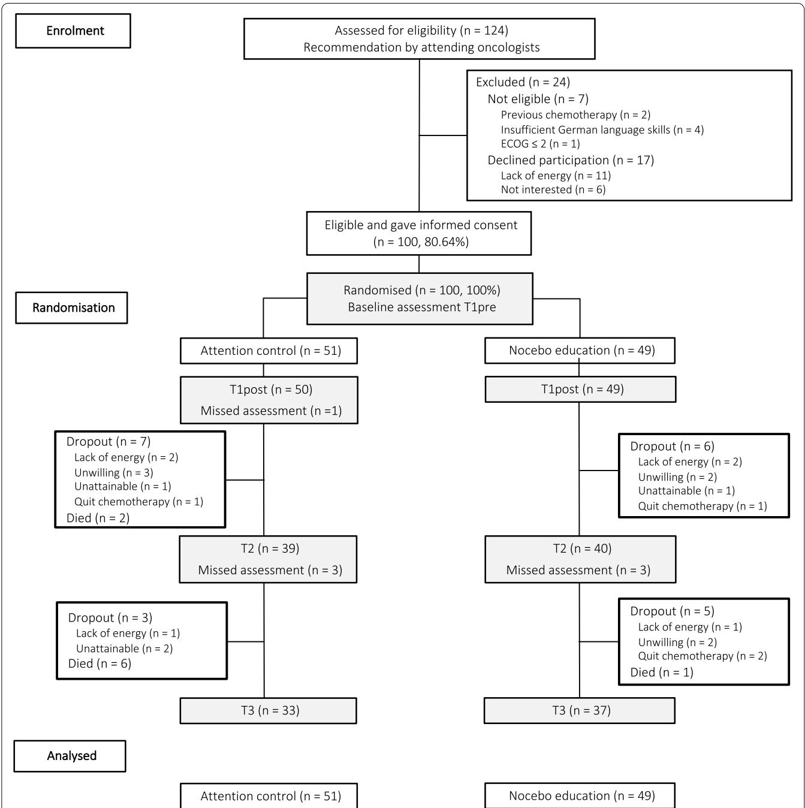
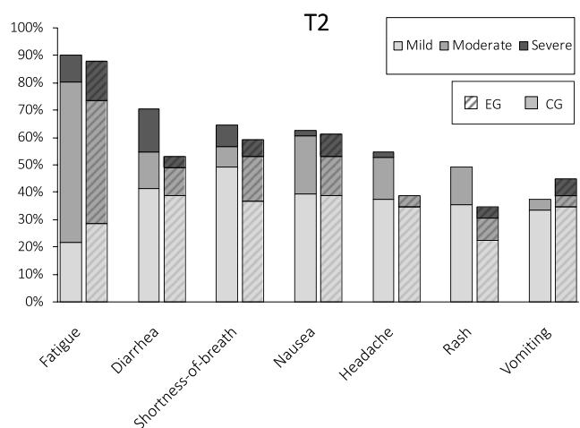
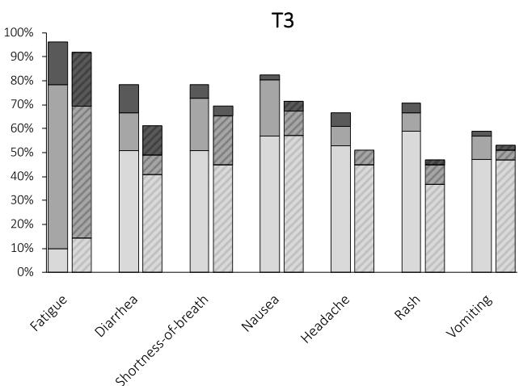
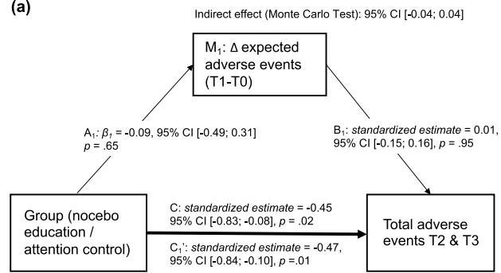
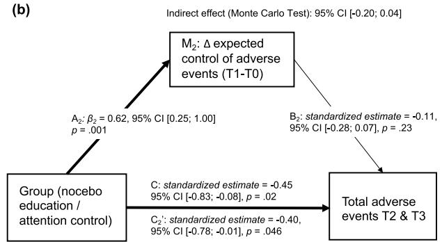

# RESEARCH

# Open Access

# Preventing adverse events of chemotherapy for gastrointestinal cancer by educating patients about the nocebo efect: a randomized-controlled trial


T. Michnevich1,2,3\*, Y. Pan1 , A. Hendi1,4, K. Oechsle5 , A. Stein5 and Y. Nestoriuc6,7

# Abstract

Background: Adverse events of chemotherapy may be caused by pharmacodynamics or psychological factors such as negative expectations, which constitute nocebo efects. In a randomized controlled trial, we examined whether educating patients about the nocebo efect is efcacious in reducing the intensity of self-reported adverse events.

Methods: In this proof-of-concept study, N = 100 outpatients (mean age: 60.2 years, 65% male, 54% UICC tumour stage IV) starting frst-line, de novo chemotherapy for gastrointestinal cancers were randomized 1:1 to a nocebo education (n 49) or an attention control group (n 51). Our primary outcome was patient-rated intensity of four chemotherapy-specifc and three non-specifc adverse events (rated on 11-point Likert scales) at 10-days and 12-weeks after the frst course of chemotherapy. Secondary outcomes included perceived control of adverse events and tendency to misattribute symptoms.

Results: General linear models indicated that intensity of adverse events difered at 12-weeks after the frst course of chemotherapy (mean diference: 4.04, 95% CI [0.72, 7.36], p .02, d 0.48), with lower levels in the nocebo education group. This was attributable to less non-specifc adverse events (mean diference: 0.39, 95% CI [0.04, 0.73], p .03, d = 0.44) and a trend towards less specifc adverse events in the nocebo education group (mean diference: 0.36, 95% CI [− 0.02, 0.74], p = .07, d = 0.37). We found no diference in adverse events at 10-days follow-up, perceived control of adverse events, or tendency to misattribute non-specifc symptoms to the chemotherapy.

Conclusions: This study provides frst proof-of-concept evidence for the efcacy of a brief information session in preventing adverse events of chemotherapy. However, results regarding patient-reported outcomes cannot rule out response biases. Informing patients about the nocebo efect may be an innovative and clinically feasible intervention for reducing the burden of adverse events.

Trial registration: Retrospectively registered on March 27, 2018 to the German Clinical Trial Register (ID: DRKS00009501).

Keywords: Placebo, Nocebo, Expectations, Chemotherapy, Adverse events

# Background

Te overwhelming majority of patients undergoing chemotherapy for gastrointestinal (GI) cancer is afected by treatment-related adverse events (AEs) [1, 2]. Among the most reported by patients are fatigue (88%), diarrhoea (75%), constipation (73%) and vomiting (58%) [1].

Aside from impairing patients’ quality of life (QoL) [3, 4], AEs are associated with decreased treatment adherence [5] and are one of the main reasons for discontinuation [6]. Moreover, they signifcantly add to the costs of cancer treatment [2]. Terefore, factors that may contribute to the development and reduction of AEs warrant clinical attention.

Patients’ experience of AEs is susceptible to the nocebo efect [7]. Here, nocebo efect denotes any adverse response to a substance that cannot be attributed to its pharmacological efects. In its most tangible form, the nocebo efect occurs after exposure to an inert substance, such as a placebo pill [8]. Meta-analysis of clinical cancer trials showed that 10–60% of patients in the placeboarms experienced AEs [9], which in fact mirrored those in the active drug arms. Arguably, these AEs are the result of patients’ negative expectations: for example, there is robust meta-analytic evidence that expectations are associated with the severity of post-chemotherapy nausea [10]. Such expectations may be evoked during informed consent [11]. Te physiological efects of expectations have been underpinned by neurobiological correlates, primarily in nocebo pain modulation [12, 13].

Nocebo responses can also occur after intake of an active drug, which may be facilitated through misattribution of symptoms or patient expectations. Several studies have shown that patients report more AEs when they are informed about potential AEs [14–16]. However, many of the AEs from verum drugs are not attributable to pharmacological efects [7]. A potential mechanism of this is misattribution of pre-existing or unrelated symptoms [8]. In a general population study, the median number of symptoms (typically day-to-day ailments such as rash or bloating) reported in the past 7 days was fve, with only 11% of participants reporting no symptoms [17–19]. Tese symptoms can be misattributed to new medications [18], especially when patients already experience many symptoms [20]. Te nocebo efect can also lead to exacerbation of medication-specifc AEs. A meta-analysis showed a mediumsized relationship between expecting and experiencing AEs of chemotherapy [21]. A further inducer of nocebo resembles the mechanism of classical conditioning: for example, prior exposure to chemotherapy increased the likelihood of pre-treatment nausea [21, 22].

An innovative means of reducing the nocebo efect suggested by Barsky and colleagues [8] is to inform patients about the nocebo efect. In theory, the awareness that not all symptoms are pharmacological efects of their therapy would allow patients to perceive symptoms as less threatening and therefore more tolerable [8]. Specifcally, misattribution of non-specifc symptoms may be reduced, and perceived control of symptoms as well as treatment expectations improved. Dysfunctional treatment expectations have been shown to infuence adverse events of cancer treatment in breast cancer [23, 24]. In a frst study [25], participants with self-reported chronic headache were recruited under the guise of participating in a clinical trial for a headache medication. All participants read a bogus medication leafet before receiving a placebo pill, and half the patients’ leafets included an explanation of the nocebo efect. Tose who received the nocebo efect leafet reported signifcantly less AEs than the control group (cf. [26]).

In summary, informing about the nocebo efect may be efective in reducing the experience of AEs. Tis type of intervention is fast, simple, cost-efective and ethically feasible; therefore, it could potentially serve as a component of adverse efect management. Moreover, it requires no alteration to clinical routine or informed consent. In this study, we therefore examine the efcacy of a nocebo education intervention in a clinical sample receiving verum medication. We hypothesized that patients undergoing chemotherapy for GI cancer would experience less AEs if they were informed about the nocebo efect. Tis patient population is exposed to considerable distress [27] and at risk for symptom misattribution: on top of possible symptoms from the underlying malignancy, two thirds of patients with GI cancer have comorbidities [28]. Suggesting that perceived AEs of chemotherapy are not solely caused by the drug itself may increase patients’ perceived self-efcacy in symptom management and reduce misattribution. To examine possible contributing factors to the efect of nocebo education, we assessed patients’ perceived control of AEs, their tendency to misattribute symptoms, compliance intention, attitude towards chemotherapy, clinician-rated toxicity and comedication used to treat AEs. Moreover, we investigated whether optimized treatment expectations mediated hypothesized benefcial efects of nocebo education. As a monitoring information coping style is associated with a higher report of AEs [29], we also assessed the moderating efect of desire for information about AEs.

# Methods

# Procedures

Te trial was approved by the University of Hamburg ethics committee (ID: 2015\_03) and retrospectively registered on March 27th, 2018 in the German Clinical Trial Register (ID: DRKS00009501). Te study was conducted in accordance with the declaration of Helsinki. Enrolment and follow-up assessments took place from 08/2015 to 05/2018 and 10/2015 to 09/2018, respectively.

Oncologists pre-screened patients for eligibility once they were indicated to receive chemotherapy. Te study team informed patients verbally and in writing about the overarching goal of the study, namely, to gain insight into patients’ expectations about chemotherapy and QoL during treatment. All participants gave written informed consent prior to enrolment. Tey were then randomized 1:1 to the nocebo education session or the attention control session. Both sessions lasted 20–30 minutes and were conducted during or 24 hours before frst chemotherapy. Both sessions were semi-manualized and conducted by a trained healthcare professional in an empathetic, patient-centred manner.

# Nocebo education group

In this four-part session, patients learned about the concept of the nocebo efect. First, the healthcare professional asked patients about prior experiences with AEs of medications or other treatments. Second, the healthcare professional presented a case-example of a nocebo response [30]. Tird, patients were handed a standardized information leafet about the nocebo efect. Using the leafet as a guide, they were encouraged to discuss about personal experiences with the nocebo efect. Fourth, patients refected on how they might apply their knowledge of the nocebo efect to their chemotherapy AEs.

# Attention control group

Te objective of this group was to control for the nonspecifc efects of psychosocial interventions, i.e., patientpractitioner alliance and attention. Using an adapted version of the Functional Assessment of Cancer Terapy - General scale (FACT-G) [31], the healthcare professional interviewed the patient on physical, emotional and functional well-being beliefs as well as spirituality, and relationship to healthcare professionals. Session notes were later discarded.

Assessments were conducted immediately before (T1pre) and after (T1post) the intervention, and at 10 days (T2) and 12 weeks (T3) after onset of chemotherapy. Patients in the control group received the nocebo education leafet by mail after their fnal assessment. Concomitant treatments, including psychosocial interventions, radiation therapy and medication, were permitted.

# Participants

Eligible patients were aged 18 years, fuent in German, chemotherapy-naïve and newly diagnosed with gastrointestinal cancer (i.e. oesophagus, stomach, pancreas, gallbladder, bile duct, small and large intestines, rectum, anus, and cancer of unknown primary with metastases in the gastrointestinal tract). Exclusion criteria were impaired capability of self-care (Eastern Co-Operative Oncology Group (ECOG) score ≥ 3), severe psychological disorder (schizophrenia, substance abuse, severe depression or severe anxiety disorder), acute medical condition, chronic skin or lung disease (or dyspnoea or rash before starting treatment) and treatment with epidermal growth factor receptor antibodies. As indicated in the study protocol [32], a sample of n = 90 was required to detect a between-group efect of medium size (Cohen’s d 0.6), given 80% power and 5% alpha-error (two-tailed). Considering a potential drop-out rate of 10%, we aimed at including N 100 patients.

# Randomization and blinding

We conducted a stratifed randomization with block sizes of 2 and 4. Prior to frst enrolment, a research assistant generated the allocation sequence using a computer program [33], and prepared sequentially numbered, opaque, sealed envelopes. Te group allocation was stratifed by distress, as it has been shown to impact the efcacy of psychosocial interventions for cancer patients [34]. Distress was assessed using a 10-point distress thermometer at T1pre (< 5 low vs.  5 high) [34]. Unaware of blocksizes, the trained healthcare professional performed the 1:1 group allocation after T1pre assessment by opening the envelope in front of the patient.

Te trained healthcare professional performed both the randomization and intervention and was therefore not blinded. Patients were unaware of the specifc research question and the content of the other intervention.

Except for manualized reminder calls for outstanding questionnaires in isolated cases, the study team did not interact with patients for the outcome assessments (data collection is further detailed in the study protocol [32]).

# Outcomes

Our primary outcome was group diference in AEs at 10 days (T2) and 12 weeks (T3) after onset of chemotherapy, assessed with the Generic Assessment of Side Efects (GASE), which demonstrated high internal consistency and validity [17]. Patients rated the severity of seven symptoms in the past 7 days from 0 not present to 10 severe. Four symptoms (nausea, vomiting, diarrhoea, and fatigue) were specifc to the most common chemotherapeutics used to treat gastrointestinal tumours (mainly fuoropyrimidines and/or platinum agents) [35–39]. Tree symptoms (headache, shortness-of-breath and rash) were non-specifc to chemotherapy [35–39]. Te item range was increased (original GASE: 0–3) in the interest of higher outcome sensitivity. A further item assessed global rating of adverse events (“Overall, how strongly did you experience adverse efects in the past 7 days?”) from 0 not present to 10 severe.

Secondary outcomes included perceived control of AEs [32], misattribution tendency [32], use of co-medication to treat AEs (yes/no), and clinician-rated toxicity (Version 4.03 [40]) at T2 and T3. Compliance intention and attitude towards chemotherapy were assessed at T2. Patients’ ability to control each symptom was assessed on a scale from 0 not at all to 10 completely using the adapted GASE-Coping, which has been previously used in a study with breast cancer patients [41]. We calculated a mean control score for patients who experienced at least one AE. Misattribution items were adapted from the GASE [41]. For each symptom, patients indicated to which degree they attribute it to the chemotherapy (from 0 not at all to 10 completely). To obtain misattribution tendency, we computed a mean across attribution tendencies of the non-specifc AEs headache, shortnessof-breath, and rash. Compliance intention was assessed with two items: “How certain are you about completing the chemotherapy?” rated from 0 not at all to 10 very and “How high is the probability that you might terminate the chemotherapy prematurely on your own account?” from 0 to 100%. We re-scaled the latter item and calculated a mean score. Patients’ attitude towards chemotherapy in general was evaluated with the item “How would you describe your attitude towards chemotherapy?” from 0 very negative to 10 very positive. Clinician-rated toxicity (i.e., AEs of chemotherapy) of the seven AEs assessed in self-rating were retrieved from patients’ medical records, as routinely assessed by the attending physician before every cycle using the Common Terminology Criteria for Adverse Events (CTCAE) Version 4.03 [40], a standardized system which grades adverse events according to organ specifc parameters. For comparability with patients’ self-rating of AEs, we used the gradings recorded at the consultations closest to T2 and T3.

# Further assessments

Patients’ expectations of the severity (AE expectations; “How much to you expect to experience [symptom]?”) and expected control of each AE (control expectations; “How much to you expect to be able to infuence [symptom]?”) were assessed at T1pre and T1post. Items were rated on a scale of 0 not at all to 10 completely. Cronbach’s alpha indicated good internal consistency (AE expectations: α .89–.91; control expectations: α .88–.91).

Sociodemographic data, distress level, tumour site, chronic somatic diseases, and desire for information were self-reported at T1pre. Tumour stage (UICC [42]), treatment aim and chemotherapy regimens at T1pre and tumour progression (yes/no) at T2 and T3 were retrieved from medical records. At T1post, patients evaluated the relevance of the respective intervention and whether they would recommend it to other patients (0 not at all to 10 completely). As a manipulation check, the nocebo education group was asked to give free-text descriptions of the nocebo efect at T1post and T2.

# Statistical analysis

All analyses were conducted with the intention-to-treat sample. Among completed questionnaires, missing values ranged between 1 and 6.3% per item. Data were imputed using multiple imputation and the fully conditional specifcation method. Both death and discontinuation of chemotherapy were included as indicators [43]. We generated 15 imputed datasets and pooled parameters according to Rubin’s rule [44]. Adjusted degrees of freedom were computed by hand and in alignment with the R package mice’s procedures [45]. Co-medication to treat AEs (yes/no) was imputed from medical records. CTCAE data were missing for 27 patients at T2 and 40 patients at T3, and were not imputed. SPSS version 25.0 [46] was used for data analyses and imputation.

We computed linear mixed models for repeated measures using restricted maximum-likelihood estimation and a variance component matrix type for our primary outcome AEs and our secondary outcomes control of AEs and misattribution tendency. Te assessment timepoints T2 and T3 (level-1) were nested within patients (level-2). Fixed efects included Group, Time, Group x Time, Distress, and Cancer Staging. Te intercept was included as a random efect. Group diferences were examined via pairwise comparisons. Assumptions of linear models were checked prior to analyses [47]. Te outcomes specifc AEs, non-specifc AEs, control of AEs, and misattribution tendency were right-skewed and therefore transformed to meet assumptions of residual normality and homoscedasticity. A square root transformation (formula: √[X 1]) was chosen based on visual examination and after Kirk’s [48] systematic approach.

We conducted regression analyses to examine the group diference in attitude towards chemotherapy (linear regression), compliance intention (Poisson regression), and co-medication to treat AEs (yes/no; logistic regression). In all multivariate analyses, the stratum distress, cancer staging, and (if existent) the baseline of the respective outcome variable, were included as covariates [32].

We calculated risk ratios for experiencing at least one AE based on the CTCAE.

We hypothesized that the efect of Group on AEs is mediated through changes in expectations. We calculated two models: group as predictor (X), AEs at T2 and T3 as outcomes (Y), and change in expected AEs (model 1; $\mathbf { M } _ { 1 } )$ or change in expected control of AEs (model 2;

$\mathbf { M } _ { 2 } )$ as the mediator. We obtained path a via regression analyses, and paths b and c’ via linear mixed models [49]. All efects were standardized. Mediation efects were examined using Monte Carlo simulations with 20,000 repetitions [50, 51]; mediation was established if the confdence interval around the indirect efect did not contain zero.

Lastly, desire for information about AEs was examined as a moderator of the primary outcome by including the desire for information and desire for information x Group as additional fxed efects in the linear mixed models.

Sensitivity analyses of the primary outcome can be found in Supplementary Material A.

# Results

# Patient fow

Of all patients pre-screened by their oncologist, n 124 were referred for eligibility assessment (Fig.  1). Tereof, N 100 participants were randomized into the nocebo education (n 49) and attention control (n 51) groups. Participants received the respective intervention during the frst course of chemotherapy, except for three who received it prior. Te dropout rate was 30%; by T3, n 12 (24.4%) and n 18 (35.3%) patients in the nocebo education and control group were lost. Te range of completion was 4–72 days after onset of chemotherapy (M 19.5, SD 13.22) for T2 (scheduled: 10 days) and 73–225days (M 110.1, SD 31.54) for T3 (scheduled: 12 weeks i.e., 84 days). Exploratory analysis revealed no correlation between completion time and the main outcome (sum score of AEs at T2 and T3; ps > .11).

Patient characteristics are detailed in Table 1. To estimate comparability of chemotherapy regimens and expected adverse events between groups, we calculated and found that the number of patients who received platin-based chemotherapy did not difer between groups $( X ^ { 2 } \left( 1 , N = 1 0 0 \right) = 0 . 4 3 3 , p = 0 . 5 1 )$ .

Most patients received either postoperative chemotherapy ( 3 months,  6 months) or palliative chemotherapy (treatment applied until progression or intolerability). Only 24 patients received neoadjuvant chemotherapy, mostly for either pancreatic or locally advanced colorectal cancer ( 3 months). Neoadjuvant treatment for less than 3 months was applied in 8 patients with esophagogastric cancer, however due to delays, the interval between last chemotherapy and T3 was less than 3 weeks in all these patients.

# Primary outcome: adverse events

At T2, four patients and at T3, one patient indicated no AEs. Among patients who did, the mean sum score of all seven adverse events was 14.83 (range: 1–36) at T2 and 17.61 (range: 3–44) at T3. At T2, 22 and at T3, 12 patients reported no non-specifc AEs. Te global rating of adverse events had a moderately positive correlation with total AEs (specifc + non-specifc) at T2 $( r = 0 . 6 2 , p < . 0 0 1 )$ and T3 $( r = 0 . 5 6 , p < . 0 0 1 )$ . Type and severity of self-reported AEs are detailed in Fig. 2.

At T3, AEs in the nocebo education group were signifcantly lower, by 4.04 points (SE 1.69), than in the control group (Table  2). Similarly, square root transformed non-specifc AEs were signifcantly lower in the nocebo education group at T3 by 0.39 points (SE 0.18). Group diferences in trend were found for both square-root transformed specifc AEs and the global AE scale at T3. At T2, AEs did not difer between groups.

# Secondary outcomes

On average, patients rated their ability to control AEs and their misattribution tendency as low (Table  2). Linear mixed models indicated no signifcant group diferences in perceived control of AEs and misattribution tendency (Table 2).

Patients’ overall attitude towards their chemotherapy was positive (M 7.45, SD 2.03) and compliance intention was very high (M 8.76, SD 1.41), with 45% of patients indicating a maximum score of 10. Both variables did not difer by group (attitude towards chemotherapy: β = 0.06, 95% CI [−0.34; 0.46], p = .79; compliance intention: OR 0.76, 95% CI [0.51; 1.19], p .24).

At T2 n 52 (of n 82; 63.4%) and at and T3, n 54 (of n 83, 65.0%) patients reported using co-medication to treat AEs, with no signifcant group diferences (T2: OR 1.98, 95% CI [0.77, 5.12], p .16, Nagelkerke’s R2 = .09; percentage of correctly predicted cases: 68.3%; T3: OR 0.73, 95% CI [0.29, 1.85], p .51, Nagelkerke’s R2 .06; percentage of correctly predicted cases: 66.3%).

Descriptive statistics of clinician-rated AEs according to CTCAE [40] are given in Table  3. Te risk ratio for developing at least one AE when allocated to nocebo education vs. control group was 1.14 at T2 (95% CI [0.73, 1.78], p .57), and 1.25 at T3 (95% CI [0.72; 2.16], p .43).

# Mechanisms of change

Figure  3 shows the results of the two mediation models. Neither of our two hypothesized mediators were found to explain the efect of the group on our primary outcome total AEs at T2 and T3. Te Monte Carlo test of mediation indicated no indirect efect of change in expected AEs $( \mathrm { M _ { 1 } } ; 9 5 \% \mathrm { C I } [ - 0 . 0 4 ; 0 . 0 4 ] )$ , nor of change in expected control of AEs $( \mathrm { M } _ { 2 } { : } 9 5 \% \mathrm { C I } [ - 0 . 2 0 ; 0 . 0 4 ] )$ .



<details>
<summary>flowchart</summary>

```mermaid
graph TD
    A["Enrolment"] --> B["Assessed for eligibility (n = 124)\nRecommendation by attending oncologists"]
    B --> C{Eligible and gave informed consent\n(n = 100, 80.64%)}
    B --> D{Randomised (n = 100, 100\%)\nBaseline assessment T1pre}
    C --> E["Attention control (n = 51)"]
    C --> F["Nocebo education (n = 49)"]
    E --> G["T1post (n = 50)\nMissed assessment (n =1)"]
    F --> H["T1post (n = 49)"]
    G --> I["Dropout (n = 7)\nLack of energy (n = 2)\nUnwilling (n = 3)\nUnattainable (n = 1)\nQuit chemotherapy (n = 1)\nDied (n = 2)"]
    H --> J["T2 (n = 39)\nMissed assessment (n = 3)"]
    I --> K["Dropout (n = 3)\nLack of energy (n = 1)\nUnattainable (n = 2)\nDied (n = 6)"]
    J --> L["T3 (n = 33)"]
    K --> M["T2 (n = 40)\nMissed assessment (n = 3)"]
    L --> N["T3 (n = 37)"]
    M --> O["Dropout (n = 5)\nLack of energy (n = 1)\nUnwilling (n = 2)\nQuit chemotherapy (n = 2)\nDied (n = 1)"]
    N --> P["Attention control (n = 51)"]
    O --> Q["Nocebo education (n = 49)"]
    B --> R["Excluded (n = 24)\nNot eligible (n = 7)\nPrevious chemotherapy (n = 2)\nInsufficient German language skills (n = 4)\neCOG ≤ 2 (n = 1)\nDeclined participation (n = 17)\nLack of energy (n = 11)\nNot interested (n = 6)"]
```
</details>

Fig. 1 CONSORT diagram. ECOG = Eastern Co-operative Oncology Group; values ≤ 2 indicate limited capability of self-care. Assessment points are shaded. T1pre and T1post immediately pre- and post-intervention, T2 10 days after onset of chemotherapy and T3 12 weeks after onset of chemotherapy. Missed assessment patients who missed the respective assessment but remained enrolled. One patient in the attention control group discontinued chemotherapy but completed T3

# Moderator of the intervention

Te interaction efect of Group x Desire for information about AEs was not signifcant in the linear mixed model (Y total AEs), indicating no moderating efect of desire for information about AEs on total AEs (estimate: 0.06, 95% CI [ 0.43; 0.54], p .82).

# Evaluation of the intervention

Patients in both groups rated the conversation as highly relevant (nocebo education group: M = 8.08, SD = 1.90; control group: M 7.30, SD 2.19; range: 0–10) and indicated highly recommending it to other patients

Table 1 Sample characteristics at baseline 

<table><tr><td rowspan="2"></td><td>Total Sample (N=100)</td><td colspan="2">EG (n=49)</td><td colspan="2">CG (n=51)</td></tr><tr><td> $N^a$ </td><td>N</td><td>%</td><td>N</td><td>%</td></tr><tr><td>Age, years (M, SD)</td><td>60.22 (11.45)</td><td>58.53</td><td>12.39</td><td>61.84</td><td>10.20</td></tr><tr><td>Gender (female)</td><td>35</td><td>15</td><td>30.6</td><td>20</td><td>39.2</td></tr><tr><td>Education</td><td></td><td></td><td></td><td></td><td></td></tr><tr><td>≤ 10 year of school</td><td>56</td><td>25</td><td>51</td><td>31</td><td>60.8</td></tr><tr><td>13 years of school</td><td>23</td><td>12</td><td>24.5</td><td>11</td><td>21.6</td></tr><tr><td>University degree</td><td>21</td><td>12</td><td>24.5</td><td>9</td><td>17.6</td></tr><tr><td>Employment status</td><td></td><td></td><td></td><td></td><td></td></tr><tr><td>Employed</td><td>51</td><td>27</td><td>55.1</td><td>24</td><td>47.1</td></tr><tr><td>Freelancer</td><td>20</td><td>8</td><td>16.3</td><td>12</td><td>23.5</td></tr><tr><td>Homemaker</td><td>5</td><td>2</td><td>4.1</td><td>3</td><td>5.9</td></tr><tr><td>Unemployed</td><td>2</td><td>2</td><td>4.1</td><td>0</td><td>0</td></tr><tr><td>Pensioner</td><td>22</td><td>10</td><td>20.4</td><td>12</td><td>23.5</td></tr><tr><td>Location</td><td></td><td></td><td></td><td></td><td></td></tr><tr><td>University Clinic Hamburg-Eppendorf</td><td>91</td><td>45</td><td>91.8</td><td>46</td><td>90.2</td></tr><tr><td>Cooperating practice</td><td>9</td><td>4</td><td>8.2</td><td>5</td><td>9.8</td></tr><tr><td>Healthcare  $professional^b$ </td><td></td><td></td><td></td><td></td><td></td></tr><tr><td>BSc Psychologist (female)</td><td>35</td><td>19</td><td>37.3</td><td>16</td><td>45.7</td></tr><tr><td>Medical doctoral candidate (male)</td><td>65</td><td>32</td><td>62.7</td><td>33</td><td>32.7</td></tr><tr><td>Cancer Staging (UICC)</td><td></td><td></td><td></td><td></td><td></td></tr><tr><td>I</td><td>4</td><td>2</td><td>4.1</td><td>2</td><td>3.9</td></tr><tr><td>II</td><td>5</td><td>3</td><td>6.1</td><td>2</td><td>3.9</td></tr><tr><td>III</td><td>37</td><td>14</td><td>28.6</td><td>23</td><td>45.1</td></tr><tr><td>IV</td><td>54</td><td>30</td><td>61.2</td><td>24</td><td>47.1</td></tr><tr><td>Type of cancer</td><td></td><td></td><td></td><td></td><td></td></tr><tr><td>Upper gastrointestinal tract</td><td>31</td><td>10</td><td>20.4</td><td>21</td><td>41.2</td></tr><tr><td>Lower gastrointestinal tract</td><td>35</td><td>22</td><td>44.9</td><td>13</td><td>25.5</td></tr><tr><td>Gallbladder &amp; biliary tract</td><td>8</td><td>4</td><td>8.2</td><td>4</td><td>7.8</td></tr><tr><td>Cancer of unknown primary</td><td>3</td><td>2</td><td>4.1</td><td>1</td><td>2.0</td></tr><tr><td>Liver</td><td>1</td><td>1</td><td>2.0</td><td>1</td><td>2.0</td></tr><tr><td>Pancreas</td><td>10</td><td>10</td><td>20.4</td><td>11</td><td>21.6</td></tr><tr><td>Type of chemotherapy</td><td></td><td></td><td></td><td></td><td></td></tr><tr><td>Adjuvant</td><td>25</td><td>14</td><td>28.6</td><td>11</td><td>21.6</td></tr><tr><td>Neoadjuvant</td><td>24</td><td>9</td><td>18.4</td><td>15</td><td>29.4</td></tr><tr><td>Palliative</td><td>49</td><td>24</td><td>49.0</td><td>25</td><td>49.0</td></tr><tr><td>Additive</td><td>2</td><td>2</td><td>4.1</td><td>0</td><td>0</td></tr><tr><td>Additional radiation therapy</td><td>12</td><td>5</td><td>10.2</td><td>7</td><td>13.7</td></tr><tr><td>First-line chemotherapy regimen</td><td></td><td></td><td></td><td></td><td></td></tr><tr><td>Fluoropyrimidine/ platin doublet $^c$ </td><td>37</td><td>18</td><td>36.7</td><td>19</td><td>37.2</td></tr><tr><td>Fluoropyrimidine/ platin triplet $^d$ </td><td>14</td><td>5</td><td>10.2</td><td>9</td><td>17.7</td></tr><tr><td>Platin-based doublet $^e$ </td><td>25</td><td>16</td><td>32.7</td><td>9</td><td>17.7</td></tr><tr><td>Other doublets $^f$ </td><td>7</td><td>2</td><td>4.1</td><td>5</td><td>9.8</td></tr><tr><td>Monotherapy $^g$ </td><td>11</td><td>7</td><td>14.3</td><td>4</td><td>7.8</td></tr><tr><td>Missing information</td><td>6</td><td>1</td><td>2.0</td><td>5</td><td>9.8</td></tr><tr><td>Physical comorbidity present</td><td>40</td><td>17</td><td>34.7</td><td>23</td><td>45.1</td></tr><tr><td>High distress ( $\geq 5$ ) $^h$ </td><td>71</td><td>35</td><td>71.4</td><td>36</td><td>70.6</td></tr><tr><td>Distress (M, SD) $^i$ </td><td>5.74 (2.89)</td><td>5.75</td><td>2.83</td><td>5.73</td><td>2.98</td></tr><tr><td>Compliance intention</td><td>9.09 (1.41)</td><td>9.01</td><td>1.54</td><td>9.17</td><td>1.29</td></tr><tr><td>Attitude towards chemotherapy (M, SD) $^j$ </td><td>7.85 (2.19)</td><td>7.78</td><td>2.32</td><td>7.92</td><td>2.07</td></tr><tr><td>Perceived efficacy of the chemotherapy ( $M, SD)^k$ </td><td>8.72 (1.52)</td><td>8.67</td><td>1.62</td><td>8.78</td><td>1.44</td></tr><tr><td>Desire for information about AEs ( $M, SD)^l$ </td><td>6.92 (3.01)</td><td>6.98</td><td>2.93</td><td>6.86</td><td>3.11</td></tr><tr><td>Expected AEs ( $M, SD)^l$ </td><td>3.85 (1.86)</td><td>3.94</td><td>1.73</td><td>3.75</td><td>2.00</td></tr><tr><td>Expected control of AEs ( $M, SD)^l$ </td><td>4.72 (1.95)</td><td>4.86</td><td>1.94</td><td>4.59</td><td>1.97</td></tr></table>

AEs adverse events, CG attention control group, EG nocebo education group, UICC Union for International Cancer Control   
a As overall sample size is N = 100, percentages equal numbers   
b The healthcare professional delivered the nocebo education or conducted the quality of life interview in the attention control group   
c FOLFOX (leucovorin, 5-fuorouracil & oxaliplatin), FUFOX (high dosage 5-fuorouracil, folic acid & oxaliplatin), CAPOX (capecitabine  oxaliplatin), FLO (5-fuorouracil, leucovorin & oxaliplatin)   
d FOLFIRINOX (5-fuorouracil, irinotecan & oxaliplatin), FLOT (5-fuorouracil, leucovorin, oxaliplatin & docetaxel)   
e carboplatin etoposide, carboplatin  taxane, GEM (gemcitabine) cisplatin, cisplatin  CAP (capecitabine), 5-FU (fuorouracil) cisplatin   
f FOLFIRI (5-FU, folic acid & irinotecan), CAP / 5-FU mitomycin, GEM  taxane   
g 5-FU, GEM, CAP   
h Groups were stratifed for distress   
i Scale ranges from 1 to 10   
j Scale ranges from 0 to 10, higher values indicate a more positive attitude   
k Scale ranges from 0 to 10, higher values indicate believing in the efcacy   
l Indicated for n = 99 patients at T1post



<details>
<summary>bar_stacked</summary>

| Symptom             | Mild  | Moderate | Severe | EG    | CG    |
|---------------------|-------|----------|--------|-------|-------|
| Fatigue             | 20%   | 45%      | 10%    | 30%   | 60%   |
| Diarrhea            | 40%   | 15%      | 15%    | 10%   | 20%   |
| Shortness-of-breath | 45%   | 15%      | 10%    | 10%   | 15%   |
| Nausea              | 35%   | 20%      | 10%    | 15%   | 15%   |
| Headache            | 35%   | 15%      | 5%     | 10%   | 10%   |
| Rash                | 30%   | 20%      | 5%     | 15%   | 10%   |
| Vomiting            | 30%   | 15%      | 5%     | 10%   | 10%   |
</details>



<details>
<summary>bar_stacked</summary>

| Symptom              | Bottom Segment | Top Segment | Total |
|----------------------|----------------|-------------|-------|
| Fatigue              | 10%            | 70%         | 95%   |
| Diarrhea             | 40%            | 20%         | 60%   |
| Shortness-of-breath  | 45%            | 25%         | 70%   |
| Nausea               | 55%            | 25%         | 80%   |
| Headache             | 50%            | 15%         | 65%   |
| Rash                 | 35%            | 10%         | 70%   |
| Vomiting             | 45%            | 10%         | 60%   |
</details>

Fig. 2 Severity and frequency of AEs at ten days and 12 weeks after frst dose of chemotherapy (imputed data). Symptom severity was graded into 1–3 mild, 4–7 moderate and 8–10 severe. Specifc adverse events: fatigue, diarrhoea, nausea and vomiting; non-specifc adverse events: shortness-of-breath, headache and rash. CG = attention control group (n = 51); EG = nocebo education group (n = 49)

(nocebo education group: M 8.94, SD 1.44; control group: M 8.48, SD 1.87; range: 0–10).

# Discussion

AEs of chemotherapy are susceptible to the nocebo efect [21]. In the present study, we tested whether a nocebo education intervention could reduce AEs of chemotherapy in patients with GI cancer.

For our primary outcome, we found that 12 weeks (T3) after onset of chemotherapy, patients in the nocebo education group experienced signifcantly less AEs than the control group; specifcally, they had less non-specifc AEs and a trend towards less specifc AEs. At 10-days (T2), there was no group diference. We found no group differences in control of AEs, misattribution of non-specifc AEs to chemotherapy, attitude towards chemotherapy, compliance intention, use of co-medication to treat AEs,

iferences in adverse events, control of adverse events, and misattri 

<table><tr><td rowspan="3"></td><td colspan="7">T2</td><td colspan="7">T3</td></tr><tr><td colspan="3">CG</td><td colspan="3">EG</td><td rowspan="2">Group Comparison</td><td colspan="3">CG</td><td colspan="3">EG</td><td rowspan="2">Group Comparison</td></tr><tr><td>M</td><td>SE</td><td>N</td><td>M</td><td>SE</td><td>N</td><td>M</td><td>SE</td><td>N</td><td>M</td><td>SE</td><td>N</td></tr><tr><td>Total AEs</td><td>14.87</td><td>1.19</td><td>51</td><td>13.58</td><td>1.20</td><td>49</td><td>Mean difference: 1.30, 95% CI [−2.00, 4.59], Wald = 0.77, df = 87, p = .44, d = 0.15</td><td>19.41</td><td>1.19</td><td>51</td><td>15.37</td><td>1.21</td><td>49</td><td>Mean difference: 4.04, 95% CI [0.72, 7.36], Wald = 2.39, df = 86, p = .02, d = 0.48</td></tr><tr><td>Specific AEs</td><td>3.14</td><td>0.14</td><td></td><td>3.10</td><td>0.14</td><td></td><td>Mean difference: 0.04, 95% CI [−0.34, 0.41], Wald = 0.19, df = 88, p = .85, d = 0.04</td><td>3.62</td><td>0.14</td><td></td><td>3.26</td><td>0.14</td><td></td><td>Mean difference: 0.36, 95% CI [−0.02, 0.74], Wald = 1.84, df = 85, p = .07, d = 0.37</td></tr><tr><td>Original scale</td><td>8.85</td><td></td><td></td><td>8.62</td><td></td><td></td><td></td><td>12.12</td><td></td><td></td><td>9.65</td><td></td><td></td><td></td></tr><tr><td>Non-Specific AEs</td><td>2.29</td><td>0.13</td><td></td><td>2.05</td><td>0.13</td><td></td><td>Mean difference: 0.24, 95% CI [−0.11, 0.59], Wald = 1.35, df = 82, p = .18, d = 0.27</td><td>2.61</td><td>0.12</td><td></td><td>2.22</td><td>0.13</td><td></td><td>Mean difference: 0.39, 95% CI [0.04, 0.73], Wald = 2.19, df = 83, p = .03, d = 0.44</td></tr><tr><td>Original scale</td><td>4.26</td><td></td><td></td><td>3.22</td><td></td><td></td><td></td><td>5.81</td><td></td><td></td><td>3.94</td><td></td><td></td><td></td></tr><tr><td>Global AE scale</td><td>4.43</td><td>0.37</td><td>51</td><td>3.90</td><td>0.37</td><td>49</td><td>Mean difference: 0.53, 95% CI [−0.49, 1.56], Wald = 1.02, df = 86, p = 0.31, d = 0.20</td><td>5.45</td><td>0.37</td><td>51</td><td>4.32</td><td>0.39</td><td>49</td><td>Mean difference: 1.01, 95% CI [−0.02, 2.05], Wald = 1.92, df = 84, p = .06, d = 0.38</td></tr><tr><td>Control of AEs</td><td>1.88</td><td>0.07</td><td>48</td><td>1.93</td><td>0.07</td><td>48</td><td>Mean difference: −0.05, 95% CI [−0.23, 0.14], Wald = 0.51, df = 83, p = .61, d = 0.10</td><td>1.76</td><td>0.06</td><td>51</td><td>1.77</td><td>0.07</td><td>48</td><td>Mean difference: −0.01, 95% CI [−0.19, 0.17], Wald = 0.07, df = 87, p = .95, d = 0.01</td></tr><tr><td>Original scale</td><td>2.53</td><td></td><td></td><td>2.71</td><td></td><td></td><td></td><td>2.11</td><td></td><td></td><td>2.13</td><td></td><td></td><td></td></tr><tr><td>Misattribution tendency</td><td>2.08</td><td>0.08</td><td>42</td><td>1.89</td><td>0.08</td><td>36</td><td>Mean difference: 0.19, 95% CI [−0.04, 0.42], Wald = 1.65, df = 58, p = .10, d = 0.38</td><td>2.21</td><td>0.07</td><td>47</td><td>2.08</td><td>0.08</td><td>41</td><td>Mean difference: 0.13, 95% CI [−0.07, 0.34], Wald = 1.27, df = 72, p = .21, d = 0.27</td></tr><tr><td>Original scale</td><td>3.31</td><td></td><td></td><td>2.55</td><td></td><td></td><td></td><td>3.89</td><td></td><td></td><td>3.33</td><td></td><td></td><td></td></tr></table>

ignifcant diferences were indicated in bold. Primary outcom g   . p  (g   p  (g    .  g   g    .    at least one AE. Misattribution tendency (range: 0 to 10) was computed for patients who reported non-specifc AEs. Means on the original scales w ne:0to70SecifcAEsrane:0–40andnon-secifcAEsrane:0–30areitssubscalesThelobalAEscaleranedfrom0to10Controlof f linear mixed models after adjusting for distress and cancer staging. The primary outcome, total adverse events (AEs), is a sum-score of 7 sympt )))   
n control group, EG nocebo education group, CI Confdence inter t, T2 10 days after onset of chemotherapy, T3 12 weeks after ons

Table 3 Clinician-rated adverse events of chemotherapy at T2 and T3 according to Common Terminology Criteria for Adverse Events 

<table><tr><td rowspan="3"></td><td colspan="7">T2</td><td colspan="7">T3</td></tr><tr><td colspan="3">EG (n=38)</td><td colspan="3">CG (n=35)</td><td rowspan="2">Sum</td><td colspan="3">EG (n=31)</td><td colspan="3">CG (n=29)</td><td rowspan="2">Sum</td></tr><tr><td>G1</td><td>G2</td><td>G3</td><td>G1</td><td>G2</td><td>G3</td><td>G1</td><td>G2</td><td>G3</td><td>G1</td><td>G2</td><td>G3</td></tr><tr><td>Nausea</td><td>6</td><td>6</td><td>0</td><td>4</td><td>1</td><td>0</td><td>17</td><td>4</td><td>2</td><td>0</td><td>3</td><td>0</td><td>1</td><td>10</td></tr><tr><td>Vomiting</td><td>0</td><td>2</td><td>0</td><td>3</td><td>0</td><td>0</td><td>19</td><td>0</td><td>0</td><td>0</td><td>1</td><td>0</td><td>1</td><td>2</td></tr><tr><td>Diarrhoea</td><td>4</td><td>2</td><td>0</td><td>7</td><td>2</td><td>0</td><td>15</td><td>5</td><td>1</td><td>0</td><td>2</td><td>1</td><td>0</td><td>9</td></tr><tr><td>Fatigue</td><td>4</td><td>6</td><td>0</td><td>1</td><td>1</td><td>0</td><td>12</td><td>4</td><td>5</td><td>0</td><td>3</td><td>1</td><td>1</td><td>14</td></tr><tr><td>Headache</td><td>0</td><td>0</td><td>0</td><td>0</td><td>1</td><td>0</td><td>1</td><td>0</td><td>0</td><td>0</td><td>1</td><td>0</td><td>0</td><td>1</td></tr><tr><td>Shortness-of-breath</td><td>0</td><td>1</td><td>0</td><td>0</td><td>0</td><td>0</td><td>1</td><td>2</td><td>0</td><td>0</td><td>1</td><td>0</td><td>0</td><td>3</td></tr><tr><td>Rash</td><td>2</td><td>0</td><td>0</td><td>0</td><td>0</td><td>0</td><td>2</td><td>1</td><td>0</td><td>0</td><td>0</td><td>1</td><td>0</td><td>2</td></tr><tr><td></td><td colspan="3">≥1 AE: n=21</td><td colspan="3">≥1 AE: n=17</td><td></td><td colspan="3">≥1 AE: n=16</td><td colspan="3">≥1 AE: n=12</td><td></td></tr></table>

AE adverse events, CG attention control group, EG nocebo education group, T2 10 days after onset of chemotherapy; T3 12 weeks after onset of chemotherapy. G1 Grade 1 “Mild; asymptomatic or mild symptoms; clinical or diagnostic observations only; intervention not indicated”, G2 Grade 2 “Moderate; minimal, local or non-invasive intervention indicated; limiting age-appropriate instrumental activities of daily living, G3 Grade 3 “Severe or medically signifcant but not immediately life-threatening; hospitalization or prolongation of hospitalization indicated; disabling; limiting self-care activities of daily living (defned by the National Institutes of Health, National Cancer Institute, 2009)

or risk of developing at least one AE. Further, information coping style did not infuence the group diference in AEs.

# Adverse events

Tis is the frst study to show that the AEs of a medication can be reduced by educating patients about the nocebo efect, at a moderate efect size. Tereby, it confrms the clinical transferability of this concept from fndings of two prior studies which experimentally induced symptoms that were subsequently reduced by nocebo education [25, 26].

Te group diference in AEs was mainly attributable to a reduction in non-specifc AEs (headache, shortness-ofbreath, and rash) in the nocebo education group. As we expected, the prevalence of non-specifc AEs surpassed rates defned in chemotherapy drug trials [35–39]. In such trials, AEs are rated by blinded physicians or nurse practitioners and rated as such if they signifcantly surpass the AEs observed in the placebo arm of the trial. In contrast, patients who are reporting on their selfperceived symptoms will commonly indicate common ailments known to be highly prevalent in the general population [18]. Terefore, the discrepancy between selfreported and observed AEs is often considerable [52, 53].

A plausible explanation for the reduction of non-specifc AEs is a learning efect [54]: with each dose of chemotherapy, the causal relationship between chemotherapy and specifc AEs is reinforced. Tis may have helped patients to diferentiate them from non-specifc AEs. Te intervention aimed at teaching patients to identify non-specifc AEs as potentially nocebogenic, and therefore less threatening, which may have decreased patients’ perceived severity. Tis learning process may have taken some time, potentially explaining why the group difference was detected after 12-weeks (T3) but not after 10-days (T2). Tere was a trend towards reduction of specifc AEs at T3 as well, yet the simultaneous, powerful conditioning efect from preceding chemotherapy doses [8, 21, 55] may have amplifed specifc AEs to the extent that they were less cognitively mutable than non-specifc AEs [56]. Conversely, in patients whose preemptive comedication – as is standard protocol for the specifc AE nausea [57] – was efective, the nocebo education session was perhaps not capable of further AE reduction. Tis is not however plausible for fatigue, which has no gold-standard pharmacological treatment [58]. In summary, specifc AEs may be less modifable than non-specifc AEs because pronounced specifc AEs are subject to conditioning efects, whereas medication-controlled AEs may already be sufciently controlled.

Other trials aimed at reducing nocebo efects of verum medications have used positive framing methods. A recent review [59] shows that only one out of three studies which applied framing to AEs of a medication achieved a signifcant reduction of 2 out of 12 listed AEs [60]. Tis underlines that medication AEs are difcult to modify, emphasizing the relative impact of our fndings. Since our research is novel in its method of AE modifcation as applied to verum medication, our results require replication.

In the context of psychosocial interventions for GI cancer patients, our intervention demonstrates favourable results. Mosher et al. [61] conducted a systematic review of 14 studies using interventions such as education, supportive care and relaxation in patients with colorectal cancer. Six of the eight interventions with QoL outcomes that included disease or treatment specifc symptoms produced no efect [61]. One study in which patients were provided with regular home visits for informational and emotional support compared to treatment as usual showed a reduction in fatigue (p .048), but not other symptoms such as diarrhoea or shortness-of-breath [62]. Likewise, training in progressive muscle relaxation improved overall colorectal cancer-related QoL (p < .001) and physical health specifcally (p < .01) [63]. Notably, both these interventions were considerably longer than ours yet their efects, unlike ours, were not controlled for attentiveness from the delivering healthcare professional. Findings from two further studies including a sample of primarily GI cancer [64] and hepatocellular-, gallbladder or cholangiocellular carcinoma [65] patients have the same trajectory: individually tailored psychotherapy sessions caused clinically relevant reductions in AEs [65] and a web-based collaborative care intervention with fortnightly follow-ups likewise produced small to medium efect sized improvements on pain and QoL [64]. Terefore, we conclude that our intervention was efective and efcient compared to other psychosocial interventions.



<details>
<summary>flowchart</summary>

```mermaid
graph TD
    A["Group (nocebo education / attention control)"] -->|A₁: β₁ = -0.09, 95% CI["-0.49; 0.31"], p = .65| B["M₁: Δ expected adverse events (T1-T0)"]
    A -->|C: standardized estimate = -0.45, 95% CI["-0.83; -0.08"], p = .02| C["Total adverse events T2 & T3"]
    B -->|B₁: standardized estimate = 0.01, 95% CI["-0.15; 0.16"], p = .95| C
    D["Indirect effect (Monte Carlo Test): 95% CI [-0.04; 0.04"]] --> A
    D --> B
    D --> C
```
</details>



<details>
<summary>flowchart</summary>

```mermaid
graph TD
    A["Group (nocebo education / attention control)"] -->|A₂: β₂ = 0.62, 95% CI["0.25; 1.00"], p = .001| B["M₂: Δ expected control of adverse events (T1-T0)"]
    A -->|C: standardized estimate = -0.45, 95% CI["-0.83; -0.08"], p = .02| C["Total adverse events T2 & T3"]
    B -->|B₂: standardized estimate = -0.11, 95% CI["-0.28; 0.07"], p = .23| C
    D["Indirect effect (Monte Carlo Test): 95% CI [-0.20; 0.04"]] --> A
    D --> B
    D --> C
```
</details>

Figure XX.Mediation models. (a)M:Change in expected adverse events.(b)Mz: Change in expected controlofadverse events. Affct regressionanalysis,B,C,and C'areobtainedthrough linearmixed models.The total efect Cisidenticalforboth models.   
Fig. 3 Mediation models. a M1: Change in expected adverse events. b M2: Change in expected control of adverse events. A = efect of Group on candidate mediator; B = efect of candidate mediator on total adverse events T2 & T3; C = total efect; C′ = direct efect. A is obtained through regression analysis, B, C, and C′ are obtained through linear mixed models. The total efect C is identical for both models

Te prevalence of self-reported AEs resembles selfreport from n 142 colorectal cancer patients receiving chemotherapy; the rank order of fatigue, diarrhoea, dyspnoea, rash and vomiting also mirror [1]. In a further study of self-report symptom prevalence in colorectal cancer patients, fatigue was also the most commonly, and rash and vomiting the most seldomly reported of the symptoms that we analysed [66]. Te high prevalence of fatigue refects the lack of efective pharmacological treatment, whereas vomiting appears efectively controlled with pre-treatment antiemetics. Te overall higher prevalence of symptoms at T3 than at T2 also corresponds to self-report fndings by which chemotherapy AEs accumulate [1].

Our results demonstrate the clinical feasibility and the efcacy of the nocebo intervention in reducing AEs with clinically relevant, moderate to large efects sizes in comparison to a psychological control intervention. Further studies are needed to analyse potential action mechanisms of this treatment option.

# Secondary outcomes

Across groups, patients rated their ability to control AEs at 10-days and 12-weeks follow-up as low. Good strategies for symptom control lead to less AEs and better health-related QoL [67, 68], hence the large amount of cancer care interventions with this target ([69–71]). Improvement in perceived control has likewise been proposed as a pathway of AE reduction through nocebo education [72]. Perhaps no group diference in control of AEs emerged in our study because the intervention did not target symptom control strategies.

Misattribution of non-specifc AEs to chemotherapy was also low in both groups. One explanation would be to posit that all patients were all patients were well informed by their attending physicians about which AEs to expect, and therefore were not prone to misattribution. Tere are, however, several other aspects to consider. Prior fndings on the impact of symptom misattribution focus on the immediate AEs after one-time, inert substance intake [20, 25], the psychological mechanism of which might be inapplicable to repeated chemotherapy. A positive attitude towards medicines, as displayed by our sample towards chemotherapy, has been shown to reduce misattribution; likewise, prior knowledge about specifc chemotherapy AEs may have helped patients to identify non-specifc AEs as such. To summarize, there are several potential explanations for the absence of symptom misattribution, preventing conclusions about the interplay of nocebo education and symptom misattribution in the current study.

We also analysed several clinically relevant outcomes. Compliance intention at 10-days was high across groups and, predictably, dependent upon its baseline level. We regarded compliance intention as a proxy for medication adherence. Our fndings align with clinical adherence rates, with 78% of 3193 above 66-year-olds completing their chemotherapies for stage 3 colon carcinoma [73].

Group allocation was not predictive of whether or not patients reported using co-medication to treat AEs. Te interpretability of this fnding is limited by the large number of missing values on self-reports assessing comedication use, which in turn were imputed from medical records. As these document the clinical oncologists’ prescriptions, but not medications prescribed by general practitioners or obtained over-the-counter (e.g., loperamide for diarrhoea or dimenhydrinate for nausea), they only indirectly refect the actual co-medication taken. Further, we did not assess dosage information so as to minimize the burden on patients, therefore possible dose reductions in response to lessened AEs could not be detected.

Unlike the self-reported total AEs, clinician-rated toxicity of AEs did not difer between groups. Disparity between self-and clinician-rated AEs of chemotherapy is well established [52, 53], and researchers argue that selfrated toxicity deserves clinical attention as it more closely refects patients’ QoL [2, 52].

# Further assessments

Desire for information about AEs did not moderate the intervention efect. Since a monitoring coping style (i.e., attending to and seeking information on symptoms) is associated with more AEs after admission of verum medications [29] as well as placebos [25], we assumed the intervention would bufer the infuence of desire for information about AEs. Yet in line with recent fndings [25], this relationship was not confrmed.

Patients rated both the intervention and attention control interview as highly relevant and indicated they would recommend it to other patients. Patients’ free-text descriptions of the nocebo efect at 10-days, such as: “a self-fulflling prophecy”, verifed that the majority gained a solid understanding. Given that the nocebo education information was only provided once and patients were under strain of their cancer symptoms, we consider this feedback positive.

# Strengths

In designing this study, our decisions were led by pragmatism in order to maximize the clinical validity of our results [74]. Tis strategy included recruitment through usual care, clinically determined in- and exclusion criteria, the liberality of which resulted in a heterogeneous and highly burdened sample with almost half of patients receiving palliative care, as well as an intervention that ft almost seamlessly into clinical routine. In efect, our fndings have high external validity.

# Limitations

We did not assess baseline levels of the seven analysed AEs, so it is unclear to which extent pre-existing symptoms infuenced our results. For example, higher nonspecifc symptom burden at baseline can exacerbate nocebogenic AEs after starting a medication [20, 25], and symptoms of the underlying malignancy can mirror those of chemotherapy [75, 76], therefore the former could have been misattributed to the latter [77], reducing the observed intervention efect. Te same efect may have occurred within the study period in patients who received concurrent radiation therapy, in that radiation sunburn may have been misinterpreted as rash from chemotherapy.

Tere was a high variance in the actual completion times of T2 and T3, limiting the interpretation of the intervention efect over time. We attribute this to the high burden of disease in our sample as well as delays due to lost questionnaires.

We did not control for the AE information patients received from their attending physician during informed consent, which can vary considerably [78] and have a substantial efect on patients’ experience of AEs [72]. Finally, several items used were self-developed and not subjected to prior psychometric evaluation, limiting their comparability.

# Conclusions

In severely ill, burdened patients, we showed that a single education session about the nocebo effect reduced the AEs of chemotherapy. In addition to specific AEs, many patients in our sample suffered from pharmacologically unlikely non-specific AEs, emphasizing that the latter must not be underestimated in their potential negative impact to patients’ health. While our results are promising, they require replication to expand our current knowledge of modifying nocebo responses to medications by means of psychoeducation and cognitive reappraisal. Our intervention was integrated seamlessly into clinical routine and has the conceptual flexibility to be applied in various clinical settings. Nocebo education by no means replaces treatment such as co-medication for severe AEs; it rather serves as a low-level, patient empowering, supplementary measure. The potential of this line of research is that knowledge of the nocebo effect and coping with negative expectations becomes inherent to what we consider an informed patient.

# Abbreviations

AEs: adverse events; CG: attention control group; CI: confdence interval; CTCAE: Common Terminology Criteria for Adverse Events; ECOG: Eastern Co-Operative Oncology Group; EG: nocebo education group; FACT-G: Functional Assessment of Cancer Therapy - General; GASE: Generic Assessment of Side Efects; GI: gastrointestinal; PP: per-protocol; QoL: quality of life; UICC: Union for International Cancer Control.

# Supplementary Information

The online version contains supplementary material available at https://doi. org/10.1186/s12885-022-10089-2.

Additional fle 1: Supplementary Material A. Sensitivity analysis. Sensitivity analysis of primary outcomes.

# Acknowledgements

We would like to thank Ted Kaptchuk who provided us with valuable guidance throughout the course of this project. We would also like to thank Melanie Salm for her support in data acquisition and the Oncology Outpatient Clinic of the University Medical Centre Hamburg-Eppendorf for accommodating our research.

# Authors’ contributions

Conceptualization: YN. Methodology: YN, YP. Investigation: AH, TM. Visualization: YP, TM. Funding acquisition: YN. Project administration: YN. Supervision: YN. Writing – original draft: TM. Writing – review & editing: YP, YN, AH, AS, KO. All authors read and approved the fnal manuscript.

# Funding

Open Access funding enabled and organized by Projekt DEAL. This work was supported by a research grant to YN from the Foundation for the Science of the Therapeutic Encounter (F-STE), [grant number: 1705–101]. The funder had no role in the design of the study, the collection, analysis, interpretation of data, and manuscript writing.

# Availability of data and materials

The datasets used and/or analysed during the current study are available from the corresponding author on reasonable request.

# Declarations

# Ethics approval and consent to participate

The trial was approved by the University of Hamburg ethics committee (ID: 2015\_03). All methods were carried out in accordance with the Declaration of Helsinki. All participants provided written informed consent prior enrolment.

# Consent for publication

Not applicable.

# Competing interests

The authors declare that they have no competing interests.

# Author details

1 Department of Psychosomatic Medicine and Psychotherapy, University Medical Center Hamburg-Eppendorf, Hamburg, Germany. 2 Department of Psychiatry and Psychotherapy, Charité – University Medicine Berlin, Berlin, Germany.   
3 Present address: Charité – University Medicine Berlin, Berlin, Germany.   
4 Department of Oncology, Asklepios Clinic Barmbek, Hamburg, Germany.

5 Center of Oncology, University Medical Center Hamburg-Eppendorf, Hamburg, Germany. 6 Department of Clinical Psychology, Helmut Schmidt University, University of the Federal Armed Forces Hamburg, Hamburg, Germany. 7 Department of Systems Neuroscience, University Medical Center Hamburg-Eppendorf, Hamburg, Germany.

Received: 21 September 2021 Accepted: 12 September 2022

Published online: 23 September 2022

# References

1. Pearce A, Haas M, Viney R, Pearson SA, Haywood P, Brown C, et al. Incidence and severity of self-reported chemotherapy side efects in routine care: a prospective cohort study. Ganti AK, editor. PLoS One. 2017;12(10):e0184360. https://doi.org/10.1371/journal.pone.0184360 [cited 2019 Apr 12]. Available from.   
2. Carlotto A, Hogsett VL, Maiorini EM, Razulis JG, Sonis ST. The economic burden of toxicities associated with Cancer treatment: review of the literature and analysis of nausea and vomiting, Diarrhoea, Oral Mucositis and Fatigue. Pharmacoeconomics. 2013;31(9):753–66.   
3. Wagland R, Richardson A, Ewings S, Armes J, Lennan E, Hankins M, et al. Prevalence of cancer chemotherapy-related problems, their relation to health-related quality of life and associated supportive care: a crosssectional survey. Support Care Cancer. 2016;24(12):4901–11.   
4. Lorusso D, Bria E, Costantini A, Di Maio M, Rosti G, Mancuso A. Patients’ perception of chemotherapy side efects: expectations, doctor-patient communication and impact on quality of life - an Italian survey. Eur J Cancer Care. 2017;26(2):e12618.   
5. Jacobs JM, Ream ME, Pensak N, Nisotel LE, Fishbein JN. Patient experiences with Oral chemotherapy: adherence, symptoms, and quality of life. J Natl Compr Cancer Netw. 2019;17(3):221–8.   
6. Clarke G, Johnston S, Corrie P, Kuhn I, Barclay S. Withdrawal of anticancer therapy in advanced disease: a systematic literature review. BMC Cancer. 2015;15:892.   
7. Mahr A, Golmard C, Pham E, Iordache L, Deville L, Faure P. Types, frequencies, and burden of nonspecifc adverse events of drugs: analysis of randomized placebo-controlled clinical trials. Pharmacoepidemiol Drug Saf. 2017;26(7):731–41.   
8. Barsky A, Saintfort R, Rogers M, Borus J. Nonspecifc medication side efects and the nocebo phenomenon. JAMA. 2002;10(1):133–4.   
9. Chvetzof G, Tannock IF. Placebo efects in oncology. J Natl Cancer Inst. 2003;95(1):19–29.   
10. Colagiuri B, Zachariae R. Patient expectancy and post-chemotherapy nausea: a meta-analysis. Ann Behav Med. 2010;40(1):3–14.   
11. Colloca L, Finniss D. Nocebo efects, patient-clinician communication, and therapeutic outcomes. JAMA. 2012;307(6):567–8. https://doi.org/ 10.1001/jama.2012.115%5Cn Available from: http://www.embase.com/ search/results?subaction viewrecord&from export&id L364220204% 5Cn. http://jama.ama-assn.org/content/307/6/567.full.pdf html%5Cn. http://sfx.library.uu.nl/utrecht?sid EMBASE&issn 00987484&id doi:.   
12. Benedetti F, Amanzio M, Vighetti S, Asteggiano G. The biochemical and neuroendocrine bases of the Hyperalgesic nocebo efect. J Neurosci. 2006;26(46):12014–22.   
13. Blasini M, Corsi N, Klinger R, Colloca L. Nocebo and pain: an overview of the psychoneurobiological mechanisms. Pain Rep. 2017;2(2):e585.   
14. Myers MG, Cairns JA, Singer J. The consent form as a possible cause of side efects. Clin Pharmacol Ther. 1987;42(3):250–3.   
15. Cocco G. Erectile dysfunction after therapy with metoprolol: the Hawthorne efect. Cardiology. 2009;112(3):174–7.   
16. Mondaini N, Gontero P, Giubilei G, Lombardi G, Cai T, Gavazzi A, et al. Finasteride 5 mg and sexual side efects: how many of these are related to a nocebo phenomenon? J Sex Med. 2007;4(6):1708–12.   
17. Rief W, Barsky AJ, Glombiewski JA, Nestoriuc Y, Gaesmer H, Braehler E. Assessing general side efects in clinical trials: reference data from the general population. Pharmacoepidemiol Drug Saf. 2011;20:405–15 Available from: http://eprints.dinus.ac.id/15172/1/jurnal\_14778.pdf.

18. Petrie KJ, Rief W. Psychobiological mechanisms of placebo and nocebo efects: pathways to improve treatments and reduce side efects. Annu Rev Psychol. 2018;70(1):599–625.   
19. Petrie KJ, Faasse K, Crichton F, Grey A. How common are symptoms? Evidence from a New Zealand national telephone survey. BMJ Open. 2014;4(6):e005374 [cited 2019 Apr 9]. Available from: http://www.ncbi. nlm.nih.gov/pubmed/24928596.   
20. Webster RK, Weinman J, Rubin GJ. Medicine-related beliefs predict attribution of symptoms to a sham medicine: a prospective study. Br J Health Psychol. 2018;23(2):436–54.   
21. Fletcher C, Wilson C, Hutchinson AD, Grunfeld EA. The relationship between anticipated response and subsequent experience of cancer treatment-related side efects: a meta-analysis comparing efects before and after treatment exposure. Cancer Treat Rev. 2018;68(June):86–93. https://doi.org/10.1016/j.ctrv.2018.06.009.   
22. Sohl SJ, Schnur JB, Montgomery GH. A Meta-analysis of the relationship between response expectancies and Cancer treatment-related side efects. J Pain Symptom Manag. 2009;38(5):775–84.   
23. Nestoriuc Y, von Blanckenburg P, Schuricht F, Barsky AJ, Hadji P, Albert US, et al. Is it best to expect the worst? Infuence of patients’ side-efect expectations on endocrine treatment outcome in a 2-year prospective clinical cohort study. Ann Oncol. 2016;27(10):1909–15.   
24. Shedden-Mora MC, Pan Y, Heisig SR, von Blanckenburg P, Rief W, Witzel I, et al. Optimizing expectations about endocrine treatment for breast cancer: results of the randomized controlled psy-breast trial. Clin Psychol Europe. 2020;2(1):1–20.   
25. Pan Y, Kinitz T, Stapic M, Nestoriuc Y. Minimizing drug adverse events by informing about the nocebo efect—an experimental study. Front Psychiatry. 2019;10(July):1–12.   
26. Crichton F, Petrie KJ. Health complaints and wind turbines: the efcacy of explaining the nocebo response to reduce symptom reporting. Environ Res. 2015;140:449–55.   
27. Miceli J, Geller D, Tsung A, Hecht CL, Wang Y, Pathak R, et al. Illness perceptions and perceived stress in patients with advanced gastrointestinal cancer. Psycho-Oncology. 2019;28(7):1513–9.   
28. van Gestel YRBM, Lemmens VEPP, de Hingh IHJT, Steevens J, Rutten HJT, Nieuwenhuijzen GAP, et al. Infuence of comorbidity and age on 1-, 2-, and 3-month postoperative mortality rates in gastrointestinal Cancer patients. Ann Surg Oncol. 2013;20(2):371–80.   
29. Miller SM. Monitoring versus blunting styles of coping with cancer infuence the information patients want and need about their disease. Cancer. 1980;76(2):167–77.   
30. Tanja Z, Nina H. Seite an Seite - eine gynäkologische Krebserkrankung in der Partnerschaft gemeinsam bewältigen: ein Ratgeber für Paare. Göttingen: Hogrefe; 2008. [cited 2019 Apr 2]. Available from: https://www.hogre fe.de/shop/seite-an-seite-eine-gynaekologische-krebserkrankung-in-derpartnerschaft-gemeinsam-bewaeltigen-65856.html   
31. Cella DF, Tulsky DS, Gray G, Sarafan B, Linn E, Bonomi A, et al. The functional assessment of Cancer therapy scale: development and validation of the general measure. J Clin Oncol. 1993;11(3):570–9.   
32. Quidde J, Pan Y, Salm M, Hendi A, Nilsson S, Oechsle K, et al. Preventing adverse events of chemotherapy by educating patients about the nocebo efect (RENNO study) – study protocol of a randomized controlled trial with gastrointestinal cancer patients. BMC Cancer. 2018;18(1):1–8.   
33. Abramson JH. WINPEPI (PEPI-for-windows): computer programs for epidemiologists. Epidemiol Perspect Innov. 2004;1(1):6.   
34. Schneider S, Moyer A, Knapp-Oliver S, Sohl S, Cannella D, Targhetta V. Preintervention distress moderates the efcacy of psychosocial treatment for cancer patients: a meta-analysis. J Behav Med. 2010;33(1):1–14.   
35. de Gramont A, Figer A, Seymour M, Homerin M, Hmissi A, Cassidy J, et al. Leucovorin and fuorouracil with or without oxaliplatin as frst-line treatment in advanced colorectal cancer. J Clin Oncol. 2000;18(16):2938–47.   
36. Díaz-Rubio E, Tabernero J, Gómez-España A, Massutí B, Sastre J, Chaves M, et al. Phase III study of capecitabine plus oxaliplatin compared with continuous-infusion fuorouracil plus oxaliplatin as frst-line therapy in metastatic colorectal cancer: fnal report of the Spanish cooperative group for the treatment of digestive tumors trial. J Clin Oncol. 2007;25(27):4224–30.   
37. Cunningham D, Starling N, Rao S, Iveson T, Nicolson M, Coxon F, et al. Capecitabine and oxaliplatin for advanced esophagogastric cancer. N Engl J Med. 2008;358(1):36–46.

38. Conroy T, Desseigne F, Ychou M, Bouché O, Guimbaud R, Bécouarn Y, et al. FOLFIRINOX versus gemcitabine for metastatic pancreatic cancer. N Engl J Med. 2011;364(19):1817–25.   
39. Valle J, Wasan H, Palmer DH, Cunningham D, Anthoney A, Maraveyas A, et al. Cisplatin plus gemcitabine versus gemcitabine for biliary tract cancer. N Engl J Med. 2010;362(14):1273–81.   
40. National Cancer Institute. Common terminology criteria for adverse events (CTCAE). Version. 2010;4:03.   
41. von Blanckenburg P, Schuricht F, Albert US, Rief W, Nestoriuc Y. Optimizing expectations to prevent side efects and enhance quality of life in breast cancer patients undergoing endocrine therapy: study protocol of a randomized controlled trial. BMC Cancer. 2013;13:426.   
42. TNM | UICC [Internet]. [cited 2020 Jan 22]. Available from: https://www. uicc.org/resources/tnm   
43. Biering K, Hjollund NH, Frydenberg M. Using multiple imputation to deal with missing data and attrition in longitudinal studies with repeated measures of patient-reported outcomes. Clin Epidemiol. 2015;7(January):91–106.   
44. Rubin DB. Multiple imputation for nonresponse in surveys, vol. 81. New York: Wiley; 2004.   
45. Van Buuren S. Flexible imputation of missing data: CRC press; 2018.   
46. IBM Corp. IBM SPSS statistics for windows. New York: Armonk; 2017.   
47. Garson GD. Multilevel modeling: applications in STATA, IBM SPSS, SAS, R, & HLM. Newbury Park, CA: SAGE Publications, Inc; 2019.   
48. Kirk R. Experimental design: procedures for the behavioral sciences. Experimental Design: Procedures for the Behavioral Sciences. Newbury Park, CA: SAGE Publications, Inc.; 2014.   
49. Baron R, Kenny D. The moderator-mediator variable distinction in social psychological research: conceptual, strategic, and statistical considerations. J Pers Soc Psychol. 1986;51:1173–82.   
50. Selig JP, Preacher KJ. Monte Carlo method for assessing mediation: an interactive tool for creating confdence intervals for indirect efects; 2008.   
51. MacKinnon DP, Lockwood CM, Hofman JM, West SG, Sheets V. A comparison of methods to test mediation and other intervening variable efects. Psychol Methods. 2002;7(1):83.   
52. Fromme EK, Eilers KM, Mori M, Hsieh YC, Beer TM. How accurate is clinician reporting of chemotherapy adverse efects? A comparison with patient-reported symptoms from the Quality-of-Life Questionnaire C30. J Clin Oncol. 2004;22(17):3485–90 [cited 2020 Feb 17]. Available from: http://www.ncbi.nlm.nih.gov/pubmed/15337796.   
53. Greimel ER, Bjelic-Radisic V, Pfsterer J, Hilpert F, Daghofer F, Pujade-Lauraine E, et al. Toxicity and quality of life outcomes in ovarian cancer patients participating in randomized controlled trials. Support Care Cancer. 2011;19(9):1421–7 [cited 2020 Feb 17]. Available from: http:// www.ncbi.nlm.nih.gov/pubmed/20694564.   
54. Webster RK, Weinman J, James RG. A systematic review of factors that contribute to nocebo efects. Health Psychol. 2016;35(12):1334–55.   
55. Tejani MA, Chandwani K, Janelsins M, Peoples AR, Kamen C, Morrow GR, et al. Anticipatory nausea and vomiting due to chemotherapy. Eur J Pharmacol. 2013;722:172–9. https://doi.org/10.1016/j.ejphar.2013.09. 071.   
56. Kelley JM. Lumping and Splitting: Toward a taxonomy of placebo and related efects. Int Rev Neurobiol. 2018;139:29–48 [cited 2019 Mar 25]. Available from: https://www.sciencedirect.com/science/article/pii/S0074 774218300400?via%3Dihub.   
57. Sommariva S, Pongiglione B, Tarricone R. Impact of chemotherapyinduced nausea and vomiting on health-related quality of life and resource utilization: A systematic review. Crit Rev Oncol Hematol. 2016;99:13–36. https://doi.org/10.1016/j.critrevonc.2015.12.001.   
58. Bower JE. Cancer-related fatigue--mechanisms, risk factors, and treatments. Nat Rev Clin Oncol. 2014;11(10):597–609. https://doi.org/10.1038/ nrclinonc.2014.127.   
59. Barnes K, Faasse K, Geers AL, Helfer SG, Sharpe L, Colloca L, et al. Can positive framing reduce nocebo side efects? Current evidence and recommendation for future research. Front Pharmacol. 2019;10(March):167.   
60. O’Connor AM, Pennie RA, Dales RE. Framing efects on expectations, decisions, and side efects experienced: the case of infuenza immunization. J Clin Epidemiol. 1996;49(11):1271–6.

61. Mosher CE, Winger JG, Given BA, Shahda S, Helft PR. A systematic review of psychosocial interventions for colorectal cancer patients. Support Care Cancer. 2017;25(7):2349–62. https://doi.org/10.1007/s00520-017-3693-9.   
62. Ross L, Thomsen BL, Karlsen RV, Boesen EH, Johansen C. A randomized psychosocial intervention study on the efect of home visits on the wellbeing of Danish colorectal cancer patients - the INCA project. Psycho-Oncology. 2005;14(11):949–61.   
63. Cheung YL, Molassiotis A, Chang AM. The efect of progressive muscle relaxation training on anxiety and quality of life after stoma surgery in colorectal cancer patients. Psycho-Oncology. 2003;12(3):254–66.   
64. Steel JL, Geller DA, Kim KH, Butterfeld LH, Spring M, Grady J, et al. Web-based collaborative care intervention to manage cancer-related symptoms in the palliative care setting. Cancer. 2016;122(8):1270–82.   
65. Steel JL, Nadeau K, Olek M, Carr BI. Preliminary results of an individually tailored psychosocial intervention for patients with advanced hepatobiliary carcinoma. J Psychosoc Oncol. 2007;25(3):19–42.   
66. Pettersson G, Berterö C, Unosson M, Börjeson S. Symptom prevalence, frequency, severity, and distress during chemotherapy for patients with colorectal cancer. Support Care Cancer. 2014;22(5):1171–9.   
67. Burish TG, Tope DM. Psychological techniques for controlling the adverse side efects of cancer chemotherapy: fndings from a decade of research. J Pain Symptom Manag. 1992;7:287–301.   
68. Scott DA, Mills M, Black A, Cantwell M, Campbell A, Cardwell CR, et al. Multidimensional rehabilitation programmes for adult cancer survivors. Cochrane Database Syst Rev. 2013;2013(3):CD007730.   
69. Edgar L, Rosberger Z, Collet JP. Lessons learned: outcomes and methodology of a coping skills intervention trial comparing individual and group formats for patients with cancer. Int J Psychiatry Med. 2001;31(3):289–304.   
70. Coolbrandt A, Milisen K, Wildiers H, Aertgeerts B, van Achterberg T, Van der Elst E, et al. A nursing intervention aimed at reducing symptom bur - den during chemotherapy (CHEMO-SUPPORT): a mixed-methods study of the patient experience. Eur J Oncol Nurs. 2018;34(February):35–41.   
71. Burish TG, Snyder SL, Jenkins RA. Preparing patients for cancer chemotherapy: efect of coping preparation and relaxation interventions. J Consult Clin Psychol. 1991;59(4):518–25.   
72. Barsky AJ. The iatrogenic potential of the physician’s words. JAMA. 2017;318(24):2425–6.   
73. Dobie SA, Baldwin LM, Dominitz JA, Matthews B, Billingsley K, Barlow W. Completion of therapy by Medicare patients with stage III Colon Cancer. JNCI. 2006;98(9):610–9.   
74. Loudon K, Treweek S, Sullivan F, Donnan P, Thorpe KE, Zwarenstein M. The PRECIS-2 tool: designing trials that are ft for purpose. BMJ (Online). 2015;350:h2147.   
75. Clinical presentation, diagnosis, and staging of colorectal cancer - UpTo-Date [Internet]. [cited 2020 Feb 12]. Available from: https://www.uptod ate.com/contents/clinical-presentation-diagnosis-and-staging-of-color ectal-cancer?search colorectalcancer&source search\_result&selectedTi tle 1\~150&usage\_type default&display\_rank 1.   
76. Clinical features, diagnosis, and staging of gastric cancer - UpToDate [Internet]. [cited 2020 Feb 12]. Available from: https://www.uptodate. com/contents/clinical-features-diagnosis-and-staging-of-gastric-cancer? search gastriccancer&source search\_result&selectedTitle 1\~150& usage\_type default&display\_rank 1#H45647872.   
77. Fine S, Johnston C. Drug and placebo side efects in methylphenidateplacebo trial for attention defcit hyperactivity disorder. Child Psychiatry Hum Dev. 1993;24(1):25–30.   
78. Rodriguez KL, Gambino FJ, Butow PN, Hagerty RG, Arnold RM. ‘It’s going to shorten your life’: framing of oncologist–patient communication about prognosis. Psycho-Oncology. 2008;17(3):219–25.

# Publisher’s Note

Springer Nature remains neutral with regard to jurisdictional claims in published maps and institutional afliations.

# Ready to submit your research? Choose BMC and benefit from

• fast, convenient online submission   
• thorough peer review by experienced researchers in your field   
• rapid publication on acceptance   
• support for research data, including large and complex data types   
• gold Open Access which fosters wider collaboration and increased citations   
• maximum visibility for your research: over 100M website views per year

At BMC, research is always in progress.

Learn more biomedcentral.com/submissions


BMC