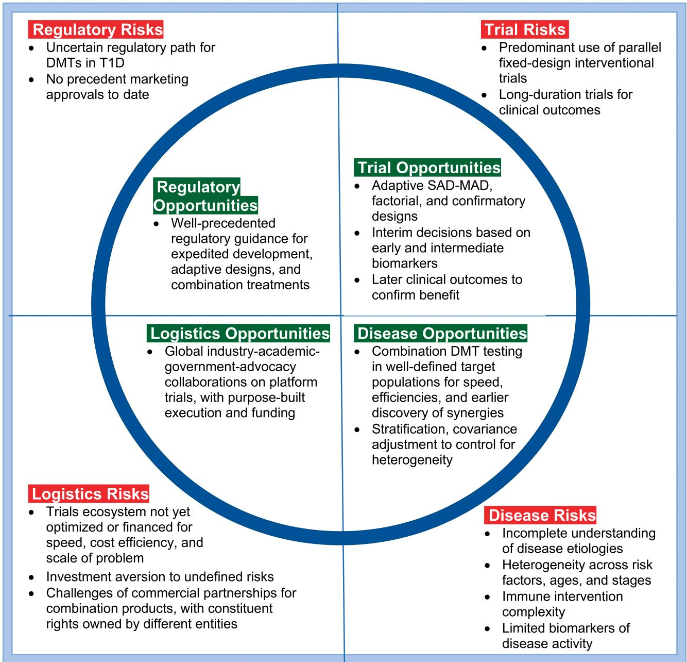
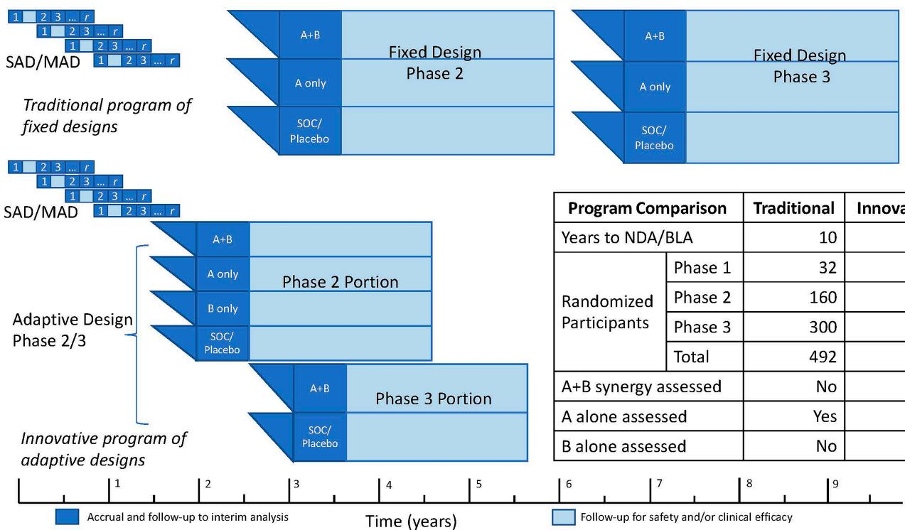

# Innovative Designs and Logistical Considerations for Expedited Clinical Development of Combination Disease-Modifying Treatments for Type 1 Diabetes

Diabetes Care 2022;45:2189–2201 | https://doi.org/10.2337/dc22-0308

Randy L. Anderson,1 Linda A. DiMeglio,2 Adrian P. Mander,3 Colin M. Dayan,4 Peter S. Linsley,5 Kevan C. Herold,6 Marjana Marinac,7 and Simi T. Ahmed8

It has been 100 years since the life-saving discovery of insulin, yet daily management of type 1 diabetes (T1D) remains challenging. Even with closed-loop systems, the prevailing need for persons with T1D to attempt to match the kinetics of insulin activity with the kinetics of carbohydrate metabolism, alongside dynamic life factors affecting insulin requirements, results in the need for frequent interventions to adjust insulin dosages or consume carbohydrates to correct mismatches. Moreover, peripheral insulin dosing leaves the liver underinsulinized and hyperglucagonemic and peripheral tissues overinsulinized relative to their normal physiologic roles in glucose homeostasis. Disease-modifying therapies (DMT) to preserve and/or restore functional b-cell mass with controlled or corrected autoimmunity would simplify exogenous insulin need, thereby reducing disease mortality, morbidity, and management burdens. However, identifying effective DMTs for T1D has proven complex. There is some consensus that combination DMTs are needed for more meaningful clinical benefit. Other complexities are addressable with more innovative trial designs and logistics. While no DMT has yet been approved for marketing, existing regulatory guidance provides opportunities to further “de-risk” development. The T1D development ecosystem can accelerate progress by using more innovative ways for testing DMTs for T1D. This perspective outlines suggestions for accelerating evaluation of candidate T1D DMTs, including combination therapies, by use of innovative trial designs, enhanced logistical coordination of efforts, and regulatory guidance for expedited development, combination therapies, and adaptive designs.

In contrast to other autoimmune indications, where multiple disease-modifying therapies (DMTs) have transformed treatment options for patients and improved quality of life, no DMTs have been approved for type 1 diabetes (T1D). Figure 1 summarizes major risks and challenges that have slowed progress and corresponding opportunities for faster and more efficient development momentum. The opportunities are further elaborated by topic. Most T1D immunomodulatory clinical trials to date have been fixed parallel designs of monotherapies or incomplete factorial designs of combinations, where constituent treatment effects and combination synergy (i.e., positive interaction) are not estimable. T1D etiologies and pathophysiology are complex and may evolve differently across and within incompletely characterized disease cohorts. Definitive biomarkers of disease activity 1 Global Mission Board, JDRF, New York, NY

2 Department of Pediatrics, Indiana University School of Medicine, Indianapolis, IN

3 Centre for Trials Research, Cardiff University School of Medicine, Cardiff, U.K.

4 Centre for Endocrine and Diabetes Science, Cardiff University School of Medicine, Cardiff, U.K.

5 Systems Immunology Program, Benaroya Research Institute at Virginia Mason, Seattle,WA

6 Departments of Immunobiology and Internal Medicine, Yale University, New Haven, CT

7 JDRF International, New York, NY

8 New York Stem Cell Foundation Research Institute, New York, NY

Corresponding author: Linda A. DiMeglio, dimeglio@iu.edu

Received 3 June 2022 and accepted 19 July 2022

© 2022 by the American Diabetes Association. Readers may use this article as long as the work is properly cited, the use is educational and not for profit, and the work is not altered. More information is available at https://www. diabetesjournals.org/journals/pages/license.

radar

| Risk Type | Category | Value |
| :--- | :--- | :--- |
| Regulatory Risks | Uncertain regulatory path for DMTs in T1D | 0 |
| Regulatory Risks | No precedent marketing approvals to date | 0 |
| Regulatory Opportunities | Well-precedented regulatory guidance for expedited development, adaptive designs, and combination treatments | 0 |
| Trial Risks | Predominant use of parallel fixed-design interventional trials | 0 |
| Trial Risks | Long-duration trials for clinical outcomes | 0 |
| Trial Opportunities | Adaptive SAD-MAD, factorial, and confirmatory designs | 0 |
| Trial Opportunities | Interim decisions based on early and intermediate biomarkers | 0 |
| Trial Opportunities | Later clinical outcomes to confirm benefit | 0 |
| Logistics Opportunities | Global industry-academic-government-advocacy collaborations on platform trials, with purpose-built execution and funding | 0 |
| Disease Opportunities | Combination DMT testing in well-defined target populations for speed, efficiencies, and earlier discovery of synergies | 0 |
| Disease Opportunities | Stratification, covariance adjustment to control for heterogeneity | 0 |
| Logistics Risks | Trials ecosystem not yet optimized or financed for speed, cost efficiency, and scale of problem | 0 |
| Logistics Risks | Investment aversion to undefined risks | 0 |
| Logistics Risks | Challenges of commercial partnerships for combination products, with constituent rights owned by different entities | 0 |
| Disease Risks | Incomplete understanding of disease etiologies | 0 |
| Disease Risks | Heterogeneity across risk factors, ages, and stages | 0 |
| Disease Risks | Immune intervention complexity | 0 |
| Disease Risks | Limited biomarkers of disease activity | 0 |

Figure 1—Daunting “square peg” challenges and “rounding” opportunities for the clinical trials ecosystem for DMTs in T1D are best addressed collectively in trials design. For disease risks, broad expert consensus exists that combination DMTs will be needed for durable, more clinically meaningful effects. Baseline biomarkers are available as stratification factors to ameliorate heterogeneity issues. The potential exists for extensive, systematic biomarker data mining and validation across trials to rapidly inform progress and define decision criteria for subsequent trials. Available biomarkers have shown correlation with important clinical outcomes, and further biomarker research/validation can be incorporated into clinical program plans and platform protocols for careful dose selection, early proof of concept, and confirmatory clinical efficacy. C-peptide AUC is a widely accepted clinical end point and can be used at 6-month intervals. Factors to manage trial risks are broader use of adaptive designs, early dose-finding designs, factorial designs, and platform protocols for purpose-built speed and efficiency. In terms of logistical risks, platform protocols are working well in other indications (e.g., pancreatic cancer), with emerging efforts in T1D via INNODIA, T1DUK, and Global Platform for the Prevention of Autoimmune Diabetes. Global, adaptive platform protocols are needed for early (phase 1/2a) and late (phase 2b/3) product development. Concerning regulatory risks, T1D qualifies as a serious disease, availing expedited regulatory support. Adaptive designs have been well accepted in other indications, and there are multiple facilitative regulatory guidelines for treatment combinations.

remain limited. While these problems are daunting, more innovative trial designs, logistical efficiencies, and regulatory guidance for expedited programs, combination therapies, and adaptive designs can further “de-risk” development of DMTs for T1D. In this article, we address trial design features to improve the speed and efficiency of clinical development of T1D DMTs. Our approach includes adaptive designs with key early biomarkers as intermediate end points, single-ascending-dose (SAD)– and multiple-ascending-dose (MAD)– finding designs, factorial designs of combination DMTs, and use of master protocols in well-defined T1D risk cohorts via a global T1D trial execution ecosystem. These design innovations could also be combined with regulatory incentives to address serious unmet needs, yielding substantial gains in speed and efficiency in reaching the market. The greatest benefit is likely to arise from collective application of these design innovations, creating greater momentum via more coordinated efforts across the T1D clinical development ecosystem.

There is no well-established biomarker of pathologic disease activity for T1D progression, but advances in biomarkers with real-time readouts, and patterns of correlation of mechanistic efficacy with clinical outcomes from previous trials, now allow adaptive design interim decisionmaking. Adaptive trial designs permit changes based on interim biomarker results and prespecified design adaptation criteria (1). While early development decisions based on biomarkers are not without risks, adaptive design strategies can mitigate the risks.

Evidence from natural history studies and clinical trials demonstrates that T1D is a heterogenous disease, with different pathways perpetuating disease (2–6). As the T1D research community has gained more specific knowledge of heterogeneity factors, there have been evolving efforts to appropriately control or account for those factors in trial design and analysis planning, using design features such as target population definition, randomization stratification, and prespecified statistical modeling of covariates.

Even with these fundamental design features having been well addressed, durable modification of T1D will likely require combination therapies (3,5,7–11). However, three concerns have limited trials of combination therapies for T1D: 1) the safety of combination therapies, 2) the presumed large study sizes required to test combinations, and 3) limited information from monotherapy studies. In contrast, early-stage innovative designs can provide more rapid insights into potential synergistic combinations, including optimal dosing, while optimizing efficacy and minimizing potential safety risks.

Combination synergy refers to a greater therapeutic effect of the combination than the sum of the constituent monotherapy effects. Indeed, a two-treatment factorial design (with participants randomly allocated 1:1:1:1 to constituent A alone, constituent B alone, A and B in combination, and placebo) provides statistical power to evaluate two candidate therapies based on the same number of participants as an equivalently powered monotherapy design and offers the important bonus of elucidating the potential additive or synergistic effects of the combination (12). Adding an adaptive approach to a factorial design can provide further time efficiency improvement.

To achieve a new global paradigm for T1D drug development, it is critical to have an effective global trial execution ecosystem to facilitate more timely and efficient successes that addresses issues like cohort identification across T1D risk factors, ages, and stages, optimized trial designs, standardized laboratory assays, experienced investigative sites, data systems, and analyses. Master protocols have proven their speed and efficiency in oncology, and analogous benefits are feasible for T1D DMTs. Implementing master protocols in T1D will require collaboration among academic, government, industry, and advocacy constituencies to provide the long-term efficiencies and financing required for success.

# COMBINATION THERAPIES

The regulatory path for combination products is well precedented, with more than 20 U.S. Food and Drug Administration (FDA) and European Medicines Agency (EMA) pieces of guidance addressing issues from concept to postmarketing requirements. While these pieces of guidance address combinations of drugs, biologics, and devices, for specificity, our primary focus here is paired combinations of drugs, biologics, and cell therapies, where each constituent has differing and complementary mechanisms of action (13–16) and appropriate safety, with no defining limits on constituent dosing regimens (e.g., including sequential or concurrent dosing regimens).

Uncertainties in translation of mechanistic and therapeutic results from NOD mice to human disease continue to impede progress in clinical development of candidate DMTs alone (9,10,17–24). These uncertainties motivate earlier clinical evaluation of candidate therapies once preclinical safety has been established.

Strategies that can facilitate rational combination therapy choices include combining constituent treatments with complementary activity on a common mechanism, such as dosing based on targeting immune cell subsets (e.g., balance between effector T cells [Teff] and regulatory T cells [Treg]) or treatments directed at different immune pathways (e.g., T-cell–antigen-presenting cell [APC] axis, with or without inflammation), or constituents that target different mechanistic pathways, such as immunomodulation and b-cell stress (8).

In the clinical setting, several DMT trials have shown intermediate-term positive impacts on b-cell function (using teplizumab, rituximab, abatacept, alefacept, golimumab, verapamil, and imatinib mesylate), with positive changes in clinically relevant measures such as daily insulin requirements, C-peptide preservation, and certain glycemic metrics (using alefacept and interleukin-21 [IL-21] plus liraglutide). In addition, early clinical testing for safety and mechanistic insights has been reported recently for other candidate therapies (AG019 Lactococcus lactis, low-dose IL-2 for children, as used in the Dose Finding Study of IL-2 at Ultra-low Dose in Children With Recently Diagnosed Type 1 Diabetes [DF-IL-2-Child], and GAD-Alum, as used in the DIAGNODE-1 trial). Collectively, outcomes from these trials suggest that disease heterogeneity complicates the search for effective T1D DMT interventions. Since T cells play an important role in perpetuating the pathogenesis of T1D, therapies targeted to disabling Teffs and enhancing Tregs are of strong interest. Targeting of other immune cells (e.g., B cells and APCs) and therapies that protect, restore, and/or replenish b-cells are of interest as well.

Safety is a primary consideration for designing trials involving different combinations of immune therapies. Table 1 provides a candidate list of therapies poised for clinical testing in combinations. These and other therapies have been extensively reviewed elsewhere (5,6). Each of these therapies demonstrated safety when tested as a monotherapy. Therefore, combining any two where the mechanisms of action are complementary, and where potential or observed off-target adverse effects are not likely to be additive or multiplicative, represents a logical way to search for additive or even synergistic therapeutic effects. Identifying optimal dosing of each constituent in combination is important as well, since optimal monotherapy dosing may not correspond to optimal combination doses. Example combinations could include CTLA-4Ig with verapamil, rituximab with abatacept, or even a Janus kinase (JAK) inhibitor followed by antigen-specific immunotherapy. Similarly, the combination of engineered Treg therapy (25–29) with an IL-2 mutein (30–33) is an example of an attractive

Table 1—Example constituents as candidates for combination disease modifying therapies in T1D 

<table><tr><td>Candidate constituent therapies for combination testing</td><td>Proposed mechanism of action</td><td>Clinical experience in T1D (safe as monotherapies)</td><td>Reference or source</td></tr><tr><td colspan="4">Autoimmunity-disabling therapies</td></tr><tr><td>Anti-CD3</td><td>Increases exhausted CD8 T cells</td><td>Phase 3 trial ongoing; significant difference in primary end point in multiple phase 2 trials</td><td>11,22,45,51,90–93</td></tr><tr><td>CTLA-4Ig</td><td>Inhibits signal 2 for T-cell activation and reduces follicular helper T cells</td><td>Significant difference in primary end point in phase 2 trial</td><td>43,44,46,63,94</td></tr><tr><td>Anti-CD40</td><td>Blocks activation of CD4+Teff cells by APC</td><td>Phase 2 trial ongoing</td><td>95</td></tr><tr><td>Antithymocyte globulin</td><td>Depletes T cells and other immune cells</td><td>Significant difference in primary end point in phase 2 trial</td><td>18</td></tr><tr><td>Anti-CD20</td><td>Depletes activated B cells, some compensatory increase in T cells</td><td>Significant difference in primary end point in phase 2 trial</td><td>96</td></tr><tr><td>Anti-IL-12/23R</td><td>Inhibits Th17 cells</td><td>Phase 1B trial successful; phase 2 trial ongoing</td><td>97</td></tr><tr><td>Anti-IL-21</td><td>Inhibits Teff proliferation and differentiation</td><td>Significant difference in primary end point in phase 2 trial monotherapy arm</td><td>9</td></tr><tr><td>LFA3Ig</td><td>Inhibits T-cell activation</td><td>Significant difference in primary end point in phase 2 trial</td><td>98</td></tr><tr><td colspan="4">Inflammation-dampening therapies</td></tr><tr><td>Jak1 and Jak2 inhibitor</td><td>Inhibits differentiation and proliferation of Th1 and Th17 cells</td><td>Phase 2 trial ongoing; safety data from rheumatoid arthritis trials</td><td>99</td></tr><tr><td>Anti-tumor necrosis factor-α</td><td>Reduces inflammation; multicell target</td><td>Significant difference in primary end point in phase 2 trial</td><td>100</td></tr><tr><td>Anti-IL-6</td><td>Reduces inflammation; multicell target</td><td>Phase 2 trial completed</td><td>101</td></tr><tr><td colspan="4">Immune regulation-enhancing therapies</td></tr><tr><td>Proinsulin or GAD65 antigen (direct, nanoparticle, DNA)</td><td>Activates Tregs and/or modulates APCs</td><td>Multiple ongoing; significant difference in primary end point in phase 1B/2A trial with proinsulin or GAD-Alum</td><td>102–104</td></tr><tr><td>Lactococcus lactis (antigen+other)</td><td>Enhances Tregs</td><td>Significant difference in primary end point in phase 2A trial</td><td>21,105</td></tr><tr><td>Infused polyclonal Treg cells</td><td>Enhances Treg number and function</td><td>Phase 1 trial completed</td><td>26–28</td></tr><tr><td>Infused dendritic cells</td><td>Enhances tolerogenic antigen presentation</td><td>One phase 1 trial completed; second ongoing</td><td>106; NCT04590872</td></tr><tr><td>Ultra-low-dose IL-2 or IL-2 mutein</td><td>Enhances Treg number and function</td><td>Phase 1B trials successful; phase 2 trials ongoing</td><td>30–33</td></tr><tr><td colspan="4">β-cell-directed therapies</td></tr><tr><td>Phenylalkylamine calcium channel blocker</td><td>Inhibits TXNIP and enhances β-cell survival</td><td>Phase 2 confirmatory trial ongoing</td><td>107,108</td></tr><tr><td>2-Phenylaminopyrimidine derivative drug</td><td>Inhibits tyrosine kinases</td><td>Significant difference in primary end point in phase 2 trial (short term)</td><td>109</td></tr><tr><td>α-Difluoromethylornithine</td><td>Inhibits polyamine synthesis</td><td>Phase 1 trial ongoing</td><td>110</td></tr><tr><td colspan="4">Disease-controlling therapies (as possible β-cell rest constituents in combination with an immunomodulator)</td></tr><tr><td>Amylin analog</td><td>Improves glucose control</td><td>Marketed with T1D indication</td><td>111</td></tr><tr><td>GLP-1 analogs</td><td>Enhances β-cell secretory capacity; reduces gut motility; inhibits glucagon release</td><td>Some difference in primary end point in phase 2 trials</td><td>9,112–114</td></tr></table>

next-generation combination that may correct T cell imbalance (Treg versus Teff) and selectively sustain Treg viability.

Regulatory precedence sets out the sequential development phases of safety and efficacy evidence accrual needed to advance a candidate therapy into clinical practice. Efforts to cut short the process can lead to expensive program delays or late failures. Phase 1 SAD and MAD designs establish first-in-human safety, therapeutic dose range and regimen, and early clinical insights into mechanisms of action. The primary intent of phase 2 trials is to establish the optimally safe and effective short-term dose–response relationship (or need to “treat to target” [TTT]). For example, biomarker changes may reflect a beneficial shift in the Teff or Treg repertoires (34). Phase 3 trials are intended to confirm treatment benefit via longer-term clinical outcomes, such as sustained b-cell function via stimulated C-peptide AUC (area under the curve), functional disease cure, and/or risk reduction of serious clinical events like diabetic ketoacidosis or severe hypoglycemia (35).

# BIOMARKERS WITHIN ADAPTIVE T1D TRIALS

Nearly all T1D DMT trials to date have been standalone studies. Increasingly, however, development phases can be merged for time efficiency using adaptive designs where design changes are based on protocol-defined decision criteria applied to interim findings using biomarkers, such as a seamless trial design (36). Adaptive trials use information as it accrues to inform prespecified design changes toward greater efficiency in one or more of the dimensions of time, cost, subjects, and safety risk. The practical uses of adaptive designs are covered in Burnett et al. (37). Commercial use of adaptive trials has become more attractive since the FDA released adaptive design guidance in 2019 (38). The simplest example of an adaptive design is a two-stage group-sequential design with one interim analysis to decide whether to stop the trial early for efficacy or futility. The interim also offers a possible substantial time savings as a business decision point for initiating a next-phase study in a commercial development program.

The standard of evidence for a business decision in early clinical development may be less rigorous than the regulatory requirements for full validation of a biomarker as a surrogate for a clinical outcome in a pivotal study. One design adaptation is to use intermediate end points to make design changes while follow-up continues for longer-term end points. This subset of adaptive designs depends on an established correlation between early-phase end points, such as a prespecified biomarker that captures mechanistic efficacy, and a longer-term clinical response end point (39). A phase 2/3 design might use an interim decision to stop or continue recruitment to the phase 3 portion based on early phenotypic changes in T-cell repertoire, indicative of a later clinical response like stimulated C-peptide AUC change from baseline at 1 year.

Robust biomarkers are needed to guide interim clinical decisions (40). While major strides have been made in the field of T1D trial biomarkers (41), heterogeneity within T1D makes it challenging to broadly apply compelling biomarker findings as surrogates of efficacy across different subpopulations. The definition of a biomarker is relatively simple: “A defined characteristic that is measured as an indicator of normal biological processes, pathogenic processes, or responses to an exposure or intervention” (42). However, in practice, use of the term is ambiguous, as it may refer to markers with multiple different uses (42). Here, we discuss a few specific types of biomarkers and their relevance for use in adaptive clinical trials in T1D.

A “pharmacodynamic biomarker” is used to show that a biological response has occurred in an individual exposed to a medical product or an environmental agent (42). These biomarkers are relevant to adaptive trial design, since there are findings in multiple studies of an association between poor outcome and suboptimal pharmacodynamic activity in at least a subset of individuals. For example, participants resistant to abatacept demonstrated transient increases in activated B cells, altered costimulatory ligand gene expression, and reduced inhibition of anti-insulin antibodies (43). Similarly, studies with rituximab (44) showed that participants with high levels of peripheral T cells showed less suppression of de novo antibodies targeting the neoantigen phiX174. In the Autoimmunity-Blocking Antibody for Tolerance (AbATE) study of teplizumab (45), responders to treatment had more sustained lymphoreduction (46). Transient lymphoreduction is a hallmark of teplizumab treatment and can be considered a proximal pharmacodynamic biomarker for T-cell targeting. These findings suggest nonuniform pharmacodynamic activity of multiple biologic agents across different T1D subjects.

“Precision dosing” is also difficult to achieve in heterogeneous populations. Thus, individuated dosing may be an important consideration in DMT development. Interindividual variation also may be exacerbated when drugs developed with older individuals are used for younger patients, as is common in T1D treatment.

Implementing TTT dosing regimens can address suboptimal pharmacodynamics. TTT is a therapeutic concept that uses specific physiologic targets to control disease pathophysiology. For example, in type 2 diabetes (T2D), TTT has been used to compare investigational insulins with a standard insulin by titrating insulin dosages to achieve a prespecified glycemic treatment goal (47). For adaptive trials in T1D, TTT could be used by titrating agents to a desired biomarker response.

Another solution to suboptimal pharmacodynamics could be data-driven, pathway-targeted approaches for combination therapies in individual patients. Studies on resistance to biologic treatment in T1D have suggested developing combination therapies based on complementary patterns of resistance to therapy with individual agents. The use of combination therapies to minimize resistance in heterogeneous populations is widely used (48). If two drugs work independently through distinct mechanisms of action, overcoming resistance requires alterations in two distinct targets or pathways (49). For T1D, it may make sense to test combinations of agents that, as monotherapies, have complementary resistance mechanisms (i.e., agents that block both cell types of the B-cell– T-cell dyad (46)).

A “candidate surrogate end point” is a biomarker “ … still under evaluation for its ability to predict clinical benefit” (42). Most trials of biologic agents in T1D utilize stimulated C-peptide AUC as a surrogate for pancreatic b-cell funtion, measured at 6 months, 1 year, 18 months, or longer after randomization to therapy.

The C-peptide measurement in Stage 2 T1D is generally derived from an oral glucose tolerance test, whereas in Stage 3 T1D, the stimulus has been a mixed meal tolerance test (50,51). While there is a consensus among clinical researchers and advocacy organizations that C-peptide is an appropriate end point for clinical studies (52), the FDA may be in the process of updating its position on C-peptide as a validated surrogate biomarker for clinical benefit.

Unbiased molecular studies have identified that increases in C-peptide AUC correlate significantly with T-cell exhaustion gene signatures in new-onset T1D trial participants treated with teplizumab (53) and alefacept (54). Although these gene signatures remain exploratory, they could be developed into candidate surrogate end points to be used in conjunction with or in lieu of C-peptide measurements with teplizumab- and alefacept-treated subjects. Importantly, many molecular biomarkers offer the advantage of being easier to measure than a mixed-meal tolerance test and seem to be detectable earlier (53) than the 1-year period used for C-peptide; thus, they may lend themselves well to adaptive trial design. Other key clinical end points include total daily insulin dose, HbA1c, continuous glucose monitoring-based level 2 hypoglycemia, and challenge measures involving endogenous insulin release and action (55,56). These end points can reflect reduction of dysglycemia expected with greater endogenous insulin production and may well portend greater patient satisfaction with treatment via quality of life and patient-reported outcome (PRO) measures (57–59). It is important for planning to consider the validation evidence for a quantitative relationship between a candidate surrogate end point and T1D progression.

A “predictive biomarker” is “a biomarker used to identify individuals who are more likely than similar individuals without the biomarker to experience a favorable or unfavorable effect from exposure to a medical product or an environmental agent” (42). Predictive biomarkers may enable study population enrichment with individuals most likely to show response, leading to larger effect sizes, less unexplained variation, and more power, particularly in adaptive design clinical studies. For example, subgroup analyses hinted at greater response of younger participants in the TrialNet trial of B-cell depletion therapy with rituximab (60). Additional studies with samples from the same trial showed a significant relationship between B-cell gene expression at baseline and the rate of loss of C-peptide, showing that rituximab was most effective in subjects with high B-cell gene expression (61). Together these studies argue that focusing trials on participants who are younger or who have elevated B cells would improve clinical results with rituximab. Likewise, studies with samples from the TrialNet study of abatacept (62) suggested that pretreatment measures of follicular helper T cells (63) or innate inflammatory/regulatory bias (64) can predict favorable response to treatment. Adaptive trials stratifying by such predictive biomarkers, or enrolling a predefined endotype that might include age, autoantibody profiles, or other parameters, could enable focus on the most appropriate subpopulations for further study.

Taken together, the complexity of biomarker findings across trials reflects the patient heterogeneity that has confounded T1D clinical efforts and demonstrates variations across therapies regarding surrogate immune signatures of therapeutic effect. For these reasons, trial designs may need to adapt the target population based on baseline biomarker profiling and early correlative evidence of treatment response.

While biomarkers have a very direct pertinence in autoimmune disease modification, biomarkers and clinical outcome assessments (including patient-, caregiver-, and clinician-reported outcomes) are now analogously regulated as drug development tools that must meet complex validation requirements for use in clinical development to support product label claims (65). The broader clinical trials ecosystem, beyond just T1D, is recognizing and responding to the greater need for the patient voice in clinical development, where PROs are a subset of clinical outcome assessments. These efforts are particularly pertinent in T1D, where life impact of the disease is omnipresent. The EMA and FDA recognize that the patient perspective complements the medical and scientific evaluation of prospective therapies (66). Measuring treatment impact on quality of life is important to objectively assess patients’ valuation of treatment benefit in the context of treatment burden and disease burden. Imagine two competing combination DMTs where each can preserve endogenous insulin capacity sufficiently to simplify stage 4 T1D disease management to only daily basal insulin at 0.20 units/kg/day and HbA1c <6.5%, with severe hypoglycemia and diabetic ketoacidosis annual risks below 1/1,000 patient-years. In addition to acceptable safety and cost, which combination is best may be determined, using a PRO measure, by patient preference regarding treatment burden. While the regulatory qualification requirements for PROs are complex, a fit-for-purpose PRO could be a basis for a label claim should it show at least a minimal clinically important difference from an appropriate control treatment (67,68).

# SAD–MAD COMBINATION DESIGNS

The premarket requirements for demonstrating the safety and effectiveness of a combination product derive from the statutory and regulatory requirements applicable to its constituent parts, even when a single marketing application for only the combination is intended (13). Across the FDA and EMA pieces of guidance, two key principles for combination products are evident. First, the relationship between constituent dosing regimens and response should be well characterized, as with a SAD–MAD combination design. Second, each constituent should be tested individually and in combination to establish whether the combination works better than either constituent, something efficiently accomplished using a factorial dose–response design.

Factorial designs evaluate 2 or more factors (e.g., treatments) at 2 or more levels each (e.g., doses) and the interactions of the factors concurrently. A SAD–MAD two-treatment combination design is a special factorial design case, where dose escalations occur sequentially by cohort, with safety evaluation before each dose escalation. For illustration, suppose a SAD–MAD trial is planned for 4 dose levels of each constituent treatment (including a zero-dose level) for a combination of two treatments. A complete factorial SAD–MAD design will require 42 = 16 cohorts, one per dose combination, with typically 3–6 subjects per cohort, if all possible dose combinations are included. The design may stop dose escalations based on safety findings or reaching maximum tolerated constituent doses. The study duration will depend on the dosing regimens, the safety follow-up time between cohorts, and the number of repeat dosings. Early efficacy biomarkers may also factor into dose escalation decisions.

The precedent SAD and MAD cohort designs are important to establish the pharmacokinetics (PK) and therapeutic dose range of a prospective treatment. Ascending-dose designs are inherently adaptive since dose escalations are contingent on acceptable safety from previous dose cohorts. With a SAD–MAD two-product combination design, dose escalations can occur for both products concurrently, to determine both monotherapy and combination PK, in less time than traditional monotherapy designs done in series. However, where safety motivates, dose escalations of combination active doses need occur only after evaluation of the same active doses as monotherapies. The SAD–MAD combination design also establishes whether PK of constituents is different when dosed in combination, it establishes a clear path for further safety assessments, and it establishes the safe combination therapeutic dose ranges within which the optimal combination doses and response should occur. Rubino et al. provided an illustrative example SAD– MAD design for evaluation of combination anti-infectives (69).

With some immunomodulatory or b-cell therapies, it may be more appropriate for a SAD–MAD study to enroll T1D volunteers rather than persons without diabetes, particularly where the intended response may be more pertinent, safer, or more readily evident in T1D. Where constituent dosing regimens may differ, dosing repeats can be done for one or both constituents.

# FACTORIAL DESIGNS FOR COMBINATIONS

Combination viability requires establishing (optimally in phase 2) that the combination has at least additive efficacy versus either constituent alone. By definition a monotherapy trial, or a collection of monotherapy trials, cannot elucidate combination effects. Factorial design trials offer two advantages that are acutely important for evaluation of combination interventions. First, as illustrated with a two-factor design, statistical power for each constituent treatment requires no increase in sample size versus a monotherapy trial as long as the constituents have at least additive effects (12,70). Second, a factorial design provides an opportunity to assess the synergy (positive interaction) of the combination (71), where the effect of the combination is greater than the sum of the constituent effects.

In its simplest case, an experiment with two constituents each at two levels is a 2 × 2 factorial design. Randomizing participants to each of the four groups constitutes the simplest factorial design trial, as illustrated in Table 2. In a balanced factorial design, half the participants receive treatment A and half do not receive treatment A, and likewise for treatment B. The treatment A effect is estimated as the average response of all participants receiving treatment A minus the average response of all participants not receiving treatment A, and likewise for treatment B. As long as A and B effects are at least additive, the statistical power for each of constituents A and B is equivalent to or greater than the power for the active versus placebo comparison in a monotherapy design with the same total number of participants.

Table 2—Factorial design scheme, with 2 factors and 2 levels of each factor 

<table><tr><td></td><td>A absent</td><td>A present</td></tr><tr><td>B absent</td><td>A-, B-</td><td>A+, B-</td></tr><tr><td>B present</td><td>A-, B+</td><td>A+, B+</td></tr></table>

, factor absent; 1, factor present. With balanced randomization to each of the 4 groups, half of all subjects receive treatment A and half receive treatment B. This orthogonal configuration of A and B provides sample size efficiency for estimating the main effects of both A and B as long as A and B effects are at least additive. Finding synergistic combinations is a primary interest to optimize treatment benefit. Should the A and B combination show synergy (positive interaction), then the conclusion is that the effect of A depends on the level of B and vice versa. Thus, the A and B main effects become somewhat moot, in that A1B treatment effect is greater than the sum of the main effects.

Table 3 shows the statistical power for hypotheses of interest in a factorial design of two treatments by two levels. The table shows scenarios for strictly additive (independent) effects and for magnitudes of synergy. With synergy, the factorial design has greater statistical power for each main effect than a monotherapy trial with the same sample size. However, the main effect tests are somewhat moot in the presence of synergy, since the meaning of interaction is that the effect of one factor level depends on the level of the other factor.

Based on these properties of a factorial design, progress in exploring DMTs for T1D can be essentially doubled by early (phase 2) evaluation of candidate therapies in combinations of complementary mechanisms of action. Where treatments are independent, the results will yield well-estimated treatment effects of each constituent from one trial at minimal added cost of managing two treatments.

There is a statistical power risk with the factorial design when a combination shows a diminished treatment effect relative to its constituents. However, even such an outcome is informative, in that it reveals information about nonviable combinations and provides insights into conflicting mechanisms of action (33).

A treatment-masked phase 2 factorial design can be configured as an adaptive phase 2/3 design where, based on interim analysis findings, the monotherapy groups are stopped based on predefined decision criteria and the active combination and control groups are expanded to adequately power phase 3 inference. With additivity or synergy established (for example, based on an a priori defined conditional power decision criterion) in the phase 2 portion, a two-group phase 3 design need only compare the combination treatment to standard of care (SOC) or placebo to confirm combination effectiveness, where regulators would require no further constituent monotherapy evaluation (72). The interim analysis would need an independent data monitoring committee and protocol-prespecified decision criteria upon which to stop the monotherapy groups, and to expand the phase 3 sample size for the two remaining groups, while maintaining the treatment masking. Alternatively, should business needs require quicker reporting, interim phase 2 results could be reported completely, with a separate phase 3 study initiated based on the phase 2 interim findings.

Table 3—Statistical power for treatment factors in a monotherapy design versus a combination treatment 2 × 2 factorial design 

<table><tr><td rowspan="2">Total sample size (n)</td><td rowspan="2">Single treatment design (effect  $size^a$ /power), treatment A</td><td colspan="3">Combination treatment factorial design (effect  $size^b$ /power)</td></tr><tr><td>Treatment A</td><td>Treatment B</td><td>Treatments A and B</td></tr><tr><td colspan="5">Suppose treatments A and B have equal and fully additive effects...</td></tr><tr><td>128</td><td>-0.5σ/80%</td><td>-0.5σ/80%</td><td>-0.5σ/80%</td><td>-1.0σ/-</td></tr><tr><td>144</td><td>-0.5σ/85%</td><td>-0.5σ/85%</td><td>-0.5σ/85%</td><td>-1.0σ/-</td></tr><tr><td>176</td><td>-0.5σ/91%</td><td>-0.5σ/91%</td><td>-0.5σ/91%</td><td>-1.0σ/-</td></tr><tr><td colspan="5">Suppose treatments A and B have equal and 50% synergistic effects...</td></tr><tr><td>128</td><td>-0.5σ/80%</td><td>-0.5σ/98.8%</td><td>-0.5σ/98.8%</td><td>-1.5σ/29%</td></tr><tr><td>144</td><td>-0.5σ/85%</td><td>-0.5σ/99.4%</td><td>-0.5σ/99.4%</td><td>-1.5σ/32%</td></tr><tr><td>176</td><td>-0.5σ/91%</td><td>-0.5σ/99.8%</td><td>-0.5σ/99.8%</td><td>-1.5σ/38%</td></tr><tr><td colspan="5">Suppose treatments A and B have equal and 75% synergistic effects...</td></tr><tr><td>128</td><td>-0.5σ/80%</td><td>-0.5σ/99.8%</td><td>-0.5σ/99.8%</td><td>-1.75σ/56%</td></tr><tr><td>144</td><td>-0.5σ/85%</td><td>-0.5σ/99.9%</td><td>-0.5σ/99.9%</td><td>-1.75σ/61%</td></tr><tr><td>176</td><td>-0.5σ/91%</td><td>-0.5σ/99.9%</td><td>-0.5σ/99.9%</td><td>-1.75σ/70%</td></tr></table>

s represents the SD for error in the statistical model of the primary end point, and the trial is powered to detect a treatment effect as small as 0.5 SD. While power for main effect tests is shown in the synergy scenarios, the main effect tests are somewhat moot in the presence of synergy, since that interaction means that the effect of one constituent level depends on the level of the other constituent. Using a phase 2/3 design, with the phase 2 portion configured as a factorial design, the evidence of synergy could trigger initiation of the phase 3 portion of the design, with further patient accrual as a two-group comparison of the combination versus placebo/SOC. a Effect size expressed as a function of the end point error variance (s) in a one-way ANOVA model with treatment A as its only factor. b Effect sizes expressed as a function of the end point error variance in a 2 × 2 factorial ANOVA model with treatment A, treatment B, and A and B interaction as factors. Analogous findings would hold for an ANCOVA model with a continuous baseline covariate like HbA1c.

# MASTER PROTOCOLS AND PLATFORM DESIGNS

A master protocol provides streamlined coordination within a disease and across multiple subtrials to evaluate more treatments in less time (73,74). The use of master protocols is increasing rapidly (75), particularly in complex disease indications such as oncology and infectious disease. These indications have complexities analogous to those that encumber development for T1D. Three types of master protocols exist: basket, umbrella, and platform trials (76). A basket trial involves a single intervention investigated concurrently across multiple disease indications (usually with a common biomarker of interest or etiologic mechanism of action). A basket trial could be pertinent in T1D for addressing if one treatment is effective across different etiologic subgroups, all with a prespecified panel of mechanistic biomarkers. An umbrella trial involves multiple treatments, each aligned to a specific biomarker or set of biomarkers suited to each treatment type, being evaluated concurrently in one disease indication. A platform trial aims to evaluate multiple interventions (multiple substudies) with common procedures and assessments, allowing treatment groups to be added or dropped at different times based on accrued efficacy evidence and with planned type 1 error control (77). Platform trials have been the design of choice for coronavirus disease 2019 interventions (78,79).

In platform designs a combination treatment group might be started contingent on interim results for constituent treatment groups, or a treatment dose level might be stopped based on futility. This flexibility speeds up development by better aligning the continuity of development decisions with the natural continuity of evidence accrual, all while continuing the standardized logistical “machinery” of subtrial execution. Platform trials can be complex, take extra time for collaborative planning, and require long-term funding. However, once operational, they can evaluate numerous treatments concurrently and move “winners” to clinical practice with far faster speed, cost efficiency, and better comparability across subtrials than a collection of independent trials (80,81).

Platform trials are emerging in T1D, including one proposed by INNODIA and its collaborative alliance with the Type 1 Diabetes UK Immunotherapy Consortium (T1DUK) and the Global Platform for the Prevention of Autoimmune Diabetes (2), both based in Europe. Within INNODIA’s five major “work packages,” one involves interventional clinical trials in Europe, testing candidate therapies both from within and outside the consortium. T1DUK has as its principal aim “to help get immune therapy into the market as part of the management for type 1 diabetes” and has provided its infrastructure and expertise to various industry- and academia-led trials. T1DUK has also partnered with INNODIA on its master protocol platform (82). This standardization with platform protocols can clarify the regulatory pathway for DMTs for T1D and reduce logistical uncertainties in clinical development (83).

Platform protocols leverage the following essential features of adaptive trial design into their program.

• Centralized trial systems (specialty laboratories, randomization, electronic data capture systems, standardized informed consent, patient recruitment, tracking and scheduling, and site monitoring) and governance (subtrial qualification, science oversight, data sharing, and publication planning).

• Substudy end points and related adaptive decision criteria predefined within the master protocol.   
• Logistical components shared across subtrials: schedules of assessment, clinical examination components, measurement procedures, outcome definitions, and ascertainment procedures.   
• Common screening platform enabling enrollment of participants into subtrials and subgroups defined by risk biomarker profile (e.g., age, autoantibodies, genetic risk score, T-cell biomarkers, stimulated C-peptide, glycemic instability, and dry blood spot C-peptide), for example, HLA status may determine the speed of b-cell loss.   
• A systematic approach to step down in age cohorts, from adults aged \$18 years to adolescents aged 12–17 years and finally to children aged <12 years.   
• Use of a common control group for each treatment-specific comparison, providing readily evident savings over any collection of individual trials for each with its own control group.   
• A mechanism for more patients to receive an active treatment intervention and more treatment interventions to be evaluated.   
• Opportunity for commercial entities to de-risk running complex trials across multiple countries and investigative sites with efficiency and well-defined patient populations.

Platform protocols, once initiated, also have the potential to produce considerably faster subtrial startups and completions than are currently achieved in commercial development. In oncology, the I-SPY 2 platform trial reduced development times from 117 to 71 months, a savings of 4 years (83), and further time efficiencies are feasible.

A vital benefit of standardization of visit times and measurements is easier comparisons between subtrials. In meta-analysis efforts today, the heterogeneity among included trials is either accepted or the number of included trials is reduced to obtain a more homogeneous pooled estimate of treatment effect. Within a common platform, comparisons are more direct and have fewer uncontrolled sources of heterogeneity both among participants and among assessments (procedures, schedules, and assays).

A critical value proposition of a platform involving public-private clinical consortia is that it enables a forum to align some of the nonoverlapping goals that traditionally differentiate commercial and noncommercial sectors (10).

# KEY ELEMENTS OF A CLINICAL DEVELOPMENT ECOSYSTEM

Navigating the combined scientific, financial, and operational considerations to actualize the envisioned era of clinical research in T1D remains an unresolved challenge (10). Recent assessment of this landscape has clearly illuminated both the potential benefits and challenges to overcome (84).

# Financial Considerations

From a financial point of view, conservative assessments estimate that drug companies stand to save on the order of \$100 million/year in drug development costs when early go-no decisions afforded by adaptive trials are in place for testing candidate therapies (85). Moreover, conservative estimates suggest that adaptive trial designs can increase success rates of clinical trials by 4%, which translates into lowering development costs for a new drug from \$2.6 to \$2.2 billion. This cost reduction would free up an additional \$4.2 billion globally for pharmaceutical research and development. This opportunity should serve as a catalyst for much-needed master protocols to find DMTs that quantitatively equate with the generation of up to 3.5 million life-years (85).

Adaptive trial designs also make sense from a risk mitigation and commercial development point of view. For small biotech and pharmaceutical companies, having the flexibility of early stopping rules and resource reallocation provides a level of nimbleness and de-risks pursuit of drug development programs for more complex indications, such as T1D. This versatility also allows a mechanism for investors to diversify and de-risk their investments, and increase their investments in response to promising milestones, based on real-time measurements of the net present value of a drug. The probability of attracting pharmaceutical licensees is expected to similarly increase when promising milestones occur and may even enable events like an early end to a phase 2 trial that accelerates phase 3 start (85,86). To this end, there may be a vital role for funding agencies to pioneer the establishment of adaptive clinical testing vehicles that incentivize and de-risk T1D opportunities through early clinical proof-of-concept testing. This may further facilitate commitment from commercial entities for development of promising classes of therapies for T1D.

# Operational Considerations

Early interactive discourse with regulators is absolutely essential to assure programs can satisfy needs for marketing applications, as exemplified by platforms that are currently in operation (80,81). Per the recommendations in the 2018 FDA guidance on adaptive trials (87), it is important to engage regulators to address key issues such as equipoise, sample size, end points, statistical type 1 error control, and other specific issues of adaptive intentions (84).

Drug access for combination therapies from different commercial entities is often a prohibitive consideration in adaptive trial design. However, such an endeavor is highly necessary for T1D, and with careful agreements between drug developers (such as with codevelopment strategies) and some level of early insulation of prepublication clinical data, it is possible to achieve such a reality.

A vital stakeholder in the clinical development ecosystem is the patient. While patients are open to innovative and potentially faster formats of clinical testing, they often remain poorly informed of such protocols and their potential merits and demerits. This may partly be due to lack of complete information and consensus among clinicians on the topic of innovative trial designs. Inclusion of the patient voice during the development and execution of clinical trials is likely to facilitate their faster adoption (88).

# Scientific Considerations

Aside from the detailed rationale laid out in this paper, increasing scientific sentiment on the merits of adaptive trials is that they are faster and more efficient than traditional designs at answering research questions. There is also emerging consensus that adaptive trial designs can be more ethical in limiting exposure of patients to ineffective drugs (84).

# DISCUSSION

To engender innovative responses to serious unmet medical needs, regulators have structured pharmaceutical innovation into four available expedited development designations, with each based on the level of accrued product-specific scientific information: fast track, breakthrough, accelerated approval, and priority review (89). Given precedent regulatory recognition of the serious unmet needs of T1D treatment, the design innovations described here can be applied to expedited development of DMTs for T1D, with reductions in the current time, cost, and uncertainties of development. Moreover, information from each phase can be used to qualify for the next level of expedited development assistance from regulators.

We can illustrate the value proposition of combination therapies in adaptive trials by considering a clinical development program plan for a combination product using multiple design ideas described in prior sections (Fig. 2). This example assumes that the discovery and necessary preclinical work have been completed for investigational new drug-enabling demonstration of safety and that clinical development plan details have been reviewed early with regulators, with feedback on adequacy for a marketing application in the desired indication. Subsequently, conditioned on existing regulatory guidance, successive approvals across expedited development levels, and adequate safety and efficacy findings, a clinical development program could be limited to just two adaptive trials in T1D to support a marketing application in the first targeted disease stage indication. The first trial, a phase 1/2a SAD–MAD combination trial, would support determining optimal doses and regimens and supply early efficacy information from a planned interim analysis to support a decision to initiate the second trial. That phase 2b/3 trial would use a factorial design for the phase 2b portion, with an interim analysis decision criterion to adapt to a phase 3 twogroup confirmatory design of the combination versus SOC. With aggressively managed logistics, this program could yield a marketing application for conditional approval as early as program month 45 and provide sufficient information for full approval application by program month 70. Should phase 2b results not support the combination, they may support further development for either constituent.

<table><tr><td colspan="2">Program Comparison</td><td>Traditional</td><td>Innovative</td></tr><tr><td colspan="2">Years to NDA/BLA</td><td>10</td><td>6</td></tr><tr><td rowspan="4">Randomized Participants</td><td>Phase 1</td><td>32</td><td>32</td></tr><tr><td>Phase 2</td><td>160</td><td>160</td></tr><tr><td>Phase 3</td><td>300</td><td>220</td></tr><tr><td>Total</td><td>492</td><td>412</td></tr><tr><td colspan="2">A+B synergy assessed</td><td>No</td><td>Yes</td></tr><tr><td colspan="2">A alone assessed</td><td>Yes</td><td>Yes</td></tr><tr><td colspan="2">B alone assessed</td><td>No</td><td>Yes</td></tr></table>

Figure 2—Conceptual comparison of traditional and innovative program plans for a combination DMT in new-onset T1D to achieve a New Drug Application (NDA) or Biologics Licensing Application (BLA). Both programs provide randomized, treatment-masked phase 2 and phase 3 designs, with inferences powered for 0.5 SD effect sizes for main effect tests (phase 2: 85% power; phase 3: 90% power). The innovative program plan makes full use of the adaptive designs and logistics ideas described here. The phase 2 factorial design provides inferences for A and B main effects as well as an estimate of synergy sufficient to support a conditional power calculation for a phase 3 A1B versus SOC/placebo inference. First, a SAD–MAD combination trial with constituent 1 and constituent 2 would initiate the clinical program (program month 1). Positive interim results from an interim analysis of the SAD–MAD cohorts (3-month safety and robust early biomarker effects) could support application for breakthrough designation (program month 9). Second, a phase 2/3 adaptive trial of constituent 1 and constituent 2, where the phase 2 portion is a 2 × 2 factorial design, including the combination group, the two monotherapy groups, and a placebo group, initiated based on 6-month follow-up data from the last SAD–MAD dose–escalation cohort (no later than program month 15). The phase 3 portion would be a two-group comparison of the combination versus placebo, initiated based on a phase 2 interim safety and efficacy analysis (of accrued safety data and 6-month stimulated C-peptide AUC) at program month 30. Both the SAD–MAD study and the phase 2/3 study would be planned for up to 3 years of follow-up. However, the decision point for starting the phase 3 portion would be positive phase 2 interim safety and efficacy analysis at 15 months from phase 2 first patient first visit (program month 30). This information, along with longer-term SAD–MAD follow-up data, may then support an application for accelerated approval. The marketing application would be based on a phase 3 interim analysis planned at the 1-year follow-up. With the results supporting expedited review for accelerated approval, the marketing application could be as early as program month 45. Final approval (following an earlier conditional approval) might be based on the 3-year follow-up results from the phase 2/3 design (at program month 70). The traditional program is exemplified by typical “white space” between studies and parallel phase 2 and 3 designs where synergy is not estimable.

Innovative trial designs and programs can yield more complete scientific information faster, at a lower cost, and with laudable quality (reduced uncertainty, better outcomes, and improved quality of life for patients). We aspire to further government–academic–charitable nonprofit–commercial collaboration to seize this ecosystem opportunity and make it a further global collaboration to substantially diminish or eliminate the detrimental impacts of chronic T1D. The astoundingly fast development of mRNA coronavirus disease 2019 vaccines and immunomodulatory cancer therapies has demonstrated the feasibility of these collaborations. Development of DMTs for T1D is amenable to analogous gains in speed, efficiency, and quality.

Acknowledgments. This work grew out of discussions following a JDRF-held workshop in 2019 on innovative trial designs, inclusive of clinical development strategies for DMTs for T1D. The content and views expressed are the responsibility of the authors and do not necessarily reflect the official views of JDRF.

Duality of Interest. R.L.A. was a JDRF board director at the time of ideation of the manuscript and is a consultant to Provention Bio, Inc. L.A.D. receives institutional support for research studies from Provention Bio, Inc., and MannKind Corporation; has been a consultant to Vertex Pharmaceuticals, Inc., and Merck & Co., Inc.; and is inventor on a patent application for use of a-difluoromethylornithine. C.M.D. is an advisor to Provention Bio, Inc. P.S.L. is a consultant with Bristol-Myers Squibb Company. K.C.H. has been a consultant to Provention Bio, Inc., Novo Nordisk A/S, Tiziana Life Sciences, Ltd., NexImmune, Inc., and Viela Bio, Inc./ Horizons Therapeutics, plc, and is coinventor on a patent for use of anti-CD3 monoclonal antibody. M.M. is a JDRF staff member. S.T.A. was a scientific portfolio lead at JDRF at the time of ideation of the manuscript and has since moved to the nonprofit New York Stem Cell Foundation Research Institute. No other potential conflicts of interest relevant to this article were reported.

# References

1. Greenbaum CJ; Immunology of Diabetes Society. Guidelines for intervention trials in

subjects with newly diagnosed type 1 diabetes. Diabetes 2003;52:1059–1065

2. Ziegler AG, Danne T, Dunger DB, et al. Primary prevention of beta-cell autoimmunity and type 1 diabetes—the Global Platform for the Prevention of Autoimmune Diabetes (GPPAD) perspectives. Mol Metab 2016;5:255–262

3. Greenbaum CJ, Speake C, Krischer J, et al. Strength in numbers: opportunities for enhancing the development of effective treatments for type 1 diabetes-the TrialNet experience. Diabetes 2018; 67:1216–1225

4. Mathieu C. Are we there yet? Finding ways to work together on T1D. Diabetes Care 2018;41: 667–669

5. Atkinson MA, Roep BO, Posgai A, Wheeler DCS, Peakman M. The challenge of modulating b-cell autoimmunity in type 1 diabetes. Lancet Diabetes Endocrinol 2019;7:52–64

6. Roep BO, Wheeler DCS, Peakman M. Antigenbased immune modulation therapy for type 1 diabetes: the era of precision medicine. Lancet Diabetes Endocrinol 2019;7:65–74

7. Roep BO, Thomaidou S, van Tienhoven R, Zaldumbide A. Type 1 diabetes mellitus as a disease of the b-cell (do not blame the immune system?). Nat Rev Endocrinol 2021;17:150–161

8. Long SA, Speake C. Combination therapy in recent-onset type 1 diabetes. Lancet Diabetes Endocrinol 2021;9:191–193

9. von Herrath M, Bain SC, Bode B, et al.; Anti-IL-21–Liraglutide Study Group Investigators and Contributors. Anti-interleukin-21 antibody and liraglutide for the preservation of b-cell function in adults with recent-onset type 1 diabetes: a randomised, double-blind, placebo-controlled, phase 2 trial. Lancet Diabetes Endocrinol 2021; 9:212–224

10. von Herrath M, Chan A. How can we improve the translational landscape for a faster cure of type 1 diabetes? J Clin Invest 2009;119: 1061–1065

11. Bresson D, Togher L, Rodrigo E, et al. Anti-CD3 and nasal proinsulin combination therapy enhances remission from recent-onset autoimmune diabetes by inducing Tregs. J Clin Invest 2006;116: 1371–1381

12. Collins LM, Dziak JJ, Kugler KC, Trail JB. Factorial experiments: efficient tools for evaluation of intervention components. Am J Prev Med 2014;47:498–504

13. Office of Combination Products, Center for Drug Evaluation and Research, Center for Devices and Radiologic Health, Center for Biologics Evaluation and Research (Eds.). Principles of Premarket Pathways for Combination Products. U.S. Food and Drug Administration, 2019 (Publ. No. FDA-2019-D-0078). Available from https://www.fda. gov/regulatory-information

14. Office of Combination Products, Office of Special Medical Programs, Office of the Commissioner (Eds.). Classification of Products as Drugs and Devices and Additional Product Classification Issues. U.S. Food and Drug Administration, 2017 (Publ. No. FDA-2011-D-0429). Available from https://www.fda.gov/regulatoryinformation/search-fda-guidance-documents/ classification-products-drugs-and-devices-andadditional-product-classification-issues

15. Office of the Commissioner, Office of Combination Products (Eds.). Early Development Considerations for Innovative Combination

Products. U.S. Food and Drug Administration, 2006 (Publ. No. FDA-2020-D-1455). Available from https://www.fda.gov/regulatory-information/ search-fda-guidance-documents/early-developmentconsiderations-innovative-combination-products

16. Center for Biologics Evaluation and Research (CBER) (Ed.). Considerations for the Design of Early Phase Clinical Trials of Cellular and Gene Therapy Products. U.S. Food and Drug Administration, 2015 (Publ. No. FDA-2013-D-0576). Available from https://www.fda.gov/regulatory-information/searchfda-guidance-documents/considerations-designearly-phase-clinical-trials-cellular-and-gene-therapyproducts

17. Xue S, Posgai A, Wasserfall C, et al. Combination therapy reverses hyperglycemia in NOD mice with established type 1 diabetes. Diabetes 2015; 64:3873–3884

18. Haller MJ, Schatz DA, Skyler JS, et al.; Type 1 Diabetes TrialNet ATG-GCSF Study Group. Lowdose anti-thymocyte globulin (ATG) preserves b-cell function and improves HbA1c in new-onset type 1 diabetes. Diabetes Care 2018;41:1917–1925

19. Ryden AK, Perdue NR, Pagni PP, et al. Anti-IL-21 monoclonal antibody combined with liraglutide effectively reverses established hyperglycemia in mouse models of type 1 diabetes. J Autoimmun 2017;84:65–74

20. Lang J, Wang X, Liu K, et al. Oral delivery of staphylococcal nuclease by Lactococcus lactis prevents type 1 diabetes mellitus in NOD mice. Appl Microbiol Biotechnol 2017;101:7653–7662

21. Preisser TM, da Cunha VP, Santana MP, et al. Recombinant Lactococcus lactis carrying IL-4 and IL-10 coding vectors protects against type 1 diabetes in NOD mice and attenuates insulitis in the STZ-induced model. J Diabetes Res 2021;2021: 6697319

22. Gill RG, Pagni PP, Kupfer T, et al. A preclinical consortium approach for assessing the efficacy of combined anti-CD3 plus IL-1 blockade in reversing new-onset autoimmune diabetes in NOD mice. Diabetes 2016;65:1310–1316

23. Perl S, Perlman J, Weitzel RP, Phang O, Hsieh MM, Tisdale J. Addition of rapamycin to anti-CD3 antibody improves long-term glycaemia control in diabetic NOD mice. PLoS One 2013;8:e67189

24. Valle A, Jofra T, Stabilini A, Atkinson M, Roncarolo MG, Battaglia M. Rapamycin prevents and breaks the anti-CD3-induced tolerance in NOD mice. Diabetes 2009;58:875–881

25. Ferreira LMR, Muller YD, Bluestone JA, Tang Q. Next-generation regulatory T cell therapy. Nat Rev Drug Discov 2019;18:749–769

26. Bluestone JA, Buckner JH, Fitch M, et al. Type 1 diabetes immunotherapy using polyclonal regulatory T cells. Sci Transl Med 2015;7:315ra189

27. Tang Q, Bluestone JA. Regulatory T-cell therapy in transplantation: moving to the clinic. Cold Spring Harb Perspect Med 2013;3:a015552

28. Putnam AL, Safinia N, Medvec A, et al. Clinical grade manufacturing of human alloantigen-reactive regulatory T cells for use in transplantation. Am J Transplant 2013;13:3010–3020

29. Warshauer JT, Bluestone JA, Anderson MS. New frontiers in the treatment of type 1 diabetes. Cell Metab 2020;31:46–61

30. Tang Q, Adams JY, Penaranda C, et al. Central role of defective interleukin-2 production in the triggering of islet autoimmune destruction. Immunity 2008;28:687–697

31. Khoryati L, Pham MN, Sherve M, et al. An IL-2 mutein engineered to promote expansion of regulatory T cells arrests ongoing autoimmunity in mice. Sci Immunol 2020;5:eaba5264   
32. Long SA, Cerosaletti K, Bollyky PL, et al. Defects in IL-2R signaling contribute to diminished maintenance of FOXP3 expression in CD4(1)CD25(1) regulatory T-cells of type 1 diabetic subjects. Diabetes 2010;59:407–415   
33. Long SA, Rieck M, Sanda S, et al.; Diabetes TrialNet and the Immune Tolerance Network. Rapamycin/IL-2 combination therapy in patients with type 1 diabetes augments Tregs yet transiently impairs b-cell function. Diabetes 2012;61:2340– 2348   
34. Todd JA, Evangelou M, Cutler AJ, et al. Regulatory T cell responses in participants with type 1 diabetes after a single dose of interleukin-2: a non-randomised, open label, adaptive dosefinding trial. PLoS Med 2016;13:e1002139   
35. Byrne M, O’Connell A, Egan AM, et al. A core outcomes set for clinical trials of interventions for young adults with type 1 diabetes: an international, multi-perspective Delphi consensus study. Trials 2017;18:602   
36. Hobbs BP, Barata PC, Kanjanapan Y, et al. Seamless designs: current practice and considerations for early-phase drug development in oncology. J Natl Cancer Inst 2019;111:118–128   
37. Burnett T, Mozgunov P, Pallmann P, Villar SS, Wheeler GM, Jaki T. Adding flexibility to clinical trial designs: an example-based guide to the practical use of adaptive designs. BMC Med 2020;18:352   
38. Center for Drug Evaluation and Research (CDER), Center for Biologics Evaluation and Research (CBER) (Eds.). Adaptive Designs for Clinical Trials of Drugs and Biologics. U.S. Food and Drug Administration, 2019. Available from https:// www.fda.gov/media/78495/download   
39. Stallard N, Todd S. Seamless phase II/III designs. Stat Methods Med Res 2011;20:623–634   
40. Antoniou M, Jorgensen AL, Kolamunnage-Dona R. Biomarker-guided adaptive trial designs in phase II and phase III: a methodological review. PLoS One 2016;11:e0149803   
41. Ahmed S, Cerosaletti K, James E, et al. Standardizing T-cell biomarkers in type 1 diabetes: challenges and recent advances. Diabetes 2019; 68:1366–1379   
42. FDA-NIH Biomarker Working Group. BEST (Biomarkers, Endpoints, and Other Tools) Resource. Silver Spring, MD, Food and Drug Administration, 2016   
43. Linsley PS, Greenbaum CJ, Speake C, Long SA, Dufort MJ. B lymphocyte alterations accompany abatacept resistance in new-onset type 1 diabetes. JCI Insight 2019;4:e126136   
44. Linsley PS, Greenbaum CJ, Rosasco M, Presnell S, Herold KC, Dufort MJ. Elevated T cell levels in peripheral blood predict poor clinical response following rituximab treatment in newonset type 1 diabetes. Genes Immun 2019;20: 293–307   
45. Herold KC, Gitelman SE, Ehlers MR, et al.; AbATE Study Team. Teplizumab (anti-CD3 mAb) treatment preserves C-peptide responses in patients with new-onset type 1 diabetes in a randomized controlled trial: metabolic and immunologic features at baseline identify a subgroup of responders. Diabetes 2013;62:3766–3774

46. Linsley PS, Greenbaum CJ, Nepom GT. Uncovering pathways to personalized therapies in type 1 diabetes. Diabetes 2021;70:831–841   
47. Garber AJ. Treat-to-target trials: uses, interpretation and review of concepts. Diabetes Obes Metab 2014;16:193–205   
48. Luria SE, Delbruck M. Mutations of bacteria€ from virus sensitivity to virus resistance. Genetics 1943;28:491–511   
49. Pritchard JR, Bruno PM, Gilbert LA, Capron KL, Lauffenburger DA, Hemann MT. Defining principles of combination drug mechanisms of action. Proc Natl Acad Sci USA 2013;110:E170– E179   
50. Ehlers MR. Strategies for clinical trials in type 1 diabetes. J Autoimmun 2016;71:88–96   
51. Herold KC, Bundy BN, Long SA, et al.; Type 1 Diabetes TrialNet Study Group. An anti-CD3 antibody, teplizumab, in relatives at risk for type 1 diabetes. N Engl J Med 2019;381:603–613   
52. Palmer JP, Fleming GA, Greenbaum CJ, et al. C-peptide is the appropriate outcome measure for type 1 diabetes clinical trials to preserve beta-cell function: report of an ADA workshop, 21-22 October 2001. Diabetes 2004;53:250–264   
53. Long SA, Thorpe J, DeBerg HA, et al. Partial exhaustion of CD8 T cells and clinical response to teplizumab in new-onset type 1 diabetes. Sci Immunol 2016;1:eaai7793   
54. Diggins KE, Serti E, Muir V, et al. Exhaustedlike CD81 T cell phenotypes linked to C-peptide preservation in alefacept-treated T1D subjects. JCI Insight 2021;6:e142680   
55. Hao W, Woodwyk A, Beam C, Bahnson HT, Palmer JP, Greenbaum CJ. Assessment of b cell mass and function by AIRmax and intravenous glucose in high-risk subjects for type 1 diabetes. J Clin Endocrinol Metab 2017;102:4428–4434   
56. Vandemeulebroucke E, Keymeulen B, Decochez K, et al.; Belgian Diabetes Registry. Hyperglycaemic clamp test for diabetes risk assessment in IA-2- antibody-positive relatives of type 1 diabetic patients. Diabetologia 2010;53:36–44   
57. Health Psychology Research Ltd. ADDQoL 19: an individualized measure of the impact of diabetes on quality of life, 2011. Accessed 10 April 2022. Available from https://www.healthpsychologyresearch.com/ sites/default/files/summaries/addqol19\_1.3.06\_ summary\_rev28mar11.pdf   
58. Health Psychology Research Ltd. The diabetes treatment satisfaction questionnaire (DTSQ), 2015. Accessed 10 April 2022. Available from https:// www.healthpsychologyresearch.com/guidelines/ dtsq-diabetes-treatment-satisfaction-questionnaire   
59. Gonder-Frederick LA, Schmidt KM, Vajda KA, et al. Psychometric properties of the hypoglycemia fear survey-ii for adults with type 1 diabetes. Diabetes Care 2011;34:801–806   
60. Pescovitz MD, Greenbaum CJ, Bundy B, et al.; Type 1 Diabetes TrialNet Anti-CD20 Study Group. B-lymphocyte depletion with rituximab and b-cell function: two-year results. Diabetes Care 2014;37:453–459   
61. Dufort MJ, Greenbaum CJ, Speake C, Linsley PS. Cell type-specific immune phenotypes predict loss of insulin secretion in new-onset type 1 diabetes. JCI Insight 2019;4: e125556   
62. Orban T, Bundy B, Becker DJ, et al.; Type 1 Diabetes TrialNet Abatacept Study Group. Costimulation modulation with abatacept in patients with recent-onset type 1 diabetes: a randomised,

double-blind, placebo-controlled trial. Lancet 2011; 378:412–419   
63. Edner NM, Heuts F, Thomas N, et al. Follicular helper T cell profiles predict response to costimulation blockade in type 1 diabetes. Nat Immunol 2020;21:1244–1255   
64. Cabrera SM, Engle S, Kaldunski M, et al.; Type 1 Diabetes TrialNet CTLA4-Ig (Abatacept) Study Group. Innate immune activity as a predictor of persistent insulin secretion and association with responsiveness to CTLA4-Ig treatment in recentonset type 1 diabetes. Diabetologia 2018;61: 2356–2370   
65. Center for Drug Evaluation and Research (CDER), Center for Biologics Evaluation and Research (CBER) (Eds.). Qualification Process for Drug Development Tools. U.S. Food and Drug Administration, 2020. Available from https:// www.fda.gov/media/133511/download   
66. Mavris M, Furia Helms A, Bere N. Engaging patients in medicines regulation: a tale of two agencies. Nat Rev Drug Discov 2019;18:885–886   
67. Hilliard ME, Lawrence JM, Modi AC, et al.; SEARCH for Diabetes in Youth Study Group. Identification of minimal clinically important difference scores of the PedsQL in children, adolescents, and young adults with type 1 and type 2 diabetes. Diabetes Care 2013;36:1891– 1897   
68. Center for Drug Evaluation and Research (CDER), Center for Biologics Evaluation and Research (CBER), Center for Devices and Radiological Health (CDRH) (Eds.). Patient-Focused Drug Development: Selecting, Developing, or Modifying Fit-for-Purpose Clinical Outcome Assessments. U.S. Food and Drug Administration, 2022 (Publ. No. FDA-2022-D-1385). Available from https://www.fda.gov/media/159500/ download   
69. Rubino CM, Bhavnani SM, Loutit JS, et al. Phase 1 study of the safety, tolerability, and pharmacokinetics of vaborbactam and meropenem alone and in combination following single and multiple doses in healthy adult subjects. Antimicrob Agents Chemother 2018;62:e02228-17   
70. Fisher RA.The arrangement of field experiments. J Ministry Agriculture Great Britain 1926;33:503–513   
71. Cox DR, Reid N. The Theory of the Design of Experiments. Cox DR, Isham V, Keiding N, et al., Eds. Boca Raton, FL, Chapman & Hall/CRC Press, 2000   
72. Center for Drug Evaluation and Research (CDER) (Ed.). Codevelopment of Two or More New Investigational Drugs for Use in Combination. U.S. Food and Drug Administration, 2013 (Publ. No. FDA-2010-D-0616). Available from https://www.fda. gov/regulatory-information/search-fda-guidancedocuments/codevelopment-two-or-more-newinvestigational-drugs-use-combination   
73. Woodcock J, LaVange LM. Master protocols to study multiple therapies, multiple diseases, or both. N Engl J Med 2017;377:62–70   
74. Center for Drug Evaluation and Research (CDER), Center for Biologics Evaluation and Research (CBER), Oncology Center of Excellence (OCE) (Eds.). Master protocols: efficient clinical trial design strategies to expedite development of oncology drugs and biologics (draft). U.S. Food and Drug Administration, 2018 (Publ. No. FDA-2018-D-3292)   
75. Park JJH, Siden E, Zoratti MJ, et al. Systematic review of basket trials, umbrella trials, and platform trials: a landscape analysis of master protocols.Trials 2019;20:572

76. Meyer EL, Mesenbrink P, Dunger-Baldauf C, et al. The evolution of master protocol clinical trial designs: a systematic literature review. Clin Ther 2020;42:1330–1360   
77. Saville BR, Berry SM. Efficiencies of platform clinical trials: a vision of the future. Clin Trials 2016;13:358–366   
78. RECOVERY Collaborative Group. Lopinavir– ritonavir in patients admitted to hospital with COVID-19 (RECOVERY): a randomised, controlled, open-label, platform trial. Lancet 2020;396:1345– 1352   
79. RECOVERY Collaborative Group. Dexamethasone in hospitalized patients with Covid-19. N Engl J Med 2021;384:693–704   
80. Pancreatic Cancer Action Network. The Pancreatic Cancer Action Network (PanCAN) in the United States, 2022. The Pancreatic Cancer Action Network. Accessed 22 August 2022. Available from https://www.pancan.org/   
81. Quantum Leap Healthcare Collaborative. The I-SPY trials in high risk breast cancer, 2019. Accessed 22 August 2022. Available from https:// www.ispytrials.org   
82. Dunger DB, Bruggraber SFA, Mander AP, et al.; INNODIA Consortium. INNODIA master protocol for the evaluation of investigational medicinal products in children, adolescents and adults with newly diagnosed type 1 diabetes. Trials 2022;23:414   
83. Trusheim MR, Shrier AA, Antonijevic Z, et al. PIPELINEs: creating comparable clinical knowledge efficiently by linking trial platforms. Clin Pharmacol Ther 2016;100:713–729   
84. Madani Kia T, Marshall JC, Murthy S. Stakeholder perspectives on adaptive clinical trials: a scoping review. Trials 2020;21:539   
85. Mahlich J, Bartol A, Dheban S. Can adaptive clinical trials help to solve the productivity crisis of the pharmaceutical industry? A scenario analysis. Health Econ Rev 2021;11:4   
86. Parke T. The adaptive trial opportunity for biotechs and smaller pharmaceutical companies. Clin Investig (Lond) 2015;5:355–357   
87. Center for Drug Evaluation and Research (CDER), Center for Biologics Evaluation and Research (CBER) (Eds.). Adaptive Design Clinical Trials for Drugs and Biologics. U.S. Food and Drug Administration, 2018 (Publ. No. FDA-2018-D-3124)   
88. Addario B, Geissler J, Horn MK, et al. Including the patient voice in the development and implementation of patient-reported outcomes in cancer clinical trials. Health Expect 2020;23: 41–51   
89. Center for Drug Evaluation and Research (CDER), Center for Biologics Evaluation and Research (CBER) (Eds.). Expedited Programs for Serious Conditions—Drugs and Biologics. U.S. Food and Drug Administration, 2014 (Publ. No. FDA-2013-D-0575). Available from https://www.fda. gov/regulatory-information/search-fda-guidancedocuments/expedited-programs-serious-conditionsdrugs-and-biologics

90. Aronson R, Gottlieb PA, Christiansen JS, et al.; DEFEND Investigator Group. Low-dose otelixizumab anti-CD3 monoclonal antibody DEFEND-1 study: results of the randomized phase III study in recent-onset human type 1 diabetes. Diabetes Care 2014;37:2746–2754

91. Herold KC, Hagopian W, Auger JA, et al. Anti-CD3 monoclonal antibody in new-onset type 1 diabetes mellitus. N Engl J Med 2002;346: 1692–1698

92. Kaufman A, Herold KC. Anti-CD3 mAbs for treatment of type 1 diabetes. Diabetes Metab Res Rev 2009;25:302–306

93. Long SA, Thorpe J, Herold KC, et al. Remodeling T cell compartments during anti-CD3 immunotherapy of type 1 diabetes. Cell Immunol 2017;319:3–9

94. Fousteri G, Rodrigues EM, Giamporcaro GM, Falcone M. A machine learning approach to predict response to immunotherapy in type 1 diabetes. Cell Mol Immunol 2021;18:515–517

95. Novartis Pharma AG. Investigator- and subjectblinded, randomized, placebo-controlled study to evaluate safety, tolerability, pharmacokinetics and efficacy trial of CFZ533 in pediatric and young adult subjects with new onset type 1 diabetes (T1DM). In: EU Clinical Trials Register. Amsterdam, the Netherlands, European Medicines Agency, 2019. EudraCT Identifier: 2018-004553-25. Accessed 14 January 2022. Available from https://www. clinicaltrialsregister.eu/ctr-search/search?query= 2018-004553-25

96. Pescovitz MD, Greenbaum CJ, Krause-Steinrauf H, et al.; Type 1 Diabetes TrialNet Anti-CD20 Study Group. Rituximab, B-lymphocyte depletion, and preservation of beta-cell function. N Engl J Med 2009;361:2143–2152

97. Marwaha AK, Chow S, Pesenacker AM, et al. A phase 1b open-label dose-finding study of ustekinumab in young adults with type 1 diabetes. Immunother Adv 2021;2:ltab022

98. Rigby MR, Harris KM, Pinckney A, et al. Alefacept provides sustained clinical and immunological effects in new-onset type 1 diabetes patients. J Clin Invest 2015;125:3285–3296

99. St. Vincent’s Institute of Medical Research. Baricitinib in new-onset type 1 diabetes (BANDIT). In: ClinicalTrials.gov. Bethesda, MD, National Library of Medicine, 2020. NLM Identifier: NCT04774224. Accessed 14 January 2022. Available from https:// clinicaltrials.gov/ct2/show/NCT04774224

100. Quattrin T, Haller MJ, Steck AK, et al.; T1GER Study Investigators. Golimumab and betacell function in youth with new-onset type 1 diabetes. N Engl J Med 2020;383:2007–2017

101. National Institute of Allergy and Infectious Diseases. Tocilizumab (TCZ) in new-onset type 1 diabetes (EXTEND). In: ClinicalTrials.gov. Bethesda, MD, National Library of Medicine, 2014. NLM Identifier: NCT02293837. Accessed 14 January 2022. Available from https://clinicaltrials.gov/ct2/show/ study/NCT02293837

102. Precigen Actobio T1D, LLC. A study to assess the safety and tolerability of different doses of

AG019 administered alone or in combination with teplizumab in participants with recently diagnosed type 1 diabetes mellitus (T1D). In: ClinicalTrials.gov. Bethesda, MD, National Library of Medicine, 2018. NLM Identifier: NCT03751007. Accessed 14 January 2022. Available from https://clinicaltrials.gov/ct2/ show/NCT03751007

103. Casas R, Dietrich F, Barcenilla H, et al. Glutamic acid decarboxylase injection into lymph nodes: beta cell function and immune responses in recent onset type 1 diabetes patients. Front Immunol 2020;11:564921

104. Alhadj Ali M, Liu YF, Arif S, et al. Metabolic and immune effects of immunotherapy with proinsulin peptide in human new-onset type 1 diabetes. Sci Transl Med 2017;9:eaaf7779

105. Robert S, Steidler L. Recombinant Lactococcus lactis can make the difference in antigen-specific immune tolerance induction, the type 1 diabetes case. Microb Cell Fact 2014;13(Suppl. 1):S11

106. Giannoukakis N, Phillips B, Finegold D, Harnaha J, Trucco M. Phase I (safety) study of autologous tolerogenic dendritic cells in type 1 diabetic patients. Diabetes Care 2011;34:2026–2032

107. Ovalle F, Grimes T, Xu G, et al. Verapamil and beta cell function in adults with recent-onset type 1 diabetes. Nat Med 2018;24:1108–1112

108. Chen J, Saxena G, Mungrue IN, Lusis AJ, Shalev A. Thioredoxin-interacting protein: a critical link between glucose toxicity and beta-cel apoptosis. Diabetes 2008;57:938–944

109. Gitelman SE, Bundy BN, Ferrannini E, et al.; Gleevec Trial Study Group. Imatinib therapy for patients with recent-onset type 1 diabetes: a multicentre, randomized, double-blind, placebocontrolled, phase 2 trial. Lancet Diabetes Endocrinol 2021;9:502–514

110. Indiana University. DFMO in children with type 1 diabetes. In: ClinicalTrials.gov. Bethesda, MD, National Library of Medicine, 2015. NLM Identifier: NCT02384889. Accessed 14 January 2022. Available from https://clinicaltrials.gov/ct2/ show/NCT02384889

111. Sherr JL, Patel NS, Michaud CI, et al. Mitigating meal-related glycemic excursions in an insulin-sparing manner during closed-loop insulin delivery: the beneficial effects of adjunctive pramlintide and liraglutide. Diabetes Care 2016; 39:1127–1134

112. Pieber TR, Deller S, Korsatko S, et al. Counter-regulatory hormone responses to hypoglycaemia in people with type 1 diabetes after 4 weeks of treatment with liraglutide adjunct to insulin: a randomized, placebo-controlled, double-blind, crossover trial. Diabetes Obes Metab 2015;17:742–750

113. Varanasi A, Bellini N, Rawal D, et al. Liraglutide as additional treatment for type 1 diabetes. Eur J Endocrinol 2011;165:77–84

114. Sherry NA, Chen W, Kushner JA, et al. Exendin-4 improves reversal of diabetes in NOD mice treated with anti-CD3 monoclonal antibody by enhancing recovery of beta-cells. Endocrinology 2007;148:5136–5144