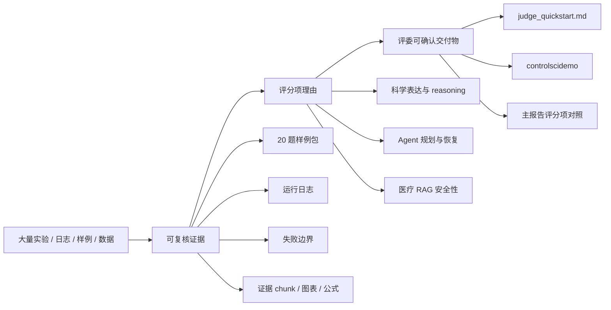
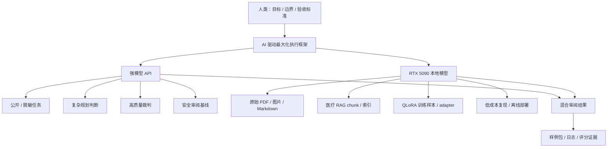

# ControlSci 评委快速验证指南

> 用途：帮助评委在 3 分钟内看到三赛道核心证据，在 10 分钟内完成样例抽查，在 30 分钟内进入深度复核。
>
> 对应比赛：2026 MinerU 生态挑战赛 · 三赛道（科学对齐 / 智能体 / 医疗 RAG）
>
> 更新：2026-05-14

---

## 一、最快验证入口

请在项目根目录 `<repo-root>` 下运行以下命令。

如果只做一次快速验证，建议先运行 Demo CLI：

```powershell
python demo/cli/controlscidemo all --quick
```

单赛道验证：

```powershell
python demo/cli/controlscidemo track1 --quick
python demo/cli/controlscidemo track2 --quick
python demo/cli/controlscidemo track3 --quick
```

指定抽查数量：

```powershell
python demo/cli/controlscidemo track1 --sample 10
python demo/cli/controlscidemo track2 --sample 10
python demo/cli/controlscidemo track3 --sample 10
```

### 1.1 Demo CLI 边界说明

`controlscidemo` 是 **reviewer-verifiable sample replay / evidence viewer**，用于快速展示：

- 三赛道样例输入与系统输出。
- 证据 chunk、日志路径或引用 ID。
- 通过标准与评分项映射。
- 失败边界、拒答边界或降级说明。

它不是完整系统的实时全流程重跑入口。完整复核请使用本文件后续的 one-click demo、日志、数据集和 DATA-TRACE 命令。

### 1.2 Windows 输出兼容

CLI 默认使用 UTF-8 输出。若评委环境无法显示 `✓ / △ / ✗` 等符号，可使用 ASCII fallback：

```powershell
$env:CONTROLSCI_ASCII="1"
python demo/cli/controlscidemo all --quick
```

---

## 二、3 分钟怎么看项目

ControlSci 同时提交三条赛道。本文件是快速导航，三份主报告是完整技术说明，三份 20 题样例包是可抽查证据。

| 你想做什么 | 建议入口 |
|:---|:---|
| 先快速看到三赛道样例 | `python demo/cli/controlscidemo all --quick` |
| 抽查 Track1 科学对齐 | [track1_sci_align_20_cases.md](track1_sci_align_20_cases.md) |
| 抽查 Track2 Agent 执行 | [track2_agent_20_cases.md](track2_agent_20_cases.md) |
| 抽查 Track3 医疗 RAG | [track3_medical_rag_20_cases.md](track3_medical_rag_20_cases.md) |
| 阅读 Track1 完整报告 | [track1_sci_align_report.md](track1_sci_align_report.md) |
| 阅读 Track2 完整报告 | [track2_agent_report.md](track2_agent_report.md) |
| 理解 Track2 Agent 演进 | [track2_agent_legacy_baseline.md](track2_agent_legacy_baseline.md) |
| 阅读 Track3 完整报告 | [track3_medical_rag_report.md](track3_medical_rag_report.md) |
| 查看最小真实闭环结果 | [minimal_repro_results.md](minimal_repro_results.md) |
| 验证报告数字来源 | [shared/DATA-TRACE.md](shared/DATA-TRACE.md) |
| 理解统一叙事 | [shared/core-narrative-and-strategy.md](shared/core-narrative-and-strategy.md) |
| 查看部署说明 | [track2_agent_deploy.md](track2_agent_deploy.md) / [track3_medical_deploy.md](track3_medical_deploy.md) |

### 2.1 统一技术原则

本项目采用 **AI 驱动最大化（AI-driven Maximalism）**：

> 人类定义目标、边界和验收标准；AI 最大化承担可协议化、可日志化、可复核的解析、规划、执行、审查与复现任务。

这不是“完全无人化”的口号，而是一个可审计的工程原则：哪些任务交给 AI，哪些边界由人类定义，哪些结果必须能被日志、样例和评分项复核。

同时，本项目采用明确的数据边界原则：**公开/脱敏任务上云，原文/医疗/微调/中间 chunk 留本地**。API 用于公开或脱敏派生材料上的高质量审阅；本地 RTX 5090 + MinerU/Ollama/vLLM 承担原始文档解析、医疗 RAG、QLoRA 微调、chunk 索引和隐私模式复现。

### 2.2 2026-05-14 最小真实闭环已验证

为了避免评委把时间花在 500 题全量评测、QLoRA 完整训练或索引重建上，本项目提供一份已跑通的最小真实闭环记录：[minimal_repro_results.md](minimal_repro_results.md)。

本轮验证覆盖：

- `run_minimal_repro.ps1 -Limit 10`：balanced-mini 10 题真实 API/Judge 评测、resume、leaderboard JSON/HTML 生成。
- `agent_cli.py --dry-run --intents reproduce_all`：Agent 复现计划生成。
- `python -m controlsci.dev.verify_core_hygiene`：能力注册、balanced-mini、空报告失败语义、cloud_demo 隔离、legacy wrapper 五项工程卫生检查。
- `python -m controlsci.medical.kb_quality --dry-run`：3348 chunks、FAISS、BM25、本地 embedding 检索链路。
- `python -m controlsci.api.medical_rag --check` 与 `/api/evidence/search`：FastAPI health/search。
- `run_reviewer_demo.ps1 -Track All -Quiet -ApiPort 18001`：API 启动时 `16/16 checks passed`。

这份结果是评审现场推荐的 L2 验证入口；完整 500 题评测与 QLoRA 训练保留为按需离线复核路径。

---

## 三、从努力到评分的证据链

大量实验、日志和样例只有转化为评委可确认的材料，才会形成有效评分理由。



评委可以按这条路径抽查：

1. 先跑 `controlscidemo all --quick`。
2. 再打开对应 `*_20_cases.md` 样例包。
3. 对照主报告中的评分项说明。
4. 必要时用 DATA-TRACE 或原始日志复核数字来源。

---

## 四、三赛道评分证据矩阵

| 赛道 | 核心贡献 | 关键证据 | 快速交付物 | 对应评分项 |
|:---|:---|:---|:---|:---|
| Track1 Sci-Align | 将控制科学文献转为可训练、可评测、可追溯的科学表达数据基础设施 | 500 题四维数据集、20+ 题样例包、公式/图表 grounding、DATA-TRACE | `track1_sci_align_20_cases.md`、`controlscidemo track1 --quick` | 科学表达、AI-ready、工程复现、开放生态 |
| Track2 Agent | 将科学文档语料生产从脚本流水线提升为可规划、可恢复、可审计的 Agent 执行协议 | 13 Intent、资源调度器、失败恢复案例、结构化日志、CLI replay | `track2_agent_20_cases.md`、`controlscidemo track2 --quick` | 复杂文档理解、Agent 规划执行、稳定性、工程复现 |
| Track3 Medical RAG | 将医疗文献转为可检索、可拒答、可视觉增强的循证 RAG 知识库 | 医疗 chunk、RAG 问答、拒答案例、endpoint 边界、视觉证据增强 | `track3_medical_rag_20_cases.md`、`controlscidemo track3 --quick` | 业务价值、系统能力、可用性、落地扩展 |

---

## 五、API + 5090 混合架构

本项目不把 API 和本地显卡作为资源堆砌，而是按任务风险、数据边界与复现需求分工。



| 任务类型 | 优先路径 | 数据边界 | 设计理由 |
|:---|:---|:---|:---|
| Intent Router / Judge / 复杂文本审阅 | API | 公开或脱敏派生输入 | 需要更高推理一致性与审阅质量上限 |
| 公开论文检索、题目生成、排行榜 | API + 本地脚本 | 公开数据 / 脱敏统计 | 保留质量上限，同时可用日志复核 |
| 原始 PDF / 图片 / Markdown 解析 | RTX 5090 + MinerU | local_only | 原文和版面结构不离开本地环境 |
| 医疗 RAG 检索上下文 / chunk / 索引 | RTX 5090 + Ollama + FAISS/BM25 | local_only | 患者相关证据按隐私敏感资产处理，支持医院内网部署 |
| QLoRA 训练样本 / adapter / 嵌入缓存 | RTX 5090 + PyTorch/Ollama | local_only | 微调数据与中间表示不出本机 |
| 样例回放与评分项映射 | CLI replay | 本地材料读取 | 降低评委抽查成本，不伪装成完整实时系统 |

代码层证据：`benchmark/agent/resource_scheduler.py` 为 intent 附带 `data_policy`。`mineru_parse`、`corpus_parse`、`multi_format_parse`、`medical_rag`、`local_finetune` 标记为 `local_only`；`benchmark_build`、`quality_arbitrate`、`model_evaluate` 等公开/脱敏任务才允许 API 增强。

---

## 六、Track1：Sci-Align 快速验证

### 6.1 快速命令

```powershell
python demo/cli/controlscidemo track1 --quick
```

### 6.2 验证目标

验证 ControlSci 是否将科学文献解析结果组织成可训练、可评测、可追溯的科学表达数据，而不是只停留在普通 OCR 或 Markdown 转换。

### 6.3 可抽查材料

| 检查点 | 操作 | 预期看到 | 对应评分项 |
|:---|:---|:---|:---|
| 样例覆盖 | 打开 [track1_sci_align_20_cases.md](track1_sci_align_20_cases.md) | text / formula / image_formula / table / chart 覆盖 | 科学表达、跨模态 |
| 数据集结构 | 打开 `benchmark/dataset/core.json` | questions、reasoning_steps、source_ref 等字段 | AI-ready |
| 多模态索引 | 打开 `benchmark/dataset/multimodal_index.json` | source_ref、image_formula 等索引字段 | 跨模态对齐 |
| 一键验证 | `.\run_reviewer_demo.ps1 -Track 1` | 数据集结构校验结果 | 工程复现 |
| 数字追溯 | 打开 [shared/DATA-TRACE.md](shared/DATA-TRACE.md) | 对应统计的来源和命令 | 可复核性 |

### 6.4 评委应重点看

- 是否存在明确的 source_ref 和 evidence path。
- 公式、图表、表格是否进入题目构造，而不是只做文本问答。
- reasoning_steps 是否能解释答案生成的科学推理链。
- 样例包是否同时说明通过标准和边界条件。

---

## 七、Track2：Data Agent 快速验证

### 7.1 快速命令

```powershell
python demo/cli/controlscidemo track2 --quick
```

### 7.2 验证目标

验证 ControlSci Data Agent 是否具备规划、执行、验证、恢复、降级和审计能力，而不是普通脚本流水线。

### 7.3 可抽查材料

| 检查点 | 操作 | 预期看到 | 对应评分项 |
|:---|:---|:---|:---|
| 样例覆盖 | 打开 [track2_agent_20_cases.md](track2_agent_20_cases.md) | 普通执行、失败恢复、降级处理、审计日志 | Agent 规划执行 |
| CLI replay | `python demo/cli/controlscidemo track2 --quick` | Intent、Plan、Tool calls、Output、Log status | 工程可复核 |
| 资源调度器 | `conda run -n myenv python -c "from benchmark.agent.resource_scheduler import get_global_scheduler; print(get_global_scheduler().check_health().summary)"` | Provider 健康状态摘要 | 系统能力 |
| Intent 注册 | 查看报告 §3 或运行资源调度器命令 | 13 Intent 与 provider 映射 | 复杂任务拆解 |
| 部署说明 | 打开 [track2_agent_deploy.md](track2_agent_deploy.md) | 部署、依赖和运行边界 | 可复现性 |

### 7.4 评委应重点看

- 每个样例是否包含 Agent plan 和 tool calls。
- 失败恢复案例是否说明触发条件、恢复流程和边界。
- 日志路径是否可定位到实际文件或明确标注为 replay 证据。
- Agent 是否诚实标注哪些任务是日志重放，哪些任务可运行复核。

---

## 八、Track3：Medical RAG 快速验证

### 8.1 快速命令

```powershell
python demo/cli/controlscidemo track3 --quick
```

### 8.2 验证目标

验证 Clinical Evidence Synthesis 是否具备医学文献检索、证据引用、拒答边界、endpoint 与 conclusion 区分，以及视觉证据增强能力。

### 8.3 可抽查材料

| 检查点 | 操作 | 预期看到 | 对应评分项 |
|:---|:---|:---|:---|
| 样例覆盖 | 打开 [track3_medical_rag_20_cases.md](track3_medical_rag_20_cases.md) | 有证据回答、拒答、视觉增强、endpoint 边界 | 业务价值、系统能力 |
| CLI replay | `python demo/cli/controlscidemo track3 --quick` | Question、Retrieved evidence、Answer、Confidence、Boundary | 可用性 |
| 医学 chunk | 查看 `data/sources_medical/chunks/` | 医学文献 chunk 与章节标签 | 技术架构 |
| 视觉描述 | 查看 `data/sources_medical/vision/vision_descriptions.jsonl` | 医学图像描述数据 | 视觉增强 |
| 部署说明 | 打开 [track3_medical_deploy.md](track3_medical_deploy.md) | 医疗 RAG 服务和边界说明 | 落地扩展 |

### 8.4 医疗安全边界

Track3 仅用于医学文献证据检索与综述辅助，不构成诊断、治疗或用药建议。

系统应在以下情况下拒答或标注边界：

- 检索不到可靠证据。
- 证据只包含 endpoint 描述，不能推出 clinical conclusion。
- 证据冲突或来源章节不可靠。
- 图像质量不足，无法支持视觉结论。

---

## 九、深度复核命令

以下命令用于在样例 replay 之后进一步复核，不要求作为 3 分钟快速验证的第一步。

```powershell
# Track1: 数据集结构验证
.\run_reviewer_demo.ps1 -Track 1

# Track2: Agent Intent 注册 + dry-run 复现计划
.\run_reviewer_demo.ps1 -Track 2

# Track3: 医疗 Hybrid 索引 + FAISS + RAG API 状态
.\run_reviewer_demo.ps1 -Track 3

# 全赛道
.\run_reviewer_demo.ps1 -Track All
```

更多单点复核：

```powershell
# Track1: Leaderboard 摘要
conda run -n myenv python -c "import json; d=json.load(open('docs/submissions/data_trace_bundle/03_leaderboard/leaderboard.json',encoding='utf-8')); [print(m['model'], m['overall_score']) for m in d['models']]"

# Track2: 资源调度器健康检查
conda run -n myenv python -c "from benchmark.agent.resource_scheduler import get_global_scheduler; print(get_global_scheduler().check_health().summary)"

# Track3: 医学视觉描述数量
conda run -n myenv python -c "print(sum(1 for _ in open('docs/submissions/data_trace_bundle/09_medical_rag/vision_descriptions_qwen35.jsonl',encoding='utf-8')))"
```

---

## 十、失败边界速查

| 赛道 | 需要诚实理解的边界 | 对评审的意义 |
|:---|:---|:---|
| Track1 | 科学题的难度与标准答案仍需持续校准；部分 chunk 引用是语料内部 ID，不一定是独立文件路径 | 证明数据集知道如何做质量控制，而不是只堆数量 |
| Track2 | `controlscidemo` 采用日志/样例重放模式，不启动完整 Agent 管道；完整运行依赖具体 provider 和环境 | 避免把 replay 误解为实时全流程执行 |
| Track3 | 医疗 RAG 仅做文献证据辅助；内部 sanity check 不替代官方正确性评测、临床研究或医疗判断 | 保持医疗安全边界和评审可信度 |
| 通用 | 单张 RTX 5090 证明消费级硬件可行性，不等价于大规模生产部署能力 | 把硬件叙事限定在可复现与成本优势上 |

---

## 十一、材料清单

### 11.1 已完成核心材料

- [x] [track1_sci_align_report.md](track1_sci_align_report.md)
- [x] [track2_agent_report.md](track2_agent_report.md)
- [x] [track3_medical_rag_report.md](track3_medical_rag_report.md)
- [x] [track1_sci_align_20_cases.md](track1_sci_align_20_cases.md)
- [x] [track2_agent_20_cases.md](track2_agent_20_cases.md)
- [x] [track3_medical_rag_20_cases.md](track3_medical_rag_20_cases.md)
- [x] [track2_agent_deploy.md](track2_agent_deploy.md)
- [x] [track3_medical_deploy.md](track3_medical_deploy.md)
- [x] [shared/DATA-TRACE.md](shared/DATA-TRACE.md)
- [x] [shared/core-narrative-and-strategy.md](shared/core-narrative-and-strategy.md)
- [x] [shared/narrative-mapping.md](shared/narrative-mapping.md)
- [x] [../../demo/cli/README.md](../../demo/cli/README.md)
- [x] [../../demo/cli/controlscidemo](../../demo/cli/controlscidemo)

### 11.2 可选补充材料

- [ ] Track1 failure boundary 独立文档
- [ ] Track2 failure boundary 独立文档
- [ ] Track3 failure boundary 独立文档
- [ ] 轻前端评委驾驶舱
- [ ] 三赛道 3 分钟演示视频或截图版脚本

---

## 十二、建议阅读顺序

1. 运行 `python demo/cli/controlscidemo all --quick`。
2. 打开三赛道评分证据矩阵，选择最感兴趣的赛道。
3. 抽查对应 `*_20_cases.md` 中 2-3 个样例。
4. 对照主报告中该赛道的评分项说明。
5. 用 DATA-TRACE 或原始日志复核关键数字。

最终判断标准：

> 不是项目做了多少事情，而是每个高价值 claim 是否能被样例、日志、路径、命令或边界说明快速复核。
