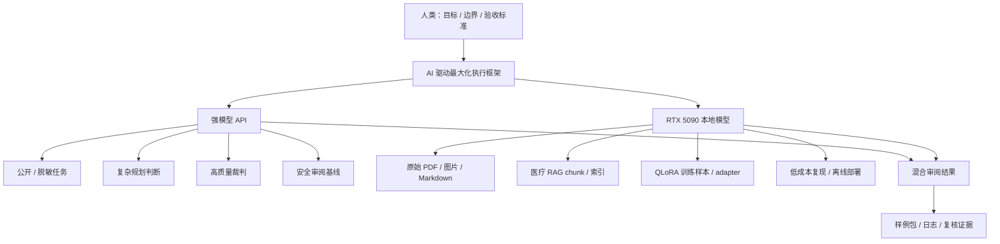

# ControlMind 三赛道快速验证指南

> 本文件定位：三赛道提交包的统一入口，用于快速理解项目结构、运行样例回放、定位复现命令，并追溯关键数据来源。
>
> 对应比赛：2026 MinerU 生态挑战赛 · 三赛道（科学对齐 / 智能体 / 医疗 RAG）
>
> 更新：2026-05-24

---
## 一、推荐阅读路径

1. 运行 `conda run --no-capture-output -n myenv python demo/cli/controlscidemo all --quick`。
2. 查看三赛道概览表，建立“数据基座 - Agent 执行协议 - 行业落地”的整体结构。
3. 打开对应 `*_20_cases.md`，抽查样例输入、系统输出、证据来源与边界说明。
4. 需要复核数字时，使用 DATA-TRACE、原始日志或报告附录命令定位权威来源。

---

## 二、最快验证入口

### 1.0 在线云端 Demo

在线云端 Demo 提供公开可体验的三赛道入口：

- 云端入口：[https://demo.askiler.com/](https://demo.askiler.com/)
- HTTP 入口：[http://demo.askiler.com/](http://demo.askiler.com/)（会自动跳转到 HTTPS）
- 前端访问码：`ControlMind@2026`

打开页面后，在顶部状态栏的“访问码”输入框填入访问码并点击“保存”。访问码只用于解锁公开 / 脱敏输入的短链路实时调用；云端 Demo 仅处理公开 PDF、公开 URL 或脱敏问题，不接收私有文档、患者材料或内部索引。

Demo 采用“双形态交付”：云端 Demo 展示三赛道页面、样例输出、来源回放和安全边界；本地 Demo / CLI 展示同一系统读取本地材料、复核日志、回放 trace，并在私有环境中运行完整链路的能力。云端入口用于形成整体印象，本地命令用于抽查关键证据。

云端 Demo 不替代三份主报告、DATA-TRACE 与本地 CLI 复核；涉及正式数字、完整链路和私有资产边界时，以报告、DATA-TRACE、manifest 与本地复现命令为准。

### 1.1 本地 CLI 快速验证

在解压或克隆后的 ControlMind 项目根目录下运行以下命令。

首次查看可先运行 Demo CLI：

```powershell
conda run --no-capture-output -n myenv python demo/cli/controlscidemo all --quick
```

单赛道验证：

```powershell
conda run --no-capture-output -n myenv python demo/cli/controlscidemo track1 --quick
conda run --no-capture-output -n myenv python demo/cli/controlscidemo track2 --quick
conda run --no-capture-output -n myenv python demo/cli/controlscidemo track3 --quick
```

指定抽查数量：

```powershell
conda run --no-capture-output -n myenv python demo/cli/controlscidemo track1 --sample 10
conda run --no-capture-output -n myenv python demo/cli/controlscidemo track2 --sample 10
conda run --no-capture-output -n myenv python demo/cli/controlscidemo track3 --sample 10
```

### 1.2 Demo CLI 边界说明

`controlscidemo` 是 **sample replay / evidence viewer**，用于快速展示：

- 三赛道样例输入与系统输出。
- 证据 chunk、日志路径或引用 ID。
- 通过标准与能力证据索引。
- 失败边界、拒答边界或降级说明。

它不是完整系统的实时全流程重跑入口。完整复核可继续使用本文件后续的 one-click demo、日志、数据集和 DATA-TRACE 命令。

### 1.3 Windows 输出兼容

CLI 默认使用 UTF-8 输出。若终端无法显示 `✓ / △ / ✗` 等符号，可使用 ASCII fallback：

```powershell
$env:CONTROLSCI_ASCII="1"
conda run --no-capture-output -n myenv python demo/cli/controlscidemo all --quick
```

如需保存机器可读 JSON，优先使用 `--output/-o`，避免通过 PowerShell `>` 重定向：

```powershell
conda run --no-capture-output -n myenv python -m controlsci.cli run acceptance --output _scratch/acceptance.json
conda run --no-capture-output -n myenv python -m controlsci.cli track2 validate --artifact flywheel --output _scratch/track2_flywheel.json
conda run --no-capture-output -n myenv python -m controlsci.cli track3 search "closed loop insulin hypoglycaemia primary endpoint" --k 3 --mode hybrid --index bge_m3 --output _scratch/track3_search.json
```

`_scratch/` 是本地临时输出目录，可删除、可重建，不属于权威数据源。最小复核路径默认复用提交包内已沉淀的公开 PDF、Markdown、题库、索引和 evidence；arXiv/PMC 在线下载保留为语料扩展能力，不作为复现前置条件。

---

## 三、提交包结构

ControlMind 同时提交三条赛道。本文件是快速导航，三份主报告是完整技术说明，三份代表案例包（Track1 30 个、Track2 25 个、Track3 26 个）是样例级证据索引。

| 目标 | 建议入口 |
|:---|:---|
| 快速查看三赛道样例 | `conda run --no-capture-output -n myenv python demo/cli/controlscidemo all --quick` |
| 抽查 Track1 科学对齐（30 个代表案例） | [track1_sci_align_20_cases.md](shared/track1_sci_align_20_cases.md) |
| 抽查 Track2 Agent 执行（25 个代表案例） | [track2_agent_20_cases.md](shared/track2_agent_20_cases.md) |
| 抽查 Track3 医疗 RAG（26 个代表案例） | [track3_medical_rag_20_cases.md](shared/track3_medical_rag_20_cases.md) |
| 阅读 Track1 完整报告 | [track1_sci_align_report.md](track1_sci_align_report.md) |
| 阅读 Track2 完整报告 | [track2_agent_report.md](track2_agent_report.md) |
| 阅读 Track3 完整报告 | [track3_medical_rag_report.md](track3_medical_rag_report.md) |
| 查看最小真实闭环复现记录 | [minimal_repro_results.md](shared/minimal_repro_results.md) |
| 验证报告数字来源 | [shared/DATA-TRACE.md](shared/DATA-TRACE.md) |
| 理解三赛道来源矩阵 | [shared/verifiable_source_matrix.md](shared/verifiable_source_matrix.md) |
| 查看部署说明 | [track2_agent_deploy.md](shared/track2_agent_deploy.md) / [track3_medical_deploy.md](shared/track3_medical_deploy.md) |

### 2.1 统一技术原则

本项目采用 **AI 驱动最大化（AI-driven Maximalism）**：

> 人类定义目标、边界和复核标准；AI 最大化承担可协议化、可日志化、可复核的解析、规划、执行、审查与复现任务。

这不是“完全无人化”的口号，而是一个可审计的工程原则：哪些任务交给 AI，哪些边界由人类定义，哪些结果必须能被日志、样例和能力证据复核。

同时，本项目采用明确的数据边界原则：**默认本地，云端兜底，非必要不上云**。系统不替代机构的数据定级制度；公开论文、公开教材等 `public_open` 数据默认仍走本地，只有显式授权后才可使用 MinerU 官方 API 兜底。API 用于公开或脱敏派生材料上的高质量审阅；本地 RTX 5090 + MinerU/Ollama/vLLM 承担私有原文解析、医疗 RAG、QLoRA 微调、chunk 索引和隐私模式复现。

以下入口命令均已于 2026-05-15 通过完整验收——数据集结构校验、API/Judge 真实评测、RAG 检索、容器化部署一键检查均在产出侧印证。2026-05-17 补充三赛道最小入口、Track1 本地 JSON 加载、Track2 本地 dry-run DAG 与 Track3 安全拒答边界；2026-05-23/24 又补入 Sciverse 集成、Track1/Track2 reliability 和 Track3 Medical RAG supplemental。具体记录见 [minimal_repro_results.md](shared/minimal_repro_results.md)、[DATA-TRACE.md](shared/DATA-TRACE.md) #147-190 与 `data_trace_bundle/12_final_supplemental_experiments/`。

---

## 四、三赛道概览

| 赛道 | 核心贡献 | 关键证据 | 快速交付物 | 能力维度 |
|:---|:---|:---|:---|:---|
| Track1 Sci-Align | 将控制科学文献转为可训练、可评测、可追溯的科学表达数据基础设施 | 500 题四维数据集、30 个抽查样例、公式/图表 grounding、DATA-TRACE | `shared/track1_sci_align_20_cases.md`、`controlscidemo track1 --quick` | 科学表达、AI-ready、工程复现、开放生态 |
| Track2 Agent | 将科学文档语料生产从脚本流水线提升为可规划、可恢复、可审计的 Agent 执行协议 | 15 Intent、资源调度器、失败恢复案例、结构化日志、CLI replay | `shared/track2_agent_20_cases.md`、`controlscidemo track2 --quick` | 复杂文档理解、Agent 规划执行、稳定性、工程复现 |
| Track3 Medical RAG | 将医疗文献转为可检索、可拒答、可视觉增强的循证 RAG 知识库 | 医疗 chunk、RAG 问答、拒答案例、endpoint 边界、视觉证据增强 | `shared/track3_medical_rag_20_cases.md`、`controlscidemo track3 --quick` | 业务价值、系统能力、可用性、落地扩展 |

### 4.1 能力证据索引

| 赛道 | 能力维度 | 证据材料 | 观察重点 |
|:---|:---|:---|:---|
| Track1 | 科学数据表达 / 跨模态理解 | [track1_sci_align_report.md](track1_sci_align_report.md) §2-§3；[track1_sci_align_20_cases.md](shared/track1_sci_align_20_cases.md) | 公式、图表、表格、图片公式进入题目与 source_ref，而不是只做纯文本问答 |
| Track1 | 科学价值 / 创新性 | [track1_sci_align_report.md](track1_sci_align_report.md) §1、§7、§8 | 控制科学垂直基准、四维能力划分、九模型排行榜与误差分析 |
| Track1 | AI-Ready / 推理支持 | [track1_sci_align_report.md](track1_sci_align_report.md) §3.1-§3.4、§8.2；`benchmark/dataset/core.json`；`data_trace_bundle/02_benchmark/core.json`；`data_trace_bundle/12_final_supplemental_experiments/track1_load/` | 500 题 flat JSON、reasoning_steps、source_ref、HuggingFace 与本地 JSON `load_dataset` 零适配 |
| Track1 | 工程质量 / 可复现 | [minimal_repro_results.md](shared/minimal_repro_results.md)；[DATA-TRACE.md](shared/DATA-TRACE.md)；`data_trace_bundle/manifest.json`；`data_trace_bundle/12_final_supplemental_experiments/track1_sci_align_reliability/` | 0.9 秒结构验证、排行榜原始结果、manifest SHA-256 溯源、AI-ready 与四维区分度补充审计 |
| Track1 | 开放共享 / 生态影响 | [track1_sci_align_report.md](track1_sci_align_report.md) §7.2、§9 | GitHub 代码、HuggingFace 数据集、CC-BY-4.0、mineru-to-md 与 arXiv 检索 Skill |
| Track2 | 复杂文档理解 | [track2_agent_report.md](track2_agent_report.md) §2；[track2_agent_20_cases.md](shared/track2_agent_20_cases.md) | 科学 PDF、Markdown、图表、审计样例与 MinerU 结构化输出 |
| Track2 | 难点场景 / 创新性 | [track2_agent_report.md](track2_agent_report.md) §3-§4；`data_trace_bundle/07_flywheel/agent_capabilities.json` | 15 Intent、四类 provider、data_policy、跨赛道能力注册 |
| Track2 | Agent 任务规划与自动执行 | [track2_agent_report.md](track2_agent_report.md) §3.1-§3.5；[track2_agent_20_cases.md](shared/track2_agent_20_cases.md)；`data_trace_bundle/07_flywheel/demo-data-flywheel.json` | Intent 路由、DAG 拆解、tool calls、失败恢复、391 秒飞轮 replay |
| Track2 | 稳定性 / 工程复现 | [track2_agent_report.md](track2_agent_report.md) §5.4-§5.6；[minimal_repro_results.md](shared/minimal_repro_results.md)；[track2_agent_deploy.md](shared/track2_agent_deploy.md)；`data_trace_bundle/12_final_supplemental_experiments/track2_fallback/`；`data_trace_bundle/12_final_supplemental_experiments/track2_agent_reliability/` | fallback、dry-run、8 步本地 DAG、资源调度健康检查、router robustness、failure injection 与资源 Pareto |
| Track2 | 开源共享 / 产业生态 | [track2_agent_report.md](track2_agent_report.md) §7 | GitHub 仓库、HuggingFace 数据、CC-BY-4.0、可复用 Agent 协议 |
| Track3 | 文献证据工作流 | [track3_medical_rag_report.md](track3_medical_rag_report.md) §1、§4.4、§6.2；[track3_medical_rag_20_cases.md](shared/track3_medical_rag_20_cases.md) Case 09-17；`data_trace_bundle/12_final_supplemental_experiments/track3_refusal/` | 无证据、弱证据、证据冲突或个人诊疗边界时拒答或降置信，避免把检索结果伪装成医学结论 |
| Track3 | 临床证据边界 | [track3_medical_rag_report.md](track3_medical_rag_report.md) §4.2-§4.5、§7；[track3_medical_rag_20_cases.md](shared/track3_medical_rag_20_cases.md) Case 23、25 | citation coverage、中文 Ask、endpoint / conclusion 区分、来源卡片和 claim support |
| Track3 | 技术先进性 / 系统能力 | [track3_medical_rag_report.md](track3_medical_rag_report.md) §3-§5；`data_trace_bundle/09_medical_rag/`；`data_trace_bundle/11_throughput/` | Hybrid RAG、医学视觉注入、BGE M3/HF embedding、RTX 5090 吞吐短测 |
| Track3 | 工程实现 / 可用性 | [track3_medical_rag_report.md](track3_medical_rag_report.md) §5.2、§6；[track3_medical_deploy.md](shared/track3_medical_deploy.md)；`data_trace_bundle/12_final_supplemental_experiments/track3_medical_rag_supplemental/` | REST API、Docker Compose、CLI replay、本地索引、Evidence Card 与部署 smoke matrix |
| Track3 | 应用落地 / 扩展性 | [track3_medical_rag_report.md](track3_medical_rag_report.md) §7；[public_cloud_boundary.md](shared/public_cloud_boundary.md) | 公开 Demo 与本地医疗资料边界分离，支持机构替换本地文献库后复用 |

---

## 五、API + 5090 混合架构

本项目不把 API 和本地显卡作为资源堆砌，而是按任务风险、数据边界与复现需求分工。



| 任务类型 | 优先路径 | 数据边界 | 设计理由 |
|:---|:---|:---|:---|
| Intent Router / Judge / 复杂文本审阅 | API | 公开或脱敏派生输入 | 需要更高推理一致性与审阅质量上限 |
| 公开论文检索、题目生成、排行榜 | API + 本地脚本 | 公开数据 / 脱敏统计 | 保留质量上限，同时可用日志复核 |
| 原始 PDF / 图片 / Markdown 解析 | RTX 5090 + MinerU | local_only | 原文和版面结构不离开本地环境 |
| 医疗 RAG 检索上下文 / chunk / 索引 | RTX 5090 + Ollama + FAISS/BM25 | local_only | 患者相关证据按隐私敏感资产处理，支持医院内网部署 |
| QLoRA 训练样本 / adapter / 嵌入缓存 | RTX 5090 + PyTorch/Ollama | local_only | 微调数据与中间表示不出本机 |
| 样例回放与能力证据索引 | CLI replay | 本地材料读取 | 降低抽查成本，并与完整实时系统边界分离 |

代码层证据：`benchmark/agent/resource_scheduler.py` 为 intent 附带 `data_policy`。`medical_rag`、`local_finetune` 标记为 `local_only`；`mineru_parse`、`corpus_parse`、`multi_format_parse` 标记为 `data_class_dependent`，只有公开分级并显式 `allow_cloud_upload` 时才允许官方 API；`benchmark_build`、`quality_arbitrate`、`model_evaluate` 等公开/脱敏任务才允许 API 增强。

---

## 六、Track1：Sci-Align 快速验证

### 6.1 快速命令

```powershell
conda run --no-capture-output -n myenv python demo/cli/controlscidemo track1 --quick
```

### 6.2 验证目标

验证 ControlMind 将科学文献解析结果组织成可训练、可评测、可追溯的科学表达数据，而不是只停留在普通 OCR 或 Markdown 转换。

### 6.3 可核验材料

| 检查点 | 操作 | 预期看到 | 能力维度 |
|:---|:---|:---|:---|
| 样例覆盖 | 打开 [track1_sci_align_20_cases.md](shared/track1_sci_align_20_cases.md) | text / formula / image_formula / table / chart 覆盖 | 科学表达、跨模态 |
| 数据集结构 | 打开 `benchmark/dataset/core.json` | questions、reasoning_steps、source_ref 等字段 | AI-ready |
| 多模态索引 | 打开 `benchmark/dataset/multimodal_index.json` | source_ref、image_formula 等索引字段 | 跨模态对齐 |
| 一键验证 | `.\run_reviewer_demo.ps1 -Track 1` | 数据集结构校验结果 | 工程复现 |
| 本地加载 | `datasets.load_dataset("json")` 读取 `benchmark/dataset/core.json` | 500 行与完整 schema | AI-ready |
| 数字追溯 | 打开 [shared/DATA-TRACE.md](shared/DATA-TRACE.md) | 对应统计的来源和命令 | 可复核性 |

### 6.4 关键观察点

- 明确的 source_ref 和 evidence path。
- 公式、图表、表格进入题目构造，而不是只做文本问答。
- reasoning_steps 解释答案生成的科学推理链。
- 样例包同时说明通过标准和边界条件。

---

## 七、Track2：Data Agent 快速验证

### 7.1 快速命令

```powershell
conda run --no-capture-output -n myenv python demo/cli/controlscidemo track2 --quick
```

### 7.2 验证目标

验证 ControlMind Data Agent 具备规划、执行、验证、恢复、降级和审计能力，而不是普通脚本流水线。

### 7.3 可核验材料

| 检查点 | 操作 | 预期看到 | 能力维度 |
|:---|:---|:---|:---|
| 样例覆盖 | 打开 [track2_agent_20_cases.md](shared/track2_agent_20_cases.md) | 普通执行、失败恢复、降级处理、审计日志 | Agent 规划执行 |
| CLI replay | `conda run --no-capture-output -n myenv python demo/cli/controlscidemo track2 --quick` | Intent、Plan、Tool calls、Output、Log status | 工程可复核 |
| 资源调度器 | `conda run --no-capture-output -n myenv python -m controlsci.cli track2 validate --artifact flywheel --output _scratch/track2_flywheel.json` | Provider / artifact 回放摘要 | 系统能力 |
| Intent 注册 | 查看报告 §3 或 `benchmark/agent/agent_capabilities.json` | 15 Intent 与 provider 映射 | 复杂任务拆解 |
| 部署说明 | 打开 [track2_agent_deploy.md](shared/track2_agent_deploy.md) | 部署、依赖和运行边界 | 可复现性 |

### 7.4 关键观察点

- 每个样例包含 Agent plan 和 tool calls。
- 失败恢复案例说明触发条件、恢复流程和边界。
- 日志路径可定位到实际文件，或明确标注为 replay 证据。
- Agent 明确标注哪些任务是日志重放，哪些任务可运行复核。

---

## 八、Track3：Medical RAG 快速验证

### 8.1 快速命令

```powershell
conda run --no-capture-output -n myenv python demo/cli/controlscidemo track3 --quick
```

### 8.2 验证目标

验证 Clinical Evidence Synthesis 具备医学文献检索、证据引用、拒答边界、endpoint 与 conclusion 区分，以及视觉证据增强能力。

### 8.3 可核验材料

| 检查点 | 操作 | 预期看到 | 能力维度 |
|:---|:---|:---|:---|
| 样例覆盖 | 打开 [track3_medical_rag_20_cases.md](shared/track3_medical_rag_20_cases.md) | 有证据回答、拒答、视觉增强、endpoint 边界 | 业务价值、系统能力 |
| CLI replay | `conda run --no-capture-output -n myenv python demo/cli/controlscidemo track3 --quick` | Question、Retrieved evidence、Answer、Confidence、Boundary | 可用性 |
| 医学 chunk | 查看 `data/sources_medical/chunks/` | 医学文献 chunk 与章节标签 | 技术架构 |
| 视觉描述 | 查看 `data/sources_medical/vision/vision_descriptions.jsonl` | 医学图像描述数据 | 视觉增强 |
| 部署说明 | 打开 [track3_medical_deploy.md](shared/track3_medical_deploy.md) | 医疗 RAG 服务和边界说明 | 落地扩展 |

### 8.4 医疗安全边界

Track3 仅用于医学文献证据检索与综述辅助，不构成诊断、治疗或用药建议。

系统应在以下情况下拒答或标注边界：

- 检索不到可靠证据。
- 证据只包含 endpoint 描述，不能推出 clinical conclusion。
- 证据冲突或来源章节不可靠。
- 图像质量不足，无法支持视觉结论。

---

## 九、深度复核命令

以下命令用于在样例 replay 之后进一步复核，不需要作为首次查看的第一步。

```powershell
# Track1: 数据集结构验证
.\run_reviewer_demo.ps1 -Track 1

# Track2: Agent Intent 注册 + dry-run 复现计划
.\run_reviewer_demo.ps1 -Track 2

# Track2: 本地模式 DAG 规划验收
conda run --no-capture-output -n myenv python benchmark\agent\agent_cli.py --dry-run --local --intents medical_rag,cross_modal_audit,leaderboard_viz

# Track3: 医疗 Hybrid 索引 + FAISS + RAG API 状态
.\run_reviewer_demo.ps1 -Track 3

# 全赛道
.\run_reviewer_demo.ps1 -Track All
```

若本机安装过 Conda 并启用了 PowerShell profile，可使用更干净的启动方式：

```powershell
powershell -NoProfile -ExecutionPolicy Bypass -File .\run_reviewer_demo.ps1 -Track All -Quiet -ApiPort 17001
```

更多单点复核：

```powershell
# Track1: Leaderboard 摘要
conda run --no-capture-output -n myenv python -c "import json; d=json.load(open('benchmark/eval/results/leaderboard.json',encoding='utf-8')); [print(m['model'], m['overall_score']) for m in d['models']]"

# Track2: 资源调度器健康检查
conda run --no-capture-output -n myenv python -c "from benchmark.agent.resource_scheduler import get_global_scheduler; print(get_global_scheduler().check_health().summary)"

# Track3: 医学视觉描述数量
conda run --no-capture-output -n myenv python -c "print(sum(1 for _ in open('data/sources_medical/vision/vision_descriptions.jsonl',encoding='utf-8')))"
```

---

## 十、失败边界速查

| 赛道 | 需要明确理解的边界 | 设计意义 |
|:---|:---|:---|
| Track1 | 科学题的难度与标准答案仍需持续校准；部分 chunk 引用是语料内部 ID，不一定是独立文件路径 | 数据集建设强调质量控制，而不是只堆数量 |
| Track2 | `controlscidemo` 采用日志/样例重放模式，不启动完整 Agent 管道；完整运行依赖具体 provider 和环境 | 避免把 replay 误解为实时全流程执行 |
| Track3 | 医疗 RAG 仅做文献证据辅助；内部 sanity check 不替代官方正确性评测、临床研究或医疗判断 | 保持医疗安全边界和系统可信度 |
| 通用 | 单张 RTX 5090 证明消费级硬件可行性，不等价于大规模生产部署能力 | 把硬件叙事限定在可复现与成本优势上 |
