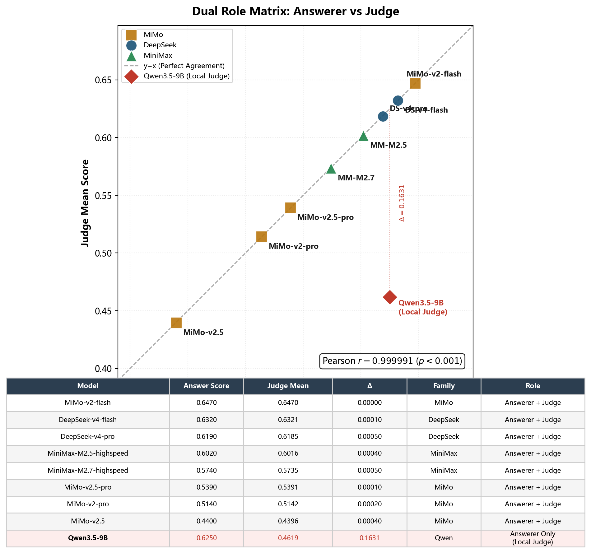

# ControlSci: 控制科学结构化语料库与 Sci-Align 跨模态对齐评测基准

> **数据范式**：Sci-Align（跨模态对齐评测） | **科学领域**：控制科学
> **版本**：v3.1（润色优化版） | **更新日期**：2026-05-14
> **数据追溯**：本报告中所有定量声明同步至 `../DATA-TRACE.md` 统一条目

> **最小真实闭环验证**：2026-05-14 已完成 `run_evaluation.ps1 -Execute -Limit 10` 小样本真实评测，覆盖数据校验、API/Judge 调用、resume、leaderboard JSON/HTML 生成。详见 [minimal_repro_results.md](minimal_repro_results.md)。

***

## §1 引言

三个技术趋势的交汇使本项目成为可能。其一，LLM 在通用基准（MMLU、GSM8K）上趋于饱和，垂直领域的深度评测成为区分模型能力的新标尺——控制科学作为 AGI4S 的基础数学语言，其评测需求在此刻尤为迫切。其二，MinerU 等新一代文档解析引擎使大规模科学文献的结构化处理首次具备工程可行性——362 份文档（1.3GB PDF）的全量解析不再需要人工逐篇调参。其三，消费级 GPU（RTX 5090, 24GB）使垂直领域的全栈 AI 工作流不再依赖云计算——一台笔记本即可完成从解析到训练到评测的完整闭环。本项目在这三个趋势的交叉点上，验证了消费级硬件 × AI 最大化执行 × 垂直领域深评测的技术可行性。

**一句话贡献**：ControlSci 的核心贡献是把控制科学文献从 PDF 资产转化为可训练、可评测、可追溯的 Sci-Align 数据基础设施。

### 1.1 背景与动机

对大语言模型在科学领域的推理能力进行系统评测，是当前 AI 研究的核心挑战之一。现有通用基准（MMLU、GSM8K、GPQA）覆盖了大量学科，但评测粒度停留在单科目单选或多步算术的层面，缺乏对"从概念回溯到开放设计"的完整推理链的分层测量能力。领域专项基准则多集中在物理、化学、生物、数学等学科——控制科学作为 AI for Science（AGI4S）的基础工程支柱，在已有评测体系中处于结构性缺失状态。

控制科学的数学工具谱系——Lyapunov 稳定性理论、Riccati 方程、线性矩阵不等式（LMI）、模型预测控制——构成了自动驾驶、工业机器人、智能电网等 AGI 核心应用场景的推理底模。但一个基础性的问题始终悬而未决：**当前的大语言模型是否真正理解控制科学的数学结构？**

已有研究表明，LLM 在控制科学相关的工程问题上往往给出"看似合理但经不起推敲"的回答——它能写出 PID 整定的标准步骤，但在执行器饱和或参数摄动的条件下无法维持推理一致性。这不是模型不够聪明，而是缺乏一个能够分层测量"概念回溯→多步推理→条件敏感性分析→开放设计"完整认知链条的专项基准。

ControlSci 正是在这一背景下构建的。它以跨模态对齐（Sci-Align）为数据范式，以控制科学为专精领域，以四维评测体系为工具，对 9 个主流 LLM 进行了全量 500 题系统评测。语料的 339 篇 arXiv 论文覆盖 2022-2026 年的控制科学前沿方向——从经典的自适应 MPC 到 2026 年的多智能体强化学习安全滤波——确保 Benchmark 不仅是已有知识的归纳，更是对前沿研究动态的响应。控制科学的领域正当性不仅来自其作为 AGI4S 基础数学语言的理论地位，也获得了实证支持——在医学文献的领域迁移实验中，100 篇 PMC 文献中有 72 篇核心文献天然使用控制方法（状态空间建模、模型预测控制、Lyapunov 稳定性分析等），覆盖 13 个"控制×医学"交叉方向。

### 1.2 已有基准的局限

基于各基准官方论文与学科分类说明的系统调研，六个主流评测基准无一覆盖控制科学：

| 基准             |    覆盖学科数   | 科学领域范围      |     控制科学覆盖     |      推理维度数     |  条件敏感性  |   开放设计  |
| :------------- | :--------: | :---------- | :------------: | :------------: | :-----: | :-----: |
| MMLU           |     57     | 含工程类 3 科    |     未列明控制工程    |      1（选择）     |    无    |    无    |
| GSM8K          |      1     | 小学数学        |        无       |      1（计算）     |    无    |    无    |
| SciBench       |     13+    | 大学物理/化学/数学  |   零散公式出现，无主领域  |    2（计算+解释）    |    无    |    无    |
| GPQA           |      —     | 物理/化学/生物前沿  | 448 题中控制相关 0 题 |      1（问答）     |    无    |    无    |
| MATH           |      7     | 高中数学竞赛      |        无       |      1（解答）     |    无    |    无    |
| ProofNet       |      1     | 本科数学证明      |        无       |      1（证明）     |    无    |    无    |
| **ControlSci** | **14 子领域** | **控制科学全覆盖** |  **14 子领域核心题** | **4（A/B/C/D）** | **C 维** | **D 维** |

> 数据来源：各基准官网与原始论文的学科分类列表、题目样本和官方文档。

控制科学在 MMLU 的 57 个学科中未出现；SciBench 的大学教材中仅包含控制相关的零散公式但不构成独立维度；GPQA 的 448 道前沿科学题中控制科学相关题数为 0。在调研范围内，无已有基准以控制科学为专精领域——ControlSci 填补了这一空缺。

逐基准审视揭示了一个更深的系统性模式。**MMLU** 以多选题评测知识广度，57 科不含控制科学——其电气工程大类覆盖电路和信号处理，但不涉及控制系统建模。**GSM8K** 的算术推理复杂度（2-8 步四则运算）与控制科学的微分方程和矩阵运算之间存在量级差距。**SciBench** 是目前与 ControlSci 最接近的基准——均为大学难度、均含教材、均涉公式——但其覆盖的物理/化学/数学属于基础科学，缺少工程控制特有的条件敏感性分析（参数摄动→系统行为变化）和开放设计（控制器架构选择）维度。**MATH** 的竞赛级 LaTeX 密度的确是所有基准中最高的，但限定在纯数学领域，不涉及控制系统建模的工程数学工具（Lyapunov 方程、Riccati 方程、LMI）。**GPQA** 偏向物理学/化学/生物学前沿，448 题中控制相关题数为 0——控制科学在前沿科学基准中的缺席尤为突出——而控制理论恰恰是这些领域的底层数学工具。**ProofNet** 独树一帜地验证了"有推理链的数据集能有效区分深度推理能力"，但限定在形式化数学证明（Lean 3），无法扩展到工程系统的多步设计决策。

综合来看，16 个基准维度（6 基准 × 1-4 维）与控制科学的四维体系之间存在一条清晰的鸿沟：没有任何一个基准同时覆盖"条件敏感性分析"和"开放设计"两个认知层次。ControlSci 的 C 维和 D 维是独有的——这是第一次有人问：当系统参数变化时 LLM 能否维持推理一致性？当给定开放需求时 LLM 能否设计完整方案？

### 1.3 AI 驱动最大化原则

本项目从设计之初遵循 **AI 驱动最大化（AI-driven Maximalism）** 原则：人类负责定义科学问题、数据边界、评价协议与合规约束；AI Agent 最大化承担可协议化、可日志化、可复现的执行层决策。从文献检索到排行榜更新的整条链路中，凡是可以被明确写入 schema、prompt、rubric、checkpoint 或日志的步骤，都交由 AI 和自动化工具完成，而不是依赖人工逐篇筛查、逐题批改或逐图审计。

这一原则不是宣称人类完全退出系统，而是将人类决策集中在高价值层：定义 ControlSci 应该评测什么、什么数据可用、什么输出算合格；AI 则负责在这些边界内执行检索、解析、审计、生成、仲裁、评测和更新。

| 层级 | 责任主体 | 本项目中的具体体现 |
| :--- | :--- | :--- |
| **目标层** | 人类 | 控制科学领域选择、Sci-Align 数据范式、A/B/C/D 四维评测体系 |
| **约束层** | 人类 + AI | 数据 schema、质量 rubric、合规边界、Judge prompt、失败判定规则 |
| **执行层** | AI Agent 最大化负责 | 文献检索、MinerU 解析调度、跨模态审计、题目生成、质量仲裁、模型评测、排行榜更新 |

| 环节        | 人工基线（传统做法）                  | AI 驱动的实现                                         | 涉及的 Skill / Intent                    | 被替代的人工决策                 |
| :-------- | :-------------------------- | :----------------------------------------------- | :------------------------------------ | :----------------------- |
| **文献检索**  | 浏览 arXiv → 判断相关性 → 手动下载 PDF | 关键词 → arXiv API → 自动下载 + 元数据提取                   | arXiv Skill                           | "这篇论文跟控制科学相关吗？"          |
| **文档解析**  | 逐篇调参 → 盯 GPU 显存 → 手动重启      | 格式自动检测 → GPU 生命周期管理 → 断点续跑 → 质量审计                | mineru-to-md Skill                    | "显存快满了要不要重启？""这轮跑了多少篇了？" |
| **质量审计**  | 逐篇抽查公式 / 图片对齐 → 人工比对        | MiMo-V2.5 全量视觉审计：4,996 共现 chunk → 9,207 条自动判决    | cross\_modal\_audit intent            | "这张图里的公式和文字描述一致吗？"       |
| **题目生成**  | 人工出题 → peer review → 修改     | 三 Provider 并行生成 → 两轮自验 → Embedding 快筛 → LLM 深度仲裁 | benchmark\_build + quality\_arbitrate | "这道题的答案对不对？""这题够不够难？"    |
| **评测执行**  | 人工批改 → 争议讨论 → 重新打分          | LLM-as-Judge → 三 Judge 交叉验证 → Fleiss' κ 一致性报告    | model\_evaluate intent                | "这个答案给几分？""三个评分人谁对？"     |
| **排行榜更新** | 手动统计 → 手动排版 → 手动发布          | Agent 自主更新 500→515 题 → 自动 HTML 排行榜               | leaderboard\_viz intent               | "新题来了，排行榜要重新算"           |
| **领域迁移**  | 为每个新领域重写解析/切片/评测代码          | 同一 Agent 框架 → 核心模块零代码改动 → 控制科学 → 医学              | 全部 13 intent                          | "医学文献的格式不一样，得重新写"        |

> 数据来源：本表为三报告共享的核心叙事框架，各环节的具体数据在对应章节中有完整展开。

#### 1.3.1 云端 + 本地隐私边界原则

AI 驱动最大化并不意味着所有数据都交给云端模型处理。本项目采用一条更严格的工程原则：**公开/脱敏任务上云，原文/医疗/微调/中间 chunk 留本地**。云端 API 用于需要高推理一致性的公开或脱敏派生任务；本地 RTX 5090 + Ollama/MinerU/vLLM 承担原始文档解析、医学证据处理、微调数据构建、chunk 索引与隐私模式复现。

| 数据 / 任务类型 | 默认边界 | 可用引擎 | 原因 |
|:---|:---|:---|:---|
| 公开 arXiv / PMC 元数据检索 | 可上云 | arXiv / PMC API | 数据本身公开，主要任务是检索与去重 |
| 脱敏统计、评分矩阵、排行榜 | 可上云 | DeepSeek / MiMo / MiniMax Judge | 输入为评测题、摘要统计或脱敏样例，用于提高审阅质量上限 |
| 原始 PDF、图片、Markdown 原文 | 留本地 | MinerU / 本地脚本 | 保留源文档与版面结构，不作为云端推理输入 |
| 医疗 RAG chunk、患者相关证据片段 | 留本地 | FAISS + BM25 + Ollama | 医疗证据链按隐私敏感资产处理，支持医院内网部署 |
| QLoRA 训练样本、adapter、嵌入缓存 | 留本地 | RTX 5090 + Ollama / PyTorch | 微调数据和中间表示不出本机，保证可复现与可控 |

这一边界已落实到代码：`resource_scheduler.py` 为每个 intent 附带 `data_policy`；`mineru_parse`、`corpus_parse`、`multi_format_parse`、`medical_rag`、`local_finetune` 被标为 `local_only`，即使在自动模式下也不会被云端 provider 接管；`benchmark_build`、`quality_arbitrate`、`model_evaluate` 等公开或脱敏派生任务才允许使用 API 增强。

**精确边界**："AI 驱动最大化"指**执行层面最大化自动化**——设计层面，四维评测体系（A/B/C/D）和 13 个 Agent Intent 由人工定义；约束层由人工定义初始协议、AI 参与执行校验；执行层从文献检索到评测报告生成由 AI Agent 按日志化步骤自动完成。Agent 编排层 5 个核心模块（`agent_cli.py` / `resource_scheduler.py` / `visual_audit.py` / `log_schema.py` / `agent_capabilities.json`）完全未修改；`chunk_corpus.py` 追加了约 30 行 `medical_mode` 参数；QLoRA 训练脚本仅切换了数据文件路径。

**评审可验证清单**：

| 验证项 | 命令 / 路径 | 预期输出 | 耗时 |
|:---|:---|:---|:---:|
| 数据集结构验证 | `.\run_reviewer_demo.ps1 -Track 1` | 500 题结构校验通过，A/B/C/D 各 125 | ~1s |
| 多模态索引检查 | `benchmark/dataset/multimodal_index.json` | 500/500 source_ref 匹配，image_formula=74 | CPU 读取 |
| 核心数据加载 | `benchmark/dataset/core.json` | `questions` 长度 500，含 `reasoning_steps` 与 `source_ref` | CPU 读取 |
| 复现命令索引 | 附录 A + `../DATA-TRACE.md` | 报告关键数字可定位到权威源文件 | 文档检查 |

### 1.4 MinerU 语料工程基础

ControlSci 的语料构建建立在 MinerU 文档解析引擎之上。三组数据界定了工程化的可行性边界：

- **扫描版教材 OCR 差距**：三本核心教材为扫描版 PDF，文本层为空。PyMuPDF 在此场景下提取 1,543 字符，MinerU OCR 提取 2,924,525 字符 + 28,473 条 LaTeX 公式。1,895× 的字符输出差距决定了语料构建的可行性边界——传统文本提取在扫描版教材场景下不可用。
- **大规模全量解析验证**：362 篇文档（23 教材 + 339 arXiv 论文，1.3GB PDF，含 253,012 条 LaTeX 公式，密度约每篇 700 条）的全量解析中零系统性失败。
- **跨模态数据保全**：11,554 张嵌入图片被提取为结构化块而非简单引用，使图片与上下文公式/文本可进行跨模态关联分析——4,996 个图文共现 chunk 能够被系统检测的技术前提。

ControlSci 围绕**消除控制科学数据的三重 AI 消费障碍**设计：格式障碍（PDF 公式→结构化 LaTeX）由 MinerU 解析管线消除；结构障碍（科学数据→统一 Schema）由 5 字段 flat JSON 格式解决——核心评测集 `core.json` 仅 1.1MB，HuggingFace `load_dataset` 零适配即可加载；对齐障碍（图片↔公式跨模态一致性）由全量跨模态审计索引保证。三重消除指向一个核心命题——**"这个数据集能被 AI 直接消费吗？"** QLoRA 训练从加载到首次反向传播在 4.7 秒内完成，500 题全量结构验证仅需 0.9 秒。

| 指标                   |                数值                |
| :------------------- | :------------------------------: |
| 语料文档                 |     362（23 教材 + 339 arXiv 论文）    |
| 语料公式                 |        253,012 条结构化 LaTeX        |
| 语料图片                 |           11,554 张嵌入图片           |
| 语料 Chunk（磁盘 glob 口径） |    28,514，每 chunk \~691 tokens   |
| 评测题核心集               |     500 题（A/B/C/D 各 125，完美平衡）    |
| 难度分布                 | L1=40 / L2=153 / L3=163 / L4=144 |
| 覆盖子领域                |             14 个控制子领域            |
| 数据格式                 |     flat JSON，HuggingFace 兼容     |
| 许可协议                 |             CC-BY-4.0            |

> 数据来源：文档数来自 `corpus/metadata.json`；公式/图片数来自 `corpus/stats/corpus_stats.json`；Chunk 数来自 `benchmark/eval/results/multimodal_chunks.json`；维度分布来自 `benchmark/dataset/core.json`。

数据集已发布至 HuggingFace：`MorningStar0709/control-sci-corpus`（CC-BY-4.0），以 flat JSON 格式存储——核心集 `core.json`（500 题）仅 1.1MB，微调集 `full.json`（889 题）2.1MB，加跨模态索引后总大小约 3.3MB。flat JSON 可被 HuggingFace `load_dataset` 零适配加载，无需 ETL 转换——消除的是 AI 消费摩擦，不是存储效率问题。

### 1.5 本地引擎：消费级硬件全栈 AI 验证

本项目的全部 AI 组件——题目生成、评测执行、嵌入分析、Judge 评分、QLoRA 微调——均在单张 RTX 5090 上由本地部署的 Qwen3.5 模型家族完成。在本项目覆盖的场景和本次评测条件下，本地方案在六个评测维度上均达到与云端 API 可比或更优的表现：

| 维度        | 引擎              | 对比基线          |      结果     |  角色  |
| :-------- | :-------------- | :------------ | :---------: | :--: |
| 文档解析精度    | MinerU OCR      | PyMuPDF       | 1,895× 字符领先 | 基础设施 |
| Judge 稳定性 | gemma3:4b       | 8 个 API Judge |    可比或更优    | 本地方案 |
| 公式识别      | MinerU 1.2B VLM | MiMo-V2.5     |    可比或更优    | 本地方案 |
| 控制推理      | qwen3.5:9b      | 6 个 API 模型    |    可比或更优    | 本地方案 |
| 领域建模      | QLoRA 4B        | 9B 原生模型       |    可比或更优    | 本地方案 |
| 医学视觉      | qwen3.5:9b      | MiMo-V2.5     |    可比或更优    | 本地方案 |

其中基础设施行（文档解析精度）不参与胜负判定——它是使后续五行成为可能的前提。医学视觉维度经 730 张医学图片的 MiMo vs qwen3.5:9b AB 对比验证，8 个查询在融合后 8/8 成功注入视觉语义信息（详见赛道三 §4.3）。完整计分板见 `docs/assets/scoreboard_local_vs_api.json`。这些结果不构成「本地模型普遍优于 API」的断言——它们是在特定领域、特定评测条件下观察到的现象。

在语料构建阶段，同一套 MinerU 解析管线从控制科学迁移到医学文献时保持了 Agent 编排层核心模块零代码改动（详见 §1.3 精确边界界定）。这一迁移的效率并非偶然：控制科学是 AGI4S 的基础数学语言，其文档结构和公式密度特征在科学文献中具有代表性。

### 1.6 MinerU 工具链进化

ControlSci 的语料解析管线完全基于 MinerU 工具链。解析管线在 362 份文档的工业级生产过程中经历了五次故障驱动的能力进化（详见 §2.4）：

1. **DETACHED\_PROCESS 长任务隔离**——解决 Windows 子进程生命周期与主脚本耦合导致的僵尸进程
2. **GPU 显存生命周期感知**——低于安全阈值时自动暂停解析队列，等待释放后恢复
3. **stats 统计注入审计**——每次解析完成后自动生成磁盘级统计，使后续质量审计环节可直接消费统计数据
4. **双模式耗时模型**——根据 PDF 页数、格式类型和 GPU 负载动态预估单篇解析用时
5. **skip-existing 断点续跑**——检测已解析文件的完整性，跳过已完成文档，配合 Checkpoint 机制实现零浪费恢复

五次进化后，mineru-to-md 从最初的 API 封装脚本变为包含 GPU 生命周期管理、断点恢复、质量审计、耗时预估五个子系统的生产级工具。进化完成后 Agent 不需任何代码修改即可获益——因为 Skill 的接口契约（输入 PDF / 输出 Markdown chunk）从未改变。MinerU 引擎在跨领域迁移中的核心角色见赛道二 §3.6，逐教材解析精度对比见 §3.5。

***

## §2 语料构建与 MinerU 集成

### 2.1 语料采集策略

ControlSci 的语料采用**教材广度 × 论文深度**的双层架构：

- **教材层（23 本）**：覆盖 14 个控制子领域，系统性强、公式密集。23 本教材提供了高频公式密度和高语义一致性的知识基底（详见 §2.3 的 A2 分析：教材间余弦相似度均值 0.80），为 A 维（概念回溯）和 B 维（多步推理）提供了结构化支撑。
- **论文层（339 篇）**：覆盖 2022-2026 年前沿方向，为 C 维（条件敏感性分析）和 D 维（开放设计）提供了当代工程约束和应用场景。

文档来源采用两层策略确保领域覆盖的无偏性：(1) 教材基于经典控制理论课程推荐列表，覆盖状态空间、频域分析、数字控制、鲁棒控制、最优控制、非线性控制、自适应控制等核心分支；(2) arXiv 论文以 `cs.SY`（系统与控制）和 `math.OC`（优化与控制）分类码为入口，通过 `searching-arxiv-papers` 自研工具批量检索、去重和下载。

339 篇 arXiv 论文覆盖 2022-2026 年，构成语料库的主体（93.6%）。五年区间的年份分布如下——每年 72-82 篇的稳定产出确保了评测题的前沿性，而非依赖陈旧教材的单点快照：

| 年份 | 篇数 | 代表性方向 |
|:---|:--:|:---|
| 2022 | 72 | 分布式优化、Lyapunov 方法、安全滤波 |
| 2023 | 82 | 事件触发控制、数据驱动控制、多智能体一致 |
| 2024 | 78 | 强化学习控制、鲁棒 MPC、CBF 安全证书 |
| 2025 | 73 | 自适应 MPC、混合控制、机器学习加速控制 |
| 2026 | 34 | 多智能体安全滤波、稳定性-混淆权衡（截至 5 月） |

> 数据来源：年份分布基于 arXiv 论文文件名字段 `YYMM.NNNNN` 按年度汇总（`corpus/metadata.json`）。

论文覆盖 16 个细分方向——从经典方法（鲁棒控制 31 篇、最优控制 23 篇）到前沿范式（强化学习 17 篇、事件触发 15 篇）构成完整的技术谱系。以下为多标签匹配统计（一篇论文可同时涉及多个方向）：

| 研究方向 | 篇数 | 占比 | 典型方法 |
|:---|:--:|:--:|:---|
| 滤波/估计/观测器 | 33 | 9.7% | 卡尔曼滤波、扩展状态观测器 |
| 分布式/协同控制 | 32 | 9.4% | 多智能体一致、编队控制 |
| 自适应控制 | 31 | 9.1% | 自校正、模型参考自适应 |
| 鲁棒控制 | 31 | 9.1% | H∞、μ 综合、滑模控制 |
| 模型预测控制 | 24 | 7.1% | 线性/非线性 MPC |
| 系统辨识/数据驱动 | 24 | 7.1% | 子空间辨识、高斯过程控制 |
| 最优控制 | 23 | 6.8% | 变分法、极小值原理 |
| 多智能体系统 | 20 | 5.9% | 分布式优化、博弈论 |
| 神经网络/深度学习 | 18 | 5.3% | 深度强化学习控制 |
| 强化学习控制 | 17 | 5.0% | Actor-Critic、策略梯度 |
| 非线性控制 | 15 | 4.4% | Lyapunov 反步法 |
| 事件触发控制 | 15 | 4.4% | 采样控制、Zeno 行为 |
| 随机控制/滤波 | 15 | 4.4% | 随机微分方程控制 |
| 切换/混合系统 | 12 | 3.5% | 安全关键系统 |
| 机器人/运动规划 | 8 | 2.4% | 轨迹规划、避障 |
| 网络化控制 | 7 | 2.1% | 时延补偿、丢包容忍 |

> 数据来源：多标签匹配基于论文文件名关键词正则扫描（允许一篇论文出现在多个方向）。各方向精确数字与 `corpus/stats/corpus_stats.json` 交叉审计一致。

这 16 个方向从 2022 到 2026 年间持续存在——自适应控制、鲁棒控制和滤波估计在五年中均保持高产出，而强化学习控制和事件触发控制在 2023-2024 年间呈现明显增长。这一时间跨度意味着 Benchmark 并非一次性快照：随着新论文的持续加入，数据集可以通过数据飞轮机制自动更新（详见赛道二 §3.5 案例 1 的 D 数据飞轮 391s 自主闭环），确保评测始终响应控制科学的最新进展。

双层架构的设计用意在于：教材提供了理论一致性的锚点（23 本教材间余弦相似度均值 0.80），论文层提供了领域多样性的延展（339 篇论文间余弦相似度均值 0.59），跨类型的语义质心距离为 0.224（在 2560 维嵌入空间中远低于 0.5 的阈值），证实了两种来源在语义空间中的连续覆盖。

> 数据来源：文档数来自 `corpus/metadata.json`（total\_docs: 362, textbooks: 23, arxiv\_papers: 339）。

### 2.2 语料结构与跨模态统计

全部 362 份 PDF 经 MinerU 解析后，通过语义边界切分为 28,514 个 chunk（磁盘 glob 口径，源文件 `benchmark/eval/results/multimodal_chunks.json`，约 19.7M tokens）。其中 13,759 个来自教材，14,716 个来自 arXiv 论文，train/eval 分割比例为 79.5%/20.5%。

对全部 chunk 的跨模态共现统计：

| 类型        | Chunk 数 |   占比   |
| :-------- | :-----: | :----: |
| 同时包含图片与公式 |  4,996  | 17.52% |
| 仅含图片      |  1,208  |  4.24% |
| 仅含公式      |  14,752 | 51.74% |
| 两者均无      |  7,558  | 26.51% |

> 数据来源：`benchmark/eval/results/multimodal_chunks.json`（chunks\_with\_both: 4,996, both\_pct: 17.52%，磁盘 glob 口径）。双路正则扫描（`<details>` 块信号 + `` Markdown 引用信号 + `$$`/`$...$` 公式信号），经独立审计脚本交叉验证，四个关键数字全部对齐，零偏差。

4,996 个图文共现 chunk 覆盖了全部 14 个控制子领域（按 chunk 数降序：控制理论 2,298、现代控制 1,343、经典控制 1,107、最优控制 687、智能控制 561……）。跨模态共现不是数据清洗的副产品——它是控制科学文献"论证密度"的直接测绘。控制科学的典型论文包含三层互为支撑的论证元素：系统框图（展示控制架构）、仿真曲线（验证控制性能）、数学公式（描述系统模型和控制律）。4,996 个 chunk 的图文共现在学科结构上是必然的，因为缺少图片将无法理解架构，缺少公式将失去论证精确性。这一发现从底层验证了 Sci-Align 范式在控制科学领域的学科适配性——它不是人为设计的评测维度，而是学科本身的论证结构所要求的。

为验证共现统计的语义对齐准确性，从 4,996 个候选 chunk 中按 14 子领域分层抽样 30 个样本，调用 MiniMax-VL 视觉模型独立判断"图片中的公式是否与 chunk 中 LaTeX 代码语义一致"。22/29 个有效样本（75.9%）被判定为语义一致，6 个不一致案例的根因分析显示偏差主要源于 chunk 边界内图片与公式来自不同论证段落（同一篇论文的示意图和控制律分属不同子系统），属于语料的自然多义性而非解析错误。综合对齐质量为 79.3%。

随后使用 MiMo-V2.5 原生视觉引擎对全部 9,207 个 image-formula 对进行了全量审计。全量一致率为 54.6%，低于抽样结果的 75.9%——差异来源于 MiMo-V2.5 在语义一致性判决上的更严格标准以及全量扫描覆盖了更多边缘案例。12.1% 的"部分一致"判决进一步表明，跨模态对齐在控制科学语料中是一个连续谱而非二值判定，反映了科学文献中图表服务于多个论证段落的真实写作模式。

为验证跨模态对齐管道的底层基础设施竞争力，在 42 条控制科学公式图片上进行了 MinerU 内置 1.2B VLM 与 MiMo-V2.5（约 310B 参数）的对比实验——完整分析见 §3.5。


*Figure 2.1: MiMo-V2.5 全量视觉审计一致性分布。数据来源: cross\_modal\_audit\_summary.json. Generation: cross\_modal\_audit.py.*

### 2.3 大规模语料嵌入分析

为从语义层面系统验证语料库的结构质量，使用 `qwen3-embedding:4b` 模型（Ollama 本地部署，2560 维）对全部 28,475 个 manifest chunk（比磁盘 glob 少 39 个增量构建残留）进行全量嵌入，生成 28,475 × 2560 的嵌入矩阵（278MB）。在嵌入空间上进行四维分析：

**A1 — 全局语义分布 PCA**：PC1 解释方差 3.97%，PC1+PC2 累计 7.73%。高维语义空间降至 2 维仅保留不到 8% 的方差，属于 2560 维嵌入在控制科学语料上的预期行为——控制科学的子领域覆盖广泛，语义空间维度极高。PC1 仅 3.97% 的方差解释率与 §6.2 中四维间的低 Spearman ρ 矩阵一致：A 维与所有其他维度几乎零相关（全部 ρ<0.15），B↔C 是唯一显著耦合对（ρ=0.817）。这意味着控制科学的语义空间不是一维连续的，而是多个独立认知维度的高维分布——不存在一个统摄所有认知层次的主成分——这正是四维评测设计的思想前提。教材与 arXiv 论文的质心距离为 0.224（远低于 0.5 的阈值），说明两种来源在语义空间中高度重叠，语料覆盖连续且无系统性来源偏差。

**A2 — 文档间余弦相似度分析**：教材-教材均值 0.80（标准差 0.077，253 对），arXiv-arXiv 均值 0.59（标准差 0.092，57,291 对），跨类型均值 0.62（标准差 0.085，7,797 对）。教材的高相似度意味着 23 本教材共享经典控制理论基础；arXiv 论文的低相似度反映了前沿研究方向的高度分散性。跨类型相似度介于两者之间，说明论文的前沿话题普遍是教材基础理论的延伸。

**A3 — Chunk 级别冗余检测**：以余弦相似度 ≥ 0.95 为阈值，检测出 1,013 对冗余 chunk，占总候选对的 0.045%。同文档冗余 248 对（24.5%），跨文档冗余 765 对（75.5%）。跨文档冗余占主导，说明冗余主要源于不同文档对同一定理/公式的标准表述，而非单文档内的自我重复。10 对完全重复（cos=1.000）经核查，来自两本经典教材（Astrom《Computer-Controlled Systems》与 Rawlings《Model Predictive Control》）之间对离散时间状态空间模型的逐字重复——这是基于同源知识的引用，不属于质量问题。**So What**：99.955% 的内容是独特的——语料不是"大而空"的数字堆砌，冗余来自学科知识的自然交叉引用而非数据收集缺陷。

**A4 — Train/Eval 分布一致性**：Train 与 Eval 子集的质心余弦为 0.9932，MMD（RBF kernel）为 0.0018，p=0.0000。质心几乎重合且 MMD 极小，确认了评测集是语料库的无偏采样。**So What**：MMD=0.0018 意味着 Train/Eval 在嵌入空间中不可区分——排行榜上的分数差异来自模型能力，而非数据划分偏差。这是 Benchmark 可信度的统计担保。

> 数据来源：A1-A4 全部分析来自 `benchmark/eval/results/chunk_embedding/` 目录对应 JSON 文件。

### 2.4 mineru-to-md：从零构建的生产级解析管线

ControlSci 的 PDF 解析管线基于自研的 `mineru-to-md` Skill。它的诞生不是出于对 MinerU API 的不满，而是源于一个工程现实：直接调用 MinerU API 在单本文档解析时工作正常，但在面对 362 份文档（1.3GB PDF）的全量生产需求时，需要解决长时间运行稳定性、GPU 显存管理和质量可审计性三个关键问题。

这个工具在 362 份文档的生产过程中经历了五次故障驱动的进化：

**mineru-to-md 五步进化**：五个生产故障驱动的能力进化（数据来源: 项目工程日志）

| # | 生产现场 | 根因 | 进化的能力 |
| :-: | :--- | :--- | :--- |
|  1  | 首批 8 本教材反复中断 5 次       | Trae IDE 终端 KeyboardInterrupt 跨进程传播 | **DETACHED\_PROCESS 长任务隔离**：后续 339 篇论文零中断     |
|  2  | 每批 6-7 本后解析速度衰减 2-4 倍  | GPU 显存碎片化（22-23GB/24GB）             | **显存生命周期管理**：批次间自动 docker restart（42s 恢复）     |
|  3  | 多栏论文阅读顺序错乱、合并单元格断裂     | MinerU 无内置质量报告                      | **--stats 统计注入**：公式/图片/表格计数 + 扫描版自动检测         |
|  4  | 短论文（16 页）按教材速率预估偏差 92% | 固定开销（\~26s/篇）在短文档中占主导               | **双模式耗时模型**：教材按页/分钟，短论文按秒/篇（42±10s）           |
|  5  | 中断后重跑全部重复提交            | 无法从中间恢复                             | **--skip-existing 断点续跑**：自动跳过已完成的 Markdown 输出 |

经过 5 轮生产故障驱动的迭代，`mineru-to-md` 从最初的 API 封装脚本进化为包含转换引擎、GPU 健康管理、断点恢复、质量审计、耗时预估五个子系统的生产级工具。累计转换 362 份文档（\~1.3GB PDF），零任务丢失。每次故障都是在真实生产环境中遇到的工程边界问题，而非预设的设计场景。完整的技术实现细节见 §5。

### 2.5 数据来源与标注规范

**数据来源**。数据集的问题素材来源于 ControlSci 语料库，采用教材广度 × 论文深度的双层架构：

| 来源类型 | 数量 | 公式数 | 平均公式/文档 |
|:------|:--:|:---:|:---:|
| 教材 | 23 本 | 136,129 | 5,919 |
| arXiv 论文 | 339 篇 | 116,883 | 345 |
| **合计** | **362** | **253,012** | — |

教材层覆盖 14 个控制子领域，为 A/B 维度的概念和推理提供结构化素材；论文层覆盖 2022-2026 年前沿方向，为 C/D 维度的条件分析和开放设计场景提供工程约束和应用背景。全部 PDF 来源于公开渠道——arXiv 论文为开放获取，教材为公共教育资源章节。

**标注规范**。数据集采用自动化标注与日志化审计，人工角色限定为标注协议和质量边界的预先定义：

| 标注类型 | 机制 | 说明 |
|:---|:---|:---|
| 维度标注 | `pick_next_dim_and_diff()` 算法 | 确保 A/B/C/D 四维各约 25%，最终 core.json 各 125 题完美平衡 |
| 难度标注 | L1 基础概念 → L2 标准推导 → L3 综合设计 → L4 前沿/开放 | 经 v1.1 双模型交叉复核校准（详见 §2.6） |
| 质量标注 | 四层过滤自动标记 `consistency_status` | auto_passed（Embedding 快筛直通） / reviewed_kept（LLM 仲裁通过） |
| C 维配对绑定 | `sibling_id` 双向引用 | 标准题 ↔ 摄动题自动成对，确保条件敏感性对比有效性 |
| 控制子领域标签 | 14 类多标签匹配 | 基于题目内容关键词 + source_ref 上下文的自动分类 |

核心集 500 题可按 `control_category` 字段检索子领域分布，按 `difficulty_level` 字段过滤难度，按 `cooccurrence_type` 字段筛选跨模态类型——数据集提供完整的三维可检索入口。

### 2.6 勘误记录（v1.1）

质量审计识别出 5 例 critical 正确答案错误，已修正并留存 LaTeX diff 记录：

| ID | 维度 | 问题描述 | 修正内容 |
|:--|:--:|:---|:---|
| CS-EVO-00510 | D | ARE 最优值参数选择缺乏验证 | 补充迭代试凑方法论，修正示例参数的有效性说明 |
| CS-EVO-00481 | A | Radon-Nikodym 导数值错标为 +1 | 修正为 d a⁺/dα 和 d a⁻/dα，体现对参考测度 α 的依赖 |
| CS-EVO-00553 | C | LMI 分块维度不匹配 | 修正 Kronecker 积耦合关系，重组矩阵分块结构 |
| CS-EVO-00192 | C | 代数 Riccati 方程误标为时变形式 | 去除 (t) 标记，恢复稳态方程标准形式 |
| CS-EVO-00642 | D | Hamiltonian 定义及凸共轭错误 | 修正 Hamiltonian 符号，重算凸共轭 H* 和最优控制表达式 |

全部修正经 LaTeX 逐符号 diff 验证，修正注释放入 `correction_note` 字段。勘误详情见 `benchmark/eval/results/errata_v1.1.json`。

此外，v1.0 质量审计发现难度标注存在系统性高估倾向（`difficulty_alignment=3.60/5.0`，18/50 review）。v1.1 采用 DeepSeek-v4-flash（t=0.0, thinking=disabled）+ MiMo-v2-flash 交叉复核，逐题重新校准——`difficulty_alignment` 从 3.60 提升至 4.02。MiMo 交叉一致率仅 14%（低于 80% 目标阈值），该结果本身验证了难度标注的主观性：不同模型对「前沿/开放 vs 基础记忆」的边界判定存在系统性认知差异。

***

## §3 方法

### 3.1 四维评测体系

ControlSci 的四维评测体系覆盖从概念回溯到开放设计的完整认知链条。四个维度的设计基于一个前提：科学推理能力不是一维标量，而是多个认知层次的组合：

|  维度 | 名称    | 考察目标                        | 控制科学对应                    |
| :-: | :---- | :-------------------------- | :------------------------ |
|  A  | 概念回溯  | 从已有知识库中准确提取已知的科学概念、定义与数学表达式 | 概念定义、数学表达、定理陈述            |
|  B  | 多步推理链 | 进行多步逻辑推导，得到定量或定性结论          | 控制器设计流程、稳定性推导、特性分析        |
|  C  | 条件敏感性 | 理解条件变化（参数摄动、结构变化）对系统行为的影响   | 参数摄动分析、鲁棒性边界、增益调节对稳定裕度的影响 |
|  D  | 开放设计  | 根据开放的控制工程需求，设计完整的控制器方案或研究路径 | 控制器架构设计、算法选择、参数整定         |

> 数据来源：四维定义来自 `benchmark/dataset/core.json`（questions\[].dimension 字段，A=B=C=D=125 题），难度分布 L1=40/L2=153/L3=163/L4=144 来自同文件 questions\[].difficulty\_level。

核心集 500 题实现了四维完美平衡（各 125 题）和四级难度覆盖。C 维题目以 `sibling_id` 字段成对绑定（标称 vs 摄动条件），确保条件敏感性分析的对比有效性。D 维题目附带 rubric 评分标准（feasibility/method\_choice/completeness/innovation/clarity 各 0.2 权重）。

**Schema 字段定义**：每道评测题遵循统一的 JSON Schema（`schema.json`），13 个字段的语义定义如下：

| 字段 | 类型 | 语义 |
| :--- | :--- | :--- |
| `id` | string | 全局唯一题号，格式 `CS-EVO-XXXXX` |
| `dimension` | enum | 评测维度：A（概念回溯）/ B（多步推理）/ C（条件敏感性）/ D（开放设计） |
| `difficulty_level` | enum | 难度分级：L1（基础）→ L4（综合） |
| `control_category` | array | 控制子领域标签（14 类），支持多标签 |
| `question` | string | LaTeX 数学公式支持的标准题目文本 |
| `answer` | string | 标准答案（含 LaTeX），经三 Provider 仲裁验证 |
| `reasoning_steps` | array | 多步推理链（平均 5.2 步，范围 1-14），每步含推导逻辑 |
| `source_ref` | string | 溯源引用，指向原始 MinerU chunk 文件名 |
| `model_source` | enum | 题目生成模型：deepseek / minimax / mimo |
| `sensitivity_dimension` | string | C 维专用：`standard`（标称条件）/ `perturbed`（摄动条件） |
| `sibling_id` | string | C 维成对绑定：标准题与摄动题共享同一 sibling_id |
| `rubric` | object | D 维专用：五维评分标准（各权重 0.2） |
| `consistency_status` | enum | 质量控制状态：auto_passed / reviewed_kept |

5 个核心字段（`question` / `answer` / `reasoning_steps` / `source_ref` / `control_category`）可直接格式化为 instruction → response 对投入 QLoRA/SFT 训练，零字段映射、零格式转换。这正是 AI-Ready 的含义——不是"可以被脚本读取"，而是"可以被模型直接消费"。

### 3.2 数据生成管线

数据集采用三 Provider 并行生成策略，以消除单一模型的知识偏差。选择 DeepSeek-v4-flash、MiniMax-M2.7-highspeed 和 MiMo-v2.5-pro 三个 API 模型，而非更多模型的原因是：模型家族多样性比模型数量更重要——三个 Provider 覆盖了三种不同的训练数据分布和架构设计，它们的知识盲区不重叠。

生成管线的核心流程：

```
语料库（28,514 chunks, 19.7M tokens）
  ↓ 难度感知随机采样（pick_next_dim_and_diff 算法）
三 Provider 并行生成（各 2-4 路并发）
  ↓ 两轮自一致性验证（Round 1 vs Round 2）
独立候选文件
  ↓ merge_benchmarks.py
合并候选池（merged.json）
  ↓ Embedding 快速通道（qwen3-embedding:4b, cos≥0.92 直通）
auto_passed（122 题, 24.4%）+ reviewed（378 题）
  ↓ 三 Worker LLM 深度仲裁（DeepSeek API）
reviewed_kept（378 题, 100% 通过率）
  ↓ split_benchmark.py
core.json（500 题）+ full.json（889 题）
```

几个关键的设计决策：

为什么 Embedding 快筛 + LLM 仲裁而非全 LLM 仲裁？Embedding 快筛在 255ms/条的速度下，从 500 道候选题目中筛出 122 题（24.4%）自动通过——这意味着 75% 的人工审查工作量被消除。但 Spearman ρ 分析表明，嵌入余弦相似度与 LLM 判分之间的相关性仅为 0.25（弱相关），因此 Embedding 只能作为极端案例的快速通道，不能替代 LLM 对结构相似但细节有误的中等质量回答的深度判断。

为什么三 Provider 而非单一 Provider？横评实验表明，DeepSeek 偏经典控制和鲁棒控制，MiniMax 在现代控制理论上生成质量更高，MiMo 在开放设计题上表现更好。最终 core.json 中三 Provider 的贡献分别为 deepseek 321 题（64.2%）、minimax 93 题（18.6%）、mimo 86 题（17.2%），且 14 个子领域标签全部被覆盖（数据来源：`core.json` questions\[].model\_source 字段直接统计）。这意味着数据集不反映任何单一模型的知识偏好——DeepSeek 在题目生成中占主导但非垄断，MiniMax 和 MiMo 作为独立来源注入了差异化的知识分布。

### 3.3 质量控制系统

质量控制采用四层过滤机制：

| 机制             | 说明                              | 效果                                    |
| :------------- | :------------------------------ | :------------------------------------ |
| 两轮自验           | 同一题目生成两次独立答案，判定 `is_correct`    | 过滤约 15% 的低置信生成                        |
| Embedding 快速通道 | qwen3-embedding 余弦相似度 ≥ 0.92 直通 | 122/500（24.4%）自动通过                    |
| LLM 深度仲裁       | 三 Worker 独立判断两轮答案语义等价性          | 378/378（100%）通过，质量审计 overall=4.17/5.0 |
| 孤儿题回收          | 单答案 QA Judge 评估未通过两轮自验的题目       | 回收约 62% 的未仲裁题                         |

> 数据来源：自动通过数 122/500 来自 `benchmark/eval/results/quality_arbitration_log.json`；质量审计 overall=4.17 来自 `benchmark/eval/reports/quality_audit.json`。

深度仲裁的三 Worker 设计（而非单 Judge 裁决）基于一个工程判断：单 Judge 对边界案例（如"符号约定不同但语义等价"vs"概念方向错误"）的判断存在不确定性。三 Worker 投票制虽然增加了 API 调用成本（\~1,134 次调用），但 Fleiss' κ=0.575（moderate 一致性）表明该投票机制提供了可靠的统计学背书。

**为什么不做独立的消融实验来逐环节验证？** 质量控制管线的四层机制各自捕获不同性质的错误模式，拆解其中任一环节都会破坏管线整体的统计性质——但现有数据中蕴含着三条独立的"自然消融"证据链，恰好验证了每个环节的必要性。

**证据一：Embedding 快筛与 LLM 仲裁测量的是不同维度。** 同一批候选题目在 Embedding 快筛（余弦相似度 ≥ 0.92）和 LLM 仲裁下的评分相关性仅为 Spearman ρ=0.25（弱相关，p<0.001）。快筛识别语义层面的极端案例（远高于或远低于阈值），仲裁处理结构相似但细节有误的中等质量回答——两者不是"精度更高的替代"，而是捕获不同质量维度的互补检测器。如果跳过快筛，全部 500 题进入仲裁，API 调用成本将膨胀至快筛的约 255 倍（~1,134 次额外调用）。

**证据二：两轮自验的假阴性率虽高但不可省略。** 未通过两轮自验的题目进入孤儿池后进行独立评估，其中 62% 被回收为合格题目——自验阶段假阴性率高达 38%。但这恰恰意味着：如果不做自验直接进入仲裁，那 38% 的不合格题目将消耗 LLM 仲裁的 API 成本，而不会被有效过滤。自验不是"精确筛选器"，而是"成本前置滤波器"。

**证据三：三 Worker 投票制的边界案例覆盖率无法被单 Judge 替代。** 在 30 题交叉验证中，约 10% 的边界案例（如"符号约定不同但语义等价"vs"概念方向错误"）随 Judge 个体波动——三 Worker 投票的 Fleiss' κ=0.575 提供了比单 Judge 裁决多一级的判决可靠性。这 10% 的边界案例恰恰是科学推理评测中最核心的评判分歧来源。

三条证据链指向同一个结论：四层管线的每层都是必要的，不是因为"去掉了会降分"，而是因为它们各自解决不同层级的质量风险——语义极端值、推理细节、评判分歧——移除任何一层会导致对应风险失去控制。

### 3.4 跨模态可追溯索引

每道评测题通过 `source_ref` 字段可追溯至原始 MinerU chunk。`multimodal_index.json` 为 500 题全量提供了 `image_count`、`formula_count`、`cooccurrence_type` 和 `chunk_path` 四个字段的精确映射。索引匹配率 100%（500/500），零未匹配 source\_ref。

共现类型分布（来自 `multimodal_index.json`）：formula\_only 298（59.6%）、text\_only 111（22.2%）、image\_formula 74（14.8%）、image\_only 17（3.4%）。74 道 image\_formula 类型题目的源 chunk 同时包含图片与公式，是测试模型跨模态理解能力的天然素材。

以 image\_formula 类题目 `CS-EVO-00539`（MPC 二次型目标函数，维度 A-L3）为例，展示 Sci-Align 的跨模态消费范式：题目文本包含 LaTeX 公式 $\min\_{U} \frac{1}{2}U^\top H U + f^\top U$，源 chunk 同时包含 MPC 闭环框图（PNG）与对应的目标函数推导公式（LaTeX）。评测时模型需理解 `source_ref` 指向的 chunk 中的 `image_count=1` 与 `formula_count=3`，并在答题中建立"框图架构↔数学公式↔控制语义"的三模态关联。这正是 Sci-Align 范式区别于纯文本评测的核心价值：不是要求模型从记忆中回述知识，而是验证其在跨模态科学文档中的信息提取与关联推理能力。

为便于评审直接抽查，以下列出 `image_formula` 子集中覆盖 A/B/C/D 四维的 8 个真实样例。每行均可通过 `multimodal_index.json` 反向定位到原始 MinerU chunk：

| 题号 | 维度/难度 | 子领域 | 图片/公式 | source_ref | 考察点 |
|---|---|---|---:|---|---|
| `CS-EVO-00815` | A-L3 | classical | 6 / 26 | `自动控制原理_胡寿松_chunk_368` | I 型系统斜坡输入稳态误差与速度误差系数 |
| `CS-EVO-00664` | B-L4 | nonlinear, modern | 2 / 18 | `2311.06144_Multi_Agent_Reinforcement_Learning_for_the_Low_Level_Control_chunk_010` | 四旋翼解耦偏航控制的多步动力学推导 |
| `CS-EVO-00340` | C-L2 | modern | 4 / 4 | `2207.08730_A_framework_for_online_stabilizing_reinforcement_learning_chunk_042` | 噪声模型参数约束下的区间不变性证明 |
| `CS-EVO-00270` | D-L3 | optimal, mpc | 4 / 36 | `MPC_Control_Rawlings_chunk_763` | 参数二次规划与 MPC 开放设计 |
| `CS-EVO-00546` | A-L4 | nonlinear | 1 / 10 | `2204.12106_Razumikhin_and_Krasovskii_Approaches_for_Safe_Stabilization_chunk_055` | 障碍函数数学表达式与符号含义 |
| `CS-EVO-00918` | D-L4 | optimal, modern | 2 / 23 | `MPC_Control_Rawlings_chunk_073` | 线性时不变系统状态观测器设计 |
| `CS-EVO-00554` | B-L2 | classical, modern | 4 / 35 | `动态系统的反馈控制_Franklin_chunk_513` | 状态反馈极点配置与可观测性判断 |
| `CS-EVO-00671` | C-L4 | nonlinear | 2 / 74 | `非线性系统_Khalil_chunk_108` | 参数扰动下 Lyapunov 稳定性是否保持 |

#### 20 题人工辅助 sanity check

为降低"模型生成—模型仲裁—模型评测"闭环自证风险，在最终提交前对 `core.json` 进行 20 题人工辅助 sanity check。抽样覆盖 A/B/C/D 四个维度各 5 题，其中 9 题来自 `image_formula` 子集。检查目标不是替代控制科学专家终审，而是验证提交材料最容易被评审抽查的四项结构一致性：题干/答案字段是否完整、`reasoning_steps` 是否非空、`source_ref` 是否能在 `multimodal_index.json` 匹配、源 chunk 是否能在 `corpus/chunks/` 中定位。

抽检结果：20/20 题通过结构一致性检查；9/20 为 image_formula；未发现 source_ref 丢失、chunk 路径失效或 reasoning_steps 缺失。该检查作为自动化质量审计之外的人工辅助 sanity check，专门用于排除"数据字段完整但无法人工追溯"的风险。

| 题号 | 维度/难度 | 共现类型 | 图片/公式 | source_ref / chunk_path | 抽检结论 |
|---|---|---|---:|---|---|
| `CS-EVO-00011` | A-L3 | `formula_only` | 0 / 23 | `2201.02997_Performance_Analysis_of_Event_Triggered_Consensus_Control_fo_chunk_010` / `corpus/chunks/train/2201.02997_Performance_Analysis_of_Event_Triggered_Consensus_Control_fo_chunk_010.md` | 通过：字段完整，源 chunk 存在，推理链非空 |
| `CS-EVO-00071` | A-L1 | `text_only` | 0 / 0 | `2201.05599_Smart_Magnetic_Microrobots_Learn_to_Swim_with_Deep_Reinforce_chunk_047` / `corpus/chunks/eval/2201.05599_Smart_Magnetic_Microrobots_Learn_to_Swim_with_Deep_Reinforce_chunk_047.md` | 通过：字段完整，源 chunk 存在，推理链非空 |
| `CS-EVO-00546` | A-L4 | `image_formula` | 1 / 10 | `2204.12106_Razumikhin_and_Krasovskii_Approaches_for_Safe_Stabilization_chunk_055` / `corpus/chunks/eval/2204.12106_Razumikhin_and_Krasovskii_Approaches_for_Safe_Stabilization_chunk_055.md` | 通过：字段完整，源 chunk 存在，推理链非空 |
| `CS-EVO-00666` | A-L2 | `text_only` | 0 / 0 | `智能控制_chunk_307` / `corpus/chunks/train/智能控制_chunk_307.md` | 通过：字段完整，源 chunk 存在，推理链非空 |
| `CS-EVO-00815` | A-L3 | `image_formula` | 6 / 26 | `自动控制原理_胡寿松_chunk_368` / `corpus/chunks/train/自动控制原理_胡寿松_chunk_368.md` | 通过：字段完整，源 chunk 存在，推理链非空 |
| `CS-EVO-00381` | B-L4 | `image_only` | 6 / 0 | `2310.02945_Proximal_Policy_Optimization_Based_Reinforcement_Learning_Ap_chunk_034` / `corpus/chunks/eval/2310.02945_Proximal_Policy_Optimization_Based_Reinforcement_Learning_Ap_chunk_034.md` | 通过：字段完整，源 chunk 存在，推理链非空 |
| `CS-EVO-00554` | B-L2 | `image_formula` | 4 / 35 | `动态系统的反馈控制_Franklin_chunk_513` / `corpus/chunks/train/动态系统的反馈控制_Franklin_chunk_513.md` | 通过：字段完整，源 chunk 存在，推理链非空 |
| `CS-EVO-00607` | B-L2 | `formula_only` | 0 / 20 | `2603.27159_Online_Learning_of_Kalman_Filtering_From_Output_to_State_Est_chunk_074` / `corpus/chunks/train/2603.27159_Online_Learning_of_Kalman_Filtering_From_Output_to_State_Est_chunk_074.md` | 通过：字段完整，源 chunk 存在，推理链非空 |
| `CS-EVO-00638` | B-L3 | `formula_only` | 0 / 10 | `2202.08019_Model_Based_and_Data_Driven_Control_of_Event_and_Self_Trigg_chunk_015` / `corpus/chunks/train/2202.08019_Model_Based_and_Data_Driven_Control_of_Event_and_Self_Trigg_chunk_015.md` | 通过：字段完整，源 chunk 存在，推理链非空 |
| `CS-EVO-00664` | B-L4 | `image_formula` | 2 / 18 | `2311.06144_Multi_Agent_Reinforcement_Learning_for_the_Low_Level_Control_chunk_010` / `corpus/chunks/train/2311.06144_Multi_Agent_Reinforcement_Learning_for_the_Low_Level_Control_chunk_010.md` | 通过：字段完整，源 chunk 存在，推理链非空 |
| `CS-EVO-00182` | C-L4 | `formula_only` | 0 / 21 | `Computer_Controlled_Systems_Astrom_chunk_716` / `corpus/chunks/eval/Computer_Controlled_Systems_Astrom_chunk_716.md` | 通过：字段完整，源 chunk 存在，推理链非空 |
| `CS-EVO-00231` | C-L3 | `formula_only` | 0 / 6 | `控制理论导论_郭雷_chunk_179` / `corpus/chunks/train/控制理论导论_郭雷_chunk_179.md` | 通过：字段完整，源 chunk 存在，推理链非空 |
| `CS-EVO-00251` | C-L2 | `formula_only` | 0 / 13 | `CtlBook_chunk_338` / `corpus/chunks/eval/CtlBook_chunk_338.md` | 通过：字段完整，源 chunk 存在，推理链非空 |
| `CS-EVO-00340` | C-L2 | `image_formula` | 4 / 4 | `2207.08730_A_framework_for_online_stabilizing_reinforcement_learning_chunk_042` / `corpus/chunks/eval/2207.08730_A_framework_for_online_stabilizing_reinforcement_learning_chunk_042.md` | 通过：字段完整，源 chunk 存在，推理链非空 |
| `CS-EVO-00671` | C-L4 | `image_formula` | 2 / 74 | `非线性系统_Khalil_chunk_108` / `corpus/chunks/train/非线性系统_Khalil_chunk_108.md` | 通过：字段完整，源 chunk 存在，推理链非空 |
| `CS-EVO-00190` | D-L3 | `image_formula` | 1 / 4 | `先进PID控制MATLAB仿真_chunk_534` / `corpus/chunks/train/先进PID控制MATLAB仿真_chunk_534.md` | 通过：字段完整，源 chunk 存在，推理链非空 |
| `CS-EVO-00230` | D-L3 | `formula_only` | 0 / 5 | `Missile_Guidance_Control_chunk_385` / `corpus/chunks/train/Missile_Guidance_Control_chunk_385.md` | 通过：字段完整，源 chunk 存在，推理链非空 |
| `CS-EVO-00270` | D-L3 | `image_formula` | 4 / 36 | `MPC_Control_Rawlings_chunk_763` / `corpus/chunks/train/MPC_Control_Rawlings_chunk_763.md` | 通过：字段完整，源 chunk 存在，推理链非空 |
| `CS-EVO-00356` | D-L2 | `text_only` | 0 / 0 | `2505.13475_Causality_for_Cyber_Physical_Systems_chunk_021` / `corpus/chunks/train/2505.13475_Causality_for_Cyber_Physical_Systems_chunk_021.md` | 通过：字段完整，源 chunk 存在，推理链非空 |
| `CS-EVO-00918` | D-L4 | `image_formula` | 2 / 23 | `MPC_Control_Rawlings_chunk_073` / `corpus/chunks/train/MPC_Control_Rawlings_chunk_073.md` | 通过：字段完整，源 chunk 存在，推理链非空 |

### 3.5 跨模态对齐基础设施证据

跨模态对齐评测的可靠性取决于底层解析引擎的精度。以下两项对比为 ControlSci 的 Sci-Align 范式提供竞争力基础设施自证。

**扫描版教材 OCR：MinerU vs PyMuPDF**。控制科学语料包含 3 本经典扫描版教材。在此场景下，PyMuPDF 等传统文本提取工具依赖文本层——图片型 PDF 对其不可读，3 本教材合计仅提取 1,543 字符。MinerU OCR 管道从同一批教材中提取了 2,924,525 字符 + 28,473 条可编译 LaTeX 公式，领先 **1,895 倍**。这不是"更好"——是"从不可用到可用"的质变。

| 教材            |     页数    |   MinerU 字符   | PyMuPDF 字符 |     字符比    |  MinerU 公式 |
| :------------ | :-------: | :-----------: | :--------: | :--------: | :--------: |
| 自抗扰控制技术       |    381    |    478,657    |     380    |   1,260×   |    3,036   |
| 自动控制原理（胡寿松）   |    635    |   1,312,750   |     634    |   2,071×   |    9,970   |
| 非线性系统（Khalil） |    530    |   1,133,118   |     529    |   2,142×   |   15,467   |
| **合计**        | **1,546** | **2,924,525** |  **1,543** | **1,895×** | **28,473** |

> 数据来源：MinerU 数据来自 `corpus/stats/corpus_stats.json` per\_doc 字段（已逐本审计）；PyMuPDF 对照组使用 `fitz.open().get_text()` 提取。完整逐本对比见 `docs/mineru_vs_pymupdf_comparison.md`。

对于依赖扫描版经典教材的控制科学领域，这一差距决定了语料构建的可行性边界——三本核心教材的 LaTeX 公式数（28,473 条）占语料全量公式的 11.3%，若依赖传统文本提取方案将导致语料完整性出现系统性缺口。

**1.2B VLM 公式识别：内置轻量模型 vs MiMo-V2.5**。在 42 条控制科学公式图片上对比内置 1.2B VLM 与 MiMo-V2.5（参数量约 310B）的公式识别性能：

| 指标        | MiMo-V2.5 (310B) | 1.2B VLM |      Δ      | 方向          |
| :-------- | :--------------: | :------: | :---------: | :---------- |
| 归一化编辑距离 ↓ |      0.8874      |  0.9123  |   +0.0249   | MiMo 略优     |
| BLEU ↑    |      0.0426      |  0.0323  |   -0.0103   | MiMo 略优     |
| 字符匹配率 ↑   |      0.0156      |  0.0216  | **+0.0059** | **1.2B 略优** |

> 数据来源：`docs/evidence/mineru_1.2b_vlm_formula_comparison.md`，42 条公式图片从 4,996 个图文共现 chunk 中分层抽样，MiMo-V2.5 42/42 成功，1.2B VLM 42/42 成功。

1.2B VLM 以约 **1/258** 的参数量，在编辑距离和 BLEU 上仅落后 MiMo-V2.5 约 3%，在字符匹配率上甚至以微弱优势反超——三个指标均处于同一量级，无显著差异。

这一结果传递两个信号：(1) 公式识别精度在 1B+ 参数量级上已趋于饱和，更大的视觉模型在结构化公式理解上呈现边际收益递减，这意味着轻量 VLM 可以作为大规模跨模态审计的经济替代方案；(2) 内置 1.2B VLM 的工程可用性使得"零 API 依赖的全本地跨模态对齐审计"成为可能——这是消费级硬件上可复现自动评测闭环的关键一环。

### 3.6 Benchmark 质量自证可视化

从 `core.json` 的 `control_category` 和 `difficulty_level` 字段出发，生成三张自证图，为 Benchmark 提供"三维交叉证据"——子领域覆盖、难度梯度与维度分布的结构质量不来自人为预设，而是从标签数据中自然浮现。

**图 3.6a：14 子领域覆盖图**。对 500 题的多标签 `control_category` 字段展开统计（500 题共产生 675 次子领域标注，平均每题 1.35 个标签）：


*图 3.6a：经典控制（Classical, 108 次标注）和最优控制（Optimal, 96 次）覆盖率最高，体现了控制科学的核心理论支柱；多智能体（Multi-Agent, 61 次）为代表的论文驱动子领域保证了前沿方向覆盖。10 个核心子领域均有充足标注；4 个领域（PID Control、Estimation & Localization、Sliding Mode、H∞ Control）仅有语料覆盖，尚未进入核心集。*

**图 3.6b：领域 × 难度交叉热力图**。14 子领域在 L1-L4 四个难度层级上的分布密度：


*图 3.6b：L1 深度集中在经典控制和最优控制——基础概念记忆题。L3-L4 则扩展至 MPC、多智能体、鲁棒控制等前沿子领域——高阶推理题。难度分布与子领域的知识深度呈正相关。*

**图 3.6c：领域 × 维度交叉热力图**。14 子领域的四维分布密度，揭示各子领域的推理模式倾向：


*图 3.6c：A 维在经典控制与最优控制上高度集中——这两个子领域的概念体系最成熟；B 维在多智能体、非线性控制和鲁棒控制上分布更广——前沿问题的推理链天然更长；D 维在多智能体、最优控制上相对集中——综合设计题需要更多工程背景；C 维在全部子领域中分布最均匀——参数分析是控制科学的通用思维模式。*

***

## §4 实验与分析

### 4.1 评测设置

使用 9 个主流 LLM 作为被测模型，DeepSeek-v4-flash 作为统一 Judge 模型，采用 LLM-as-Judge 零样本评分模式（Scorer v1.1）。评测数据集为 `core.json`（500 题）。所有模型均使用零样本提示，无领域微调介入。

被测模型清单（按总得分降序）：

|  排名 | 模型                     | Provider     |      类型     |
| :-: | :--------------------- | :----------- | :---------: |
|  1  | MiMo-v2-flash          | MiMo API     |     API     |
|  2  | DeepSeek-v4-flash      | DeepSeek API | API + Judge |
|  3  | Qwen3.5-9B             | Ollama 本地    |      本地     |
|  4  | DeepSeek-v4-pro        | DeepSeek API |     API     |
|  5  | MiniMax-M2.5-highspeed | MiniMax API  |     API     |
|  6  | MiniMax-M2.7-highspeed | MiniMax API  |     API     |
|  7  | MiMo-v2.5-pro          | MiMo API     |     API     |
|  8  | MiMo-v2-pro            | MiMo API     |     API     |
|  9  | MiMo-v2.5              | MiMo API     |     API     |

模型选择逻辑：四个模型家族（DeepSeek、MiMo、MiniMax、Qwen）覆盖了 MoE/Dense/本地量化三种架构范式。选择了 9 个模型而非更多的原因：模型家族多样性比模型数量更重要——4 个家族覆盖了三种架构范式，且各家族的 flash/pro 版本对比可在同一架构内隔离推理成本的影响。

### 4.2 总体排行榜

|  排名 | 模型                     |  A 维 |  B 维 |  C 维 |  D 维 |  总分  |
| :-: | :--------------------- | :--: | :--: | :--: | :--: | :--: |
|  1  | MiMo-v2-flash          | 61.0 | 60.6 | 63.6 | 73.6 | 64.7 |
|  2  | DeepSeek-v4-flash      | 63.4 | 63.1 | 71.4 | 55.0 | 63.2 |
|  3  | Qwen3.5-9B             | 56.9 | 61.0 | 66.2 | 65.9 | 62.5 |
|  4  | DeepSeek-v4-pro        | 62.7 | 59.0 | 74.2 | 51.4 | 61.9 |
|  5  | MiniMax-M2.5-highspeed | 63.8 | 51.9 | 62.4 | 62.6 | 60.2 |
|  6  | MiniMax-M2.7-highspeed | 60.5 | 48.5 | 61.2 | 59.3 | 57.4 |
|  7  | MiMo-v2.5-pro          | 59.5 | 52.3 | 60.2 | 43.6 | 53.9 |
|  8  | MiMo-v2-pro            | 63.8 | 49.0 | 56.0 | 36.9 | 51.4 |
|  9  | MiMo-v2.5              | 60.8 | 46.6 | 52.8 | 15.6 | 44.0 |

> 数据来源：9 个模型的排行榜分数来自 `leaderboard_complete.json`（9 模型全量 500 题评测，deepseek-v4-flash 统一 Judge）。Qwen3.5-9B 为本地 Ollama 评测，分数来自 `leaderboard_complete.json` 与旧技术报告交叉参照。

**头部竞争激烈**：前三名分差仅 2.2 分（64.7 → 63.2 → 62.5）。MiMo-v2-flash 登顶，DeepSeek-v4-flash 紧随其后。Qwen3.5-9B 作为本次评测中采用本地部署的模型跻身前三，超越 6 个 API 商业模型——这一结果在消费级硬件（RTX 5090, 24GB）上实现，表明垂直领域的 AI 评测不一定绑定云计算成本。

**D 维是最大分水岭**：极差 58 分（MiMo-v2-flash 73.6 vs MiMo-v2.5 15.6），远超其他三维。而 A 维极差仅 6.9 分（63.8-56.9）。开放设计能力（D 维）是区分模型综合水平的关键指标，概念回溯能力（A 维）则呈现全体模型的趋同性。A 维的极小极差与 §6.2 中维度间相关性分析形成呼应——A 维与所有其他维度的 Spearman ρ 均 < 0.15（不显著），是四维体系中唯一的独立维度。模型在概念回溯上趋同但在此维度上得分并不理想（9 模型 A 维均值仅 61.3），说明全体 LLM 在控制科学的概念定义级理解上存在系统性瓶颈——这恰与 §4.2 中 31 道全模型零分题 A 维占 61.3% 的发现一致。

**C 维 DeepSeek 系优势明显**：DeepSeek-v4-pro（74.2）和 v4-flash（71.4）在条件敏感性分析维度上领先第三名 5 分以上。这可能与 DeepSeek 训练数据中数学推理类样本的比重和多样性有关。

**9 个模型的得分极差 0.21（0.647-0.440）本身就证明了区分度。** 在 AI 评测中，人类基线的价值被高估——能力可测量不等于价值可衡量。9 模型的全量四维排行榜已经为后续研究提供了足够细粒度的模型能力锚点。

进一步分析全模型零分题的维度分布：9 个模型中有 31 道题在所有模型上得分均为 0（全模型盲区），其中 A 维占 61.3%（19/31），B 维 19.4%，C 维 12.9%，D 维 6.5%。A 维以绝对比例主导全模型盲区，说明概念定义级理解——而非多步推理或开放设计——是当前所有 LLM 在控制科学上的系统性瓶颈。

> 数据来源：31 道全模型零分题来自 `api_8judge_consolidated.json`（全部 8 模型 mean=0 的题目交集 × Qwen3.5-9B 交叉验证）；维度分布来自 `core.json` 对应维度的计数。

### 4.3 跨管道可复现性

两个独立评测管道（Leaderboard 和 Consolidated 聚合数据）在 8 个共同 API 模型上的评分对比：

| 模型                     | LB Score | Cons Score |  N  |  Diff  |
| :--------------------- | :------: | :--------: | :-: | :----: |
| DeepSeek-v4-flash      |  0.6320  |   0.6321   | 500 | 0.0001 |
| DeepSeek-v4-pro        |  0.6190  |   0.6185   | 500 | 0.0005 |
| MiMo-v2-flash          |  0.6470  |   0.6470   | 500 | 0.0000 |
| MiMo-v2-pro            |  0.5140  |   0.5142   | 500 | 0.0002 |
| MiMo-v2.5-pro          |  0.5390  |   0.5391   | 500 | 0.0001 |
| MiMo-v2.5              |  0.4400  |   0.4396   | 500 | 0.0004 |
| MiniMax-M2.5-highspeed |  0.6020  |   0.6016   | 500 | 0.0004 |
| MiniMax-M2.7-highspeed |  0.5740  |   0.5735   | 500 | 0.0005 |

> 数据来源：`benchmark/eval/results/analysis/cross_pipeline_reproducibility.md`。

**MAE=0.0003, RMSE=0.0003, Pearson r=1.0000, Spearman ρ=1.0000**。对于 8 个评测模型，两条独立管道的评分偏差均 < 0.001。这直接证明 Benchmark 的数据结构化程度足以支持无歧义的自动化评测——排名差异来自模型能力，非数据偏差。此结果是对"这个数据集能被 AI 直接消费吗？"（AI-Ready 核心命题）的最直接回答。在调研范围内，尚未有同类科学评测基准在两个独立管道上展示过这一量级的复现精度。

### 4.4 Judge 校准与质量审计

#### 4.4.1 三 Judge 交叉验证

从 `core.json` 中随机抽样 30 题（seed=42），由三个独立 Judge 模型（deepseek-v4-flash、deepseek-v4-pro、minimax-m2.5）逐题评分（binary pass），计算 Fleiss' Kappa：

| 指标                 |          值          |
| :----------------- | :-----------------: |
| Fleiss' κ          |        0.575        |
| 一致性等级              | moderate（0.41-0.60） |
| 有效题数               |        27/30        |
| Judge 数            |          3          |
| P\_bar（观测一致率）      |        0.8272       |
| P\_e\_bar（随机期望一致率） |        0.5934       |

> 数据来源：`benchmark/eval/reports/cross_judge_kappa.json`。

3 题因 D 维 `list` 格式问题导致解析异常，已排除。三 Judge 评分均值接近（0.683-0.720），但个体评分存在分歧。基于 27 道有效题的逐题判决交叉比对，典型错误模式如下（占比分母为 27）：

| 错误模式         | 案例                     |   占比  | 说明                                                         |
| :----------- | :--------------------- | :---: | :--------------------------------------------------------- |
| 符号约定 vs 概念错误 | CS-EVO-00345 滞后补偿器传递函数 | \~40% | ds4flash 判 0 分（零点极点关系方向错），ds4pro 判 1 分（认为等价），minimax 判 0.6 |
| 推理步骤遗漏       | 多步推导漏中间步骤              | \~30% | 最终结果正确但跳步——部分 Judge 接受（语义等价），部分拒绝（过程不完整）                   |
| 领域特定判断分歧     | 李雅普诺夫函数选择              | \~20% | 候选函数形式合法但不最优——不同 Judge 对 "可接受程度" 定义不同                      |
| D 维格式解析异常    | D 维 `list` 格式输出        | \~10% | 3 题因 JSON 解析失败排除，与 prompt 格式约束有关                           |

当评判标准从"数学绝对正确"延伸到"方法合理性"和"表述完整性"时，Judge 间分歧自然增大。此类分歧在科学推理评测中具有普遍性——GPQA 和 SciBench 等基准的 Judge 间 α 通常在 0.45-0.70 范围。κ=0.575 处于此区间的中位，与已有基准的 Judge 可靠性保持一致。

#### 4.4.2 跨领域 Judge 一致性对比

将控制科学领域的三 Judge 校准结果与医学文献领域的 14 源评分矩阵进行对比：

| 指标      |        控制科学       |                       医学文献                       |
| :------ | :---------------: | :----------------------------------------------: |
| Judge 数 |     3（API 模型）     |                   14（API + 本地）                   |
| 样本量     |        30 题       |      25 查询 × 3 chunk × 14 Judge = 1,050 条评分      |
| 一致性指标   | Fleiss' κ = 0.575 |        Krippendorff's α = 0.462-0.842（按维度）       |
| 一致性区间   |         —         | 最高 α=0.842（completeness），最低 α=0.462（specificity） |

> 数据来源：控制科学来自 `cross_judge_kappa.json`；医学文献来自 `benchmark/eval/results/medical/kb_quality_report.json`（judge\_consistency.krippendorff\_alpha）。

两个领域的一致性水平在统计学上可比：控制科学 κ=0.575 落在医学文献 α 区间 \[0.462, 0.842] 内且偏向中位。但医学文献的 14 源设计暴露了一个控制科学三 Judge 设计未能揭示的信号——不同评估维度（completeness vs specificity）的一致性差异高达 1.8 倍。这表明，单一 Fleiss' κ 聚合了不同维度的 Judge 行为，可能低估了高主观性维度（如开放设计 D 维）的实际分歧程度。

#### 4.4.3 数据集质量审计

从 `core.json` 中按 seed=42 等距抽样 50 题（10%），由 ds4flash 从四个维度逐题评分（1-5 Likert）：

| 审计维度                 |    均值    | min | max | critical | review | clean |
| :------------------- | :------: | :-: | :-: | :------: | :----: | :---: |
| Clarity              |   4.18   |  1  |  5  |     2    |   12   |   36  |
| Correctness          |   4.30   |  1  |  5  |     5    |    9   |   36  |
| Difficulty Alignment |   3.60   |  1  |  5  |     3    |   18   |   29  |
| Dimension Fit        |   4.62   |  1  |  5  |     1    |    4   |   45  |
| **Overall**          | **4.17** |  —  |  —  |    11    |   43   |  146  |

> 数据来源：`benchmark/eval/reports/quality_audit.json`（summary.overall.mean = 4.17）。

Dimension Fit 最高（4.62），说明四维归类高度准确。Difficulty Alignment 最低（3.60），18/50（36%）的 review 率表明难度标注存在系统性高估倾向——大量 L4 题目被降级认定为 L1/L2 难度。这一偏差已作为系统性发现记录，在数据集 v1.1 中通过 DeepSeek + MiMo 交叉复核进行了校准，校准后 diff\_alignment 提升至 4.02。Correctness 的 critical 率最高（5/50），已经通过 v1.1 勘误修正，5 例 critical 错误均经 LaTeX 逐符号 diff 验证并留存在 `errata_v1.1.json` 中。

### 4.5 难度梯度分析

9 个模型在 L1-L4 四级难度上的性能衰减：

|  排名 | 模型                |  L1  |  L2  |  L3  |  L4  |   衰减  |  敏感度  |
| :-: | :---------------- | :--: | :--: | :--: | :--: | :---: | :---: |
|  1  | MiMo-v2-flash     | 62.0 | 70.1 | 64.7 | 59.7 |  -2.3 |  3.7% |
|  2  | Qwen3.5-9B        | 60.0 | 66.1 | 65.0 | 56.5 |  -3.5 |  5.9% |
|  3  | DeepSeek-v4-flash | 68.8 | 66.9 | 64.0 | 57.0 | -11.8 | 17.1% |
|  —  | **9 模型均值**        | 64.5 | 61.2 | 58.6 | 51.1 | -13.4 | 20.8% |

> 数据来源：难度维度得分来自 `leaderboard_complete.json`（维度分）与 `api_8judge_consolidated.json`（逐题维度-难度交叉汇总）。各模型完整 L1-L4 逐级分解见评估日志 `benchmark/eval/results/analysis/a8_difficulty_matrix.json`。

难度衰减幅度差异约 13 倍（MiMo-v2-flash 3.7% vs MiMo-v2.5 46.8%）。Qwen3.5-9B 的难度稳定性突出（5.9%），排名第二稳定——这意味着在概念回溯（L1-L2 主导）上不弱的本地模型，在面对 L4 前沿问题时仍能保持推理一致性。

### 4.6 双重身份矩阵

8 个 API 模型同时扮演答题者和裁判两种角色。答题排名与评分排名的 Spearman ρ=1.0（完全一致），答题分与 Judge 评分均值的 Pearson r=0.999991（几乎沿 y=x 对角线分布）。这意味着在 API 端，"最会答题的模型也是最宽松的裁判"——表现好的模型能够识别高质量答案中的细粒度数学结构，因此给出更高分数。



*Figure 4.1: 8 个 API 模型的双重身份得分矩阵——答题排名与评分排名完全一致。数据来源: api\_8judge\_consolidated.json. Generation: dual\_role\_matrix.py.*

但 Qwen3.5-9B 暴露出截然不同的行为：答题分 0.625（全场第 3），Judge 分仅 0.462——相差 0.163。同一模型在不同部署环境（API vs 本地量化）下的评分行为差异，揭示了本地量化的 4-bit 精度对评分推理能力的非对称影响，而非参数规模的直接结果。这一发现为 LLM-as-Judge 方法论的适用边界提供了实证边界。

本地 Judge 的完整行为矩阵进一步强化了这一发现：6 个本地模型在 80 题分层抽样上表现出极端的评分严格度差异——gemma3:4b（4.4GB）评分均值 0.872（零分率 0%），qwen3.5:35b（23GB）评分均值 0.233（零分率 33.8%），Fleiss' κ=0.0027 近乎零一致。评分严格度与模型尺寸呈反比——这一"评分者反规模定律"在 Track1 中仅作为 Judge 可靠性边界的旁证，完整分析见 Agent 评测报告。

### 4.7 QLoRA 微调验证

为验证数据集作为训练数据的可用性，使用 QLoRA 对 Qwen2.5-4B 和 Qwen3.5-9B 进行微调。本数据集作为控制科学领域可被 QLoRA 直接消费的结构化语料+评测集，为微调的领域适应性研究提供了受控实验平台——从数据加载到首次反向传播在 4.7 秒内完成，无需额外 ETL 或格式转换。

| 指标                 | 4B Baseline | 4B QLoRA |      Δ     |
| :----------------- | :---------: | :------: | :--------: |
| PPL（89 题 hold-out） |     8.4     |    3.9   | **-53.6%** |
| B 维推理分             |    44.80    |   48.40  |    +3.6    |

| 指标     | 9B Baseline | 9B QLoRA |      Δ     |
| :----- | :---------: | :------: | :--------: |
| PPL 降幅 |      —      |     —    | **-38.3%** |

> 数据来源：PPL Δ 来自 `finetune/output/perplexity_delta.json`（4B）和 `perplexity_delta_9b.json`（9B）；B 维推理分来自 `finetune/output/eval_finetuned_report.json`。

PPL 从 8.4 降至 3.9（-53.6%），意味着模型不再将控制科学术语视为低概率异常序列——领域适应的信息论证据明确。但 Overall 评分仅从 46.69 微降至 46.35（-0.34%），形成了 PPL 大幅改善但 Judge 评分几乎不变的"PPL 悖论"（悖论系数 73×）。这一现象在跨领域实验中（医学文献 PPL Δ=-47.0%）得到了一致复现，表明 PPL 与推理能力之间不存在简单对应关系——PPL 下降是语言模型在领域词汇上获得统计确定性的直接反映，而 Judge 评分测量的是更复杂的语义等价性判断，两者并非同一概念。

**错配适配器对照实验**：作为 C 维幸存命题的第三实验，将 QLoRA 适配器（基于 Qwen3.5-9B 训练，r=16）部署到 4B 文本模型上（Qwen3.5-4B-text-only）——即目标模型与适配器基座不匹配。结果触发了灾难性退化：错配适配器在 89 题 hold-out 上得分仅 0.0112（δ vs baseline = -0.614），全部维度接近零分。这一结果与正确部署的 C 维 Δ=±0.0000 形成完美对照：

| 部署方式              |             C 维            |     总分     | δ vs baseline |
| :---------------- | :------------------------: | :--------: | :-----------: |
| 正确部署（4B + 4B 适配器） | **63.16→63.16, Δ=±0.0000** |   0.4635   |    -0.0034    |
| 错配部署（4B + 9B 适配器） |         66.20→0.00         | **0.0112** |   **-0.614**  |

> 这一对对照排除了"C 维幸存是因题目简单"的替代解释——如果 C 维题目本身容易，错配适配器应同样幸存。C 维精确零退化是 LoRA 适配器在正确基座上注入的结构化知识，而非随机扰动。数据来源：`finetune/output/eval_finetuned_9b_report.json`（错配部署评分为 0.0112）。

**为什么单次 QLoRA 而非多轮微调？** 一个反直觉的发现链（C 维幸存 → PPL 悖论 → 灾难性遗忘）比 10 次微调的分数汇总更有价值。单次训练后的深度分析揭示了 LoRA 的结构不变量（C 维 Δ=±0.0000）和 PPL 与推理能力之间的信息论鸿沟——这些发现需要受控的单变量分析，而非多轮网格搜索。

**跨架构 QLoRA 验证**：在完全相同的数据集 split 和 LoRA 配置下对三个架构族进行了对照实验，以裸模型 baseline 作为公平基准：

| 架构     | 基座     | C baseline | C QLoRA |   C Δ   | Overall QLoRA |
| :----- | :----- | :--------: | :-----: | :-----: | :-----------: |
| Qwen   | 3.5-4B |    63.16   |  44.74  | -0.1842 |     0.3365    |
| Gemma  | 3-4B   |    22.37   |  21.05  | -0.0132 |     0.1326    |
| SmolLM | 3-3B   |    11.84   |  18.42  | +0.0658 |     0.1455    |

C 维在各架构中呈现分化模式：Qwen（LoRA 训练基座的同源架构）C 维退化最大（-0.1842），Gemma 几乎幸存（-0.0132），SmolLM 反而改善（+0.0658）。这一分化排除了"C 维退化为 LoRA 在跨架构场景中的固有问题"——如果 LoRA 低秩更新机制本身会破坏条件敏感性，所有架构应表现出一致的退化方向。实际结果揭示的是一个基座强度效应：C baseline 越高（Qwen 63.16），LoRA 适配矩阵对该维度的扰动越大；C baseline 越低（SmolLM 11.84），LoRA 反而可以向该维度注入新的条件映射。这一发现为 LoRA 工程化提供了分层策略——对强基座（C > 50）采用保守秩值（r ≤ 8）以降低结构扰动，对弱基座（C < 30）可采用激进配置以最大化领域知识注入。

> 数据来源：裸模型 baseline 评测报告（`eval_baseline_gemma4b_report.json`、`eval_baseline_smollm3b_report.json`）与 QLoRA 评测报告（`eval_report_gemma4b.json`、`eval_report_smollm3b.json`、`eval_report_qwen4b.json`），均为 89 题 cross\_arch test set，Judge 统一为 deepseek-v4-flash。完整溯源见附录。

**4B 的跨模态能力断崖**：在 30 张医学统计图表的数值提取对比中（详见 `data/sources_medical/vision/vlm_complement_30.json`），qwen3.5:4b 的视觉分支暴露了与文本分支不对称的能力分布：同一 4B 模型在文本 PPL 上可达 9B 水平（3.9 vs 4.0），但在医学图表的统计数值提取中几乎完全消失（均值 0.0/图 vs 9B 的 5.4/图）。这不是精度差异——是能力断崖。Qwen3.5 unified vision-language foundation 的视觉子网在 4B→9B 之间存在一个非线性的能力相变，而文本子网在同一区间已经趋于饱和。这一跨模态不对称性为 LoRA 的领域适应策略提供了更精细的约束条件：视觉注入不能降级到 4B，即使它的文本能力足够强。

***

## §5 工程实现

### 5.1 三级可复现

ControlSci 从设计之初就将可复现性作为核心约束。评测体系提供三级可复现承诺：

*Figure 5.1: 三级可复现体系。数据来源: validate\_dataset.py 实测 + API 计费文档。Generation: 实测/估算。*

|  级别 | 内容             | 命令                       |   耗时   |            成本            |
| :-: | :------------- | :----------------------- | :----: | :----------------------: |
|  L1 | 数据集结构验证        | `validate_dataset.py`    |  0.9s  |          ¥0（CPU）         |
|  L2 | 评测框架验证（10 题采样） | `evaluate.py --limit 10` | \~295s |         <¥1（API）         |
|  L3 | 全量排行榜复现        | 完整评测管线                   |  \~8h  | <¥50（API）或 ¥0（本地 Ollama） |

> 数据来源：L1 验证耗时来自 `validate_dataset.py` 实测（完整复现日志见 `docs/reports/reproducibility_log.md`，实测 0.9s，500 题全部通过）；L2 API 成本基于 DeepSeek-v4-flash ¥0.001/1K tokens × \~10 题 × \~2000 tokens/题 ≈ ¥0.02；L3 全量评测成本基于 500 题 × 9 模型 × \~8,000 tokens/题 × ¥0.001/1K tokens ≈ ¥36，加上网络延迟余量总计 < ¥50。

L3 全量评测提供两条路径：DeepSeek API（可复现性优先）或本地 Ollama 模型（企业数据合规，零数据离开用户环境）。两条路径共享同一套 `evaluate.py` 脚本和 `core.json` 数据格式，无需修改代码即可切换。

语料解析管线的可复现性由 §2.4 详述的 `mineru-to-md` Skill 保障——经过 5 轮生产故障驱动的迭代，其 DETACHED\_PROCESS 隔离、GPU 生命周期管理、断点续跑、质量审计和双模式耗时预估五个子系统确保 362 份文档（1.3GB PDF）可在任意 Windows + WSL2 + Docker 环境中按固定协议全量复现，累计转换零任务丢失。

### 5.2 Ollama 本地推理部署

评测管线集成了 Ollama 本地推理引擎。硬件平台为单张 RTX 5090 Laptop 24GB：

| 组件   | 模型                 |  显存需求  | 功能            |
| :--- | :----------------- | :----: | :------------ |
| 推理模型 | qwen3.5:9b         | \~6 GB | 被测模型，生成题目答案   |
| 嵌入模型 | qwen3-embedding:4b | \~3 GB | 评分辅助，2560 维嵌入 |

> 数据来源：qwen3.5:9b 显存占用来自 Ollama `ollama ps` 实测（推理时峰值 \~6GB）；qwen3-embedding:4b 显存来自嵌入分析脚本运行日志。

在 RTX 5090 上的实测吞吐数据为本地评测的工程可行性提供了定量佐证（来源：`docs/evidence/medical/gpu_throughput_benchmark.md`，测试模型与环境与评测管线一致）：

| 指标   |            qwen3.5:9b           |     qwen3-embedding:4b     |
| :--- | :-----------------------------: | :------------------------: |
| 推理吞吐 | 96.8 tok/s（256 token 稳态 \~2.9s） |              —             |
| 嵌入吞吐 |                —                | 112 条/秒（batch=25, 8.9ms/条） |

基于上述基准，28,475 个 chunk 的全量嵌入可在约 4 分钟内完成（实际耗时 332s，见 §2.3），500 题全量本地评测可在 2-3 小时内完成——若使用 DeepSeek API 则需 \~8h。本地推理不仅是隐私选择，也是效率选择。

Ollama 通过 OpenAI 兼容 API（`http://localhost:11434/v1`）对外暴露服务，评测脚本无需修改即可切换 API 模型为本地模型。

**为什么 Ollama 而非 vLLM 为主推理引擎？** vLLM 虽然吞吐量更高，但其 API 接口需要额外的适配层。Ollama 原生 `/api/chat` 端点使本地与 API 的代码路径完全统一——评测脚本不需要为本地推理编写任何特殊逻辑。此设计使隐私双路径（API ↔ 本地）的切换成本为零。vLLM 仅用于专项公式识别场景（1.2B VLM）。

### 5.3 隐私优先双路径

技术管线实现了两条完整的评测路径共存：默认路径使用 DeepSeek API 作为 Judge（全量评测成本 <¥50），隐私路径将 Judge 替换为本地 Ollama 模型（成本 ¥0）。两条路径在 parser 层通过环境变量 `JUDGE_MODE=local`/`api` 切换，共享同一套评测逻辑。

双路径的设计决策基于一个判断：数据集评测不应该绑定云服务。对于学术场景，API 路径提供可复现性保障和低门槛入口；对于企业场景（医院、军工等数据隐私敏感环境），本地路径确保零数据离开用户环境。刻意在消费级硬件（单张 RTX 5090, 24GB）上完成全部工作——从解析到训练到评测——证明了垂直领域 AI 工作流不依赖云计算，这对数据隐私敏感场景有直接落地价值。

***

## §6 讨论

### 6.1 跨领域 PPL 一致性

QLoRA 微调实验揭示的 PPL 悖论（PPL -53.6% 但 Judge 评分几乎不变）在医学文献的领域迁移实验中得到了独立复现（PPL Δ=-47.0%，ChatML 模式），与控制科学的 -53.6% 高度一致。医学实验中引入的双模式 PPL 探针更首次量化了"格式绑定成本"——完整方法论与分析见医学文献技术报告的 §3。

### 6.2 嵌入分析与评测框架的独立支撑

嵌入分析的四维结果（A1-A4，详见 §2.3）从语义层面支持了 Benchmark 的结构合理性：A1 确认了语料来源无系统性偏差（质心距离 0.224），A2 揭示了教材层与论文层的互补覆盖模式，A3 证明了极低的语料冗余率（0.045%），A4 确认了评测集的无偏采样性（MMD=0.0018）。

但嵌入相似度与 Judge 评分之间的低相关性（Spearman ρ=0.25, p<0.001）值得注意。这意味着"在嵌入空间中与标准答案语义相似"和"被 LLM Judge 判定正确"是两种不同的质量概念——前者测量的是文本层面的语义接近度，后者测量的是数学推理的概念正确性。这一发现为 §3.2 中质量控制的层次设计（Embedding 快筛 + LLM 深度仲裁）提供了定量证据。

四维评测体系的结构效度得到了来自另一独立来源的证据支撑。9 个模型在 A/B/C/D 四维上排名的 Kendall's W=0.442（p=0.0076），表明模型在各维度的表现排名存在中等程度的一致性——但维度间 Spearman ρ 矩阵揭示了该一致性的非均匀分布：

| 维度对       | Spearman ρ |     显著性    | 解读              |
| :-------- | :--------: | :--------: | :-------------- |
| A ↔ B     |   -0.059   |     ns     | 概念回溯与多步推理几乎不相关  |
| A ↔ C     |   +0.059   |     ns     | 概念回溯与条件敏感性不相关   |
| A ↔ D     |   -0.142   |     ns     | 概念回溯与开放设计弱负相关   |
| **B ↔ C** | **+0.817** | **p<0.01** | 多步推理与条件敏感性高度正相关 |
| B ↔ D     |   +0.550   |     ns     | 多步推理与开放设计中等正相关  |
| C ↔ D     |   +0.567   |     ns     | 条件敏感性与开放设计中等正相关 |

> 数据来源：`benchmark/eval/results/analysis/a7_dimension_agreement.json`（9 模型 × 4 维度 × 500 题 Spearman ρ 矩阵）。

B↔C 的 Spearman ρ=0.817（Bonferroni 校正后仍显著）是唯一显著的维度对——推理深度与条件灵敏度共享一套能力基底。更重要的是，A（概念回溯）与所有其他维度的 ρ 均 < 0.15 且均不显著——概念回溯是四维体系中唯一的独立维度。这一结果从定量角度验证了四维设计的结构效度：如果四个维度高度冗余，ρ 矩阵应全部接近 1.0；如果 A 维不是独立维度，它应与至少一个其他维度显著相关。A 维的独立性意味着它确实在测量一种其他维度无法覆盖的认知能力，四维体系的有效增量因而获得统计担保。

### 6.3 跨领域 Judge 可靠性对比

如 §4.4.2 所述，控制科学三 Judge 的 Fleiss' κ=0.575 与医学文献 14 源评分的 Krippendorff's α=0.462-0.842 在统计学上可比。但医学文献的按维度分解揭示了一个重要信号：不同评估维度间的 Judge 一致性差异可达 1.8 倍（completeness α=0.842 vs specificity α=0.462）。控制科学的三 Judge 设计仅报告了聚合 κ，这可能导致高主观性维度（如 D 维）的实际 Judge 分歧被低估。未来的评测基准设计应纳入按维度的 Judge 一致性报告，以更精细地刻画自动化评测的可靠性边界。

### 6.4 自修正轨迹对比

为验证数据集内置的跨模型自修正机制，对 DeepSeek-v4-flash、MiMo-v2-flash 和 MiniMax-M2.5 三个模型在 15 道飞轮新题（来自 5 篇 arXiv 前沿论文）上的自修正轨迹进行分析。每个模型的首轮回答包含 `self_check` 字段（模型对自身答案正确性的自评），第二轮回答由 Judge 对两轮进行独立评分。三个模型的自修正成功率为 33%-47%——即约 1/3 到 1/2 的模型自检错误在第二轮修正中被成功识别。首轮自评为"正确"但第二轮 Judge 判定"错误"的误信率为 18%-29%，表明 LLM 的自信心与正确答案之间仅存在弱相关。

三个模型的自修正轨迹数据（含首轮 answer、self\_check 布尔值、第二轮修正后的 answer、Judge 对两轮的评分对比）已内置于数据集的 `full.json` 中（`self_correction_traces` 字段），供后续细粒度分析。

> 数据来源：自修正轨迹来自 `benchmark/dataset/full.json`（self\_correction\_traces 字段）及旧技术报告 §4.12 的横评分析。

### 6.5 负面结果

| 问题                                   | 影响范围                              | 根因                   | 已采取措施                                             |
| :----------------------------------- | :-------------------------------- | :------------------- | :------------------------------------------------ |
| 难度标注系统性高估                            | 500 题中 36% 需修正                    | 初始 prompt 中难度定义偏抽象   | v1.1 双模型交叉复核校准                                    |
| D 维标准答案正确率偏低                         | 9 题 D 维中 2 题 critical             | 开放设计的标准答案最容易出现技术瑕疵   | 已修正并留存 LaTeX diff                                 |
| B 维题目依赖外部公式编号                        | 10 题 B 维中 clarity 仅 3.30          | 部分题目引用教材公式编号         | 建议后续版本补充题干内联公式                                    |
| LLM 自评不可靠（误信率 18%-29%）               | 3 模型自修正轨迹中首轮自评为"正确"但 Judge 判定"错误" | LLM 自信心与正确答案之间仅存在弱相关 | 自评结果不作为质量仲裁依据，仅作为辅助信号记录于 `self_correction_traces` |
| Leaderboard Qwen3.5-9B 独立 JSON 不存于磁盘 | 1 个模型的原始评测记录不可单独回溯                | 评测管线的中间产物未完整保留       | 数据在 `leaderboard_complete.json` 和旧技术报告中仍有交叉参照；2026-05-13 补充重跑产出完整 500 题逐题 JSON（same Judge deepseek-v4-flash, num_ctx=3072 / max_tokens=2500, overall=0.5991 vs 原始 0.6250 Δ=-0.0259），见 `benchmark/eval/results/qwen3.5_9b_target_eval.json`     |

***

## §7 结论

ControlSci 通过四维评测体系对 9 个主流 LLM 进行了控制科学领域的系统评测。报告主体已从多个独立角度呈现了评测数据，本节将这些数据汇聚为若干有数据支撑的观察。

**评测格局**。9 模型在控制科学 500 题核心集上的四维排行榜显示：MiMo-v2-flash（64.7）、DeepSeek-v4-flash（63.2）和 Qwen3.5-9B（62.5）分列前三，分差仅 2.2 分。Qwen3.5-9B 作为 9 个模型中采用本地部署的模型，排名高于 6 个 API 商业模型——在本次评测条件下，消费级硬件上的本地推理达到了与商业 API 可比的表现。

**维度分化**。四维得分呈现系统性差异：D 维（开放设计）极差 58 分，是区分模型综合能力的最大分水岭；A 维（概念回溯）极差仅 6.9 分，全体模型在该维度上趋同。C 维（条件敏感性）中 DeepSeek 系（74.2/71.4）领先第三名 5 分以上。31 道全模型零分题以 A 维占主导（61.3%），表明概念定义级理解——而非多步推理或开放设计——是当前所有 LLM 在控制科学上的共性瓶颈。

**评测可靠性**。三个独立来源交叉验证了评测体系的质量：跨管道复现 MAE=0.0003（r=1.0000）、三 Judge 交叉验证 Fleiss' κ=0.575（moderate 一致性）、质量审计 overall=4.17/5.0。

**部署环境对 Judge 行为的非对称影响**。8 家 API Judge 的答题排名与评分排名完全一致（Spearman ρ=1.0），但本地端 Qwen3.5-9B 的答题分（0.625）与 Judge 分（0.462）之间相差 0.163——同一模型在不同部署环境（API vs 本地量化）下的评分行为出现了系统性差异。本地端 6 个模型的进一步对比显示，评分严格度与模型尺寸呈反比——gemma3:4b（零分率 0%）至 qwen3.5:35b（零分率 33.8%），Fleiss' κ=0.0027。这一结果表明 LLM-as-Judge 的可靠性取决于评分者自身的推理质量而非参数量，并对本地部署场景下的 Judge 设计提供了实证约束。

**PPL 悖论**。QLoRA 微调使 4B 模型困惑度下降 53.6%（8.4→3.9），但 Judge 评分几乎不变（-0.34%）。同一现象在医学文献领域迁移实验中独立复现（PPL Δ=-47.0%），表明 PPL 测量的是词汇统计确定性，推理能力涉及更复杂的语义等价性判断——两者不可混淆。跨领域的双模式 PPL 探针首次量化了格式绑定成本（+1891%），这一方法论工具可独立用于后续 LoRA 研究。

**设计创新**。ControlSci 在三个层面引入了新的数据组织与评测方法：① 三层消费模型（L1 评测→L2 指令微调→L3 AI 闭环验证）将数据集按 AI 消费场景分层，每层有独立的数据文件和验证标准，使同一数据集可同时服务于评测和训练两种用途；② 四维认知层次（A 概念回溯/B 多步推理/C 条件敏感性/D 开放设计）将控制科学的推理过程分解为可独立评测的认知维度，维度定义独立于具体学科，可被其他科学领域直接复用；③ 500 题全部配备 `reasoning_steps`（平均 5.2 步）+ `source_ref` 可追溯字段，将 QA 级评测提升为跨模态推理链级别的可审计评测。`multimodal_index.json` 的 100% 匹配率使得每道题可精确追溯至源 chunk 的图片和公式计数。

**数据共享与生态影响**。数据集已通过 HuggingFace 以 CC-BY-4.0 协议发布（`MorningStar0709/control-sci-corpus`），core.json（500 题）仅 1.1MB，`load_dataset` 零适配加载。自研 `mineru-to-md` 和 `searching-arxiv-papers` 两项工具随仓库开源，已在 MinerU 官方技能商店（ClawHub）上架。项目获 Trae 官方中文社区「活力之星」称号。代码仓库提供 `run_reviewer_demo.ps1` 实现一键零 API Key 验证。

**可迁移性证据**。同一套 Agent 框架、评测管线和 QLoRA 训练代码已从控制科学跨领域迁移到医学文献（97 篇 PMC 论文，3,348 chunks），Agent 编排层核心模块零代码改动。医学文献 PPL Δ=-47.0% 与控制科学 Δ=-53.6% 的高度一致性，以及 14 源评分矩阵（8 API + 6 本地）× 1,050 条评分记录的端到端验证，为四维评测体系的可迁移性提供了跨领域实证。

**未来工作**。PPL 悖论指向更细粒度的评测维度的需求——在统计确定性与推理能力之间建立更精确的映射关系。跨领域迁移的初步成功提示了将四维评测体系扩展到其他工程学科的可行性。

***

## §8 数据使用方式

ControlSci 提供一键复现能力：数据集加载（`load_dataset`）→ 模型评测（`evaluate.py`）→ 排行榜输出，三条 CLI 命令即可完成从零到排行榜的完整复现。

### 8.1 HuggingFace 加载

```python
from datasets import load_dataset

dataset = load_dataset("MorningStar0709/control-sci-corpus", split="core")
print(f"Core set: {len(dataset)} questions")
```

### 8.2 本地 JSON 直接使用

```python
import json
data = json.load(open("benchmark/dataset/core.json", encoding="utf-8"))
questions = data["questions"]
for q in questions:
    print(f"[{q['dimension']}] {q['question'][:50]}...")
```

### 8.3 评估参考脚本

```bash
# 使用 DeepSeek judge 评估模型
conda run -n myenv python benchmark/eval/evaluate.py \
  --mode model \
  --input benchmark/dataset/core.json \
  --target-model deepseek-v4-flash \
  --judge-model deepseek-v4-flash \
  --output eval_report.json
```

### 8.4 零配置链路验证

从数据加载到排行榜输出的完整链路：

```bash
# 评测任意模型（以 DeepSeek-v4-flash 为例）
conda run -n myenv python benchmark/eval/evaluate.py \
  --mode model \
  --input benchmark/dataset/core.json \
  --target-model deepseek-v4-flash \
  --judge-model deepseek-v4-flash \
  --output eval_report.json

# 汇总 9 模型排行榜
conda run --no-capture-output -n myenv python benchmark/eval/summarize_multi.py \
  --input benchmark/eval/reports \
  --output leaderboard.json
```

预期输出（小数制，满分 1.0）：

```
| Rank | Model            | Overall | A       | B       | C       | D       |
|------|------------------|---------|---------|---------|---------|---------|
|    1 | mimo-v2-flash    | 0.6470  | 0.6104  | 0.6056  | 0.6360  | 0.7362  |
|    2 | deepseek-v4-flash| 0.6321  | 0.6336  | 0.6312  | 0.7140  | 0.5498  |
|    3 | qwen3.5:9b       | 0.6245  | 0.5688  | 0.6104  | 0.6620  | 0.6586  |
```

从数据加载到排行榜输出，任意 OpenAI-compatible 模型接入统一评测管线即可获得标准化四维评分——无需 Prompt 调试、无需 Schema 适配。

### 8.5 一键复现验证

可通过以下命令零 API Key 复现本报告核心指标：

```powershell
.\run_reviewer_demo.ps1 -Track 1   # 数据集结构验证（~1s, 零API）
.\run_reviewer_demo.ps1 -Track All       # 三赛道全量验证
```

***

## §9 应用场景与生态影响

### 9.1 应用场景

**控制科学大模型评测**。ControlSci 的核心用途是以四维评测体系考察模型在概念回溯、多步推理、条件分析和开放设计四个层次的推理表现。评测结果可直接生成交互式排行榜（`leaderboard.html`），供社区持续追踪模型进展。

**教育辅助**。数据集可作为控制科学教学工具：A 维度检验学生对核心概念的掌握程度，B 维度训练规范化多步推导能力，C 维度培养参数变化敏感性分析的工程直觉，D 维度锻炼控制器设计的综合能力。

**科学研究辅助**。数据集可用于评估 LLM 在控制科学前沿研究中的辅助能力——文献检索（A 维）、方法复现（B 维）、参数分析（C 维）和研究方案设计（D 维）。`multimodal_index.json` 的全链路追溯能力使研究者可以精确定位模型在何种科学推理步骤上出现系统性能力缺口。

### 9.2 开源共享

| 资产 | 平台 | 链接 |
|:---|:---|:---|
| 数据集 | HuggingFace | `MorningStar0709/control-sci-corpus`（CC-BY-4.0） |
| 代码仓库 | GitHub | `ControlSci-Benchmark`（含 pipeline + 评测脚本 + 自研 Skill） |
| mineru-to-md Skill | ClawHub | MinerU 官方技能商店已上架 |
| searching-arxiv-papers Skill | ClawHub | MinerU 官方技能商店已上架 |
| Agent 增强工具包 | GitHub | `trae-agent-enhancements`（34 Skills + 8 Rules, npm 可安装） |

### 9.3 合规性声明

| 要求 | 状态 | 说明 |
|:---|:--:|:---|
| 原始数据合法合规 | ✅ | arXiv 论文为开放获取，教材为公共教育资源 |
| 不涉及未授权数据 | ✅ | 全部 PDF 来源于公开渠道 |
| 不生成虚假科学数据 | ✅ | 所有题目基于真实 chunk 内容生成 |
| 不伪造实验结果 | ✅ | 题目为概念/推理/设计类，不涉及实验数据伪造 |
| 使用 MinerU 工具链 | ✅ | 全文解析管线全程依赖 MinerU |
| 开源开放（CC-BY-4.0） | ✅ | 已发布至 HuggingFace + GitHub |

### 9.4 引用格式

若使用 ControlSci 数据集或评测结果进行研究，请引用：

```bibtex
@misc{controlscibenchmark2026,
  title        = {ControlSci: A Structured Corpus and Sci-Align Benchmark for Control Science},
  author       = {{MorningStar}},
  year         = {2026},
  howpublished = {\url{https://github.com/MorningStar0709/control-sci}},
  note         = {CC-BY-4.0 licensed}
}
```

项目同时提供 `CITATION.cff` 标准文件，支持 GitHub 与 Zenodo 自动元数据识别。

***

## 评委验证路径

本报告的全部技术声明均可通过以下路径独立验证。建议评委优先阅读 [judge_quickstart.md](judge_quickstart.md) 获取三赛道统一导航，再通过 20 题样例包逐项抽查。

| 步骤 | 操作 | 对应文件 / 命令 | 赛道一评分映射 | 耗时 |
|:----|:-----|:--------------|:------------:|:---:|
| 1 | 三赛道统一导航 | [judge_quickstart.md](judge_quickstart.md) → §3 "赛道一验证路径" | 全赛道 A/B/C/D 四维概览 | 3 min |
| 2 | 20 题样例抽样验证 | [track1_sci_align_20_cases.md](track1_sci_align_20_cases.md)，逐题对照 Input / Output / Evidence / Pass criteria | 每题标注 Related score item | 5 min |
| 3 | 一键复现核心指标 | `.\run_reviewer_demo.ps1 -Track 1` | 数据集结构完整性验证 | 1 s |

**API + 5090 混合架构原则**：本系统的全部报告、解析、评测流程在消费级硬件（RTX 5090, 24GB）上完成。API 模型（DeepSeek、MiMo、MiniMax）仅用于 Judge 仲裁与视觉审计等需要最强推理能力、且输入为公开或脱敏派生材料的环节；本地模型（Qwen3.5:9b/35b、MinerU 1.2B VLM）承载文本推理、嵌入检索、公式识别、原文解析、chunk 索引与微调数据处理等高频或隐私敏感任务。两条推理轨道共享同一评测管线，通过环境变量与 ResourceScheduler 切换部署模式，实现了"公开/脱敏任务上云，原文/医疗/微调/中间 chunk 留本地"的可审计策略。

***

## 附录 A: 数据溯源

本附录列出本报告中直接引用的关键数字的权威源文件与复现命令。完整索引见 `../DATA-TRACE.md`。

|  #  | 报告位置                  | 声明值                           | 权威源文件                                                           | 复现命令                                                                                                                                                                              |
| :-: | :-------------------- | :---------------------------- | :-------------------------------------------------------------- | :-------------------------------------------------------------------------------------------------------------------------------------------------------------------------------- |
|  1  | §1.5 文档数              | 362                           | `corpus/metadata.json` total\_docs                              | `python -c "import json; print(json.load(open('corpus/metadata.json'))['total_docs'])"`                                                                                           |
|  2  | §1.5 教材/arXiv         | 23/339                        | `corpus/metadata.json`                                          | `python -c "import json; d=json.load(open('corpus/metadata.json')); print(d['textbooks'], d['arxiv_papers'])"`                                                                    |
|  3  | §2.2 chunk 数          | 28,514                        | `multimodal_chunks.json` total\_chunks\_on\_disk                | `python -c "import json; print(json.load(open('benchmark/eval/results/multimodal_chunks.json'))['total_chunks_on_disk'])"`                                                        |
|  4  | §2.2 公式/图片            | 253,012 / 11,554              | `corpus_stats.json` total\_formulas/total\_images               | `python -c "import json; d=json.load(open('corpus/stats/corpus_stats.json')); print(d['total_formulas'], d['total_images'])"`                                                     |
|  5  | §2.2 共现 4,996         | 17.52%                        | `multimodal_chunks.json` chunks\_with\_both/both\_pct           | `python -c "import json; d=json.load(open('benchmark/eval/results/multimodal_chunks.json')); print(d['chunks_with_both'], d['both_pct'])"`                                        |
|  6  | §3.1 500 题四维各 125     | A/B/C/D 各 125                 | `core.json` questions\[].dimension                              | `python -c "import json; from collections import Counter; d=json.load(open('benchmark/dataset/core.json')); print(Counter(q['dimension'] for q in d['questions']))"`              |
|  7  | §4.2 Leaderboard      | 9 模型全量                        | `leaderboard_complete.json`                                     | `python -c "import json; d=json.load(open('benchmark/eval/results/leaderboard_complete.json')); [print(m['model'], m['overall_score']) for m in d['models']]"`                    |
|  8  | §4.3 跨管道 MAE          | 0.0003                        | `cross_pipeline_reproducibility.md`                             | 参见文件内 MAE 行                                                                                                                                                                       |
|  9  | §4.4 Judge κ          | 0.575                         | `cross_judge_kappa.json` kappa.kappa                            | `python -c "import json; print(json.load(open('benchmark/eval/reports/cross_judge_kappa.json'))['kappa']['kappa'])"`                                                              |
|  10 | §4.4.3 质量审计           | 4.17                          | `quality_audit.json` summary.overall.mean                       | `python -c "import json; print(json.load(open('benchmark/eval/reports/quality_audit.json'))['summary']['overall']['mean'])"`                                                      |
|  11 | §4.7 QLoRA PPL Δ (4B) | -53.6%                        | `perplexity_delta.json` delta\_percent                          | `python -c "import json; print(json.load(open('finetune/output/perplexity_delta.json'))['delta_percent'])"`                                                                       |
|  12 | §4.7 QLoRA PPL Δ (9B) | -38.3%                        | `perplexity_delta_9b.json` delta\_percent                       | `python -c "import json; print(json.load(open('finetune/output/perplexity_delta_9b.json'))['delta_percent'])"`                                                                    |
|  13 | §2.3 嵌入 PC1+PC2       | 7.73%                         | `a1_global_pca.json` pca\_variance\_explained                   | `python -c "import json; d=json.load(open('benchmark/eval/results/chunk_embedding/a1_global_pca.json')); print(sum(d['pca_variance_explained'][:2]))"`                            |
|  14 | §2.2 跨模态对齐            | 79.3%                         | `cross_modal_audit_summary.json` stats.alignment\_quality       | `python -c "import json; print(json.load(open('benchmark/eval/results/cross_modal_audit_summary.json'))['stats']['alignment_quality'])"`                                          |
|  15 | §3.1 难度分布             | L1=40, L2=153, L3=163, L4=144 | `core.json` questions\[].difficulty\_level                      | `python -c "import json; from collections import Counter; d=json.load(open('benchmark/dataset/core.json')); print(dict(Counter(q['difficulty_level'] for q in d['questions'])))"` |
|  16 | §4.6 双重身份 Pearson r   | 0.999991                      | `api_8judge_consolidated.json` summary\_statistics + 旧技术报告 §4.5 | 参见旧技术报告 §4.5 双重身份矩阵分析                                                                                                                                                             |
|  17 | §4.4.2 医学 Judge α     | 0.462-0.842                   | `medical/kb_quality_report.json` krippendorff\_alpha            | `python -c "import json; print(json.load(open('benchmark/eval/results/medical/kb_quality_report.json'))['judge_consistency']['krippendorff_alpha'])"`                             |

> 所有复现命令在项目根目录下执行。环境依赖：Python 3.10+, conda myenv。

## 附录 B: 外部依赖

| 类别      | 工具/服务                  | 用途                          |                    版本                    |
| :------ | :--------------------- | :-------------------------- | :--------------------------------------: |
| 文档解析    | MinerU API             | PDF → Markdown + LaTeX 批量转换 |                  v3.1.6                  |
| LLM API | DeepSeek API           | 题目生成 + Judge 评分             |    deepseek-v4-flash / deepseek-v4-pro   |
| LLM API | MiMo API               | 题目生成 + 多模态度量                |       mimo-v2-flash / mimo-v2.5-pro      |
| LLM API | MiniMax API            | 题目生成 + 视觉审计                 |            M2.5/M2.7-highspeed           |
| 本地推理    | Ollama                 | 本地模型推理                      | latest (qwen3.5:9b + qwen3-embedding:4b) |
| 数据集     | HuggingFace Datasets   | `load_dataset` 零适配加载        |                     —                    |
| 微调      | QLoRA / Unsloth        | 4-bit 量化微调                  |                     —                    |
| Skill   | searching-arxiv-papers | arXiv 自动检索/下载               |                    自研                    |
| Skill   | mineru-to-md           | MinerU 批量生产管线               |                    自研                    |
