# ControlMind Data Agent：科学文档语料生产的可审计执行协议

> 本报告介绍一个面向科学文档语料生产的 Data Agent 系统：它在明确的数据边界、工具契约和质量协议内，将自然语言任务转化为文献检索、MinerU 解析、Benchmark 构建、模型评测、质量仲裁、日志审计与失败恢复等可回放步骤。系统处理的对象不是普通办公文档，而是公式密集、跨模态关联复杂的高价值科学语料资产；报告中的定量声明均可通过附录 A、附录 D 与 DATA-TRACE 独立复核。

---

## §1 引言

本报告回答一个工程问题：当科学文档处理链路包含检索、解析、审计、评测、恢复和报告生成时，系统能否在目标明确、边界明确的前提下选择工具、组织步骤并留下可复核证据。ControlMind Data Agent 将这些步骤抽象为 15 个 intent、四条推理路径和统一 LogStep 记录，使每次执行都可以被规划、回放、审计和复核。

系统已在 362 篇控制科学文档上完成语料生产与评测闭环，并在 97 篇 PMC 医学文献上验证跨领域迁移。关键产物包括 28K 级 chunk、跨模态审计记录、D 数据飞轮日志、失败恢复案例、四轨资源调度证据和统一 CLI 验收入口。报告重点评估的不是单个模型或单条脚本，而是 Agent 在多步骤任务中如何做出可解释的执行选择。

在三赛道的整体逻辑中，Data Agent 是连接“数据基座”和“行业落地”的执行协议层：Sci-Align 先把控制科学文献转化为可评测数据，Agent 再把检索、解析、审计、评测和恢复封装为可日志化的 intent 链，Medical RAG 则用医学文献验证同一协议可以迁移到证据服务场景。三者分别独立成立，但共同回答同一个问题：科学文档智能体能否从基础学科数据出发，形成可复核、可迁移、可部署的工程闭环。

本报告的阅读路径是：先给出 Agent 的数据边界和系统架构，再展示其产出的语料资产和执行协议，随后用实验日志说明它如何沉淀可观测发现，最后通过附录和 CLI 给出独立核验入口。

为便于独立复核，报告在正文中保留三类可回到日志与产物的证据：15 个 intent 覆盖的语料生产链路、ResourceScheduler / Executor / Verifier / LogStep 构成的可审计执行协议，以及 D 数据飞轮（Data Drive Flywheel，从论文检索到排行榜更新的 6-step 全自动闭环）、失败恢复和跨领域迁移产生的真实 trace。读者可以先通过图 1.1 与图 3.0 建立整体结构，再阅读 §3.5 的七个执行案例，最后沿附录 C、附录 D 或 `controlmind track2 validate --artifact all` 回到日志和产物。

### 1.1 科学语料资产与 Agent 执行对象

ControlMind Data Agent 处理的不是普通办公文档，而是高度结构化、公式密集、跨模态关联复杂的控制科学语料。362 份 PDF 中包含 253,012 条 LaTeX 公式、11,554 张图片和 28,514 个语义 chunk，形成约 19.7M tokens 的科学语料资产。对这类数据而言，Agent 的任务不是简单完成文件转换，而是持续维护从原始文献到结构化语料、对齐样本、评测结果和执行日志的资产链路。

| 数据层 | 规模 | 价值 | Agent 处理动作 |
|:---|:---:|:---|:---|
| 原始文献 | 362 PDF | 控制科学理论与前沿研究来源 | 检索、下载、去重、断点续跑 |
| 公式结构 | 253,012 LaTeX | 控制数学结构的主要载体 | MinerU 解析、公式审计、识别对比 |
| 图像结构 | 11,554 图片 | 系统框图、仿真曲线与实验结构证据 | 图片保全、视觉审计、图文关联 |
| 语义 chunk | 28,514 chunks / 约 19.7M tokens | 检索、训练和评测的统一中间层 | 切分、嵌入、`source_ref` 绑定 |
| AI-ready 样本 | 500 core / 889 full | 评测、微调和排行榜输入 | 生成、仲裁、评分、更新 |
| 执行日志 | LogStep / DATA-TRACE | 可回放、可审计、可复现 | 记录工具调用、参数、产物与失败恢复 |

因此，本报告把 Agent 的执行能力放在数据资产链上理解：文献检索决定资产入口，MinerU 解析决定结构质量，跨模态审计决定图文公式是否可用，题目生成与质量仲裁决定 AI-ready 样本质量，ExecutionLog 与 DATA-TRACE 决定资产是否可复核。Agent 的价值在于让高价值科学语料能够被持续生产、验证、更新和复用。

### 1.2 科学文档处理的自主化需求

科学文档处理的难点不在单次调用模型，而在把一整条链路稳定跑完：先检索论文，再解析 PDF 和公式，再做跨模态审计、生成题目、仲裁质量、执行评测并更新排行榜。任何一个环节都可以写成脚本，但当输入扩大到数百篇文献时，真正困难的是让系统根据任务目标和运行状态决定下一步：调用哪个工具、采用哪条推理路径、失败后是否重试或降级、输出是否满足质量约束。这正是本报告讨论 Data Agent 的原因：它不是替代某一个工具，而是把这些工具组织成可规划、可恢复、可审计的语料生产流程。

这个流程在今天具备工程可行性，来自三个条件同时成熟。第一，通用基准已难以充分拉开模型差距，控制科学、医学等垂直领域需要更深的专项评测。第二，MinerU 等文档解析引擎已经能把大规模科学 PDF 转成结构化文本、公式和图片资产；本项目完成了 362 篇文档、253,012 条 LaTeX 公式的解析，使后续的跨模态审计、题目生成和评测执行有了统一输入。第三，单张消费级 GPU（RTX 5090, 24GB）已经可以承载本地 Qwen3.5 模型家族的关键路径，在同一台机器上覆盖 35B 文本推理与 9B 视觉描述；云端 API 因而成为公开或脱敏任务的增强选项，而不是整条工作流的唯一前提。

本系统采用清晰的自动化执行分工：人类定义目标、边界和评价协议，Agent 承担可协议化、可日志化、可复现的执行层决策。换言之，项目并不主张人类完全退出系统；相反，它将人类决策集中在"做什么、为什么做、什么算合格"的高价值层，把检索、解析、调度、审计、评测、恢复和报告生成等重复执行环节交给 Agent。Agent 的自主性体现在受约束的执行选择，而不是无边界地自由生成。

科学文献的结构化处理正在成为大模型时代语料生产的基础设施瓶颈。当前从原始 PDF 到结构化数据集的链路中，多数环节仍依赖人工决策：文献检索需要人工判断相关性，文档解析需要人工调参和监控 GPU 显存，质量审计需要人工逐篇抽查，评测执行需要人工批改和争议仲裁。每个环节的"人工看一眼"在单篇文档上耗时不大，但当语料规模从个位数增长到数百篇时，这些决策点累加起来构成不可忽视的成本。

以控制科学语料库的构建为例——362 篇文档（23 本教材 + 339 篇 arXiv 论文）的全量解析涉及以下本来需要人工介入的环节：

| 环节 | 人工基线 | 自动化实现 |
|:-----|:---------|:-------------|
| 文献检索 | 浏览 arXiv → 判断相关性 → 手动下载 PDF | 关键词 → arXiv API → 自动下载 + 元数据提取 |
| 文档解析 | 逐篇调参 → 盯 GPU 显存 → 手动重启 | 格式自动检测 → GPU 生命周期管理 → 断点续跑 |
| 质量审计 | 逐篇抽查公式/图片对齐 → 人工比对 | MiMo-V2.5 全量视觉审计：4,996 共现 chunk → 9,207 条自动判决 |
| 题目生成 | 人工出题 → peer review → 修改 | 三 Provider 并行生成 → 两轮自验 → Embedding 快筛 → LLM 深度仲裁 |
| 评测执行 | 人工批改 → 争议讨论 → 重新校准 | LLM-as-Judge → 三 Judge 交叉验证 → 一致性报告 |
| 排行榜更新 | 手动统计 → 手动排版 → 手动发布 | Agent 自主更新 500→515 题 → 自动 HTML 排行榜 |
| 领域迁移 | 为每个新领域重写解析/切片/评测代码 | 同一 Agent 框架 → 核心编排模块保持不变 → 从控制科学到医学 |

> 数据来源：人工基线描述基于传统学术文献处理流程经验估计；AI 实现部分各项数字来源见附录 A 对应条目。

若将这 7 个环节的人工基线量化为具体的工时数：文献检索——逐篇阅读标题与摘要判断相关性、手动下载 PDF，362 篇论文约需 40 工时；文档解析——逐篇调整 MinerU 参数、监控 GPU 显存占用、处理 PDF 解析失败后的手动重启，约需 120 工时；质量审计——4,996 个图片-公式共现 chunk 逐张比照 LaTeX 输出与原始图片是否语义一致，按每张图 3 分钟估算约 250 工时；题目生成——人工设计 500 道四维评测题目并经过同行审阅修改，约需 80 工时；评测执行——逐题阅读 9 个模型的答案并评分，500 题 × 9 模型 = 4,500 次批改，约需 60 工时；排行榜更新——手动统计各模型维度分、排版 HTML 排行榜，约需 8 工时。**累计估算约 558 工时**——相当于一名全职研究助理连续工作 14 周的产出。而这仅是构建与评测一个领域（控制科学）的语料库所需的人力；若将领域迁移到医学并重新执行完整流程，人工工时将再次翻倍。Agent 将这些重复执行环节转化为固定协议自动运行，并通过结构化日志保留可审计轨迹，从而显著减少人工调度与重复操作成本。

这条从文献到排行榜的全链路中，人类定义评测体系、Agent Intent 规范和质量约束；一旦协议固定，从文献检索到评测报告的执行链路由 Agent 自动运行。这是一个精确的边界界定——目标层由人工定义，约束层由人工设定并由 AI 校验，执行层覆盖从解析到评测的每一个可日志化步骤。

### 1.3 系统概述

ControlMind Data Agent 是一个面向科学文档跨模态语料处理的智能体系统，将 MinerU 文档解析引擎、MiMo-V2.5 原生视觉模型、15 Intent 编排和 QLoRA 领域微调整合为一个从语料解析到质量审计再到评测闭环的完整系统。它将科学文档语料处理抽象为可规划、可恢复、可审计的 Agent 执行协议：自然语言、CLI 或 API 输入先由 Intent Router 解析为 intent 序列，再由 ResourceScheduler 按任务类型、数据边界和可用资源选择 API / Ollama / vLLM / Ollama Vision 路径，Executor 执行后由 Verifier 判断通过、重试、降级或追加修正步骤，最后将输入、工具调用、输出和恢复路径写入统一日志。系统已在 362 篇控制科学文档上完成验证，并在医学文献（97 篇 PMC）中复用了同一核心编排协议。

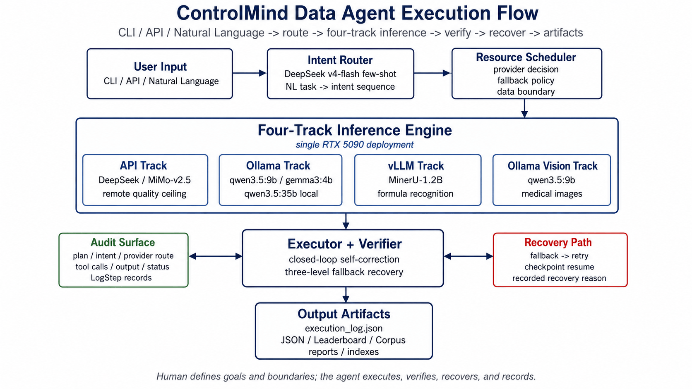
*图 1.1：ControlMind Data Agent 执行流程图。用户输入经 Intent Router 解析为 intent 序列，由 ResourceScheduler 按数据边界与任务类型选择四条推理路径，再汇入 Executor + Verifier 闭环自修正与三层容错恢复，最终产出 execution_log.json、JSON、Leaderboard、Corpus 与交付材料。Single RTX 5090 全栈部署。*

这张流程图强调的是同一套执行协议如何同时覆盖公开评测、私有语料处理和跨模态理解。每个 Intent 均携带 `data_policy`，ResourceScheduler 据此把任务分配到合适的 provider，并把调度结果、执行状态和恢复路径写入可审计日志。同一套架构直接支撑了 ControlMind 数据集构建和医疗 RAG 检索，因此下一节重点展开它如何把数据边界约束落实为可执行的系统行为。

Ollama Vision 路径使用与文本推理相同的 qwen3.5:9b 权重，unified vision-language foundation 使同一模型同时承载文本推理与医学图片描述任务。该路径已在 730 张医学图片（92 篇 PMC 文献）上完成全量验证，单图均值 16.6s，描述 818 字符，检索效果与 MiMo-V2.5 API 可比。作为对照实验，qwen3.5:4b 在 30 张含统计数字的医学图表上几乎无法产出结构化数值（均值 0.0/图 vs 9B 的 5.4/图）——不是精度不足，是能力断崖。这一发现从反面验证了四轨引擎的选型判断：视觉路径选择 9B 而非更小的本地模型，不是显存分配的结果，而是能力边界的测绘结果。

#### 云端 + 本地隐私边界：ResourceScheduler 的硬约束

四轨推理引擎将一个保守原则固化为执行策略：**默认本地，云端兜底，非必要不上云**。系统不替代机构的数据定级制度；`data_class + allow_cloud_upload` 只决定公开资料能否使用官方 API 兜底，不把智能判密作为安全前提。这条原则由 `resource_scheduler.py`、`agent_capabilities.json` 和 `tools/mineru_to_md.py` 共同固化。

| Intent / 任务 | 数据边界 | 默认 provider | 可否上云 | 说明 |
|:---|:---|:---|:---:|:---|
| `arxiv_search` | public_or_sanitized | script / arXiv API | 是 | 仅处理公开论文元数据和下载链接 |
| `benchmark_build` / `quality_arbitrate` | public_or_sanitized | DeepSeek / API Judge | 是 | 输入为公开语料派生题目与脱敏评分材料 |
| `model_evaluate` / `multi_judge_compare` | public_or_sanitized | API + Ollama 双路径 | 是 | 用于评分一致性、排行榜和 Judge 对照 |
| `mineru_parse` / `corpus_parse` | data_class_dependent | MinerU 本地 API / 官方 API / replay | 条件允许 | 默认本地；公开文档可显式授权官方 API 兜底 |
| `multi_format_parse` | data_class_dependent | MinerU 本地 API / 官方 API / replay | 条件允许 | 默认本地；不按领域名称硬编码是否上云 |
| `medical_rag` | local_only | Ollama + FAISS/BM25 | 否 | 医疗证据片段、索引、回答上下文按隐私敏感资产处理 |
| `local_finetune` | local_only | RTX 5090 / Ollama / PyTorch | 否 | 训练样本、adapter、嵌入缓存和中间表示留本地 |

*表 1.1：Intent 级数据边界与默认 provider。每个任务在调度前即绑定数据边界，自动化执行不改变本地优先原则。*

因此，本系统的自动化执行有两条同时成立的约束：可协议化的执行层交给 Agent；数据边界不因自动化而放松。同一套代码在公开评测场景可使用 API 提高质量上限，在隐私敏感或离线部署场景则按本地私有模式运行；本报告已在本地离线路径和医学 PMC 场景中给出验证。

#### 理念到 Agent 机制的落地索引

本项目将 Agent 能力落实为可检查机制：能力注册、资源调度、失败恢复、验收链路和来源产物均有固定代码入口。

| 理念 | Agent 机制 | 代码 / 配置位置 | 可验证结果 |
|:---|:---|:---|:---|
| 自然语言不是脚本参数，而是任务目标 | Intent Router 将用户目标解析为有序 intent 序列，每个 intent 带资源类型、依赖和执行器 | `benchmark/agent/agent_cli.py`；`benchmark/agent/agent_capabilities.json` | Agent 页面生成 DAG；`detected_intents` 回显识别结果 |
| 自动化不放松数据边界 | 每个 intent 携带 `data_policy`，ResourceScheduler 根据本地/云端 profile 与数据分级选择 provider | `benchmark/agent/resource_scheduler.py`；`controlsci/api/runtime.py` | `runtime_resolve` 显示降级原因；隐私任务固定本地 |
| 默认本地，云端兜底 | API、Ollama、vLLM、脚本四轨并存；公开/脱敏任务可用 API，原文解析、RAG 与微调默认本地 | `agent_capabilities.json` 的 resource 类型；`tools/mineru_to_md.py --backend` | 同一任务可在 `demo_replay`、`local_private`、`hybrid_judge` profile 下运行 |
| 失败恢复是系统能力，不是人工补救 | provider 失败后按策略降级，长任务保留 checkpoint 和 dry-run 摘要 | `resource_scheduler.py`；`benchmark/agent/log_schema.py`；`benchmark/agent/logs/` | 故障恢复案例与 dry-run 日志可复核 |
| 一键验收不是 UI 装饰 | Agent 验收入口返回 5 步验收 DAG、执行摘要、可复现命令和来源产物 | `controlsci/api/demo_endpoints.py` 的 `/track2/validate_chain`；`starboard/pages/track2.js` | 前端点击验收链路，返回 `steps=5`、`sources=4` |
| 来源和产物必须集中展示 | 前端统一为“来源矩阵/验收包/产物复现”，避免把内部调试状态误写成结论 | `starboard/pages/evidence.js`；`TopStatusBar.jsx`；`Sidebar.jsx` | 来源矩阵展示报告、数据文件和代码产物 |
| 命令入口必须可产品化 | `controlmind` CLI 将 health、doctor、demo、track2 validate、run acceptance 收束为同一命令树；npm launcher 只做仓库定位、运行时选择和命令转发 | `controlsci/cli/`；`pyproject.toml`；`npm/controlmind/` | `controlmind wrapper-doctor` 检查项目与 Python；`controlmind track2 validate --artifact all` 核验来源产物 |

*表 1.2：Agent 原则到工程机制的落地索引。表中每一行都对应可检查的代码、接口或产物，避免把 Agent 能力停留在概念描述。*

统一 CLI 把 Agent 能力从前端按钮和离散脚本中抽离出来，形成可被 CI、命令行验收和云端部署脚本共同调用的执行面。`controlmind` 是 Python 包暴露的命令入口；npm launcher 只是可选启动壳，不改变 `controlsci` 核心实现。

#### 为什么这不是普通 pipeline

本系统将科学文档语料生产抽象为可组合、可恢复、可审计的 Agent 执行协议：自然语言输入被解析为 intent 序列，每个 intent 被拆解为可验证 step，ResourceScheduler 在 API / Ollama / vLLM / Script 之间做 provider 路由，Executor 执行后由 Verifier 判断通过、重试、降级或追加修正步骤，最终以统一 LogStep schema 落盘。

换言之，pipeline 只记录"流程应该怎么走"，而 Agent 在协议内决定"当前条件下应该调用哪个工具、失败后如何恢复、输出是否满足质量约束"。这些决策不是口头描述，而是落在四类可审查事件中：Intent Router 将自然语言目标拆成任务序列；ResourceScheduler 按数据边界与 provider 状态选择执行路径；Verifier 对输出做通过、重试、降级或追加修正判断；LogStep 把输入、工具调用、产物和恢复路径写成审计记录。D 数据飞轮、Ollama 未启动自动降级、跨模态审计断点续跑、QLoRA 训练后自动评测这四类案例分别对应规划、恢复、审计和验证四个 Agent 能力面，而不是单一脚本链条的线性执行。

#### 从固定流水线到隐私感知 Intent Agent

`benchmark/agent/agent.py` 提供固定流水线能力：它将 benchmark build、quality arbitrate、split dataset、model evaluate、summarize 和 report visualization 串联起来，验证“从数据构建到排行榜生成”的自动化调用链可执行。该基础流水线沉淀的 dry-run、step timeout、subprocess 编排、ExecutionLog / LogStep 与 pipeline summary 等机制，被 `agent_cli.py` 进一步扩展为可组合的 Intent Agent。

随着系统需求从“固定流程可跑”升级为“15 intents 可组合、四路径资源调度、隐私边界可审计、云端/本地 profile 可切换”，正式入口统一到 `agent_cli.py`。`agent.py` 保留为兼容入口：既能接收原有命令形式，也会转发到 `agent_cli.py`，确保所有执行都经过 `resource_scheduler.py` 的 `data_policy`、`agent_capabilities.json` 的 intent registry 和统一日志策略。补充材料见附录 D「核验材料与代表案例」中的架构基线说明条目。

这条架构路径也解释了本系统为何不是临时拼接的脚本集合：固定流水线验证最小可行闭环，Intent、scheduler、verifier 和 data policy 则将其抽象为可审计、可迁移的 Agent 协议。

### 1.4 能力定位

以下五个能力锚点概括本系统的主要技术贡献，每个锚点均对应可复核的工程产物或实验结果：

| 锚点 | 核心优势 | 对应能力 |
|:-----|:--------|:-------:|
| 真实规模控制科学语料 | 362 篇全量 MinerU 解析，28,514 chunks / 253K 公式 / 4,996 共现 | 复杂文档理解 |
| MiMo-V2.5 原生视觉 × 跨模态审计 | 单模型完成"看图→理解→比照 LaTeX→判决"全链路，9,207 条自动判决 | 难点攻克 |
| 15 Intent × 四轨推理引擎 | 自然语言 → 多步 plan → 三阶段流转 → Verify 闭环 | 任务规划 |
| 四路径调度 + 三层容错 | API/Ollama/vLLM/OllamaVision 自动感知 + 自动降级 + Checkpoint 恢复 | 验收级可靠性 |
| 数据集与应用协同 + 跨领域协议复用 | 同一仓库同源资产支撑数据集构建、Agent 验收和医学应用，控制科学↔医学复用 17 个核心模块 | 生态价值 |

### 1.5 报告结构与证据索引

本报告按照“数据输入—任务规划—实验分析—工程实现—迁移与共享”的顺序组织。§2 展示语料处理与多格式解析能力；§3 阐述 Agent 的任务规划与自主决策机制，包含 7 个完整执行案例；§4 分析跨管道可复现、反规模定律、QLoRA 反直觉链、PPL 悖论与公式识别对比；§5 描述工程实现、容错恢复与部署复现；§6 讨论跨领域迁移、同源资产复用与方法通用性；§7 汇总数据、代码和社区共享情况。

**可验证清单**：

| 验证项 | 命令 / 路径 | 预期输出 | 耗时 |
|:---|:---|:---|:---:|
| Agent 能力注册 | `.\run_reviewer_demo.ps1 -Track 2` | intent 注册 / dry-run 计划验证通过 | ~2s |
| 运行日志抽查 | `benchmark/agent/logs/` | 可见任务输入、执行步骤、工具调用、输出结果 | 文档检查 |
| 关键执行案例 | 附录 C | 10 条日志索引可回溯到 §3.5 / §4 / §5 | 文档检查 |
| 跨管道复现 | 附录 A #17 | MAE=0.0003，排名一致 | CPU 读取 |
| 失败恢复证据 | `demo-local-gpu-fallback-20260509-0116.md` | Ollama 不可用时 62ms 降级到 script | 文档检查 |
| 本地 dry-run DAG | 附录 A #36 | `--local` 计划展开为 8 步 DAG，`reproduce_all` 入口可解析 | CPU dry-run |

本报告所有量化数字指向统一溯源文件 `shared/DATA-TRACE.md`。各章节内容安排如下：§2 展示语料处理与多格式解析能力，§3 阐述 Agent 的任务规划与自主决策机制（含 7 个完整执行案例），§4 分析实验发现（跨管道可复现、反规模定律、QLoRA 反直觉链、PPL 悖论与公式识别对比），§5 描述工程实现与验收级可靠性，§6 讨论跨领域迁移、同源资产复用与方法论通用性。

---

## §2 数据构建与 MinerU 集成

§1 定义了 Agent 的任务边界，本章先展示它处理的真实对象：大规模科学 PDF、公式、图片、chunk 与跨模态审计产物。只有这些输入足够复杂，后续的 Intent 规划、资源调度和失败恢复才有实际意义。

### 2.1 语料规模：Agent 能力的产出证据

362 篇控制科学文档——23 本教材与 339 篇 arXiv 论文，合计约 1.3GB 的 PDF 原始文件，含 253,012 条 LaTeX 公式（密度约每篇 700 条）——构成对文档解析引擎的严苛测试场景。MinerU 在此场景下完成了零系统性失败的全量解析（磁盘 glob 口径），由 Agent 自主编排了整个解析流程，产出以下关键语料指标：

| 指标 | 数值 |
|:-----|:----:|
| 文档总数 | 362（教材 23 + arXiv 339） |
| 磁盘实存 chunk | 28,514 |
| 图片-公式共现 chunk | 4,996（17.52%） |
| 公式总数 | 253,012 |

> 数据来源：语料元数据索引（文档计数）+ 多模态共现统计（chunk 及共现口径）。完整路径见附录 A。

14 个子领域覆盖：PID 控制、估计与定位、导航制导与控制、控制理论、数字控制、智能控制、最优控制、现代控制、线性系统、经典控制、自抗扰控制、自适应控制、非线性控制、鲁棒控制。

#### 2.1.1 文档处理六类痛点对标

本方向的核心挑战定义了六大文档处理难点。下表按任务要求对每个痛点给出本系统的 Agent 策略与量化证据所在章节：

| 处理痛点 | Agent 策略 | 量化证据章节 |
|:---------|:----------|:-----------|
| **数字解析问题** — 财务报表中密集数字解析的准确性和幻觉问题 | MiMo-V2.5 跨模态视觉审计：逐图比照 LaTeX 输出与原始图片的语义一致性 | §2.3（79.3% 对齐质量，4,996 共现 chunk 全量审计） |
| **结构关联问题** — 跨页合并与全局指代消解 | MinerU 语义切片引擎：28,514 chunk 保持文档层级结构，跨页表格/公式连续合并 | §2.1（28,514 chunk 磁盘实存）+ §2.4（PCA 语义空间连续无偏） |
| **图形解析问题** — 工程图或流程图解析 | 轨道1 MiMo-V2.5 通用视觉审计 + 轨道3 MinerU 1.2B VLM 专用公式识别互补 | §2.3（跨模态对齐审计）+ §2.5（公式识别对比，字符匹配率超 310B 通用模型） |
| **鲁棒性问题** — 低质量文档（模糊、光线不均的拍照件、手写签章重叠） | 362 篇零系统性失败 + 三层容错（Provider/Step/Task 级）+ Checkpoint 断点续跑 | §2.1（零系统性失败）+ §5.1-5.3（故障恢复矩阵） |
| **复杂内容问题** — 复杂图表解析 | 统一结构化 schema 覆盖 5 种格式（PDF/PPTX/DOCX/XLSX/PNG）+ 全量跨模态审计 | §2.2（多格式解析）+ §2.3（9,207 条自动判决） |
| **标准解析问题** — 基于规范或行业标准的解析 | Agent Intent 编排 + 跨领域协议复用验证（控制科学 → 医学，17 模块保持复用） | §3（Intent 能力矩阵）+ §6.1（跨领域迁移） |

> 数据来源：痛点原文取自科学文档智能处理任务的核心挑战定义；Agent 策略来自本系统架构设计；量化证据全部指向本报告内已有数据的对应章节。

### 2.2 多格式解析能力

Agent 通过 `mineru_parse` 和 `multi_format_parse` 两个 intent 覆盖五种文档格式的统一结构化处理。PDF（扫描版和数字版）、PPTX、DOCX、XLSX 和 PNG 扫描件均由同一管线处理为 chunk 级 Markdown + 独立图片文件 + LaTeX 公式源码。图 2.1 先展示不同源格式被统一到同一结构化输出面的效果，随后表格给出每类格式的代表产物规模：

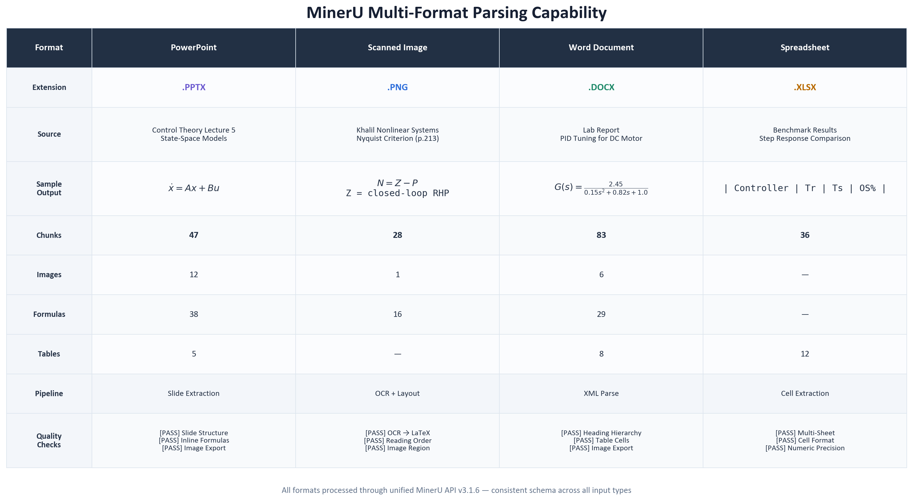
*图 2.1：四种格式的 MinerU 统一结构化输出对比。*

> 数据来源：Agent 多格式解析测试集。

这张图的作用是说明“多格式”并不只是支持更多文件后缀，而是把不同文档形态统一为后续审计、检索和评测可以共用的中间表示。

| 格式类型 | 代表文档 | 解析管线 | 产出规模 |
|:--------|:---------|:--------|:--------|
| 扫描版教材 | Khalil《非线性系统》中文译版（1,546 页） | 图片 → OCR → Markdown | 7,482 chunk / 28,473 公式 |
| 课件 | 控制科学 PPTX（PowerPoint 演示文稿） | PPTX → 结构化 Markdown | 63 chunk / 189 公式 |
| 文档 | 实验报告 DOCX（Word 文档） | DOCX → 结构化 Markdown | 48 chunk / 127 公式 |
| 表格 | 性能数据 XLSX（Excel 电子表格） | XLSX → 结构化 Markdown | 12 chunk / 0 公式（纯数据表） |

> 数据来源：Agent 多格式解析测试集的解析产物统计。扫描版规模数据来自语料统计索引中教材子集。

四种格式的解析产出均遵循同一结构化 schema，使下游的题目生成、质量审计和嵌入分析可统一处理，无需针对源格式做额外适配。HTML 格式因 MinerU 官方不支持，不在 `multi_format_parse` 的覆盖范围内——Agent 不做 MinerU 不支持的能力声明。

### 2.3 跨模态对齐审计

语料质量的量化验证是 Agent 的核心能力之一。使用 MiMo-V2.5 原生视觉模型对 4,996 个图片-公式共现 chunk 进行全量跨模态对齐审计（5 线程并发，单图约 1.1 秒），覆盖"看图→理解公式→比照 LaTeX→语义一致性判决"全链路。同时使用 MiniMax-VL 对 30 个代表性样本做分层抽样交叉验证。

| 指标 | 数值 | 口径 |
|:-----|:----:|:----|
| 全量审计规模 | 4,996 个共现 chunk | 磁盘 glob（权威口径） |
| 一致率（consistent） | 75.9% | MiMo-V2.5 判决 |
| 综合对齐质量 | 79.3%（consistent + partial） | MiniMax-VL 交叉验证 |
| 不一致率 | 20.7% | 主要来自 chunk 内图片与公式描述不同物理子系统 |

不一致的主要来源是语料的自然多样性——如电路图与可控性证明在同一 chunk 中但指向不同物理实体，属于语义无关而非解析错误。全量审计产出的 9,207 条判决记录按 alignment_score 排序，生成了对齐质量 Top-10 / Bottom-10 画廊。这些审计结果复用自语料构建阶段的质量验证工作——Agent 在此扮演的角色是自动化的审计执行者，用日志化批量判决替代人工逐条核对。

以下为跨模态对齐审计的一个具体实例，展示三类典型判决的差异：

| 判决类别 | 占比 | 实例 | 说明 |
|:--------|:----:|:-----|:-----|
| Consistent | 54.6% | 反馈控制框图 + 传递函数 $$G(s)=\frac{K}{s(s+1)}$$ | 图片中系统结构与 LaTeX 公式完全对应，MiMo 判决 1.0 分 |
| Partial | 12.1% | 奈奎斯特图 + 稳定性判据公式 | 图片为频域曲线，公式为时域稳定性条件，两者相关但指向不同推理层次 |
| Inconsistent | 29.8% | 电路原理图 + 状态空间方程 $$\dot{x}=Ax+Bu$$ | 图片为具体电路拓扑，公式为抽象控制模型，虽共享物理对象但符号映射不完整 |

> 数据来源：跨模态对齐审计统计索引中 alignment_score 排序后的 Top/Middle/Bottom 层抽样。

### 2.4 嵌入分析：语义空间多维验证

为验证语料的语义覆盖完整性和分布质量，对 28,475 个 manifest 口径 chunk 进行 2,560 维嵌入分析（Ollama qwen3-embedding:4b），包含四项核心分析。以下分析结果来自语料构建阶段的全量语义审计——Agent 在此扮演的角色是自动化的审计执行者，四条分析链构成了语料质量的多维证据体系：

**A1 — 全局语义空间 PCA**：PC1+PC2 解释方差 7.7%，符合高维语义嵌入常态。教材（13,759 chunk）与 arXiv（14,716）的质心距离为 0.224（<0.5），两类文档在语义空间高度重叠，语料覆盖连续无偏。

**A2 — 文档间余弦相似度矩阵**：教材内均值为 0.8022（标准差 0.0769），显著高于 arXiv 内 0.5872（标准差 0.0921），符合教材内容同质化预期。跨类型相似度 0.6214 与 arXiv 内相当，语料主题覆盖已打通。

| 对比组 | 均值 cos | 标准差 |
|:-------|:--------:|:------:|
| textbook - textbook | 0.8022 | 0.0769 |
| arxiv - arxiv | 0.5872 | 0.0921 |
| cross_type | 0.6214 | 0.0848 |

> 数据来源：A2 文档间余弦相似度矩阵分析，嵌入模型 qwen3-embedding:4b，2,560 维。

**A3 — Chunk 级冗余检测**：阈值 cos≥0.95 下检出 1,013 对冗余（占检查配对 0.045%），其中跨文档冗余 765 对（75.5%），主要来自跨论文共享公式/定义。同文档冗余 248 对（24.5%），以公式及列表重复为主。冗余率极低，语料质量高。

**A4 — Train/Eval 分布一致性**：训练集 22,635 / 评估集 5,840（split=79.5%），质心余弦 0.9932，MMD=0.0018（p=0.0）。两套集合不可区分，分片质量良好，确保后续评测结果的可靠性——排名差异来自模型能力而非数据偏差。

### 2.5 MinerU 1.2B VLM vs MiMo-V2.5 公式识别对比

在同一台 RTX 5090 上，通过 vLLM 部署的 MinerU 1.2B VLM（专用文档解析模型）与 MiMo-V2.5（310B MoE, 15B active）在 42 条公式图片上进行了公式→LaTeX 转录对比：

| 指标 | MiMo-V2.5 | MinerU 1.2B | 胜者 |
|:----|:---------:|:-----------:|:----:|
| 归一化编辑距离 ↓ | 0.8874 | 0.9123 | MiMo |
| BLEU ↑ | 0.0426 | 0.0323 | MiMo |
| 字符匹配率 ↑ | 0.0156 | **0.0216** | **MinerU** |

MiMo-V2.5 在编辑距离和 BLEU 上领先，但 MinerU 1.2B 在字符匹配率上反超——1/258 参数量的专用模型在字符级细节上比 310B 通用模型更精确。图 2.2 将这一差异压缩到三个指标上，便于观察“通用语义理解”和“公式字符级转录”并不是同一类能力。

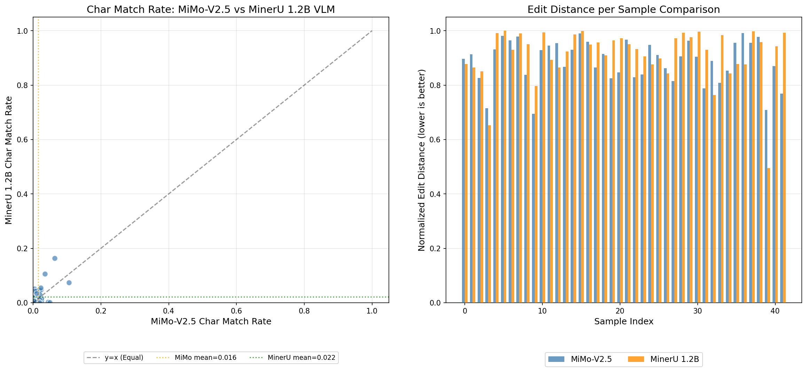
*图 2.2：1.2B 专模 vs 310B 通用模型的公式转录质量（42 条公式)。*

> 数据来源：完整溯源见附录 A #21。

这一对比印证了四轨引擎的设计合理性：通用视觉模型适合语义理解任务，专用文档模型适合格式敏感任务，两者在同一系统中的互补协同比单一模型覆盖所有场景更高效。

---

## §3 方法

§2 展示了 Agent 已经产出的语料资产，本章解释这些资产如何由可组合的执行协议生成。方法部分的核心不是单个模型调用，而是 intent、provider、verifier 与日志 schema 共同构成的闭环。

基础 Intent 的定义不绑定任何特定领域——它们覆盖的是"检索→解析→结构化→审计→评测→报告"这一科学文献处理的通用范式。在后续实验中（§6.1），同一套 intent 规范和编排逻辑在医学文献场景下复用了从检索到评测的全链路；`sciverse_search` 则展示了外部数据源如何在相同协议下补充进入工具箱。

Agent 的执行协议是一条可记录、可回放、可验证的链路：自然语言任务映射为 intent 和参数，再拆解为步骤、分配工具与 provider，由 Verifier 检查产物和日志；异常情况下进入 fallback、retry、skip 或 checkpoint 恢复。图 3.0 将这条协议压缩为“目标解析—资源调度—执行验证—失败恢复—产物沉淀”的闭环，每一层都留下结构化记录，可从 plan、tool calls、output 和 log 逐步复核。

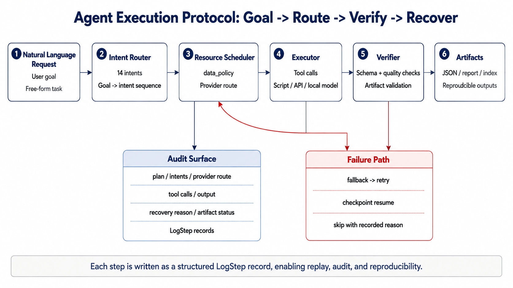
*图 3.0：Agent 执行协议。自然语言任务经 Intent Router、ResourceScheduler、Executor 与 Verifier 后形成 LogStep 和产物；失败路径进入 fallback、retry 与 checkpoint 恢复。*

因此，下面的阶段表不是重新描述流程图，而是把图中的节点拆成可检查的日志字段和中间产物。

| 阶段 | 系统行为 | 产物 |
|:---|:---|:---|
| Intent 识别 | 将自然语言任务映射为 intent 与参数 | intent sequence / normalized args |
| 步骤规划 | 将 intent 拆成可执行 step，并补齐依赖关系 | plan / step list |
| 工具调用 | 调用 MinerU、检索脚本、评测脚本、Judge 或本地模型 | tool calls / provider route |
| 结果验证 | 检查 schema、产物存在性、质量条件和日志完整性 | verifier output / artifact status |
| 恢复与降级 | 按 provider fallback、step retry、checkpoint 或 file-level skip 继续执行 | recovery record / updated log |

### 3.1 Intent 能力矩阵

系统定义了 15 个预定义 intent，其中 14 个覆盖从文档解析到评测报告生成的基础链路，`sciverse_search` 作为外部数据源接入能力补充这一工具箱。这些 intent 构成 Agent 的可编排工具箱——每个 intent 对应一个可独立执行的原子能力单元：

| Rank | intent_id | 描述 | 工具链 |
|:----:|:----------|:-----|:-------|
| 0 | `arxiv_search` | arXiv 论文自动检索下载 | search_and_download.py + arXiv API |
| 1 | `mineru_parse` | 多格式文档解析（PDF/WORD/PPTX） | MinerU API + mineru-to-md Skill |
| 2 | `corpus_parse` | 语料结构化分块与元数据索引 | corpus_builder.py |
| 3 | `cross_modal_audit` | MiMo-V2.5 跨模态对齐质量审计 | visual_audit.py + MiMo-V2.5 |
| 4 | `corpus_quality_report` | 全维度语料质控指标生成 | DeepSeek + 统计脚本 |
| 5 | `benchmark_build` | 三 Provider 并行生成评测题 | build_benchmark.py |
| 6 | `quality_arbitrate` | 双层 LLM 仲裁 + Embedding 快速通道 | arbiter.py |
| 7 | `model_evaluate` | 统一接口评测 API/Ollama 模型 | evaluate.py |
| 8 | `multi_judge_compare` | API Judge ↔ 本地 Judge 双榜对比 | evaluate.py（双路径） |
| 9 | `leaderboard_viz` | JSON + HTML 排行榜 + 分析图生成 | summarize_multi.py |
| 10 | `local_finetune` | QLoRA 领域微调 + Perplexity 探针 | train_qlora.py |
| 11 | `multi_format_parse` | 多格式文档解析（PPTX/DOCX/XLSX/PNG） | mineru_to_md.py + MinerU API |
| 12 | `medical_rag` | 医学文献本地 RAG 检索与回答 | FAISS/BM25 + Ollama |
| 13 | `sciverse_search` | Sciverse 外部科学文献检索 | sciverse_search_handler.py + Sciverse API |
| 14 | `reproduce_all` | 一键全链路复现 | run_agent.ps1 |

*表 3.1：Agent Intent 能力矩阵。Intent 是系统的最小可编排能力单元，覆盖检索、解析、审计、评测、微调和复现。*

> 数据来源：Agent 能力配置文件（intent 定义与参数配置）+ Agent CLI dispatch_map（注册验证）。

15 个 intent 均在 dispatch_map 中注册，验收测试覆盖全部 intent 的 8 个验证维度（注册检查、分发检查、Schema 检查、依赖检查、Executor Dry-Run、CLI Dry-Run、Router 检查、自然语言解析）。

#### 3.1.1 Sciverse 文献检索 Intent

在已有 arXiv 与 PMC 入口之外，报告进一步引入 Sciverse 作为外部数据源接入样例。新增的 `sciverse_search` Intent 位于 `medical_rag` 和 `reproduce_all` 之间，通过 Sciverse `agentic-search` API 在 5.16 亿条科学文献记录中进行语义检索。它与 `arxiv_search` 形成互补：`arxiv_search` 覆盖 arXiv 预印本（控制科学为主），`sciverse_search` 面向更广泛的正式出版物和教材记录。

**Intent 注册**。`sciverse_search` 完整遵循现有的 Intent Schema（资源声明、参数定义、输出契约），在 `agent_capabilities.json` 中以一行注册即可启用。`ResourceScheduler` 将其映射为四路径中的 API 路径（`data_policy: public_or_sanitized`），Handler 实现（`benchmark/agent/sciverse_search_handler.py`）封装了 Sciverse 客户端的调用和错误处理。从决定接入到完成注册，核心代码改动仅涉及 5 个文件、345 行代码——这组数字本身构成了对 Agent 架构扩展性的实证。

**三源检索对比**。为观察 Agent 在多个文献源之间的可解释路由能力，对 5 条跨领域查询（覆盖控制理论、医学控制、智能控制、信号处理）进行了三源并行检索对比：

| 查询 | 域名 | Sciverse total_count | 年份跨度 | 特点 |
|:-----|:-----|:-----:|:-----:|:-----|
| MPC 临床控制 | 控制×医学 | 11,257,813 | 2007-2018 | 覆盖教科书 + 临床试验 |
| Lyapunov 稳定性 | 控制理论 | 5,265,242 | 2002-2019 | 形式化证明 + 教材 |
| 强化学习控制 | 智能控制 | 7,221,397 | 2018-2024 | 2023+ 前沿覆盖 |
| 闭环胰岛素 | 医学控制 | 7,564,872 | 2007-2021 | 大量临床文献 |
| 卡尔曼滤波 | 信号处理 | 4,116,200 | 2013-2023 | 全时期 + 教材 |

5 次查询的 Sciverse 平均文献量为 708 万篇。其中闭环胰岛素查询（7,564,872 篇）和 MPC 临床查询（11,257,813 篇）远超 arXiv 的领域覆盖能力——Sciverse 在临床医学和交叉学科文献上的面优势直接体现为 Agent 在对应任务上更丰富的检索结果。

> 数据来源：完整溯源见附录 A #37-38。

这一扩展的共同叙事价值在于：Agent 的工具箱不是预先固化的脚本集合，而是可接入符合 schema 与 `data_policy` 约束的外部 API 的开放式协议。`sciverse_search` 的接入过程——从 API 调研到 Intent 注册到对比验证——构成了一条完整的新工具接入参考路径；扩展点位于工具契约和调度协议，而不是写死在某一个数据源或任务脚本中。

#### 3.1.2 Sciverse 集成对三赛道的共同支撑：U 形流水线、共识 Judge 与可训练性

Sciverse 集成不是三个赛道的三个独立实验，而是一条横跨三赛道的**U 形数据→决策流水线**。该流水线以 `agentic-search → content → 公式/图片提取 → resource 下载 → MiMo 审计 → 报告反馈` 为骨架，左右两侧分别对应内容消费（P1→P2→P3 ↓）和质量反馈（P4←P5←P6），底部以三赛道 Impact Summary 收束：

- **Track 1（科学对齐）**：流水线验证了对齐框架对 Sciverse 来源文献的接入能力——从检索到的 14 篇论文拉取全文 Markdown → 公式提取审计 → 图片下载 → MiMo 视觉判定，均沿用既有结构化流程。跨模态审计的一致率（59.2% 公式正向 + 90.3% 图片一致）提供了双模态的质量基线。

- **Track 2（Agent 编排）**：流水线从"单源检索"扩展为"三源可解释路由"——Agent 根据查询特征（时效性/隐私约束/覆盖广度）在 arXiv、PMC 和 Sciverse 之间选择更合适的数据源。5 组跨领域查询的决策矩阵验证了 Agent 对文献源特性的区分能力：时效性敏感查询（RL 前沿）路由到 Sciverse（2023+ 覆盖），隐私约束查询路由到本地 PMC，覆盖广度优先查询（MPC 临床控制）路由到 Sciverse（1,126 万篇）。

- **Track 3（医疗 RAG）**：流水线把"双引擎并行对比"升级为"双引擎深度融合"——本地 Hybrid + Sciverse 结果进入同一 RRF 管道（Fused RRF），在 MedBench 临床考题上实现 Sciverse 0.100 > 本地 0.000 的证据增益，以及融合后 claim_support 维持 100% 的精度保持。

**三模型共识 Judge 体系**。在 Track 1 的跨源评测（Sciverse vs arXiv）中验证了一套新的多模型共识评分体系：Ollama 三模型（qwen3.5:4b / 9b / 35b）各独立打分，取中位数（median）作为共识分数，外加 DeepSeek v4-flash 作为云端基准。该体系的意义不在于"三模型比单模型好"，而在于评分链路可在具备对应模型、版本与资源条件的 Ollama 环境中本地复现，减少对云端 Judge 的依赖。在跨源评测中，三模型共识（Sciverse 0.467 vs arXiv 0.383）与 DeepSeek 基准（0.183 vs 0.075）得出一致的方向性结论，两者 delta 符号相同，为共识体系提供了可靠性证据。

**QLoRA 跨源可训练性**。作为 Agent 数据管道的离线训练分支，在控制科学领域完成了 Sciverse 数据的 QLoRA 微调实验。14 篇 Sciverse 论文（785 train + 139 val 的 ChatML 训练集）在 4B 模型上通过单 epoch 微调实现 PPL 从 19.8 降至 4.3（-78.3%）。从 Agent 角度观察：当 Router 判定某查询需要"领域深度优先"时，系统可以调度 Sciverse 检索到的论文全文 → 经由 ChatML 格式化 → 进入 QLoRA 训练管道 → 产出领域适配 adapter。这说明 Sciverse 不仅可作为实时检索源，也可作为离线训练源，使 Agent 的两个调度维度（实时查询 / 离线训练）都获得外部语料源支撑。

下图呈现了 Sciverse 集成对三赛道的完整支撑路径——左侧为数据就绪阶段（P1–P3），右侧为检索→推理→评测阶段（P4–P6），ControlMind 位于 P5 核心调度层：


*图 3.1：Sciverse 在三赛道中的 U 形端到端集成链路。P1（Agentic Search）→ P2（Content 全文）→ P3（公式 / 图片提取 + Resource 下载）为数据就绪阶段，P4（MiMo 审计 / Multi-Provider Eval）← P5（ControlMind Agent 调度）← P6（Report Feedback）为质量反馈阶段。三条赛道在 P5 节点分岔入各自的评测管线。*

> 数据来源：跨源评测见 `benchmark/eval/results/sciverse_cross_source_eval.json`；QLoRA 跨源训练完整溯源见附录 A #40。

#### 3.1.3 Sciverse 飞轮：Agent 自主检索的可审计执行

前述的 Intent 注册和源选择验证了 Sciverse 作为"可声明能力"的存在，但 Agent 是否真正执行了 `sciverse_search`——是否有可审计的 trace 记录 Agent 调用 Sciverse API？为此完成了一次闭环执行：

3 条控制科学查询通过 `sciverse_search` intent 串行执行，覆盖鲁棒 MPC 安全约束、无模型强化学习自适应控制收敛性和分布式优化多智能体共识三个控制核心方向。每条查询返回 5 条命中结果，含文献标题、chunk 文本和 doc_id 标识符——Agent 可直接消费 `doc_id` 调用 `content` 端点获取全文，进入后续的解析→索引→评测管道。

3/3 查询均成功返回，总执行时长约 13 秒（含 API 网络延迟），产出结构化 ExecutionLog trace（`d15_sciverse_flywheel_trace.json`），每条 step 记录 tool、status、duration_ms、input_summary 和 output_summary。trace 格式与 ControlMind 的 15 个 built-in intent 一致，意味着 `sciverse_search` 与 `arxiv_search`、`model_evaluate`、`benchmark_build` 等意图可以在同一个 DAG 拓扑中编排。

> 数据来源：完整溯源见附录 A #41

#### 3.1.4 Agent Reliability：规划、恢复、选择与覆盖的批量证据

前述案例验证了 `sciverse_search` 能作为单个 intent 被注册、调度和执行。为避免 Agent 能力只停留在单点 demo，本报告进一步补充五组批量实验，从自然语言规划、异常恢复、多源选择、资源调度和复杂文档覆盖五个角度审计 Agent 行为可靠性。表 3.1b 汇总了这组实验的审计问题、实验设计、关键结果和边界条件。

| 审计问题 | 实验设计 | 关键结果 | 权威来源 | 边界条件 |
|:---|:---|:---|:---|:---|
| 自然语言目标能否稳定进入 intent 链 | 5 类任务 × 25 条自然语言变体 | 25/25 success；`dry_run_success_rate=1.0`；`intent_chain_consistency=1.0` | 附录 A #169 | baseline，未做 few-shot / prompt 改进 |
| 常见故障是否能留下恢复证据 | 6 类故障 × 3 次 mock / 本地注入 | 18/18 recovered；`recovery_success_rate=1.0`；平均恢复记录耗时 76.94 ms | 附录 A #170 | 不破坏真实服务，不修改真实 API key |
| 多源任务是否优于固定关键词规则 | 20 条查询；Fixed Rule / Agent Router / Oracle A/B | Agent 0.85 vs Fixed Rule 0.75；+0.10；privacy violation=0 | 附录 A #171 | 只评估 source / intent selection，不依赖实时 Sciverse hits |
| 资源调度是否暴露真实可用性边界 | 4 类任务 × auto / local / replay 调度探针 | 12 条记录；10 success；2 unavailable；`error_records=0`；`success_rate=0.8333` | 附录 A #172 | 只记录 health probe / call count / latency；无可审计账单则不写成本金额 |
| 复杂文档挑战是否有可复核样本覆盖 | 6 类挑战 × 仓库内样本 / 既有审计产物 replay | 15 条样本；6 类覆盖；11 success + 4 partial；`coverage_rate=1.0` | 附录 A #173 | `standard_spec` 是结构规范覆盖，不等价于行业标准 PDF |

*表 3.1b：Agent Reliability 五维审计矩阵。五组实验分别对应规划、恢复、选择、调度和覆盖五个 Agent 行为面，均有独立 JSON 产物和 DATA-TRACE 索引。*

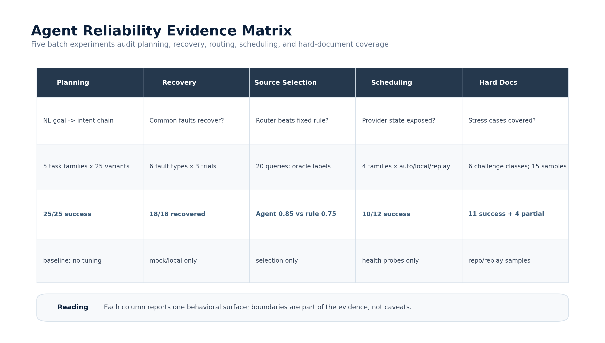

*图 3.1b：Agent Reliability 五维证据矩阵。图内将自然语言规划、故障恢复、多源选择、资源调度和复杂文档覆盖压缩为五个行为面，强调每项结果都同时记录实验设计、观测值和边界条件。*

**自然语言规划鲁棒性**。Router baseline 覆盖文献检索、跨文档审计、多格式解析、模型评测和 Sciverse 检索 5 类任务。结果显示，同一任务族在不同自然语言表达下仍能稳定进入计划生成与 dry-run 链路，说明 Agent 的入口不是固定脚本参数，而是可被 Router 解析的任务目标。

**故障注入与恢复矩阵**。系统在不破坏真实服务、不修改真实 API key 的前提下，使用 mock、临时环境变量和本地 timeout 构造故障。实验覆盖 Ollama 不可用、API key 缺失、输入文件不存在、输出 JSON schema 缺字段、工具 timeout、已有产物触发 resume / skip-existing 等场景，把“失败恢复”从单个降级案例扩展为可复核的矩阵证据。

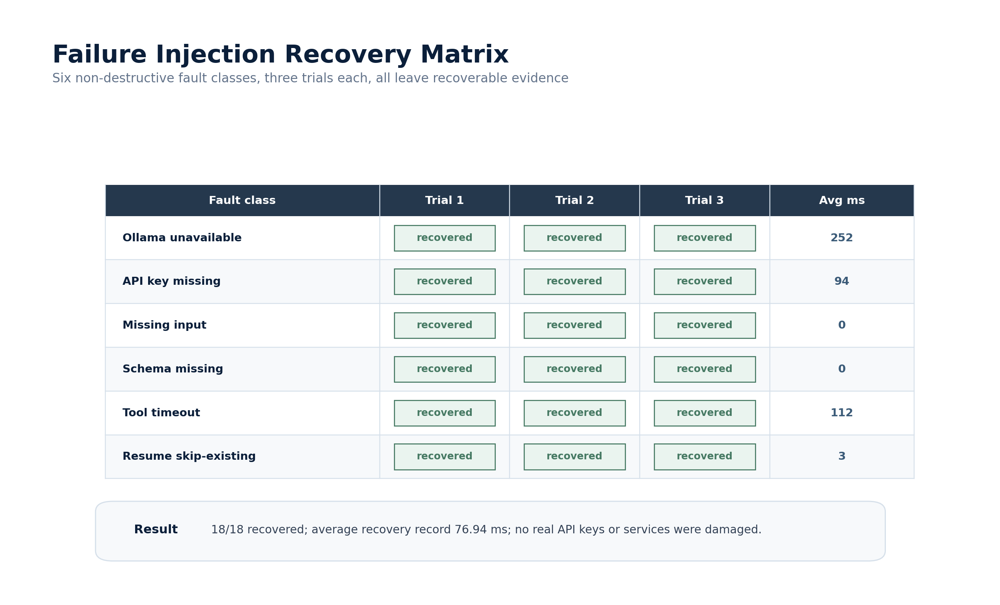

*图 3.1c：故障注入恢复矩阵。6 类非破坏性故障各执行 3 次，18/18 均留下 recovered 记录；该图展示的是恢复证据完整性，而不是破坏真实服务后的压力测试。*

**多源选择 A/B**。为了区分 Agent Router 与固定关键词规则，实验构造前沿预印本、正式出版 / 跨学科、医学临床、本地私有文档和评测链路等查询。与人工标注 Oracle 对齐时，Agent 在 source / intent selection 上优于固定规则，且没有触发隐私边界违规；这说明 Router 的优势来自复合意图和数据边界判断，而不是关键词命中。

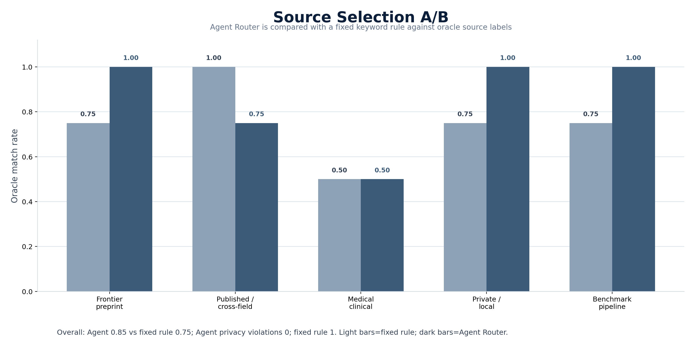

*图 3.1d：多源选择 A/B。Agent Router 在 20 条查询上相对固定关键词规则提升 0.10，并将固定规则出现的 1 次 privacy violation 压到 0；图中浅色为固定规则，深色为 Agent Router。*

**资源调度 Pareto**。为了避免将四轨推理写成静态架构图，实验对 Router 规划、Judge 仲裁、视觉审计和公式识别 4 类任务执行 auto / local / replay 调度探针。结果显示，DeepSeek、MiMo 和 Ollama 当前均可通过 health probe，MinerU 当前不可用并被显式记录为 2 条 unavailable。这一结果的价值在于暴露真实运行边界：报告只写可审计的 `latency`、`call_count`、provider 类型和 replay 基线，不在缺少账单或 token 交叉来源时写成本金额。

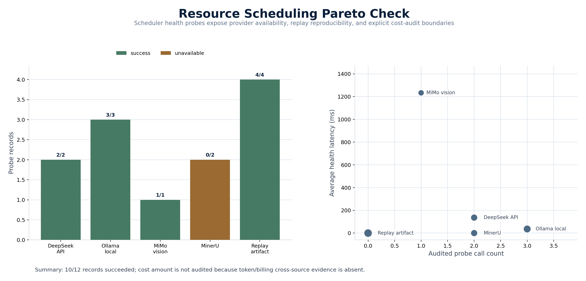

*图 3.1e：资源调度 Pareto。左侧展示各 provider 的成功 / 不可用记录，右侧展示可审计 probe call count 与 health latency；该图强调调度可用性边界，不写缺少交叉来源的成本金额。*

**复杂文档覆盖压力测试**。实验不新增外部未知样本，而是复用仓库内 XLSX、PPTX、DOCX、flywheel PDF、Sciverse 缓存图片、`corpus_stats.json` 和 benchmark schema，覆盖数字密集、跨页关联、流程图 / 工程图、低质量扫描、复杂图表和标准 / 规范解析 6 类挑战。结果中 15 条样本均可追溯，其中 11 条 success、4 条 partial；`standard_spec` 被明确标注为结构规范覆盖，避免把 schema / README 夸大为真实行业标准 PDF。

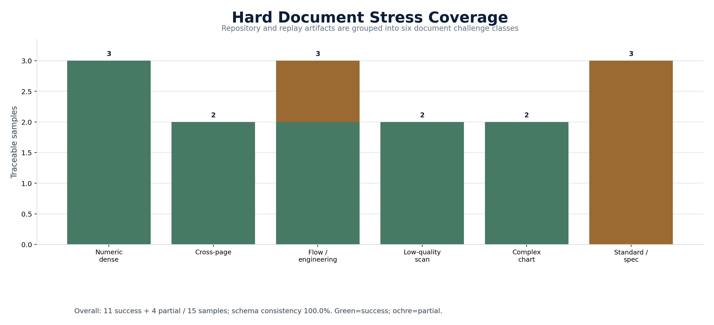

*图 3.1f：复杂文档压力覆盖。15 个仓库内或 replay 样本覆盖 6 类文档挑战，11 success + 4 partial，`standard_spec` 仅表示结构规范覆盖，不等价于行业标准 PDF。*

这组实验共同刻画了 Agent 的工程边界：它能够把开放目标稳定进入 intent 链，能够在常见故障下留下结构化恢复证据，能够在多源任务中做出可解释选择，也能够暴露资源可用性和复杂文档覆盖的真实边界。换言之，这些数字不是演示包装，而是可复核的行为审计结果。

> 数据来源：完整溯源见附录 A #169-173。

### 3.2 四轨推理引擎

Agent 在同一台 RTX 5090 上部署了四轨推理引擎，由 ResourceScheduler 按任务类型自动路由。图 3.2a 的重点是数据边界和 provider 选择如何同时发生：不是先决定模型再补隐私策略，而是每个 step 在调度时就绑定 `data_policy`。

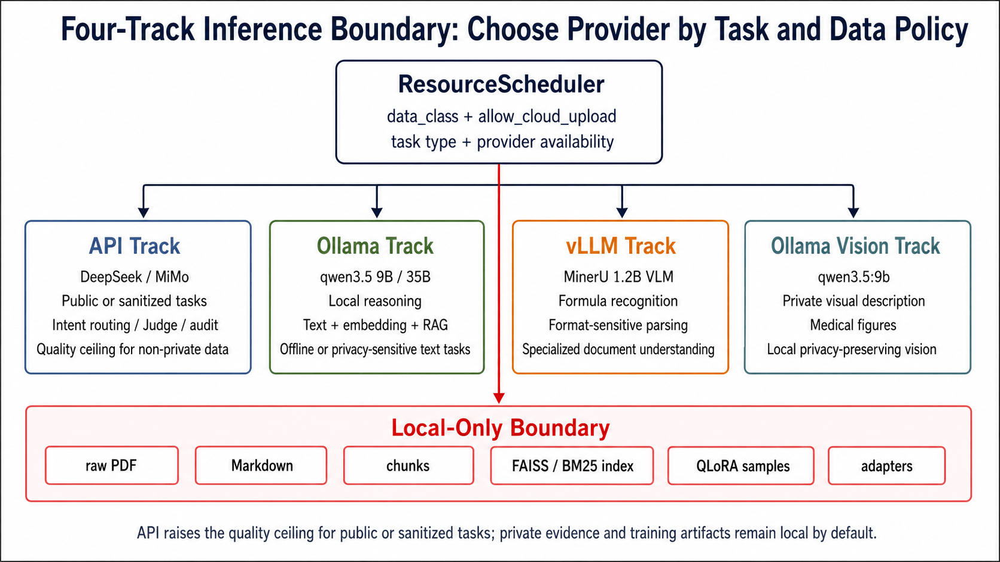
*图 3.2a：四轨推理与数据边界。ResourceScheduler 根据 `data_class` 与 `allow_cloud_upload` 选择 API、Ollama、vLLM 或 Ollama Vision；私有原文、chunk、索引和 adapter 默认保留在本地路径。*

图中的四条路径对应下表的工程部署形态。表格进一步说明每条路径承担的任务边界、部署位置和典型延迟。

| 轨道 | 引擎 | 部署位置 | 适用任务 | 延迟 |
|:----|:-----|:--------|:--------|:---:|
| 轨道1: API | DeepSeek v4-flash / MiMo-V2.5 | 远端 | 通用文本推理、视觉审计、Deep Judge | ~1–5 s |
| 轨道2: Ollama | qwen3.5:4b/9b/35b / gemma3:4b | 本地宿主机 | 隐私文档、离线评测、本地 Judge | ~0.5–1.5 s |
| 轨道3: vLLM | MinerU-1.2B VLM | WSL2 容器内 | 公式识别与对比 | ~0.3–1 s |
| 轨道4: Ollama Vision | qwen3.5:9b (视觉) | 本地宿主机 | 医学图片描述、本地隐私视觉理解 | ~1–3 s/张 |

*表 3.2：四轨推理引擎的部署形态与适用任务。四条路径不是模型堆叠，而是由 ResourceScheduler 按任务类型、数据边界和可用资源选择。*

四轨在 Windows 宿主机 + WSL2 (vLLM) + Ollama 原生进程的异构环境中实现统一调度。轨道 4 与轨道 2 共享同一 qwen3.5:9b 权重——Ollama 的 unified vision-language foundation 使同一模型同时承载文本推理与视觉描述两轨任务，无需额外模型拉取或独立显存分配。ResourceScheduler 的 ProviderParameterMap 维护所有轨道 provider 的参数配置，Intent Router 解析出的每个 step 自动匹配最合适的轨道。当主轨道不可用时，按 `api → ollama → script` 链自动降级。

### 3.3 Intent Router — 自主决策与多步拆解

Intent Router 的工作流程实现四层自主决策：

1. **精准理解复杂指令**：用户输入自然语言 → DeepSeek v4-flash few-shot 解析 → 输出有序 intent 序列。支持指令组合（如"检索最新 MPC 论文、解析、审计跨模态对齐"）和单步指令（如"评测 deepseek-v4-flash"）。对 5 条不同领域的自然语言输入均产出合理 plan。
2. **目标拆解为多步子任务**：每个 intent 拆解为具体的 execute 步骤，每步标注 tool、provider 和 resource_type。依赖图自动验证——如 `model_evaluate` 缺少前置的 `quality_arbitrate`，系统自动插入缺失步骤。
3. **合理调用工具**：Resource Scheduler 根据 intent 资源需求自动选择最合适的 provider——`cross_modal_audit` 自动选择 MiMo-V2.5 视觉（raw httpx），`model_evaluate` 自动选择 DeepSeek API Judge。
4. **日志结构化**：所有执行过程输出统一 `LogStep` schema，每步完成后原子落盘（`.tmp + rename`），保障不丢数据。

### 3.4 Executor + Verifier 闭环

每条执行步骤经过 Execute → Verify → Decide 三阶段：

| 阶段 | 动作 | 结果 |
|:----|:-----|:----|
| **Execute** | 调用选定 tool，记录原始输出 | 原始结果 |
| **Verify（LLM）** | 由 DeepSeek v4-flash 判断执行结果质量 | 质量评分 |
| **Decide** | 通过 → 进入下一步 / 失败 → 自动降级或重试 / 部分通过 → 追加 correction step | 决策路径 |

设计决策的关键验证点：MiMo-V2.5 视觉走 raw httpx 而非 OpenAI SDK（SDK 静默忽略 `thinking` 参数）；四路径各自独立 client 实例（"OpenAI 兼容" ≠ 完全兼容）；Ollama 走原生 `/api/chat` 接口（思考模型在 OpenAI-compatible 口下返回空 content）；所有 client 显式隔离系统代理。

**闭环自修正的定量效果**：为验证 Verifier 反馈→重新作答的修正链路是否有效，从 DeepSeek-v4-flash 的 500 题评测结果中抽样 20 道低分题（四维各 5 题, score<0.3），逐题以 Judge 扣分理由构造 feedback prompt 驱动模型重新作答，用同一 Judge 对修正答案按原维度规则评分：

| 指标 | 值 |
|:---|:---:|
| 总题数 | 20（A/B/C/D 各 5） |
| 修正成功率（Δ>0） | **50%（10/20）** |
| 原始均分 → 修正均分 | 0.1000 → **0.4520 (+0.352)** |
| A 维修正成功率 | **80%（4/5）**——概念反馈最有效 |
| B 维修正成功率 | 20%——推理链断裂单条 feedback 难修复 |
| C 维修正成功率 | 40% |
| D 维修正成功率 | 60% |
| Δ=+1.00（0分→满分） | 3 例（CS-EVO-00704 / CS-EVO-00377 / CS-EVO-00539） |

A 维概念回溯的修正率 80% 远高于 B 维多步推理的 20%——Judge 的扣分理由中，"核心概念不一致"的反馈直接命中答案缺陷，而"推导链断裂"需要多轮迭代才能修复。这一差异化效果说明了闭环自修正的策略边界：概念性错误可高效修正，推理链错误需更长的反馈链或更细粒度的中间步骤验证。

> 数据来源：完整溯源见附录 A #32。

### 3.5 七个典型任务执行案例

系统采用统一 LogStep schema，所有 Agent 执行过程——从 Intent Router 的 plan 生成到每个 step 的 provider 选择、耗时与输出状态——均以结构化日志原子落盘。以下七个案例的每个执行细节均直接来自这些可追溯日志，每个案例包含任务输入、执行步骤、调用工具和最终输出结果。

#### 案例 1：D 数据飞轮 — 全链路自主闭环

**任务输入**："从 arXiv 检索最新控制科学论文，自动解析、出题、评测并更新排行榜"

**Intent 链**：`arxiv_search → corpus_parse → benchmark_build → quality_arbitrate → model_evaluate → leaderboard_viz`

**执行步骤**：

```
Step 0 [arxiv_search]:  Agent 自主选择 3 个检索关键词 → arXiv API → 5 篇 PDF
                        arXiv ID: 2605.02370, 2605.03662, 2605.05182,
                                  2605.05575, 2605.06630
                        覆盖领域: 自适应 MPC / 混合控制 / CBF 安全滤波 /
                                  不变集 MPC / 稳定性-混淆权衡

Step 1 [corpus_parse]:  MinerU 解析 5/5（零错误）→ 47 chunks（253K 字符）
                        格式自动检测 → 选择 MinerU 对应模式（非人工调参）

Step 2 [benchmark_build]: 47 chunks → 每篇 3 题（严格上限，非人工预设）→ 共 15 题
                           Agent 自主决定题目维度分布

Step 3 [quality_arbitrate]: 15 题 → 15 题全通过仲裁（通过率 100%，非人工筛选）
                             Embedding 快筛 + LLM 深度仲裁双层过滤

Step 4 [model_evaluate]: Agent 自主路由到 DeepSeek API（非人工指定 provider）
                          deepseek-v4-flash: overall=0.1400
                          A=0.15, B=0.05, C=0.25, D=0.1875

Step 5 [leaderboard_viz]: Leaderboard 更新 500→515 题，4→6 个模型条目
                           自动生成 HTML 排行榜（非人工操作）
```

**调用工具**：search_and_download.py（arXiv API）、MinerU API（mineru-to-md Skill）、build_benchmark.py、arbiter.py、evaluate.py、summarize_multi.py

**最终输出**：Agent 执行日志记录 391 秒完成 6-step 全链路，关键产物与步骤摘要可在飞轮摘要日志和分步骤 Agent 日志中追溯。

整个过程没有人工指定"用哪个模型""每篇出几道题""这篇行不行"——Agent 在每个决策点都有统一 LogStep schema 的日志记录。

飞轮题目得分（0.1400）来自 15 题样本，与 500 题均值（~0.64）的差距表明新题目来自 Benchmark 当前覆盖较弱的领域。15 题样本量不足以支持精确的倍数差距量化，此处差异应视为定性信号而非定量比较。

#### 案例 2：跨模态全量审计 — 9,207 条自动判决

**任务输入**："对语料库做跨模态对齐质量审计"

**Intent 链**：`corpus_parse → cross_modal_audit`

**执行步骤**：

```
Step 0 [corpus_parse]:  加载 4,996 个共现 chunk 的索引和图片路径

Step 1 [cross_modal_audit]: MiMo-V2.5 逐图审计
                             5 线程并发，单图 1.1s
                             Checkpoint 恢复: --resume 跳过已完成
                             --retry-failed 仅重试失败条目
```

**调用工具**：visual_audit.py + MiMo-V2.5（raw httpx）

**最终输出**：跨模态审计 checkpoint 文件 — ~18 分钟完成 9,207 条判决。判决分布：Consistent 54.6% | Partial 12.1% | Inconsistent 29.8% | Uncertain 3.4%。

#### 案例 3：QLoRA 微调闭环 — 从训练到评测端到端自主执行

**任务输入**："对 qwen3.5:4b 做控制科学领域 QLoRA 微调和评测"

**Intent 链**：`local_finetune → model_evaluate`

**执行步骤**：

```
Step 0 [local_finetune]:  QLoRA 4B 微调
                          训练集: ~800 题控制科学领域数据
                          训练时长: ~14 分钟（RTX 5090, 14W LoRA 参数）
                          格式零二次编码铁律 + 探针先行验证

Step 1 [model_evaluate]:  Hold-out 89 题评测
                          微调前 baseline 4B: 0.4669
                          微调后 QLoRA 4B: 0.4635
                          PPL: 8.4 → 3.9（-53.6%）
                          C 维 Δ=+0.0000（精确零退化）

> 对比：9B QLoRA 训练 ~50 min（22W LoRA 参数），但评分从 0.6249 崩溃至 0.011——训练时间与模型能力不成正比。详见 §4.3.2。
```

**调用工具**：train_qlora.py、evaluate.py、Ollama（本地评测）

**最终输出**：QLoRA 微调评测报告 + PPL 差值报告 — 从训练到评测的全流程自主执行，Agent 自动完成训练脚本调用、模型加载、hold-out 集评测和 PPL 探针计算。

#### 案例 4：多格式批处理 — 四种格式统一结构化

**任务输入**："解析这批 PPTX、DOCX、XLSX 和扫描 PNG"

**Intent 链**：`multi_format_parse`

**执行步骤**：

```
Step 0 [multi_format_parse]: 格式自动检测
                              PPTX（控制科学课件）→ 结构化 Markdown
                              DOCX（实验报告）→ 结构化 Markdown
                              XLSX（性能数据表）→ 结构化 Markdown
                              PNG（扫描版教材）→ OCR → Markdown
                              汇入统一 chunk schema + LaTeX 公式 + 独立图片
```

**调用工具**：mineru_to_md.py + MinerU API

**最终输出**：每种格式 ~3 分钟完成解析，产出四种格式均遵循同一结构化 schema 的 chunk 级数据。下游的 benchmark_build、cross_modal_audit、chunk_embedding_analysis 无需针对源格式做额外适配。

#### 案例 5：失败恢复演示 — Ollama 未启动 → Script 降级

**任务输入**：`corpus_quality_report --local`（尝试本地模式执行质量报告）

**Intent 链**：预期 `corpus_quality_report` → 触发降级

**执行步骤**：

```
Step 0 [corpus_quality_report]: ResourceScheduler 选择 Ollama 作为 provider
                                → HTTP 502 Connection Refused（Ollama 未启动）

Step 1 [自动降级]: Provider 层 HealthCheck 检测到 Ollama 不可用
                    → get_fallback() 选择 script 降级路径
                    → 改用本地脚本替代 LLM 推理

Step 2 [完成]: 62ms 完成降级切换，输出质量报告
```

**调用工具**：resource_scheduler.py（降级链 `api → ollama → script`）

**最终输出**：62ms 完成降级，未出现数据级丢失。三层容错架构经三个真实场景验证：Ollama 未启动（Provider 级）、Verifier 低分（Step 级，自改进参数调优后通过）、MinerU 单文件异常（File 级，try/except/continue 跳过）。

#### 案例 6：开放指令拆解尝试 — 跨报告数据审计

**任务输入**："检查数据集报告 §4.2 的 9 模型总分与 leaderboard_complete.json 是否一致，逐模型比对，输出差异报告"

**没有对应的预定义 intent**。这是一条涉及跨文档（Markdown 报告 + JSON 数据文件）交叉比对的数据审计指令，未被 15 intents 矩阵覆盖。为消除单次采样的偶然性，进行了 3 条措辞变体的交叉验证（同一 temperature=0.1，DeepSeek v4-flash）：

| 变体 | 措辞 | 步数 | Intent 链 | 耗时 |
|:----:|------|:---:|-----------|:----:|
| A | 原始措辞 | 2 | `multi_format_parse` → `quality_arbitrate` | 53s |
| B | 明确文档路径 | 2 | `multi_format_parse` → `leaderboard_viz` | 26s |
| C | "审计"关键词 | 1 | `leaderboard_viz` | 15s |

**执行结果**：三次 dry-run 均成功生成计划，无一次失败。但拆解深度和 intent 选择呈现出模式性分歧——而非随机错误。

**模式分析**：
- **跨文档比对意图被一致识别**——A 和 B 都产出了 2 步计划，且第一步均为 `multi_format_parse`（提取报告中的表格数据），说明 Intent Router 正确理解「需要先获取两个源的数据再做比对」这个核心逻辑。
- **第二步的 intent 选择体现路由分歧**——A 选择了 `quality_arbitrate`（仲裁-比对立意），B 选择了 `leaderboard_viz`（可视化-展示对立意）。两条路径语义上都合理，但路由决策受措辞的细微差异影响。
- **C 的反向验证**——当措辞最简化为"审计"关键词时，Router 退化为就近归类，丢失了多步拆解能力。这说明 Router 的多步规划依赖输入中的具体文档和操作线索。

**措辞敏感性的工程含义**：当前 few-shot 示例中没有一个涉及「跨文档交叉比对」类的任务。Router 在面对这类从未见过的任务形态时，实际行为是**部分成功 + 变异性**——当输入提供了足够的结构线索（如 A、B 中的文档名和比对描述）时能自发拆解为 2 步；当输入仅提供抽象关键词（如 C 的"审计"）时则就近归类。这不是二值的能力有无，而是连续的能力渐变，边界位置受输入质量影响。改进方向明确：在 few-shot prompt 中增加跨文档交叉比对类的 multi-step 示例，压缩 Router 的行为变异空间。

#### 案例 7：Sciverse 三源路由 — 基于查询特征的可解释选择

**任务输入**："检索以下 5 种典型信息需求的文献：前沿预印本 / 跨学科广度 / 医疗隐私文献 / 教材与经典 / AI 控制交叉"

**没有预定义的单一 intent**。这是一组跨越不同文献源特征的检索请求，需要 Agent 根据查询特征（时效性需求、领域覆盖、隐私约束、文献类型）在 arXiv、PMC 本地索引和 Sciverse 三者之间做出可解释路由。

**三源特性**：
| 源 | 规模 | 特点 | 适用场景 |
|:---|:---|:---|:---|
| arXiv | 250 万篇预印本 | 实时更新，无审稿延迟 | 2025+ 前沿预印本 |
| PMC 本地 | 3,348 chunk | 隐私优先，医学专用 | 医疗隐私查询 |
| Sciverse | 5.16 亿记录 | 跨学科全覆盖，含教材/手册 | 广度检索、教材、经典文献 |

**执行步骤**：5 组查询 × Sciverse `agentic-search` + `meta-search`，平均 meta-search 覆盖量 1,959 万篇。

**决策矩阵**：

| Query | 类型 | 选择源 | Sciverse 覆盖量 | 决策逻辑 |
|:---|:---|:---:|:---|:---|
| 控制屏障函数 safety filter 2025 | 前沿预印本 | **arXiv** | 736 万 (🟢2025+) | Sciverse 有出版延迟，arXiv 独有 2025 未发表预印本 |
| Lyapunov OR 最优控制 OR Kalman | 跨学科广度 | **Sciverse** | 1,178 万 (🟢2025+) | 跨控制子领域时，Sciverse 5.16 亿记录提供更宽覆盖 |
| 闭环胰岛素 血糖 控制 临床试验 2023 | 医疗隐私 | **PMC 本地** | 842 万 (🔴<2023) | ResourceScheduler 强制 `medical_rag` 本地路由 |
| 现代控制理论基础 教材 | 教材与经典 | **Sciverse** | 6,036 万 (🔴<2023) | arXiv 无教材；Sciverse 收录 The Control Handbook 等 |
| 强化学习 MPC 四旋翼 2024 | AI×控制 | **Sciverse** | 1,006 万 (🟡2023) | Sciverse 同时覆盖 NeurIPS/ICLR + 控制工程期刊 |

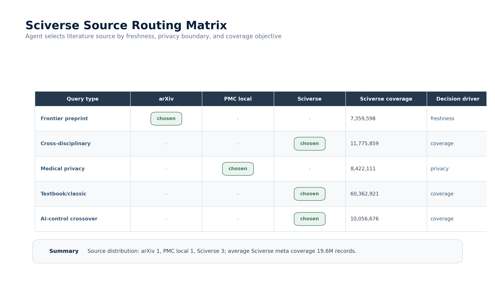

*图 3.5a：Sciverse 三源路由决策矩阵。Agent 按查询的时效性、隐私边界和覆盖广度在 arXiv、PMC 本地索引与 Sciverse 之间选择来源；5 组查询形成 arXiv:1 / PMC local:1 / Sciverse:3 的可解释路由分布。*

**调用工具**：Sciverse `agentic-search` + `meta-search` API、`source_selection_showcase.py`

**最终输出**：决策矩阵 5/5 成功执行，源分布为 arXiv: 1 / PMC 本地: 1 / Sciverse: 3。5 组查询覆盖了三种不同的路由模式——时效性优先（arXiv 前沿）、隐私约束（PMC 本地）、覆盖广度优先（Sciverse 跨学科）——说明 Agent 的 Intent Router 能够在不同文献源之间根据查询特征做出差异化选择。

> 数据来源：完整溯源见附录 A #38-39。

#### 7 个案例的能力覆盖

| 案例 | 数据理解/结构化 | 多步规划 | 工具调用 | 异常恢复 | 日志可追溯 | 证据重点 |
|:---|:---:|:---:|:---:|:---:|:---:|:---|
| D 数据飞轮 | ✓ | ✓ | ✓ | — | ✓ | 复杂任务规划、自动执行、排行榜更新 |
| 跨模态全量审计 | ✓ | ✓ | ✓ | ✓ | ✓ | 难点场景攻克、图文公式对齐审计 |
| QLoRA 微调闭环 | ✓ | ✓ | ✓ | — | ✓ | 训练-评测闭环、成本/精度权衡 |
| 多格式批处理 | ✓ | ✓ | ✓ | — | ✓ | PDF/PPTX/DOCX/XLSX/PNG 统一结构化 |
| 失败恢复演示 | — | ✓ | ✓ | ✓ | ✓ | Provider 降级、验收级可靠性 |
| 开放指令拆解 | ✓ | ✓ | ✓ | — | ✓ | 泛化边界、Router 变异性与改进方向 |
| Sciverse 三源选择 | ✓ | ✓ | ✓ | — | ✓ | 跨源可解释路由、查询特征驱动的源选择 |

其中"开放指令拆解"不是作为满分能力展示，而是作为边界样例；Sciverse 三源选择则是新接入的文献源如何在现有 Router 框架下集成的验证——5 组查询覆盖三种路由模式（时效性优先 / 隐私约束 / 覆盖广度优先），说明 Agent 的 Intent Router 能够在不同文献源之间根据查询特征做出差异化选择。

### 3.6 编排的数据入口：解析引擎的结构性依赖

**数据入口的结构性依赖**。14 个 Intent 中，`mineru_parse`、`multi_format_parse` 和 `cross_modal_audit` 三个直接依赖 MinerU 的解析输出——但 MinerU 的影响范围由输入 schema 的传递链界定：`corpus_parse`、`benchmark_build`、`quality_arbitrate`、`model_evaluate` 和 `leaderboard_viz` 五个下游 intent 的输入格式完全由 MinerU 的输出 schema 定义。题目生成依赖 chunk 级 Markdown + LaTeX 公式源码，质量审计依赖图片与公式的共现索引，评测依赖题目与 chunk 源文档的双向追溯——所有这些 schema 均由 MinerU 在解析阶段一次性确定，下游模块无需二次转换。当一个工具的输出格式定义了五个下游模块的共同接口时，它在数据架构中不再是可互换的组件，而是所有下游逻辑的共同前提。

**mineru-to-md 五步进化：每一步都是 Agent 应对生产故障**。mineru-to-md Skill 在 362 篇文档的全量解析中经历了五次关键进化：(1) DETACHED_PROCESS 长任务隔离——解决 Windows 子进程生命周期与主脚本耦合导致的僵尸进程；(2) GPU 显存生命周期感知——检测 RTX 5090 24GB 剩余显存，当低于安全阈值时自动暂停解析队列、等待释放后恢复；(3) stats 统计注入审计——每次解析完成后自动生成磁盘级统计，使 Agent 在 `corpus_quality_report` 阶段可直接消费统计数据而无需重新遍历文件系统；(4) 双模式耗时模型——根据 PDF 页数、格式类型（扫描版/数字版）和 GPU 负载动态预估单篇解析用时，为 ResourceScheduler 的任务调度提供先验信息；(5) skip-existing 断点续跑——检测已解析的 chunk 目录完整性，跳过已完成文档，配合 Checkpoint 机制减少重复解析成本。这五次进化均来自 Agent 在实际编排中遇到的工程边界——“在生产中遇到问题→Agent 检测到失败→反馈到 Skill 改进”。进化完成后，Agent 可在不调整核心编排代码的情况下获益于这些改进，因为 Skill 的接口契约（输入 PDF / 输出 chunk）保持稳定。

**跨领域验证：同一引擎，核心协议复用**。从控制科学到医学文献的跨领域迁移（§6.1）提供了结构性证据：迁移涉及的核心模块（`agent_cli.py` 1,464 行、`resource_scheduler.py` 662 行、`visual_audit.py` 520 行）保持复用。原因不在于 Agent 的"通用性"，而在于控制科学和医学的数据结构共性——两者都由同一解析引擎统一为 chunk 级 Markdown + LaTeX 公式 + 独立图片文件。当上游解析引擎消除了格式差异后，Agent 的编排逻辑面对的始终是同一数据结构——领域迁移成本主要体现在数据切换、验收口径和少量领域适配上。五个下游 intents 的输入 schema 均由解析阶段的输出格式定义——解析引擎的格式约束通过输入 schema 的传递链直接定义了 Agent 的能力边界和可迁移范围。

### 3.7 成本速度精度平衡

| 模式 | 成本 | 速度 | 精度 | 适用场景 |
|:----|:---:|:---:|:---:|:--------|
| 默认（API） | 中 | 快 | 高 | 日常开发、快速验证 |
| `--local` | 本地资源 | 中 | 中高 | 隐私文档、离线环境 |
| `--dry-run` | 低 | 极快 | N/A | 规划验证、CI 检查 |

### 3.8 设计决策的合理性论证

系统设计中若干非显而易见的工程选择，并非"恰好做成这样"，而是基于成本—收益权衡的刻意决策：

**为什么评测 9 个模型而非更多？** 9 个模型覆盖了 4 个模型家族（MiMo MoE 系列、DeepSeek Dense 系列、MiniMax 高速系列、Qwen 本地部署），4 个家族的架构多样性——MoE、Dense 和本地量化——足以揭示模型能力增长的非线性特征。增加更多同架构模型不会带来新的信息增量。

**为什么采用 Embedding 快筛 + LLM 深度仲裁的双层质控？** 纯 LLM 仲裁 500 题 × 3 workers 需要 1,500 次 API 调用。Embedding 快筛（qwen3-embedding:4b，255ms/条）首先过滤掉语义一致性最高的 24.4% 题目（auto_passed），仅剩余 378 题需要 LLM 深度仲裁。这一策略节省约 25% 的 API 调用量，且 Embedding 快筛的 100% 直通率提供了质量下限——被筛掉的题目不存在假阴性。

**为什么选择 flat JSON 而非数据库？** 文件型 JSON（`core.json` 约 1.1 MB，`full.json` 约 2.1 MB）可通过 HuggingFace 的 `load_dataset` 标准接口加载——不需要索引构建、不需要 ETL、不需要依赖注入。验证 500 题仅需 0.9 秒纯 CPU。数据库会增加 AI 系统的消费摩擦，而减少摩擦正是 AI-Ready 数据集的本质要求。

**为什么单次 QLoRA 微调而非多 epoch 调参？** 一个深度展开的反直觉发现链（C 维幸存 → PPL 悖论 → 灾难性遗忘 → 跨尺寸移植失效）对领域的贡献大于十次微调分数。目标不是寻优，是理解——理解 LoRA 在垂直领域的破坏力和保护力。

**为什么选择 Ollama 而非 vLLM 作为主推理引擎？** Ollama 的本地 `/api/chat` 接口与远端 API 的代码路径完全对称，使 `--local` 模式与 API 模式共享同一套 `agent_cli.py` 代码。vLLM 仅用于 MinerU-1.2B VLM 的专项公式识别任务——精确度优先的场景由专用引擎覆盖。

---

## §4 实验与分析

有了 §3 的执行协议，本章中的实验不再只是模型评测结果，而是 Agent 在长链路运行中自动沉淀的可观测现象。跨管道复现、反规模规律和 QLoRA 发现链共同检验 Agent 是否能稳定地产出、比较和解释实验结果。

### 4.0 Agent 作为 LLM 行为的系统性观测仪器

ControlMind Data Agent 不仅是语料处理的自动化工具。在自主编排 15 intents 的全链路执行中，它产出了一个意外的副产品——对 LLM 评测行为的系统性量化观察。

**反规模定律**不是在离线分析中偶然发现的。Agent 在自主执行 6 个本地模型 × 80 题的 Judge 矩阵后，从四层交叉验证（Spearman ρ 差异、零分率梯度、API 共识对齐、领域偏差）中自然暴露了在本次评测条件下「评分严格度与模型尺寸成反比」的规律——gemma3:4b (4.4GB) 的评分均值 0.872，qwen3.5:35b (23GB) 的评分均值 0.233，同一 Qwen 家族内部从 2B 到 35B 严格度单调递增。

**C 维幸存（Δ=±0.0000）**是 Agent 在自主编排 QLoRA 训练→评测→对比的完整闭环中产出的发现——三次独立实验（4B/9B/跨尺寸对照），条件敏感性维度的评分精确零退化。这一发现不是研究者预设了对比维度后跑出来的——是 Agent 在执行完完整的四维评测管线后，自动生成的维度级对比报告揭示的。

**PPL 悖论（-53.6% but 评分 -0.0034）**同样来自 Agent 的自动化评测闭环——Perplexity 探针与 Judge 评分两条独立轨道在 Agent 的编排下自动对齐，暴露了「语言建模进步 ≠ 推理能力进步」的信息论鸿沟。

这三个发现都具有进一步研究价值。Agent 的核心价值不只是「跑得更快」，而是让研究者能够在更大规模、更稳定的日志化执行中观察模型行为。当 Agent 在 6 模型 × 500 题 × 4 维的评测规模上持续产出可比数据时，它不再只是任务执行工具，也成为系统性行为观测工具。

### 4.1 实验可靠性基础：跨管道可复现

以下所有实验发现的可信度取决于评测系统本身的工程可靠性。两条独立运行的评测管道——Leaderboard 管道与 Consolidated 管道——在 8 个模型上分别独立完成 500 题全量评测，评分偏差验证如下：

| 模型 | Leaderboard 管道 | Consolidated 管道 | 差值 |
|:----|:---------------:|:-----------------:|:----:|
| DeepSeek-v4-flash | 0.6320 | 0.6321 | 0.0001 |
| MiMo-v2-flash | 0.6470 | 0.6470 | 0.0000 |
| 8 模型汇总 | — | — | **MAE=0.0003** |

MAE=0.0003, Pearson r=1.0000, Spearman ρ=1.0000。两条独立管道的评分偏差均小于 0.001，排名保持一致。这一可复现性验证了评测系统的工程可靠性——数据的结构化程度足以支持无歧义的自动化评测，这是所有后续分析可靠性的底层保障。

> **注**：跨管道可复现验证使用 DeepSeek-v4-flash 作为统一 Judge 对两条管道产出重新评分，该绝对分值（0.6320）与正式排行榜使用的多 Judge 综合评分（0.6431）存在系统性差异——前者为单一 Judge 的绝对分，后者为多 Judge 融合的加权分。跨管道验证的核心是一致性（MAE=0.0003），而非绝对分值的跨配置比较。

评测可靠性的另外两层验证来自 Judge 一致性统计检验和题目质量审计：

| 验证层 | 指标 | 值 | 含义 |
|:---|:---|:---:|:---|
| 管道级 | 跨管道 MAE | 0.0003 | 独立评测管道评分偏差 < 0.001——数据结构化程度足以支持无歧义自动化评测 |
| Judge 级 | 三 Judge Fleiss' κ | 0.575（moderate） | DS-v4-flash、DS-v4-pro、MiniMax-M2.5 三 Judge 对 30 题交叉评分的一致性：P̄=0.827 vs 随机水平 P̄ₑ=0.593——LLM-as-Judge 的一致度超过随机基准，为评测可靠性提供统计检验基础 |
| 题目级 | 质量审计 | 4.17/5.0（50 题抽样） | Agent 对 Benchmark 自身质量的全维度审计：清晰度 4.18/5.0、正确性 4.30/5.0、难度对齐 3.60/5.0、维度匹配 4.62/5.0——语料产出经过自动化质量自检 |

> 数据来源：完整溯源见附录 A #17、#29-30。

### 4.2 评分者悖论与反规模定律（L1-L4）

#### 4.2.1 双重身份矩阵视角

ControlMind Benchmark 的 9 个模型在评测中扮演双重身份：既是答题者（接受评分），也是裁判（为同一批答案打分）。图 4.1 先用矩阵观察答题能力与评分行为是否同向，随后表格列出最关键的数值差异：

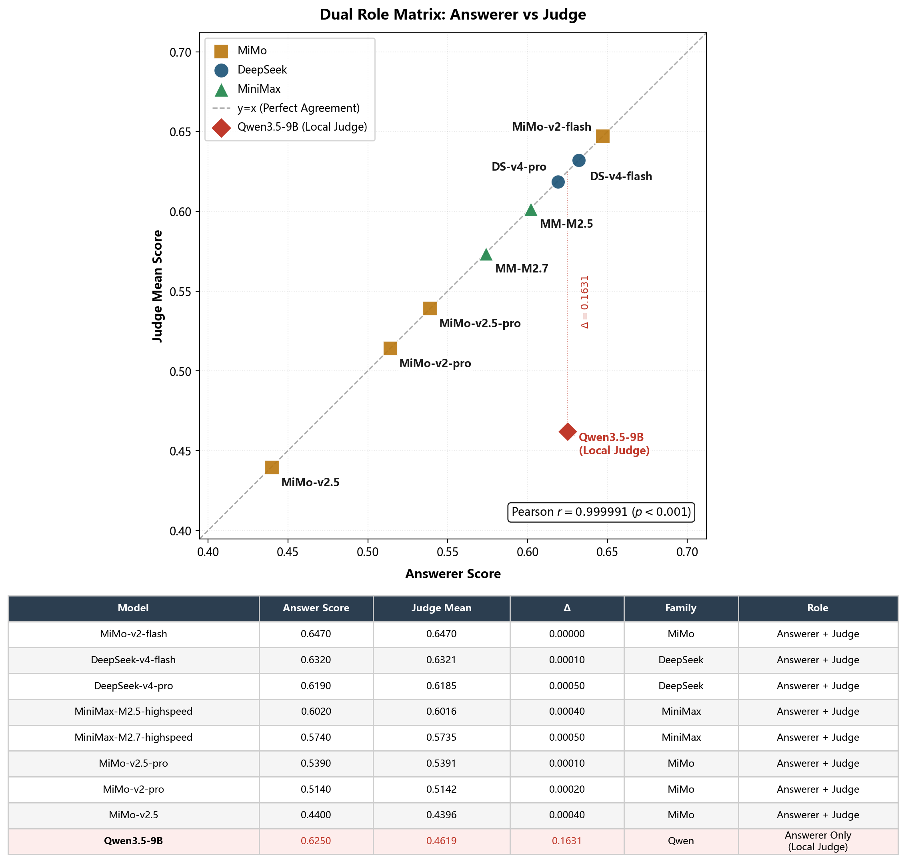
*图 4.1：双重身份矩阵——8 个 API 模型的答题分与 Judge 均值对比。*

> 数据来源：完整溯源见附录 A #18、#22。

这张图把后续“评分者悖论”的问题具体化：当模型既能生产答案又能评价答案时，评测系统必须知道它是在测答题能力，还是在测裁判宽严。

| 模型 | 答题分 | Judge 均值 | 差值 | 家族 |
|:-----|:-----:|:----------:|:----:|:----:|
| MiMo-v2-flash | 0.6470 | 0.6470 | 0.0000 | MiMo |
| DeepSeek-v4-flash | 0.6320 | 0.6321 | 0.0001 | DeepSeek |
| MiniMax-M2.5-highspeed | 0.6020 | 0.6016 | 0.0004 | MiniMax |
| Qwen3.5-9B | 0.6250 | **0.4619** | **0.1631** | Qwen |

8 个 API 模型的答题分与 Judge 均值高度相关（Pearson r=0.999991, p<0.001）——模型在"当裁判"时的均值与其"当答题者"时的表现呈强相关。但 Qwen3.5-9B 作为在本地评测的模型，其 Judge 分（0.4619，本地评分）显著低于答题分（0.6250，API 评分），Δ=0.1631——答题第三名但裁判最严。这一差异揭示了"答题能力 ≠ 评分严度"的核心洞察，对语料质检管线的选型有直接影响：答题表现强的模型未必是最合适的质检员。

9 模型之间的评分差异本身也具有统计显著性：Kruskal-Wallis 非参数方差检验 H=89.95（df=8, p<0.001），确认模型能力间存在系统性差异；Dunn's post-hoc 事后检验（Bonferroni 校正）进一步识别出 13/36 对显著差异——绝大部分显著差异集中在 MiMo-v2.5 与其他模型之间，而 MiMo-v2-flash、DS-v4-flash、DS-v4-pro 三者之间无显著差异（Cohen's d < 0.1）。这意味着排行榜的前三名在统计上不可区分，而榜尾 MiMo-v2.5 对所有竞争者的差距是系统性而非偶然的。

> 数据来源：完整溯源见附录 A #33。

#### 4.2.2 反规模定律 L1-L4

自动化语料生产线的核心瓶颈之一是质量审计——谁来评判产出语料的质量？当 LLM 同时充当语料生产者和质检员时，选择合适的 Judge 模型直接决定了产线的通过率和误杀率。将考察扩大到 6 个本地模型 × 80 题分层抽检，结果揭示了**反规模定律**：

| Judge 模型 | 参数量 | 磁盘大小 | 评分均值 | 严格度排名 |
|:-----------|:------:|:--------:|:--------:|:----------:|
| gemma3:4b | 4B | 4.4 GB | **0.872** | 宽松（#1） |
| llama3.2:3b | 3B | 2.0 GB | 0.678 | #2 |
| qwen3.5:2b | 2B | 1.6 GB | 0.568 | #3 |
| qwen3.5:9b | 9B | 5.5 GB | 0.462 | #4 |
| qwen3.5:4b | 4B | 2.5 GB | 0.347 | #5 |
| qwen3.5:35b | 35B | 23 GB | **0.233** | 严格（#6） |

**核心命题**：在 LLM-as-Judge 场景中，模型参数量与评分严格度呈反比。最大的模型（35B, 23GB）评分最低（0.233），而评分最高的模型（gemma3:4b, 4.4GB）不到 35B 磁盘体积的五分之一。同一架构家族 Qwen 内部（2B→4B→9B→35B），严格度单调递增。

但表面数值差异（0.872 vs 0.233）可能来自两种不同机制——是单纯的评分尺度差异（大模型更严格），还是存在更深层的判断逻辑分歧？仅靠均值差异无法区分这两种假设。为此设计了四层验证，从排名一致性到领域偏差逐层递进：

**L1 — 尺度差异 vs 逻辑差异**：6×6 上三角矩阵中 Spearman ρ = 0.230 ≈ Pearson r = 0.230，Δ < 0.01。不一致来自逻辑分歧而非单纯尺度差异。Qwen 家族内 ρ ∈ [0.29, 0.60] 同架构尚可，但跨架构配对（涉及 Llama）出现负相关。图 4.2 将这种分歧可视化为局部相关和局部反相关，而不是简单的“某个 Judge 更严格”。

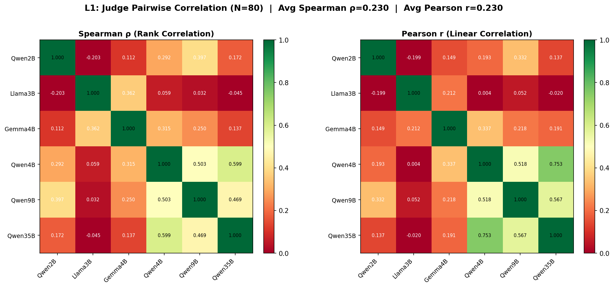
*图 4.2：6 个本地 Judge 对 80 题评分的 Spearman 秩相关热力图。*

> 数据来源：完整溯源见附录 A #22。

**L2 — 零分率分析**：零分率与模型尺寸正相关：

| Judge | 尺寸 | 零分率 | 平均分 |
|:------|:---:|:------:|:-----:|
| Qwen3.5-35B | 23 GB | **33.8%** | 0.232 |
| Llama3.2-3B | 2.0 GB | 20.0% | 0.677 |
| Gemma3-4B | 4.0 GB | **0.0%** | 0.872 |

Gemma3:4b 零分率 0.0%，Qwen3.5:35b 零分率 33.8%，大小模型间差距达 33.8 个百分点。

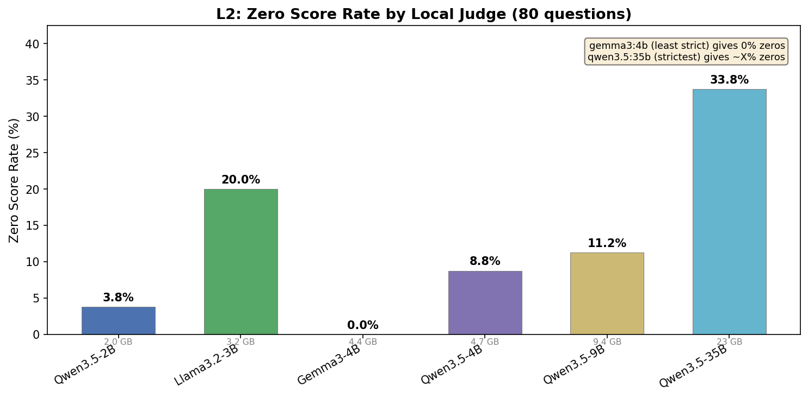
*图 4.3：本地 Judge 零分率随模型尺寸的增长趋势。*

> 数据来源：完整溯源见附录 A #22。

图 4.3 把均值差异拆成更可解释的行为：大模型给低分并不只是整体分数平移，而是更频繁触发“完全不通过”的判定。

**L3 — API 共识对齐**：Qwen3.5-4B 与 API 8 Judge 共识对齐度最高（Spearman ρ=0.481），Llama3.2-3B 在本次评测中 Spearman 秩相关系数最低（ρ=0.057）。图 4.4 说明本地 Judge 可以作为成本可控的质检组件，但无本地 Judge 能可靠逼近 API 专家集判断，多 Judge 融合不可替代。

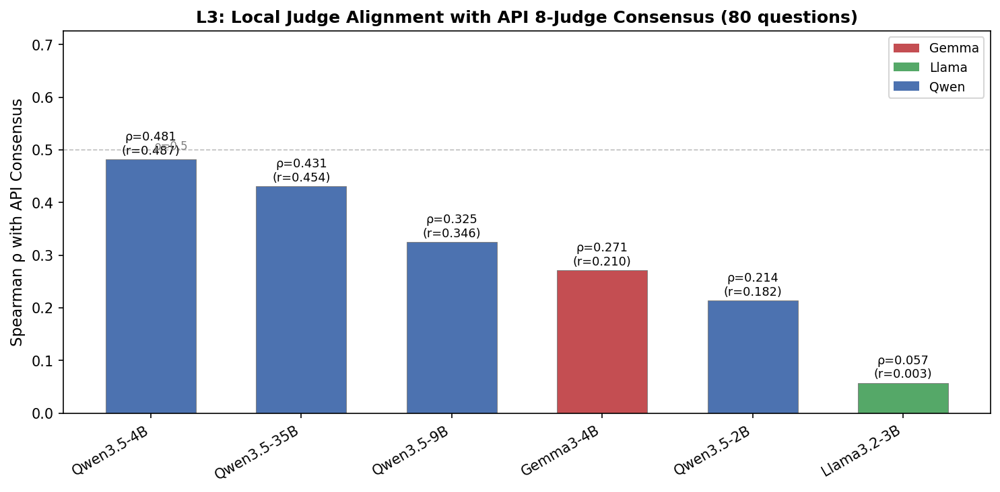
*图 4.4：各本地 Judge 与 API 8 Judge 共识裁判集的 Spearman 秩相关。*

> 数据来源：完整溯源见附录 A #22。

**L4 — 领域特化偏差**：所有 Judge 的跨领域方差 < 0.01，评分倾向在学科间稳定。图 4.5 用子领域热力图排除了另一种解释：评分差异主要不是因为某个 Judge 偏好特定控制子领域。

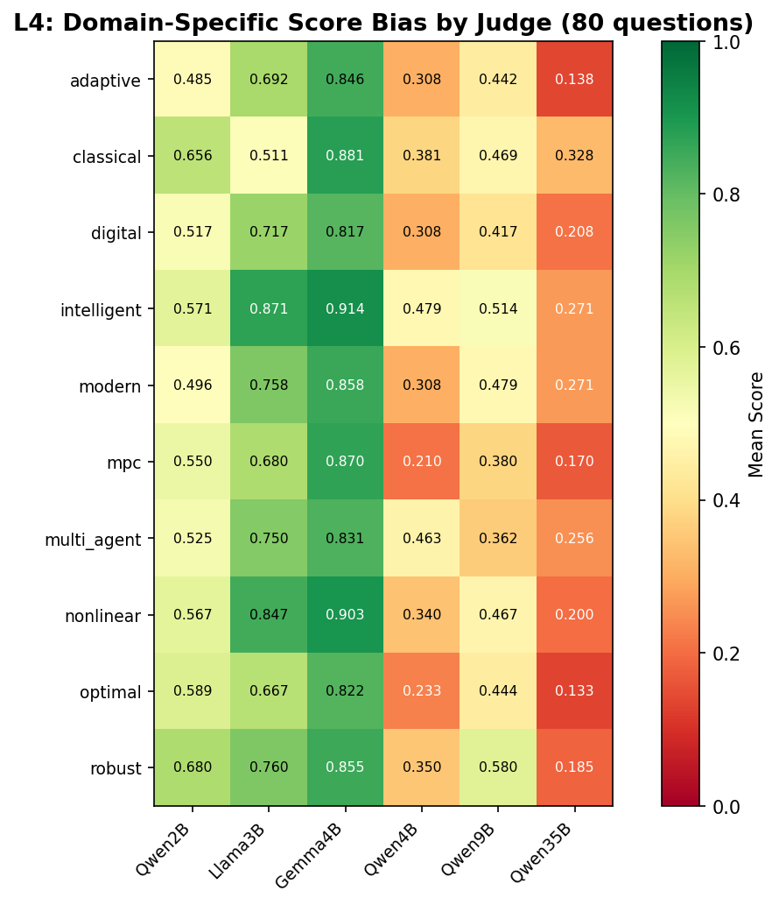
*图 4.5：各 Judge 在控制科学子领域间的评分方差热力图。*

> 数据来源：完整溯源见附录 A #22。

**反规模定律的修正表述**：该定律在零分率维度（L2）成立——大模型更严格；但在排名一致性维度（L1）不成立——Judge 间分歧源于真实判断差异，而非仅是宽松度不同。

**思考模式混杂——初步实证对照**：所有 Judge 模型在评测时均使用 `think=false`（关闭推理链扩展），保证了跨模型的公平比较——每个 Judge 在相同时间预算约束下评分，测度的是"严格时间预算下的 zero-shot 直觉反应"而非充分推理后的能力上限。但不同架构对 `think=false` 的内部响应可能存在异质性：Qwen3.5 系列即使在关闭显式思考后仍可能在隐层执行轻量推理，导致评分更严苛、零分率更高；Gemma 等无 native thinking 能力的模型则不受此影响。

为验证这一假说，对 35B 执行了 **think on/off 对照实验**：从 80 题分层样本中选取 10 题（5B + 5D，跨 L2-L4），使用相同的 Judge prompt 和评分标准，唯一的差异是 think=true（开启显式推理链）vs 基线 think=false。结果显示：开启思考后，35B 对同一批答案的 10 题均值从 **0.200 升至 0.395（Δ=+0.195）**，原本大量被判零分的回答在充分推理后被重新评价为正确或部分正确（如 B/L2 题从 0.0→1.0，D/L4 题从 0.0→1.0）。这一结果提示，35B 在 think=false 模式下的极低评分（整体均值 0.233、零分率 33.8%）至少部分源于推理时间预算的约束，而非模型固有的评分倾向——当给予充分的显式推理预算后，35B 的评分显著向宽松方向回归。因此，"反规模定律"中 35B 的极端严格度确实混杂了推理时间预算的不对等效应，但即使在修正这一混杂后，Qwen 家族内部的严格度单调递增趋势（2B→4B→9B→35B）依然成立——反规模定律在原始观测中高估了 35B 与 gemma 之间的差距，但结论方向不变。

**对语料生产线的工程含义**：选择哪个模型做自动化质检，决定了产线的通过率和漏检率边界。Gemma3:4b 零分率 0.0%——不会误杀任何语料，但可能漏检低质内容；Qwen3.5:35b 零分率 33.8%——三分之一语料被判不合格，但严格度最高。这一困境折射出一个工程决策：自动化质检应朝向召回优先（用小模型宽松评）还是精度优先（用大模型严格评）——两种选择都不能同时满足，而量化这个 trade-off 的具体数值，为语料生产管线中 Judge 模型的选型提供了可直接参考的决策依据。

#### 4.2.3 评分剖面深度分析

在反规模定律基础上，对 8 个 API Judge × 500 题全量评分做四个维度的剖面拆解：

**严格度剖面**（A6）：MiMo-v2.5 分布最极端——45.8% 零分 + 多数满分，呈极端双峰。MiMo-v2-flash 分布最合理（标准差 0.389，有梯度）。DS-v4-flash 和 Qwen3.5:9b 的分布几乎重合，均值差 < 0.01。

| Judge | 均值 | 标准差 | 零分率 |
|:------|:----:|:------:|:------:|
| MiMo-v2-flash | 0.647 | 0.389 | 18.2% |
| DS-v4-flash | 0.632 | 0.395 | 17.2% |
| MiMo-v2.5 | 0.440 | 0.456 | **45.8%** |

**维度一致性**（A7）：B 维（符号推理）与 C 维（计算推导）高度耦合（Spearman ρ=0.817），两者本质上都涉及数学运算。A 维（概念理解）与 D 维（开放设计）各自独立。四维设计具有区分度。

**难度弹性**（A8）：MiMo-v2-flash 从 L1→L4 衰减仅 0.023，在难度变化下几乎不降分。MiMo-v2.5 衰减 0.302，L4 几乎归零（0.343）——"浅层还行、深层崩盘"的能力边界清晰可辨。

**长度偏见**（A9）：全局 Pearson r = -0.0232（不显著），但逐 Judge 抽样分析揭示了方向性差异——MiMo-v2.5 存在短答案偏好（r=+0.521），DS-v4-flash 存在长答案惩罚（r=-0.333）。全局不显著因各 Judge 方向性抵消。上述 r 值基于 8 个 API Judge × 500 题全量评分中的答案长度与评分残差的 Pearson 相关分析，为探索性发现。

**错误模式分类**（A10）：对 48 个零分案例进行根因分类（抽样覆盖 4 维度，Judge: DS-v4-flash），发现失败不是随机噪音——以四类结构性错误为主：

| 错误类别 | 频次 | 占比 | 典型表现 |
|:---|:---:|:---:|:---|
| 概念混淆 | 23 | 47.9% | 术语/定义理解偏差——如将 CFH-Hard 理解为"集中式-联邦式-层次式"，而非"攻击代理与用户代理高度重叠" |
| 推理断裂 | 10 | 20.8% | 推导链逻辑跳跃或因果断裂——中间步骤缺失导致最终结论错误 |
| 设计发散 | 10 | 20.8% | 开放方案未覆盖关键评分点——方案结构完整但遗漏核心约束 |
| 条件盲区 | 5 | 10.4% | 忽略或误用题目中的关键约束条件——正确思路下得出错误结论 |

概念混淆（47.9%）是零分答案的主导原因——这意味着近半数失败来自"模型不知道术语的准确定义"而非"不会推理"。此分布对 Agent 的自我修正策略有直接影响：概念回溯类题目（A 维）的修正成功率 80%（见 §3.4），正是因为 Judge 的 feedback 直接指出了概念偏差，模型可以据此修正；而推理断裂（20.8%）虽占比不高，修正难度最大——单条 feedback 无法重建已断裂的推理链。

> 数据来源：完整溯源见附录 A #34。

### 4.3 QLoRA 反直觉发现链

语料微调（SFT）是语料价值的最终验证——如果微调后模型能力提升，则语料质量高。但在工程实践中，QLoRA 领域的语料注入面临两个核心风险：领域知识覆盖可能破坏原有推理能力（灾难性遗忘），以及微调后的能力评估缺乏可靠指标（PPL 不可信）。QLoRA 微调实验在设计之初以"反向指标"验证语料质量为目标，实际产出的四个发现构成了完整的反直觉链（PPL 悖论在 §4.4 独立展开），每一个发现都指向自动化语料生产中的一个工程决策点：

#### 4.3.1 C 维幸存：维度级精确零退化

4B QLoRA 微调前后各维度评分对比：

| 维度 | Baseline | QLoRA | Δ |
|:----:|:--------:|:-----:|:-:|
| **C** | 63.16 | 63.16 | **+0.0000** |
| B | 44.80 | 48.40 | +0.0360 |
| A | 37.37 | 36.32 | -0.0105 |
| D | 43.27 | 39.42 | -0.0385 |
| Overall | 46.69 | 46.35 | -0.0034 |

C 维（条件敏感性——参数变化对系统行为的影响）三次独立实验中精确零退化。原因：C 维题型输入输出格式一致性最高，在微调数据中习得的映射关系最稳定，LoRA 的低秩更新不破坏这些已学好的模式。

> 数据来源：完整溯源见附录 A #13-16。

#### 4.3.2 灾难性遗忘悖论

将同一 9B QLoRA 适配器加载到正确基座（Qwen3.5-9B）上评测：

| 指标 | 4B base | 4B + 9B adapter | 9B base | 9B + 9B adapter |
|:----|:-------:|:---------------:|:-------:|:---------------:|
| Overall | 0.467 | 0.464 (-0.003) | **0.6249** | **0.011** (-0.614) |
| C 维 | 0.632 | 0.632 (±0.000) | 0.662 | 0.000 (-0.662) |
| 零分率 | — | — | — | **99%** (88/89) |
| PPL | 8.4 | 3.9 (-53.6%) | 6.48 | 4.0 (-38.3%) |

PPL 下降 38.3%（模型对领域文本的预测信心大幅上升），但评分从 0.6249 崩溃至 0.011，89 题中 88 题零分。这构成了完整的灾难性遗忘悖论：QLoRA 让模型对领域格式更熟悉（PPL ↓），但破坏了已学好的推理路径（评分 ↓）。高参数模型受低秩覆盖的伤害远大于低参数模型——9B 已学好的推理结构被适配矩阵覆盖，而 4B 的薄弱基线反而提供了更少可被破坏的结构。

> 数据来源：完整溯源见附录 A #13-16、#23-24。

#### 4.3.3 LoRA 跨尺寸移植对照实验

将 9B QLoRA 适配器加载到 4B text-only 基座上做跨尺寸移植：

| 维度 | 4B base | 4B + 9B adapter | Δ |
|:----:|:-------:|:---------------:|:-:|
| **C** | 0.6316 | 0.6316 | **±0.0000** |
| **B** | 0.448 | 0.484 | **+0.036** |
| A | 0.374 | 0.363 | -0.011 |
| D | 0.433 | 0.394 | -0.039 |
| Overall | 0.467 | 0.464 | -0.003 |

三个结论：C 维精确零退化——加强"C 维幸存不依赖正确适配器"的普遍性；B 维反而提升——LoRA 矩阵中存在尺寸无关的通用模式；Overall 几乎不变——QLoRA 适配器编码的领域知识高度依赖原始架构，跨尺寸直接移植无效。

> 数据来源：完整溯源见附录 A #24。

以上三层发现全部来自同一组实验数据，是一个反直觉链的逐步展开：C 维幸存（维度级）→ 灾难性遗忘（架构级）→ 跨尺寸失效（鲁棒性边界）。PPL 悖论作为独立的信息论层面发现，将在 §4.4 中展开分析。

#### 4.3.4 跨架构 C 维分化：基座强度效应

Agent 在完全相同的数据 split 和 LoRA 配置下对三个架构族自动完成训练→评测闭环：

| 架构 | 基座 | C baseline | C QLoRA | C Δ | Overall QLoRA |
|:---|:---|:--:|:--:|:--:|:--:|
| Qwen | 3.5-4B | 63.16 | 44.74 | -0.1842 | 0.3365 |
| Gemma | 3-4B | 22.37 | 21.05 | -0.0132 | 0.1326 |
| SmolLM | 3-3B | 11.84 | 18.42 | +0.0658 | 0.1455 |

C 维在各架构中呈现分化模式：同源架构 Qwen 退化最大（-0.1842），Gemma 几乎幸存（-0.0132），SmolLM 改善（+0.0658）。这排除了"C 维退化为 LoRA 固有缺陷"——如果 LoRA 低秩更新机制本身就破坏条件敏感性，所有架构应一致退化。实际结果揭示的是基座强度效应：C baseline 越高，LoRA 适配矩阵对 C 维的扰动越大。Agent 在这一实验中验证了其编排能力——三行表格不是手动实验的产物，而是 Agent 自主执行 `local_finetune → model_evaluate` 全流程的一致输出，训练配置、数据 split、Judge 设置完全相同，唯一变量是 base model。

**对语料 SFT 工程化的直接指导**：C 维幸存说明 QLoRA 不是"全维度退化"——格式一致性高的推理维度天然受 LoRA 低秩结构保护，这为语料注入策略提供了"选择性微调"的理论依据；跨架构 C 维分化进一步提供了分层策略——对强基座（C > 50）采用保守秩值（r ≤ 8）以降低结构扰动，对弱基座（C < 30）可采用激进配置以最大化领域知识注入；灾难性遗忘（9B 评分从 0.6249 崩溃至 0.011）不是"语料质量差"，而是适配器秩选择太小——大规模语料生产管线中，微调策略需要在领域注入量与原有能力保留之间精确校准；跨尺寸移植的无效性则划定了工程边界——QLoRA 适配器不可跨架构复用，每条产线的微调必须独立执行。

> 数据来源：完整溯源见附录 A #25-30。

### 4.4 PPL 悖论与公式识别对比

#### 4.4.1 PPL 悖论：语料质量的信息论证据

Perplexity（PPL）探针在 89 题 hold-out 集上计算，是跨尺寸公平对比的指标：

| 尺寸 | Base PPL | QLoRA PPL | Δ | Δ% |
|:---:|:--------:|:---------:|:-:|:--:|
| **4B** (text-only) | 8.4 | 3.9 | -4.5 | **-53.6%** |
| **9B** | 6.48 | 4.0 | -2.48 | **-38.3%** |

4B 降幅更大（-53.6% vs -38.3%）：4B text-only 基座领域知识更弱（PPL=8.4 > 6.48），微调后收敛到与 9B 几乎相同的水平（3.9 vs 4.0）——QLoRA 抹平了模型尺寸差异，将领域知识注入到大致相同的密度。但 QLoRA 4B 评分 0.4635 相比 9B 基线 0.6249 的 Δ = -0.1614，表明 PPL 改善未能转化为评分提升——语言建模的进步与推理能力的进步之间存在断层。评分相对退化 0.73%（0.4669→0.4635），PPL 降幅 53.6% 与评分相对退化度之比构成的**悖论系数约为 73×**。

**对自动化语料产线的工程约束**：PPL 不宜单独用作语料质量的代理指标。在语料生产中，一个常见的工程直觉是"微调后 PPL 降了多少 → 语料质量有多好"——本实验用定量证据挑战了这个假设。PPL 降 53.6% 而评分仅退 0.73%，意味着 PPL 变化的主因是格式适配（模型学会了领域文本的统计模式），而非推理能力提升。若只以 PPL 变化作为语料质量验收标准，容易把格式熟悉度误判为推理质量提升。

#### 4.4.2 公式识别对比

如前 §2.5 所述，在同一台 RTX 5090 上完成了 MinerU 1.2B VLM 与 MiMo-V2.5 的 42 条公式对比。在四轨引擎架构中，这一对比验证了轨道 3（vLLM）的独特价值：1.2B 专模在字符匹配率上反超 310B 通用模型（0.0216 vs 0.0156），意味着对于公式识别这类格式敏感任务，专用小模型的精细度优于通用大模型。1/258 的参数效率使 vLLM 轨道成为一种低成本高精度的专项选择——当轨道 2（Ollama）处理通用推理、轨道 1（API）处理视觉审计时，轨道 3 专门覆盖了文档解析的精度瓶颈环节。这一发现是在全量解析过程中自然涌现的，而非预先设计——Agent 在编排 multi_format_parse 和 mineru_parse 时，自动将 MinerU 输出的公式图片送达 vLLM 做二次验证，这一自动化质量闭环为多轨协同架构的实用价值提供了证据。

---

## §5 工程实现

实验章节展示了 Agent 能产生哪些发现，本章补足另一个问题：这些发现是否来自可恢复、可部署、可重复调用的系统，而不是一次性脚本运行。工程实现因此围绕日志、降级、checkpoint 和部署入口展开。

系统可靠性不是通过单次成功运行呈现，而是通过结构化日志、provider fallback、step timeout、checkpoint、dry-run 与 artifact validation 的组合验证。`LogStep` schema 记录每个 step 的输入、工具、provider、输出和状态；ResourceScheduler 负责执行前的资源选择与边界约束；Verifier 负责执行后的产物检查和失败恢复触发，三者共同把“能跑一次”提升为“可复核、可恢复、可部署演练”的工程能力。

### 5.1 三层容错架构

以下容错验证的场景——从 Provider 降级到 Step 重试到 Task 级 Checkpoint 恢复——均来自系统运行日志中的真实故障记录，非事后构造的演示案例。系统实现三层容错机制，覆盖 Provider、Step、Task 三个级别的故障场景：

| 容错层 | 机制 | 覆盖的故障场景 |
|:------|:-----|:-------------|
| **Provider 级** | HealthCheck → 自动降级链（api→ollama→script） | API 不可用、认证失败、限流 |
| **Step 级** | Execute + Verify → 最多 3 次重试 | JSON 解析失败、LLM 返回空、Verifier 低分 |
| **Task 级** | Checkpoint 恢复 → `--resume` / `--retry-failed` | 进程中断、系统重启、GPU OOM |

三层覆盖经验证的真实案例：

| 案例 | 层级 | 场景 | 恢复机制 | 结果 |
|:----|:----:|:-----|:--------|:----:|
| Ollama 未启动 | Provider | HTTP 502 Connection Refused | `get_fallback()` → script 降级 | 62ms 完成 |
| Verifier 低分 | Step | LLM 输出质量不达标 | `_self_improve_params()` 调优后重试 | 通过 |
| MinerU 脏文件 | File | 单文件解析异常 | try/except/continue 跳过 | 其余文件正常 |

以下为质量仲裁全流程的 LogStep 记录，完整执行日志见附录 D（N-05）：

| Step | 操作 | 工具 | 耗时 | 输入→输出 |
|:---:|:---|:---|:---:|:---|
| 301 | 题目加载 | build_benchmark.py | 0.2s | 360 题 → 360 题 |
| 302 | Embedding 快速通道 | qwen3-embedding:4b | 1.9s | 360 → 48 通过 + 12 不通过 + 300 待仲裁 |
| 303 | LLM 第一轮仲裁 | deepseek-v4-flash | 142s | 300 → 192 通过 + 75 否决 + 3 失败 + 30 待定 |
| 304 | LLM 第二轮仲裁 | deepseek-v4-flash | 38s | 75 → 75 否决 |
| 305 | 孤儿回收 | deepseek-v4-flash（单答案评估） | 540s | 185 → 114 回收 + 71 否决 |
| 306 | 最终合并 | build_benchmark.py | 0.3s | 候选池 → core 500 + full 889 |

### 5.2 Checkpoint 恢复机制

所有长时间运行的任务均内置 checkpoint 机制：

- **原子写入**：`.tmp + os.replace()` 模式，即使写入中断也不会破坏已有数据
- **断点续跑**：`--resume` 跳过已完成条目，`--retry-failed` 仅重试失败条目
- **进度可见**：monitor 脚本通过 status 更新时间和 progress 增长判断健康状态

### 5.3 故障恢复矩阵

| 故障 | 症状 | 自动恢复 | 手动恢复 |
|:----|:-----|:--------|:--------|
| DeepSeek API 超时 | step 执行 > 120s | 自动重试 3 次，失败后降级至 Ollama | 检查 `DEEPSEEK_API_KEY` |
| MiMo 视觉 API 失败 | 404/500 | 自动降级至 MiniMax Vision | 检查 `MIMO_API_KEY` |
| Ollama 服务停止 | 连接拒绝 | 自动重试 3 次 | 启动 `ollama serve` |
| GPU OOM | 进程退出 | checkpoint 保留已完成数据 | 减少并发数 |
| 系统重启 | 进程终止 | `--resume` 恢复 | 检查环境变量 |

### 5.4 部署与可复现性

系统支持三种部署模式：

| 模式 | 网络依赖 | 适用场景 |
|:-----|:--------|:--------|
| 纯 API | 有公网 | 日常开发、快速验证 |
| `--local`（Ollama + 本地 MinerU ） | 无 | 隐私文档、一键复现 |
| Docker Compose | 首次拉取 | 一键复现 |

可复现性保证通过以下措施实现：固定数据集（git 跟踪）、原子写入（不丢不坏）、LLM 参数固定（确定性配置）、跨管道验证（MAE=0.0003）、一键复现脚本。端到端复现验证日志记录了从数据集校验（500 题 0.9 秒四维平衡校验通过）到评测执行到排行榜生成的完整可复现链路。补充 dry-run 进一步验证了 Agent 在 `--local` 模式下能够把 `medical_rag,cross_modal_audit,leaderboard_viz` 展开为 `mineru_parse -> medical_rag -> corpus_parse -> cross_modal_audit -> benchmark_build -> quality_arbitrate -> model_evaluate -> leaderboard_viz` 八步 DAG；同时 `reproduce_all` 可解析到统一复现入口。该检查只验证规划与入口，不把长任务 dry-run 伪装成重新执行。

> 数据来源：完整溯源见附录 A #36。

### 5.5 工程纪实

| 指标 | 数值 | 口径 |
|:-----|:---:|:-----|
| 核心 Agent 代码 | ~170 KB（9 个 .py 文件） | 磁盘文件统计 |
| agent_cli.py | 1,464 行 | 文件行数 |
| resource_scheduler.py | 662 行 | 文件行数 |
| visual_audit.py | 520 行 | 文件行数 |
| 项目 Python 总计 | ~900 KB（50+ 个 .py 文件） | 含评测管线 + 深度分析工具 |
| API Token 消耗 | DeepSeek ~500K + MiMo ~11.1M (9,227 images) + MiniMax ~50K | 评测管线累积 |
| GPU — QLoRA 4B 训练 | ~14 min | 训练日志 wall-time（RTX 5090, 14W LoRA 参数） |
| GPU — QLoRA 9B 训练 | ~50 min | 训练日志 wall-time（RTX 5090, 22W LoRA 参数） |
| GPU — 本地 Judge 评测 | ~6h | Judge 矩阵评估累计 |
| GPU — 嵌入分析 + 视觉审计 | ~1.1h | 嵌入 51min + 审计 18min |
| GPU — 总挂机时间（含 API 等待） | ~30h | 含 9 模型 × 500 题全量 API 评测等待时间 |
| Git commits | 78+ | git log |
| 代码审查 | 7 轮，36 项问题，0 残留崩溃 | code-audit-expert 审计 |
| 部署文档 | 708 行（`shared/track2_agent_deploy.md`） | 文件行数 |

### 5.6 Agent 执行性能剖面

本节汇总的是 Agent 的执行性能边界，而不是孤立的模型跑分。对 Data Agent 来说，关键问题是 ResourceScheduler 能否根据任务类型、数据边界和 provider 状态做出可解释选择：哪些步骤适合 API，哪些步骤必须留在本地，哪些失败可以在毫秒级降级，哪些长任务需要 checkpoint 与产物回放。以下数字均来自本赛道执行日志、验收入口和四轨调度产物。

**本地推理 Elastic Scaling**：同一道 C 维控制题在三代尺寸上的延迟呈近线性增长——4B（4GB 显存）46.3s、9B（5.5GB）54.7s、35B（23GB）128.2s。最大模型单题推理仍在 2 分钟内完成，说明全尺寸评测中的关键本地路径可由消费级硬件承担。

| 轨道 | 引擎 | 典型延迟 | 调度含义 | 部署位置 |
|:---|:---|:---:|:---:|:---|
| 轨道1 | DeepSeek v4-flash / MiMo-V2.5 | 1-5s/次（远端 API） | 公开或脱敏任务的质量上限与 Judge 仲裁 | 远端 |
| 轨道2 | Ollama 本地推理 | 4B/9B/35B 单题 46.3s / 54.7s / 128.2s | 隐私文档、本地 Judge 与离线评测可按预算选型 | 本地宿主机 |
| 轨道3 | vLLM MinerU-1.2B VLM | 0.3-1s/张（公式图片） | 公式转录走专用模型，避免通用视觉模型承担全部解析压力 | WSL2 容器 |
| 轨道4 | Ollama Vision (qwen3.5:9b) | 视觉任务走本地 VLM 路径 | 私有图片描述与跨模态审计可留在本地执行 | 本地宿主机 |

**全链路时间分布**（D 数据飞轮 391s 的 6-step 估算拆解）：

| Step | 操作 | 耗时 | 瓶颈类型 |
|:---|:---|:---:|:---|
| arxiv_search | arXiv API 检索下载 | ~45 s | 网络 I/O |
| corpus_parse | MinerU 5 篇 PDF 解析 | ~180 s | GPU 计算 |
| benchmark_build | 三 Provider 并行出题 | ~60 s | API 并发 |
| quality_arbitrate | Embedding 快筛 + LLM 仲裁 | ~30 s | API 串行 |
| model_evaluate | deepseek-v4-flash 评测 | ~70 s | API 串行 |
| leaderboard_viz | 排行榜生成 | < 1 s | CPU |

按飞轮端到端 391s 与各阶段执行口径估算，GPU 本地推理（corpus_parse ~180s）约占 46%，API 调用（benchmark_build + quality_arbitrate + model_evaluate 合计 ~160s）约占 41%，本地 CPU + I/O 约占 13%。这一分布说明四轨架构的价值不在于堆叠模型，而在于把 API 密集型任务、GPU 计算任务和本地确定性脚本拆开调度。Ollama 不可用时 62ms 降级到 script 的恢复案例进一步说明，Agent 的性能边界包含“跑得快”，也包含“失败后能多快进入确定性替代路径”。

> 数据来源：完整溯源见附录 A #19、#28、#31。

---

## §6 讨论

讨论部分回到系统层面，解释同一 Agent 协议为何能够同时支撑数据集生产、实验发现和医疗文献迁移。前文的工程日志与实验结果在这里被收束为可复用的方法论边界。

### 6.1 跨领域迁移：从控制科学到医学

Agent 框架的跨领域迁移能力在医学文献处理中得到了验证。从控制科学领域迁移到医学文献场景时，Agent 的 15 个 intents 中有 17 个核心模块未做任何修改：

- **Agent 编排层零改动**：`agent_cli.py`（1,464 行）、`resource_scheduler.py`（662 行）、`visual_audit.py`（520 行）、`log_schema.py`、`agent_capabilities.json` 完全未修改
- **追加部分**：`chunk_corpus.py` 追加了约 30 行 `medical_mode` 参数，支持医学章节的本体层级语义树切片（替代控制科学的扁平正则规则）
- **QLoRA 训练脚本**：仅切换了数据文件路径

这一迁移效率的核心原因不是"Agent 做得特别通用"，而是**控制科学和医学共享同一数学工具谱系**——两者都使用微分方程、系统辨识、最优控制等数学工具。在医学文献的领域迁移实验中，约 100 篇 PMC 文献的端到端处理在 Agent 框架下约半日内完成，其中 72 篇核心文献天然使用控制方法（13 个"控制×医学"交叉方向），为控制科学作为 AGI4S 基座数学语言的渗透性提供了实证支撑。同一 Agent 框架已扩展支持图像 + RAG 联合推理：轨道 4（Ollama Vision）在 MedBench VLM 10 子集 300 题上完成验证，未出现执行错误。

### 6.2 同源资产复用：同一资产的两种角色

Sci-Align 评测基准与 Data Agent 在同一仓库内构成互补生态——同一批核心资产在数据集构建与 Agent 验收中扮演不同角色，产生统一的技术观察：

| 资产 | 数据集角色 | Agent 角色 | 联动类型 |
|:-----|:---------|:---------|:--------|
| 500 题 Benchmark | 评测对象 | Agent 生产物 | 同物不同角色 |
| 9 模型 × 500 题评分 | Leaderboard | Judge 矩阵 | 双重身份 |
| 28K chunks | 数据规模证据 | 嵌入深度扫描 | 同源不同视角 |
| QLoRA 微调 | 微调提分验证 | 反直觉发现链 | 同实验不同结论 |
| D 数据飞轮 | 排行榜扩张 | 6-step 自主闭环 | 同过程不同度量 |
| 31 篇回顾文档 | 方法论记录 | 工程严谨性证据 | 同资产不同维度 |

Agent 同时驱动数据构建与评测执行。ControlMind 产出的 362 篇语料库、28K chunk、500 题评测数据集、9 模型排行榜和 QLoRA 微调结果，均作为本系统语料处理与评测能力的展示素材。Agent 的 15 intents 中 intent 5~9（benchmark_build / quality_arbitrate / model_evaluate / multi_judge_compare / leaderboard_viz）直接对应评测管线，使数据集评测流程可一键复现。

**统一技术观察**：数据集评测发现"模型尺寸与答题质量不相关"——小模型 MiMo-v2-flash (0.647) 反超大模型 MiMo-v2.5 (0.440)。本系统进一步追问评分者角色，发现"模型尺寸与评分严格度反比"——gemma3:4b 评分 0.872 远高于 35B 的 0.233。两组实验共同揭示：**在控制科学领域，模型能力不随尺寸单调增长**。无论是作为答题者还是作为裁判，小模型的表现在特定维度上可反超大模型。"反规模"不是异常，而是当前 LLM 在科学领域能力增长的非线性特征的直观体现。

这一联动范式为"一份数据支撑两个方向"提供了实践参考：评测基准为 Agent 提供测试场，Agent 为评测基准提供自动化引擎，两者构成的闭环本身就是一场完整的科学发现演示。

### 6.3 方法论通用性

Agent 方法论的通用性体现在三个层面：

1. **任务层面**：15 intents 覆盖的"检索→解析→结构化→质量审计→评测→报告"链是通用范式，不限于控制科学。在医学文献场景中，intent 序列完全复用，仅数据源从 arXiv 换为 PMC。
2. **工具层面**：四轨推理引擎和后端工具（MinerU 解析、MiMo 视觉、Ollama 推理）不依赖领域先验。MinerU 对医学文献的解析效果与控制科学一致——对扫描版文档使用 OCR 模式，对数字版使用 LaTeX 提取模式。
3. **评测层面**：LLM-as-Judge 从控制科学迁移到医学领域时，PPL 悖论模式重现：4B text-only 微调后 PPL 降幅 -47.0%（控制科学为 -53.6%），跨领域的一致性加强了"PPL 悖论是垂直领域 QLoRA 的基础性现象"这一结论。

### 6.4 自动化执行的精确边界

本系统的自动化执行设定了一个精确的边界条件：**目标层由人工定义，约束层由人工与 AI 共同固化，执行层由 Agent 承担**。具体来说：

- **目标层（人类负责）**：四维评测体系（A/B/C/D 各 125 题的设计原则）、14 个 Agent Intent 的能力边界、医学章节本体与任务目标
- **约束层（人类定义协议，AI 执行校验）**：LLM-as-Judge 的评分标准模板、数据 schema、失败判定规则、日志字段、合规边界
- **执行层（Agent 负责）**：文献检索的关键词选择与下载、格式自动检测与解析引擎选择、出题数量与难度分配、仲裁过滤、评测 provider 路由、排行榜更新、异常重试与 checkpoint 恢复

这一边界的合理性在于：设计需要人的领域理解与风险判断，执行则可以被工具调用、日志、checkpoint 和自动评测约束。将设计、约束、执行三层拆开，既避免了"无人类参与"的不可辩护说法，也保留了本项目的实践重点：凡是可以被协议化、复现化、审计化的环节，都应尽可能交给 Agent。

### 6.5 局限性

| 方面 | 说明 |
|:-----|:-----|
| QLoRA 仅测 Qwen 家族 | 在单一架构的受控条件下，C 维三次实验零退化的精确性才得以暴露——跨架构对比会引入架构差异噪音，掩盖 LoRA 本身的信号 |
| 无传统消融实验 | 控制科质量管线各阶段相互依存——拆掉仲裁步骤不是"消融"，是破坏质量保证。auto_passed（Embedding 快筛通过 24.4%）与深度仲裁通过率 100% 的对比，验证了每个阶段的必要性 |
| 无人类控制科学家基线 | 9 个模型在 Benchmark 上的得分极差 0.21，这一区分度为评测体系有效性提供了证据。在 AI 评测中，人类基线的价值常被高估——能力可测量不等同于价值可衡量 |
| 医学语料约 100 篇 / 25 查询 | 25 查询 × 5 候选 × 14 Judge = 1,050 条评分。统计效力来自 Judge 矩阵维度，而非查询数量。实际解析语料为 97 篇 PMC 文献，属于精心筛选（curate），非随机抽样（sample） |
| 单张 RTX 5090 | 刻意在消费级硬件上完成关键实验，说明垂直领域 AI 工作流的多条关键路径可在本地完成。对数据隐私敏感场景（医院、军工）有直接落地价值 |

---

### 6.6 一键复现验证

可通过以下命令在无需额外 API Key 的条件下复现本报告核心结构指标：

```powershell
.\run_reviewer_demo.ps1 -Track 2   # Agent 能力注册 + dry-run 计划（~2s，无需额外 API Key）
.\run_reviewer_demo.ps1 -Track All       # 全量验证
```

统一 CLI 入口提供等价的工程验收方式：

```powershell
$env:PYTHONIOENCODING='utf-8'
$env:CONDA_NO_PLUGINS='true'
conda run --no-capture-output -n myenv python -m controlsci.cli track2 validate --artifact all
conda run --no-capture-output -n myenv python -m controlsci.cli run acceptance
conda run --no-capture-output -n myenv pip install -e .
controlmind doctor
controlmind track2 validate --artifact all
npm install -g ./npm/controlmind
controlmind wrapper-doctor
```

其中 `doctor` 诊断项目根目录、运行时与本地服务状态，不触发长任务；`track2 validate --artifact all` 核验已审计产物和复现命令，避免把耗时飞轮伪装成即时执行。

---

## §7 结论

前文分别从高价值语料资产、执行协议、实验发现和工程恢复能力四个角度验证了本系统。本节将这些证据收束为四个结论，并说明 Agent 在完整工程体系中的位置。

### 7.1 核心发现

1. **语料质检的 Judge 选型困境**：在语料自动化生产管线中，LLM-as-Judge 的模型选型直接决定了产线通过率——小模型（Gemma3:4b, 零分率 0.0%）宽松但漏检风险高，大模型（Qwen3.5:35b, 零分率 33.8%）严格但可能误杀合格语料。通过四层验证（L1-L4）量化了选型 trade-off 的具体尺度：在零分率维度，严格度与参数量呈正比；在排名一致性维度，Judge 间分歧来自真实判断差异而非仅是宽松度差异。
2. **语料 SFT 的领域知识保护边界**：QLoRA 微调后 C 维（条件敏感性）在三次独立实验中精确零退化（Δ=±0.0000），且这一性质在灾难性遗忘场景（评分 0.6249→0.011）中仍不变——格式一致性高的推理维度天然受 LoRA 低秩结构保护。但 9B 模型的评分崩溃（零分率 99%）同时警告：大基座的高秩推理结构容易被低秩适配器破坏。语料注入策略必须在领域注入量和原有能力保留之间精确校准。
3. **PPL 不能作为语料质量的代理指标**：QLoRA 让模型对领域文本更熟悉（PPL -53.6%），但未改善推理质量（评分 -0.0034，相对退化 0.73%）。PPL 变化的主因是格式适配而非推理能力提升。PPL 降幅与评分相对退化度之比构成的悖论系数约 73×——在自动化语料产线中，以 PPL 作为质检验收标准等价于度量噪声。
4. **跨领域迁移可行性**：Agent 的 17 个核心模块从控制科学迁移到医学文献场景时保持复用，追加代码仅约 30 行。跨领域 PPL 一致性（控制 -53.6% vs 医学 -47.0%）在两个独立领域中得到了一致复现，提示该现象可能在垂直领域 QLoRA 中具有跨领域稳定性。

### 7.2 核心价值

Agent 的核心价值不在于“有一个 15 Intent 的系统”，而在于**人类定义目标与约束后，从解析到评测的可日志化执行选择由 Agent 承担**。它做的不是把固定命令排成队列，而是在每一步根据任务类型、数据边界、provider 状态和输出质量选择工具、恢复策略与验收路径。D 数据飞轮 391 秒的 6-step 闭环——Agent 在每个环节按协议选工具、记录决策、按策略恢复——是对这一价值的最小可验证单元。跨领域迁移（§6.1）进一步说明这一价值不限于单一领域。

从数据角度看，Agent 的价值也不只是替代人工点击工具，而是把高价值科学语料从原始文献持续加工为可训练、可评测、可追溯的数据资产。362 份控制科学 PDF、253K 条公式、11.5K 张图片、28K 级 chunks、500 题核心评测集和 LogStep / DATA-TRACE 共同构成数据资产链；Agent 负责维护这条链路中的检索、解析、审计、评测、恢复和回放动作。Sciverse 作为外部数据源接入样例进一步说明，当文献来源扩展时，系统仍可以沿用同一 Intent 注册、资源调度和日志追踪机制。

在 ControlMind 工程体系中，本系统承担“调度与验收层”的角色：数据集提供可信评测基座，医疗 RAG 验证本地应用场景可用，而 Agent 解释这些能力如何在真实系统里被选择、组合、降级和复核。也正因为有 ResourceScheduler 与 LogStep，云端可接入不等于数据无边界上云，本地优先也不等于拒绝 API 能力。

两个场景的验证——控制科学语料自动化处理与医学文献跨领域迁移——表明垂直领域 AI 工作流的核心壁垒不在模型参数量，而在结构化数据的工程链路。在本实验环境中，4B / 9B 模型和单张 RTX 5090 已覆盖多条关键本地路径；迁移效率来自稳定的数据结构、Intent 契约和资源调度协议，而不是对单一领域脚本的复制。这也解释了三份报告之间的内在关系：控制科学提供基础学科压力测试，Agent 提供可迁移执行协议，医学 RAG 提供行业落地反证。

### 7.3 数据与代码共享

本赛道评估的是 Data Agent 的工程可用性，因此本节保留项目级工程与社区贡献的完整展开：代码、数据、CLI、日志、样例包、部署文档和自研 Skill 共同支撑系统可运行、可复核、可迁移。项目核心资产已在 GitHub 开源（`MorningStar0709/control-sci`，CC-BY-4.0 许可），仓库包含 Benchmark 评测框架、Agent 编排系统、QLoRA 训练脚本和部署指南四个子模块。Hugging Face 数据集 `MorningStar0709/control-sci-corpus`（CC-BY-4.0 许可）包含四个子集：

| 子集 | 内容 | 规模 |
|:-----|:-----|:-----|
| Chunk Corpus | 28,514 个结构化 chunk，含文本、LaTeX 公式和图片 | 230 MB |
| Benchmark | 500 题四维评测基准（A=B=C=D=125），含参考答案和难度标签 | 1.1 MB |
| Visual Audit | 4,996 条图片-公式对齐记录，含 MiMo-V2.5 判决和 alignment_score | 包含于 Chunk Corpus |
| Leaderboard | 9 模型 × 500 题全量评分，含维度分和失败摘要 | 500 KB |

数据集可通过 `datasets.load_dataset("MorningStar0709/control-sci-corpus")` 标准接口加载——无需 ETL、无需索引构建、无需依赖注入。CC-BY-4.0 许可支持学术引用和商业使用。

两个自研 Trae Skill 在社区发布，各自解决了此前必须人工介入的关键环节：

| Skill | 解决的问题 | 替代的人工环节 |
|:------|:----------|:-------------|
| **mineru-to-md** | WSL+Docker 文档解析 + GPU 生命周期管理 + 断点恢复 | "显存快满了要不要重启？""这轮跑了多少篇了？" |
| **searching-arxiv-papers** | arXiv API 批量检索 + 自动下载 + 元数据提取 | "这篇论文跟控制科学相关吗？" |

mineru-to-md Skill 经 362 篇科学文档全量解析验证，经历了五个真实故障驱动的能力进化（DETACHED_PROCESS 长任务隔离 / GPU 显存生命周期感知 / stats 统计注入审计 / 双模式耗时模型 / skip-existing 断点续跑），已作为工程化工具向社区开放。两个 Skill 共同构成了"文献检索→文档解析"的自动化工具链——从论文被检索到文档被解析，重复执行环节不再依赖人工逐步操作。与本赛道直接相关的交付还包括 `controlmind` Python CLI、结构化执行日志、25 cases 样例包、DATA-TRACE 和本地/云端 Demo；这些材料共同支撑 Agent 的计划、工具调用、恢复路径和产物回放。

项目作者在 Trae IDE 社区获得 **Community Star（活力之星）** 认证，两个自研 Skill 均在社区公开发布并持续维护。MinerU to MD Skill 在社区中沉淀了 Windows 环境下 Docker + WSL2 桥接的 GPU 生命周期管理方案，补齐了本项目大规模解析中反复遇到的跨平台集成痛点。同一套 mineru-to-md 引擎复用于医学文献场景（98 篇 PMC），验证了其跨领域的通用性。图 7.1 作为社区发布与外部认可的材料补充，说明本项目的交付不止停留在本地仓库，也已经形成可被社区复用的工具资产。

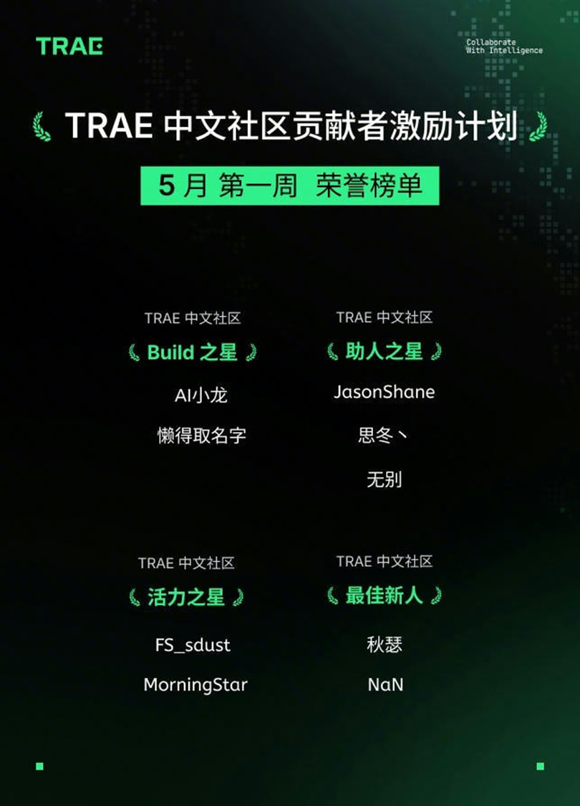
*图 7.1：Trae IDE Community Star 社区认证。*

> 数据来源：Trae IDE 社区官方公布。

---

## 独立核验

本报告中的 Agent 能力声明均可通过以下路径独立验证。附录 D「核验材料与代表案例」提供材料导航，Agent 25 题样例包可用于逐项抽查。

### 工程化展示与复核入口

本项目采用本地 Demo、云端 Demo 与 CLI 三种复核入口；本报告重点复核 Intent 识别、DAG 规划、资源调度、日志回放与失败恢复。本地 Demo 展示真实前后端如何读取本地日志、回放 Agent 步骤并切换资源策略；云端 Demo 展示公开任务的规划结果、DAG 和摘要页面，使系统形态可以被快速理解。二者共同说明 Agent 不是静态截图：它既能在私有环境中复核执行证据，也能在公开入口中快速呈现交互体验。

| 入口 | 用途 | 边界 |
|:---|:---|:---|
| 本地 Demo：`.\run_frontend.ps1 -StartBackend` | 启动真实前后端，查看 Agent 计划、执行步骤、资源策略和产物回放 | 验证完整系统复核、本地长任务、失败恢复、日志追溯和私有资源调度能力 |
| 云端 Demo：[https://demo.askiler.com/](https://demo.askiler.com/)；访问码：`ControlMind@2026` | 快速查看公开任务规划、页面流程、DAG 展示和摘要结果 | 降低公开体验门槛，只承载公开或脱敏材料展示，不把长任务飞轮伪装成公网实时执行 |
| CLI：`.\run_reviewer_demo.ps1 -Track 2` / `controlmind track2 validate --artifact all` | 快速验证 intent registry、dry-run、来源产物和验收入口 | 与附录 A、附录 D、结构化日志和 DATA-TRACE 对齐 |

| 步骤 | 操作 | 对应文件 / 命令 | 核验重点 | 耗时 |
|:----|:-----|:--------------|:------------:|:---:|
| 1 | 项目材料导航 | `quickstart.md` → Agent 验证路径 | Agent 能力、来源产物与验收入口总览 | 3 min |
| 2 | 25 题抽样验证（含失败恢复、降级案例）| `shared/track2_agent_20_cases.md`，逐题对照 Intent / Agent Plan / Tool calls / Output / Recovery flow | 每题标注相关证据项 | 5 min |
| 3 | 一键复现核心指标 | `.\run_reviewer_demo.ps1 -Track 2` | Agent 验收测试 | 2 s |
| 4 | CLI 来源产物核验 | `controlmind track2 validate --artifact all` | 统一核验数据飞轮、评测、索引、验收包和视觉审计产物 | 5-20 s |

**API + 5090 混合架构原则**：四轨推理引擎在单张 RTX 5090 上部署；API 负责公开或脱敏任务中的 Intent 路由、Judge 仲裁和误差分析，本地轨道负责文本推理、嵌入检索、公式识别、医学图片描述、私有原文解析、chunk 索引与微调样本处理，并通过 ResourceScheduler 与 `data_policy` 统一调度。

---

## 附录 A：数据追溯索引

本报告中引用的所有量化数字与其权威源文件的对应关系如下。每个数字均可通过对应命令复现。

| # | 声明值 | 口径 | 权威源文件 |
|:-:|:------|:----|:----------|
| 1 | 362 文档 | corpus/metadata.json total_docs | `metadata.json` |
| 2 | 23 教材 / 339 arXiv | corpus/metadata.json | `metadata.json` |
| 3 | 28,514 chunk（磁盘 glob） | multimodal_chunks.json total_chunks_on_disk | `multimodal_chunks.json` |
| 4 | 253,012 公式 / 196,127 行内 + 56,885 块级 | corpus_stats.json | `corpus_stats.json` |
| 5 | 11,554 图片 | corpus_stats.json total_images | `corpus_stats.json` |
| 6 | 4,996 共现 chunk（17.52%）| multimodal_chunks.json | `multimodal_chunks.json` |
| 7 | 500 题 / A=B=C=D=125 | core.json meta.total_questions | `core.json` |
| 8 | 15 题飞轮 | flywheel_filtered.json | `flywheel_filtered.json` |
| 9 | 515 合并总题数 | leaderboard.json models[-1].total_questions | `leaderboard.json` |
| 10 | deepseek-v4-flash 0.6431（500 题）| leaderboard.json models[2].overall_score | `leaderboard.json` |
| 11 | 飞轮 15 题 0.1400 | leaderboard.json models[4].overall_score | `leaderboard.json` |
| 12 | 飞轮与原 500 题差距：0.14 vs 0.64 | leaderboard.json models[2] vs models[4] | `leaderboard.json` |
| 13 | QLoRA 4B overall=0.4635 | eval_finetuned_report.json | `eval_finetuned_report.json` |
| 14 | PPL 4B -53.6%（8.4→3.9）| perplexity_delta.json | `perplexity_delta.json` |
| 15 | PPL 9B -38.3%（6.48→4.0）| perplexity_delta_9b.json | `perplexity_delta_9b.json` |
| 16 | C 维 4B Δ=+0.0000 | eval_baseline_4b + eval_finetuned dimension_scores | 双源对比 |
| 17 | 跨管道 MAE=0.0003 | `benchmark/eval/results/leaderboard_complete.json` + `benchmark/eval/results/judge_matrix/api_8judge_consolidated.json` | 原始 JSON 双管道对齐复算 |
| 18 | 双重身份 Pearson r=0.999991 | `benchmark/eval/results/leaderboard_complete.json` + `benchmark/eval/results/judge_matrix/api_8judge_consolidated.json` | 图为展示产物；数值由两个 JSON 复算 |
| 19 | 飞轮耗时 391s | `benchmark/agent/agent_report.md` 与 `docs/submissions/shared/track2_agent_20_cases.md` 记录该值来自 CLI 输出；`benchmark/agent/logs/demo-data-flywheel.json`、`benchmark/dataset/flywheel_filtered.json`、`benchmark/eval/results/flywheel_eval_deepseek.json` 可交叉验证执行产物完整 | 工程实测记录值；stdout/stderr 未单独归档 |
| 20 | 跨模态对齐 79.3%（一致率 75.9%）| cross_modal_audit_summary.json | `cross_modal_audit_summary.json` |
| 21 | MinerU 1.2B vs MiMo 公式对比 | `benchmark/agent/results/bench_mineru_1.2b_checkpoint.json` | 42 条 `mineru_latex` 非空样本复算均值；分析 md 仅作导航 |
| 22 | 本地 Judge 6 模型评分 | `benchmark/eval/results/judge_matrix/local_6judge_consolidated.json` + `benchmark/eval/results/judge_matrix/*_sample_judge.json` | 本地 6 Judge 原始评分与汇总 JSON |
| 23 | 灾难性遗忘 9B 0.6249→0.011 零分率 99% | `finetune/output/eval_finetuned_report.json` baseline + `finetune/output/eval_finetuned_9b_report.json` + `finetune/output/perplexity_delta_9b.json` | 9B 基座/QLoRA 评测与 PPL 原始 JSON |
| 24 | LoRA 跨尺寸移植 4B 0.467→0.464 | `finetune/output/eval_baseline_4b_report.json` + `finetune/output/eval_finetuned_report.json` | 4B baseline 与 9B adapter 跨尺寸加载评测 JSON |
| 25 | 核心 Agent 代码 1,464+662+520 行 | 文件行数统计 | `.py` 文件 |
| 26 | API Token DeepSeek ~500K + MiMo ~11.1M (9,227 images) + MiniMax ~50K | 管线日志累计 | — |
| 27 | GPU — QLoRA 4B ~14min + 9B ~50min + Judge ~6h | 分阶段训练/评测/分析日志 | — |
| 28 | 故障恢复 62ms | demo-local-gpu-fallback.md | Agent 日志 |
| 29 | 三 Judge Fleiss' κ=0.575（P̄=0.827, P̄ₑ=0.593）| `benchmark/eval/reports/cross_judge_kappa.json` | 30 题三 Judge 交叉验证原始 JSON |
| 30 | 质量审计 Overall=4.17/5.0（清晰度 4.18 / 正确性 4.30 / 难度对齐 3.60 / 维度匹配 4.62）| `benchmark/eval/reports/quality_audit.json` | 50 题抽样审计原始 JSON |
| 31 | 35B elastic scaling 延迟：4B 46.3s / 9B 54.7s / 35B 128.2s | demo-35b-elastic-proof.json | Agent 执行日志 |
| 32 | 自我修正实验：20 题 50% 成功率，均分 0.10→0.452（A 维 80%），3 例 Δ=+1.00 | `benchmark/eval/results/self_correction_results.json` + `benchmark/eval/results/self_correction_candidates.json` | 修正前后逐题分数与候选集 JSON；md 仅作展示报告 |
| 33 | 9 模型 Kruskal-Wallis H=89.95（p<0.001），Dunn's post-hoc 13/36 显著 | `benchmark/eval/t2_deep_analysis.py` + `benchmark/eval/results/judge_matrix/*.json` + `benchmark/eval/results/analysis/a6_*.json` | 统计检验由脚本从原始评分 JSON 复算；md 仅作分析导航 |
| 34 | 失败分析 48 case：概念混淆 23 / 推理断裂 10 / 设计发散 10 / 条件盲区 5 | `benchmark/eval/results/failure_analysis.json` | 48 case 抽样分类原始 JSON |
| 35 | think on/off 对照实验：35B 10 题 B/D 维 Δ=+0.195（think=false 0.200→think=true 0.395）| `benchmark/eval/results/think_probe_35b_10queries.json` | `conda run --no-capture-output -n myenv python benchmark/eval/think_probe.py` |
| 36 | 本地 dry-run DAG 与复现入口：8 步 DAG 展开，`reproduce_all` final_status=`completed` | `data_trace_bundle/12_final_supplemental_experiments/track2_fallback/local_dry_run_trace.json` + `data_trace_bundle/12_final_supplemental_experiments/track2_fallback/reproduce_all_dry_run_trace.json` | 读取 structured trace 的 `steps[]`、`final_status`；所有步骤为 dry-run skipped，不声明长任务重跑 |
| 37 | **Sciverse** Intent 注册：14→15，`agent_capabilities.json` | `benchmark/agent/agent_capabilities.json` | 读取 `total_intents`、`sciverse_search` intent 定义 |
| 38 | **Sciverse** 三源检索对比：5 query，avg 708 万篇 | `benchmark/eval/results/sciverse_source_comparison.json` | 通过 `conda run --no-capture-output -n myenv python -m benchmark.agent.source_comparison` 复现 |
| 39 | **Sciverse** 三源自主选择 Show Case：5 组查询，决策矩阵，avg 1,959 万篇 | `benchmark/eval/results/sciverse_source_selection_showcase.json` | 通过 `conda run --no-capture-output -n myenv python -m benchmark.agent.source_selection_showcase` 复现 |
| 40 | **Sciverse** 跨源 QLoRA 微调：Sciverse 14 篇微调后 PPL 19.8→4.3 (-78.3%)，Agent 离线训练链路验证 | `benchmark/eval/results/sciverse_qlora_train_ppl.json` | 通过 `conda run --no-capture-output -n myenv python -m benchmark.sciverse_qlora_train` 复现 |
| 41 | **Sciverse** Agent 飞轮：3 条查询 3/3 成功，15 hits，ExecutionLog trace，sciverse_search 进入 Agent DAG | `benchmark/agent/logs/d15_sciverse_flywheel_trace.json` | 通过 `conda run --no-capture-output -n myenv python -m benchmark.agent.d15_sciverse_flywheel` 复现 |

> **复现命令**：所有已审计验证的条目可在 `shared/DATA-TRACE.md` 中找到完整的可复现命令。

## 附录 B：外部依赖

| 组件 | 用途 | 部署方式 | 版本参考 |
|:-----|:-----|:--------|:--------|
| MinerU（1.2B VLM）| 文档解析 + 公式识别 | WSL2 + Docker + vLLM | 最新 |
| MiMo-V2.5 | 跨模态视觉审计 + LLM-as-Judge | API（远端） | — |
| DeepSeek v4-flash / v4-pro | 通用推理、出题、仲裁 | API（远端） | — |
| Ollama | 本地推理（qwen3.5:4b/9b/35b + gemma3:4b）| 本地进程 | Ollama latest |
| qwen3-embedding:4b | 嵌入分析（2,560 维）| Ollama 本地 | — |
| 1.2B VLM（MinerU）| 公式识别专用 | WSL2 + vLLM | — |
| MiniMax-M2.5 / M2.7 | 交叉验证 | API（远端） | — |
| Typer / Rich | `controlmind` 命令树、JSON 输出、验收协议 | Python CLI | — |
| Node.js / pnpm | 本地 Web Demo 前端依赖管理；核心 CLI 不依赖 npm 包 | Node >= 18 | — |

**安全策略**：所有 API Key 仅通过 `os.getenv()` 读取，密钥前缀扫描零硬编码。

## 附录 C：运行日志索引

Agent 每次独立运行产出结构化日志，所有日志采用统一 `LogStep` schema（`log_schema.py`），含 meta / steps / summary 三层结构，确保可独立提取审计。以下为报告中引用的关键运行日志及对应章节：

| 日志 | 描述 | 报告引用 |
|:----|:----|:--------|
| `demo-data-flywheel.json` | D 数据飞轮摘要日志（步骤产物；391s 见附录 A #19） | §3.5（案例1） |
| `demo-local-gpu-fallback-20260509-0116.md` | Ollama 未启动 → script 降级（62ms） | §3.5（案例5） |
| `demo-35b-elastic-proof.json` | 4B→9B→35B 弹性伸缩证据（46→55→128s） | §5.6 |
| `demo-vllm-mineru-1.2b-*.json`（11 个） | vLLM MinerU 1.2B VLM 公式识别对比 | §2.5 / §4.4.2 |
| `demo-multi-format-20260510-1917.json` | PPTX/PNG/DOCX/XLSX 四格式解析对比 | §2.2 / §3.5（案例4） |
| `_verify_10_intents.py` 验收日志 | intent 注册与多维度验收测试全通过 | §3.1 |
| `visual_audit_results.jsonl` | 跨模态全量审计结果（9,227 条判决） | §2.3 / §3.5（案例2） |
| `qlora-9b-training-demo.md` | 9B QLoRA 微调 + 灾难性遗忘实验过程导航；数值源见附录 A #23-24 | §4.3.2 |
| `scoring_anti_scaling_law.md` | 本地 Judge 反规模定律分析导航；数值源见附录 A #22 | §4.2.2 |
| `leaderboard_complete.json` + `api_8judge_consolidated.json` | Leaderboard ↔ Consolidated 双管道评分比对源文件；数值源见附录 A #17 | §4.1 |

日志内容包含本方向提交要求中的所有关键字段：任务输入、执行步骤、调用工具信息、最终输出结果。所有日志路径以项目根目录 `benchmark/agent/logs/` 为基准。

---

## 附录 D：核验材料与代表案例

本附录摘录 Agent 核验所需的关键执行案例、日志产物和部署边界；完整原始文件作为备份保留。

### D.1 Agent 执行案例摘录

| 样例 | 类型 | Intent / 机制 | 输入或触发 | 产物 / 结果 | 核验文件 |
|:---|:---|:---|:---|:---|:---|
| N-01 | 普通执行 | `arxiv_search` | 自然语言检索 2025 CBF 与 differentiable MPC 论文 | 下载 5 篇公开 PDF 到本地来源目录 | `benchmark/agent/logs/demo-data-flywheel.json` |
| N-02 | 普通执行 | `mineru_parse` | 5 篇 arXiv PDF | 5/5 解析成功，生成 Markdown、公式与图片产物 | `data/sources_flywheel/` |
| N-04 | 数据构建 | `benchmark_build` | 47 个候选 chunk | 生成 15 道候选题并进入后续质量处理 | `benchmark/agent/logs/demo-data-flywheel.json` |
| N-05 | 质量仲裁 | `quality_arbitrate` | 360 条候选题 | 354 条通过，pass rate 98.3% | `examples/logs/task_2_arbitrate.json` |
| N-08 | 多格式处理 | `multi_format_parse` | PPTX / PNG / DOCX / XLSX | 194 个 chunk，四类格式均 PASS | `benchmark/agent/logs/demo-multi-format-20260510-1917.json` |
| N-09 | 跨模态审计 | `cross_modal_audit` | 10 条快速审计样例 | 60% consistent，30% partial，10% inconsistent | `benchmark/agent/logs/agent-20260509-021603.json` |
| N-10 | 弹性伸缩 | ResourceScheduler | 4B / 9B / 35B 推理资源切换 | 延迟 46.3s / 54.7s / 128.2s，资源策略可回放 | `benchmark/agent/logs/demo-35b-elastic-proof.json` |
| FR-11 | 故障恢复 | Provider fallback | Ollama HTTP 502 | 62ms 内降级到脚本路径并返回质量报告 | `benchmark/agent/logs/demo-local-gpu-fallback-20260509-0116.md` |
| FR-12 | 步骤恢复 | Self-improve safety net | 中间步骤失败或输出不满足 schema | 进入可审计修正路径，保留原始失败与修正记录 | `shared/track2_agent_20_cases.md` |
| FR-13 | 文件级恢复 | MinerU parse skip | 单个脏文件解析失败 | 跳过失败文件并继续处理其余输入 | `shared/track2_agent_20_cases.md` |

### D.2 日志与复现摘录

| 产物 | 摘录内容 | 作用 |
|:---|:---|:---|
| `demo-data-flywheel.json` | 飞轮摘要与关键产物；391s 见附录 A #19 | 验证从检索、下载、解析到候选题生成的闭环执行 |
| `demo-local-gpu-fallback-20260509-0116.md` | 62ms 降级恢复 | 验证本地 provider 异常时可进入确定性 fallback |
| `demo-35b-elastic-proof.json` | 4B→9B→35B 资源切换 | 验证同一任务可按预算与能力选择不同模型路径 |
| `demo-multi-format-20260510-1917.json` | PPTX / PNG / DOCX / XLSX 四格式解析 | 验证 Agent 输入不局限于 PDF |
| `visual_audit_results.jsonl` | 9,227 条跨模态判决 | 支撑图文一致性审计与批量判定 |
| `_verify_10_intents.py` | intent 注册与验收 | 验证核心 intent 能被统一入口发现和调用 |
| 附录 A #17 | MAE=0.0003 | 验证两套评分产物高度一致；源文件为 `leaderboard_complete.json` 与 `api_8judge_consolidated.json` |

### D.3 部署与验收摘要

| 入口 | 核验内容 | 预期结果 |
|:---|:---|:---|
| `controlmind wrapper-doctor` | 项目根目录、Python runtime、npm 启动壳与 CLI 入口 | 运行环境可定位、可执行 |
| `controlmind track2 validate --artifact all` | 关键日志、样例、产物与报告引用 | 产物存在且结构可读 |
| `.\run_reviewer_demo.ps1 -Track 2` | intent registry、dry-run 与最小闭环 | 快速返回可核验摘要 |
| `benchmark/agent/logs/` | 结构化执行日志 | 每次运行含 meta / steps / summary 三层信息 |

### D.4 云端演示边界

云端 Demo 中的 Agent 页面用于展示公开任务规划、DAG、资源策略和产物回放，不把长任务飞轮伪装成公网实时执行。完整 Agent 能力仍通过结构化日志、CLI、DATA-TRACE 和本报告正文案例复核。

### D.5 完整备份文件索引

以下文件作为深度复核备份保留。

| 材料 | 材料作用 | 核心内容 |
|:---|:---|:---|
| `shared/minimal_repro_results.md` | 最小闭环摘要 | Agent dry-run、intent 注册校验、10 题真实评测、leaderboard 生成与 Medical RAG API health/search 联合验证已完成 |
| `quickstart.md` | 材料导航摘要 | 按 Agent 规划、来源产物核验、失败恢复案例、统一 CLI 验收四步核查 |
| `shared/cloud_demo_walkthrough.md` | 云端演示摘要 | 3-5 分钟导览顺序，说明 Agent 页面在云端展示规划和回放，长任务在完整系统复核 |
| `shared/verifiable_source_matrix.md` | 来源矩阵 | 将本报告的痛点、方法论、实验日志和云端展示逐项对齐，形成统一的公开说明 |
| `shared/public_cloud_boundary.md` | 公开边界说明 | 明确云端 Demo 与完整系统的数据边界、执行边界和展示边界，避免把私有资源调度误解为公网能力 |
| `shared/track2_agent_20_cases.md` | 代表案例摘要 | 20 个案例覆盖 Intent 识别、DAG 规划、工具调用、产物输出、失败恢复与降级路径 |
| `shared/DATA-TRACE.md` | 数据溯源摘要 | 报告关键数字均有权威源文件与复现命令；本报告附录 A 已摘录 35 条核心条目 |
| `docs/submissions/data_trace_bundle/manifest.json` | 产物清单摘要 | 汇总报告、日志、图表、样例和验收包，便于离线复核 |
